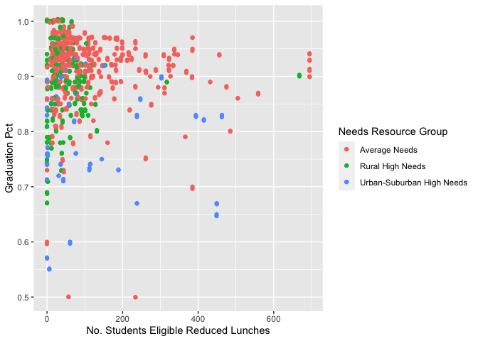

Effect of COVID-19 on Learning Regression in New York State
================

Analysis of graduation rate in 2020 school year of 4-year cohort
students in NY state

# Introduction

COVID-19 had a big impact on student learning during the 2020 school
year in New York State and throughout the United States and the rest of
the world. This analysis will focus on learning regression among
school-age children in New York State. Learning regression is defined as
a decline in student learning as measured by gradation rate. This
analysis will explore potential explanatory variables that may be
associated with graduation rate in the 2020 New York Department of
Education database. The dependent variable is graduation rate. The
number of free and reduced price lunches among school-aged children in
New York State will be analyzed for a potential association with
graduation rate.

## Dataset

This dataset consists of the New York State graduation rate data and the
number of free and reduced price lunches for school-aged children for
school year 2019-2020. The data is sourced from the New York state
department of education. In New York state, a student qualifies for free
lunch if his/her family income is at or below $38,000 dollars a year for
family size of four or less. Students from families (size four or less)
earning up to $48,000 per year qualify for reduced price lunches.

``` r
df_ny_school_data$nrc_desc <- ifelse(df_ny_school_data$nrc_code=='2', 'Other', df_ny_school_data$nrc_desc)
```

``` r
df_ny_school_data[which(df_ny_school_data$nrc_code==2),]
```

<div data-pagedtable="false">

<script data-pagedtable-source type="application/json">
{"columns":[{"label":[""],"name":["_rn_"],"type":[""],"align":["left"]},{"label":["report_school_year"],"name":[1],"type":["chr"],"align":["left"]},{"label":["lea_beds"],"name":[2],"type":["dbl"],"align":["right"]},{"label":["lea_name"],"name":[3],"type":["chr"],"align":["left"]},{"label":["nrc_code"],"name":[4],"type":["int"],"align":["right"]},{"label":["nrc_desc"],"name":[5],"type":["chr"],"align":["left"]},{"label":["county_code"],"name":[6],"type":["int"],"align":["right"]},{"label":["county_name"],"name":[7],"type":["chr"],"align":["left"]},{"label":["nyc_ind"],"name":[8],"type":["int"],"align":["right"]},{"label":["boces_code"],"name":[9],"type":["int"],"align":["right"]},{"label":["boces_name"],"name":[10],"type":["chr"],"align":["left"]},{"label":["membership_code"],"name":[11],"type":["int"],"align":["right"]},{"label":["membership_key"],"name":[12],"type":["int"],"align":["right"]},{"label":["membership_desc"],"name":[13],"type":["chr"],"align":["left"]},{"label":["subgroup_code"],"name":[14],"type":["int"],"align":["right"]},{"label":["subgroup_name"],"name":[15],"type":["chr"],"align":["left"]},{"label":["enroll_cnt"],"name":[16],"type":["int"],"align":["right"]},{"label":["grad_cnt"],"name":[17],"type":["int"],"align":["right"]},{"label":["grad_pct"],"name":[18],"type":["dbl"],"align":["right"]},{"label":["local_cnt"],"name":[19],"type":["chr"],"align":["left"]},{"label":["local_pct"],"name":[20],"type":["chr"],"align":["left"]},{"label":["reg_cnt"],"name":[21],"type":["chr"],"align":["left"]},{"label":["reg_pct"],"name":[22],"type":["chr"],"align":["left"]},{"label":["reg_adv_cnt"],"name":[23],"type":["chr"],"align":["left"]},{"label":["reg_adv_pct"],"name":[24],"type":["chr"],"align":["left"]},{"label":["non_diploma_credential_cnt"],"name":[25],"type":["chr"],"align":["left"]},{"label":["non_diploma_credential_pct"],"name":[26],"type":["chr"],"align":["left"]},{"label":["still_enr_cnt"],"name":[27],"type":["chr"],"align":["left"]},{"label":["still_enr_pct"],"name":[28],"type":["chr"],"align":["left"]},{"label":["ged_cnt"],"name":[29],"type":["chr"],"align":["left"]},{"label":["ged_pct"],"name":[30],"type":["chr"],"align":["left"]},{"label":["dropout_cnt"],"name":[31],"type":["chr"],"align":["left"]},{"label":["dropout_pct"],"name":[32],"type":["chr"],"align":["left"]},{"label":["ENTITY_CD"],"name":[33],"type":["dbl"],"align":["right"]},{"label":["NUM_FREE_LUNCH"],"name":[34],"type":["int"],"align":["right"]},{"label":["PER_FREE_LUNCH"],"name":[35],"type":["int"],"align":["right"]},{"label":["NUM_REDUCED_LUNCH"],"name":[36],"type":["int"],"align":["right"]},{"label":["PER_REDUCED_LUNCH"],"name":[37],"type":["int"],"align":["right"]},{"label":["ATTENDANCE_RATE"],"name":[38],"type":["int"],"align":["right"]}],"data":[{"1":"2019-20","2":"1.406e+11","3":"BUFFALO CITY SCHOOL DISTRICT","4":"2","5":"Other","6":"14","7":"ERIE","8":"0","9":"1491","10":"ERIE 1","11":"9","12":"154","13":"2016 Total Cohort - 4 Year Outcome","14":"1","15":"All Students","16":"7","17":"0","18":"0.00","19":"0","20":"0","21":"0","22":"0","23":"0","24":"0","25":"0","26":"0","27":"5","28":"0.71","29":"0","30":"0","31":"2","32":"0.28999999999999998","33":"1.406e+11","34":"24863","35":"81","36":"0","37":"0","38":"90","_rn_":"4819"},{"1":"2019-20","2":"1.406e+11","3":"BUFFALO CITY SCHOOL DISTRICT","4":"2","5":"Other","6":"14","7":"ERIE","8":"0","9":"1491","10":"ERIE 1","11":"9","12":"154","13":"2016 Total Cohort - 4 Year Outcome","14":"2","15":"Female","16":"2","17":"0","18":"0.00","19":"-","20":"-","21":"-","22":"-","23":"-","24":"-","25":"-","26":"-","27":"-","28":"-","29":"-","30":"-","31":"-","32":"-","33":"1.406e+11","34":"24863","35":"81","36":"0","37":"0","38":"90","_rn_":"4820"},{"1":"2019-20","2":"1.406e+11","3":"BUFFALO CITY SCHOOL DISTRICT","4":"2","5":"Other","6":"14","7":"ERIE","8":"0","9":"1491","10":"ERIE 1","11":"9","12":"154","13":"2016 Total Cohort - 4 Year Outcome","14":"3","15":"Male","16":"5","17":"0","18":"0.00","19":"-","20":"-","21":"-","22":"-","23":"-","24":"-","25":"-","26":"-","27":"-","28":"-","29":"-","30":"-","31":"-","32":"-","33":"1.406e+11","34":"24863","35":"81","36":"0","37":"0","38":"90","_rn_":"4821"},{"1":"2019-20","2":"1.406e+11","3":"BUFFALO CITY SCHOOL DISTRICT","4":"2","5":"Other","6":"14","7":"ERIE","8":"0","9":"1491","10":"ERIE 1","11":"9","12":"154","13":"2016 Total Cohort - 4 Year Outcome","14":"5","15":"Black","16":"2","17":"0","18":"0.00","19":"-","20":"-","21":"-","22":"-","23":"-","24":"-","25":"-","26":"-","27":"-","28":"-","29":"-","30":"-","31":"-","32":"-","33":"1.406e+11","34":"24863","35":"81","36":"0","37":"0","38":"90","_rn_":"4822"},{"1":"2019-20","2":"1.406e+11","3":"BUFFALO CITY SCHOOL DISTRICT","4":"2","5":"Other","6":"14","7":"ERIE","8":"0","9":"1491","10":"ERIE 1","11":"9","12":"154","13":"2016 Total Cohort - 4 Year Outcome","14":"6","15":"Hispanic","16":"2","17":"0","18":"0.00","19":"-","20":"-","21":"-","22":"-","23":"-","24":"-","25":"-","26":"-","27":"-","28":"-","29":"-","30":"-","31":"-","32":"-","33":"1.406e+11","34":"24863","35":"81","36":"0","37":"0","38":"90","_rn_":"4823"},{"1":"2019-20","2":"1.406e+11","3":"BUFFALO CITY SCHOOL DISTRICT","4":"2","5":"Other","6":"14","7":"ERIE","8":"0","9":"1491","10":"ERIE 1","11":"9","12":"154","13":"2016 Total Cohort - 4 Year Outcome","14":"7","15":"Asian/Pacific Islander","16":"2","17":"0","18":"0.00","19":"-","20":"-","21":"-","22":"-","23":"-","24":"-","25":"-","26":"-","27":"-","28":"-","29":"-","30":"-","31":"-","32":"-","33":"1.406e+11","34":"24863","35":"81","36":"0","37":"0","38":"90","_rn_":"4824"},{"1":"2019-20","2":"1.406e+11","3":"BUFFALO CITY SCHOOL DISTRICT","4":"2","5":"Other","6":"14","7":"ERIE","8":"0","9":"1491","10":"ERIE 1","11":"9","12":"154","13":"2016 Total Cohort - 4 Year Outcome","14":"8","15":"White","16":"1","17":"0","18":"0.00","19":"-","20":"-","21":"-","22":"-","23":"-","24":"-","25":"-","26":"-","27":"-","28":"-","29":"-","30":"-","31":"-","32":"-","33":"1.406e+11","34":"24863","35":"81","36":"0","37":"0","38":"90","_rn_":"4825"},{"1":"2019-20","2":"1.406e+11","3":"BUFFALO CITY SCHOOL DISTRICT","4":"2","5":"Other","6":"14","7":"ERIE","8":"0","9":"1491","10":"ERIE 1","11":"9","12":"154","13":"2016 Total Cohort - 4 Year Outcome","14":"11","15":"Students with Disabilities","16":"7","17":"0","18":"0.00","19":"0","20":"0","21":"0","22":"0","23":"0","24":"0","25":"0","26":"0","27":"5","28":"0.71","29":"0","30":"0","31":"2","32":"0.28999999999999998","33":"1.406e+11","34":"24863","35":"81","36":"0","37":"0","38":"90","_rn_":"4826"},{"1":"2019-20","2":"1.406e+11","3":"BUFFALO CITY SCHOOL DISTRICT","4":"2","5":"Other","6":"14","7":"ERIE","8":"0","9":"1491","10":"ERIE 1","11":"9","12":"154","13":"2016 Total Cohort - 4 Year Outcome","14":"12","15":"Not English Language Learner","16":"4","17":"0","18":"0.00","19":"-","20":"-","21":"-","22":"-","23":"-","24":"-","25":"-","26":"-","27":"-","28":"-","29":"-","30":"-","31":"-","32":"-","33":"1.406e+11","34":"24863","35":"81","36":"0","37":"0","38":"90","_rn_":"4827"},{"1":"2019-20","2":"1.406e+11","3":"BUFFALO CITY SCHOOL DISTRICT","4":"2","5":"Other","6":"14","7":"ERIE","8":"0","9":"1491","10":"ERIE 1","11":"9","12":"154","13":"2016 Total Cohort - 4 Year Outcome","14":"13","15":"English Language Learner","16":"3","17":"0","18":"0.00","19":"-","20":"-","21":"-","22":"-","23":"-","24":"-","25":"-","26":"-","27":"-","28":"-","29":"-","30":"-","31":"-","32":"-","33":"1.406e+11","34":"24863","35":"81","36":"0","37":"0","38":"90","_rn_":"4828"},{"1":"2019-20","2":"1.406e+11","3":"BUFFALO CITY SCHOOL DISTRICT","4":"2","5":"Other","6":"14","7":"ERIE","8":"0","9":"1491","10":"ERIE 1","11":"9","12":"154","13":"2016 Total Cohort - 4 Year Outcome","14":"15","15":"Economically Disadvantaged","16":"6","17":"0","18":"0.00","19":"-","20":"-","21":"-","22":"-","23":"-","24":"-","25":"-","26":"-","27":"-","28":"-","29":"-","30":"-","31":"-","32":"-","33":"1.406e+11","34":"24863","35":"81","36":"0","37":"0","38":"90","_rn_":"4829"},{"1":"2019-20","2":"1.406e+11","3":"BUFFALO CITY SCHOOL DISTRICT","4":"2","5":"Other","6":"14","7":"ERIE","8":"0","9":"1491","10":"ERIE 1","11":"9","12":"154","13":"2016 Total Cohort - 4 Year Outcome","14":"16","15":"Not Economically Disadvantaged","16":"1","17":"0","18":"0.00","19":"-","20":"-","21":"-","22":"-","23":"-","24":"-","25":"-","26":"-","27":"-","28":"-","29":"-","30":"-","31":"-","32":"-","33":"1.406e+11","34":"24863","35":"81","36":"0","37":"0","38":"90","_rn_":"4830"},{"1":"2019-20","2":"1.406e+11","3":"BUFFALO CITY SCHOOL DISTRICT","4":"2","5":"Other","6":"14","7":"ERIE","8":"0","9":"1491","10":"ERIE 1","11":"9","12":"154","13":"2016 Total Cohort - 4 Year Outcome","14":"18","15":"Not Migrant","16":"7","17":"0","18":"0.00","19":"0","20":"0","21":"0","22":"0","23":"0","24":"0","25":"0","26":"0","27":"5","28":"0.71","29":"0","30":"0","31":"2","32":"0.28999999999999998","33":"1.406e+11","34":"24863","35":"81","36":"0","37":"0","38":"90","_rn_":"4831"},{"1":"2019-20","2":"1.406e+11","3":"BUFFALO CITY SCHOOL DISTRICT","4":"2","5":"Other","6":"14","7":"ERIE","8":"0","9":"1491","10":"ERIE 1","11":"9","12":"154","13":"2016 Total Cohort - 4 Year Outcome","14":"21","15":"Not Homeless","16":"7","17":"0","18":"0.00","19":"0","20":"0","21":"0","22":"0","23":"0","24":"0","25":"0","26":"0","27":"5","28":"0.71","29":"0","30":"0","31":"2","32":"0.28999999999999998","33":"1.406e+11","34":"24863","35":"81","36":"0","37":"0","38":"90","_rn_":"4832"},{"1":"2019-20","2":"1.406e+11","3":"BUFFALO CITY SCHOOL DISTRICT","4":"2","5":"Other","6":"14","7":"ERIE","8":"0","9":"1491","10":"ERIE 1","11":"9","12":"154","13":"2016 Total Cohort - 4 Year Outcome","14":"23","15":"Not in Foster Care","16":"7","17":"0","18":"0.00","19":"0","20":"0","21":"0","22":"0","23":"0","24":"0","25":"0","26":"0","27":"5","28":"0.71","29":"0","30":"0","31":"2","32":"0.28999999999999998","33":"1.406e+11","34":"24863","35":"81","36":"0","37":"0","38":"90","_rn_":"4833"},{"1":"2019-20","2":"1.406e+11","3":"BUFFALO CITY SCHOOL DISTRICT","4":"2","5":"Other","6":"14","7":"ERIE","8":"0","9":"1491","10":"ERIE 1","11":"9","12":"154","13":"2016 Total Cohort - 4 Year Outcome","14":"25","15":"Parent Not in Armed Forces","16":"7","17":"0","18":"0.00","19":"0","20":"0","21":"0","22":"0","23":"0","24":"0","25":"0","26":"0","27":"5","28":"0.71","29":"0","30":"0","31":"2","32":"0.28999999999999998","33":"1.406e+11","34":"24863","35":"81","36":"0","37":"0","38":"90","_rn_":"4834"},{"1":"2019-20","2":"1.406e+11","3":"BUFFALO CITY SCHOOL DISTRICT","4":"2","5":"Other","6":"14","7":"ERIE","8":"0","9":"1491","10":"ERIE 1","11":"11","12":"156","13":"2016 Total Cohort - 4 Year Outcome - August 2020","14":"1","15":"All Students","16":"7","17":"0","18":"0.00","19":"0","20":"0","21":"0","22":"0","23":"0","24":"0","25":"0","26":"0","27":"5","28":"0.71","29":"0","30":"0","31":"2","32":"0.28999999999999998","33":"1.406e+11","34":"24863","35":"81","36":"0","37":"0","38":"90","_rn_":"4835"},{"1":"2019-20","2":"1.406e+11","3":"BUFFALO CITY SCHOOL DISTRICT","4":"2","5":"Other","6":"14","7":"ERIE","8":"0","9":"1491","10":"ERIE 1","11":"11","12":"156","13":"2016 Total Cohort - 4 Year Outcome - August 2020","14":"2","15":"Female","16":"2","17":"0","18":"0.00","19":"-","20":"-","21":"-","22":"-","23":"-","24":"-","25":"-","26":"-","27":"-","28":"-","29":"-","30":"-","31":"-","32":"-","33":"1.406e+11","34":"24863","35":"81","36":"0","37":"0","38":"90","_rn_":"4836"},{"1":"2019-20","2":"1.406e+11","3":"BUFFALO CITY SCHOOL DISTRICT","4":"2","5":"Other","6":"14","7":"ERIE","8":"0","9":"1491","10":"ERIE 1","11":"11","12":"156","13":"2016 Total Cohort - 4 Year Outcome - August 2020","14":"3","15":"Male","16":"5","17":"0","18":"0.00","19":"-","20":"-","21":"-","22":"-","23":"-","24":"-","25":"-","26":"-","27":"-","28":"-","29":"-","30":"-","31":"-","32":"-","33":"1.406e+11","34":"24863","35":"81","36":"0","37":"0","38":"90","_rn_":"4837"},{"1":"2019-20","2":"1.406e+11","3":"BUFFALO CITY SCHOOL DISTRICT","4":"2","5":"Other","6":"14","7":"ERIE","8":"0","9":"1491","10":"ERIE 1","11":"11","12":"156","13":"2016 Total Cohort - 4 Year Outcome - August 2020","14":"5","15":"Black","16":"2","17":"0","18":"0.00","19":"-","20":"-","21":"-","22":"-","23":"-","24":"-","25":"-","26":"-","27":"-","28":"-","29":"-","30":"-","31":"-","32":"-","33":"1.406e+11","34":"24863","35":"81","36":"0","37":"0","38":"90","_rn_":"4838"},{"1":"2019-20","2":"1.406e+11","3":"BUFFALO CITY SCHOOL DISTRICT","4":"2","5":"Other","6":"14","7":"ERIE","8":"0","9":"1491","10":"ERIE 1","11":"11","12":"156","13":"2016 Total Cohort - 4 Year Outcome - August 2020","14":"6","15":"Hispanic","16":"2","17":"0","18":"0.00","19":"-","20":"-","21":"-","22":"-","23":"-","24":"-","25":"-","26":"-","27":"-","28":"-","29":"-","30":"-","31":"-","32":"-","33":"1.406e+11","34":"24863","35":"81","36":"0","37":"0","38":"90","_rn_":"4839"},{"1":"2019-20","2":"1.406e+11","3":"BUFFALO CITY SCHOOL DISTRICT","4":"2","5":"Other","6":"14","7":"ERIE","8":"0","9":"1491","10":"ERIE 1","11":"11","12":"156","13":"2016 Total Cohort - 4 Year Outcome - August 2020","14":"7","15":"Asian/Pacific Islander","16":"2","17":"0","18":"0.00","19":"-","20":"-","21":"-","22":"-","23":"-","24":"-","25":"-","26":"-","27":"-","28":"-","29":"-","30":"-","31":"-","32":"-","33":"1.406e+11","34":"24863","35":"81","36":"0","37":"0","38":"90","_rn_":"4840"},{"1":"2019-20","2":"1.406e+11","3":"BUFFALO CITY SCHOOL DISTRICT","4":"2","5":"Other","6":"14","7":"ERIE","8":"0","9":"1491","10":"ERIE 1","11":"11","12":"156","13":"2016 Total Cohort - 4 Year Outcome - August 2020","14":"8","15":"White","16":"1","17":"0","18":"0.00","19":"-","20":"-","21":"-","22":"-","23":"-","24":"-","25":"-","26":"-","27":"-","28":"-","29":"-","30":"-","31":"-","32":"-","33":"1.406e+11","34":"24863","35":"81","36":"0","37":"0","38":"90","_rn_":"4841"},{"1":"2019-20","2":"1.406e+11","3":"BUFFALO CITY SCHOOL DISTRICT","4":"2","5":"Other","6":"14","7":"ERIE","8":"0","9":"1491","10":"ERIE 1","11":"11","12":"156","13":"2016 Total Cohort - 4 Year Outcome - August 2020","14":"11","15":"Students with Disabilities","16":"7","17":"0","18":"0.00","19":"0","20":"0","21":"0","22":"0","23":"0","24":"0","25":"0","26":"0","27":"5","28":"0.71","29":"0","30":"0","31":"2","32":"0.28999999999999998","33":"1.406e+11","34":"24863","35":"81","36":"0","37":"0","38":"90","_rn_":"4842"},{"1":"2019-20","2":"1.406e+11","3":"BUFFALO CITY SCHOOL DISTRICT","4":"2","5":"Other","6":"14","7":"ERIE","8":"0","9":"1491","10":"ERIE 1","11":"11","12":"156","13":"2016 Total Cohort - 4 Year Outcome - August 2020","14":"12","15":"Not English Language Learner","16":"4","17":"0","18":"0.00","19":"-","20":"-","21":"-","22":"-","23":"-","24":"-","25":"-","26":"-","27":"-","28":"-","29":"-","30":"-","31":"-","32":"-","33":"1.406e+11","34":"24863","35":"81","36":"0","37":"0","38":"90","_rn_":"4843"},{"1":"2019-20","2":"1.406e+11","3":"BUFFALO CITY SCHOOL DISTRICT","4":"2","5":"Other","6":"14","7":"ERIE","8":"0","9":"1491","10":"ERIE 1","11":"11","12":"156","13":"2016 Total Cohort - 4 Year Outcome - August 2020","14":"13","15":"English Language Learner","16":"3","17":"0","18":"0.00","19":"-","20":"-","21":"-","22":"-","23":"-","24":"-","25":"-","26":"-","27":"-","28":"-","29":"-","30":"-","31":"-","32":"-","33":"1.406e+11","34":"24863","35":"81","36":"0","37":"0","38":"90","_rn_":"4844"},{"1":"2019-20","2":"1.406e+11","3":"BUFFALO CITY SCHOOL DISTRICT","4":"2","5":"Other","6":"14","7":"ERIE","8":"0","9":"1491","10":"ERIE 1","11":"11","12":"156","13":"2016 Total Cohort - 4 Year Outcome - August 2020","14":"15","15":"Economically Disadvantaged","16":"6","17":"0","18":"0.00","19":"-","20":"-","21":"-","22":"-","23":"-","24":"-","25":"-","26":"-","27":"-","28":"-","29":"-","30":"-","31":"-","32":"-","33":"1.406e+11","34":"24863","35":"81","36":"0","37":"0","38":"90","_rn_":"4845"},{"1":"2019-20","2":"1.406e+11","3":"BUFFALO CITY SCHOOL DISTRICT","4":"2","5":"Other","6":"14","7":"ERIE","8":"0","9":"1491","10":"ERIE 1","11":"11","12":"156","13":"2016 Total Cohort - 4 Year Outcome - August 2020","14":"16","15":"Not Economically Disadvantaged","16":"1","17":"0","18":"0.00","19":"-","20":"-","21":"-","22":"-","23":"-","24":"-","25":"-","26":"-","27":"-","28":"-","29":"-","30":"-","31":"-","32":"-","33":"1.406e+11","34":"24863","35":"81","36":"0","37":"0","38":"90","_rn_":"4846"},{"1":"2019-20","2":"1.406e+11","3":"BUFFALO CITY SCHOOL DISTRICT","4":"2","5":"Other","6":"14","7":"ERIE","8":"0","9":"1491","10":"ERIE 1","11":"11","12":"156","13":"2016 Total Cohort - 4 Year Outcome - August 2020","14":"18","15":"Not Migrant","16":"7","17":"0","18":"0.00","19":"0","20":"0","21":"0","22":"0","23":"0","24":"0","25":"0","26":"0","27":"5","28":"0.71","29":"0","30":"0","31":"2","32":"0.28999999999999998","33":"1.406e+11","34":"24863","35":"81","36":"0","37":"0","38":"90","_rn_":"4847"},{"1":"2019-20","2":"1.406e+11","3":"BUFFALO CITY SCHOOL DISTRICT","4":"2","5":"Other","6":"14","7":"ERIE","8":"0","9":"1491","10":"ERIE 1","11":"11","12":"156","13":"2016 Total Cohort - 4 Year Outcome - August 2020","14":"21","15":"Not Homeless","16":"7","17":"0","18":"0.00","19":"0","20":"0","21":"0","22":"0","23":"0","24":"0","25":"0","26":"0","27":"5","28":"0.71","29":"0","30":"0","31":"2","32":"0.28999999999999998","33":"1.406e+11","34":"24863","35":"81","36":"0","37":"0","38":"90","_rn_":"4848"},{"1":"2019-20","2":"1.406e+11","3":"BUFFALO CITY SCHOOL DISTRICT","4":"2","5":"Other","6":"14","7":"ERIE","8":"0","9":"1491","10":"ERIE 1","11":"11","12":"156","13":"2016 Total Cohort - 4 Year Outcome - August 2020","14":"23","15":"Not in Foster Care","16":"7","17":"0","18":"0.00","19":"0","20":"0","21":"0","22":"0","23":"0","24":"0","25":"0","26":"0","27":"5","28":"0.71","29":"0","30":"0","31":"2","32":"0.28999999999999998","33":"1.406e+11","34":"24863","35":"81","36":"0","37":"0","38":"90","_rn_":"4849"},{"1":"2019-20","2":"1.406e+11","3":"BUFFALO CITY SCHOOL DISTRICT","4":"2","5":"Other","6":"14","7":"ERIE","8":"0","9":"1491","10":"ERIE 1","11":"11","12":"156","13":"2016 Total Cohort - 4 Year Outcome - August 2020","14":"25","15":"Parent Not in Armed Forces","16":"7","17":"0","18":"0.00","19":"0","20":"0","21":"0","22":"0","23":"0","24":"0","25":"0","26":"0","27":"5","28":"0.71","29":"0","30":"0","31":"2","32":"0.28999999999999998","33":"1.406e+11","34":"24863","35":"81","36":"0","37":"0","38":"90","_rn_":"4850"},{"1":"2019-20","2":"1.406e+11","3":"BUFFALO CITY SCHOOL DISTRICT","4":"2","5":"Other","6":"14","7":"ERIE","8":"0","9":"1491","10":"ERIE 1","11":"9","12":"154","13":"2016 Total Cohort - 4 Year Outcome","14":"1","15":"All Students","16":"105","17":"99","18":"0.94","19":"2","20":"0.02","21":"39","22":"0.37","23":"58","24":"0.55000000000000004","25":"6","26":"0.06","27":"0","28":"0","29":"0","30":"0","31":"0","32":"0","33":"1.406e+11","34":"24863","35":"81","36":"0","37":"0","38":"90","_rn_":"4851"},{"1":"2019-20","2":"1.406e+11","3":"BUFFALO CITY SCHOOL DISTRICT","4":"2","5":"Other","6":"14","7":"ERIE","8":"0","9":"1491","10":"ERIE 1","11":"9","12":"154","13":"2016 Total Cohort - 4 Year Outcome","14":"2","15":"Female","16":"59","17":"58","18":"0.98","19":"0","20":"0","21":"22","22":"0.37","23":"36","24":"0.61","25":"1","26":"0.02","27":"0","28":"0","29":"0","30":"0","31":"0","32":"0","33":"1.406e+11","34":"24863","35":"81","36":"0","37":"0","38":"90","_rn_":"4852"},{"1":"2019-20","2":"1.406e+11","3":"BUFFALO CITY SCHOOL DISTRICT","4":"2","5":"Other","6":"14","7":"ERIE","8":"0","9":"1491","10":"ERIE 1","11":"9","12":"154","13":"2016 Total Cohort - 4 Year Outcome","14":"3","15":"Male","16":"46","17":"41","18":"0.89","19":"2","20":"0.04","21":"17","22":"0.37","23":"22","24":"0.48","25":"5","26":"0.11","27":"0","28":"0","29":"0","30":"0","31":"0","32":"0","33":"1.406e+11","34":"24863","35":"81","36":"0","37":"0","38":"90","_rn_":"4853"},{"1":"2019-20","2":"1.406e+11","3":"BUFFALO CITY SCHOOL DISTRICT","4":"2","5":"Other","6":"14","7":"ERIE","8":"0","9":"1491","10":"ERIE 1","11":"9","12":"154","13":"2016 Total Cohort - 4 Year Outcome","14":"5","15":"Black","16":"34","17":"31","18":"0.91","19":"1","20":"0.03","21":"14","22":"0.41","23":"16","24":"0.47","25":"3","26":"0.09","27":"0","28":"0","29":"0","30":"0","31":"0","32":"0","33":"1.406e+11","34":"24863","35":"81","36":"0","37":"0","38":"90","_rn_":"4854"},{"1":"2019-20","2":"1.406e+11","3":"BUFFALO CITY SCHOOL DISTRICT","4":"2","5":"Other","6":"14","7":"ERIE","8":"0","9":"1491","10":"ERIE 1","11":"9","12":"154","13":"2016 Total Cohort - 4 Year Outcome","14":"6","15":"Hispanic","16":"9","17":"0","18":"0.00","19":"-","20":"-","21":"-","22":"-","23":"-","24":"-","25":"-","26":"-","27":"-","28":"-","29":"-","30":"-","31":"-","32":"-","33":"1.406e+11","34":"24863","35":"81","36":"0","37":"0","38":"90","_rn_":"4855"},{"1":"2019-20","2":"1.406e+11","3":"BUFFALO CITY SCHOOL DISTRICT","4":"2","5":"Other","6":"14","7":"ERIE","8":"0","9":"1491","10":"ERIE 1","11":"9","12":"154","13":"2016 Total Cohort - 4 Year Outcome","14":"7","15":"Asian/Pacific Islander","16":"20","17":"19","18":"0.95","19":"1","20":"0.05","21":"3","22":"0.15","23":"15","24":"0.75","25":"1","26":"0.05","27":"0","28":"0","29":"0","30":"0","31":"0","32":"0","33":"1.406e+11","34":"24863","35":"81","36":"0","37":"0","38":"90","_rn_":"4856"},{"1":"2019-20","2":"1.406e+11","3":"BUFFALO CITY SCHOOL DISTRICT","4":"2","5":"Other","6":"14","7":"ERIE","8":"0","9":"1491","10":"ERIE 1","11":"9","12":"154","13":"2016 Total Cohort - 4 Year Outcome","14":"8","15":"White","16":"38","17":"38","18":"1.00","19":"0","20":"0","21":"18","22":"0.47","23":"20","24":"0.53","25":"0","26":"0","27":"0","28":"0","29":"0","30":"0","31":"0","32":"0","33":"1.406e+11","34":"24863","35":"81","36":"0","37":"0","38":"90","_rn_":"4857"},{"1":"2019-20","2":"1.406e+11","3":"BUFFALO CITY SCHOOL DISTRICT","4":"2","5":"Other","6":"14","7":"ERIE","8":"0","9":"1491","10":"ERIE 1","11":"9","12":"154","13":"2016 Total Cohort - 4 Year Outcome","14":"9","15":"Multiracial","16":"4","17":"0","18":"0.00","19":"-","20":"-","21":"-","22":"-","23":"-","24":"-","25":"-","26":"-","27":"-","28":"-","29":"-","30":"-","31":"-","32":"-","33":"1.406e+11","34":"24863","35":"81","36":"0","37":"0","38":"90","_rn_":"4858"},{"1":"2019-20","2":"1.406e+11","3":"BUFFALO CITY SCHOOL DISTRICT","4":"2","5":"Other","6":"14","7":"ERIE","8":"0","9":"1491","10":"ERIE 1","11":"9","12":"154","13":"2016 Total Cohort - 4 Year Outcome","14":"10","15":"General Education Students","16":"91","17":"91","18":"1.00","19":"0","20":"0","21":"33","22":"0.36","23":"58","24":"0.64","25":"0","26":"0","27":"0","28":"0","29":"0","30":"0","31":"0","32":"0","33":"1.406e+11","34":"24863","35":"81","36":"0","37":"0","38":"90","_rn_":"4859"},{"1":"2019-20","2":"1.406e+11","3":"BUFFALO CITY SCHOOL DISTRICT","4":"2","5":"Other","6":"14","7":"ERIE","8":"0","9":"1491","10":"ERIE 1","11":"9","12":"154","13":"2016 Total Cohort - 4 Year Outcome","14":"11","15":"Students with Disabilities","16":"14","17":"8","18":"0.57","19":"2","20":"0.14000000000000001","21":"6","22":"0.43","23":"0","24":"0","25":"6","26":"0.43","27":"0","28":"0","29":"0","30":"0","31":"0","32":"0","33":"1.406e+11","34":"24863","35":"81","36":"0","37":"0","38":"90","_rn_":"4860"},{"1":"2019-20","2":"1.406e+11","3":"BUFFALO CITY SCHOOL DISTRICT","4":"2","5":"Other","6":"14","7":"ERIE","8":"0","9":"1491","10":"ERIE 1","11":"9","12":"154","13":"2016 Total Cohort - 4 Year Outcome","14":"12","15":"Not English Language Learner","16":"104","17":"0","18":"0.00","19":"-","20":"-","21":"-","22":"-","23":"-","24":"-","25":"-","26":"-","27":"-","28":"-","29":"-","30":"-","31":"-","32":"-","33":"1.406e+11","34":"24863","35":"81","36":"0","37":"0","38":"90","_rn_":"4861"},{"1":"2019-20","2":"1.406e+11","3":"BUFFALO CITY SCHOOL DISTRICT","4":"2","5":"Other","6":"14","7":"ERIE","8":"0","9":"1491","10":"ERIE 1","11":"9","12":"154","13":"2016 Total Cohort - 4 Year Outcome","14":"13","15":"English Language Learner","16":"1","17":"0","18":"0.00","19":"-","20":"-","21":"-","22":"-","23":"-","24":"-","25":"-","26":"-","27":"-","28":"-","29":"-","30":"-","31":"-","32":"-","33":"1.406e+11","34":"24863","35":"81","36":"0","37":"0","38":"90","_rn_":"4862"},{"1":"2019-20","2":"1.406e+11","3":"BUFFALO CITY SCHOOL DISTRICT","4":"2","5":"Other","6":"14","7":"ERIE","8":"0","9":"1491","10":"ERIE 1","11":"9","12":"154","13":"2016 Total Cohort - 4 Year Outcome","14":"14","15":"Formerly English Language Learner","16":"1","17":"0","18":"0.00","19":"-","20":"-","21":"-","22":"-","23":"-","24":"-","25":"-","26":"-","27":"-","28":"-","29":"-","30":"-","31":"-","32":"-","33":"1.406e+11","34":"24863","35":"81","36":"0","37":"0","38":"90","_rn_":"4863"},{"1":"2019-20","2":"1.406e+11","3":"BUFFALO CITY SCHOOL DISTRICT","4":"2","5":"Other","6":"14","7":"ERIE","8":"0","9":"1491","10":"ERIE 1","11":"9","12":"154","13":"2016 Total Cohort - 4 Year Outcome","14":"15","15":"Economically Disadvantaged","16":"50","17":"44","18":"0.88","19":"2","20":"0.04","21":"20","22":"0.4","23":"22","24":"0.44","25":"6","26":"0.12","27":"0","28":"0","29":"0","30":"0","31":"0","32":"0","33":"1.406e+11","34":"24863","35":"81","36":"0","37":"0","38":"90","_rn_":"4864"},{"1":"2019-20","2":"1.406e+11","3":"BUFFALO CITY SCHOOL DISTRICT","4":"2","5":"Other","6":"14","7":"ERIE","8":"0","9":"1491","10":"ERIE 1","11":"9","12":"154","13":"2016 Total Cohort - 4 Year Outcome","14":"16","15":"Not Economically Disadvantaged","16":"55","17":"55","18":"1.00","19":"0","20":"0","21":"19","22":"0.35","23":"36","24":"0.65","25":"0","26":"0","27":"0","28":"0","29":"0","30":"0","31":"0","32":"0","33":"1.406e+11","34":"24863","35":"81","36":"0","37":"0","38":"90","_rn_":"4865"},{"1":"2019-20","2":"1.406e+11","3":"BUFFALO CITY SCHOOL DISTRICT","4":"2","5":"Other","6":"14","7":"ERIE","8":"0","9":"1491","10":"ERIE 1","11":"9","12":"154","13":"2016 Total Cohort - 4 Year Outcome","14":"18","15":"Not Migrant","16":"105","17":"99","18":"0.94","19":"2","20":"0.02","21":"39","22":"0.37","23":"58","24":"0.55000000000000004","25":"6","26":"0.06","27":"0","28":"0","29":"0","30":"0","31":"0","32":"0","33":"1.406e+11","34":"24863","35":"81","36":"0","37":"0","38":"90","_rn_":"4866"},{"1":"2019-20","2":"1.406e+11","3":"BUFFALO CITY SCHOOL DISTRICT","4":"2","5":"Other","6":"14","7":"ERIE","8":"0","9":"1491","10":"ERIE 1","11":"9","12":"154","13":"2016 Total Cohort - 4 Year Outcome","14":"21","15":"Not Homeless","16":"105","17":"99","18":"0.94","19":"2","20":"0.02","21":"39","22":"0.37","23":"58","24":"0.55000000000000004","25":"6","26":"0.06","27":"0","28":"0","29":"0","30":"0","31":"0","32":"0","33":"1.406e+11","34":"24863","35":"81","36":"0","37":"0","38":"90","_rn_":"4867"},{"1":"2019-20","2":"1.406e+11","3":"BUFFALO CITY SCHOOL DISTRICT","4":"2","5":"Other","6":"14","7":"ERIE","8":"0","9":"1491","10":"ERIE 1","11":"9","12":"154","13":"2016 Total Cohort - 4 Year Outcome","14":"23","15":"Not in Foster Care","16":"105","17":"99","18":"0.94","19":"2","20":"0.02","21":"39","22":"0.37","23":"58","24":"0.55000000000000004","25":"6","26":"0.06","27":"0","28":"0","29":"0","30":"0","31":"0","32":"0","33":"1.406e+11","34":"24863","35":"81","36":"0","37":"0","38":"90","_rn_":"4868"},{"1":"2019-20","2":"1.406e+11","3":"BUFFALO CITY SCHOOL DISTRICT","4":"2","5":"Other","6":"14","7":"ERIE","8":"0","9":"1491","10":"ERIE 1","11":"9","12":"154","13":"2016 Total Cohort - 4 Year Outcome","14":"25","15":"Parent Not in Armed Forces","16":"105","17":"99","18":"0.94","19":"2","20":"0.02","21":"39","22":"0.37","23":"58","24":"0.55000000000000004","25":"6","26":"0.06","27":"0","28":"0","29":"0","30":"0","31":"0","32":"0","33":"1.406e+11","34":"24863","35":"81","36":"0","37":"0","38":"90","_rn_":"4869"},{"1":"2019-20","2":"1.406e+11","3":"BUFFALO CITY SCHOOL DISTRICT","4":"2","5":"Other","6":"14","7":"ERIE","8":"0","9":"1491","10":"ERIE 1","11":"11","12":"156","13":"2016 Total Cohort - 4 Year Outcome - August 2020","14":"1","15":"All Students","16":"105","17":"99","18":"0.94","19":"2","20":"0.02","21":"39","22":"0.37","23":"58","24":"0.55000000000000004","25":"6","26":"0.06","27":"0","28":"0","29":"0","30":"0","31":"0","32":"0","33":"1.406e+11","34":"24863","35":"81","36":"0","37":"0","38":"90","_rn_":"4870"},{"1":"2019-20","2":"1.406e+11","3":"BUFFALO CITY SCHOOL DISTRICT","4":"2","5":"Other","6":"14","7":"ERIE","8":"0","9":"1491","10":"ERIE 1","11":"11","12":"156","13":"2016 Total Cohort - 4 Year Outcome - August 2020","14":"2","15":"Female","16":"59","17":"58","18":"0.98","19":"0","20":"0","21":"22","22":"0.37","23":"36","24":"0.61","25":"1","26":"0.02","27":"0","28":"0","29":"0","30":"0","31":"0","32":"0","33":"1.406e+11","34":"24863","35":"81","36":"0","37":"0","38":"90","_rn_":"4871"},{"1":"2019-20","2":"1.406e+11","3":"BUFFALO CITY SCHOOL DISTRICT","4":"2","5":"Other","6":"14","7":"ERIE","8":"0","9":"1491","10":"ERIE 1","11":"11","12":"156","13":"2016 Total Cohort - 4 Year Outcome - August 2020","14":"3","15":"Male","16":"46","17":"41","18":"0.89","19":"2","20":"0.04","21":"17","22":"0.37","23":"22","24":"0.48","25":"5","26":"0.11","27":"0","28":"0","29":"0","30":"0","31":"0","32":"0","33":"1.406e+11","34":"24863","35":"81","36":"0","37":"0","38":"90","_rn_":"4872"},{"1":"2019-20","2":"1.406e+11","3":"BUFFALO CITY SCHOOL DISTRICT","4":"2","5":"Other","6":"14","7":"ERIE","8":"0","9":"1491","10":"ERIE 1","11":"11","12":"156","13":"2016 Total Cohort - 4 Year Outcome - August 2020","14":"5","15":"Black","16":"34","17":"31","18":"0.91","19":"1","20":"0.03","21":"14","22":"0.41","23":"16","24":"0.47","25":"3","26":"0.09","27":"0","28":"0","29":"0","30":"0","31":"0","32":"0","33":"1.406e+11","34":"24863","35":"81","36":"0","37":"0","38":"90","_rn_":"4873"},{"1":"2019-20","2":"1.406e+11","3":"BUFFALO CITY SCHOOL DISTRICT","4":"2","5":"Other","6":"14","7":"ERIE","8":"0","9":"1491","10":"ERIE 1","11":"11","12":"156","13":"2016 Total Cohort - 4 Year Outcome - August 2020","14":"6","15":"Hispanic","16":"9","17":"0","18":"0.00","19":"-","20":"-","21":"-","22":"-","23":"-","24":"-","25":"-","26":"-","27":"-","28":"-","29":"-","30":"-","31":"-","32":"-","33":"1.406e+11","34":"24863","35":"81","36":"0","37":"0","38":"90","_rn_":"4874"},{"1":"2019-20","2":"1.406e+11","3":"BUFFALO CITY SCHOOL DISTRICT","4":"2","5":"Other","6":"14","7":"ERIE","8":"0","9":"1491","10":"ERIE 1","11":"11","12":"156","13":"2016 Total Cohort - 4 Year Outcome - August 2020","14":"7","15":"Asian/Pacific Islander","16":"20","17":"19","18":"0.95","19":"1","20":"0.05","21":"3","22":"0.15","23":"15","24":"0.75","25":"1","26":"0.05","27":"0","28":"0","29":"0","30":"0","31":"0","32":"0","33":"1.406e+11","34":"24863","35":"81","36":"0","37":"0","38":"90","_rn_":"4875"},{"1":"2019-20","2":"1.406e+11","3":"BUFFALO CITY SCHOOL DISTRICT","4":"2","5":"Other","6":"14","7":"ERIE","8":"0","9":"1491","10":"ERIE 1","11":"11","12":"156","13":"2016 Total Cohort - 4 Year Outcome - August 2020","14":"8","15":"White","16":"38","17":"38","18":"1.00","19":"0","20":"0","21":"18","22":"0.47","23":"20","24":"0.53","25":"0","26":"0","27":"0","28":"0","29":"0","30":"0","31":"0","32":"0","33":"1.406e+11","34":"24863","35":"81","36":"0","37":"0","38":"90","_rn_":"4876"},{"1":"2019-20","2":"1.406e+11","3":"BUFFALO CITY SCHOOL DISTRICT","4":"2","5":"Other","6":"14","7":"ERIE","8":"0","9":"1491","10":"ERIE 1","11":"11","12":"156","13":"2016 Total Cohort - 4 Year Outcome - August 2020","14":"9","15":"Multiracial","16":"4","17":"0","18":"0.00","19":"-","20":"-","21":"-","22":"-","23":"-","24":"-","25":"-","26":"-","27":"-","28":"-","29":"-","30":"-","31":"-","32":"-","33":"1.406e+11","34":"24863","35":"81","36":"0","37":"0","38":"90","_rn_":"4877"},{"1":"2019-20","2":"1.406e+11","3":"BUFFALO CITY SCHOOL DISTRICT","4":"2","5":"Other","6":"14","7":"ERIE","8":"0","9":"1491","10":"ERIE 1","11":"11","12":"156","13":"2016 Total Cohort - 4 Year Outcome - August 2020","14":"10","15":"General Education Students","16":"91","17":"91","18":"1.00","19":"0","20":"0","21":"33","22":"0.36","23":"58","24":"0.64","25":"0","26":"0","27":"0","28":"0","29":"0","30":"0","31":"0","32":"0","33":"1.406e+11","34":"24863","35":"81","36":"0","37":"0","38":"90","_rn_":"4878"},{"1":"2019-20","2":"1.406e+11","3":"BUFFALO CITY SCHOOL DISTRICT","4":"2","5":"Other","6":"14","7":"ERIE","8":"0","9":"1491","10":"ERIE 1","11":"11","12":"156","13":"2016 Total Cohort - 4 Year Outcome - August 2020","14":"11","15":"Students with Disabilities","16":"14","17":"8","18":"0.57","19":"2","20":"0.14000000000000001","21":"6","22":"0.43","23":"0","24":"0","25":"6","26":"0.43","27":"0","28":"0","29":"0","30":"0","31":"0","32":"0","33":"1.406e+11","34":"24863","35":"81","36":"0","37":"0","38":"90","_rn_":"4879"},{"1":"2019-20","2":"1.406e+11","3":"BUFFALO CITY SCHOOL DISTRICT","4":"2","5":"Other","6":"14","7":"ERIE","8":"0","9":"1491","10":"ERIE 1","11":"11","12":"156","13":"2016 Total Cohort - 4 Year Outcome - August 2020","14":"12","15":"Not English Language Learner","16":"104","17":"0","18":"0.00","19":"-","20":"-","21":"-","22":"-","23":"-","24":"-","25":"-","26":"-","27":"-","28":"-","29":"-","30":"-","31":"-","32":"-","33":"1.406e+11","34":"24863","35":"81","36":"0","37":"0","38":"90","_rn_":"4880"},{"1":"2019-20","2":"1.406e+11","3":"BUFFALO CITY SCHOOL DISTRICT","4":"2","5":"Other","6":"14","7":"ERIE","8":"0","9":"1491","10":"ERIE 1","11":"11","12":"156","13":"2016 Total Cohort - 4 Year Outcome - August 2020","14":"13","15":"English Language Learner","16":"1","17":"0","18":"0.00","19":"-","20":"-","21":"-","22":"-","23":"-","24":"-","25":"-","26":"-","27":"-","28":"-","29":"-","30":"-","31":"-","32":"-","33":"1.406e+11","34":"24863","35":"81","36":"0","37":"0","38":"90","_rn_":"4881"},{"1":"2019-20","2":"1.406e+11","3":"BUFFALO CITY SCHOOL DISTRICT","4":"2","5":"Other","6":"14","7":"ERIE","8":"0","9":"1491","10":"ERIE 1","11":"11","12":"156","13":"2016 Total Cohort - 4 Year Outcome - August 2020","14":"14","15":"Formerly English Language Learner","16":"1","17":"0","18":"0.00","19":"-","20":"-","21":"-","22":"-","23":"-","24":"-","25":"-","26":"-","27":"-","28":"-","29":"-","30":"-","31":"-","32":"-","33":"1.406e+11","34":"24863","35":"81","36":"0","37":"0","38":"90","_rn_":"4882"},{"1":"2019-20","2":"1.406e+11","3":"BUFFALO CITY SCHOOL DISTRICT","4":"2","5":"Other","6":"14","7":"ERIE","8":"0","9":"1491","10":"ERIE 1","11":"11","12":"156","13":"2016 Total Cohort - 4 Year Outcome - August 2020","14":"15","15":"Economically Disadvantaged","16":"50","17":"44","18":"0.88","19":"2","20":"0.04","21":"20","22":"0.4","23":"22","24":"0.44","25":"6","26":"0.12","27":"0","28":"0","29":"0","30":"0","31":"0","32":"0","33":"1.406e+11","34":"24863","35":"81","36":"0","37":"0","38":"90","_rn_":"4883"},{"1":"2019-20","2":"1.406e+11","3":"BUFFALO CITY SCHOOL DISTRICT","4":"2","5":"Other","6":"14","7":"ERIE","8":"0","9":"1491","10":"ERIE 1","11":"11","12":"156","13":"2016 Total Cohort - 4 Year Outcome - August 2020","14":"16","15":"Not Economically Disadvantaged","16":"55","17":"55","18":"1.00","19":"0","20":"0","21":"19","22":"0.35","23":"36","24":"0.65","25":"0","26":"0","27":"0","28":"0","29":"0","30":"0","31":"0","32":"0","33":"1.406e+11","34":"24863","35":"81","36":"0","37":"0","38":"90","_rn_":"4884"},{"1":"2019-20","2":"1.406e+11","3":"BUFFALO CITY SCHOOL DISTRICT","4":"2","5":"Other","6":"14","7":"ERIE","8":"0","9":"1491","10":"ERIE 1","11":"11","12":"156","13":"2016 Total Cohort - 4 Year Outcome - August 2020","14":"18","15":"Not Migrant","16":"105","17":"99","18":"0.94","19":"2","20":"0.02","21":"39","22":"0.37","23":"58","24":"0.55000000000000004","25":"6","26":"0.06","27":"0","28":"0","29":"0","30":"0","31":"0","32":"0","33":"1.406e+11","34":"24863","35":"81","36":"0","37":"0","38":"90","_rn_":"4885"},{"1":"2019-20","2":"1.406e+11","3":"BUFFALO CITY SCHOOL DISTRICT","4":"2","5":"Other","6":"14","7":"ERIE","8":"0","9":"1491","10":"ERIE 1","11":"11","12":"156","13":"2016 Total Cohort - 4 Year Outcome - August 2020","14":"21","15":"Not Homeless","16":"105","17":"99","18":"0.94","19":"2","20":"0.02","21":"39","22":"0.37","23":"58","24":"0.55000000000000004","25":"6","26":"0.06","27":"0","28":"0","29":"0","30":"0","31":"0","32":"0","33":"1.406e+11","34":"24863","35":"81","36":"0","37":"0","38":"90","_rn_":"4886"},{"1":"2019-20","2":"1.406e+11","3":"BUFFALO CITY SCHOOL DISTRICT","4":"2","5":"Other","6":"14","7":"ERIE","8":"0","9":"1491","10":"ERIE 1","11":"11","12":"156","13":"2016 Total Cohort - 4 Year Outcome - August 2020","14":"23","15":"Not in Foster Care","16":"105","17":"99","18":"0.94","19":"2","20":"0.02","21":"39","22":"0.37","23":"58","24":"0.55000000000000004","25":"6","26":"0.06","27":"0","28":"0","29":"0","30":"0","31":"0","32":"0","33":"1.406e+11","34":"24863","35":"81","36":"0","37":"0","38":"90","_rn_":"4887"},{"1":"2019-20","2":"1.406e+11","3":"BUFFALO CITY SCHOOL DISTRICT","4":"2","5":"Other","6":"14","7":"ERIE","8":"0","9":"1491","10":"ERIE 1","11":"11","12":"156","13":"2016 Total Cohort - 4 Year Outcome - August 2020","14":"25","15":"Parent Not in Armed Forces","16":"105","17":"99","18":"0.94","19":"2","20":"0.02","21":"39","22":"0.37","23":"58","24":"0.55000000000000004","25":"6","26":"0.06","27":"0","28":"0","29":"0","30":"0","31":"0","32":"0","33":"1.406e+11","34":"24863","35":"81","36":"0","37":"0","38":"90","_rn_":"4888"},{"1":"2019-20","2":"1.406e+11","3":"BUFFALO CITY SCHOOL DISTRICT","4":"2","5":"Other","6":"14","7":"ERIE","8":"0","9":"1491","10":"ERIE 1","11":"9","12":"154","13":"2016 Total Cohort - 4 Year Outcome","14":"1","15":"All Students","16":"2","17":"0","18":"0.00","19":"-","20":"-","21":"-","22":"-","23":"-","24":"-","25":"-","26":"-","27":"-","28":"-","29":"-","30":"-","31":"-","32":"-","33":"1.406e+11","34":"24863","35":"81","36":"0","37":"0","38":"90","_rn_":"4889"},{"1":"2019-20","2":"1.406e+11","3":"BUFFALO CITY SCHOOL DISTRICT","4":"2","5":"Other","6":"14","7":"ERIE","8":"0","9":"1491","10":"ERIE 1","11":"9","12":"154","13":"2016 Total Cohort - 4 Year Outcome","14":"2","15":"Female","16":"2","17":"0","18":"0.00","19":"-","20":"-","21":"-","22":"-","23":"-","24":"-","25":"-","26":"-","27":"-","28":"-","29":"-","30":"-","31":"-","32":"-","33":"1.406e+11","34":"24863","35":"81","36":"0","37":"0","38":"90","_rn_":"4890"},{"1":"2019-20","2":"1.406e+11","3":"BUFFALO CITY SCHOOL DISTRICT","4":"2","5":"Other","6":"14","7":"ERIE","8":"0","9":"1491","10":"ERIE 1","11":"9","12":"154","13":"2016 Total Cohort - 4 Year Outcome","14":"5","15":"Black","16":"1","17":"0","18":"0.00","19":"-","20":"-","21":"-","22":"-","23":"-","24":"-","25":"-","26":"-","27":"-","28":"-","29":"-","30":"-","31":"-","32":"-","33":"1.406e+11","34":"24863","35":"81","36":"0","37":"0","38":"90","_rn_":"4891"},{"1":"2019-20","2":"1.406e+11","3":"BUFFALO CITY SCHOOL DISTRICT","4":"2","5":"Other","6":"14","7":"ERIE","8":"0","9":"1491","10":"ERIE 1","11":"9","12":"154","13":"2016 Total Cohort - 4 Year Outcome","14":"7","15":"Asian/Pacific Islander","16":"1","17":"0","18":"0.00","19":"-","20":"-","21":"-","22":"-","23":"-","24":"-","25":"-","26":"-","27":"-","28":"-","29":"-","30":"-","31":"-","32":"-","33":"1.406e+11","34":"24863","35":"81","36":"0","37":"0","38":"90","_rn_":"4892"},{"1":"2019-20","2":"1.406e+11","3":"BUFFALO CITY SCHOOL DISTRICT","4":"2","5":"Other","6":"14","7":"ERIE","8":"0","9":"1491","10":"ERIE 1","11":"9","12":"154","13":"2016 Total Cohort - 4 Year Outcome","14":"11","15":"Students with Disabilities","16":"2","17":"0","18":"0.00","19":"-","20":"-","21":"-","22":"-","23":"-","24":"-","25":"-","26":"-","27":"-","28":"-","29":"-","30":"-","31":"-","32":"-","33":"1.406e+11","34":"24863","35":"81","36":"0","37":"0","38":"90","_rn_":"4893"},{"1":"2019-20","2":"1.406e+11","3":"BUFFALO CITY SCHOOL DISTRICT","4":"2","5":"Other","6":"14","7":"ERIE","8":"0","9":"1491","10":"ERIE 1","11":"9","12":"154","13":"2016 Total Cohort - 4 Year Outcome","14":"12","15":"Not English Language Learner","16":"1","17":"0","18":"0.00","19":"-","20":"-","21":"-","22":"-","23":"-","24":"-","25":"-","26":"-","27":"-","28":"-","29":"-","30":"-","31":"-","32":"-","33":"1.406e+11","34":"24863","35":"81","36":"0","37":"0","38":"90","_rn_":"4894"},{"1":"2019-20","2":"1.406e+11","3":"BUFFALO CITY SCHOOL DISTRICT","4":"2","5":"Other","6":"14","7":"ERIE","8":"0","9":"1491","10":"ERIE 1","11":"9","12":"154","13":"2016 Total Cohort - 4 Year Outcome","14":"13","15":"English Language Learner","16":"1","17":"0","18":"0.00","19":"-","20":"-","21":"-","22":"-","23":"-","24":"-","25":"-","26":"-","27":"-","28":"-","29":"-","30":"-","31":"-","32":"-","33":"1.406e+11","34":"24863","35":"81","36":"0","37":"0","38":"90","_rn_":"4895"},{"1":"2019-20","2":"1.406e+11","3":"BUFFALO CITY SCHOOL DISTRICT","4":"2","5":"Other","6":"14","7":"ERIE","8":"0","9":"1491","10":"ERIE 1","11":"9","12":"154","13":"2016 Total Cohort - 4 Year Outcome","14":"15","15":"Economically Disadvantaged","16":"2","17":"0","18":"0.00","19":"-","20":"-","21":"-","22":"-","23":"-","24":"-","25":"-","26":"-","27":"-","28":"-","29":"-","30":"-","31":"-","32":"-","33":"1.406e+11","34":"24863","35":"81","36":"0","37":"0","38":"90","_rn_":"4896"},{"1":"2019-20","2":"1.406e+11","3":"BUFFALO CITY SCHOOL DISTRICT","4":"2","5":"Other","6":"14","7":"ERIE","8":"0","9":"1491","10":"ERIE 1","11":"9","12":"154","13":"2016 Total Cohort - 4 Year Outcome","14":"18","15":"Not Migrant","16":"2","17":"0","18":"0.00","19":"-","20":"-","21":"-","22":"-","23":"-","24":"-","25":"-","26":"-","27":"-","28":"-","29":"-","30":"-","31":"-","32":"-","33":"1.406e+11","34":"24863","35":"81","36":"0","37":"0","38":"90","_rn_":"4897"},{"1":"2019-20","2":"1.406e+11","3":"BUFFALO CITY SCHOOL DISTRICT","4":"2","5":"Other","6":"14","7":"ERIE","8":"0","9":"1491","10":"ERIE 1","11":"9","12":"154","13":"2016 Total Cohort - 4 Year Outcome","14":"21","15":"Not Homeless","16":"2","17":"0","18":"0.00","19":"-","20":"-","21":"-","22":"-","23":"-","24":"-","25":"-","26":"-","27":"-","28":"-","29":"-","30":"-","31":"-","32":"-","33":"1.406e+11","34":"24863","35":"81","36":"0","37":"0","38":"90","_rn_":"4898"},{"1":"2019-20","2":"1.406e+11","3":"BUFFALO CITY SCHOOL DISTRICT","4":"2","5":"Other","6":"14","7":"ERIE","8":"0","9":"1491","10":"ERIE 1","11":"9","12":"154","13":"2016 Total Cohort - 4 Year Outcome","14":"23","15":"Not in Foster Care","16":"2","17":"0","18":"0.00","19":"-","20":"-","21":"-","22":"-","23":"-","24":"-","25":"-","26":"-","27":"-","28":"-","29":"-","30":"-","31":"-","32":"-","33":"1.406e+11","34":"24863","35":"81","36":"0","37":"0","38":"90","_rn_":"4899"},{"1":"2019-20","2":"1.406e+11","3":"BUFFALO CITY SCHOOL DISTRICT","4":"2","5":"Other","6":"14","7":"ERIE","8":"0","9":"1491","10":"ERIE 1","11":"9","12":"154","13":"2016 Total Cohort - 4 Year Outcome","14":"25","15":"Parent Not in Armed Forces","16":"2","17":"0","18":"0.00","19":"-","20":"-","21":"-","22":"-","23":"-","24":"-","25":"-","26":"-","27":"-","28":"-","29":"-","30":"-","31":"-","32":"-","33":"1.406e+11","34":"24863","35":"81","36":"0","37":"0","38":"90","_rn_":"4900"},{"1":"2019-20","2":"1.406e+11","3":"BUFFALO CITY SCHOOL DISTRICT","4":"2","5":"Other","6":"14","7":"ERIE","8":"0","9":"1491","10":"ERIE 1","11":"11","12":"156","13":"2016 Total Cohort - 4 Year Outcome - August 2020","14":"1","15":"All Students","16":"2","17":"0","18":"0.00","19":"-","20":"-","21":"-","22":"-","23":"-","24":"-","25":"-","26":"-","27":"-","28":"-","29":"-","30":"-","31":"-","32":"-","33":"1.406e+11","34":"24863","35":"81","36":"0","37":"0","38":"90","_rn_":"4901"},{"1":"2019-20","2":"1.406e+11","3":"BUFFALO CITY SCHOOL DISTRICT","4":"2","5":"Other","6":"14","7":"ERIE","8":"0","9":"1491","10":"ERIE 1","11":"11","12":"156","13":"2016 Total Cohort - 4 Year Outcome - August 2020","14":"2","15":"Female","16":"2","17":"0","18":"0.00","19":"-","20":"-","21":"-","22":"-","23":"-","24":"-","25":"-","26":"-","27":"-","28":"-","29":"-","30":"-","31":"-","32":"-","33":"1.406e+11","34":"24863","35":"81","36":"0","37":"0","38":"90","_rn_":"4902"},{"1":"2019-20","2":"1.406e+11","3":"BUFFALO CITY SCHOOL DISTRICT","4":"2","5":"Other","6":"14","7":"ERIE","8":"0","9":"1491","10":"ERIE 1","11":"11","12":"156","13":"2016 Total Cohort - 4 Year Outcome - August 2020","14":"5","15":"Black","16":"1","17":"0","18":"0.00","19":"-","20":"-","21":"-","22":"-","23":"-","24":"-","25":"-","26":"-","27":"-","28":"-","29":"-","30":"-","31":"-","32":"-","33":"1.406e+11","34":"24863","35":"81","36":"0","37":"0","38":"90","_rn_":"4903"},{"1":"2019-20","2":"1.406e+11","3":"BUFFALO CITY SCHOOL DISTRICT","4":"2","5":"Other","6":"14","7":"ERIE","8":"0","9":"1491","10":"ERIE 1","11":"11","12":"156","13":"2016 Total Cohort - 4 Year Outcome - August 2020","14":"7","15":"Asian/Pacific Islander","16":"1","17":"0","18":"0.00","19":"-","20":"-","21":"-","22":"-","23":"-","24":"-","25":"-","26":"-","27":"-","28":"-","29":"-","30":"-","31":"-","32":"-","33":"1.406e+11","34":"24863","35":"81","36":"0","37":"0","38":"90","_rn_":"4904"},{"1":"2019-20","2":"1.406e+11","3":"BUFFALO CITY SCHOOL DISTRICT","4":"2","5":"Other","6":"14","7":"ERIE","8":"0","9":"1491","10":"ERIE 1","11":"11","12":"156","13":"2016 Total Cohort - 4 Year Outcome - August 2020","14":"11","15":"Students with Disabilities","16":"2","17":"0","18":"0.00","19":"-","20":"-","21":"-","22":"-","23":"-","24":"-","25":"-","26":"-","27":"-","28":"-","29":"-","30":"-","31":"-","32":"-","33":"1.406e+11","34":"24863","35":"81","36":"0","37":"0","38":"90","_rn_":"4905"},{"1":"2019-20","2":"1.406e+11","3":"BUFFALO CITY SCHOOL DISTRICT","4":"2","5":"Other","6":"14","7":"ERIE","8":"0","9":"1491","10":"ERIE 1","11":"11","12":"156","13":"2016 Total Cohort - 4 Year Outcome - August 2020","14":"12","15":"Not English Language Learner","16":"1","17":"0","18":"0.00","19":"-","20":"-","21":"-","22":"-","23":"-","24":"-","25":"-","26":"-","27":"-","28":"-","29":"-","30":"-","31":"-","32":"-","33":"1.406e+11","34":"24863","35":"81","36":"0","37":"0","38":"90","_rn_":"4906"},{"1":"2019-20","2":"1.406e+11","3":"BUFFALO CITY SCHOOL DISTRICT","4":"2","5":"Other","6":"14","7":"ERIE","8":"0","9":"1491","10":"ERIE 1","11":"11","12":"156","13":"2016 Total Cohort - 4 Year Outcome - August 2020","14":"13","15":"English Language Learner","16":"1","17":"0","18":"0.00","19":"-","20":"-","21":"-","22":"-","23":"-","24":"-","25":"-","26":"-","27":"-","28":"-","29":"-","30":"-","31":"-","32":"-","33":"1.406e+11","34":"24863","35":"81","36":"0","37":"0","38":"90","_rn_":"4907"},{"1":"2019-20","2":"1.406e+11","3":"BUFFALO CITY SCHOOL DISTRICT","4":"2","5":"Other","6":"14","7":"ERIE","8":"0","9":"1491","10":"ERIE 1","11":"11","12":"156","13":"2016 Total Cohort - 4 Year Outcome - August 2020","14":"15","15":"Economically Disadvantaged","16":"2","17":"0","18":"0.00","19":"-","20":"-","21":"-","22":"-","23":"-","24":"-","25":"-","26":"-","27":"-","28":"-","29":"-","30":"-","31":"-","32":"-","33":"1.406e+11","34":"24863","35":"81","36":"0","37":"0","38":"90","_rn_":"4908"},{"1":"2019-20","2":"1.406e+11","3":"BUFFALO CITY SCHOOL DISTRICT","4":"2","5":"Other","6":"14","7":"ERIE","8":"0","9":"1491","10":"ERIE 1","11":"11","12":"156","13":"2016 Total Cohort - 4 Year Outcome - August 2020","14":"18","15":"Not Migrant","16":"2","17":"0","18":"0.00","19":"-","20":"-","21":"-","22":"-","23":"-","24":"-","25":"-","26":"-","27":"-","28":"-","29":"-","30":"-","31":"-","32":"-","33":"1.406e+11","34":"24863","35":"81","36":"0","37":"0","38":"90","_rn_":"4909"},{"1":"2019-20","2":"1.406e+11","3":"BUFFALO CITY SCHOOL DISTRICT","4":"2","5":"Other","6":"14","7":"ERIE","8":"0","9":"1491","10":"ERIE 1","11":"11","12":"156","13":"2016 Total Cohort - 4 Year Outcome - August 2020","14":"21","15":"Not Homeless","16":"2","17":"0","18":"0.00","19":"-","20":"-","21":"-","22":"-","23":"-","24":"-","25":"-","26":"-","27":"-","28":"-","29":"-","30":"-","31":"-","32":"-","33":"1.406e+11","34":"24863","35":"81","36":"0","37":"0","38":"90","_rn_":"4910"},{"1":"2019-20","2":"1.406e+11","3":"BUFFALO CITY SCHOOL DISTRICT","4":"2","5":"Other","6":"14","7":"ERIE","8":"0","9":"1491","10":"ERIE 1","11":"11","12":"156","13":"2016 Total Cohort - 4 Year Outcome - August 2020","14":"23","15":"Not in Foster Care","16":"2","17":"0","18":"0.00","19":"-","20":"-","21":"-","22":"-","23":"-","24":"-","25":"-","26":"-","27":"-","28":"-","29":"-","30":"-","31":"-","32":"-","33":"1.406e+11","34":"24863","35":"81","36":"0","37":"0","38":"90","_rn_":"4911"},{"1":"2019-20","2":"1.406e+11","3":"BUFFALO CITY SCHOOL DISTRICT","4":"2","5":"Other","6":"14","7":"ERIE","8":"0","9":"1491","10":"ERIE 1","11":"11","12":"156","13":"2016 Total Cohort - 4 Year Outcome - August 2020","14":"25","15":"Parent Not in Armed Forces","16":"2","17":"0","18":"0.00","19":"-","20":"-","21":"-","22":"-","23":"-","24":"-","25":"-","26":"-","27":"-","28":"-","29":"-","30":"-","31":"-","32":"-","33":"1.406e+11","34":"24863","35":"81","36":"0","37":"0","38":"90","_rn_":"4912"},{"1":"2019-20","2":"1.406e+11","3":"BUFFALO CITY SCHOOL DISTRICT","4":"2","5":"Other","6":"14","7":"ERIE","8":"0","9":"1491","10":"ERIE 1","11":"9","12":"154","13":"2016 Total Cohort - 4 Year Outcome","14":"1","15":"All Students","16":"89","17":"82","18":"0.92","19":"6","20":"7.0000000000000007E-2","21":"49","22":"0.55000000000000004","23":"27","24":"0.3","25":"0","26":"0","27":"5","28":"0.06","29":"0","30":"0","31":"2","32":"0.02","33":"1.406e+11","34":"24863","35":"81","36":"0","37":"0","38":"90","_rn_":"4913"},{"1":"2019-20","2":"1.406e+11","3":"BUFFALO CITY SCHOOL DISTRICT","4":"2","5":"Other","6":"14","7":"ERIE","8":"0","9":"1491","10":"ERIE 1","11":"9","12":"154","13":"2016 Total Cohort - 4 Year Outcome","14":"2","15":"Female","16":"53","17":"50","18":"0.94","19":"2","20":"0.04","21":"25","22":"0.47","23":"23","24":"0.43","25":"0","26":"0","27":"3","28":"0.06","29":"0","30":"0","31":"0","32":"0","33":"1.406e+11","34":"24863","35":"81","36":"0","37":"0","38":"90","_rn_":"4914"},{"1":"2019-20","2":"1.406e+11","3":"BUFFALO CITY SCHOOL DISTRICT","4":"2","5":"Other","6":"14","7":"ERIE","8":"0","9":"1491","10":"ERIE 1","11":"9","12":"154","13":"2016 Total Cohort - 4 Year Outcome","14":"3","15":"Male","16":"36","17":"32","18":"0.89","19":"4","20":"0.11","21":"24","22":"0.67","23":"4","24":"0.11","25":"0","26":"0","27":"2","28":"0.06","29":"0","30":"0","31":"2","32":"0.06","33":"1.406e+11","34":"24863","35":"81","36":"0","37":"0","38":"90","_rn_":"4915"},{"1":"2019-20","2":"1.406e+11","3":"BUFFALO CITY SCHOOL DISTRICT","4":"2","5":"Other","6":"14","7":"ERIE","8":"0","9":"1491","10":"ERIE 1","11":"9","12":"154","13":"2016 Total Cohort - 4 Year Outcome","14":"4","15":"American Indian/Alaska Native","16":"1","17":"0","18":"0.00","19":"-","20":"-","21":"-","22":"-","23":"-","24":"-","25":"-","26":"-","27":"-","28":"-","29":"-","30":"-","31":"-","32":"-","33":"1.406e+11","34":"24863","35":"81","36":"0","37":"0","38":"90","_rn_":"4916"},{"1":"2019-20","2":"1.406e+11","3":"BUFFALO CITY SCHOOL DISTRICT","4":"2","5":"Other","6":"14","7":"ERIE","8":"0","9":"1491","10":"ERIE 1","11":"9","12":"154","13":"2016 Total Cohort - 4 Year Outcome","14":"5","15":"Black","16":"50","17":"45","18":"0.90","19":"5","20":"0.1","21":"28","22":"0.56000000000000005","23":"12","24":"0.24","25":"0","26":"0","27":"3","28":"0.06","29":"0","30":"0","31":"2","32":"0.04","33":"1.406e+11","34":"24863","35":"81","36":"0","37":"0","38":"90","_rn_":"4917"},{"1":"2019-20","2":"1.406e+11","3":"BUFFALO CITY SCHOOL DISTRICT","4":"2","5":"Other","6":"14","7":"ERIE","8":"0","9":"1491","10":"ERIE 1","11":"9","12":"154","13":"2016 Total Cohort - 4 Year Outcome","14":"6","15":"Hispanic","16":"13","17":"13","18":"1.00","19":"0","20":"0","21":"11","22":"0.85","23":"2","24":"0.15","25":"0","26":"0","27":"0","28":"0","29":"0","30":"0","31":"0","32":"0","33":"1.406e+11","34":"24863","35":"81","36":"0","37":"0","38":"90","_rn_":"4918"},{"1":"2019-20","2":"1.406e+11","3":"BUFFALO CITY SCHOOL DISTRICT","4":"2","5":"Other","6":"14","7":"ERIE","8":"0","9":"1491","10":"ERIE 1","11":"9","12":"154","13":"2016 Total Cohort - 4 Year Outcome","14":"7","15":"Asian/Pacific Islander","16":"3","17":"0","18":"0.00","19":"-","20":"-","21":"-","22":"-","23":"-","24":"-","25":"-","26":"-","27":"-","28":"-","29":"-","30":"-","31":"-","32":"-","33":"1.406e+11","34":"24863","35":"81","36":"0","37":"0","38":"90","_rn_":"4919"},{"1":"2019-20","2":"1.406e+11","3":"BUFFALO CITY SCHOOL DISTRICT","4":"2","5":"Other","6":"14","7":"ERIE","8":"0","9":"1491","10":"ERIE 1","11":"9","12":"154","13":"2016 Total Cohort - 4 Year Outcome","14":"8","15":"White","16":"19","17":"18","18":"0.95","19":"1","20":"0.05","21":"7","22":"0.37","23":"10","24":"0.53","25":"0","26":"0","27":"1","28":"0.05","29":"0","30":"0","31":"0","32":"0","33":"1.406e+11","34":"24863","35":"81","36":"0","37":"0","38":"90","_rn_":"4920"},{"1":"2019-20","2":"1.406e+11","3":"BUFFALO CITY SCHOOL DISTRICT","4":"2","5":"Other","6":"14","7":"ERIE","8":"0","9":"1491","10":"ERIE 1","11":"9","12":"154","13":"2016 Total Cohort - 4 Year Outcome","14":"9","15":"Multiracial","16":"3","17":"0","18":"0.00","19":"-","20":"-","21":"-","22":"-","23":"-","24":"-","25":"-","26":"-","27":"-","28":"-","29":"-","30":"-","31":"-","32":"-","33":"1.406e+11","34":"24863","35":"81","36":"0","37":"0","38":"90","_rn_":"4921"},{"1":"2019-20","2":"1.406e+11","3":"BUFFALO CITY SCHOOL DISTRICT","4":"2","5":"Other","6":"14","7":"ERIE","8":"0","9":"1491","10":"ERIE 1","11":"9","12":"154","13":"2016 Total Cohort - 4 Year Outcome","14":"10","15":"General Education Students","16":"72","17":"71","18":"0.99","19":"0","20":"0","21":"45","22":"0.63","23":"26","24":"0.36","25":"0","26":"0","27":"1","28":"0.01","29":"0","30":"0","31":"0","32":"0","33":"1.406e+11","34":"24863","35":"81","36":"0","37":"0","38":"90","_rn_":"4922"},{"1":"2019-20","2":"1.406e+11","3":"BUFFALO CITY SCHOOL DISTRICT","4":"2","5":"Other","6":"14","7":"ERIE","8":"0","9":"1491","10":"ERIE 1","11":"9","12":"154","13":"2016 Total Cohort - 4 Year Outcome","14":"11","15":"Students with Disabilities","16":"17","17":"11","18":"0.65","19":"6","20":"0.35","21":"4","22":"0.24","23":"1","24":"0.06","25":"0","26":"0","27":"4","28":"0.24","29":"0","30":"0","31":"2","32":"0.12","33":"1.406e+11","34":"24863","35":"81","36":"0","37":"0","38":"90","_rn_":"4923"},{"1":"2019-20","2":"1.406e+11","3":"BUFFALO CITY SCHOOL DISTRICT","4":"2","5":"Other","6":"14","7":"ERIE","8":"0","9":"1491","10":"ERIE 1","11":"9","12":"154","13":"2016 Total Cohort - 4 Year Outcome","14":"12","15":"Not English Language Learner","16":"88","17":"0","18":"0.00","19":"-","20":"-","21":"-","22":"-","23":"-","24":"-","25":"-","26":"-","27":"-","28":"-","29":"-","30":"-","31":"-","32":"-","33":"1.406e+11","34":"24863","35":"81","36":"0","37":"0","38":"90","_rn_":"4924"},{"1":"2019-20","2":"1.406e+11","3":"BUFFALO CITY SCHOOL DISTRICT","4":"2","5":"Other","6":"14","7":"ERIE","8":"0","9":"1491","10":"ERIE 1","11":"9","12":"154","13":"2016 Total Cohort - 4 Year Outcome","14":"13","15":"English Language Learner","16":"1","17":"0","18":"0.00","19":"-","20":"-","21":"-","22":"-","23":"-","24":"-","25":"-","26":"-","27":"-","28":"-","29":"-","30":"-","31":"-","32":"-","33":"1.406e+11","34":"24863","35":"81","36":"0","37":"0","38":"90","_rn_":"4925"},{"1":"2019-20","2":"1.406e+11","3":"BUFFALO CITY SCHOOL DISTRICT","4":"2","5":"Other","6":"14","7":"ERIE","8":"0","9":"1491","10":"ERIE 1","11":"9","12":"154","13":"2016 Total Cohort - 4 Year Outcome","14":"15","15":"Economically Disadvantaged","16":"59","17":"53","18":"0.90","19":"6","20":"0.1","21":"31","22":"0.53","23":"16","24":"0.27","25":"0","26":"0","27":"5","28":"0.08","29":"0","30":"0","31":"1","32":"0.02","33":"1.406e+11","34":"24863","35":"81","36":"0","37":"0","38":"90","_rn_":"4926"},{"1":"2019-20","2":"1.406e+11","3":"BUFFALO CITY SCHOOL DISTRICT","4":"2","5":"Other","6":"14","7":"ERIE","8":"0","9":"1491","10":"ERIE 1","11":"9","12":"154","13":"2016 Total Cohort - 4 Year Outcome","14":"16","15":"Not Economically Disadvantaged","16":"30","17":"29","18":"0.97","19":"0","20":"0","21":"18","22":"0.6","23":"11","24":"0.37","25":"0","26":"0","27":"0","28":"0","29":"0","30":"0","31":"1","32":"0.03","33":"1.406e+11","34":"24863","35":"81","36":"0","37":"0","38":"90","_rn_":"4927"},{"1":"2019-20","2":"1.406e+11","3":"BUFFALO CITY SCHOOL DISTRICT","4":"2","5":"Other","6":"14","7":"ERIE","8":"0","9":"1491","10":"ERIE 1","11":"9","12":"154","13":"2016 Total Cohort - 4 Year Outcome","14":"18","15":"Not Migrant","16":"89","17":"82","18":"0.92","19":"6","20":"7.0000000000000007E-2","21":"49","22":"0.55000000000000004","23":"27","24":"0.3","25":"0","26":"0","27":"5","28":"0.06","29":"0","30":"0","31":"2","32":"0.02","33":"1.406e+11","34":"24863","35":"81","36":"0","37":"0","38":"90","_rn_":"4928"},{"1":"2019-20","2":"1.406e+11","3":"BUFFALO CITY SCHOOL DISTRICT","4":"2","5":"Other","6":"14","7":"ERIE","8":"0","9":"1491","10":"ERIE 1","11":"9","12":"154","13":"2016 Total Cohort - 4 Year Outcome","14":"20","15":"Homeless","16":"2","17":"0","18":"0.00","19":"-","20":"-","21":"-","22":"-","23":"-","24":"-","25":"-","26":"-","27":"-","28":"-","29":"-","30":"-","31":"-","32":"-","33":"1.406e+11","34":"24863","35":"81","36":"0","37":"0","38":"90","_rn_":"4929"},{"1":"2019-20","2":"1.406e+11","3":"BUFFALO CITY SCHOOL DISTRICT","4":"2","5":"Other","6":"14","7":"ERIE","8":"0","9":"1491","10":"ERIE 1","11":"9","12":"154","13":"2016 Total Cohort - 4 Year Outcome","14":"21","15":"Not Homeless","16":"87","17":"0","18":"0.00","19":"-","20":"-","21":"-","22":"-","23":"-","24":"-","25":"-","26":"-","27":"-","28":"-","29":"-","30":"-","31":"-","32":"-","33":"1.406e+11","34":"24863","35":"81","36":"0","37":"0","38":"90","_rn_":"4930"},{"1":"2019-20","2":"1.406e+11","3":"BUFFALO CITY SCHOOL DISTRICT","4":"2","5":"Other","6":"14","7":"ERIE","8":"0","9":"1491","10":"ERIE 1","11":"9","12":"154","13":"2016 Total Cohort - 4 Year Outcome","14":"23","15":"Not in Foster Care","16":"89","17":"82","18":"0.92","19":"6","20":"7.0000000000000007E-2","21":"49","22":"0.55000000000000004","23":"27","24":"0.3","25":"0","26":"0","27":"5","28":"0.06","29":"0","30":"0","31":"2","32":"0.02","33":"1.406e+11","34":"24863","35":"81","36":"0","37":"0","38":"90","_rn_":"4931"},{"1":"2019-20","2":"1.406e+11","3":"BUFFALO CITY SCHOOL DISTRICT","4":"2","5":"Other","6":"14","7":"ERIE","8":"0","9":"1491","10":"ERIE 1","11":"9","12":"154","13":"2016 Total Cohort - 4 Year Outcome","14":"25","15":"Parent Not in Armed Forces","16":"89","17":"82","18":"0.92","19":"6","20":"7.0000000000000007E-2","21":"49","22":"0.55000000000000004","23":"27","24":"0.3","25":"0","26":"0","27":"5","28":"0.06","29":"0","30":"0","31":"2","32":"0.02","33":"1.406e+11","34":"24863","35":"81","36":"0","37":"0","38":"90","_rn_":"4932"},{"1":"2019-20","2":"1.406e+11","3":"BUFFALO CITY SCHOOL DISTRICT","4":"2","5":"Other","6":"14","7":"ERIE","8":"0","9":"1491","10":"ERIE 1","11":"11","12":"156","13":"2016 Total Cohort - 4 Year Outcome - August 2020","14":"1","15":"All Students","16":"89","17":"82","18":"0.92","19":"6","20":"7.0000000000000007E-2","21":"49","22":"0.55000000000000004","23":"27","24":"0.3","25":"0","26":"0","27":"5","28":"0.06","29":"0","30":"0","31":"2","32":"0.02","33":"1.406e+11","34":"24863","35":"81","36":"0","37":"0","38":"90","_rn_":"4933"},{"1":"2019-20","2":"1.406e+11","3":"BUFFALO CITY SCHOOL DISTRICT","4":"2","5":"Other","6":"14","7":"ERIE","8":"0","9":"1491","10":"ERIE 1","11":"11","12":"156","13":"2016 Total Cohort - 4 Year Outcome - August 2020","14":"2","15":"Female","16":"53","17":"50","18":"0.94","19":"2","20":"0.04","21":"25","22":"0.47","23":"23","24":"0.43","25":"0","26":"0","27":"3","28":"0.06","29":"0","30":"0","31":"0","32":"0","33":"1.406e+11","34":"24863","35":"81","36":"0","37":"0","38":"90","_rn_":"4934"},{"1":"2019-20","2":"1.406e+11","3":"BUFFALO CITY SCHOOL DISTRICT","4":"2","5":"Other","6":"14","7":"ERIE","8":"0","9":"1491","10":"ERIE 1","11":"11","12":"156","13":"2016 Total Cohort - 4 Year Outcome - August 2020","14":"3","15":"Male","16":"36","17":"32","18":"0.89","19":"4","20":"0.11","21":"24","22":"0.67","23":"4","24":"0.11","25":"0","26":"0","27":"2","28":"0.06","29":"0","30":"0","31":"2","32":"0.06","33":"1.406e+11","34":"24863","35":"81","36":"0","37":"0","38":"90","_rn_":"4935"},{"1":"2019-20","2":"1.406e+11","3":"BUFFALO CITY SCHOOL DISTRICT","4":"2","5":"Other","6":"14","7":"ERIE","8":"0","9":"1491","10":"ERIE 1","11":"11","12":"156","13":"2016 Total Cohort - 4 Year Outcome - August 2020","14":"4","15":"American Indian/Alaska Native","16":"1","17":"0","18":"0.00","19":"-","20":"-","21":"-","22":"-","23":"-","24":"-","25":"-","26":"-","27":"-","28":"-","29":"-","30":"-","31":"-","32":"-","33":"1.406e+11","34":"24863","35":"81","36":"0","37":"0","38":"90","_rn_":"4936"},{"1":"2019-20","2":"1.406e+11","3":"BUFFALO CITY SCHOOL DISTRICT","4":"2","5":"Other","6":"14","7":"ERIE","8":"0","9":"1491","10":"ERIE 1","11":"11","12":"156","13":"2016 Total Cohort - 4 Year Outcome - August 2020","14":"5","15":"Black","16":"50","17":"45","18":"0.90","19":"5","20":"0.1","21":"28","22":"0.56000000000000005","23":"12","24":"0.24","25":"0","26":"0","27":"3","28":"0.06","29":"0","30":"0","31":"2","32":"0.04","33":"1.406e+11","34":"24863","35":"81","36":"0","37":"0","38":"90","_rn_":"4937"},{"1":"2019-20","2":"1.406e+11","3":"BUFFALO CITY SCHOOL DISTRICT","4":"2","5":"Other","6":"14","7":"ERIE","8":"0","9":"1491","10":"ERIE 1","11":"11","12":"156","13":"2016 Total Cohort - 4 Year Outcome - August 2020","14":"6","15":"Hispanic","16":"13","17":"13","18":"1.00","19":"0","20":"0","21":"11","22":"0.85","23":"2","24":"0.15","25":"0","26":"0","27":"0","28":"0","29":"0","30":"0","31":"0","32":"0","33":"1.406e+11","34":"24863","35":"81","36":"0","37":"0","38":"90","_rn_":"4938"},{"1":"2019-20","2":"1.406e+11","3":"BUFFALO CITY SCHOOL DISTRICT","4":"2","5":"Other","6":"14","7":"ERIE","8":"0","9":"1491","10":"ERIE 1","11":"11","12":"156","13":"2016 Total Cohort - 4 Year Outcome - August 2020","14":"7","15":"Asian/Pacific Islander","16":"3","17":"0","18":"0.00","19":"-","20":"-","21":"-","22":"-","23":"-","24":"-","25":"-","26":"-","27":"-","28":"-","29":"-","30":"-","31":"-","32":"-","33":"1.406e+11","34":"24863","35":"81","36":"0","37":"0","38":"90","_rn_":"4939"},{"1":"2019-20","2":"1.406e+11","3":"BUFFALO CITY SCHOOL DISTRICT","4":"2","5":"Other","6":"14","7":"ERIE","8":"0","9":"1491","10":"ERIE 1","11":"11","12":"156","13":"2016 Total Cohort - 4 Year Outcome - August 2020","14":"8","15":"White","16":"19","17":"18","18":"0.95","19":"1","20":"0.05","21":"7","22":"0.37","23":"10","24":"0.53","25":"0","26":"0","27":"1","28":"0.05","29":"0","30":"0","31":"0","32":"0","33":"1.406e+11","34":"24863","35":"81","36":"0","37":"0","38":"90","_rn_":"4940"},{"1":"2019-20","2":"1.406e+11","3":"BUFFALO CITY SCHOOL DISTRICT","4":"2","5":"Other","6":"14","7":"ERIE","8":"0","9":"1491","10":"ERIE 1","11":"11","12":"156","13":"2016 Total Cohort - 4 Year Outcome - August 2020","14":"9","15":"Multiracial","16":"3","17":"0","18":"0.00","19":"-","20":"-","21":"-","22":"-","23":"-","24":"-","25":"-","26":"-","27":"-","28":"-","29":"-","30":"-","31":"-","32":"-","33":"1.406e+11","34":"24863","35":"81","36":"0","37":"0","38":"90","_rn_":"4941"},{"1":"2019-20","2":"1.406e+11","3":"BUFFALO CITY SCHOOL DISTRICT","4":"2","5":"Other","6":"14","7":"ERIE","8":"0","9":"1491","10":"ERIE 1","11":"11","12":"156","13":"2016 Total Cohort - 4 Year Outcome - August 2020","14":"10","15":"General Education Students","16":"72","17":"71","18":"0.99","19":"0","20":"0","21":"45","22":"0.63","23":"26","24":"0.36","25":"0","26":"0","27":"1","28":"0.01","29":"0","30":"0","31":"0","32":"0","33":"1.406e+11","34":"24863","35":"81","36":"0","37":"0","38":"90","_rn_":"4942"},{"1":"2019-20","2":"1.406e+11","3":"BUFFALO CITY SCHOOL DISTRICT","4":"2","5":"Other","6":"14","7":"ERIE","8":"0","9":"1491","10":"ERIE 1","11":"11","12":"156","13":"2016 Total Cohort - 4 Year Outcome - August 2020","14":"11","15":"Students with Disabilities","16":"17","17":"11","18":"0.65","19":"6","20":"0.35","21":"4","22":"0.24","23":"1","24":"0.06","25":"0","26":"0","27":"4","28":"0.24","29":"0","30":"0","31":"2","32":"0.12","33":"1.406e+11","34":"24863","35":"81","36":"0","37":"0","38":"90","_rn_":"4943"},{"1":"2019-20","2":"1.406e+11","3":"BUFFALO CITY SCHOOL DISTRICT","4":"2","5":"Other","6":"14","7":"ERIE","8":"0","9":"1491","10":"ERIE 1","11":"11","12":"156","13":"2016 Total Cohort - 4 Year Outcome - August 2020","14":"12","15":"Not English Language Learner","16":"88","17":"0","18":"0.00","19":"-","20":"-","21":"-","22":"-","23":"-","24":"-","25":"-","26":"-","27":"-","28":"-","29":"-","30":"-","31":"-","32":"-","33":"1.406e+11","34":"24863","35":"81","36":"0","37":"0","38":"90","_rn_":"4944"},{"1":"2019-20","2":"1.406e+11","3":"BUFFALO CITY SCHOOL DISTRICT","4":"2","5":"Other","6":"14","7":"ERIE","8":"0","9":"1491","10":"ERIE 1","11":"11","12":"156","13":"2016 Total Cohort - 4 Year Outcome - August 2020","14":"13","15":"English Language Learner","16":"1","17":"0","18":"0.00","19":"-","20":"-","21":"-","22":"-","23":"-","24":"-","25":"-","26":"-","27":"-","28":"-","29":"-","30":"-","31":"-","32":"-","33":"1.406e+11","34":"24863","35":"81","36":"0","37":"0","38":"90","_rn_":"4945"},{"1":"2019-20","2":"1.406e+11","3":"BUFFALO CITY SCHOOL DISTRICT","4":"2","5":"Other","6":"14","7":"ERIE","8":"0","9":"1491","10":"ERIE 1","11":"11","12":"156","13":"2016 Total Cohort - 4 Year Outcome - August 2020","14":"15","15":"Economically Disadvantaged","16":"59","17":"53","18":"0.90","19":"6","20":"0.1","21":"31","22":"0.53","23":"16","24":"0.27","25":"0","26":"0","27":"5","28":"0.08","29":"0","30":"0","31":"1","32":"0.02","33":"1.406e+11","34":"24863","35":"81","36":"0","37":"0","38":"90","_rn_":"4946"},{"1":"2019-20","2":"1.406e+11","3":"BUFFALO CITY SCHOOL DISTRICT","4":"2","5":"Other","6":"14","7":"ERIE","8":"0","9":"1491","10":"ERIE 1","11":"11","12":"156","13":"2016 Total Cohort - 4 Year Outcome - August 2020","14":"16","15":"Not Economically Disadvantaged","16":"30","17":"29","18":"0.97","19":"0","20":"0","21":"18","22":"0.6","23":"11","24":"0.37","25":"0","26":"0","27":"0","28":"0","29":"0","30":"0","31":"1","32":"0.03","33":"1.406e+11","34":"24863","35":"81","36":"0","37":"0","38":"90","_rn_":"4947"},{"1":"2019-20","2":"1.406e+11","3":"BUFFALO CITY SCHOOL DISTRICT","4":"2","5":"Other","6":"14","7":"ERIE","8":"0","9":"1491","10":"ERIE 1","11":"11","12":"156","13":"2016 Total Cohort - 4 Year Outcome - August 2020","14":"18","15":"Not Migrant","16":"89","17":"82","18":"0.92","19":"6","20":"7.0000000000000007E-2","21":"49","22":"0.55000000000000004","23":"27","24":"0.3","25":"0","26":"0","27":"5","28":"0.06","29":"0","30":"0","31":"2","32":"0.02","33":"1.406e+11","34":"24863","35":"81","36":"0","37":"0","38":"90","_rn_":"4948"},{"1":"2019-20","2":"1.406e+11","3":"BUFFALO CITY SCHOOL DISTRICT","4":"2","5":"Other","6":"14","7":"ERIE","8":"0","9":"1491","10":"ERIE 1","11":"11","12":"156","13":"2016 Total Cohort - 4 Year Outcome - August 2020","14":"20","15":"Homeless","16":"2","17":"0","18":"0.00","19":"-","20":"-","21":"-","22":"-","23":"-","24":"-","25":"-","26":"-","27":"-","28":"-","29":"-","30":"-","31":"-","32":"-","33":"1.406e+11","34":"24863","35":"81","36":"0","37":"0","38":"90","_rn_":"4949"},{"1":"2019-20","2":"1.406e+11","3":"BUFFALO CITY SCHOOL DISTRICT","4":"2","5":"Other","6":"14","7":"ERIE","8":"0","9":"1491","10":"ERIE 1","11":"11","12":"156","13":"2016 Total Cohort - 4 Year Outcome - August 2020","14":"21","15":"Not Homeless","16":"87","17":"0","18":"0.00","19":"-","20":"-","21":"-","22":"-","23":"-","24":"-","25":"-","26":"-","27":"-","28":"-","29":"-","30":"-","31":"-","32":"-","33":"1.406e+11","34":"24863","35":"81","36":"0","37":"0","38":"90","_rn_":"4950"},{"1":"2019-20","2":"1.406e+11","3":"BUFFALO CITY SCHOOL DISTRICT","4":"2","5":"Other","6":"14","7":"ERIE","8":"0","9":"1491","10":"ERIE 1","11":"11","12":"156","13":"2016 Total Cohort - 4 Year Outcome - August 2020","14":"23","15":"Not in Foster Care","16":"89","17":"82","18":"0.92","19":"6","20":"7.0000000000000007E-2","21":"49","22":"0.55000000000000004","23":"27","24":"0.3","25":"0","26":"0","27":"5","28":"0.06","29":"0","30":"0","31":"2","32":"0.02","33":"1.406e+11","34":"24863","35":"81","36":"0","37":"0","38":"90","_rn_":"4951"},{"1":"2019-20","2":"1.406e+11","3":"BUFFALO CITY SCHOOL DISTRICT","4":"2","5":"Other","6":"14","7":"ERIE","8":"0","9":"1491","10":"ERIE 1","11":"11","12":"156","13":"2016 Total Cohort - 4 Year Outcome - August 2020","14":"25","15":"Parent Not in Armed Forces","16":"89","17":"82","18":"0.92","19":"6","20":"7.0000000000000007E-2","21":"49","22":"0.55000000000000004","23":"27","24":"0.3","25":"0","26":"0","27":"5","28":"0.06","29":"0","30":"0","31":"2","32":"0.02","33":"1.406e+11","34":"24863","35":"81","36":"0","37":"0","38":"90","_rn_":"4952"},{"1":"2019-20","2":"1.406e+11","3":"BUFFALO CITY SCHOOL DISTRICT","4":"2","5":"Other","6":"14","7":"ERIE","8":"0","9":"1491","10":"ERIE 1","11":"9","12":"154","13":"2016 Total Cohort - 4 Year Outcome","14":"1","15":"All Students","16":"249","17":"217","18":"0.87","19":"9","20":"0.04","21":"181","22":"0.73","23":"27","24":"0.11","25":"0","26":"0","27":"13","28":"0.05","29":"3","30":"0.01","31":"16","32":"0.06","33":"1.406e+11","34":"24863","35":"81","36":"0","37":"0","38":"90","_rn_":"4953"},{"1":"2019-20","2":"1.406e+11","3":"BUFFALO CITY SCHOOL DISTRICT","4":"2","5":"Other","6":"14","7":"ERIE","8":"0","9":"1491","10":"ERIE 1","11":"9","12":"154","13":"2016 Total Cohort - 4 Year Outcome","14":"2","15":"Female","16":"110","17":"98","18":"0.89","19":"1","20":"0.01","21":"75","22":"0.68","23":"22","24":"0.2","25":"0","26":"0","27":"8","28":"7.0000000000000007E-2","29":"0","30":"0","31":"4","32":"0.04","33":"1.406e+11","34":"24863","35":"81","36":"0","37":"0","38":"90","_rn_":"4954"},{"1":"2019-20","2":"1.406e+11","3":"BUFFALO CITY SCHOOL DISTRICT","4":"2","5":"Other","6":"14","7":"ERIE","8":"0","9":"1491","10":"ERIE 1","11":"9","12":"154","13":"2016 Total Cohort - 4 Year Outcome","14":"3","15":"Male","16":"139","17":"119","18":"0.86","19":"8","20":"0.06","21":"106","22":"0.76","23":"5","24":"0.04","25":"0","26":"0","27":"5","28":"0.04","29":"3","30":"0.02","31":"12","32":"0.09","33":"1.406e+11","34":"24863","35":"81","36":"0","37":"0","38":"90","_rn_":"4955"},{"1":"2019-20","2":"1.406e+11","3":"BUFFALO CITY SCHOOL DISTRICT","4":"2","5":"Other","6":"14","7":"ERIE","8":"0","9":"1491","10":"ERIE 1","11":"9","12":"154","13":"2016 Total Cohort - 4 Year Outcome","14":"4","15":"American Indian/Alaska Native","16":"3","17":"0","18":"0.00","19":"-","20":"-","21":"-","22":"-","23":"-","24":"-","25":"-","26":"-","27":"-","28":"-","29":"-","30":"-","31":"-","32":"-","33":"1.406e+11","34":"24863","35":"81","36":"0","37":"0","38":"90","_rn_":"4956"},{"1":"2019-20","2":"1.406e+11","3":"BUFFALO CITY SCHOOL DISTRICT","4":"2","5":"Other","6":"14","7":"ERIE","8":"0","9":"1491","10":"ERIE 1","11":"9","12":"154","13":"2016 Total Cohort - 4 Year Outcome","14":"5","15":"Black","16":"133","17":"123","18":"0.92","19":"6","20":"0.05","21":"104","22":"0.78","23":"13","24":"0.1","25":"0","26":"0","27":"6","28":"0.05","29":"1","30":"0.01","31":"3","32":"0.02","33":"1.406e+11","34":"24863","35":"81","36":"0","37":"0","38":"90","_rn_":"4957"},{"1":"2019-20","2":"1.406e+11","3":"BUFFALO CITY SCHOOL DISTRICT","4":"2","5":"Other","6":"14","7":"ERIE","8":"0","9":"1491","10":"ERIE 1","11":"9","12":"154","13":"2016 Total Cohort - 4 Year Outcome","14":"6","15":"Hispanic","16":"50","17":"37","18":"0.74","19":"2","20":"0.04","21":"30","22":"0.6","23":"5","24":"0.1","25":"0","26":"0","27":"4","28":"0.08","29":"2","30":"0.04","31":"7","32":"0.14000000000000001","33":"1.406e+11","34":"24863","35":"81","36":"0","37":"0","38":"90","_rn_":"4958"},{"1":"2019-20","2":"1.406e+11","3":"BUFFALO CITY SCHOOL DISTRICT","4":"2","5":"Other","6":"14","7":"ERIE","8":"0","9":"1491","10":"ERIE 1","11":"9","12":"154","13":"2016 Total Cohort - 4 Year Outcome","14":"7","15":"Asian/Pacific Islander","16":"30","17":"27","18":"0.90","19":"1","20":"0.03","21":"22","22":"0.73","23":"4","24":"0.13","25":"0","26":"0","27":"0","28":"0","29":"0","30":"0","31":"3","32":"0.1","33":"1.406e+11","34":"24863","35":"81","36":"0","37":"0","38":"90","_rn_":"4959"},{"1":"2019-20","2":"1.406e+11","3":"BUFFALO CITY SCHOOL DISTRICT","4":"2","5":"Other","6":"14","7":"ERIE","8":"0","9":"1491","10":"ERIE 1","11":"9","12":"154","13":"2016 Total Cohort - 4 Year Outcome","14":"8","15":"White","16":"29","17":"23","18":"0.79","19":"0","20":"0","21":"18","22":"0.62","23":"5","24":"0.17","25":"0","26":"0","27":"3","28":"0.1","29":"0","30":"0","31":"3","32":"0.1","33":"1.406e+11","34":"24863","35":"81","36":"0","37":"0","38":"90","_rn_":"4960"},{"1":"2019-20","2":"1.406e+11","3":"BUFFALO CITY SCHOOL DISTRICT","4":"2","5":"Other","6":"14","7":"ERIE","8":"0","9":"1491","10":"ERIE 1","11":"9","12":"154","13":"2016 Total Cohort - 4 Year Outcome","14":"9","15":"Multiracial","16":"4","17":"0","18":"0.00","19":"-","20":"-","21":"-","22":"-","23":"-","24":"-","25":"-","26":"-","27":"-","28":"-","29":"-","30":"-","31":"-","32":"-","33":"1.406e+11","34":"24863","35":"81","36":"0","37":"0","38":"90","_rn_":"4961"},{"1":"2019-20","2":"1.406e+11","3":"BUFFALO CITY SCHOOL DISTRICT","4":"2","5":"Other","6":"14","7":"ERIE","8":"0","9":"1491","10":"ERIE 1","11":"9","12":"154","13":"2016 Total Cohort - 4 Year Outcome","14":"10","15":"General Education Students","16":"205","17":"176","18":"0.86","19":"0","20":"0","21":"149","22":"0.73","23":"27","24":"0.13","25":"0","26":"0","27":"13","28":"0.06","29":"3","30":"0.01","31":"13","32":"0.06","33":"1.406e+11","34":"24863","35":"81","36":"0","37":"0","38":"90","_rn_":"4962"},{"1":"2019-20","2":"1.406e+11","3":"BUFFALO CITY SCHOOL DISTRICT","4":"2","5":"Other","6":"14","7":"ERIE","8":"0","9":"1491","10":"ERIE 1","11":"9","12":"154","13":"2016 Total Cohort - 4 Year Outcome","14":"11","15":"Students with Disabilities","16":"44","17":"41","18":"0.93","19":"9","20":"0.2","21":"32","22":"0.73","23":"0","24":"0","25":"0","26":"0","27":"0","28":"0","29":"0","30":"0","31":"3","32":"7.0000000000000007E-2","33":"1.406e+11","34":"24863","35":"81","36":"0","37":"0","38":"90","_rn_":"4963"},{"1":"2019-20","2":"1.406e+11","3":"BUFFALO CITY SCHOOL DISTRICT","4":"2","5":"Other","6":"14","7":"ERIE","8":"0","9":"1491","10":"ERIE 1","11":"9","12":"154","13":"2016 Total Cohort - 4 Year Outcome","14":"12","15":"Not English Language Learner","16":"234","17":"208","18":"0.89","19":"8","20":"0.03","21":"173","22":"0.74","23":"27","24":"0.12","25":"0","26":"0","27":"11","28":"0.05","29":"2","30":"0.01","31":"13","32":"0.06","33":"1.406e+11","34":"24863","35":"81","36":"0","37":"0","38":"90","_rn_":"4964"},{"1":"2019-20","2":"1.406e+11","3":"BUFFALO CITY SCHOOL DISTRICT","4":"2","5":"Other","6":"14","7":"ERIE","8":"0","9":"1491","10":"ERIE 1","11":"9","12":"154","13":"2016 Total Cohort - 4 Year Outcome","14":"13","15":"English Language Learner","16":"15","17":"9","18":"0.60","19":"1","20":"7.0000000000000007E-2","21":"8","22":"0.53","23":"0","24":"0","25":"0","26":"0","27":"2","28":"0.13","29":"1","30":"7.0000000000000007E-2","31":"3","32":"0.2","33":"1.406e+11","34":"24863","35":"81","36":"0","37":"0","38":"90","_rn_":"4965"},{"1":"2019-20","2":"1.406e+11","3":"BUFFALO CITY SCHOOL DISTRICT","4":"2","5":"Other","6":"14","7":"ERIE","8":"0","9":"1491","10":"ERIE 1","11":"9","12":"154","13":"2016 Total Cohort - 4 Year Outcome","14":"14","15":"Formerly English Language Learner","16":"28","17":"27","18":"0.96","19":"1","20":"0.04","21":"22","22":"0.79","23":"4","24":"0.14000000000000001","25":"0","26":"0","27":"0","28":"0","29":"0","30":"0","31":"1","32":"0.04","33":"1.406e+11","34":"24863","35":"81","36":"0","37":"0","38":"90","_rn_":"4966"},{"1":"2019-20","2":"1.406e+11","3":"BUFFALO CITY SCHOOL DISTRICT","4":"2","5":"Other","6":"14","7":"ERIE","8":"0","9":"1491","10":"ERIE 1","11":"9","12":"154","13":"2016 Total Cohort - 4 Year Outcome","14":"15","15":"Economically Disadvantaged","16":"198","17":"171","18":"0.86","19":"7","20":"0.04","21":"141","22":"0.71","23":"23","24":"0.12","25":"0","26":"0","27":"11","28":"0.06","29":"2","30":"0.01","31":"14","32":"7.0000000000000007E-2","33":"1.406e+11","34":"24863","35":"81","36":"0","37":"0","38":"90","_rn_":"4967"},{"1":"2019-20","2":"1.406e+11","3":"BUFFALO CITY SCHOOL DISTRICT","4":"2","5":"Other","6":"14","7":"ERIE","8":"0","9":"1491","10":"ERIE 1","11":"9","12":"154","13":"2016 Total Cohort - 4 Year Outcome","14":"16","15":"Not Economically Disadvantaged","16":"51","17":"46","18":"0.90","19":"2","20":"0.04","21":"40","22":"0.78","23":"4","24":"0.08","25":"0","26":"0","27":"2","28":"0.04","29":"1","30":"0.02","31":"2","32":"0.04","33":"1.406e+11","34":"24863","35":"81","36":"0","37":"0","38":"90","_rn_":"4968"},{"1":"2019-20","2":"1.406e+11","3":"BUFFALO CITY SCHOOL DISTRICT","4":"2","5":"Other","6":"14","7":"ERIE","8":"0","9":"1491","10":"ERIE 1","11":"9","12":"154","13":"2016 Total Cohort - 4 Year Outcome","14":"18","15":"Not Migrant","16":"249","17":"217","18":"0.87","19":"9","20":"0.04","21":"181","22":"0.73","23":"27","24":"0.11","25":"0","26":"0","27":"13","28":"0.05","29":"3","30":"0.01","31":"16","32":"0.06","33":"1.406e+11","34":"24863","35":"81","36":"0","37":"0","38":"90","_rn_":"4969"},{"1":"2019-20","2":"1.406e+11","3":"BUFFALO CITY SCHOOL DISTRICT","4":"2","5":"Other","6":"14","7":"ERIE","8":"0","9":"1491","10":"ERIE 1","11":"9","12":"154","13":"2016 Total Cohort - 4 Year Outcome","14":"20","15":"Homeless","16":"2","17":"0","18":"0.00","19":"-","20":"-","21":"-","22":"-","23":"-","24":"-","25":"-","26":"-","27":"-","28":"-","29":"-","30":"-","31":"-","32":"-","33":"1.406e+11","34":"24863","35":"81","36":"0","37":"0","38":"90","_rn_":"4970"},{"1":"2019-20","2":"1.406e+11","3":"BUFFALO CITY SCHOOL DISTRICT","4":"2","5":"Other","6":"14","7":"ERIE","8":"0","9":"1491","10":"ERIE 1","11":"9","12":"154","13":"2016 Total Cohort - 4 Year Outcome","14":"21","15":"Not Homeless","16":"247","17":"0","18":"0.00","19":"-","20":"-","21":"-","22":"-","23":"-","24":"-","25":"-","26":"-","27":"-","28":"-","29":"-","30":"-","31":"-","32":"-","33":"1.406e+11","34":"24863","35":"81","36":"0","37":"0","38":"90","_rn_":"4971"},{"1":"2019-20","2":"1.406e+11","3":"BUFFALO CITY SCHOOL DISTRICT","4":"2","5":"Other","6":"14","7":"ERIE","8":"0","9":"1491","10":"ERIE 1","11":"9","12":"154","13":"2016 Total Cohort - 4 Year Outcome","14":"23","15":"Not in Foster Care","16":"249","17":"217","18":"0.87","19":"9","20":"0.04","21":"181","22":"0.73","23":"27","24":"0.11","25":"0","26":"0","27":"13","28":"0.05","29":"3","30":"0.01","31":"16","32":"0.06","33":"1.406e+11","34":"24863","35":"81","36":"0","37":"0","38":"90","_rn_":"4972"},{"1":"2019-20","2":"1.406e+11","3":"BUFFALO CITY SCHOOL DISTRICT","4":"2","5":"Other","6":"14","7":"ERIE","8":"0","9":"1491","10":"ERIE 1","11":"9","12":"154","13":"2016 Total Cohort - 4 Year Outcome","14":"25","15":"Parent Not in Armed Forces","16":"249","17":"217","18":"0.87","19":"9","20":"0.04","21":"181","22":"0.73","23":"27","24":"0.11","25":"0","26":"0","27":"13","28":"0.05","29":"3","30":"0.01","31":"16","32":"0.06","33":"1.406e+11","34":"24863","35":"81","36":"0","37":"0","38":"90","_rn_":"4973"},{"1":"2019-20","2":"1.406e+11","3":"BUFFALO CITY SCHOOL DISTRICT","4":"2","5":"Other","6":"14","7":"ERIE","8":"0","9":"1491","10":"ERIE 1","11":"11","12":"156","13":"2016 Total Cohort - 4 Year Outcome - August 2020","14":"1","15":"All Students","16":"249","17":"217","18":"0.87","19":"9","20":"0.04","21":"181","22":"0.73","23":"27","24":"0.11","25":"0","26":"0","27":"13","28":"0.05","29":"3","30":"0.01","31":"16","32":"0.06","33":"1.406e+11","34":"24863","35":"81","36":"0","37":"0","38":"90","_rn_":"4974"},{"1":"2019-20","2":"1.406e+11","3":"BUFFALO CITY SCHOOL DISTRICT","4":"2","5":"Other","6":"14","7":"ERIE","8":"0","9":"1491","10":"ERIE 1","11":"11","12":"156","13":"2016 Total Cohort - 4 Year Outcome - August 2020","14":"2","15":"Female","16":"110","17":"98","18":"0.89","19":"1","20":"0.01","21":"75","22":"0.68","23":"22","24":"0.2","25":"0","26":"0","27":"8","28":"7.0000000000000007E-2","29":"0","30":"0","31":"4","32":"0.04","33":"1.406e+11","34":"24863","35":"81","36":"0","37":"0","38":"90","_rn_":"4975"},{"1":"2019-20","2":"1.406e+11","3":"BUFFALO CITY SCHOOL DISTRICT","4":"2","5":"Other","6":"14","7":"ERIE","8":"0","9":"1491","10":"ERIE 1","11":"11","12":"156","13":"2016 Total Cohort - 4 Year Outcome - August 2020","14":"3","15":"Male","16":"139","17":"119","18":"0.86","19":"8","20":"0.06","21":"106","22":"0.76","23":"5","24":"0.04","25":"0","26":"0","27":"5","28":"0.04","29":"3","30":"0.02","31":"12","32":"0.09","33":"1.406e+11","34":"24863","35":"81","36":"0","37":"0","38":"90","_rn_":"4976"},{"1":"2019-20","2":"1.406e+11","3":"BUFFALO CITY SCHOOL DISTRICT","4":"2","5":"Other","6":"14","7":"ERIE","8":"0","9":"1491","10":"ERIE 1","11":"11","12":"156","13":"2016 Total Cohort - 4 Year Outcome - August 2020","14":"4","15":"American Indian/Alaska Native","16":"3","17":"0","18":"0.00","19":"-","20":"-","21":"-","22":"-","23":"-","24":"-","25":"-","26":"-","27":"-","28":"-","29":"-","30":"-","31":"-","32":"-","33":"1.406e+11","34":"24863","35":"81","36":"0","37":"0","38":"90","_rn_":"4977"},{"1":"2019-20","2":"1.406e+11","3":"BUFFALO CITY SCHOOL DISTRICT","4":"2","5":"Other","6":"14","7":"ERIE","8":"0","9":"1491","10":"ERIE 1","11":"11","12":"156","13":"2016 Total Cohort - 4 Year Outcome - August 2020","14":"5","15":"Black","16":"133","17":"123","18":"0.92","19":"6","20":"0.05","21":"104","22":"0.78","23":"13","24":"0.1","25":"0","26":"0","27":"6","28":"0.05","29":"1","30":"0.01","31":"3","32":"0.02","33":"1.406e+11","34":"24863","35":"81","36":"0","37":"0","38":"90","_rn_":"4978"},{"1":"2019-20","2":"1.406e+11","3":"BUFFALO CITY SCHOOL DISTRICT","4":"2","5":"Other","6":"14","7":"ERIE","8":"0","9":"1491","10":"ERIE 1","11":"11","12":"156","13":"2016 Total Cohort - 4 Year Outcome - August 2020","14":"6","15":"Hispanic","16":"50","17":"37","18":"0.74","19":"2","20":"0.04","21":"30","22":"0.6","23":"5","24":"0.1","25":"0","26":"0","27":"4","28":"0.08","29":"2","30":"0.04","31":"7","32":"0.14000000000000001","33":"1.406e+11","34":"24863","35":"81","36":"0","37":"0","38":"90","_rn_":"4979"},{"1":"2019-20","2":"1.406e+11","3":"BUFFALO CITY SCHOOL DISTRICT","4":"2","5":"Other","6":"14","7":"ERIE","8":"0","9":"1491","10":"ERIE 1","11":"11","12":"156","13":"2016 Total Cohort - 4 Year Outcome - August 2020","14":"7","15":"Asian/Pacific Islander","16":"30","17":"27","18":"0.90","19":"1","20":"0.03","21":"22","22":"0.73","23":"4","24":"0.13","25":"0","26":"0","27":"0","28":"0","29":"0","30":"0","31":"3","32":"0.1","33":"1.406e+11","34":"24863","35":"81","36":"0","37":"0","38":"90","_rn_":"4980"},{"1":"2019-20","2":"1.406e+11","3":"BUFFALO CITY SCHOOL DISTRICT","4":"2","5":"Other","6":"14","7":"ERIE","8":"0","9":"1491","10":"ERIE 1","11":"11","12":"156","13":"2016 Total Cohort - 4 Year Outcome - August 2020","14":"8","15":"White","16":"29","17":"23","18":"0.79","19":"0","20":"0","21":"18","22":"0.62","23":"5","24":"0.17","25":"0","26":"0","27":"3","28":"0.1","29":"0","30":"0","31":"3","32":"0.1","33":"1.406e+11","34":"24863","35":"81","36":"0","37":"0","38":"90","_rn_":"4981"},{"1":"2019-20","2":"1.406e+11","3":"BUFFALO CITY SCHOOL DISTRICT","4":"2","5":"Other","6":"14","7":"ERIE","8":"0","9":"1491","10":"ERIE 1","11":"11","12":"156","13":"2016 Total Cohort - 4 Year Outcome - August 2020","14":"9","15":"Multiracial","16":"4","17":"0","18":"0.00","19":"-","20":"-","21":"-","22":"-","23":"-","24":"-","25":"-","26":"-","27":"-","28":"-","29":"-","30":"-","31":"-","32":"-","33":"1.406e+11","34":"24863","35":"81","36":"0","37":"0","38":"90","_rn_":"4982"},{"1":"2019-20","2":"1.406e+11","3":"BUFFALO CITY SCHOOL DISTRICT","4":"2","5":"Other","6":"14","7":"ERIE","8":"0","9":"1491","10":"ERIE 1","11":"11","12":"156","13":"2016 Total Cohort - 4 Year Outcome - August 2020","14":"10","15":"General Education Students","16":"205","17":"176","18":"0.86","19":"0","20":"0","21":"149","22":"0.73","23":"27","24":"0.13","25":"0","26":"0","27":"13","28":"0.06","29":"3","30":"0.01","31":"13","32":"0.06","33":"1.406e+11","34":"24863","35":"81","36":"0","37":"0","38":"90","_rn_":"4983"},{"1":"2019-20","2":"1.406e+11","3":"BUFFALO CITY SCHOOL DISTRICT","4":"2","5":"Other","6":"14","7":"ERIE","8":"0","9":"1491","10":"ERIE 1","11":"11","12":"156","13":"2016 Total Cohort - 4 Year Outcome - August 2020","14":"11","15":"Students with Disabilities","16":"44","17":"41","18":"0.93","19":"9","20":"0.2","21":"32","22":"0.73","23":"0","24":"0","25":"0","26":"0","27":"0","28":"0","29":"0","30":"0","31":"3","32":"7.0000000000000007E-2","33":"1.406e+11","34":"24863","35":"81","36":"0","37":"0","38":"90","_rn_":"4984"},{"1":"2019-20","2":"1.406e+11","3":"BUFFALO CITY SCHOOL DISTRICT","4":"2","5":"Other","6":"14","7":"ERIE","8":"0","9":"1491","10":"ERIE 1","11":"11","12":"156","13":"2016 Total Cohort - 4 Year Outcome - August 2020","14":"12","15":"Not English Language Learner","16":"234","17":"208","18":"0.89","19":"8","20":"0.03","21":"173","22":"0.74","23":"27","24":"0.12","25":"0","26":"0","27":"11","28":"0.05","29":"2","30":"0.01","31":"13","32":"0.06","33":"1.406e+11","34":"24863","35":"81","36":"0","37":"0","38":"90","_rn_":"4985"},{"1":"2019-20","2":"1.406e+11","3":"BUFFALO CITY SCHOOL DISTRICT","4":"2","5":"Other","6":"14","7":"ERIE","8":"0","9":"1491","10":"ERIE 1","11":"11","12":"156","13":"2016 Total Cohort - 4 Year Outcome - August 2020","14":"13","15":"English Language Learner","16":"15","17":"9","18":"0.60","19":"1","20":"7.0000000000000007E-2","21":"8","22":"0.53","23":"0","24":"0","25":"0","26":"0","27":"2","28":"0.13","29":"1","30":"7.0000000000000007E-2","31":"3","32":"0.2","33":"1.406e+11","34":"24863","35":"81","36":"0","37":"0","38":"90","_rn_":"4986"},{"1":"2019-20","2":"1.406e+11","3":"BUFFALO CITY SCHOOL DISTRICT","4":"2","5":"Other","6":"14","7":"ERIE","8":"0","9":"1491","10":"ERIE 1","11":"11","12":"156","13":"2016 Total Cohort - 4 Year Outcome - August 2020","14":"14","15":"Formerly English Language Learner","16":"28","17":"27","18":"0.96","19":"1","20":"0.04","21":"22","22":"0.79","23":"4","24":"0.14000000000000001","25":"0","26":"0","27":"0","28":"0","29":"0","30":"0","31":"1","32":"0.04","33":"1.406e+11","34":"24863","35":"81","36":"0","37":"0","38":"90","_rn_":"4987"},{"1":"2019-20","2":"1.406e+11","3":"BUFFALO CITY SCHOOL DISTRICT","4":"2","5":"Other","6":"14","7":"ERIE","8":"0","9":"1491","10":"ERIE 1","11":"11","12":"156","13":"2016 Total Cohort - 4 Year Outcome - August 2020","14":"15","15":"Economically Disadvantaged","16":"198","17":"171","18":"0.86","19":"7","20":"0.04","21":"141","22":"0.71","23":"23","24":"0.12","25":"0","26":"0","27":"11","28":"0.06","29":"2","30":"0.01","31":"14","32":"7.0000000000000007E-2","33":"1.406e+11","34":"24863","35":"81","36":"0","37":"0","38":"90","_rn_":"4988"},{"1":"2019-20","2":"1.406e+11","3":"BUFFALO CITY SCHOOL DISTRICT","4":"2","5":"Other","6":"14","7":"ERIE","8":"0","9":"1491","10":"ERIE 1","11":"11","12":"156","13":"2016 Total Cohort - 4 Year Outcome - August 2020","14":"16","15":"Not Economically Disadvantaged","16":"51","17":"46","18":"0.90","19":"2","20":"0.04","21":"40","22":"0.78","23":"4","24":"0.08","25":"0","26":"0","27":"2","28":"0.04","29":"1","30":"0.02","31":"2","32":"0.04","33":"1.406e+11","34":"24863","35":"81","36":"0","37":"0","38":"90","_rn_":"4989"},{"1":"2019-20","2":"1.406e+11","3":"BUFFALO CITY SCHOOL DISTRICT","4":"2","5":"Other","6":"14","7":"ERIE","8":"0","9":"1491","10":"ERIE 1","11":"11","12":"156","13":"2016 Total Cohort - 4 Year Outcome - August 2020","14":"18","15":"Not Migrant","16":"249","17":"217","18":"0.87","19":"9","20":"0.04","21":"181","22":"0.73","23":"27","24":"0.11","25":"0","26":"0","27":"13","28":"0.05","29":"3","30":"0.01","31":"16","32":"0.06","33":"1.406e+11","34":"24863","35":"81","36":"0","37":"0","38":"90","_rn_":"4990"},{"1":"2019-20","2":"1.406e+11","3":"BUFFALO CITY SCHOOL DISTRICT","4":"2","5":"Other","6":"14","7":"ERIE","8":"0","9":"1491","10":"ERIE 1","11":"11","12":"156","13":"2016 Total Cohort - 4 Year Outcome - August 2020","14":"20","15":"Homeless","16":"2","17":"0","18":"0.00","19":"-","20":"-","21":"-","22":"-","23":"-","24":"-","25":"-","26":"-","27":"-","28":"-","29":"-","30":"-","31":"-","32":"-","33":"1.406e+11","34":"24863","35":"81","36":"0","37":"0","38":"90","_rn_":"4991"},{"1":"2019-20","2":"1.406e+11","3":"BUFFALO CITY SCHOOL DISTRICT","4":"2","5":"Other","6":"14","7":"ERIE","8":"0","9":"1491","10":"ERIE 1","11":"11","12":"156","13":"2016 Total Cohort - 4 Year Outcome - August 2020","14":"21","15":"Not Homeless","16":"247","17":"0","18":"0.00","19":"-","20":"-","21":"-","22":"-","23":"-","24":"-","25":"-","26":"-","27":"-","28":"-","29":"-","30":"-","31":"-","32":"-","33":"1.406e+11","34":"24863","35":"81","36":"0","37":"0","38":"90","_rn_":"4992"},{"1":"2019-20","2":"1.406e+11","3":"BUFFALO CITY SCHOOL DISTRICT","4":"2","5":"Other","6":"14","7":"ERIE","8":"0","9":"1491","10":"ERIE 1","11":"11","12":"156","13":"2016 Total Cohort - 4 Year Outcome - August 2020","14":"23","15":"Not in Foster Care","16":"249","17":"217","18":"0.87","19":"9","20":"0.04","21":"181","22":"0.73","23":"27","24":"0.11","25":"0","26":"0","27":"13","28":"0.05","29":"3","30":"0.01","31":"16","32":"0.06","33":"1.406e+11","34":"24863","35":"81","36":"0","37":"0","38":"90","_rn_":"4993"},{"1":"2019-20","2":"1.406e+11","3":"BUFFALO CITY SCHOOL DISTRICT","4":"2","5":"Other","6":"14","7":"ERIE","8":"0","9":"1491","10":"ERIE 1","11":"11","12":"156","13":"2016 Total Cohort - 4 Year Outcome - August 2020","14":"25","15":"Parent Not in Armed Forces","16":"249","17":"217","18":"0.87","19":"9","20":"0.04","21":"181","22":"0.73","23":"27","24":"0.11","25":"0","26":"0","27":"13","28":"0.05","29":"3","30":"0.01","31":"16","32":"0.06","33":"1.406e+11","34":"24863","35":"81","36":"0","37":"0","38":"90","_rn_":"4994"},{"1":"2019-20","2":"1.406e+11","3":"BUFFALO CITY SCHOOL DISTRICT","4":"2","5":"Other","6":"14","7":"ERIE","8":"0","9":"1491","10":"ERIE 1","11":"9","12":"154","13":"2016 Total Cohort - 4 Year Outcome","14":"1","15":"All Students","16":"123","17":"78","18":"0.63","19":"15","20":"0.12","21":"63","22":"0.51","23":"0","24":"0","25":"0","26":"0","27":"10","28":"0.08","29":"2","30":"0.02","31":"32","32":"0.26","33":"1.406e+11","34":"24863","35":"81","36":"0","37":"0","38":"90","_rn_":"4995"},{"1":"2019-20","2":"1.406e+11","3":"BUFFALO CITY SCHOOL DISTRICT","4":"2","5":"Other","6":"14","7":"ERIE","8":"0","9":"1491","10":"ERIE 1","11":"9","12":"154","13":"2016 Total Cohort - 4 Year Outcome","14":"2","15":"Female","16":"49","17":"32","18":"0.65","19":"4","20":"0.08","21":"28","22":"0.56999999999999995","23":"0","24":"0","25":"0","26":"0","27":"3","28":"0.06","29":"2","30":"0.04","31":"12","32":"0.24","33":"1.406e+11","34":"24863","35":"81","36":"0","37":"0","38":"90","_rn_":"4996"},{"1":"2019-20","2":"1.406e+11","3":"BUFFALO CITY SCHOOL DISTRICT","4":"2","5":"Other","6":"14","7":"ERIE","8":"0","9":"1491","10":"ERIE 1","11":"9","12":"154","13":"2016 Total Cohort - 4 Year Outcome","14":"3","15":"Male","16":"74","17":"46","18":"0.62","19":"11","20":"0.15","21":"35","22":"0.47","23":"0","24":"0","25":"0","26":"0","27":"7","28":"0.09","29":"0","30":"0","31":"20","32":"0.27","33":"1.406e+11","34":"24863","35":"81","36":"0","37":"0","38":"90","_rn_":"4997"},{"1":"2019-20","2":"1.406e+11","3":"BUFFALO CITY SCHOOL DISTRICT","4":"2","5":"Other","6":"14","7":"ERIE","8":"0","9":"1491","10":"ERIE 1","11":"9","12":"154","13":"2016 Total Cohort - 4 Year Outcome","14":"4","15":"American Indian/Alaska Native","16":"2","17":"0","18":"0.00","19":"-","20":"-","21":"-","22":"-","23":"-","24":"-","25":"-","26":"-","27":"-","28":"-","29":"-","30":"-","31":"-","32":"-","33":"1.406e+11","34":"24863","35":"81","36":"0","37":"0","38":"90","_rn_":"4998"},{"1":"2019-20","2":"1.406e+11","3":"BUFFALO CITY SCHOOL DISTRICT","4":"2","5":"Other","6":"14","7":"ERIE","8":"0","9":"1491","10":"ERIE 1","11":"9","12":"154","13":"2016 Total Cohort - 4 Year Outcome","14":"5","15":"Black","16":"88","17":"57","18":"0.65","19":"14","20":"0.16","21":"43","22":"0.49","23":"0","24":"0","25":"0","26":"0","27":"8","28":"0.09","29":"0","30":"0","31":"22","32":"0.25","33":"1.406e+11","34":"24863","35":"81","36":"0","37":"0","38":"90","_rn_":"4999"},{"1":"2019-20","2":"1.406e+11","3":"BUFFALO CITY SCHOOL DISTRICT","4":"2","5":"Other","6":"14","7":"ERIE","8":"0","9":"1491","10":"ERIE 1","11":"9","12":"154","13":"2016 Total Cohort - 4 Year Outcome","14":"6","15":"Hispanic","16":"12","17":"7","18":"0.58","19":"1","20":"0.08","21":"6","22":"0.5","23":"0","24":"0","25":"0","26":"0","27":"1","28":"0.08","29":"1","30":"0.08","31":"3","32":"0.25","33":"1.406e+11","34":"24863","35":"81","36":"0","37":"0","38":"90","_rn_":"5000"},{"1":"2019-20","2":"1.406e+11","3":"BUFFALO CITY SCHOOL DISTRICT","4":"2","5":"Other","6":"14","7":"ERIE","8":"0","9":"1491","10":"ERIE 1","11":"9","12":"154","13":"2016 Total Cohort - 4 Year Outcome","14":"7","15":"Asian/Pacific Islander","16":"12","17":"8","18":"0.67","19":"0","20":"0","21":"8","22":"0.67","23":"0","24":"0","25":"0","26":"0","27":"0","28":"0","29":"0","30":"0","31":"4","32":"0.33","33":"1.406e+11","34":"24863","35":"81","36":"0","37":"0","38":"90","_rn_":"5001"},{"1":"2019-20","2":"1.406e+11","3":"BUFFALO CITY SCHOOL DISTRICT","4":"2","5":"Other","6":"14","7":"ERIE","8":"0","9":"1491","10":"ERIE 1","11":"9","12":"154","13":"2016 Total Cohort - 4 Year Outcome","14":"8","15":"White","16":"7","17":"0","18":"0.00","19":"-","20":"-","21":"-","22":"-","23":"-","24":"-","25":"-","26":"-","27":"-","28":"-","29":"-","30":"-","31":"-","32":"-","33":"1.406e+11","34":"24863","35":"81","36":"0","37":"0","38":"90","_rn_":"5002"},{"1":"2019-20","2":"1.406e+11","3":"BUFFALO CITY SCHOOL DISTRICT","4":"2","5":"Other","6":"14","7":"ERIE","8":"0","9":"1491","10":"ERIE 1","11":"9","12":"154","13":"2016 Total Cohort - 4 Year Outcome","14":"9","15":"Multiracial","16":"2","17":"0","18":"0.00","19":"-","20":"-","21":"-","22":"-","23":"-","24":"-","25":"-","26":"-","27":"-","28":"-","29":"-","30":"-","31":"-","32":"-","33":"1.406e+11","34":"24863","35":"81","36":"0","37":"0","38":"90","_rn_":"5003"},{"1":"2019-20","2":"1.406e+11","3":"BUFFALO CITY SCHOOL DISTRICT","4":"2","5":"Other","6":"14","7":"ERIE","8":"0","9":"1491","10":"ERIE 1","11":"9","12":"154","13":"2016 Total Cohort - 4 Year Outcome","14":"10","15":"General Education Students","16":"97","17":"60","18":"0.62","19":"0","20":"0","21":"60","22":"0.62","23":"0","24":"0","25":"0","26":"0","27":"6","28":"0.06","29":"2","30":"0.02","31":"28","32":"0.28999999999999998","33":"1.406e+11","34":"24863","35":"81","36":"0","37":"0","38":"90","_rn_":"5004"},{"1":"2019-20","2":"1.406e+11","3":"BUFFALO CITY SCHOOL DISTRICT","4":"2","5":"Other","6":"14","7":"ERIE","8":"0","9":"1491","10":"ERIE 1","11":"9","12":"154","13":"2016 Total Cohort - 4 Year Outcome","14":"11","15":"Students with Disabilities","16":"26","17":"18","18":"0.69","19":"15","20":"0.57999999999999996","21":"3","22":"0.12","23":"0","24":"0","25":"0","26":"0","27":"4","28":"0.15","29":"0","30":"0","31":"4","32":"0.15","33":"1.406e+11","34":"24863","35":"81","36":"0","37":"0","38":"90","_rn_":"5005"},{"1":"2019-20","2":"1.406e+11","3":"BUFFALO CITY SCHOOL DISTRICT","4":"2","5":"Other","6":"14","7":"ERIE","8":"0","9":"1491","10":"ERIE 1","11":"9","12":"154","13":"2016 Total Cohort - 4 Year Outcome","14":"12","15":"Not English Language Learner","16":"104","17":"66","18":"0.63","19":"13","20":"0.13","21":"53","22":"0.51","23":"0","24":"0","25":"0","26":"0","27":"9","28":"0.09","29":"1","30":"0.01","31":"27","32":"0.26","33":"1.406e+11","34":"24863","35":"81","36":"0","37":"0","38":"90","_rn_":"5006"},{"1":"2019-20","2":"1.406e+11","3":"BUFFALO CITY SCHOOL DISTRICT","4":"2","5":"Other","6":"14","7":"ERIE","8":"0","9":"1491","10":"ERIE 1","11":"9","12":"154","13":"2016 Total Cohort - 4 Year Outcome","14":"13","15":"English Language Learner","16":"19","17":"12","18":"0.63","19":"2","20":"0.11","21":"10","22":"0.53","23":"0","24":"0","25":"0","26":"0","27":"1","28":"0.05","29":"1","30":"0.05","31":"5","32":"0.26","33":"1.406e+11","34":"24863","35":"81","36":"0","37":"0","38":"90","_rn_":"5007"},{"1":"2019-20","2":"1.406e+11","3":"BUFFALO CITY SCHOOL DISTRICT","4":"2","5":"Other","6":"14","7":"ERIE","8":"0","9":"1491","10":"ERIE 1","11":"9","12":"154","13":"2016 Total Cohort - 4 Year Outcome","14":"14","15":"Formerly English Language Learner","16":"3","17":"0","18":"0.00","19":"-","20":"-","21":"-","22":"-","23":"-","24":"-","25":"-","26":"-","27":"-","28":"-","29":"-","30":"-","31":"-","32":"-","33":"1.406e+11","34":"24863","35":"81","36":"0","37":"0","38":"90","_rn_":"5008"},{"1":"2019-20","2":"1.406e+11","3":"BUFFALO CITY SCHOOL DISTRICT","4":"2","5":"Other","6":"14","7":"ERIE","8":"0","9":"1491","10":"ERIE 1","11":"9","12":"154","13":"2016 Total Cohort - 4 Year Outcome","14":"15","15":"Economically Disadvantaged","16":"89","17":"62","18":"0.70","19":"12","20":"0.13","21":"50","22":"0.56000000000000005","23":"0","24":"0","25":"0","26":"0","27":"8","28":"0.09","29":"1","30":"0.01","31":"17","32":"0.19","33":"1.406e+11","34":"24863","35":"81","36":"0","37":"0","38":"90","_rn_":"5009"},{"1":"2019-20","2":"1.406e+11","3":"BUFFALO CITY SCHOOL DISTRICT","4":"2","5":"Other","6":"14","7":"ERIE","8":"0","9":"1491","10":"ERIE 1","11":"9","12":"154","13":"2016 Total Cohort - 4 Year Outcome","14":"16","15":"Not Economically Disadvantaged","16":"34","17":"16","18":"0.47","19":"3","20":"0.09","21":"13","22":"0.38","23":"0","24":"0","25":"0","26":"0","27":"2","28":"0.06","29":"1","30":"0.03","31":"15","32":"0.44","33":"1.406e+11","34":"24863","35":"81","36":"0","37":"0","38":"90","_rn_":"5010"},{"1":"2019-20","2":"1.406e+11","3":"BUFFALO CITY SCHOOL DISTRICT","4":"2","5":"Other","6":"14","7":"ERIE","8":"0","9":"1491","10":"ERIE 1","11":"9","12":"154","13":"2016 Total Cohort - 4 Year Outcome","14":"18","15":"Not Migrant","16":"123","17":"78","18":"0.63","19":"15","20":"0.12","21":"63","22":"0.51","23":"0","24":"0","25":"0","26":"0","27":"10","28":"0.08","29":"2","30":"0.02","31":"32","32":"0.26","33":"1.406e+11","34":"24863","35":"81","36":"0","37":"0","38":"90","_rn_":"5011"},{"1":"2019-20","2":"1.406e+11","3":"BUFFALO CITY SCHOOL DISTRICT","4":"2","5":"Other","6":"14","7":"ERIE","8":"0","9":"1491","10":"ERIE 1","11":"9","12":"154","13":"2016 Total Cohort - 4 Year Outcome","14":"20","15":"Homeless","16":"4","17":"0","18":"0.00","19":"-","20":"-","21":"-","22":"-","23":"-","24":"-","25":"-","26":"-","27":"-","28":"-","29":"-","30":"-","31":"-","32":"-","33":"1.406e+11","34":"24863","35":"81","36":"0","37":"0","38":"90","_rn_":"5012"},{"1":"2019-20","2":"1.406e+11","3":"BUFFALO CITY SCHOOL DISTRICT","4":"2","5":"Other","6":"14","7":"ERIE","8":"0","9":"1491","10":"ERIE 1","11":"9","12":"154","13":"2016 Total Cohort - 4 Year Outcome","14":"21","15":"Not Homeless","16":"119","17":"0","18":"0.00","19":"-","20":"-","21":"-","22":"-","23":"-","24":"-","25":"-","26":"-","27":"-","28":"-","29":"-","30":"-","31":"-","32":"-","33":"1.406e+11","34":"24863","35":"81","36":"0","37":"0","38":"90","_rn_":"5013"},{"1":"2019-20","2":"1.406e+11","3":"BUFFALO CITY SCHOOL DISTRICT","4":"2","5":"Other","6":"14","7":"ERIE","8":"0","9":"1491","10":"ERIE 1","11":"9","12":"154","13":"2016 Total Cohort - 4 Year Outcome","14":"23","15":"Not in Foster Care","16":"123","17":"78","18":"0.63","19":"15","20":"0.12","21":"63","22":"0.51","23":"0","24":"0","25":"0","26":"0","27":"10","28":"0.08","29":"2","30":"0.02","31":"32","32":"0.26","33":"1.406e+11","34":"24863","35":"81","36":"0","37":"0","38":"90","_rn_":"5014"},{"1":"2019-20","2":"1.406e+11","3":"BUFFALO CITY SCHOOL DISTRICT","4":"2","5":"Other","6":"14","7":"ERIE","8":"0","9":"1491","10":"ERIE 1","11":"9","12":"154","13":"2016 Total Cohort - 4 Year Outcome","14":"25","15":"Parent Not in Armed Forces","16":"123","17":"78","18":"0.63","19":"15","20":"0.12","21":"63","22":"0.51","23":"0","24":"0","25":"0","26":"0","27":"10","28":"0.08","29":"2","30":"0.02","31":"32","32":"0.26","33":"1.406e+11","34":"24863","35":"81","36":"0","37":"0","38":"90","_rn_":"5015"},{"1":"2019-20","2":"1.406e+11","3":"BUFFALO CITY SCHOOL DISTRICT","4":"2","5":"Other","6":"14","7":"ERIE","8":"0","9":"1491","10":"ERIE 1","11":"11","12":"156","13":"2016 Total Cohort - 4 Year Outcome - August 2020","14":"1","15":"All Students","16":"123","17":"79","18":"0.64","19":"16","20":"0.13","21":"63","22":"0.51","23":"0","24":"0","25":"0","26":"0","27":"9","28":"7.0000000000000007E-2","29":"2","30":"0.02","31":"32","32":"0.26","33":"1.406e+11","34":"24863","35":"81","36":"0","37":"0","38":"90","_rn_":"5016"},{"1":"2019-20","2":"1.406e+11","3":"BUFFALO CITY SCHOOL DISTRICT","4":"2","5":"Other","6":"14","7":"ERIE","8":"0","9":"1491","10":"ERIE 1","11":"11","12":"156","13":"2016 Total Cohort - 4 Year Outcome - August 2020","14":"2","15":"Female","16":"49","17":"33","18":"0.67","19":"5","20":"0.1","21":"28","22":"0.56999999999999995","23":"0","24":"0","25":"0","26":"0","27":"2","28":"0.04","29":"2","30":"0.04","31":"12","32":"0.24","33":"1.406e+11","34":"24863","35":"81","36":"0","37":"0","38":"90","_rn_":"5017"},{"1":"2019-20","2":"1.406e+11","3":"BUFFALO CITY SCHOOL DISTRICT","4":"2","5":"Other","6":"14","7":"ERIE","8":"0","9":"1491","10":"ERIE 1","11":"11","12":"156","13":"2016 Total Cohort - 4 Year Outcome - August 2020","14":"3","15":"Male","16":"74","17":"46","18":"0.62","19":"11","20":"0.15","21":"35","22":"0.47","23":"0","24":"0","25":"0","26":"0","27":"7","28":"0.09","29":"0","30":"0","31":"20","32":"0.27","33":"1.406e+11","34":"24863","35":"81","36":"0","37":"0","38":"90","_rn_":"5018"},{"1":"2019-20","2":"1.406e+11","3":"BUFFALO CITY SCHOOL DISTRICT","4":"2","5":"Other","6":"14","7":"ERIE","8":"0","9":"1491","10":"ERIE 1","11":"11","12":"156","13":"2016 Total Cohort - 4 Year Outcome - August 2020","14":"4","15":"American Indian/Alaska Native","16":"2","17":"0","18":"0.00","19":"-","20":"-","21":"-","22":"-","23":"-","24":"-","25":"-","26":"-","27":"-","28":"-","29":"-","30":"-","31":"-","32":"-","33":"1.406e+11","34":"24863","35":"81","36":"0","37":"0","38":"90","_rn_":"5019"},{"1":"2019-20","2":"1.406e+11","3":"BUFFALO CITY SCHOOL DISTRICT","4":"2","5":"Other","6":"14","7":"ERIE","8":"0","9":"1491","10":"ERIE 1","11":"11","12":"156","13":"2016 Total Cohort - 4 Year Outcome - August 2020","14":"5","15":"Black","16":"88","17":"58","18":"0.66","19":"15","20":"0.17","21":"43","22":"0.49","23":"0","24":"0","25":"0","26":"0","27":"7","28":"0.08","29":"0","30":"0","31":"22","32":"0.25","33":"1.406e+11","34":"24863","35":"81","36":"0","37":"0","38":"90","_rn_":"5020"},{"1":"2019-20","2":"1.406e+11","3":"BUFFALO CITY SCHOOL DISTRICT","4":"2","5":"Other","6":"14","7":"ERIE","8":"0","9":"1491","10":"ERIE 1","11":"11","12":"156","13":"2016 Total Cohort - 4 Year Outcome - August 2020","14":"6","15":"Hispanic","16":"12","17":"7","18":"0.58","19":"1","20":"0.08","21":"6","22":"0.5","23":"0","24":"0","25":"0","26":"0","27":"1","28":"0.08","29":"1","30":"0.08","31":"3","32":"0.25","33":"1.406e+11","34":"24863","35":"81","36":"0","37":"0","38":"90","_rn_":"5021"},{"1":"2019-20","2":"1.406e+11","3":"BUFFALO CITY SCHOOL DISTRICT","4":"2","5":"Other","6":"14","7":"ERIE","8":"0","9":"1491","10":"ERIE 1","11":"11","12":"156","13":"2016 Total Cohort - 4 Year Outcome - August 2020","14":"7","15":"Asian/Pacific Islander","16":"12","17":"8","18":"0.67","19":"0","20":"0","21":"8","22":"0.67","23":"0","24":"0","25":"0","26":"0","27":"0","28":"0","29":"0","30":"0","31":"4","32":"0.33","33":"1.406e+11","34":"24863","35":"81","36":"0","37":"0","38":"90","_rn_":"5022"},{"1":"2019-20","2":"1.406e+11","3":"BUFFALO CITY SCHOOL DISTRICT","4":"2","5":"Other","6":"14","7":"ERIE","8":"0","9":"1491","10":"ERIE 1","11":"11","12":"156","13":"2016 Total Cohort - 4 Year Outcome - August 2020","14":"8","15":"White","16":"7","17":"0","18":"0.00","19":"-","20":"-","21":"-","22":"-","23":"-","24":"-","25":"-","26":"-","27":"-","28":"-","29":"-","30":"-","31":"-","32":"-","33":"1.406e+11","34":"24863","35":"81","36":"0","37":"0","38":"90","_rn_":"5023"},{"1":"2019-20","2":"1.406e+11","3":"BUFFALO CITY SCHOOL DISTRICT","4":"2","5":"Other","6":"14","7":"ERIE","8":"0","9":"1491","10":"ERIE 1","11":"11","12":"156","13":"2016 Total Cohort - 4 Year Outcome - August 2020","14":"9","15":"Multiracial","16":"2","17":"0","18":"0.00","19":"-","20":"-","21":"-","22":"-","23":"-","24":"-","25":"-","26":"-","27":"-","28":"-","29":"-","30":"-","31":"-","32":"-","33":"1.406e+11","34":"24863","35":"81","36":"0","37":"0","38":"90","_rn_":"5024"},{"1":"2019-20","2":"1.406e+11","3":"BUFFALO CITY SCHOOL DISTRICT","4":"2","5":"Other","6":"14","7":"ERIE","8":"0","9":"1491","10":"ERIE 1","11":"11","12":"156","13":"2016 Total Cohort - 4 Year Outcome - August 2020","14":"10","15":"General Education Students","16":"97","17":"60","18":"0.62","19":"0","20":"0","21":"60","22":"0.62","23":"0","24":"0","25":"0","26":"0","27":"6","28":"0.06","29":"2","30":"0.02","31":"28","32":"0.28999999999999998","33":"1.406e+11","34":"24863","35":"81","36":"0","37":"0","38":"90","_rn_":"5025"},{"1":"2019-20","2":"1.406e+11","3":"BUFFALO CITY SCHOOL DISTRICT","4":"2","5":"Other","6":"14","7":"ERIE","8":"0","9":"1491","10":"ERIE 1","11":"11","12":"156","13":"2016 Total Cohort - 4 Year Outcome - August 2020","14":"11","15":"Students with Disabilities","16":"26","17":"19","18":"0.73","19":"16","20":"0.62","21":"3","22":"0.12","23":"0","24":"0","25":"0","26":"0","27":"3","28":"0.12","29":"0","30":"0","31":"4","32":"0.15","33":"1.406e+11","34":"24863","35":"81","36":"0","37":"0","38":"90","_rn_":"5026"},{"1":"2019-20","2":"1.406e+11","3":"BUFFALO CITY SCHOOL DISTRICT","4":"2","5":"Other","6":"14","7":"ERIE","8":"0","9":"1491","10":"ERIE 1","11":"11","12":"156","13":"2016 Total Cohort - 4 Year Outcome - August 2020","14":"12","15":"Not English Language Learner","16":"104","17":"67","18":"0.64","19":"14","20":"0.13","21":"53","22":"0.51","23":"0","24":"0","25":"0","26":"0","27":"8","28":"0.08","29":"1","30":"0.01","31":"27","32":"0.26","33":"1.406e+11","34":"24863","35":"81","36":"0","37":"0","38":"90","_rn_":"5027"},{"1":"2019-20","2":"1.406e+11","3":"BUFFALO CITY SCHOOL DISTRICT","4":"2","5":"Other","6":"14","7":"ERIE","8":"0","9":"1491","10":"ERIE 1","11":"11","12":"156","13":"2016 Total Cohort - 4 Year Outcome - August 2020","14":"13","15":"English Language Learner","16":"19","17":"12","18":"0.63","19":"2","20":"0.11","21":"10","22":"0.53","23":"0","24":"0","25":"0","26":"0","27":"1","28":"0.05","29":"1","30":"0.05","31":"5","32":"0.26","33":"1.406e+11","34":"24863","35":"81","36":"0","37":"0","38":"90","_rn_":"5028"},{"1":"2019-20","2":"1.406e+11","3":"BUFFALO CITY SCHOOL DISTRICT","4":"2","5":"Other","6":"14","7":"ERIE","8":"0","9":"1491","10":"ERIE 1","11":"11","12":"156","13":"2016 Total Cohort - 4 Year Outcome - August 2020","14":"14","15":"Formerly English Language Learner","16":"3","17":"0","18":"0.00","19":"-","20":"-","21":"-","22":"-","23":"-","24":"-","25":"-","26":"-","27":"-","28":"-","29":"-","30":"-","31":"-","32":"-","33":"1.406e+11","34":"24863","35":"81","36":"0","37":"0","38":"90","_rn_":"5029"},{"1":"2019-20","2":"1.406e+11","3":"BUFFALO CITY SCHOOL DISTRICT","4":"2","5":"Other","6":"14","7":"ERIE","8":"0","9":"1491","10":"ERIE 1","11":"11","12":"156","13":"2016 Total Cohort - 4 Year Outcome - August 2020","14":"15","15":"Economically Disadvantaged","16":"89","17":"63","18":"0.71","19":"13","20":"0.15","21":"50","22":"0.56000000000000005","23":"0","24":"0","25":"0","26":"0","27":"7","28":"0.08","29":"1","30":"0.01","31":"17","32":"0.19","33":"1.406e+11","34":"24863","35":"81","36":"0","37":"0","38":"90","_rn_":"5030"},{"1":"2019-20","2":"1.406e+11","3":"BUFFALO CITY SCHOOL DISTRICT","4":"2","5":"Other","6":"14","7":"ERIE","8":"0","9":"1491","10":"ERIE 1","11":"11","12":"156","13":"2016 Total Cohort - 4 Year Outcome - August 2020","14":"16","15":"Not Economically Disadvantaged","16":"34","17":"16","18":"0.47","19":"3","20":"0.09","21":"13","22":"0.38","23":"0","24":"0","25":"0","26":"0","27":"2","28":"0.06","29":"1","30":"0.03","31":"15","32":"0.44","33":"1.406e+11","34":"24863","35":"81","36":"0","37":"0","38":"90","_rn_":"5031"},{"1":"2019-20","2":"1.406e+11","3":"BUFFALO CITY SCHOOL DISTRICT","4":"2","5":"Other","6":"14","7":"ERIE","8":"0","9":"1491","10":"ERIE 1","11":"11","12":"156","13":"2016 Total Cohort - 4 Year Outcome - August 2020","14":"18","15":"Not Migrant","16":"123","17":"79","18":"0.64","19":"16","20":"0.13","21":"63","22":"0.51","23":"0","24":"0","25":"0","26":"0","27":"9","28":"7.0000000000000007E-2","29":"2","30":"0.02","31":"32","32":"0.26","33":"1.406e+11","34":"24863","35":"81","36":"0","37":"0","38":"90","_rn_":"5032"},{"1":"2019-20","2":"1.406e+11","3":"BUFFALO CITY SCHOOL DISTRICT","4":"2","5":"Other","6":"14","7":"ERIE","8":"0","9":"1491","10":"ERIE 1","11":"11","12":"156","13":"2016 Total Cohort - 4 Year Outcome - August 2020","14":"20","15":"Homeless","16":"4","17":"0","18":"0.00","19":"-","20":"-","21":"-","22":"-","23":"-","24":"-","25":"-","26":"-","27":"-","28":"-","29":"-","30":"-","31":"-","32":"-","33":"1.406e+11","34":"24863","35":"81","36":"0","37":"0","38":"90","_rn_":"5033"},{"1":"2019-20","2":"1.406e+11","3":"BUFFALO CITY SCHOOL DISTRICT","4":"2","5":"Other","6":"14","7":"ERIE","8":"0","9":"1491","10":"ERIE 1","11":"11","12":"156","13":"2016 Total Cohort - 4 Year Outcome - August 2020","14":"21","15":"Not Homeless","16":"119","17":"0","18":"0.00","19":"-","20":"-","21":"-","22":"-","23":"-","24":"-","25":"-","26":"-","27":"-","28":"-","29":"-","30":"-","31":"-","32":"-","33":"1.406e+11","34":"24863","35":"81","36":"0","37":"0","38":"90","_rn_":"5034"},{"1":"2019-20","2":"1.406e+11","3":"BUFFALO CITY SCHOOL DISTRICT","4":"2","5":"Other","6":"14","7":"ERIE","8":"0","9":"1491","10":"ERIE 1","11":"11","12":"156","13":"2016 Total Cohort - 4 Year Outcome - August 2020","14":"23","15":"Not in Foster Care","16":"123","17":"79","18":"0.64","19":"16","20":"0.13","21":"63","22":"0.51","23":"0","24":"0","25":"0","26":"0","27":"9","28":"7.0000000000000007E-2","29":"2","30":"0.02","31":"32","32":"0.26","33":"1.406e+11","34":"24863","35":"81","36":"0","37":"0","38":"90","_rn_":"5035"},{"1":"2019-20","2":"1.406e+11","3":"BUFFALO CITY SCHOOL DISTRICT","4":"2","5":"Other","6":"14","7":"ERIE","8":"0","9":"1491","10":"ERIE 1","11":"11","12":"156","13":"2016 Total Cohort - 4 Year Outcome - August 2020","14":"25","15":"Parent Not in Armed Forces","16":"123","17":"79","18":"0.64","19":"16","20":"0.13","21":"63","22":"0.51","23":"0","24":"0","25":"0","26":"0","27":"9","28":"7.0000000000000007E-2","29":"2","30":"0.02","31":"32","32":"0.26","33":"1.406e+11","34":"24863","35":"81","36":"0","37":"0","38":"90","_rn_":"5036"},{"1":"2019-20","2":"1.406e+11","3":"BUFFALO CITY SCHOOL DISTRICT","4":"2","5":"Other","6":"14","7":"ERIE","8":"0","9":"1491","10":"ERIE 1","11":"9","12":"154","13":"2016 Total Cohort - 4 Year Outcome","14":"1","15":"All Students","16":"155","17":"152","18":"0.98","19":"13","20":"0.08","21":"7","22":"0.05","23":"132","24":"0.85","25":"1","26":"0.01","27":"2","28":"0.01","29":"0","30":"0","31":"0","32":"0","33":"1.406e+11","34":"24863","35":"81","36":"0","37":"0","38":"90","_rn_":"5037"},{"1":"2019-20","2":"1.406e+11","3":"BUFFALO CITY SCHOOL DISTRICT","4":"2","5":"Other","6":"14","7":"ERIE","8":"0","9":"1491","10":"ERIE 1","11":"9","12":"154","13":"2016 Total Cohort - 4 Year Outcome","14":"2","15":"Female","16":"85","17":"84","18":"0.99","19":"6","20":"7.0000000000000007E-2","21":"0","22":"0","23":"78","24":"0.92","25":"0","26":"0","27":"1","28":"0.01","29":"0","30":"0","31":"0","32":"0","33":"1.406e+11","34":"24863","35":"81","36":"0","37":"0","38":"90","_rn_":"5038"},{"1":"2019-20","2":"1.406e+11","3":"BUFFALO CITY SCHOOL DISTRICT","4":"2","5":"Other","6":"14","7":"ERIE","8":"0","9":"1491","10":"ERIE 1","11":"9","12":"154","13":"2016 Total Cohort - 4 Year Outcome","14":"3","15":"Male","16":"70","17":"68","18":"0.97","19":"7","20":"0.1","21":"7","22":"0.1","23":"54","24":"0.77","25":"1","26":"0.01","27":"1","28":"0.01","29":"0","30":"0","31":"0","32":"0","33":"1.406e+11","34":"24863","35":"81","36":"0","37":"0","38":"90","_rn_":"5039"},{"1":"2019-20","2":"1.406e+11","3":"BUFFALO CITY SCHOOL DISTRICT","4":"2","5":"Other","6":"14","7":"ERIE","8":"0","9":"1491","10":"ERIE 1","11":"9","12":"154","13":"2016 Total Cohort - 4 Year Outcome","14":"5","15":"Black","16":"32","17":"31","18":"0.97","19":"10","20":"0.31","21":"2","22":"0.06","23":"19","24":"0.59","25":"0","26":"0","27":"1","28":"0.03","29":"0","30":"0","31":"0","32":"0","33":"1.406e+11","34":"24863","35":"81","36":"0","37":"0","38":"90","_rn_":"5040"},{"1":"2019-20","2":"1.406e+11","3":"BUFFALO CITY SCHOOL DISTRICT","4":"2","5":"Other","6":"14","7":"ERIE","8":"0","9":"1491","10":"ERIE 1","11":"9","12":"154","13":"2016 Total Cohort - 4 Year Outcome","14":"6","15":"Hispanic","16":"14","17":"12","18":"0.86","19":"2","20":"0.14000000000000001","21":"0","22":"0","23":"10","24":"0.71","25":"1","26":"7.0000000000000007E-2","27":"1","28":"7.0000000000000007E-2","29":"0","30":"0","31":"0","32":"0","33":"1.406e+11","34":"24863","35":"81","36":"0","37":"0","38":"90","_rn_":"5041"},{"1":"2019-20","2":"1.406e+11","3":"BUFFALO CITY SCHOOL DISTRICT","4":"2","5":"Other","6":"14","7":"ERIE","8":"0","9":"1491","10":"ERIE 1","11":"9","12":"154","13":"2016 Total Cohort - 4 Year Outcome","14":"7","15":"Asian/Pacific Islander","16":"24","17":"24","18":"1.00","19":"1","20":"0.04","21":"2","22":"0.08","23":"21","24":"0.88","25":"0","26":"0","27":"0","28":"0","29":"0","30":"0","31":"0","32":"0","33":"1.406e+11","34":"24863","35":"81","36":"0","37":"0","38":"90","_rn_":"5042"},{"1":"2019-20","2":"1.406e+11","3":"BUFFALO CITY SCHOOL DISTRICT","4":"2","5":"Other","6":"14","7":"ERIE","8":"0","9":"1491","10":"ERIE 1","11":"9","12":"154","13":"2016 Total Cohort - 4 Year Outcome","14":"8","15":"White","16":"80","17":"80","18":"1.00","19":"0","20":"0","21":"3","22":"0.04","23":"77","24":"0.96","25":"0","26":"0","27":"0","28":"0","29":"0","30":"0","31":"0","32":"0","33":"1.406e+11","34":"24863","35":"81","36":"0","37":"0","38":"90","_rn_":"5043"},{"1":"2019-20","2":"1.406e+11","3":"BUFFALO CITY SCHOOL DISTRICT","4":"2","5":"Other","6":"14","7":"ERIE","8":"0","9":"1491","10":"ERIE 1","11":"9","12":"154","13":"2016 Total Cohort - 4 Year Outcome","14":"9","15":"Multiracial","16":"5","17":"5","18":"1.00","19":"0","20":"0","21":"0","22":"0","23":"5","24":"1","25":"0","26":"0","27":"0","28":"0","29":"0","30":"0","31":"0","32":"0","33":"1.406e+11","34":"24863","35":"81","36":"0","37":"0","38":"90","_rn_":"5044"},{"1":"2019-20","2":"1.406e+11","3":"BUFFALO CITY SCHOOL DISTRICT","4":"2","5":"Other","6":"14","7":"ERIE","8":"0","9":"1491","10":"ERIE 1","11":"9","12":"154","13":"2016 Total Cohort - 4 Year Outcome","14":"10","15":"General Education Students","16":"132","17":"132","18":"1.00","19":"0","20":"0","21":"1","22":"0.01","23":"131","24":"0.99","25":"0","26":"0","27":"0","28":"0","29":"0","30":"0","31":"0","32":"0","33":"1.406e+11","34":"24863","35":"81","36":"0","37":"0","38":"90","_rn_":"5045"},{"1":"2019-20","2":"1.406e+11","3":"BUFFALO CITY SCHOOL DISTRICT","4":"2","5":"Other","6":"14","7":"ERIE","8":"0","9":"1491","10":"ERIE 1","11":"9","12":"154","13":"2016 Total Cohort - 4 Year Outcome","14":"11","15":"Students with Disabilities","16":"23","17":"20","18":"0.87","19":"13","20":"0.56999999999999995","21":"6","22":"0.26","23":"1","24":"0.04","25":"1","26":"0.04","27":"2","28":"0.09","29":"0","30":"0","31":"0","32":"0","33":"1.406e+11","34":"24863","35":"81","36":"0","37":"0","38":"90","_rn_":"5046"},{"1":"2019-20","2":"1.406e+11","3":"BUFFALO CITY SCHOOL DISTRICT","4":"2","5":"Other","6":"14","7":"ERIE","8":"0","9":"1491","10":"ERIE 1","11":"9","12":"154","13":"2016 Total Cohort - 4 Year Outcome","14":"12","15":"Not English Language Learner","16":"155","17":"152","18":"0.98","19":"13","20":"0.08","21":"7","22":"0.05","23":"132","24":"0.85","25":"1","26":"0.01","27":"2","28":"0.01","29":"0","30":"0","31":"0","32":"0","33":"1.406e+11","34":"24863","35":"81","36":"0","37":"0","38":"90","_rn_":"5047"},{"1":"2019-20","2":"1.406e+11","3":"BUFFALO CITY SCHOOL DISTRICT","4":"2","5":"Other","6":"14","7":"ERIE","8":"0","9":"1491","10":"ERIE 1","11":"9","12":"154","13":"2016 Total Cohort - 4 Year Outcome","14":"15","15":"Economically Disadvantaged","16":"53","17":"50","18":"0.94","19":"12","20":"0.23","21":"5","22":"0.09","23":"33","24":"0.62","25":"1","26":"0.02","27":"2","28":"0.04","29":"0","30":"0","31":"0","32":"0","33":"1.406e+11","34":"24863","35":"81","36":"0","37":"0","38":"90","_rn_":"5048"},{"1":"2019-20","2":"1.406e+11","3":"BUFFALO CITY SCHOOL DISTRICT","4":"2","5":"Other","6":"14","7":"ERIE","8":"0","9":"1491","10":"ERIE 1","11":"9","12":"154","13":"2016 Total Cohort - 4 Year Outcome","14":"16","15":"Not Economically Disadvantaged","16":"102","17":"102","18":"1.00","19":"1","20":"0.01","21":"2","22":"0.02","23":"99","24":"0.97","25":"0","26":"0","27":"0","28":"0","29":"0","30":"0","31":"0","32":"0","33":"1.406e+11","34":"24863","35":"81","36":"0","37":"0","38":"90","_rn_":"5049"},{"1":"2019-20","2":"1.406e+11","3":"BUFFALO CITY SCHOOL DISTRICT","4":"2","5":"Other","6":"14","7":"ERIE","8":"0","9":"1491","10":"ERIE 1","11":"9","12":"154","13":"2016 Total Cohort - 4 Year Outcome","14":"18","15":"Not Migrant","16":"155","17":"152","18":"0.98","19":"13","20":"0.08","21":"7","22":"0.05","23":"132","24":"0.85","25":"1","26":"0.01","27":"2","28":"0.01","29":"0","30":"0","31":"0","32":"0","33":"1.406e+11","34":"24863","35":"81","36":"0","37":"0","38":"90","_rn_":"5050"},{"1":"2019-20","2":"1.406e+11","3":"BUFFALO CITY SCHOOL DISTRICT","4":"2","5":"Other","6":"14","7":"ERIE","8":"0","9":"1491","10":"ERIE 1","11":"9","12":"154","13":"2016 Total Cohort - 4 Year Outcome","14":"21","15":"Not Homeless","16":"155","17":"152","18":"0.98","19":"13","20":"0.08","21":"7","22":"0.05","23":"132","24":"0.85","25":"1","26":"0.01","27":"2","28":"0.01","29":"0","30":"0","31":"0","32":"0","33":"1.406e+11","34":"24863","35":"81","36":"0","37":"0","38":"90","_rn_":"5051"},{"1":"2019-20","2":"1.406e+11","3":"BUFFALO CITY SCHOOL DISTRICT","4":"2","5":"Other","6":"14","7":"ERIE","8":"0","9":"1491","10":"ERIE 1","11":"9","12":"154","13":"2016 Total Cohort - 4 Year Outcome","14":"23","15":"Not in Foster Care","16":"155","17":"152","18":"0.98","19":"13","20":"0.08","21":"7","22":"0.05","23":"132","24":"0.85","25":"1","26":"0.01","27":"2","28":"0.01","29":"0","30":"0","31":"0","32":"0","33":"1.406e+11","34":"24863","35":"81","36":"0","37":"0","38":"90","_rn_":"5052"},{"1":"2019-20","2":"1.406e+11","3":"BUFFALO CITY SCHOOL DISTRICT","4":"2","5":"Other","6":"14","7":"ERIE","8":"0","9":"1491","10":"ERIE 1","11":"9","12":"154","13":"2016 Total Cohort - 4 Year Outcome","14":"24","15":"Parent in Armed Forces","16":"1","17":"0","18":"0.00","19":"-","20":"-","21":"-","22":"-","23":"-","24":"-","25":"-","26":"-","27":"-","28":"-","29":"-","30":"-","31":"-","32":"-","33":"1.406e+11","34":"24863","35":"81","36":"0","37":"0","38":"90","_rn_":"5053"},{"1":"2019-20","2":"1.406e+11","3":"BUFFALO CITY SCHOOL DISTRICT","4":"2","5":"Other","6":"14","7":"ERIE","8":"0","9":"1491","10":"ERIE 1","11":"9","12":"154","13":"2016 Total Cohort - 4 Year Outcome","14":"25","15":"Parent Not in Armed Forces","16":"154","17":"0","18":"0.00","19":"-","20":"-","21":"-","22":"-","23":"-","24":"-","25":"-","26":"-","27":"-","28":"-","29":"-","30":"-","31":"-","32":"-","33":"1.406e+11","34":"24863","35":"81","36":"0","37":"0","38":"90","_rn_":"5054"},{"1":"2019-20","2":"1.406e+11","3":"BUFFALO CITY SCHOOL DISTRICT","4":"2","5":"Other","6":"14","7":"ERIE","8":"0","9":"1491","10":"ERIE 1","11":"11","12":"156","13":"2016 Total Cohort - 4 Year Outcome - August 2020","14":"1","15":"All Students","16":"155","17":"153","18":"0.99","19":"14","20":"0.09","21":"7","22":"0.05","23":"132","24":"0.85","25":"1","26":"0.01","27":"1","28":"0.01","29":"0","30":"0","31":"0","32":"0","33":"1.406e+11","34":"24863","35":"81","36":"0","37":"0","38":"90","_rn_":"5055"},{"1":"2019-20","2":"1.406e+11","3":"BUFFALO CITY SCHOOL DISTRICT","4":"2","5":"Other","6":"14","7":"ERIE","8":"0","9":"1491","10":"ERIE 1","11":"11","12":"156","13":"2016 Total Cohort - 4 Year Outcome - August 2020","14":"2","15":"Female","16":"85","17":"85","18":"1.00","19":"7","20":"0.08","21":"0","22":"0","23":"78","24":"0.92","25":"0","26":"0","27":"0","28":"0","29":"0","30":"0","31":"0","32":"0","33":"1.406e+11","34":"24863","35":"81","36":"0","37":"0","38":"90","_rn_":"5056"},{"1":"2019-20","2":"1.406e+11","3":"BUFFALO CITY SCHOOL DISTRICT","4":"2","5":"Other","6":"14","7":"ERIE","8":"0","9":"1491","10":"ERIE 1","11":"11","12":"156","13":"2016 Total Cohort - 4 Year Outcome - August 2020","14":"3","15":"Male","16":"70","17":"68","18":"0.97","19":"7","20":"0.1","21":"7","22":"0.1","23":"54","24":"0.77","25":"1","26":"0.01","27":"1","28":"0.01","29":"0","30":"0","31":"0","32":"0","33":"1.406e+11","34":"24863","35":"81","36":"0","37":"0","38":"90","_rn_":"5057"},{"1":"2019-20","2":"1.406e+11","3":"BUFFALO CITY SCHOOL DISTRICT","4":"2","5":"Other","6":"14","7":"ERIE","8":"0","9":"1491","10":"ERIE 1","11":"11","12":"156","13":"2016 Total Cohort - 4 Year Outcome - August 2020","14":"5","15":"Black","16":"32","17":"32","18":"1.00","19":"11","20":"0.34","21":"2","22":"0.06","23":"19","24":"0.59","25":"0","26":"0","27":"0","28":"0","29":"0","30":"0","31":"0","32":"0","33":"1.406e+11","34":"24863","35":"81","36":"0","37":"0","38":"90","_rn_":"5058"},{"1":"2019-20","2":"1.406e+11","3":"BUFFALO CITY SCHOOL DISTRICT","4":"2","5":"Other","6":"14","7":"ERIE","8":"0","9":"1491","10":"ERIE 1","11":"11","12":"156","13":"2016 Total Cohort - 4 Year Outcome - August 2020","14":"6","15":"Hispanic","16":"14","17":"12","18":"0.86","19":"2","20":"0.14000000000000001","21":"0","22":"0","23":"10","24":"0.71","25":"1","26":"7.0000000000000007E-2","27":"1","28":"7.0000000000000007E-2","29":"0","30":"0","31":"0","32":"0","33":"1.406e+11","34":"24863","35":"81","36":"0","37":"0","38":"90","_rn_":"5059"},{"1":"2019-20","2":"1.406e+11","3":"BUFFALO CITY SCHOOL DISTRICT","4":"2","5":"Other","6":"14","7":"ERIE","8":"0","9":"1491","10":"ERIE 1","11":"11","12":"156","13":"2016 Total Cohort - 4 Year Outcome - August 2020","14":"7","15":"Asian/Pacific Islander","16":"24","17":"24","18":"1.00","19":"1","20":"0.04","21":"2","22":"0.08","23":"21","24":"0.88","25":"0","26":"0","27":"0","28":"0","29":"0","30":"0","31":"0","32":"0","33":"1.406e+11","34":"24863","35":"81","36":"0","37":"0","38":"90","_rn_":"5060"},{"1":"2019-20","2":"1.406e+11","3":"BUFFALO CITY SCHOOL DISTRICT","4":"2","5":"Other","6":"14","7":"ERIE","8":"0","9":"1491","10":"ERIE 1","11":"11","12":"156","13":"2016 Total Cohort - 4 Year Outcome - August 2020","14":"8","15":"White","16":"80","17":"80","18":"1.00","19":"0","20":"0","21":"3","22":"0.04","23":"77","24":"0.96","25":"0","26":"0","27":"0","28":"0","29":"0","30":"0","31":"0","32":"0","33":"1.406e+11","34":"24863","35":"81","36":"0","37":"0","38":"90","_rn_":"5061"},{"1":"2019-20","2":"1.406e+11","3":"BUFFALO CITY SCHOOL DISTRICT","4":"2","5":"Other","6":"14","7":"ERIE","8":"0","9":"1491","10":"ERIE 1","11":"11","12":"156","13":"2016 Total Cohort - 4 Year Outcome - August 2020","14":"9","15":"Multiracial","16":"5","17":"5","18":"1.00","19":"0","20":"0","21":"0","22":"0","23":"5","24":"1","25":"0","26":"0","27":"0","28":"0","29":"0","30":"0","31":"0","32":"0","33":"1.406e+11","34":"24863","35":"81","36":"0","37":"0","38":"90","_rn_":"5062"},{"1":"2019-20","2":"1.406e+11","3":"BUFFALO CITY SCHOOL DISTRICT","4":"2","5":"Other","6":"14","7":"ERIE","8":"0","9":"1491","10":"ERIE 1","11":"11","12":"156","13":"2016 Total Cohort - 4 Year Outcome - August 2020","14":"10","15":"General Education Students","16":"132","17":"132","18":"1.00","19":"0","20":"0","21":"1","22":"0.01","23":"131","24":"0.99","25":"0","26":"0","27":"0","28":"0","29":"0","30":"0","31":"0","32":"0","33":"1.406e+11","34":"24863","35":"81","36":"0","37":"0","38":"90","_rn_":"5063"},{"1":"2019-20","2":"1.406e+11","3":"BUFFALO CITY SCHOOL DISTRICT","4":"2","5":"Other","6":"14","7":"ERIE","8":"0","9":"1491","10":"ERIE 1","11":"11","12":"156","13":"2016 Total Cohort - 4 Year Outcome - August 2020","14":"11","15":"Students with Disabilities","16":"23","17":"21","18":"0.91","19":"14","20":"0.61","21":"6","22":"0.26","23":"1","24":"0.04","25":"1","26":"0.04","27":"1","28":"0.04","29":"0","30":"0","31":"0","32":"0","33":"1.406e+11","34":"24863","35":"81","36":"0","37":"0","38":"90","_rn_":"5064"},{"1":"2019-20","2":"1.406e+11","3":"BUFFALO CITY SCHOOL DISTRICT","4":"2","5":"Other","6":"14","7":"ERIE","8":"0","9":"1491","10":"ERIE 1","11":"11","12":"156","13":"2016 Total Cohort - 4 Year Outcome - August 2020","14":"12","15":"Not English Language Learner","16":"155","17":"153","18":"0.99","19":"14","20":"0.09","21":"7","22":"0.05","23":"132","24":"0.85","25":"1","26":"0.01","27":"1","28":"0.01","29":"0","30":"0","31":"0","32":"0","33":"1.406e+11","34":"24863","35":"81","36":"0","37":"0","38":"90","_rn_":"5065"},{"1":"2019-20","2":"1.406e+11","3":"BUFFALO CITY SCHOOL DISTRICT","4":"2","5":"Other","6":"14","7":"ERIE","8":"0","9":"1491","10":"ERIE 1","11":"11","12":"156","13":"2016 Total Cohort - 4 Year Outcome - August 2020","14":"15","15":"Economically Disadvantaged","16":"53","17":"51","18":"0.96","19":"13","20":"0.25","21":"5","22":"0.09","23":"33","24":"0.62","25":"1","26":"0.02","27":"1","28":"0.02","29":"0","30":"0","31":"0","32":"0","33":"1.406e+11","34":"24863","35":"81","36":"0","37":"0","38":"90","_rn_":"5066"},{"1":"2019-20","2":"1.406e+11","3":"BUFFALO CITY SCHOOL DISTRICT","4":"2","5":"Other","6":"14","7":"ERIE","8":"0","9":"1491","10":"ERIE 1","11":"11","12":"156","13":"2016 Total Cohort - 4 Year Outcome - August 2020","14":"16","15":"Not Economically Disadvantaged","16":"102","17":"102","18":"1.00","19":"1","20":"0.01","21":"2","22":"0.02","23":"99","24":"0.97","25":"0","26":"0","27":"0","28":"0","29":"0","30":"0","31":"0","32":"0","33":"1.406e+11","34":"24863","35":"81","36":"0","37":"0","38":"90","_rn_":"5067"},{"1":"2019-20","2":"1.406e+11","3":"BUFFALO CITY SCHOOL DISTRICT","4":"2","5":"Other","6":"14","7":"ERIE","8":"0","9":"1491","10":"ERIE 1","11":"11","12":"156","13":"2016 Total Cohort - 4 Year Outcome - August 2020","14":"18","15":"Not Migrant","16":"155","17":"153","18":"0.99","19":"14","20":"0.09","21":"7","22":"0.05","23":"132","24":"0.85","25":"1","26":"0.01","27":"1","28":"0.01","29":"0","30":"0","31":"0","32":"0","33":"1.406e+11","34":"24863","35":"81","36":"0","37":"0","38":"90","_rn_":"5068"},{"1":"2019-20","2":"1.406e+11","3":"BUFFALO CITY SCHOOL DISTRICT","4":"2","5":"Other","6":"14","7":"ERIE","8":"0","9":"1491","10":"ERIE 1","11":"11","12":"156","13":"2016 Total Cohort - 4 Year Outcome - August 2020","14":"21","15":"Not Homeless","16":"155","17":"153","18":"0.99","19":"14","20":"0.09","21":"7","22":"0.05","23":"132","24":"0.85","25":"1","26":"0.01","27":"1","28":"0.01","29":"0","30":"0","31":"0","32":"0","33":"1.406e+11","34":"24863","35":"81","36":"0","37":"0","38":"90","_rn_":"5069"},{"1":"2019-20","2":"1.406e+11","3":"BUFFALO CITY SCHOOL DISTRICT","4":"2","5":"Other","6":"14","7":"ERIE","8":"0","9":"1491","10":"ERIE 1","11":"11","12":"156","13":"2016 Total Cohort - 4 Year Outcome - August 2020","14":"23","15":"Not in Foster Care","16":"155","17":"153","18":"0.99","19":"14","20":"0.09","21":"7","22":"0.05","23":"132","24":"0.85","25":"1","26":"0.01","27":"1","28":"0.01","29":"0","30":"0","31":"0","32":"0","33":"1.406e+11","34":"24863","35":"81","36":"0","37":"0","38":"90","_rn_":"5070"},{"1":"2019-20","2":"1.406e+11","3":"BUFFALO CITY SCHOOL DISTRICT","4":"2","5":"Other","6":"14","7":"ERIE","8":"0","9":"1491","10":"ERIE 1","11":"11","12":"156","13":"2016 Total Cohort - 4 Year Outcome - August 2020","14":"24","15":"Parent in Armed Forces","16":"1","17":"0","18":"0.00","19":"-","20":"-","21":"-","22":"-","23":"-","24":"-","25":"-","26":"-","27":"-","28":"-","29":"-","30":"-","31":"-","32":"-","33":"1.406e+11","34":"24863","35":"81","36":"0","37":"0","38":"90","_rn_":"5071"},{"1":"2019-20","2":"1.406e+11","3":"BUFFALO CITY SCHOOL DISTRICT","4":"2","5":"Other","6":"14","7":"ERIE","8":"0","9":"1491","10":"ERIE 1","11":"11","12":"156","13":"2016 Total Cohort - 4 Year Outcome - August 2020","14":"25","15":"Parent Not in Armed Forces","16":"154","17":"0","18":"0.00","19":"-","20":"-","21":"-","22":"-","23":"-","24":"-","25":"-","26":"-","27":"-","28":"-","29":"-","30":"-","31":"-","32":"-","33":"1.406e+11","34":"24863","35":"81","36":"0","37":"0","38":"90","_rn_":"5072"},{"1":"2019-20","2":"1.406e+11","3":"BUFFALO CITY SCHOOL DISTRICT","4":"2","5":"Other","6":"14","7":"ERIE","8":"0","9":"1491","10":"ERIE 1","11":"9","12":"154","13":"2016 Total Cohort - 4 Year Outcome","14":"1","15":"All Students","16":"103","17":"84","18":"0.82","19":"15","20":"0.15","21":"60","22":"0.57999999999999996","23":"9","24":"0.09","25":"0","26":"0","27":"9","28":"0.09","29":"2","30":"0.02","31":"8","32":"0.08","33":"1.406e+11","34":"24863","35":"81","36":"0","37":"0","38":"90","_rn_":"5073"},{"1":"2019-20","2":"1.406e+11","3":"BUFFALO CITY SCHOOL DISTRICT","4":"2","5":"Other","6":"14","7":"ERIE","8":"0","9":"1491","10":"ERIE 1","11":"9","12":"154","13":"2016 Total Cohort - 4 Year Outcome","14":"2","15":"Female","16":"65","17":"56","18":"0.86","19":"8","20":"0.12","21":"39","22":"0.6","23":"9","24":"0.14000000000000001","25":"0","26":"0","27":"5","28":"0.08","29":"2","30":"0.03","31":"2","32":"0.03","33":"1.406e+11","34":"24863","35":"81","36":"0","37":"0","38":"90","_rn_":"5074"},{"1":"2019-20","2":"1.406e+11","3":"BUFFALO CITY SCHOOL DISTRICT","4":"2","5":"Other","6":"14","7":"ERIE","8":"0","9":"1491","10":"ERIE 1","11":"9","12":"154","13":"2016 Total Cohort - 4 Year Outcome","14":"3","15":"Male","16":"38","17":"28","18":"0.74","19":"7","20":"0.18","21":"21","22":"0.55000000000000004","23":"0","24":"0","25":"0","26":"0","27":"4","28":"0.11","29":"0","30":"0","31":"6","32":"0.16","33":"1.406e+11","34":"24863","35":"81","36":"0","37":"0","38":"90","_rn_":"5075"},{"1":"2019-20","2":"1.406e+11","3":"BUFFALO CITY SCHOOL DISTRICT","4":"2","5":"Other","6":"14","7":"ERIE","8":"0","9":"1491","10":"ERIE 1","11":"9","12":"154","13":"2016 Total Cohort - 4 Year Outcome","14":"5","15":"Black","16":"72","17":"66","18":"0.92","19":"13","20":"0.18","21":"45","22":"0.63","23":"8","24":"0.11","25":"0","26":"0","27":"3","28":"0.04","29":"1","30":"0.01","31":"2","32":"0.03","33":"1.406e+11","34":"24863","35":"81","36":"0","37":"0","38":"90","_rn_":"5076"},{"1":"2019-20","2":"1.406e+11","3":"BUFFALO CITY SCHOOL DISTRICT","4":"2","5":"Other","6":"14","7":"ERIE","8":"0","9":"1491","10":"ERIE 1","11":"9","12":"154","13":"2016 Total Cohort - 4 Year Outcome","14":"6","15":"Hispanic","16":"21","17":"12","18":"0.57","19":"1","20":"0.05","21":"11","22":"0.52","23":"0","24":"0","25":"0","26":"0","27":"5","28":"0.24","29":"1","30":"0.05","31":"3","32":"0.14000000000000001","33":"1.406e+11","34":"24863","35":"81","36":"0","37":"0","38":"90","_rn_":"5077"},{"1":"2019-20","2":"1.406e+11","3":"BUFFALO CITY SCHOOL DISTRICT","4":"2","5":"Other","6":"14","7":"ERIE","8":"0","9":"1491","10":"ERIE 1","11":"9","12":"154","13":"2016 Total Cohort - 4 Year Outcome","14":"8","15":"White","16":"10","17":"6","18":"0.60","19":"1","20":"0.1","21":"4","22":"0.4","23":"1","24":"0.1","25":"0","26":"0","27":"1","28":"0.1","29":"0","30":"0","31":"3","32":"0.3","33":"1.406e+11","34":"24863","35":"81","36":"0","37":"0","38":"90","_rn_":"5078"},{"1":"2019-20","2":"1.406e+11","3":"BUFFALO CITY SCHOOL DISTRICT","4":"2","5":"Other","6":"14","7":"ERIE","8":"0","9":"1491","10":"ERIE 1","11":"9","12":"154","13":"2016 Total Cohort - 4 Year Outcome","14":"10","15":"General Education Students","16":"79","17":"65","18":"0.82","19":"0","20":"0","21":"56","22":"0.71","23":"9","24":"0.11","25":"0","26":"0","27":"6","28":"0.08","29":"1","30":"0.01","31":"7","32":"0.09","33":"1.406e+11","34":"24863","35":"81","36":"0","37":"0","38":"90","_rn_":"5079"},{"1":"2019-20","2":"1.406e+11","3":"BUFFALO CITY SCHOOL DISTRICT","4":"2","5":"Other","6":"14","7":"ERIE","8":"0","9":"1491","10":"ERIE 1","11":"9","12":"154","13":"2016 Total Cohort - 4 Year Outcome","14":"11","15":"Students with Disabilities","16":"24","17":"19","18":"0.79","19":"15","20":"0.63","21":"4","22":"0.17","23":"0","24":"0","25":"0","26":"0","27":"3","28":"0.13","29":"1","30":"0.04","31":"1","32":"0.04","33":"1.406e+11","34":"24863","35":"81","36":"0","37":"0","38":"90","_rn_":"5080"},{"1":"2019-20","2":"1.406e+11","3":"BUFFALO CITY SCHOOL DISTRICT","4":"2","5":"Other","6":"14","7":"ERIE","8":"0","9":"1491","10":"ERIE 1","11":"9","12":"154","13":"2016 Total Cohort - 4 Year Outcome","14":"12","15":"Not English Language Learner","16":"99","17":"0","18":"0.00","19":"-","20":"-","21":"-","22":"-","23":"-","24":"-","25":"-","26":"-","27":"-","28":"-","29":"-","30":"-","31":"-","32":"-","33":"1.406e+11","34":"24863","35":"81","36":"0","37":"0","38":"90","_rn_":"5081"},{"1":"2019-20","2":"1.406e+11","3":"BUFFALO CITY SCHOOL DISTRICT","4":"2","5":"Other","6":"14","7":"ERIE","8":"0","9":"1491","10":"ERIE 1","11":"9","12":"154","13":"2016 Total Cohort - 4 Year Outcome","14":"13","15":"English Language Learner","16":"4","17":"0","18":"0.00","19":"-","20":"-","21":"-","22":"-","23":"-","24":"-","25":"-","26":"-","27":"-","28":"-","29":"-","30":"-","31":"-","32":"-","33":"1.406e+11","34":"24863","35":"81","36":"0","37":"0","38":"90","_rn_":"5082"},{"1":"2019-20","2":"1.406e+11","3":"BUFFALO CITY SCHOOL DISTRICT","4":"2","5":"Other","6":"14","7":"ERIE","8":"0","9":"1491","10":"ERIE 1","11":"9","12":"154","13":"2016 Total Cohort - 4 Year Outcome","14":"14","15":"Formerly English Language Learner","16":"3","17":"0","18":"0.00","19":"-","20":"-","21":"-","22":"-","23":"-","24":"-","25":"-","26":"-","27":"-","28":"-","29":"-","30":"-","31":"-","32":"-","33":"1.406e+11","34":"24863","35":"81","36":"0","37":"0","38":"90","_rn_":"5083"},{"1":"2019-20","2":"1.406e+11","3":"BUFFALO CITY SCHOOL DISTRICT","4":"2","5":"Other","6":"14","7":"ERIE","8":"0","9":"1491","10":"ERIE 1","11":"9","12":"154","13":"2016 Total Cohort - 4 Year Outcome","14":"15","15":"Economically Disadvantaged","16":"86","17":"70","18":"0.81","19":"12","20":"0.14000000000000001","21":"50","22":"0.57999999999999996","23":"8","24":"0.09","25":"0","26":"0","27":"8","28":"0.09","29":"2","30":"0.02","31":"6","32":"7.0000000000000007E-2","33":"1.406e+11","34":"24863","35":"81","36":"0","37":"0","38":"90","_rn_":"5084"},{"1":"2019-20","2":"1.406e+11","3":"BUFFALO CITY SCHOOL DISTRICT","4":"2","5":"Other","6":"14","7":"ERIE","8":"0","9":"1491","10":"ERIE 1","11":"9","12":"154","13":"2016 Total Cohort - 4 Year Outcome","14":"16","15":"Not Economically Disadvantaged","16":"17","17":"14","18":"0.82","19":"3","20":"0.18","21":"10","22":"0.59","23":"1","24":"0.06","25":"0","26":"0","27":"1","28":"0.06","29":"0","30":"0","31":"2","32":"0.12","33":"1.406e+11","34":"24863","35":"81","36":"0","37":"0","38":"90","_rn_":"5085"},{"1":"2019-20","2":"1.406e+11","3":"BUFFALO CITY SCHOOL DISTRICT","4":"2","5":"Other","6":"14","7":"ERIE","8":"0","9":"1491","10":"ERIE 1","11":"9","12":"154","13":"2016 Total Cohort - 4 Year Outcome","14":"18","15":"Not Migrant","16":"103","17":"84","18":"0.82","19":"15","20":"0.15","21":"60","22":"0.57999999999999996","23":"9","24":"0.09","25":"0","26":"0","27":"9","28":"0.09","29":"2","30":"0.02","31":"8","32":"0.08","33":"1.406e+11","34":"24863","35":"81","36":"0","37":"0","38":"90","_rn_":"5086"},{"1":"2019-20","2":"1.406e+11","3":"BUFFALO CITY SCHOOL DISTRICT","4":"2","5":"Other","6":"14","7":"ERIE","8":"0","9":"1491","10":"ERIE 1","11":"9","12":"154","13":"2016 Total Cohort - 4 Year Outcome","14":"20","15":"Homeless","16":"1","17":"0","18":"0.00","19":"-","20":"-","21":"-","22":"-","23":"-","24":"-","25":"-","26":"-","27":"-","28":"-","29":"-","30":"-","31":"-","32":"-","33":"1.406e+11","34":"24863","35":"81","36":"0","37":"0","38":"90","_rn_":"5087"},{"1":"2019-20","2":"1.406e+11","3":"BUFFALO CITY SCHOOL DISTRICT","4":"2","5":"Other","6":"14","7":"ERIE","8":"0","9":"1491","10":"ERIE 1","11":"9","12":"154","13":"2016 Total Cohort - 4 Year Outcome","14":"21","15":"Not Homeless","16":"102","17":"0","18":"0.00","19":"-","20":"-","21":"-","22":"-","23":"-","24":"-","25":"-","26":"-","27":"-","28":"-","29":"-","30":"-","31":"-","32":"-","33":"1.406e+11","34":"24863","35":"81","36":"0","37":"0","38":"90","_rn_":"5088"},{"1":"2019-20","2":"1.406e+11","3":"BUFFALO CITY SCHOOL DISTRICT","4":"2","5":"Other","6":"14","7":"ERIE","8":"0","9":"1491","10":"ERIE 1","11":"9","12":"154","13":"2016 Total Cohort - 4 Year Outcome","14":"23","15":"Not in Foster Care","16":"103","17":"84","18":"0.82","19":"15","20":"0.15","21":"60","22":"0.57999999999999996","23":"9","24":"0.09","25":"0","26":"0","27":"9","28":"0.09","29":"2","30":"0.02","31":"8","32":"0.08","33":"1.406e+11","34":"24863","35":"81","36":"0","37":"0","38":"90","_rn_":"5089"},{"1":"2019-20","2":"1.406e+11","3":"BUFFALO CITY SCHOOL DISTRICT","4":"2","5":"Other","6":"14","7":"ERIE","8":"0","9":"1491","10":"ERIE 1","11":"9","12":"154","13":"2016 Total Cohort - 4 Year Outcome","14":"25","15":"Parent Not in Armed Forces","16":"103","17":"84","18":"0.82","19":"15","20":"0.15","21":"60","22":"0.57999999999999996","23":"9","24":"0.09","25":"0","26":"0","27":"9","28":"0.09","29":"2","30":"0.02","31":"8","32":"0.08","33":"1.406e+11","34":"24863","35":"81","36":"0","37":"0","38":"90","_rn_":"5090"},{"1":"2019-20","2":"1.406e+11","3":"BUFFALO CITY SCHOOL DISTRICT","4":"2","5":"Other","6":"14","7":"ERIE","8":"0","9":"1491","10":"ERIE 1","11":"11","12":"156","13":"2016 Total Cohort - 4 Year Outcome - August 2020","14":"1","15":"All Students","16":"103","17":"86","18":"0.83","19":"15","20":"0.15","21":"62","22":"0.6","23":"9","24":"0.09","25":"0","26":"0","27":"7","28":"7.0000000000000007E-2","29":"2","30":"0.02","31":"8","32":"0.08","33":"1.406e+11","34":"24863","35":"81","36":"0","37":"0","38":"90","_rn_":"5091"},{"1":"2019-20","2":"1.406e+11","3":"BUFFALO CITY SCHOOL DISTRICT","4":"2","5":"Other","6":"14","7":"ERIE","8":"0","9":"1491","10":"ERIE 1","11":"11","12":"156","13":"2016 Total Cohort - 4 Year Outcome - August 2020","14":"2","15":"Female","16":"65","17":"58","18":"0.89","19":"8","20":"0.12","21":"41","22":"0.63","23":"9","24":"0.14000000000000001","25":"0","26":"0","27":"3","28":"0.05","29":"2","30":"0.03","31":"2","32":"0.03","33":"1.406e+11","34":"24863","35":"81","36":"0","37":"0","38":"90","_rn_":"5092"},{"1":"2019-20","2":"1.406e+11","3":"BUFFALO CITY SCHOOL DISTRICT","4":"2","5":"Other","6":"14","7":"ERIE","8":"0","9":"1491","10":"ERIE 1","11":"11","12":"156","13":"2016 Total Cohort - 4 Year Outcome - August 2020","14":"3","15":"Male","16":"38","17":"28","18":"0.74","19":"7","20":"0.18","21":"21","22":"0.55000000000000004","23":"0","24":"0","25":"0","26":"0","27":"4","28":"0.11","29":"0","30":"0","31":"6","32":"0.16","33":"1.406e+11","34":"24863","35":"81","36":"0","37":"0","38":"90","_rn_":"5093"},{"1":"2019-20","2":"1.406e+11","3":"BUFFALO CITY SCHOOL DISTRICT","4":"2","5":"Other","6":"14","7":"ERIE","8":"0","9":"1491","10":"ERIE 1","11":"11","12":"156","13":"2016 Total Cohort - 4 Year Outcome - August 2020","14":"5","15":"Black","16":"72","17":"66","18":"0.92","19":"13","20":"0.18","21":"45","22":"0.63","23":"8","24":"0.11","25":"0","26":"0","27":"3","28":"0.04","29":"1","30":"0.01","31":"2","32":"0.03","33":"1.406e+11","34":"24863","35":"81","36":"0","37":"0","38":"90","_rn_":"5094"},{"1":"2019-20","2":"1.406e+11","3":"BUFFALO CITY SCHOOL DISTRICT","4":"2","5":"Other","6":"14","7":"ERIE","8":"0","9":"1491","10":"ERIE 1","11":"11","12":"156","13":"2016 Total Cohort - 4 Year Outcome - August 2020","14":"6","15":"Hispanic","16":"21","17":"14","18":"0.67","19":"1","20":"0.05","21":"13","22":"0.62","23":"0","24":"0","25":"0","26":"0","27":"3","28":"0.14000000000000001","29":"1","30":"0.05","31":"3","32":"0.14000000000000001","33":"1.406e+11","34":"24863","35":"81","36":"0","37":"0","38":"90","_rn_":"5095"},{"1":"2019-20","2":"1.406e+11","3":"BUFFALO CITY SCHOOL DISTRICT","4":"2","5":"Other","6":"14","7":"ERIE","8":"0","9":"1491","10":"ERIE 1","11":"11","12":"156","13":"2016 Total Cohort - 4 Year Outcome - August 2020","14":"8","15":"White","16":"10","17":"6","18":"0.60","19":"1","20":"0.1","21":"4","22":"0.4","23":"1","24":"0.1","25":"0","26":"0","27":"1","28":"0.1","29":"0","30":"0","31":"3","32":"0.3","33":"1.406e+11","34":"24863","35":"81","36":"0","37":"0","38":"90","_rn_":"5096"},{"1":"2019-20","2":"1.406e+11","3":"BUFFALO CITY SCHOOL DISTRICT","4":"2","5":"Other","6":"14","7":"ERIE","8":"0","9":"1491","10":"ERIE 1","11":"11","12":"156","13":"2016 Total Cohort - 4 Year Outcome - August 2020","14":"10","15":"General Education Students","16":"79","17":"67","18":"0.85","19":"0","20":"0","21":"58","22":"0.73","23":"9","24":"0.11","25":"0","26":"0","27":"4","28":"0.05","29":"1","30":"0.01","31":"7","32":"0.09","33":"1.406e+11","34":"24863","35":"81","36":"0","37":"0","38":"90","_rn_":"5097"},{"1":"2019-20","2":"1.406e+11","3":"BUFFALO CITY SCHOOL DISTRICT","4":"2","5":"Other","6":"14","7":"ERIE","8":"0","9":"1491","10":"ERIE 1","11":"11","12":"156","13":"2016 Total Cohort - 4 Year Outcome - August 2020","14":"11","15":"Students with Disabilities","16":"24","17":"19","18":"0.79","19":"15","20":"0.63","21":"4","22":"0.17","23":"0","24":"0","25":"0","26":"0","27":"3","28":"0.13","29":"1","30":"0.04","31":"1","32":"0.04","33":"1.406e+11","34":"24863","35":"81","36":"0","37":"0","38":"90","_rn_":"5098"},{"1":"2019-20","2":"1.406e+11","3":"BUFFALO CITY SCHOOL DISTRICT","4":"2","5":"Other","6":"14","7":"ERIE","8":"0","9":"1491","10":"ERIE 1","11":"11","12":"156","13":"2016 Total Cohort - 4 Year Outcome - August 2020","14":"12","15":"Not English Language Learner","16":"99","17":"0","18":"0.00","19":"-","20":"-","21":"-","22":"-","23":"-","24":"-","25":"-","26":"-","27":"-","28":"-","29":"-","30":"-","31":"-","32":"-","33":"1.406e+11","34":"24863","35":"81","36":"0","37":"0","38":"90","_rn_":"5099"},{"1":"2019-20","2":"1.406e+11","3":"BUFFALO CITY SCHOOL DISTRICT","4":"2","5":"Other","6":"14","7":"ERIE","8":"0","9":"1491","10":"ERIE 1","11":"11","12":"156","13":"2016 Total Cohort - 4 Year Outcome - August 2020","14":"13","15":"English Language Learner","16":"4","17":"0","18":"0.00","19":"-","20":"-","21":"-","22":"-","23":"-","24":"-","25":"-","26":"-","27":"-","28":"-","29":"-","30":"-","31":"-","32":"-","33":"1.406e+11","34":"24863","35":"81","36":"0","37":"0","38":"90","_rn_":"5100"},{"1":"2019-20","2":"1.406e+11","3":"BUFFALO CITY SCHOOL DISTRICT","4":"2","5":"Other","6":"14","7":"ERIE","8":"0","9":"1491","10":"ERIE 1","11":"11","12":"156","13":"2016 Total Cohort - 4 Year Outcome - August 2020","14":"14","15":"Formerly English Language Learner","16":"3","17":"0","18":"0.00","19":"-","20":"-","21":"-","22":"-","23":"-","24":"-","25":"-","26":"-","27":"-","28":"-","29":"-","30":"-","31":"-","32":"-","33":"1.406e+11","34":"24863","35":"81","36":"0","37":"0","38":"90","_rn_":"5101"},{"1":"2019-20","2":"1.406e+11","3":"BUFFALO CITY SCHOOL DISTRICT","4":"2","5":"Other","6":"14","7":"ERIE","8":"0","9":"1491","10":"ERIE 1","11":"11","12":"156","13":"2016 Total Cohort - 4 Year Outcome - August 2020","14":"15","15":"Economically Disadvantaged","16":"86","17":"72","18":"0.84","19":"12","20":"0.14000000000000001","21":"52","22":"0.6","23":"8","24":"0.09","25":"0","26":"0","27":"6","28":"7.0000000000000007E-2","29":"2","30":"0.02","31":"6","32":"7.0000000000000007E-2","33":"1.406e+11","34":"24863","35":"81","36":"0","37":"0","38":"90","_rn_":"5102"},{"1":"2019-20","2":"1.406e+11","3":"BUFFALO CITY SCHOOL DISTRICT","4":"2","5":"Other","6":"14","7":"ERIE","8":"0","9":"1491","10":"ERIE 1","11":"11","12":"156","13":"2016 Total Cohort - 4 Year Outcome - August 2020","14":"16","15":"Not Economically Disadvantaged","16":"17","17":"14","18":"0.82","19":"3","20":"0.18","21":"10","22":"0.59","23":"1","24":"0.06","25":"0","26":"0","27":"1","28":"0.06","29":"0","30":"0","31":"2","32":"0.12","33":"1.406e+11","34":"24863","35":"81","36":"0","37":"0","38":"90","_rn_":"5103"},{"1":"2019-20","2":"1.406e+11","3":"BUFFALO CITY SCHOOL DISTRICT","4":"2","5":"Other","6":"14","7":"ERIE","8":"0","9":"1491","10":"ERIE 1","11":"11","12":"156","13":"2016 Total Cohort - 4 Year Outcome - August 2020","14":"18","15":"Not Migrant","16":"103","17":"86","18":"0.83","19":"15","20":"0.15","21":"62","22":"0.6","23":"9","24":"0.09","25":"0","26":"0","27":"7","28":"7.0000000000000007E-2","29":"2","30":"0.02","31":"8","32":"0.08","33":"1.406e+11","34":"24863","35":"81","36":"0","37":"0","38":"90","_rn_":"5104"},{"1":"2019-20","2":"1.406e+11","3":"BUFFALO CITY SCHOOL DISTRICT","4":"2","5":"Other","6":"14","7":"ERIE","8":"0","9":"1491","10":"ERIE 1","11":"11","12":"156","13":"2016 Total Cohort - 4 Year Outcome - August 2020","14":"20","15":"Homeless","16":"1","17":"0","18":"0.00","19":"-","20":"-","21":"-","22":"-","23":"-","24":"-","25":"-","26":"-","27":"-","28":"-","29":"-","30":"-","31":"-","32":"-","33":"1.406e+11","34":"24863","35":"81","36":"0","37":"0","38":"90","_rn_":"5105"},{"1":"2019-20","2":"1.406e+11","3":"BUFFALO CITY SCHOOL DISTRICT","4":"2","5":"Other","6":"14","7":"ERIE","8":"0","9":"1491","10":"ERIE 1","11":"11","12":"156","13":"2016 Total Cohort - 4 Year Outcome - August 2020","14":"21","15":"Not Homeless","16":"102","17":"0","18":"0.00","19":"-","20":"-","21":"-","22":"-","23":"-","24":"-","25":"-","26":"-","27":"-","28":"-","29":"-","30":"-","31":"-","32":"-","33":"1.406e+11","34":"24863","35":"81","36":"0","37":"0","38":"90","_rn_":"5106"},{"1":"2019-20","2":"1.406e+11","3":"BUFFALO CITY SCHOOL DISTRICT","4":"2","5":"Other","6":"14","7":"ERIE","8":"0","9":"1491","10":"ERIE 1","11":"11","12":"156","13":"2016 Total Cohort - 4 Year Outcome - August 2020","14":"23","15":"Not in Foster Care","16":"103","17":"86","18":"0.83","19":"15","20":"0.15","21":"62","22":"0.6","23":"9","24":"0.09","25":"0","26":"0","27":"7","28":"7.0000000000000007E-2","29":"2","30":"0.02","31":"8","32":"0.08","33":"1.406e+11","34":"24863","35":"81","36":"0","37":"0","38":"90","_rn_":"5107"},{"1":"2019-20","2":"1.406e+11","3":"BUFFALO CITY SCHOOL DISTRICT","4":"2","5":"Other","6":"14","7":"ERIE","8":"0","9":"1491","10":"ERIE 1","11":"11","12":"156","13":"2016 Total Cohort - 4 Year Outcome - August 2020","14":"25","15":"Parent Not in Armed Forces","16":"103","17":"86","18":"0.83","19":"15","20":"0.15","21":"62","22":"0.6","23":"9","24":"0.09","25":"0","26":"0","27":"7","28":"7.0000000000000007E-2","29":"2","30":"0.02","31":"8","32":"0.08","33":"1.406e+11","34":"24863","35":"81","36":"0","37":"0","38":"90","_rn_":"5108"},{"1":"2019-20","2":"1.406e+11","3":"BUFFALO CITY SCHOOL DISTRICT","4":"2","5":"Other","6":"14","7":"ERIE","8":"0","9":"1491","10":"ERIE 1","11":"9","12":"154","13":"2016 Total Cohort - 4 Year Outcome","14":"1","15":"All Students","16":"286","17":"254","18":"0.89","19":"0","20":"0","21":"63","22":"0.22","23":"191","24":"0.67","25":"5","26":"0.02","27":"14","28":"0.05","29":"2","30":"0.01","31":"9","32":"0.03","33":"1.406e+11","34":"24863","35":"81","36":"0","37":"0","38":"90","_rn_":"5109"},{"1":"2019-20","2":"1.406e+11","3":"BUFFALO CITY SCHOOL DISTRICT","4":"2","5":"Other","6":"14","7":"ERIE","8":"0","9":"1491","10":"ERIE 1","11":"9","12":"154","13":"2016 Total Cohort - 4 Year Outcome","14":"2","15":"Female","16":"157","17":"146","18":"0.93","19":"0","20":"0","21":"31","22":"0.2","23":"115","24":"0.73","25":"2","26":"0.01","27":"5","28":"0.03","29":"0","30":"0","31":"2","32":"0.01","33":"1.406e+11","34":"24863","35":"81","36":"0","37":"0","38":"90","_rn_":"5110"},{"1":"2019-20","2":"1.406e+11","3":"BUFFALO CITY SCHOOL DISTRICT","4":"2","5":"Other","6":"14","7":"ERIE","8":"0","9":"1491","10":"ERIE 1","11":"9","12":"154","13":"2016 Total Cohort - 4 Year Outcome","14":"3","15":"Male","16":"129","17":"108","18":"0.84","19":"0","20":"0","21":"32","22":"0.25","23":"76","24":"0.59","25":"3","26":"0.02","27":"9","28":"7.0000000000000007E-2","29":"2","30":"0.02","31":"7","32":"0.05","33":"1.406e+11","34":"24863","35":"81","36":"0","37":"0","38":"90","_rn_":"5111"},{"1":"2019-20","2":"1.406e+11","3":"BUFFALO CITY SCHOOL DISTRICT","4":"2","5":"Other","6":"14","7":"ERIE","8":"0","9":"1491","10":"ERIE 1","11":"9","12":"154","13":"2016 Total Cohort - 4 Year Outcome","14":"4","15":"American Indian/Alaska Native","16":"5","17":"0","18":"0.00","19":"-","20":"-","21":"-","22":"-","23":"-","24":"-","25":"-","26":"-","27":"-","28":"-","29":"-","30":"-","31":"-","32":"-","33":"1.406e+11","34":"24863","35":"81","36":"0","37":"0","38":"90","_rn_":"5112"},{"1":"2019-20","2":"1.406e+11","3":"BUFFALO CITY SCHOOL DISTRICT","4":"2","5":"Other","6":"14","7":"ERIE","8":"0","9":"1491","10":"ERIE 1","11":"9","12":"154","13":"2016 Total Cohort - 4 Year Outcome","14":"5","15":"Black","16":"104","17":"89","18":"0.86","19":"0","20":"0","21":"24","22":"0.23","23":"65","24":"0.63","25":"3","26":"0.03","27":"7","28":"7.0000000000000007E-2","29":"1","30":"0.01","31":"3","32":"0.03","33":"1.406e+11","34":"24863","35":"81","36":"0","37":"0","38":"90","_rn_":"5113"},{"1":"2019-20","2":"1.406e+11","3":"BUFFALO CITY SCHOOL DISTRICT","4":"2","5":"Other","6":"14","7":"ERIE","8":"0","9":"1491","10":"ERIE 1","11":"9","12":"154","13":"2016 Total Cohort - 4 Year Outcome","14":"6","15":"Hispanic","16":"47","17":"39","18":"0.83","19":"0","20":"0","21":"16","22":"0.34","23":"23","24":"0.49","25":"2","26":"0.04","27":"4","28":"0.09","29":"0","30":"0","31":"2","32":"0.04","33":"1.406e+11","34":"24863","35":"81","36":"0","37":"0","38":"90","_rn_":"5114"},{"1":"2019-20","2":"1.406e+11","3":"BUFFALO CITY SCHOOL DISTRICT","4":"2","5":"Other","6":"14","7":"ERIE","8":"0","9":"1491","10":"ERIE 1","11":"9","12":"154","13":"2016 Total Cohort - 4 Year Outcome","14":"7","15":"Asian/Pacific Islander","16":"34","17":"34","18":"1.00","19":"0","20":"0","21":"3","22":"0.09","23":"31","24":"0.91","25":"0","26":"0","27":"0","28":"0","29":"0","30":"0","31":"0","32":"0","33":"1.406e+11","34":"24863","35":"81","36":"0","37":"0","38":"90","_rn_":"5115"},{"1":"2019-20","2":"1.406e+11","3":"BUFFALO CITY SCHOOL DISTRICT","4":"2","5":"Other","6":"14","7":"ERIE","8":"0","9":"1491","10":"ERIE 1","11":"9","12":"154","13":"2016 Total Cohort - 4 Year Outcome","14":"8","15":"White","16":"92","17":"83","18":"0.90","19":"0","20":"0","21":"17","22":"0.18","23":"66","24":"0.72","25":"0","26":"0","27":"3","28":"0.03","29":"1","30":"0.01","31":"4","32":"0.04","33":"1.406e+11","34":"24863","35":"81","36":"0","37":"0","38":"90","_rn_":"5116"},{"1":"2019-20","2":"1.406e+11","3":"BUFFALO CITY SCHOOL DISTRICT","4":"2","5":"Other","6":"14","7":"ERIE","8":"0","9":"1491","10":"ERIE 1","11":"9","12":"154","13":"2016 Total Cohort - 4 Year Outcome","14":"9","15":"Multiracial","16":"4","17":"0","18":"0.00","19":"-","20":"-","21":"-","22":"-","23":"-","24":"-","25":"-","26":"-","27":"-","28":"-","29":"-","30":"-","31":"-","32":"-","33":"1.406e+11","34":"24863","35":"81","36":"0","37":"0","38":"90","_rn_":"5117"},{"1":"2019-20","2":"1.406e+11","3":"BUFFALO CITY SCHOOL DISTRICT","4":"2","5":"Other","6":"14","7":"ERIE","8":"0","9":"1491","10":"ERIE 1","11":"9","12":"154","13":"2016 Total Cohort - 4 Year Outcome","14":"10","15":"General Education Students","16":"252","17":"235","18":"0.93","19":"0","20":"0","21":"48","22":"0.19","23":"187","24":"0.74","25":"0","26":"0","27":"11","28":"0.04","29":"1","30":"0","31":"3","32":"0.01","33":"1.406e+11","34":"24863","35":"81","36":"0","37":"0","38":"90","_rn_":"5118"},{"1":"2019-20","2":"1.406e+11","3":"BUFFALO CITY SCHOOL DISTRICT","4":"2","5":"Other","6":"14","7":"ERIE","8":"0","9":"1491","10":"ERIE 1","11":"9","12":"154","13":"2016 Total Cohort - 4 Year Outcome","14":"11","15":"Students with Disabilities","16":"34","17":"19","18":"0.56","19":"0","20":"0","21":"15","22":"0.44","23":"4","24":"0.12","25":"5","26":"0.15","27":"3","28":"0.09","29":"1","30":"0.03","31":"6","32":"0.18","33":"1.406e+11","34":"24863","35":"81","36":"0","37":"0","38":"90","_rn_":"5119"},{"1":"2019-20","2":"1.406e+11","3":"BUFFALO CITY SCHOOL DISTRICT","4":"2","5":"Other","6":"14","7":"ERIE","8":"0","9":"1491","10":"ERIE 1","11":"9","12":"154","13":"2016 Total Cohort - 4 Year Outcome","14":"12","15":"Not English Language Learner","16":"283","17":"0","18":"0.00","19":"-","20":"-","21":"-","22":"-","23":"-","24":"-","25":"-","26":"-","27":"-","28":"-","29":"-","30":"-","31":"-","32":"-","33":"1.406e+11","34":"24863","35":"81","36":"0","37":"0","38":"90","_rn_":"5120"},{"1":"2019-20","2":"1.406e+11","3":"BUFFALO CITY SCHOOL DISTRICT","4":"2","5":"Other","6":"14","7":"ERIE","8":"0","9":"1491","10":"ERIE 1","11":"9","12":"154","13":"2016 Total Cohort - 4 Year Outcome","14":"13","15":"English Language Learner","16":"3","17":"0","18":"0.00","19":"-","20":"-","21":"-","22":"-","23":"-","24":"-","25":"-","26":"-","27":"-","28":"-","29":"-","30":"-","31":"-","32":"-","33":"1.406e+11","34":"24863","35":"81","36":"0","37":"0","38":"90","_rn_":"5121"},{"1":"2019-20","2":"1.406e+11","3":"BUFFALO CITY SCHOOL DISTRICT","4":"2","5":"Other","6":"14","7":"ERIE","8":"0","9":"1491","10":"ERIE 1","11":"9","12":"154","13":"2016 Total Cohort - 4 Year Outcome","14":"14","15":"Formerly English Language Learner","16":"10","17":"10","18":"1.00","19":"0","20":"0","21":"1","22":"0.1","23":"9","24":"0.9","25":"0","26":"0","27":"0","28":"0","29":"0","30":"0","31":"0","32":"0","33":"1.406e+11","34":"24863","35":"81","36":"0","37":"0","38":"90","_rn_":"5122"},{"1":"2019-20","2":"1.406e+11","3":"BUFFALO CITY SCHOOL DISTRICT","4":"2","5":"Other","6":"14","7":"ERIE","8":"0","9":"1491","10":"ERIE 1","11":"9","12":"154","13":"2016 Total Cohort - 4 Year Outcome","14":"15","15":"Economically Disadvantaged","16":"192","17":"165","18":"0.86","19":"0","20":"0","21":"38","22":"0.2","23":"127","24":"0.66","25":"4","26":"0.02","27":"12","28":"0.06","29":"1","30":"0.01","31":"8","32":"0.04","33":"1.406e+11","34":"24863","35":"81","36":"0","37":"0","38":"90","_rn_":"5123"},{"1":"2019-20","2":"1.406e+11","3":"BUFFALO CITY SCHOOL DISTRICT","4":"2","5":"Other","6":"14","7":"ERIE","8":"0","9":"1491","10":"ERIE 1","11":"9","12":"154","13":"2016 Total Cohort - 4 Year Outcome","14":"16","15":"Not Economically Disadvantaged","16":"94","17":"89","18":"0.95","19":"0","20":"0","21":"25","22":"0.27","23":"64","24":"0.68","25":"1","26":"0.01","27":"2","28":"0.02","29":"1","30":"0.01","31":"1","32":"0.01","33":"1.406e+11","34":"24863","35":"81","36":"0","37":"0","38":"90","_rn_":"5124"},{"1":"2019-20","2":"1.406e+11","3":"BUFFALO CITY SCHOOL DISTRICT","4":"2","5":"Other","6":"14","7":"ERIE","8":"0","9":"1491","10":"ERIE 1","11":"9","12":"154","13":"2016 Total Cohort - 4 Year Outcome","14":"18","15":"Not Migrant","16":"286","17":"254","18":"0.89","19":"0","20":"0","21":"63","22":"0.22","23":"191","24":"0.67","25":"5","26":"0.02","27":"14","28":"0.05","29":"2","30":"0.01","31":"9","32":"0.03","33":"1.406e+11","34":"24863","35":"81","36":"0","37":"0","38":"90","_rn_":"5125"},{"1":"2019-20","2":"1.406e+11","3":"BUFFALO CITY SCHOOL DISTRICT","4":"2","5":"Other","6":"14","7":"ERIE","8":"0","9":"1491","10":"ERIE 1","11":"9","12":"154","13":"2016 Total Cohort - 4 Year Outcome","14":"20","15":"Homeless","16":"3","17":"0","18":"0.00","19":"-","20":"-","21":"-","22":"-","23":"-","24":"-","25":"-","26":"-","27":"-","28":"-","29":"-","30":"-","31":"-","32":"-","33":"1.406e+11","34":"24863","35":"81","36":"0","37":"0","38":"90","_rn_":"5126"},{"1":"2019-20","2":"1.406e+11","3":"BUFFALO CITY SCHOOL DISTRICT","4":"2","5":"Other","6":"14","7":"ERIE","8":"0","9":"1491","10":"ERIE 1","11":"9","12":"154","13":"2016 Total Cohort - 4 Year Outcome","14":"21","15":"Not Homeless","16":"283","17":"0","18":"0.00","19":"-","20":"-","21":"-","22":"-","23":"-","24":"-","25":"-","26":"-","27":"-","28":"-","29":"-","30":"-","31":"-","32":"-","33":"1.406e+11","34":"24863","35":"81","36":"0","37":"0","38":"90","_rn_":"5127"},{"1":"2019-20","2":"1.406e+11","3":"BUFFALO CITY SCHOOL DISTRICT","4":"2","5":"Other","6":"14","7":"ERIE","8":"0","9":"1491","10":"ERIE 1","11":"9","12":"154","13":"2016 Total Cohort - 4 Year Outcome","14":"23","15":"Not in Foster Care","16":"286","17":"254","18":"0.89","19":"0","20":"0","21":"63","22":"0.22","23":"191","24":"0.67","25":"5","26":"0.02","27":"14","28":"0.05","29":"2","30":"0.01","31":"9","32":"0.03","33":"1.406e+11","34":"24863","35":"81","36":"0","37":"0","38":"90","_rn_":"5128"},{"1":"2019-20","2":"1.406e+11","3":"BUFFALO CITY SCHOOL DISTRICT","4":"2","5":"Other","6":"14","7":"ERIE","8":"0","9":"1491","10":"ERIE 1","11":"9","12":"154","13":"2016 Total Cohort - 4 Year Outcome","14":"25","15":"Parent Not in Armed Forces","16":"286","17":"254","18":"0.89","19":"0","20":"0","21":"63","22":"0.22","23":"191","24":"0.67","25":"5","26":"0.02","27":"14","28":"0.05","29":"2","30":"0.01","31":"9","32":"0.03","33":"1.406e+11","34":"24863","35":"81","36":"0","37":"0","38":"90","_rn_":"5129"},{"1":"2019-20","2":"1.406e+11","3":"BUFFALO CITY SCHOOL DISTRICT","4":"2","5":"Other","6":"14","7":"ERIE","8":"0","9":"1491","10":"ERIE 1","11":"11","12":"156","13":"2016 Total Cohort - 4 Year Outcome - August 2020","14":"1","15":"All Students","16":"286","17":"254","18":"0.89","19":"0","20":"0","21":"63","22":"0.22","23":"191","24":"0.67","25":"5","26":"0.02","27":"14","28":"0.05","29":"2","30":"0.01","31":"9","32":"0.03","33":"1.406e+11","34":"24863","35":"81","36":"0","37":"0","38":"90","_rn_":"5130"},{"1":"2019-20","2":"1.406e+11","3":"BUFFALO CITY SCHOOL DISTRICT","4":"2","5":"Other","6":"14","7":"ERIE","8":"0","9":"1491","10":"ERIE 1","11":"11","12":"156","13":"2016 Total Cohort - 4 Year Outcome - August 2020","14":"2","15":"Female","16":"157","17":"146","18":"0.93","19":"0","20":"0","21":"31","22":"0.2","23":"115","24":"0.73","25":"2","26":"0.01","27":"5","28":"0.03","29":"0","30":"0","31":"2","32":"0.01","33":"1.406e+11","34":"24863","35":"81","36":"0","37":"0","38":"90","_rn_":"5131"},{"1":"2019-20","2":"1.406e+11","3":"BUFFALO CITY SCHOOL DISTRICT","4":"2","5":"Other","6":"14","7":"ERIE","8":"0","9":"1491","10":"ERIE 1","11":"11","12":"156","13":"2016 Total Cohort - 4 Year Outcome - August 2020","14":"3","15":"Male","16":"129","17":"108","18":"0.84","19":"0","20":"0","21":"32","22":"0.25","23":"76","24":"0.59","25":"3","26":"0.02","27":"9","28":"7.0000000000000007E-2","29":"2","30":"0.02","31":"7","32":"0.05","33":"1.406e+11","34":"24863","35":"81","36":"0","37":"0","38":"90","_rn_":"5132"},{"1":"2019-20","2":"1.406e+11","3":"BUFFALO CITY SCHOOL DISTRICT","4":"2","5":"Other","6":"14","7":"ERIE","8":"0","9":"1491","10":"ERIE 1","11":"11","12":"156","13":"2016 Total Cohort - 4 Year Outcome - August 2020","14":"4","15":"American Indian/Alaska Native","16":"5","17":"0","18":"0.00","19":"-","20":"-","21":"-","22":"-","23":"-","24":"-","25":"-","26":"-","27":"-","28":"-","29":"-","30":"-","31":"-","32":"-","33":"1.406e+11","34":"24863","35":"81","36":"0","37":"0","38":"90","_rn_":"5133"},{"1":"2019-20","2":"1.406e+11","3":"BUFFALO CITY SCHOOL DISTRICT","4":"2","5":"Other","6":"14","7":"ERIE","8":"0","9":"1491","10":"ERIE 1","11":"11","12":"156","13":"2016 Total Cohort - 4 Year Outcome - August 2020","14":"5","15":"Black","16":"104","17":"89","18":"0.86","19":"0","20":"0","21":"24","22":"0.23","23":"65","24":"0.63","25":"3","26":"0.03","27":"7","28":"7.0000000000000007E-2","29":"1","30":"0.01","31":"3","32":"0.03","33":"1.406e+11","34":"24863","35":"81","36":"0","37":"0","38":"90","_rn_":"5134"},{"1":"2019-20","2":"1.406e+11","3":"BUFFALO CITY SCHOOL DISTRICT","4":"2","5":"Other","6":"14","7":"ERIE","8":"0","9":"1491","10":"ERIE 1","11":"11","12":"156","13":"2016 Total Cohort - 4 Year Outcome - August 2020","14":"6","15":"Hispanic","16":"47","17":"39","18":"0.83","19":"0","20":"0","21":"16","22":"0.34","23":"23","24":"0.49","25":"2","26":"0.04","27":"4","28":"0.09","29":"0","30":"0","31":"2","32":"0.04","33":"1.406e+11","34":"24863","35":"81","36":"0","37":"0","38":"90","_rn_":"5135"},{"1":"2019-20","2":"1.406e+11","3":"BUFFALO CITY SCHOOL DISTRICT","4":"2","5":"Other","6":"14","7":"ERIE","8":"0","9":"1491","10":"ERIE 1","11":"11","12":"156","13":"2016 Total Cohort - 4 Year Outcome - August 2020","14":"7","15":"Asian/Pacific Islander","16":"34","17":"34","18":"1.00","19":"0","20":"0","21":"3","22":"0.09","23":"31","24":"0.91","25":"0","26":"0","27":"0","28":"0","29":"0","30":"0","31":"0","32":"0","33":"1.406e+11","34":"24863","35":"81","36":"0","37":"0","38":"90","_rn_":"5136"},{"1":"2019-20","2":"1.406e+11","3":"BUFFALO CITY SCHOOL DISTRICT","4":"2","5":"Other","6":"14","7":"ERIE","8":"0","9":"1491","10":"ERIE 1","11":"11","12":"156","13":"2016 Total Cohort - 4 Year Outcome - August 2020","14":"8","15":"White","16":"92","17":"83","18":"0.90","19":"0","20":"0","21":"17","22":"0.18","23":"66","24":"0.72","25":"0","26":"0","27":"3","28":"0.03","29":"1","30":"0.01","31":"4","32":"0.04","33":"1.406e+11","34":"24863","35":"81","36":"0","37":"0","38":"90","_rn_":"5137"},{"1":"2019-20","2":"1.406e+11","3":"BUFFALO CITY SCHOOL DISTRICT","4":"2","5":"Other","6":"14","7":"ERIE","8":"0","9":"1491","10":"ERIE 1","11":"11","12":"156","13":"2016 Total Cohort - 4 Year Outcome - August 2020","14":"9","15":"Multiracial","16":"4","17":"0","18":"0.00","19":"-","20":"-","21":"-","22":"-","23":"-","24":"-","25":"-","26":"-","27":"-","28":"-","29":"-","30":"-","31":"-","32":"-","33":"1.406e+11","34":"24863","35":"81","36":"0","37":"0","38":"90","_rn_":"5138"},{"1":"2019-20","2":"1.406e+11","3":"BUFFALO CITY SCHOOL DISTRICT","4":"2","5":"Other","6":"14","7":"ERIE","8":"0","9":"1491","10":"ERIE 1","11":"11","12":"156","13":"2016 Total Cohort - 4 Year Outcome - August 2020","14":"10","15":"General Education Students","16":"252","17":"235","18":"0.93","19":"0","20":"0","21":"48","22":"0.19","23":"187","24":"0.74","25":"0","26":"0","27":"11","28":"0.04","29":"1","30":"0","31":"3","32":"0.01","33":"1.406e+11","34":"24863","35":"81","36":"0","37":"0","38":"90","_rn_":"5139"},{"1":"2019-20","2":"1.406e+11","3":"BUFFALO CITY SCHOOL DISTRICT","4":"2","5":"Other","6":"14","7":"ERIE","8":"0","9":"1491","10":"ERIE 1","11":"11","12":"156","13":"2016 Total Cohort - 4 Year Outcome - August 2020","14":"11","15":"Students with Disabilities","16":"34","17":"19","18":"0.56","19":"0","20":"0","21":"15","22":"0.44","23":"4","24":"0.12","25":"5","26":"0.15","27":"3","28":"0.09","29":"1","30":"0.03","31":"6","32":"0.18","33":"1.406e+11","34":"24863","35":"81","36":"0","37":"0","38":"90","_rn_":"5140"},{"1":"2019-20","2":"1.406e+11","3":"BUFFALO CITY SCHOOL DISTRICT","4":"2","5":"Other","6":"14","7":"ERIE","8":"0","9":"1491","10":"ERIE 1","11":"11","12":"156","13":"2016 Total Cohort - 4 Year Outcome - August 2020","14":"12","15":"Not English Language Learner","16":"283","17":"0","18":"0.00","19":"-","20":"-","21":"-","22":"-","23":"-","24":"-","25":"-","26":"-","27":"-","28":"-","29":"-","30":"-","31":"-","32":"-","33":"1.406e+11","34":"24863","35":"81","36":"0","37":"0","38":"90","_rn_":"5141"},{"1":"2019-20","2":"1.406e+11","3":"BUFFALO CITY SCHOOL DISTRICT","4":"2","5":"Other","6":"14","7":"ERIE","8":"0","9":"1491","10":"ERIE 1","11":"11","12":"156","13":"2016 Total Cohort - 4 Year Outcome - August 2020","14":"13","15":"English Language Learner","16":"3","17":"0","18":"0.00","19":"-","20":"-","21":"-","22":"-","23":"-","24":"-","25":"-","26":"-","27":"-","28":"-","29":"-","30":"-","31":"-","32":"-","33":"1.406e+11","34":"24863","35":"81","36":"0","37":"0","38":"90","_rn_":"5142"},{"1":"2019-20","2":"1.406e+11","3":"BUFFALO CITY SCHOOL DISTRICT","4":"2","5":"Other","6":"14","7":"ERIE","8":"0","9":"1491","10":"ERIE 1","11":"11","12":"156","13":"2016 Total Cohort - 4 Year Outcome - August 2020","14":"14","15":"Formerly English Language Learner","16":"10","17":"10","18":"1.00","19":"0","20":"0","21":"1","22":"0.1","23":"9","24":"0.9","25":"0","26":"0","27":"0","28":"0","29":"0","30":"0","31":"0","32":"0","33":"1.406e+11","34":"24863","35":"81","36":"0","37":"0","38":"90","_rn_":"5143"},{"1":"2019-20","2":"1.406e+11","3":"BUFFALO CITY SCHOOL DISTRICT","4":"2","5":"Other","6":"14","7":"ERIE","8":"0","9":"1491","10":"ERIE 1","11":"11","12":"156","13":"2016 Total Cohort - 4 Year Outcome - August 2020","14":"15","15":"Economically Disadvantaged","16":"192","17":"165","18":"0.86","19":"0","20":"0","21":"38","22":"0.2","23":"127","24":"0.66","25":"4","26":"0.02","27":"12","28":"0.06","29":"1","30":"0.01","31":"8","32":"0.04","33":"1.406e+11","34":"24863","35":"81","36":"0","37":"0","38":"90","_rn_":"5144"},{"1":"2019-20","2":"1.406e+11","3":"BUFFALO CITY SCHOOL DISTRICT","4":"2","5":"Other","6":"14","7":"ERIE","8":"0","9":"1491","10":"ERIE 1","11":"11","12":"156","13":"2016 Total Cohort - 4 Year Outcome - August 2020","14":"16","15":"Not Economically Disadvantaged","16":"94","17":"89","18":"0.95","19":"0","20":"0","21":"25","22":"0.27","23":"64","24":"0.68","25":"1","26":"0.01","27":"2","28":"0.02","29":"1","30":"0.01","31":"1","32":"0.01","33":"1.406e+11","34":"24863","35":"81","36":"0","37":"0","38":"90","_rn_":"5145"},{"1":"2019-20","2":"1.406e+11","3":"BUFFALO CITY SCHOOL DISTRICT","4":"2","5":"Other","6":"14","7":"ERIE","8":"0","9":"1491","10":"ERIE 1","11":"11","12":"156","13":"2016 Total Cohort - 4 Year Outcome - August 2020","14":"18","15":"Not Migrant","16":"286","17":"254","18":"0.89","19":"0","20":"0","21":"63","22":"0.22","23":"191","24":"0.67","25":"5","26":"0.02","27":"14","28":"0.05","29":"2","30":"0.01","31":"9","32":"0.03","33":"1.406e+11","34":"24863","35":"81","36":"0","37":"0","38":"90","_rn_":"5146"},{"1":"2019-20","2":"1.406e+11","3":"BUFFALO CITY SCHOOL DISTRICT","4":"2","5":"Other","6":"14","7":"ERIE","8":"0","9":"1491","10":"ERIE 1","11":"11","12":"156","13":"2016 Total Cohort - 4 Year Outcome - August 2020","14":"20","15":"Homeless","16":"3","17":"0","18":"0.00","19":"-","20":"-","21":"-","22":"-","23":"-","24":"-","25":"-","26":"-","27":"-","28":"-","29":"-","30":"-","31":"-","32":"-","33":"1.406e+11","34":"24863","35":"81","36":"0","37":"0","38":"90","_rn_":"5147"},{"1":"2019-20","2":"1.406e+11","3":"BUFFALO CITY SCHOOL DISTRICT","4":"2","5":"Other","6":"14","7":"ERIE","8":"0","9":"1491","10":"ERIE 1","11":"11","12":"156","13":"2016 Total Cohort - 4 Year Outcome - August 2020","14":"21","15":"Not Homeless","16":"283","17":"0","18":"0.00","19":"-","20":"-","21":"-","22":"-","23":"-","24":"-","25":"-","26":"-","27":"-","28":"-","29":"-","30":"-","31":"-","32":"-","33":"1.406e+11","34":"24863","35":"81","36":"0","37":"0","38":"90","_rn_":"5148"},{"1":"2019-20","2":"1.406e+11","3":"BUFFALO CITY SCHOOL DISTRICT","4":"2","5":"Other","6":"14","7":"ERIE","8":"0","9":"1491","10":"ERIE 1","11":"11","12":"156","13":"2016 Total Cohort - 4 Year Outcome - August 2020","14":"23","15":"Not in Foster Care","16":"286","17":"254","18":"0.89","19":"0","20":"0","21":"63","22":"0.22","23":"191","24":"0.67","25":"5","26":"0.02","27":"14","28":"0.05","29":"2","30":"0.01","31":"9","32":"0.03","33":"1.406e+11","34":"24863","35":"81","36":"0","37":"0","38":"90","_rn_":"5149"},{"1":"2019-20","2":"1.406e+11","3":"BUFFALO CITY SCHOOL DISTRICT","4":"2","5":"Other","6":"14","7":"ERIE","8":"0","9":"1491","10":"ERIE 1","11":"11","12":"156","13":"2016 Total Cohort - 4 Year Outcome - August 2020","14":"25","15":"Parent Not in Armed Forces","16":"286","17":"254","18":"0.89","19":"0","20":"0","21":"63","22":"0.22","23":"191","24":"0.67","25":"5","26":"0.02","27":"14","28":"0.05","29":"2","30":"0.01","31":"9","32":"0.03","33":"1.406e+11","34":"24863","35":"81","36":"0","37":"0","38":"90","_rn_":"5150"},{"1":"2019-20","2":"1.406e+11","3":"BUFFALO CITY SCHOOL DISTRICT","4":"2","5":"Other","6":"14","7":"ERIE","8":"0","9":"1491","10":"ERIE 1","11":"9","12":"154","13":"2016 Total Cohort - 4 Year Outcome","14":"1","15":"All Students","16":"229","17":"162","18":"0.71","19":"25","20":"0.11","21":"128","22":"0.56000000000000005","23":"9","24":"0.04","25":"0","26":"0","27":"26","28":"0.11","29":"2","30":"0.01","31":"39","32":"0.17","33":"1.406e+11","34":"24863","35":"81","36":"0","37":"0","38":"90","_rn_":"5151"},{"1":"2019-20","2":"1.406e+11","3":"BUFFALO CITY SCHOOL DISTRICT","4":"2","5":"Other","6":"14","7":"ERIE","8":"0","9":"1491","10":"ERIE 1","11":"9","12":"154","13":"2016 Total Cohort - 4 Year Outcome","14":"2","15":"Female","16":"100","17":"76","18":"0.76","19":"7","20":"7.0000000000000007E-2","21":"63","22":"0.63","23":"6","24":"0.06","25":"0","26":"0","27":"11","28":"0.11","29":"0","30":"0","31":"13","32":"0.13","33":"1.406e+11","34":"24863","35":"81","36":"0","37":"0","38":"90","_rn_":"5152"},{"1":"2019-20","2":"1.406e+11","3":"BUFFALO CITY SCHOOL DISTRICT","4":"2","5":"Other","6":"14","7":"ERIE","8":"0","9":"1491","10":"ERIE 1","11":"9","12":"154","13":"2016 Total Cohort - 4 Year Outcome","14":"3","15":"Male","16":"129","17":"86","18":"0.67","19":"18","20":"0.14000000000000001","21":"65","22":"0.5","23":"3","24":"0.02","25":"0","26":"0","27":"15","28":"0.12","29":"2","30":"0.02","31":"26","32":"0.2","33":"1.406e+11","34":"24863","35":"81","36":"0","37":"0","38":"90","_rn_":"5153"},{"1":"2019-20","2":"1.406e+11","3":"BUFFALO CITY SCHOOL DISTRICT","4":"2","5":"Other","6":"14","7":"ERIE","8":"0","9":"1491","10":"ERIE 1","11":"9","12":"154","13":"2016 Total Cohort - 4 Year Outcome","14":"4","15":"American Indian/Alaska Native","16":"3","17":"0","18":"0.00","19":"-","20":"-","21":"-","22":"-","23":"-","24":"-","25":"-","26":"-","27":"-","28":"-","29":"-","30":"-","31":"-","32":"-","33":"1.406e+11","34":"24863","35":"81","36":"0","37":"0","38":"90","_rn_":"5154"},{"1":"2019-20","2":"1.406e+11","3":"BUFFALO CITY SCHOOL DISTRICT","4":"2","5":"Other","6":"14","7":"ERIE","8":"0","9":"1491","10":"ERIE 1","11":"9","12":"154","13":"2016 Total Cohort - 4 Year Outcome","14":"5","15":"Black","16":"92","17":"67","18":"0.73","19":"13","20":"0.14000000000000001","21":"52","22":"0.56999999999999995","23":"2","24":"0.02","25":"0","26":"0","27":"10","28":"0.11","29":"1","30":"0.01","31":"14","32":"0.15","33":"1.406e+11","34":"24863","35":"81","36":"0","37":"0","38":"90","_rn_":"5155"},{"1":"2019-20","2":"1.406e+11","3":"BUFFALO CITY SCHOOL DISTRICT","4":"2","5":"Other","6":"14","7":"ERIE","8":"0","9":"1491","10":"ERIE 1","11":"9","12":"154","13":"2016 Total Cohort - 4 Year Outcome","14":"6","15":"Hispanic","16":"39","17":"24","18":"0.62","19":"5","20":"0.13","21":"19","22":"0.49","23":"0","24":"0","25":"0","26":"0","27":"5","28":"0.13","29":"0","30":"0","31":"10","32":"0.26","33":"1.406e+11","34":"24863","35":"81","36":"0","37":"0","38":"90","_rn_":"5156"},{"1":"2019-20","2":"1.406e+11","3":"BUFFALO CITY SCHOOL DISTRICT","4":"2","5":"Other","6":"14","7":"ERIE","8":"0","9":"1491","10":"ERIE 1","11":"9","12":"154","13":"2016 Total Cohort - 4 Year Outcome","14":"7","15":"Asian/Pacific Islander","16":"10","17":"9","18":"0.90","19":"0","20":"0","21":"8","22":"0.8","23":"1","24":"0.1","25":"0","26":"0","27":"1","28":"0.1","29":"0","30":"0","31":"0","32":"0","33":"1.406e+11","34":"24863","35":"81","36":"0","37":"0","38":"90","_rn_":"5157"},{"1":"2019-20","2":"1.406e+11","3":"BUFFALO CITY SCHOOL DISTRICT","4":"2","5":"Other","6":"14","7":"ERIE","8":"0","9":"1491","10":"ERIE 1","11":"9","12":"154","13":"2016 Total Cohort - 4 Year Outcome","14":"8","15":"White","16":"83","17":"59","18":"0.71","19":"6","20":"7.0000000000000007E-2","21":"47","22":"0.56999999999999995","23":"6","24":"7.0000000000000007E-2","25":"0","26":"0","27":"10","28":"0.12","29":"0","30":"0","31":"14","32":"0.17","33":"1.406e+11","34":"24863","35":"81","36":"0","37":"0","38":"90","_rn_":"5158"},{"1":"2019-20","2":"1.406e+11","3":"BUFFALO CITY SCHOOL DISTRICT","4":"2","5":"Other","6":"14","7":"ERIE","8":"0","9":"1491","10":"ERIE 1","11":"9","12":"154","13":"2016 Total Cohort - 4 Year Outcome","14":"9","15":"Multiracial","16":"2","17":"0","18":"0.00","19":"-","20":"-","21":"-","22":"-","23":"-","24":"-","25":"-","26":"-","27":"-","28":"-","29":"-","30":"-","31":"-","32":"-","33":"1.406e+11","34":"24863","35":"81","36":"0","37":"0","38":"90","_rn_":"5159"},{"1":"2019-20","2":"1.406e+11","3":"BUFFALO CITY SCHOOL DISTRICT","4":"2","5":"Other","6":"14","7":"ERIE","8":"0","9":"1491","10":"ERIE 1","11":"9","12":"154","13":"2016 Total Cohort - 4 Year Outcome","14":"10","15":"General Education Students","16":"179","17":"126","18":"0.70","19":"0","20":"0","21":"117","22":"0.65","23":"9","24":"0.05","25":"0","26":"0","27":"19","28":"0.11","29":"2","30":"0.01","31":"32","32":"0.18","33":"1.406e+11","34":"24863","35":"81","36":"0","37":"0","38":"90","_rn_":"5160"},{"1":"2019-20","2":"1.406e+11","3":"BUFFALO CITY SCHOOL DISTRICT","4":"2","5":"Other","6":"14","7":"ERIE","8":"0","9":"1491","10":"ERIE 1","11":"9","12":"154","13":"2016 Total Cohort - 4 Year Outcome","14":"11","15":"Students with Disabilities","16":"50","17":"36","18":"0.72","19":"25","20":"0.5","21":"11","22":"0.22","23":"0","24":"0","25":"0","26":"0","27":"7","28":"0.14000000000000001","29":"0","30":"0","31":"7","32":"0.14000000000000001","33":"1.406e+11","34":"24863","35":"81","36":"0","37":"0","38":"90","_rn_":"5161"},{"1":"2019-20","2":"1.406e+11","3":"BUFFALO CITY SCHOOL DISTRICT","4":"2","5":"Other","6":"14","7":"ERIE","8":"0","9":"1491","10":"ERIE 1","11":"9","12":"154","13":"2016 Total Cohort - 4 Year Outcome","14":"12","15":"Not English Language Learner","16":"221","17":"158","18":"0.71","19":"24","20":"0.11","21":"125","22":"0.56999999999999995","23":"9","24":"0.04","25":"0","26":"0","27":"23","28":"0.1","29":"2","30":"0.01","31":"38","32":"0.17","33":"1.406e+11","34":"24863","35":"81","36":"0","37":"0","38":"90","_rn_":"5162"},{"1":"2019-20","2":"1.406e+11","3":"BUFFALO CITY SCHOOL DISTRICT","4":"2","5":"Other","6":"14","7":"ERIE","8":"0","9":"1491","10":"ERIE 1","11":"9","12":"154","13":"2016 Total Cohort - 4 Year Outcome","14":"13","15":"English Language Learner","16":"8","17":"4","18":"0.50","19":"1","20":"0.13","21":"3","22":"0.38","23":"0","24":"0","25":"0","26":"0","27":"3","28":"0.38","29":"0","30":"0","31":"1","32":"0.13","33":"1.406e+11","34":"24863","35":"81","36":"0","37":"0","38":"90","_rn_":"5163"},{"1":"2019-20","2":"1.406e+11","3":"BUFFALO CITY SCHOOL DISTRICT","4":"2","5":"Other","6":"14","7":"ERIE","8":"0","9":"1491","10":"ERIE 1","11":"9","12":"154","13":"2016 Total Cohort - 4 Year Outcome","14":"14","15":"Formerly English Language Learner","16":"9","17":"8","18":"0.89","19":"0","20":"0","21":"7","22":"0.78","23":"1","24":"0.11","25":"0","26":"0","27":"1","28":"0.11","29":"0","30":"0","31":"0","32":"0","33":"1.406e+11","34":"24863","35":"81","36":"0","37":"0","38":"90","_rn_":"5164"},{"1":"2019-20","2":"1.406e+11","3":"BUFFALO CITY SCHOOL DISTRICT","4":"2","5":"Other","6":"14","7":"ERIE","8":"0","9":"1491","10":"ERIE 1","11":"9","12":"154","13":"2016 Total Cohort - 4 Year Outcome","14":"15","15":"Economically Disadvantaged","16":"176","17":"124","18":"0.70","19":"21","20":"0.12","21":"96","22":"0.55000000000000004","23":"7","24":"0.04","25":"0","26":"0","27":"24","28":"0.14000000000000001","29":"2","30":"0.01","31":"26","32":"0.15","33":"1.406e+11","34":"24863","35":"81","36":"0","37":"0","38":"90","_rn_":"5165"},{"1":"2019-20","2":"1.406e+11","3":"BUFFALO CITY SCHOOL DISTRICT","4":"2","5":"Other","6":"14","7":"ERIE","8":"0","9":"1491","10":"ERIE 1","11":"9","12":"154","13":"2016 Total Cohort - 4 Year Outcome","14":"16","15":"Not Economically Disadvantaged","16":"53","17":"38","18":"0.72","19":"4","20":"0.08","21":"32","22":"0.6","23":"2","24":"0.04","25":"0","26":"0","27":"2","28":"0.04","29":"0","30":"0","31":"13","32":"0.25","33":"1.406e+11","34":"24863","35":"81","36":"0","37":"0","38":"90","_rn_":"5166"},{"1":"2019-20","2":"1.406e+11","3":"BUFFALO CITY SCHOOL DISTRICT","4":"2","5":"Other","6":"14","7":"ERIE","8":"0","9":"1491","10":"ERIE 1","11":"9","12":"154","13":"2016 Total Cohort - 4 Year Outcome","14":"18","15":"Not Migrant","16":"229","17":"162","18":"0.71","19":"25","20":"0.11","21":"128","22":"0.56000000000000005","23":"9","24":"0.04","25":"0","26":"0","27":"26","28":"0.11","29":"2","30":"0.01","31":"39","32":"0.17","33":"1.406e+11","34":"24863","35":"81","36":"0","37":"0","38":"90","_rn_":"5167"},{"1":"2019-20","2":"1.406e+11","3":"BUFFALO CITY SCHOOL DISTRICT","4":"2","5":"Other","6":"14","7":"ERIE","8":"0","9":"1491","10":"ERIE 1","11":"9","12":"154","13":"2016 Total Cohort - 4 Year Outcome","14":"20","15":"Homeless","16":"5","17":"3","18":"0.60","19":"2","20":"0.4","21":"1","22":"0.2","23":"0","24":"0","25":"0","26":"0","27":"1","28":"0.2","29":"0","30":"0","31":"1","32":"0.2","33":"1.406e+11","34":"24863","35":"81","36":"0","37":"0","38":"90","_rn_":"5168"},{"1":"2019-20","2":"1.406e+11","3":"BUFFALO CITY SCHOOL DISTRICT","4":"2","5":"Other","6":"14","7":"ERIE","8":"0","9":"1491","10":"ERIE 1","11":"9","12":"154","13":"2016 Total Cohort - 4 Year Outcome","14":"21","15":"Not Homeless","16":"224","17":"159","18":"0.71","19":"23","20":"0.1","21":"127","22":"0.56999999999999995","23":"9","24":"0.04","25":"0","26":"0","27":"25","28":"0.11","29":"2","30":"0.01","31":"38","32":"0.17","33":"1.406e+11","34":"24863","35":"81","36":"0","37":"0","38":"90","_rn_":"5169"},{"1":"2019-20","2":"1.406e+11","3":"BUFFALO CITY SCHOOL DISTRICT","4":"2","5":"Other","6":"14","7":"ERIE","8":"0","9":"1491","10":"ERIE 1","11":"9","12":"154","13":"2016 Total Cohort - 4 Year Outcome","14":"23","15":"Not in Foster Care","16":"229","17":"162","18":"0.71","19":"25","20":"0.11","21":"128","22":"0.56000000000000005","23":"9","24":"0.04","25":"0","26":"0","27":"26","28":"0.11","29":"2","30":"0.01","31":"39","32":"0.17","33":"1.406e+11","34":"24863","35":"81","36":"0","37":"0","38":"90","_rn_":"5170"},{"1":"2019-20","2":"1.406e+11","3":"BUFFALO CITY SCHOOL DISTRICT","4":"2","5":"Other","6":"14","7":"ERIE","8":"0","9":"1491","10":"ERIE 1","11":"9","12":"154","13":"2016 Total Cohort - 4 Year Outcome","14":"25","15":"Parent Not in Armed Forces","16":"229","17":"162","18":"0.71","19":"25","20":"0.11","21":"128","22":"0.56000000000000005","23":"9","24":"0.04","25":"0","26":"0","27":"26","28":"0.11","29":"2","30":"0.01","31":"39","32":"0.17","33":"1.406e+11","34":"24863","35":"81","36":"0","37":"0","38":"90","_rn_":"5171"},{"1":"2019-20","2":"1.406e+11","3":"BUFFALO CITY SCHOOL DISTRICT","4":"2","5":"Other","6":"14","7":"ERIE","8":"0","9":"1491","10":"ERIE 1","11":"11","12":"156","13":"2016 Total Cohort - 4 Year Outcome - August 2020","14":"1","15":"All Students","16":"229","17":"164","18":"0.72","19":"25","20":"0.11","21":"130","22":"0.56999999999999995","23":"9","24":"0.04","25":"0","26":"0","27":"24","28":"0.1","29":"2","30":"0.01","31":"39","32":"0.17","33":"1.406e+11","34":"24863","35":"81","36":"0","37":"0","38":"90","_rn_":"5172"},{"1":"2019-20","2":"1.406e+11","3":"BUFFALO CITY SCHOOL DISTRICT","4":"2","5":"Other","6":"14","7":"ERIE","8":"0","9":"1491","10":"ERIE 1","11":"11","12":"156","13":"2016 Total Cohort - 4 Year Outcome - August 2020","14":"2","15":"Female","16":"100","17":"76","18":"0.76","19":"7","20":"7.0000000000000007E-2","21":"63","22":"0.63","23":"6","24":"0.06","25":"0","26":"0","27":"11","28":"0.11","29":"0","30":"0","31":"13","32":"0.13","33":"1.406e+11","34":"24863","35":"81","36":"0","37":"0","38":"90","_rn_":"5173"},{"1":"2019-20","2":"1.406e+11","3":"BUFFALO CITY SCHOOL DISTRICT","4":"2","5":"Other","6":"14","7":"ERIE","8":"0","9":"1491","10":"ERIE 1","11":"11","12":"156","13":"2016 Total Cohort - 4 Year Outcome - August 2020","14":"3","15":"Male","16":"129","17":"88","18":"0.68","19":"18","20":"0.14000000000000001","21":"67","22":"0.52","23":"3","24":"0.02","25":"0","26":"0","27":"13","28":"0.1","29":"2","30":"0.02","31":"26","32":"0.2","33":"1.406e+11","34":"24863","35":"81","36":"0","37":"0","38":"90","_rn_":"5174"},{"1":"2019-20","2":"1.406e+11","3":"BUFFALO CITY SCHOOL DISTRICT","4":"2","5":"Other","6":"14","7":"ERIE","8":"0","9":"1491","10":"ERIE 1","11":"11","12":"156","13":"2016 Total Cohort - 4 Year Outcome - August 2020","14":"4","15":"American Indian/Alaska Native","16":"3","17":"0","18":"0.00","19":"-","20":"-","21":"-","22":"-","23":"-","24":"-","25":"-","26":"-","27":"-","28":"-","29":"-","30":"-","31":"-","32":"-","33":"1.406e+11","34":"24863","35":"81","36":"0","37":"0","38":"90","_rn_":"5175"},{"1":"2019-20","2":"1.406e+11","3":"BUFFALO CITY SCHOOL DISTRICT","4":"2","5":"Other","6":"14","7":"ERIE","8":"0","9":"1491","10":"ERIE 1","11":"11","12":"156","13":"2016 Total Cohort - 4 Year Outcome - August 2020","14":"5","15":"Black","16":"92","17":"67","18":"0.73","19":"13","20":"0.14000000000000001","21":"52","22":"0.56999999999999995","23":"2","24":"0.02","25":"0","26":"0","27":"10","28":"0.11","29":"1","30":"0.01","31":"14","32":"0.15","33":"1.406e+11","34":"24863","35":"81","36":"0","37":"0","38":"90","_rn_":"5176"},{"1":"2019-20","2":"1.406e+11","3":"BUFFALO CITY SCHOOL DISTRICT","4":"2","5":"Other","6":"14","7":"ERIE","8":"0","9":"1491","10":"ERIE 1","11":"11","12":"156","13":"2016 Total Cohort - 4 Year Outcome - August 2020","14":"6","15":"Hispanic","16":"39","17":"24","18":"0.62","19":"5","20":"0.13","21":"19","22":"0.49","23":"0","24":"0","25":"0","26":"0","27":"5","28":"0.13","29":"0","30":"0","31":"10","32":"0.26","33":"1.406e+11","34":"24863","35":"81","36":"0","37":"0","38":"90","_rn_":"5177"},{"1":"2019-20","2":"1.406e+11","3":"BUFFALO CITY SCHOOL DISTRICT","4":"2","5":"Other","6":"14","7":"ERIE","8":"0","9":"1491","10":"ERIE 1","11":"11","12":"156","13":"2016 Total Cohort - 4 Year Outcome - August 2020","14":"7","15":"Asian/Pacific Islander","16":"10","17":"10","18":"1.00","19":"0","20":"0","21":"9","22":"0.9","23":"1","24":"0.1","25":"0","26":"0","27":"0","28":"0","29":"0","30":"0","31":"0","32":"0","33":"1.406e+11","34":"24863","35":"81","36":"0","37":"0","38":"90","_rn_":"5178"},{"1":"2019-20","2":"1.406e+11","3":"BUFFALO CITY SCHOOL DISTRICT","4":"2","5":"Other","6":"14","7":"ERIE","8":"0","9":"1491","10":"ERIE 1","11":"11","12":"156","13":"2016 Total Cohort - 4 Year Outcome - August 2020","14":"8","15":"White","16":"83","17":"60","18":"0.72","19":"6","20":"7.0000000000000007E-2","21":"48","22":"0.57999999999999996","23":"6","24":"7.0000000000000007E-2","25":"0","26":"0","27":"9","28":"0.11","29":"0","30":"0","31":"14","32":"0.17","33":"1.406e+11","34":"24863","35":"81","36":"0","37":"0","38":"90","_rn_":"5179"},{"1":"2019-20","2":"1.406e+11","3":"BUFFALO CITY SCHOOL DISTRICT","4":"2","5":"Other","6":"14","7":"ERIE","8":"0","9":"1491","10":"ERIE 1","11":"11","12":"156","13":"2016 Total Cohort - 4 Year Outcome - August 2020","14":"9","15":"Multiracial","16":"2","17":"0","18":"0.00","19":"-","20":"-","21":"-","22":"-","23":"-","24":"-","25":"-","26":"-","27":"-","28":"-","29":"-","30":"-","31":"-","32":"-","33":"1.406e+11","34":"24863","35":"81","36":"0","37":"0","38":"90","_rn_":"5180"},{"1":"2019-20","2":"1.406e+11","3":"BUFFALO CITY SCHOOL DISTRICT","4":"2","5":"Other","6":"14","7":"ERIE","8":"0","9":"1491","10":"ERIE 1","11":"11","12":"156","13":"2016 Total Cohort - 4 Year Outcome - August 2020","14":"10","15":"General Education Students","16":"179","17":"127","18":"0.71","19":"0","20":"0","21":"118","22":"0.66","23":"9","24":"0.05","25":"0","26":"0","27":"18","28":"0.1","29":"2","30":"0.01","31":"32","32":"0.18","33":"1.406e+11","34":"24863","35":"81","36":"0","37":"0","38":"90","_rn_":"5181"},{"1":"2019-20","2":"1.406e+11","3":"BUFFALO CITY SCHOOL DISTRICT","4":"2","5":"Other","6":"14","7":"ERIE","8":"0","9":"1491","10":"ERIE 1","11":"11","12":"156","13":"2016 Total Cohort - 4 Year Outcome - August 2020","14":"11","15":"Students with Disabilities","16":"50","17":"37","18":"0.74","19":"25","20":"0.5","21":"12","22":"0.24","23":"0","24":"0","25":"0","26":"0","27":"6","28":"0.12","29":"0","30":"0","31":"7","32":"0.14000000000000001","33":"1.406e+11","34":"24863","35":"81","36":"0","37":"0","38":"90","_rn_":"5182"},{"1":"2019-20","2":"1.406e+11","3":"BUFFALO CITY SCHOOL DISTRICT","4":"2","5":"Other","6":"14","7":"ERIE","8":"0","9":"1491","10":"ERIE 1","11":"11","12":"156","13":"2016 Total Cohort - 4 Year Outcome - August 2020","14":"12","15":"Not English Language Learner","16":"221","17":"159","18":"0.72","19":"24","20":"0.11","21":"126","22":"0.56999999999999995","23":"9","24":"0.04","25":"0","26":"0","27":"22","28":"0.1","29":"2","30":"0.01","31":"38","32":"0.17","33":"1.406e+11","34":"24863","35":"81","36":"0","37":"0","38":"90","_rn_":"5183"},{"1":"2019-20","2":"1.406e+11","3":"BUFFALO CITY SCHOOL DISTRICT","4":"2","5":"Other","6":"14","7":"ERIE","8":"0","9":"1491","10":"ERIE 1","11":"11","12":"156","13":"2016 Total Cohort - 4 Year Outcome - August 2020","14":"13","15":"English Language Learner","16":"8","17":"5","18":"0.63","19":"1","20":"0.13","21":"4","22":"0.5","23":"0","24":"0","25":"0","26":"0","27":"2","28":"0.25","29":"0","30":"0","31":"1","32":"0.13","33":"1.406e+11","34":"24863","35":"81","36":"0","37":"0","38":"90","_rn_":"5184"},{"1":"2019-20","2":"1.406e+11","3":"BUFFALO CITY SCHOOL DISTRICT","4":"2","5":"Other","6":"14","7":"ERIE","8":"0","9":"1491","10":"ERIE 1","11":"11","12":"156","13":"2016 Total Cohort - 4 Year Outcome - August 2020","14":"14","15":"Formerly English Language Learner","16":"9","17":"8","18":"0.89","19":"0","20":"0","21":"7","22":"0.78","23":"1","24":"0.11","25":"0","26":"0","27":"1","28":"0.11","29":"0","30":"0","31":"0","32":"0","33":"1.406e+11","34":"24863","35":"81","36":"0","37":"0","38":"90","_rn_":"5185"},{"1":"2019-20","2":"1.406e+11","3":"BUFFALO CITY SCHOOL DISTRICT","4":"2","5":"Other","6":"14","7":"ERIE","8":"0","9":"1491","10":"ERIE 1","11":"11","12":"156","13":"2016 Total Cohort - 4 Year Outcome - August 2020","14":"15","15":"Economically Disadvantaged","16":"176","17":"126","18":"0.72","19":"21","20":"0.12","21":"98","22":"0.56000000000000005","23":"7","24":"0.04","25":"0","26":"0","27":"22","28":"0.13","29":"2","30":"0.01","31":"26","32":"0.15","33":"1.406e+11","34":"24863","35":"81","36":"0","37":"0","38":"90","_rn_":"5186"},{"1":"2019-20","2":"1.406e+11","3":"BUFFALO CITY SCHOOL DISTRICT","4":"2","5":"Other","6":"14","7":"ERIE","8":"0","9":"1491","10":"ERIE 1","11":"11","12":"156","13":"2016 Total Cohort - 4 Year Outcome - August 2020","14":"16","15":"Not Economically Disadvantaged","16":"53","17":"38","18":"0.72","19":"4","20":"0.08","21":"32","22":"0.6","23":"2","24":"0.04","25":"0","26":"0","27":"2","28":"0.04","29":"0","30":"0","31":"13","32":"0.25","33":"1.406e+11","34":"24863","35":"81","36":"0","37":"0","38":"90","_rn_":"5187"},{"1":"2019-20","2":"1.406e+11","3":"BUFFALO CITY SCHOOL DISTRICT","4":"2","5":"Other","6":"14","7":"ERIE","8":"0","9":"1491","10":"ERIE 1","11":"11","12":"156","13":"2016 Total Cohort - 4 Year Outcome - August 2020","14":"18","15":"Not Migrant","16":"229","17":"164","18":"0.72","19":"25","20":"0.11","21":"130","22":"0.56999999999999995","23":"9","24":"0.04","25":"0","26":"0","27":"24","28":"0.1","29":"2","30":"0.01","31":"39","32":"0.17","33":"1.406e+11","34":"24863","35":"81","36":"0","37":"0","38":"90","_rn_":"5188"},{"1":"2019-20","2":"1.406e+11","3":"BUFFALO CITY SCHOOL DISTRICT","4":"2","5":"Other","6":"14","7":"ERIE","8":"0","9":"1491","10":"ERIE 1","11":"11","12":"156","13":"2016 Total Cohort - 4 Year Outcome - August 2020","14":"20","15":"Homeless","16":"5","17":"3","18":"0.60","19":"2","20":"0.4","21":"1","22":"0.2","23":"0","24":"0","25":"0","26":"0","27":"1","28":"0.2","29":"0","30":"0","31":"1","32":"0.2","33":"1.406e+11","34":"24863","35":"81","36":"0","37":"0","38":"90","_rn_":"5189"},{"1":"2019-20","2":"1.406e+11","3":"BUFFALO CITY SCHOOL DISTRICT","4":"2","5":"Other","6":"14","7":"ERIE","8":"0","9":"1491","10":"ERIE 1","11":"11","12":"156","13":"2016 Total Cohort - 4 Year Outcome - August 2020","14":"21","15":"Not Homeless","16":"224","17":"161","18":"0.72","19":"23","20":"0.1","21":"129","22":"0.57999999999999996","23":"9","24":"0.04","25":"0","26":"0","27":"23","28":"0.1","29":"2","30":"0.01","31":"38","32":"0.17","33":"1.406e+11","34":"24863","35":"81","36":"0","37":"0","38":"90","_rn_":"5190"},{"1":"2019-20","2":"1.406e+11","3":"BUFFALO CITY SCHOOL DISTRICT","4":"2","5":"Other","6":"14","7":"ERIE","8":"0","9":"1491","10":"ERIE 1","11":"11","12":"156","13":"2016 Total Cohort - 4 Year Outcome - August 2020","14":"23","15":"Not in Foster Care","16":"229","17":"164","18":"0.72","19":"25","20":"0.11","21":"130","22":"0.56999999999999995","23":"9","24":"0.04","25":"0","26":"0","27":"24","28":"0.1","29":"2","30":"0.01","31":"39","32":"0.17","33":"1.406e+11","34":"24863","35":"81","36":"0","37":"0","38":"90","_rn_":"5191"},{"1":"2019-20","2":"1.406e+11","3":"BUFFALO CITY SCHOOL DISTRICT","4":"2","5":"Other","6":"14","7":"ERIE","8":"0","9":"1491","10":"ERIE 1","11":"11","12":"156","13":"2016 Total Cohort - 4 Year Outcome - August 2020","14":"25","15":"Parent Not in Armed Forces","16":"229","17":"164","18":"0.72","19":"25","20":"0.11","21":"130","22":"0.56999999999999995","23":"9","24":"0.04","25":"0","26":"0","27":"24","28":"0.1","29":"2","30":"0.01","31":"39","32":"0.17","33":"1.406e+11","34":"24863","35":"81","36":"0","37":"0","38":"90","_rn_":"5192"},{"1":"2019-20","2":"1.406e+11","3":"BUFFALO CITY SCHOOL DISTRICT","4":"2","5":"Other","6":"14","7":"ERIE","8":"0","9":"1491","10":"ERIE 1","11":"9","12":"154","13":"2016 Total Cohort - 4 Year Outcome","14":"1","15":"All Students","16":"92","17":"87","18":"0.95","19":"5","20":"0.05","21":"15","22":"0.16","23":"67","24":"0.73","25":"0","26":"0","27":"1","28":"0.01","29":"0","30":"0","31":"4","32":"0.04","33":"1.406e+11","34":"24863","35":"81","36":"0","37":"0","38":"90","_rn_":"5193"},{"1":"2019-20","2":"1.406e+11","3":"BUFFALO CITY SCHOOL DISTRICT","4":"2","5":"Other","6":"14","7":"ERIE","8":"0","9":"1491","10":"ERIE 1","11":"9","12":"154","13":"2016 Total Cohort - 4 Year Outcome","14":"2","15":"Female","16":"62","17":"59","18":"0.95","19":"0","20":"0","21":"7","22":"0.11","23":"52","24":"0.84","25":"0","26":"0","27":"0","28":"0","29":"0","30":"0","31":"3","32":"0.05","33":"1.406e+11","34":"24863","35":"81","36":"0","37":"0","38":"90","_rn_":"5194"},{"1":"2019-20","2":"1.406e+11","3":"BUFFALO CITY SCHOOL DISTRICT","4":"2","5":"Other","6":"14","7":"ERIE","8":"0","9":"1491","10":"ERIE 1","11":"9","12":"154","13":"2016 Total Cohort - 4 Year Outcome","14":"3","15":"Male","16":"30","17":"28","18":"0.93","19":"5","20":"0.17","21":"8","22":"0.27","23":"15","24":"0.5","25":"0","26":"0","27":"1","28":"0.03","29":"0","30":"0","31":"1","32":"0.03","33":"1.406e+11","34":"24863","35":"81","36":"0","37":"0","38":"90","_rn_":"5195"},{"1":"2019-20","2":"1.406e+11","3":"BUFFALO CITY SCHOOL DISTRICT","4":"2","5":"Other","6":"14","7":"ERIE","8":"0","9":"1491","10":"ERIE 1","11":"9","12":"154","13":"2016 Total Cohort - 4 Year Outcome","14":"5","15":"Black","16":"27","17":"27","18":"1.00","19":"4","20":"0.15","21":"3","22":"0.11","23":"20","24":"0.74","25":"0","26":"0","27":"0","28":"0","29":"0","30":"0","31":"0","32":"0","33":"1.406e+11","34":"24863","35":"81","36":"0","37":"0","38":"90","_rn_":"5196"},{"1":"2019-20","2":"1.406e+11","3":"BUFFALO CITY SCHOOL DISTRICT","4":"2","5":"Other","6":"14","7":"ERIE","8":"0","9":"1491","10":"ERIE 1","11":"9","12":"154","13":"2016 Total Cohort - 4 Year Outcome","14":"6","15":"Hispanic","16":"16","17":"16","18":"1.00","19":"1","20":"0.06","21":"1","22":"0.06","23":"14","24":"0.88","25":"0","26":"0","27":"0","28":"0","29":"0","30":"0","31":"0","32":"0","33":"1.406e+11","34":"24863","35":"81","36":"0","37":"0","38":"90","_rn_":"5197"},{"1":"2019-20","2":"1.406e+11","3":"BUFFALO CITY SCHOOL DISTRICT","4":"2","5":"Other","6":"14","7":"ERIE","8":"0","9":"1491","10":"ERIE 1","11":"9","12":"154","13":"2016 Total Cohort - 4 Year Outcome","14":"7","15":"Asian/Pacific Islander","16":"19","17":"18","18":"0.95","19":"0","20":"0","21":"3","22":"0.16","23":"15","24":"0.79","25":"0","26":"0","27":"0","28":"0","29":"0","30":"0","31":"1","32":"0.05","33":"1.406e+11","34":"24863","35":"81","36":"0","37":"0","38":"90","_rn_":"5198"},{"1":"2019-20","2":"1.406e+11","3":"BUFFALO CITY SCHOOL DISTRICT","4":"2","5":"Other","6":"14","7":"ERIE","8":"0","9":"1491","10":"ERIE 1","11":"9","12":"154","13":"2016 Total Cohort - 4 Year Outcome","14":"8","15":"White","16":"30","17":"26","18":"0.87","19":"0","20":"0","21":"8","22":"0.27","23":"18","24":"0.6","25":"0","26":"0","27":"1","28":"0.03","29":"0","30":"0","31":"3","32":"0.1","33":"1.406e+11","34":"24863","35":"81","36":"0","37":"0","38":"90","_rn_":"5199"},{"1":"2019-20","2":"1.406e+11","3":"BUFFALO CITY SCHOOL DISTRICT","4":"2","5":"Other","6":"14","7":"ERIE","8":"0","9":"1491","10":"ERIE 1","11":"9","12":"154","13":"2016 Total Cohort - 4 Year Outcome","14":"10","15":"General Education Students","16":"77","17":"74","18":"0.96","19":"0","20":"0","21":"8","22":"0.1","23":"66","24":"0.86","25":"0","26":"0","27":"0","28":"0","29":"0","30":"0","31":"3","32":"0.04","33":"1.406e+11","34":"24863","35":"81","36":"0","37":"0","38":"90","_rn_":"5200"},{"1":"2019-20","2":"1.406e+11","3":"BUFFALO CITY SCHOOL DISTRICT","4":"2","5":"Other","6":"14","7":"ERIE","8":"0","9":"1491","10":"ERIE 1","11":"9","12":"154","13":"2016 Total Cohort - 4 Year Outcome","14":"11","15":"Students with Disabilities","16":"15","17":"13","18":"0.87","19":"5","20":"0.33","21":"7","22":"0.47","23":"1","24":"7.0000000000000007E-2","25":"0","26":"0","27":"1","28":"7.0000000000000007E-2","29":"0","30":"0","31":"1","32":"7.0000000000000007E-2","33":"1.406e+11","34":"24863","35":"81","36":"0","37":"0","38":"90","_rn_":"5201"},{"1":"2019-20","2":"1.406e+11","3":"BUFFALO CITY SCHOOL DISTRICT","4":"2","5":"Other","6":"14","7":"ERIE","8":"0","9":"1491","10":"ERIE 1","11":"9","12":"154","13":"2016 Total Cohort - 4 Year Outcome","14":"12","15":"Not English Language Learner","16":"89","17":"0","18":"0.00","19":"-","20":"-","21":"-","22":"-","23":"-","24":"-","25":"-","26":"-","27":"-","28":"-","29":"-","30":"-","31":"-","32":"-","33":"1.406e+11","34":"24863","35":"81","36":"0","37":"0","38":"90","_rn_":"5202"},{"1":"2019-20","2":"1.406e+11","3":"BUFFALO CITY SCHOOL DISTRICT","4":"2","5":"Other","6":"14","7":"ERIE","8":"0","9":"1491","10":"ERIE 1","11":"9","12":"154","13":"2016 Total Cohort - 4 Year Outcome","14":"13","15":"English Language Learner","16":"3","17":"0","18":"0.00","19":"-","20":"-","21":"-","22":"-","23":"-","24":"-","25":"-","26":"-","27":"-","28":"-","29":"-","30":"-","31":"-","32":"-","33":"1.406e+11","34":"24863","35":"81","36":"0","37":"0","38":"90","_rn_":"5203"},{"1":"2019-20","2":"1.406e+11","3":"BUFFALO CITY SCHOOL DISTRICT","4":"2","5":"Other","6":"14","7":"ERIE","8":"0","9":"1491","10":"ERIE 1","11":"9","12":"154","13":"2016 Total Cohort - 4 Year Outcome","14":"14","15":"Formerly English Language Learner","16":"9","17":"9","18":"1.00","19":"0","20":"0","21":"2","22":"0.22","23":"7","24":"0.78","25":"0","26":"0","27":"0","28":"0","29":"0","30":"0","31":"0","32":"0","33":"1.406e+11","34":"24863","35":"81","36":"0","37":"0","38":"90","_rn_":"5204"},{"1":"2019-20","2":"1.406e+11","3":"BUFFALO CITY SCHOOL DISTRICT","4":"2","5":"Other","6":"14","7":"ERIE","8":"0","9":"1491","10":"ERIE 1","11":"9","12":"154","13":"2016 Total Cohort - 4 Year Outcome","14":"15","15":"Economically Disadvantaged","16":"61","17":"59","18":"0.97","19":"4","20":"7.0000000000000007E-2","21":"11","22":"0.18","23":"44","24":"0.72","25":"0","26":"0","27":"0","28":"0","29":"0","30":"0","31":"2","32":"0.03","33":"1.406e+11","34":"24863","35":"81","36":"0","37":"0","38":"90","_rn_":"5205"},{"1":"2019-20","2":"1.406e+11","3":"BUFFALO CITY SCHOOL DISTRICT","4":"2","5":"Other","6":"14","7":"ERIE","8":"0","9":"1491","10":"ERIE 1","11":"9","12":"154","13":"2016 Total Cohort - 4 Year Outcome","14":"16","15":"Not Economically Disadvantaged","16":"31","17":"28","18":"0.90","19":"1","20":"0.03","21":"4","22":"0.13","23":"23","24":"0.74","25":"0","26":"0","27":"1","28":"0.03","29":"0","30":"0","31":"2","32":"0.06","33":"1.406e+11","34":"24863","35":"81","36":"0","37":"0","38":"90","_rn_":"5206"},{"1":"2019-20","2":"1.406e+11","3":"BUFFALO CITY SCHOOL DISTRICT","4":"2","5":"Other","6":"14","7":"ERIE","8":"0","9":"1491","10":"ERIE 1","11":"9","12":"154","13":"2016 Total Cohort - 4 Year Outcome","14":"18","15":"Not Migrant","16":"92","17":"87","18":"0.95","19":"5","20":"0.05","21":"15","22":"0.16","23":"67","24":"0.73","25":"0","26":"0","27":"1","28":"0.01","29":"0","30":"0","31":"4","32":"0.04","33":"1.406e+11","34":"24863","35":"81","36":"0","37":"0","38":"90","_rn_":"5207"},{"1":"2019-20","2":"1.406e+11","3":"BUFFALO CITY SCHOOL DISTRICT","4":"2","5":"Other","6":"14","7":"ERIE","8":"0","9":"1491","10":"ERIE 1","11":"9","12":"154","13":"2016 Total Cohort - 4 Year Outcome","14":"21","15":"Not Homeless","16":"92","17":"87","18":"0.95","19":"5","20":"0.05","21":"15","22":"0.16","23":"67","24":"0.73","25":"0","26":"0","27":"1","28":"0.01","29":"0","30":"0","31":"4","32":"0.04","33":"1.406e+11","34":"24863","35":"81","36":"0","37":"0","38":"90","_rn_":"5208"},{"1":"2019-20","2":"1.406e+11","3":"BUFFALO CITY SCHOOL DISTRICT","4":"2","5":"Other","6":"14","7":"ERIE","8":"0","9":"1491","10":"ERIE 1","11":"9","12":"154","13":"2016 Total Cohort - 4 Year Outcome","14":"23","15":"Not in Foster Care","16":"92","17":"87","18":"0.95","19":"5","20":"0.05","21":"15","22":"0.16","23":"67","24":"0.73","25":"0","26":"0","27":"1","28":"0.01","29":"0","30":"0","31":"4","32":"0.04","33":"1.406e+11","34":"24863","35":"81","36":"0","37":"0","38":"90","_rn_":"5209"},{"1":"2019-20","2":"1.406e+11","3":"BUFFALO CITY SCHOOL DISTRICT","4":"2","5":"Other","6":"14","7":"ERIE","8":"0","9":"1491","10":"ERIE 1","11":"9","12":"154","13":"2016 Total Cohort - 4 Year Outcome","14":"25","15":"Parent Not in Armed Forces","16":"92","17":"87","18":"0.95","19":"5","20":"0.05","21":"15","22":"0.16","23":"67","24":"0.73","25":"0","26":"0","27":"1","28":"0.01","29":"0","30":"0","31":"4","32":"0.04","33":"1.406e+11","34":"24863","35":"81","36":"0","37":"0","38":"90","_rn_":"5210"},{"1":"2019-20","2":"1.406e+11","3":"BUFFALO CITY SCHOOL DISTRICT","4":"2","5":"Other","6":"14","7":"ERIE","8":"0","9":"1491","10":"ERIE 1","11":"11","12":"156","13":"2016 Total Cohort - 4 Year Outcome - August 2020","14":"1","15":"All Students","16":"92","17":"87","18":"0.95","19":"5","20":"0.05","21":"15","22":"0.16","23":"67","24":"0.73","25":"0","26":"0","27":"1","28":"0.01","29":"0","30":"0","31":"4","32":"0.04","33":"1.406e+11","34":"24863","35":"81","36":"0","37":"0","38":"90","_rn_":"5211"},{"1":"2019-20","2":"1.406e+11","3":"BUFFALO CITY SCHOOL DISTRICT","4":"2","5":"Other","6":"14","7":"ERIE","8":"0","9":"1491","10":"ERIE 1","11":"11","12":"156","13":"2016 Total Cohort - 4 Year Outcome - August 2020","14":"2","15":"Female","16":"62","17":"59","18":"0.95","19":"0","20":"0","21":"7","22":"0.11","23":"52","24":"0.84","25":"0","26":"0","27":"0","28":"0","29":"0","30":"0","31":"3","32":"0.05","33":"1.406e+11","34":"24863","35":"81","36":"0","37":"0","38":"90","_rn_":"5212"},{"1":"2019-20","2":"1.406e+11","3":"BUFFALO CITY SCHOOL DISTRICT","4":"2","5":"Other","6":"14","7":"ERIE","8":"0","9":"1491","10":"ERIE 1","11":"11","12":"156","13":"2016 Total Cohort - 4 Year Outcome - August 2020","14":"3","15":"Male","16":"30","17":"28","18":"0.93","19":"5","20":"0.17","21":"8","22":"0.27","23":"15","24":"0.5","25":"0","26":"0","27":"1","28":"0.03","29":"0","30":"0","31":"1","32":"0.03","33":"1.406e+11","34":"24863","35":"81","36":"0","37":"0","38":"90","_rn_":"5213"},{"1":"2019-20","2":"1.406e+11","3":"BUFFALO CITY SCHOOL DISTRICT","4":"2","5":"Other","6":"14","7":"ERIE","8":"0","9":"1491","10":"ERIE 1","11":"11","12":"156","13":"2016 Total Cohort - 4 Year Outcome - August 2020","14":"5","15":"Black","16":"27","17":"27","18":"1.00","19":"4","20":"0.15","21":"3","22":"0.11","23":"20","24":"0.74","25":"0","26":"0","27":"0","28":"0","29":"0","30":"0","31":"0","32":"0","33":"1.406e+11","34":"24863","35":"81","36":"0","37":"0","38":"90","_rn_":"5214"},{"1":"2019-20","2":"1.406e+11","3":"BUFFALO CITY SCHOOL DISTRICT","4":"2","5":"Other","6":"14","7":"ERIE","8":"0","9":"1491","10":"ERIE 1","11":"11","12":"156","13":"2016 Total Cohort - 4 Year Outcome - August 2020","14":"6","15":"Hispanic","16":"16","17":"16","18":"1.00","19":"1","20":"0.06","21":"1","22":"0.06","23":"14","24":"0.88","25":"0","26":"0","27":"0","28":"0","29":"0","30":"0","31":"0","32":"0","33":"1.406e+11","34":"24863","35":"81","36":"0","37":"0","38":"90","_rn_":"5215"},{"1":"2019-20","2":"1.406e+11","3":"BUFFALO CITY SCHOOL DISTRICT","4":"2","5":"Other","6":"14","7":"ERIE","8":"0","9":"1491","10":"ERIE 1","11":"11","12":"156","13":"2016 Total Cohort - 4 Year Outcome - August 2020","14":"7","15":"Asian/Pacific Islander","16":"19","17":"18","18":"0.95","19":"0","20":"0","21":"3","22":"0.16","23":"15","24":"0.79","25":"0","26":"0","27":"0","28":"0","29":"0","30":"0","31":"1","32":"0.05","33":"1.406e+11","34":"24863","35":"81","36":"0","37":"0","38":"90","_rn_":"5216"},{"1":"2019-20","2":"1.406e+11","3":"BUFFALO CITY SCHOOL DISTRICT","4":"2","5":"Other","6":"14","7":"ERIE","8":"0","9":"1491","10":"ERIE 1","11":"11","12":"156","13":"2016 Total Cohort - 4 Year Outcome - August 2020","14":"8","15":"White","16":"30","17":"26","18":"0.87","19":"0","20":"0","21":"8","22":"0.27","23":"18","24":"0.6","25":"0","26":"0","27":"1","28":"0.03","29":"0","30":"0","31":"3","32":"0.1","33":"1.406e+11","34":"24863","35":"81","36":"0","37":"0","38":"90","_rn_":"5217"},{"1":"2019-20","2":"1.406e+11","3":"BUFFALO CITY SCHOOL DISTRICT","4":"2","5":"Other","6":"14","7":"ERIE","8":"0","9":"1491","10":"ERIE 1","11":"11","12":"156","13":"2016 Total Cohort - 4 Year Outcome - August 2020","14":"10","15":"General Education Students","16":"77","17":"74","18":"0.96","19":"0","20":"0","21":"8","22":"0.1","23":"66","24":"0.86","25":"0","26":"0","27":"0","28":"0","29":"0","30":"0","31":"3","32":"0.04","33":"1.406e+11","34":"24863","35":"81","36":"0","37":"0","38":"90","_rn_":"5218"},{"1":"2019-20","2":"1.406e+11","3":"BUFFALO CITY SCHOOL DISTRICT","4":"2","5":"Other","6":"14","7":"ERIE","8":"0","9":"1491","10":"ERIE 1","11":"11","12":"156","13":"2016 Total Cohort - 4 Year Outcome - August 2020","14":"11","15":"Students with Disabilities","16":"15","17":"13","18":"0.87","19":"5","20":"0.33","21":"7","22":"0.47","23":"1","24":"7.0000000000000007E-2","25":"0","26":"0","27":"1","28":"7.0000000000000007E-2","29":"0","30":"0","31":"1","32":"7.0000000000000007E-2","33":"1.406e+11","34":"24863","35":"81","36":"0","37":"0","38":"90","_rn_":"5219"},{"1":"2019-20","2":"1.406e+11","3":"BUFFALO CITY SCHOOL DISTRICT","4":"2","5":"Other","6":"14","7":"ERIE","8":"0","9":"1491","10":"ERIE 1","11":"11","12":"156","13":"2016 Total Cohort - 4 Year Outcome - August 2020","14":"12","15":"Not English Language Learner","16":"89","17":"0","18":"0.00","19":"-","20":"-","21":"-","22":"-","23":"-","24":"-","25":"-","26":"-","27":"-","28":"-","29":"-","30":"-","31":"-","32":"-","33":"1.406e+11","34":"24863","35":"81","36":"0","37":"0","38":"90","_rn_":"5220"},{"1":"2019-20","2":"1.406e+11","3":"BUFFALO CITY SCHOOL DISTRICT","4":"2","5":"Other","6":"14","7":"ERIE","8":"0","9":"1491","10":"ERIE 1","11":"11","12":"156","13":"2016 Total Cohort - 4 Year Outcome - August 2020","14":"13","15":"English Language Learner","16":"3","17":"0","18":"0.00","19":"-","20":"-","21":"-","22":"-","23":"-","24":"-","25":"-","26":"-","27":"-","28":"-","29":"-","30":"-","31":"-","32":"-","33":"1.406e+11","34":"24863","35":"81","36":"0","37":"0","38":"90","_rn_":"5221"},{"1":"2019-20","2":"1.406e+11","3":"BUFFALO CITY SCHOOL DISTRICT","4":"2","5":"Other","6":"14","7":"ERIE","8":"0","9":"1491","10":"ERIE 1","11":"11","12":"156","13":"2016 Total Cohort - 4 Year Outcome - August 2020","14":"14","15":"Formerly English Language Learner","16":"9","17":"9","18":"1.00","19":"0","20":"0","21":"2","22":"0.22","23":"7","24":"0.78","25":"0","26":"0","27":"0","28":"0","29":"0","30":"0","31":"0","32":"0","33":"1.406e+11","34":"24863","35":"81","36":"0","37":"0","38":"90","_rn_":"5222"},{"1":"2019-20","2":"1.406e+11","3":"BUFFALO CITY SCHOOL DISTRICT","4":"2","5":"Other","6":"14","7":"ERIE","8":"0","9":"1491","10":"ERIE 1","11":"11","12":"156","13":"2016 Total Cohort - 4 Year Outcome - August 2020","14":"15","15":"Economically Disadvantaged","16":"61","17":"59","18":"0.97","19":"4","20":"7.0000000000000007E-2","21":"11","22":"0.18","23":"44","24":"0.72","25":"0","26":"0","27":"0","28":"0","29":"0","30":"0","31":"2","32":"0.03","33":"1.406e+11","34":"24863","35":"81","36":"0","37":"0","38":"90","_rn_":"5223"},{"1":"2019-20","2":"1.406e+11","3":"BUFFALO CITY SCHOOL DISTRICT","4":"2","5":"Other","6":"14","7":"ERIE","8":"0","9":"1491","10":"ERIE 1","11":"11","12":"156","13":"2016 Total Cohort - 4 Year Outcome - August 2020","14":"16","15":"Not Economically Disadvantaged","16":"31","17":"28","18":"0.90","19":"1","20":"0.03","21":"4","22":"0.13","23":"23","24":"0.74","25":"0","26":"0","27":"1","28":"0.03","29":"0","30":"0","31":"2","32":"0.06","33":"1.406e+11","34":"24863","35":"81","36":"0","37":"0","38":"90","_rn_":"5224"},{"1":"2019-20","2":"1.406e+11","3":"BUFFALO CITY SCHOOL DISTRICT","4":"2","5":"Other","6":"14","7":"ERIE","8":"0","9":"1491","10":"ERIE 1","11":"11","12":"156","13":"2016 Total Cohort - 4 Year Outcome - August 2020","14":"18","15":"Not Migrant","16":"92","17":"87","18":"0.95","19":"5","20":"0.05","21":"15","22":"0.16","23":"67","24":"0.73","25":"0","26":"0","27":"1","28":"0.01","29":"0","30":"0","31":"4","32":"0.04","33":"1.406e+11","34":"24863","35":"81","36":"0","37":"0","38":"90","_rn_":"5225"},{"1":"2019-20","2":"1.406e+11","3":"BUFFALO CITY SCHOOL DISTRICT","4":"2","5":"Other","6":"14","7":"ERIE","8":"0","9":"1491","10":"ERIE 1","11":"11","12":"156","13":"2016 Total Cohort - 4 Year Outcome - August 2020","14":"21","15":"Not Homeless","16":"92","17":"87","18":"0.95","19":"5","20":"0.05","21":"15","22":"0.16","23":"67","24":"0.73","25":"0","26":"0","27":"1","28":"0.01","29":"0","30":"0","31":"4","32":"0.04","33":"1.406e+11","34":"24863","35":"81","36":"0","37":"0","38":"90","_rn_":"5226"},{"1":"2019-20","2":"1.406e+11","3":"BUFFALO CITY SCHOOL DISTRICT","4":"2","5":"Other","6":"14","7":"ERIE","8":"0","9":"1491","10":"ERIE 1","11":"11","12":"156","13":"2016 Total Cohort - 4 Year Outcome - August 2020","14":"23","15":"Not in Foster Care","16":"92","17":"87","18":"0.95","19":"5","20":"0.05","21":"15","22":"0.16","23":"67","24":"0.73","25":"0","26":"0","27":"1","28":"0.01","29":"0","30":"0","31":"4","32":"0.04","33":"1.406e+11","34":"24863","35":"81","36":"0","37":"0","38":"90","_rn_":"5227"},{"1":"2019-20","2":"1.406e+11","3":"BUFFALO CITY SCHOOL DISTRICT","4":"2","5":"Other","6":"14","7":"ERIE","8":"0","9":"1491","10":"ERIE 1","11":"11","12":"156","13":"2016 Total Cohort - 4 Year Outcome - August 2020","14":"25","15":"Parent Not in Armed Forces","16":"92","17":"87","18":"0.95","19":"5","20":"0.05","21":"15","22":"0.16","23":"67","24":"0.73","25":"0","26":"0","27":"1","28":"0.01","29":"0","30":"0","31":"4","32":"0.04","33":"1.406e+11","34":"24863","35":"81","36":"0","37":"0","38":"90","_rn_":"5228"},{"1":"2019-20","2":"1.406e+11","3":"BUFFALO CITY SCHOOL DISTRICT","4":"2","5":"Other","6":"14","7":"ERIE","8":"0","9":"1491","10":"ERIE 1","11":"9","12":"154","13":"2016 Total Cohort - 4 Year Outcome","14":"1","15":"All Students","16":"141","17":"90","18":"0.64","19":"12","20":"0.09","21":"77","22":"0.55000000000000004","23":"1","24":"0.01","25":"0","26":"0","27":"29","28":"0.21","29":"3","30":"0.02","31":"18","32":"0.13","33":"1.406e+11","34":"24863","35":"81","36":"0","37":"0","38":"90","_rn_":"5229"},{"1":"2019-20","2":"1.406e+11","3":"BUFFALO CITY SCHOOL DISTRICT","4":"2","5":"Other","6":"14","7":"ERIE","8":"0","9":"1491","10":"ERIE 1","11":"9","12":"154","13":"2016 Total Cohort - 4 Year Outcome","14":"2","15":"Female","16":"82","17":"56","18":"0.68","19":"6","20":"7.0000000000000007E-2","21":"49","22":"0.6","23":"1","24":"0.01","25":"0","26":"0","27":"12","28":"0.15","29":"2","30":"0.02","31":"11","32":"0.13","33":"1.406e+11","34":"24863","35":"81","36":"0","37":"0","38":"90","_rn_":"5230"},{"1":"2019-20","2":"1.406e+11","3":"BUFFALO CITY SCHOOL DISTRICT","4":"2","5":"Other","6":"14","7":"ERIE","8":"0","9":"1491","10":"ERIE 1","11":"9","12":"154","13":"2016 Total Cohort - 4 Year Outcome","14":"3","15":"Male","16":"59","17":"34","18":"0.58","19":"6","20":"0.1","21":"28","22":"0.47","23":"0","24":"0","25":"0","26":"0","27":"17","28":"0.28999999999999998","29":"1","30":"0.02","31":"7","32":"0.12","33":"1.406e+11","34":"24863","35":"81","36":"0","37":"0","38":"90","_rn_":"5231"},{"1":"2019-20","2":"1.406e+11","3":"BUFFALO CITY SCHOOL DISTRICT","4":"2","5":"Other","6":"14","7":"ERIE","8":"0","9":"1491","10":"ERIE 1","11":"9","12":"154","13":"2016 Total Cohort - 4 Year Outcome","14":"4","15":"American Indian/Alaska Native","16":"1","17":"0","18":"0.00","19":"-","20":"-","21":"-","22":"-","23":"-","24":"-","25":"-","26":"-","27":"-","28":"-","29":"-","30":"-","31":"-","32":"-","33":"1.406e+11","34":"24863","35":"81","36":"0","37":"0","38":"90","_rn_":"5232"},{"1":"2019-20","2":"1.406e+11","3":"BUFFALO CITY SCHOOL DISTRICT","4":"2","5":"Other","6":"14","7":"ERIE","8":"0","9":"1491","10":"ERIE 1","11":"9","12":"154","13":"2016 Total Cohort - 4 Year Outcome","14":"5","15":"Black","16":"102","17":"67","18":"0.66","19":"11","20":"0.11","21":"56","22":"0.55000000000000004","23":"0","24":"0","25":"0","26":"0","27":"22","28":"0.22","29":"1","30":"0.01","31":"11","32":"0.11","33":"1.406e+11","34":"24863","35":"81","36":"0","37":"0","38":"90","_rn_":"5233"},{"1":"2019-20","2":"1.406e+11","3":"BUFFALO CITY SCHOOL DISTRICT","4":"2","5":"Other","6":"14","7":"ERIE","8":"0","9":"1491","10":"ERIE 1","11":"9","12":"154","13":"2016 Total Cohort - 4 Year Outcome","14":"6","15":"Hispanic","16":"15","17":"6","18":"0.40","19":"1","20":"7.0000000000000007E-2","21":"5","22":"0.33","23":"0","24":"0","25":"0","26":"0","27":"4","28":"0.27","29":"1","30":"7.0000000000000007E-2","31":"4","32":"0.27","33":"1.406e+11","34":"24863","35":"81","36":"0","37":"0","38":"90","_rn_":"5234"},{"1":"2019-20","2":"1.406e+11","3":"BUFFALO CITY SCHOOL DISTRICT","4":"2","5":"Other","6":"14","7":"ERIE","8":"0","9":"1491","10":"ERIE 1","11":"9","12":"154","13":"2016 Total Cohort - 4 Year Outcome","14":"7","15":"Asian/Pacific Islander","16":"15","17":"14","18":"0.93","19":"0","20":"0","21":"14","22":"0.93","23":"0","24":"0","25":"0","26":"0","27":"0","28":"0","29":"0","30":"0","31":"1","32":"7.0000000000000007E-2","33":"1.406e+11","34":"24863","35":"81","36":"0","37":"0","38":"90","_rn_":"5235"},{"1":"2019-20","2":"1.406e+11","3":"BUFFALO CITY SCHOOL DISTRICT","4":"2","5":"Other","6":"14","7":"ERIE","8":"0","9":"1491","10":"ERIE 1","11":"9","12":"154","13":"2016 Total Cohort - 4 Year Outcome","14":"8","15":"White","16":"8","17":"0","18":"0.00","19":"-","20":"-","21":"-","22":"-","23":"-","24":"-","25":"-","26":"-","27":"-","28":"-","29":"-","30":"-","31":"-","32":"-","33":"1.406e+11","34":"24863","35":"81","36":"0","37":"0","38":"90","_rn_":"5236"},{"1":"2019-20","2":"1.406e+11","3":"BUFFALO CITY SCHOOL DISTRICT","4":"2","5":"Other","6":"14","7":"ERIE","8":"0","9":"1491","10":"ERIE 1","11":"9","12":"154","13":"2016 Total Cohort - 4 Year Outcome","14":"10","15":"General Education Students","16":"111","17":"71","18":"0.64","19":"0","20":"0","21":"70","22":"0.63","23":"1","24":"0.01","25":"0","26":"0","27":"22","28":"0.2","29":"2","30":"0.02","31":"15","32":"0.14000000000000001","33":"1.406e+11","34":"24863","35":"81","36":"0","37":"0","38":"90","_rn_":"5237"},{"1":"2019-20","2":"1.406e+11","3":"BUFFALO CITY SCHOOL DISTRICT","4":"2","5":"Other","6":"14","7":"ERIE","8":"0","9":"1491","10":"ERIE 1","11":"9","12":"154","13":"2016 Total Cohort - 4 Year Outcome","14":"11","15":"Students with Disabilities","16":"30","17":"19","18":"0.63","19":"12","20":"0.4","21":"7","22":"0.23","23":"0","24":"0","25":"0","26":"0","27":"7","28":"0.23","29":"1","30":"0.03","31":"3","32":"0.1","33":"1.406e+11","34":"24863","35":"81","36":"0","37":"0","38":"90","_rn_":"5238"},{"1":"2019-20","2":"1.406e+11","3":"BUFFALO CITY SCHOOL DISTRICT","4":"2","5":"Other","6":"14","7":"ERIE","8":"0","9":"1491","10":"ERIE 1","11":"9","12":"154","13":"2016 Total Cohort - 4 Year Outcome","14":"12","15":"Not English Language Learner","16":"134","17":"84","18":"0.63","19":"12","20":"0.09","21":"71","22":"0.53","23":"1","24":"0.01","25":"0","26":"0","27":"29","28":"0.22","29":"3","30":"0.02","31":"17","32":"0.13","33":"1.406e+11","34":"24863","35":"81","36":"0","37":"0","38":"90","_rn_":"5239"},{"1":"2019-20","2":"1.406e+11","3":"BUFFALO CITY SCHOOL DISTRICT","4":"2","5":"Other","6":"14","7":"ERIE","8":"0","9":"1491","10":"ERIE 1","11":"9","12":"154","13":"2016 Total Cohort - 4 Year Outcome","14":"13","15":"English Language Learner","16":"7","17":"6","18":"0.86","19":"0","20":"0","21":"6","22":"0.86","23":"0","24":"0","25":"0","26":"0","27":"0","28":"0","29":"0","30":"0","31":"1","32":"0.14000000000000001","33":"1.406e+11","34":"24863","35":"81","36":"0","37":"0","38":"90","_rn_":"5240"},{"1":"2019-20","2":"1.406e+11","3":"BUFFALO CITY SCHOOL DISTRICT","4":"2","5":"Other","6":"14","7":"ERIE","8":"0","9":"1491","10":"ERIE 1","11":"9","12":"154","13":"2016 Total Cohort - 4 Year Outcome","14":"14","15":"Formerly English Language Learner","16":"9","17":"7","18":"0.78","19":"0","20":"0","21":"7","22":"0.78","23":"0","24":"0","25":"0","26":"0","27":"1","28":"0.11","29":"0","30":"0","31":"0","32":"0","33":"1.406e+11","34":"24863","35":"81","36":"0","37":"0","38":"90","_rn_":"5241"},{"1":"2019-20","2":"1.406e+11","3":"BUFFALO CITY SCHOOL DISTRICT","4":"2","5":"Other","6":"14","7":"ERIE","8":"0","9":"1491","10":"ERIE 1","11":"9","12":"154","13":"2016 Total Cohort - 4 Year Outcome","14":"15","15":"Economically Disadvantaged","16":"119","17":"76","18":"0.64","19":"11","20":"0.09","21":"64","22":"0.54","23":"1","24":"0.01","25":"0","26":"0","27":"25","28":"0.21","29":"2","30":"0.02","31":"15","32":"0.13","33":"1.406e+11","34":"24863","35":"81","36":"0","37":"0","38":"90","_rn_":"5242"},{"1":"2019-20","2":"1.406e+11","3":"BUFFALO CITY SCHOOL DISTRICT","4":"2","5":"Other","6":"14","7":"ERIE","8":"0","9":"1491","10":"ERIE 1","11":"9","12":"154","13":"2016 Total Cohort - 4 Year Outcome","14":"16","15":"Not Economically Disadvantaged","16":"22","17":"14","18":"0.64","19":"1","20":"0.05","21":"13","22":"0.59","23":"0","24":"0","25":"0","26":"0","27":"4","28":"0.18","29":"1","30":"0.05","31":"3","32":"0.14000000000000001","33":"1.406e+11","34":"24863","35":"81","36":"0","37":"0","38":"90","_rn_":"5243"},{"1":"2019-20","2":"1.406e+11","3":"BUFFALO CITY SCHOOL DISTRICT","4":"2","5":"Other","6":"14","7":"ERIE","8":"0","9":"1491","10":"ERIE 1","11":"9","12":"154","13":"2016 Total Cohort - 4 Year Outcome","14":"18","15":"Not Migrant","16":"141","17":"90","18":"0.64","19":"12","20":"0.09","21":"77","22":"0.55000000000000004","23":"1","24":"0.01","25":"0","26":"0","27":"29","28":"0.21","29":"3","30":"0.02","31":"18","32":"0.13","33":"1.406e+11","34":"24863","35":"81","36":"0","37":"0","38":"90","_rn_":"5244"},{"1":"2019-20","2":"1.406e+11","3":"BUFFALO CITY SCHOOL DISTRICT","4":"2","5":"Other","6":"14","7":"ERIE","8":"0","9":"1491","10":"ERIE 1","11":"9","12":"154","13":"2016 Total Cohort - 4 Year Outcome","14":"20","15":"Homeless","16":"3","17":"0","18":"0.00","19":"-","20":"-","21":"-","22":"-","23":"-","24":"-","25":"-","26":"-","27":"-","28":"-","29":"-","30":"-","31":"-","32":"-","33":"1.406e+11","34":"24863","35":"81","36":"0","37":"0","38":"90","_rn_":"5245"},{"1":"2019-20","2":"1.406e+11","3":"BUFFALO CITY SCHOOL DISTRICT","4":"2","5":"Other","6":"14","7":"ERIE","8":"0","9":"1491","10":"ERIE 1","11":"9","12":"154","13":"2016 Total Cohort - 4 Year Outcome","14":"21","15":"Not Homeless","16":"138","17":"0","18":"0.00","19":"-","20":"-","21":"-","22":"-","23":"-","24":"-","25":"-","26":"-","27":"-","28":"-","29":"-","30":"-","31":"-","32":"-","33":"1.406e+11","34":"24863","35":"81","36":"0","37":"0","38":"90","_rn_":"5246"},{"1":"2019-20","2":"1.406e+11","3":"BUFFALO CITY SCHOOL DISTRICT","4":"2","5":"Other","6":"14","7":"ERIE","8":"0","9":"1491","10":"ERIE 1","11":"9","12":"154","13":"2016 Total Cohort - 4 Year Outcome","14":"23","15":"Not in Foster Care","16":"141","17":"90","18":"0.64","19":"12","20":"0.09","21":"77","22":"0.55000000000000004","23":"1","24":"0.01","25":"0","26":"0","27":"29","28":"0.21","29":"3","30":"0.02","31":"18","32":"0.13","33":"1.406e+11","34":"24863","35":"81","36":"0","37":"0","38":"90","_rn_":"5247"},{"1":"2019-20","2":"1.406e+11","3":"BUFFALO CITY SCHOOL DISTRICT","4":"2","5":"Other","6":"14","7":"ERIE","8":"0","9":"1491","10":"ERIE 1","11":"9","12":"154","13":"2016 Total Cohort - 4 Year Outcome","14":"25","15":"Parent Not in Armed Forces","16":"141","17":"90","18":"0.64","19":"12","20":"0.09","21":"77","22":"0.55000000000000004","23":"1","24":"0.01","25":"0","26":"0","27":"29","28":"0.21","29":"3","30":"0.02","31":"18","32":"0.13","33":"1.406e+11","34":"24863","35":"81","36":"0","37":"0","38":"90","_rn_":"5248"},{"1":"2019-20","2":"1.406e+11","3":"BUFFALO CITY SCHOOL DISTRICT","4":"2","5":"Other","6":"14","7":"ERIE","8":"0","9":"1491","10":"ERIE 1","11":"11","12":"156","13":"2016 Total Cohort - 4 Year Outcome - August 2020","14":"1","15":"All Students","16":"141","17":"95","18":"0.67","19":"12","20":"0.09","21":"82","22":"0.57999999999999996","23":"1","24":"0.01","25":"0","26":"0","27":"24","28":"0.17","29":"3","30":"0.02","31":"18","32":"0.13","33":"1.406e+11","34":"24863","35":"81","36":"0","37":"0","38":"90","_rn_":"5249"},{"1":"2019-20","2":"1.406e+11","3":"BUFFALO CITY SCHOOL DISTRICT","4":"2","5":"Other","6":"14","7":"ERIE","8":"0","9":"1491","10":"ERIE 1","11":"11","12":"156","13":"2016 Total Cohort - 4 Year Outcome - August 2020","14":"2","15":"Female","16":"82","17":"58","18":"0.71","19":"6","20":"7.0000000000000007E-2","21":"51","22":"0.62","23":"1","24":"0.01","25":"0","26":"0","27":"10","28":"0.12","29":"2","30":"0.02","31":"11","32":"0.13","33":"1.406e+11","34":"24863","35":"81","36":"0","37":"0","38":"90","_rn_":"5250"},{"1":"2019-20","2":"1.406e+11","3":"BUFFALO CITY SCHOOL DISTRICT","4":"2","5":"Other","6":"14","7":"ERIE","8":"0","9":"1491","10":"ERIE 1","11":"11","12":"156","13":"2016 Total Cohort - 4 Year Outcome - August 2020","14":"3","15":"Male","16":"59","17":"37","18":"0.63","19":"6","20":"0.1","21":"31","22":"0.53","23":"0","24":"0","25":"0","26":"0","27":"14","28":"0.24","29":"1","30":"0.02","31":"7","32":"0.12","33":"1.406e+11","34":"24863","35":"81","36":"0","37":"0","38":"90","_rn_":"5251"},{"1":"2019-20","2":"1.406e+11","3":"BUFFALO CITY SCHOOL DISTRICT","4":"2","5":"Other","6":"14","7":"ERIE","8":"0","9":"1491","10":"ERIE 1","11":"11","12":"156","13":"2016 Total Cohort - 4 Year Outcome - August 2020","14":"4","15":"American Indian/Alaska Native","16":"1","17":"0","18":"0.00","19":"-","20":"-","21":"-","22":"-","23":"-","24":"-","25":"-","26":"-","27":"-","28":"-","29":"-","30":"-","31":"-","32":"-","33":"1.406e+11","34":"24863","35":"81","36":"0","37":"0","38":"90","_rn_":"5252"},{"1":"2019-20","2":"1.406e+11","3":"BUFFALO CITY SCHOOL DISTRICT","4":"2","5":"Other","6":"14","7":"ERIE","8":"0","9":"1491","10":"ERIE 1","11":"11","12":"156","13":"2016 Total Cohort - 4 Year Outcome - August 2020","14":"5","15":"Black","16":"102","17":"71","18":"0.70","19":"11","20":"0.11","21":"60","22":"0.59","23":"0","24":"0","25":"0","26":"0","27":"18","28":"0.18","29":"1","30":"0.01","31":"11","32":"0.11","33":"1.406e+11","34":"24863","35":"81","36":"0","37":"0","38":"90","_rn_":"5253"},{"1":"2019-20","2":"1.406e+11","3":"BUFFALO CITY SCHOOL DISTRICT","4":"2","5":"Other","6":"14","7":"ERIE","8":"0","9":"1491","10":"ERIE 1","11":"11","12":"156","13":"2016 Total Cohort - 4 Year Outcome - August 2020","14":"6","15":"Hispanic","16":"15","17":"7","18":"0.47","19":"1","20":"7.0000000000000007E-2","21":"6","22":"0.4","23":"0","24":"0","25":"0","26":"0","27":"3","28":"0.2","29":"1","30":"7.0000000000000007E-2","31":"4","32":"0.27","33":"1.406e+11","34":"24863","35":"81","36":"0","37":"0","38":"90","_rn_":"5254"},{"1":"2019-20","2":"1.406e+11","3":"BUFFALO CITY SCHOOL DISTRICT","4":"2","5":"Other","6":"14","7":"ERIE","8":"0","9":"1491","10":"ERIE 1","11":"11","12":"156","13":"2016 Total Cohort - 4 Year Outcome - August 2020","14":"7","15":"Asian/Pacific Islander","16":"15","17":"14","18":"0.93","19":"0","20":"0","21":"14","22":"0.93","23":"0","24":"0","25":"0","26":"0","27":"0","28":"0","29":"0","30":"0","31":"1","32":"7.0000000000000007E-2","33":"1.406e+11","34":"24863","35":"81","36":"0","37":"0","38":"90","_rn_":"5255"},{"1":"2019-20","2":"1.406e+11","3":"BUFFALO CITY SCHOOL DISTRICT","4":"2","5":"Other","6":"14","7":"ERIE","8":"0","9":"1491","10":"ERIE 1","11":"11","12":"156","13":"2016 Total Cohort - 4 Year Outcome - August 2020","14":"8","15":"White","16":"8","17":"0","18":"0.00","19":"-","20":"-","21":"-","22":"-","23":"-","24":"-","25":"-","26":"-","27":"-","28":"-","29":"-","30":"-","31":"-","32":"-","33":"1.406e+11","34":"24863","35":"81","36":"0","37":"0","38":"90","_rn_":"5256"},{"1":"2019-20","2":"1.406e+11","3":"BUFFALO CITY SCHOOL DISTRICT","4":"2","5":"Other","6":"14","7":"ERIE","8":"0","9":"1491","10":"ERIE 1","11":"11","12":"156","13":"2016 Total Cohort - 4 Year Outcome - August 2020","14":"10","15":"General Education Students","16":"111","17":"76","18":"0.68","19":"0","20":"0","21":"75","22":"0.68","23":"1","24":"0.01","25":"0","26":"0","27":"17","28":"0.15","29":"2","30":"0.02","31":"15","32":"0.14000000000000001","33":"1.406e+11","34":"24863","35":"81","36":"0","37":"0","38":"90","_rn_":"5257"},{"1":"2019-20","2":"1.406e+11","3":"BUFFALO CITY SCHOOL DISTRICT","4":"2","5":"Other","6":"14","7":"ERIE","8":"0","9":"1491","10":"ERIE 1","11":"11","12":"156","13":"2016 Total Cohort - 4 Year Outcome - August 2020","14":"11","15":"Students with Disabilities","16":"30","17":"19","18":"0.63","19":"12","20":"0.4","21":"7","22":"0.23","23":"0","24":"0","25":"0","26":"0","27":"7","28":"0.23","29":"1","30":"0.03","31":"3","32":"0.1","33":"1.406e+11","34":"24863","35":"81","36":"0","37":"0","38":"90","_rn_":"5258"},{"1":"2019-20","2":"1.406e+11","3":"BUFFALO CITY SCHOOL DISTRICT","4":"2","5":"Other","6":"14","7":"ERIE","8":"0","9":"1491","10":"ERIE 1","11":"11","12":"156","13":"2016 Total Cohort - 4 Year Outcome - August 2020","14":"12","15":"Not English Language Learner","16":"134","17":"89","18":"0.66","19":"12","20":"0.09","21":"76","22":"0.56999999999999995","23":"1","24":"0.01","25":"0","26":"0","27":"24","28":"0.18","29":"3","30":"0.02","31":"17","32":"0.13","33":"1.406e+11","34":"24863","35":"81","36":"0","37":"0","38":"90","_rn_":"5259"},{"1":"2019-20","2":"1.406e+11","3":"BUFFALO CITY SCHOOL DISTRICT","4":"2","5":"Other","6":"14","7":"ERIE","8":"0","9":"1491","10":"ERIE 1","11":"11","12":"156","13":"2016 Total Cohort - 4 Year Outcome - August 2020","14":"13","15":"English Language Learner","16":"7","17":"6","18":"0.86","19":"0","20":"0","21":"6","22":"0.86","23":"0","24":"0","25":"0","26":"0","27":"0","28":"0","29":"0","30":"0","31":"1","32":"0.14000000000000001","33":"1.406e+11","34":"24863","35":"81","36":"0","37":"0","38":"90","_rn_":"5260"},{"1":"2019-20","2":"1.406e+11","3":"BUFFALO CITY SCHOOL DISTRICT","4":"2","5":"Other","6":"14","7":"ERIE","8":"0","9":"1491","10":"ERIE 1","11":"11","12":"156","13":"2016 Total Cohort - 4 Year Outcome - August 2020","14":"14","15":"Formerly English Language Learner","16":"9","17":"7","18":"0.78","19":"0","20":"0","21":"7","22":"0.78","23":"0","24":"0","25":"0","26":"0","27":"1","28":"0.11","29":"0","30":"0","31":"0","32":"0","33":"1.406e+11","34":"24863","35":"81","36":"0","37":"0","38":"90","_rn_":"5261"},{"1":"2019-20","2":"1.406e+11","3":"BUFFALO CITY SCHOOL DISTRICT","4":"2","5":"Other","6":"14","7":"ERIE","8":"0","9":"1491","10":"ERIE 1","11":"11","12":"156","13":"2016 Total Cohort - 4 Year Outcome - August 2020","14":"15","15":"Economically Disadvantaged","16":"119","17":"81","18":"0.68","19":"11","20":"0.09","21":"69","22":"0.57999999999999996","23":"1","24":"0.01","25":"0","26":"0","27":"20","28":"0.17","29":"2","30":"0.02","31":"15","32":"0.13","33":"1.406e+11","34":"24863","35":"81","36":"0","37":"0","38":"90","_rn_":"5262"},{"1":"2019-20","2":"1.406e+11","3":"BUFFALO CITY SCHOOL DISTRICT","4":"2","5":"Other","6":"14","7":"ERIE","8":"0","9":"1491","10":"ERIE 1","11":"11","12":"156","13":"2016 Total Cohort - 4 Year Outcome - August 2020","14":"16","15":"Not Economically Disadvantaged","16":"22","17":"14","18":"0.64","19":"1","20":"0.05","21":"13","22":"0.59","23":"0","24":"0","25":"0","26":"0","27":"4","28":"0.18","29":"1","30":"0.05","31":"3","32":"0.14000000000000001","33":"1.406e+11","34":"24863","35":"81","36":"0","37":"0","38":"90","_rn_":"5263"},{"1":"2019-20","2":"1.406e+11","3":"BUFFALO CITY SCHOOL DISTRICT","4":"2","5":"Other","6":"14","7":"ERIE","8":"0","9":"1491","10":"ERIE 1","11":"11","12":"156","13":"2016 Total Cohort - 4 Year Outcome - August 2020","14":"18","15":"Not Migrant","16":"141","17":"95","18":"0.67","19":"12","20":"0.09","21":"82","22":"0.57999999999999996","23":"1","24":"0.01","25":"0","26":"0","27":"24","28":"0.17","29":"3","30":"0.02","31":"18","32":"0.13","33":"1.406e+11","34":"24863","35":"81","36":"0","37":"0","38":"90","_rn_":"5264"},{"1":"2019-20","2":"1.406e+11","3":"BUFFALO CITY SCHOOL DISTRICT","4":"2","5":"Other","6":"14","7":"ERIE","8":"0","9":"1491","10":"ERIE 1","11":"11","12":"156","13":"2016 Total Cohort - 4 Year Outcome - August 2020","14":"20","15":"Homeless","16":"3","17":"0","18":"0.00","19":"-","20":"-","21":"-","22":"-","23":"-","24":"-","25":"-","26":"-","27":"-","28":"-","29":"-","30":"-","31":"-","32":"-","33":"1.406e+11","34":"24863","35":"81","36":"0","37":"0","38":"90","_rn_":"5265"},{"1":"2019-20","2":"1.406e+11","3":"BUFFALO CITY SCHOOL DISTRICT","4":"2","5":"Other","6":"14","7":"ERIE","8":"0","9":"1491","10":"ERIE 1","11":"11","12":"156","13":"2016 Total Cohort - 4 Year Outcome - August 2020","14":"21","15":"Not Homeless","16":"138","17":"0","18":"0.00","19":"-","20":"-","21":"-","22":"-","23":"-","24":"-","25":"-","26":"-","27":"-","28":"-","29":"-","30":"-","31":"-","32":"-","33":"1.406e+11","34":"24863","35":"81","36":"0","37":"0","38":"90","_rn_":"5266"},{"1":"2019-20","2":"1.406e+11","3":"BUFFALO CITY SCHOOL DISTRICT","4":"2","5":"Other","6":"14","7":"ERIE","8":"0","9":"1491","10":"ERIE 1","11":"11","12":"156","13":"2016 Total Cohort - 4 Year Outcome - August 2020","14":"23","15":"Not in Foster Care","16":"141","17":"95","18":"0.67","19":"12","20":"0.09","21":"82","22":"0.57999999999999996","23":"1","24":"0.01","25":"0","26":"0","27":"24","28":"0.17","29":"3","30":"0.02","31":"18","32":"0.13","33":"1.406e+11","34":"24863","35":"81","36":"0","37":"0","38":"90","_rn_":"5267"},{"1":"2019-20","2":"1.406e+11","3":"BUFFALO CITY SCHOOL DISTRICT","4":"2","5":"Other","6":"14","7":"ERIE","8":"0","9":"1491","10":"ERIE 1","11":"11","12":"156","13":"2016 Total Cohort - 4 Year Outcome - August 2020","14":"25","15":"Parent Not in Armed Forces","16":"141","17":"95","18":"0.67","19":"12","20":"0.09","21":"82","22":"0.57999999999999996","23":"1","24":"0.01","25":"0","26":"0","27":"24","28":"0.17","29":"3","30":"0.02","31":"18","32":"0.13","33":"1.406e+11","34":"24863","35":"81","36":"0","37":"0","38":"90","_rn_":"5268"},{"1":"2019-20","2":"1.406e+11","3":"BUFFALO CITY SCHOOL DISTRICT","4":"2","5":"Other","6":"14","7":"ERIE","8":"0","9":"1491","10":"ERIE 1","11":"9","12":"154","13":"2016 Total Cohort - 4 Year Outcome","14":"1","15":"All Students","16":"69","17":"13","18":"0.19","19":"2","20":"0.03","21":"11","22":"0.16","23":"0","24":"0","25":"0","26":"0","27":"17","28":"0.25","29":"3","30":"0.04","31":"35","32":"0.51","33":"1.406e+11","34":"24863","35":"81","36":"0","37":"0","38":"90","_rn_":"5269"},{"1":"2019-20","2":"1.406e+11","3":"BUFFALO CITY SCHOOL DISTRICT","4":"2","5":"Other","6":"14","7":"ERIE","8":"0","9":"1491","10":"ERIE 1","11":"9","12":"154","13":"2016 Total Cohort - 4 Year Outcome","14":"2","15":"Female","16":"29","17":"5","18":"0.17","19":"0","20":"0","21":"5","22":"0.17","23":"0","24":"0","25":"0","26":"0","27":"4","28":"0.14000000000000001","29":"2","30":"7.0000000000000007E-2","31":"17","32":"0.59","33":"1.406e+11","34":"24863","35":"81","36":"0","37":"0","38":"90","_rn_":"5270"},{"1":"2019-20","2":"1.406e+11","3":"BUFFALO CITY SCHOOL DISTRICT","4":"2","5":"Other","6":"14","7":"ERIE","8":"0","9":"1491","10":"ERIE 1","11":"9","12":"154","13":"2016 Total Cohort - 4 Year Outcome","14":"3","15":"Male","16":"40","17":"8","18":"0.20","19":"2","20":"0.05","21":"6","22":"0.15","23":"0","24":"0","25":"0","26":"0","27":"13","28":"0.33","29":"1","30":"0.03","31":"18","32":"0.45","33":"1.406e+11","34":"24863","35":"81","36":"0","37":"0","38":"90","_rn_":"5271"},{"1":"2019-20","2":"1.406e+11","3":"BUFFALO CITY SCHOOL DISTRICT","4":"2","5":"Other","6":"14","7":"ERIE","8":"0","9":"1491","10":"ERIE 1","11":"9","12":"154","13":"2016 Total Cohort - 4 Year Outcome","14":"4","15":"American Indian/Alaska Native","16":"1","17":"0","18":"0.00","19":"-","20":"-","21":"-","22":"-","23":"-","24":"-","25":"-","26":"-","27":"-","28":"-","29":"-","30":"-","31":"-","32":"-","33":"1.406e+11","34":"24863","35":"81","36":"0","37":"0","38":"90","_rn_":"5272"},{"1":"2019-20","2":"1.406e+11","3":"BUFFALO CITY SCHOOL DISTRICT","4":"2","5":"Other","6":"14","7":"ERIE","8":"0","9":"1491","10":"ERIE 1","11":"9","12":"154","13":"2016 Total Cohort - 4 Year Outcome","14":"5","15":"Black","16":"41","17":"8","18":"0.20","19":"2","20":"0.05","21":"6","22":"0.15","23":"0","24":"0","25":"0","26":"0","27":"11","28":"0.27","29":"2","30":"0.05","31":"19","32":"0.46","33":"1.406e+11","34":"24863","35":"81","36":"0","37":"0","38":"90","_rn_":"5273"},{"1":"2019-20","2":"1.406e+11","3":"BUFFALO CITY SCHOOL DISTRICT","4":"2","5":"Other","6":"14","7":"ERIE","8":"0","9":"1491","10":"ERIE 1","11":"9","12":"154","13":"2016 Total Cohort - 4 Year Outcome","14":"6","15":"Hispanic","16":"12","17":"2","18":"0.17","19":"0","20":"0","21":"2","22":"0.17","23":"0","24":"0","25":"0","26":"0","27":"3","28":"0.25","29":"0","30":"0","31":"7","32":"0.57999999999999996","33":"1.406e+11","34":"24863","35":"81","36":"0","37":"0","38":"90","_rn_":"5274"},{"1":"2019-20","2":"1.406e+11","3":"BUFFALO CITY SCHOOL DISTRICT","4":"2","5":"Other","6":"14","7":"ERIE","8":"0","9":"1491","10":"ERIE 1","11":"9","12":"154","13":"2016 Total Cohort - 4 Year Outcome","14":"7","15":"Asian/Pacific Islander","16":"1","17":"0","18":"0.00","19":"-","20":"-","21":"-","22":"-","23":"-","24":"-","25":"-","26":"-","27":"-","28":"-","29":"-","30":"-","31":"-","32":"-","33":"1.406e+11","34":"24863","35":"81","36":"0","37":"0","38":"90","_rn_":"5275"},{"1":"2019-20","2":"1.406e+11","3":"BUFFALO CITY SCHOOL DISTRICT","4":"2","5":"Other","6":"14","7":"ERIE","8":"0","9":"1491","10":"ERIE 1","11":"9","12":"154","13":"2016 Total Cohort - 4 Year Outcome","14":"8","15":"White","16":"7","17":"2","18":"0.29","19":"0","20":"0","21":"2","22":"0.28999999999999998","23":"0","24":"0","25":"0","26":"0","27":"0","28":"0","29":"0","30":"0","31":"5","32":"0.71","33":"1.406e+11","34":"24863","35":"81","36":"0","37":"0","38":"90","_rn_":"5276"},{"1":"2019-20","2":"1.406e+11","3":"BUFFALO CITY SCHOOL DISTRICT","4":"2","5":"Other","6":"14","7":"ERIE","8":"0","9":"1491","10":"ERIE 1","11":"9","12":"154","13":"2016 Total Cohort - 4 Year Outcome","14":"9","15":"Multiracial","16":"7","17":"0","18":"0.00","19":"-","20":"-","21":"-","22":"-","23":"-","24":"-","25":"-","26":"-","27":"-","28":"-","29":"-","30":"-","31":"-","32":"-","33":"1.406e+11","34":"24863","35":"81","36":"0","37":"0","38":"90","_rn_":"5277"},{"1":"2019-20","2":"1.406e+11","3":"BUFFALO CITY SCHOOL DISTRICT","4":"2","5":"Other","6":"14","7":"ERIE","8":"0","9":"1491","10":"ERIE 1","11":"9","12":"154","13":"2016 Total Cohort - 4 Year Outcome","14":"10","15":"General Education Students","16":"45","17":"8","18":"0.18","19":"0","20":"0","21":"8","22":"0.18","23":"0","24":"0","25":"0","26":"0","27":"12","28":"0.27","29":"1","30":"0.02","31":"23","32":"0.51","33":"1.406e+11","34":"24863","35":"81","36":"0","37":"0","38":"90","_rn_":"5278"},{"1":"2019-20","2":"1.406e+11","3":"BUFFALO CITY SCHOOL DISTRICT","4":"2","5":"Other","6":"14","7":"ERIE","8":"0","9":"1491","10":"ERIE 1","11":"9","12":"154","13":"2016 Total Cohort - 4 Year Outcome","14":"11","15":"Students with Disabilities","16":"24","17":"5","18":"0.21","19":"2","20":"0.08","21":"3","22":"0.13","23":"0","24":"0","25":"0","26":"0","27":"5","28":"0.21","29":"2","30":"0.08","31":"12","32":"0.5","33":"1.406e+11","34":"24863","35":"81","36":"0","37":"0","38":"90","_rn_":"5279"},{"1":"2019-20","2":"1.406e+11","3":"BUFFALO CITY SCHOOL DISTRICT","4":"2","5":"Other","6":"14","7":"ERIE","8":"0","9":"1491","10":"ERIE 1","11":"9","12":"154","13":"2016 Total Cohort - 4 Year Outcome","14":"12","15":"Not English Language Learner","16":"67","17":"0","18":"0.00","19":"-","20":"-","21":"-","22":"-","23":"-","24":"-","25":"-","26":"-","27":"-","28":"-","29":"-","30":"-","31":"-","32":"-","33":"1.406e+11","34":"24863","35":"81","36":"0","37":"0","38":"90","_rn_":"5280"},{"1":"2019-20","2":"1.406e+11","3":"BUFFALO CITY SCHOOL DISTRICT","4":"2","5":"Other","6":"14","7":"ERIE","8":"0","9":"1491","10":"ERIE 1","11":"9","12":"154","13":"2016 Total Cohort - 4 Year Outcome","14":"13","15":"English Language Learner","16":"2","17":"0","18":"0.00","19":"-","20":"-","21":"-","22":"-","23":"-","24":"-","25":"-","26":"-","27":"-","28":"-","29":"-","30":"-","31":"-","32":"-","33":"1.406e+11","34":"24863","35":"81","36":"0","37":"0","38":"90","_rn_":"5281"},{"1":"2019-20","2":"1.406e+11","3":"BUFFALO CITY SCHOOL DISTRICT","4":"2","5":"Other","6":"14","7":"ERIE","8":"0","9":"1491","10":"ERIE 1","11":"9","12":"154","13":"2016 Total Cohort - 4 Year Outcome","14":"15","15":"Economically Disadvantaged","16":"48","17":"9","18":"0.19","19":"2","20":"0.04","21":"7","22":"0.15","23":"0","24":"0","25":"0","26":"0","27":"14","28":"0.28999999999999998","29":"3","30":"0.06","31":"22","32":"0.46","33":"1.406e+11","34":"24863","35":"81","36":"0","37":"0","38":"90","_rn_":"5282"},{"1":"2019-20","2":"1.406e+11","3":"BUFFALO CITY SCHOOL DISTRICT","4":"2","5":"Other","6":"14","7":"ERIE","8":"0","9":"1491","10":"ERIE 1","11":"9","12":"154","13":"2016 Total Cohort - 4 Year Outcome","14":"16","15":"Not Economically Disadvantaged","16":"21","17":"4","18":"0.19","19":"0","20":"0","21":"4","22":"0.19","23":"0","24":"0","25":"0","26":"0","27":"3","28":"0.14000000000000001","29":"0","30":"0","31":"13","32":"0.62","33":"1.406e+11","34":"24863","35":"81","36":"0","37":"0","38":"90","_rn_":"5283"},{"1":"2019-20","2":"1.406e+11","3":"BUFFALO CITY SCHOOL DISTRICT","4":"2","5":"Other","6":"14","7":"ERIE","8":"0","9":"1491","10":"ERIE 1","11":"9","12":"154","13":"2016 Total Cohort - 4 Year Outcome","14":"18","15":"Not Migrant","16":"69","17":"13","18":"0.19","19":"2","20":"0.03","21":"11","22":"0.16","23":"0","24":"0","25":"0","26":"0","27":"17","28":"0.25","29":"3","30":"0.04","31":"35","32":"0.51","33":"1.406e+11","34":"24863","35":"81","36":"0","37":"0","38":"90","_rn_":"5284"},{"1":"2019-20","2":"1.406e+11","3":"BUFFALO CITY SCHOOL DISTRICT","4":"2","5":"Other","6":"14","7":"ERIE","8":"0","9":"1491","10":"ERIE 1","11":"9","12":"154","13":"2016 Total Cohort - 4 Year Outcome","14":"20","15":"Homeless","16":"2","17":"0","18":"0.00","19":"-","20":"-","21":"-","22":"-","23":"-","24":"-","25":"-","26":"-","27":"-","28":"-","29":"-","30":"-","31":"-","32":"-","33":"1.406e+11","34":"24863","35":"81","36":"0","37":"0","38":"90","_rn_":"5285"},{"1":"2019-20","2":"1.406e+11","3":"BUFFALO CITY SCHOOL DISTRICT","4":"2","5":"Other","6":"14","7":"ERIE","8":"0","9":"1491","10":"ERIE 1","11":"9","12":"154","13":"2016 Total Cohort - 4 Year Outcome","14":"21","15":"Not Homeless","16":"67","17":"0","18":"0.00","19":"-","20":"-","21":"-","22":"-","23":"-","24":"-","25":"-","26":"-","27":"-","28":"-","29":"-","30":"-","31":"-","32":"-","33":"1.406e+11","34":"24863","35":"81","36":"0","37":"0","38":"90","_rn_":"5286"},{"1":"2019-20","2":"1.406e+11","3":"BUFFALO CITY SCHOOL DISTRICT","4":"2","5":"Other","6":"14","7":"ERIE","8":"0","9":"1491","10":"ERIE 1","11":"9","12":"154","13":"2016 Total Cohort - 4 Year Outcome","14":"23","15":"Not in Foster Care","16":"69","17":"13","18":"0.19","19":"2","20":"0.03","21":"11","22":"0.16","23":"0","24":"0","25":"0","26":"0","27":"17","28":"0.25","29":"3","30":"0.04","31":"35","32":"0.51","33":"1.406e+11","34":"24863","35":"81","36":"0","37":"0","38":"90","_rn_":"5287"},{"1":"2019-20","2":"1.406e+11","3":"BUFFALO CITY SCHOOL DISTRICT","4":"2","5":"Other","6":"14","7":"ERIE","8":"0","9":"1491","10":"ERIE 1","11":"9","12":"154","13":"2016 Total Cohort - 4 Year Outcome","14":"25","15":"Parent Not in Armed Forces","16":"69","17":"13","18":"0.19","19":"2","20":"0.03","21":"11","22":"0.16","23":"0","24":"0","25":"0","26":"0","27":"17","28":"0.25","29":"3","30":"0.04","31":"35","32":"0.51","33":"1.406e+11","34":"24863","35":"81","36":"0","37":"0","38":"90","_rn_":"5288"},{"1":"2019-20","2":"1.406e+11","3":"BUFFALO CITY SCHOOL DISTRICT","4":"2","5":"Other","6":"14","7":"ERIE","8":"0","9":"1491","10":"ERIE 1","11":"11","12":"156","13":"2016 Total Cohort - 4 Year Outcome - August 2020","14":"1","15":"All Students","16":"69","17":"14","18":"0.20","19":"2","20":"0.03","21":"12","22":"0.17","23":"0","24":"0","25":"0","26":"0","27":"16","28":"0.23","29":"3","30":"0.04","31":"35","32":"0.51","33":"1.406e+11","34":"24863","35":"81","36":"0","37":"0","38":"90","_rn_":"5289"},{"1":"2019-20","2":"1.406e+11","3":"BUFFALO CITY SCHOOL DISTRICT","4":"2","5":"Other","6":"14","7":"ERIE","8":"0","9":"1491","10":"ERIE 1","11":"11","12":"156","13":"2016 Total Cohort - 4 Year Outcome - August 2020","14":"2","15":"Female","16":"29","17":"5","18":"0.17","19":"0","20":"0","21":"5","22":"0.17","23":"0","24":"0","25":"0","26":"0","27":"4","28":"0.14000000000000001","29":"2","30":"7.0000000000000007E-2","31":"17","32":"0.59","33":"1.406e+11","34":"24863","35":"81","36":"0","37":"0","38":"90","_rn_":"5290"},{"1":"2019-20","2":"1.406e+11","3":"BUFFALO CITY SCHOOL DISTRICT","4":"2","5":"Other","6":"14","7":"ERIE","8":"0","9":"1491","10":"ERIE 1","11":"11","12":"156","13":"2016 Total Cohort - 4 Year Outcome - August 2020","14":"3","15":"Male","16":"40","17":"9","18":"0.23","19":"2","20":"0.05","21":"7","22":"0.18","23":"0","24":"0","25":"0","26":"0","27":"12","28":"0.3","29":"1","30":"0.03","31":"18","32":"0.45","33":"1.406e+11","34":"24863","35":"81","36":"0","37":"0","38":"90","_rn_":"5291"},{"1":"2019-20","2":"1.406e+11","3":"BUFFALO CITY SCHOOL DISTRICT","4":"2","5":"Other","6":"14","7":"ERIE","8":"0","9":"1491","10":"ERIE 1","11":"11","12":"156","13":"2016 Total Cohort - 4 Year Outcome - August 2020","14":"4","15":"American Indian/Alaska Native","16":"1","17":"0","18":"0.00","19":"-","20":"-","21":"-","22":"-","23":"-","24":"-","25":"-","26":"-","27":"-","28":"-","29":"-","30":"-","31":"-","32":"-","33":"1.406e+11","34":"24863","35":"81","36":"0","37":"0","38":"90","_rn_":"5292"},{"1":"2019-20","2":"1.406e+11","3":"BUFFALO CITY SCHOOL DISTRICT","4":"2","5":"Other","6":"14","7":"ERIE","8":"0","9":"1491","10":"ERIE 1","11":"11","12":"156","13":"2016 Total Cohort - 4 Year Outcome - August 2020","14":"5","15":"Black","16":"41","17":"9","18":"0.22","19":"2","20":"0.05","21":"7","22":"0.17","23":"0","24":"0","25":"0","26":"0","27":"10","28":"0.24","29":"2","30":"0.05","31":"19","32":"0.46","33":"1.406e+11","34":"24863","35":"81","36":"0","37":"0","38":"90","_rn_":"5293"},{"1":"2019-20","2":"1.406e+11","3":"BUFFALO CITY SCHOOL DISTRICT","4":"2","5":"Other","6":"14","7":"ERIE","8":"0","9":"1491","10":"ERIE 1","11":"11","12":"156","13":"2016 Total Cohort - 4 Year Outcome - August 2020","14":"6","15":"Hispanic","16":"12","17":"2","18":"0.17","19":"0","20":"0","21":"2","22":"0.17","23":"0","24":"0","25":"0","26":"0","27":"3","28":"0.25","29":"0","30":"0","31":"7","32":"0.57999999999999996","33":"1.406e+11","34":"24863","35":"81","36":"0","37":"0","38":"90","_rn_":"5294"},{"1":"2019-20","2":"1.406e+11","3":"BUFFALO CITY SCHOOL DISTRICT","4":"2","5":"Other","6":"14","7":"ERIE","8":"0","9":"1491","10":"ERIE 1","11":"11","12":"156","13":"2016 Total Cohort - 4 Year Outcome - August 2020","14":"7","15":"Asian/Pacific Islander","16":"1","17":"0","18":"0.00","19":"-","20":"-","21":"-","22":"-","23":"-","24":"-","25":"-","26":"-","27":"-","28":"-","29":"-","30":"-","31":"-","32":"-","33":"1.406e+11","34":"24863","35":"81","36":"0","37":"0","38":"90","_rn_":"5295"},{"1":"2019-20","2":"1.406e+11","3":"BUFFALO CITY SCHOOL DISTRICT","4":"2","5":"Other","6":"14","7":"ERIE","8":"0","9":"1491","10":"ERIE 1","11":"11","12":"156","13":"2016 Total Cohort - 4 Year Outcome - August 2020","14":"8","15":"White","16":"7","17":"2","18":"0.29","19":"0","20":"0","21":"2","22":"0.28999999999999998","23":"0","24":"0","25":"0","26":"0","27":"0","28":"0","29":"0","30":"0","31":"5","32":"0.71","33":"1.406e+11","34":"24863","35":"81","36":"0","37":"0","38":"90","_rn_":"5296"},{"1":"2019-20","2":"1.406e+11","3":"BUFFALO CITY SCHOOL DISTRICT","4":"2","5":"Other","6":"14","7":"ERIE","8":"0","9":"1491","10":"ERIE 1","11":"11","12":"156","13":"2016 Total Cohort - 4 Year Outcome - August 2020","14":"9","15":"Multiracial","16":"7","17":"0","18":"0.00","19":"-","20":"-","21":"-","22":"-","23":"-","24":"-","25":"-","26":"-","27":"-","28":"-","29":"-","30":"-","31":"-","32":"-","33":"1.406e+11","34":"24863","35":"81","36":"0","37":"0","38":"90","_rn_":"5297"},{"1":"2019-20","2":"1.406e+11","3":"BUFFALO CITY SCHOOL DISTRICT","4":"2","5":"Other","6":"14","7":"ERIE","8":"0","9":"1491","10":"ERIE 1","11":"11","12":"156","13":"2016 Total Cohort - 4 Year Outcome - August 2020","14":"10","15":"General Education Students","16":"45","17":"9","18":"0.20","19":"0","20":"0","21":"9","22":"0.2","23":"0","24":"0","25":"0","26":"0","27":"11","28":"0.24","29":"1","30":"0.02","31":"23","32":"0.51","33":"1.406e+11","34":"24863","35":"81","36":"0","37":"0","38":"90","_rn_":"5298"},{"1":"2019-20","2":"1.406e+11","3":"BUFFALO CITY SCHOOL DISTRICT","4":"2","5":"Other","6":"14","7":"ERIE","8":"0","9":"1491","10":"ERIE 1","11":"11","12":"156","13":"2016 Total Cohort - 4 Year Outcome - August 2020","14":"11","15":"Students with Disabilities","16":"24","17":"5","18":"0.21","19":"2","20":"0.08","21":"3","22":"0.13","23":"0","24":"0","25":"0","26":"0","27":"5","28":"0.21","29":"2","30":"0.08","31":"12","32":"0.5","33":"1.406e+11","34":"24863","35":"81","36":"0","37":"0","38":"90","_rn_":"5299"},{"1":"2019-20","2":"1.406e+11","3":"BUFFALO CITY SCHOOL DISTRICT","4":"2","5":"Other","6":"14","7":"ERIE","8":"0","9":"1491","10":"ERIE 1","11":"11","12":"156","13":"2016 Total Cohort - 4 Year Outcome - August 2020","14":"12","15":"Not English Language Learner","16":"67","17":"0","18":"0.00","19":"-","20":"-","21":"-","22":"-","23":"-","24":"-","25":"-","26":"-","27":"-","28":"-","29":"-","30":"-","31":"-","32":"-","33":"1.406e+11","34":"24863","35":"81","36":"0","37":"0","38":"90","_rn_":"5300"},{"1":"2019-20","2":"1.406e+11","3":"BUFFALO CITY SCHOOL DISTRICT","4":"2","5":"Other","6":"14","7":"ERIE","8":"0","9":"1491","10":"ERIE 1","11":"11","12":"156","13":"2016 Total Cohort - 4 Year Outcome - August 2020","14":"13","15":"English Language Learner","16":"2","17":"0","18":"0.00","19":"-","20":"-","21":"-","22":"-","23":"-","24":"-","25":"-","26":"-","27":"-","28":"-","29":"-","30":"-","31":"-","32":"-","33":"1.406e+11","34":"24863","35":"81","36":"0","37":"0","38":"90","_rn_":"5301"},{"1":"2019-20","2":"1.406e+11","3":"BUFFALO CITY SCHOOL DISTRICT","4":"2","5":"Other","6":"14","7":"ERIE","8":"0","9":"1491","10":"ERIE 1","11":"11","12":"156","13":"2016 Total Cohort - 4 Year Outcome - August 2020","14":"15","15":"Economically Disadvantaged","16":"48","17":"10","18":"0.21","19":"2","20":"0.04","21":"8","22":"0.17","23":"0","24":"0","25":"0","26":"0","27":"13","28":"0.27","29":"3","30":"0.06","31":"22","32":"0.46","33":"1.406e+11","34":"24863","35":"81","36":"0","37":"0","38":"90","_rn_":"5302"},{"1":"2019-20","2":"1.406e+11","3":"BUFFALO CITY SCHOOL DISTRICT","4":"2","5":"Other","6":"14","7":"ERIE","8":"0","9":"1491","10":"ERIE 1","11":"11","12":"156","13":"2016 Total Cohort - 4 Year Outcome - August 2020","14":"16","15":"Not Economically Disadvantaged","16":"21","17":"4","18":"0.19","19":"0","20":"0","21":"4","22":"0.19","23":"0","24":"0","25":"0","26":"0","27":"3","28":"0.14000000000000001","29":"0","30":"0","31":"13","32":"0.62","33":"1.406e+11","34":"24863","35":"81","36":"0","37":"0","38":"90","_rn_":"5303"},{"1":"2019-20","2":"1.406e+11","3":"BUFFALO CITY SCHOOL DISTRICT","4":"2","5":"Other","6":"14","7":"ERIE","8":"0","9":"1491","10":"ERIE 1","11":"11","12":"156","13":"2016 Total Cohort - 4 Year Outcome - August 2020","14":"18","15":"Not Migrant","16":"69","17":"14","18":"0.20","19":"2","20":"0.03","21":"12","22":"0.17","23":"0","24":"0","25":"0","26":"0","27":"16","28":"0.23","29":"3","30":"0.04","31":"35","32":"0.51","33":"1.406e+11","34":"24863","35":"81","36":"0","37":"0","38":"90","_rn_":"5304"},{"1":"2019-20","2":"1.406e+11","3":"BUFFALO CITY SCHOOL DISTRICT","4":"2","5":"Other","6":"14","7":"ERIE","8":"0","9":"1491","10":"ERIE 1","11":"11","12":"156","13":"2016 Total Cohort - 4 Year Outcome - August 2020","14":"20","15":"Homeless","16":"2","17":"0","18":"0.00","19":"-","20":"-","21":"-","22":"-","23":"-","24":"-","25":"-","26":"-","27":"-","28":"-","29":"-","30":"-","31":"-","32":"-","33":"1.406e+11","34":"24863","35":"81","36":"0","37":"0","38":"90","_rn_":"5305"},{"1":"2019-20","2":"1.406e+11","3":"BUFFALO CITY SCHOOL DISTRICT","4":"2","5":"Other","6":"14","7":"ERIE","8":"0","9":"1491","10":"ERIE 1","11":"11","12":"156","13":"2016 Total Cohort - 4 Year Outcome - August 2020","14":"21","15":"Not Homeless","16":"67","17":"0","18":"0.00","19":"-","20":"-","21":"-","22":"-","23":"-","24":"-","25":"-","26":"-","27":"-","28":"-","29":"-","30":"-","31":"-","32":"-","33":"1.406e+11","34":"24863","35":"81","36":"0","37":"0","38":"90","_rn_":"5306"},{"1":"2019-20","2":"1.406e+11","3":"BUFFALO CITY SCHOOL DISTRICT","4":"2","5":"Other","6":"14","7":"ERIE","8":"0","9":"1491","10":"ERIE 1","11":"11","12":"156","13":"2016 Total Cohort - 4 Year Outcome - August 2020","14":"23","15":"Not in Foster Care","16":"69","17":"14","18":"0.20","19":"2","20":"0.03","21":"12","22":"0.17","23":"0","24":"0","25":"0","26":"0","27":"16","28":"0.23","29":"3","30":"0.04","31":"35","32":"0.51","33":"1.406e+11","34":"24863","35":"81","36":"0","37":"0","38":"90","_rn_":"5307"},{"1":"2019-20","2":"1.406e+11","3":"BUFFALO CITY SCHOOL DISTRICT","4":"2","5":"Other","6":"14","7":"ERIE","8":"0","9":"1491","10":"ERIE 1","11":"11","12":"156","13":"2016 Total Cohort - 4 Year Outcome - August 2020","14":"25","15":"Parent Not in Armed Forces","16":"69","17":"14","18":"0.20","19":"2","20":"0.03","21":"12","22":"0.17","23":"0","24":"0","25":"0","26":"0","27":"16","28":"0.23","29":"3","30":"0.04","31":"35","32":"0.51","33":"1.406e+11","34":"24863","35":"81","36":"0","37":"0","38":"90","_rn_":"5308"},{"1":"2019-20","2":"1.406e+11","3":"BUFFALO CITY SCHOOL DISTRICT","4":"2","5":"Other","6":"14","7":"ERIE","8":"0","9":"1491","10":"ERIE 1","11":"9","12":"154","13":"2016 Total Cohort - 4 Year Outcome","14":"1","15":"All Students","16":"77","17":"73","18":"0.95","19":"4","20":"0.05","21":"69","22":"0.9","23":"0","24":"0","25":"1","26":"0.01","27":"2","28":"0.03","29":"0","30":"0","31":"1","32":"0.01","33":"1.406e+11","34":"24863","35":"81","36":"0","37":"0","38":"90","_rn_":"5309"},{"1":"2019-20","2":"1.406e+11","3":"BUFFALO CITY SCHOOL DISTRICT","4":"2","5":"Other","6":"14","7":"ERIE","8":"0","9":"1491","10":"ERIE 1","11":"9","12":"154","13":"2016 Total Cohort - 4 Year Outcome","14":"2","15":"Female","16":"37","17":"37","18":"1.00","19":"3","20":"0.08","21":"34","22":"0.92","23":"0","24":"0","25":"0","26":"0","27":"0","28":"0","29":"0","30":"0","31":"0","32":"0","33":"1.406e+11","34":"24863","35":"81","36":"0","37":"0","38":"90","_rn_":"5310"},{"1":"2019-20","2":"1.406e+11","3":"BUFFALO CITY SCHOOL DISTRICT","4":"2","5":"Other","6":"14","7":"ERIE","8":"0","9":"1491","10":"ERIE 1","11":"9","12":"154","13":"2016 Total Cohort - 4 Year Outcome","14":"3","15":"Male","16":"40","17":"36","18":"0.90","19":"1","20":"0.03","21":"35","22":"0.88","23":"0","24":"0","25":"1","26":"0.03","27":"2","28":"0.05","29":"0","30":"0","31":"1","32":"0.03","33":"1.406e+11","34":"24863","35":"81","36":"0","37":"0","38":"90","_rn_":"5311"},{"1":"2019-20","2":"1.406e+11","3":"BUFFALO CITY SCHOOL DISTRICT","4":"2","5":"Other","6":"14","7":"ERIE","8":"0","9":"1491","10":"ERIE 1","11":"9","12":"154","13":"2016 Total Cohort - 4 Year Outcome","14":"4","15":"American Indian/Alaska Native","16":"1","17":"0","18":"0.00","19":"-","20":"-","21":"-","22":"-","23":"-","24":"-","25":"-","26":"-","27":"-","28":"-","29":"-","30":"-","31":"-","32":"-","33":"1.406e+11","34":"24863","35":"81","36":"0","37":"0","38":"90","_rn_":"5312"},{"1":"2019-20","2":"1.406e+11","3":"BUFFALO CITY SCHOOL DISTRICT","4":"2","5":"Other","6":"14","7":"ERIE","8":"0","9":"1491","10":"ERIE 1","11":"9","12":"154","13":"2016 Total Cohort - 4 Year Outcome","14":"5","15":"Black","16":"49","17":"47","18":"0.96","19":"3","20":"0.06","21":"44","22":"0.9","23":"0","24":"0","25":"0","26":"0","27":"1","28":"0.02","29":"0","30":"0","31":"1","32":"0.02","33":"1.406e+11","34":"24863","35":"81","36":"0","37":"0","38":"90","_rn_":"5313"},{"1":"2019-20","2":"1.406e+11","3":"BUFFALO CITY SCHOOL DISTRICT","4":"2","5":"Other","6":"14","7":"ERIE","8":"0","9":"1491","10":"ERIE 1","11":"9","12":"154","13":"2016 Total Cohort - 4 Year Outcome","14":"6","15":"Hispanic","16":"15","17":"15","18":"1.00","19":"1","20":"7.0000000000000007E-2","21":"14","22":"0.93","23":"0","24":"0","25":"0","26":"0","27":"0","28":"0","29":"0","30":"0","31":"0","32":"0","33":"1.406e+11","34":"24863","35":"81","36":"0","37":"0","38":"90","_rn_":"5314"},{"1":"2019-20","2":"1.406e+11","3":"BUFFALO CITY SCHOOL DISTRICT","4":"2","5":"Other","6":"14","7":"ERIE","8":"0","9":"1491","10":"ERIE 1","11":"9","12":"154","13":"2016 Total Cohort - 4 Year Outcome","14":"7","15":"Asian/Pacific Islander","16":"1","17":"0","18":"0.00","19":"-","20":"-","21":"-","22":"-","23":"-","24":"-","25":"-","26":"-","27":"-","28":"-","29":"-","30":"-","31":"-","32":"-","33":"1.406e+11","34":"24863","35":"81","36":"0","37":"0","38":"90","_rn_":"5315"},{"1":"2019-20","2":"1.406e+11","3":"BUFFALO CITY SCHOOL DISTRICT","4":"2","5":"Other","6":"14","7":"ERIE","8":"0","9":"1491","10":"ERIE 1","11":"9","12":"154","13":"2016 Total Cohort - 4 Year Outcome","14":"8","15":"White","16":"10","17":"0","18":"0.00","19":"-","20":"-","21":"-","22":"-","23":"-","24":"-","25":"-","26":"-","27":"-","28":"-","29":"-","30":"-","31":"-","32":"-","33":"1.406e+11","34":"24863","35":"81","36":"0","37":"0","38":"90","_rn_":"5316"},{"1":"2019-20","2":"1.406e+11","3":"BUFFALO CITY SCHOOL DISTRICT","4":"2","5":"Other","6":"14","7":"ERIE","8":"0","9":"1491","10":"ERIE 1","11":"9","12":"154","13":"2016 Total Cohort - 4 Year Outcome","14":"9","15":"Multiracial","16":"1","17":"0","18":"0.00","19":"-","20":"-","21":"-","22":"-","23":"-","24":"-","25":"-","26":"-","27":"-","28":"-","29":"-","30":"-","31":"-","32":"-","33":"1.406e+11","34":"24863","35":"81","36":"0","37":"0","38":"90","_rn_":"5317"},{"1":"2019-20","2":"1.406e+11","3":"BUFFALO CITY SCHOOL DISTRICT","4":"2","5":"Other","6":"14","7":"ERIE","8":"0","9":"1491","10":"ERIE 1","11":"9","12":"154","13":"2016 Total Cohort - 4 Year Outcome","14":"10","15":"General Education Students","16":"66","17":"64","18":"0.97","19":"0","20":"0","21":"64","22":"0.97","23":"0","24":"0","25":"0","26":"0","27":"1","28":"0.02","29":"0","30":"0","31":"1","32":"0.02","33":"1.406e+11","34":"24863","35":"81","36":"0","37":"0","38":"90","_rn_":"5318"},{"1":"2019-20","2":"1.406e+11","3":"BUFFALO CITY SCHOOL DISTRICT","4":"2","5":"Other","6":"14","7":"ERIE","8":"0","9":"1491","10":"ERIE 1","11":"9","12":"154","13":"2016 Total Cohort - 4 Year Outcome","14":"11","15":"Students with Disabilities","16":"11","17":"9","18":"0.82","19":"4","20":"0.36","21":"5","22":"0.45","23":"0","24":"0","25":"1","26":"0.09","27":"1","28":"0.09","29":"0","30":"0","31":"0","32":"0","33":"1.406e+11","34":"24863","35":"81","36":"0","37":"0","38":"90","_rn_":"5319"},{"1":"2019-20","2":"1.406e+11","3":"BUFFALO CITY SCHOOL DISTRICT","4":"2","5":"Other","6":"14","7":"ERIE","8":"0","9":"1491","10":"ERIE 1","11":"9","12":"154","13":"2016 Total Cohort - 4 Year Outcome","14":"12","15":"Not English Language Learner","16":"77","17":"73","18":"0.95","19":"4","20":"0.05","21":"69","22":"0.9","23":"0","24":"0","25":"1","26":"0.01","27":"2","28":"0.03","29":"0","30":"0","31":"1","32":"0.01","33":"1.406e+11","34":"24863","35":"81","36":"0","37":"0","38":"90","_rn_":"5320"},{"1":"2019-20","2":"1.406e+11","3":"BUFFALO CITY SCHOOL DISTRICT","4":"2","5":"Other","6":"14","7":"ERIE","8":"0","9":"1491","10":"ERIE 1","11":"9","12":"154","13":"2016 Total Cohort - 4 Year Outcome","14":"15","15":"Economically Disadvantaged","16":"47","17":"45","18":"0.96","19":"3","20":"0.06","21":"42","22":"0.89","23":"0","24":"0","25":"1","26":"0.02","27":"0","28":"0","29":"0","30":"0","31":"1","32":"0.02","33":"1.406e+11","34":"24863","35":"81","36":"0","37":"0","38":"90","_rn_":"5321"},{"1":"2019-20","2":"1.406e+11","3":"BUFFALO CITY SCHOOL DISTRICT","4":"2","5":"Other","6":"14","7":"ERIE","8":"0","9":"1491","10":"ERIE 1","11":"9","12":"154","13":"2016 Total Cohort - 4 Year Outcome","14":"16","15":"Not Economically Disadvantaged","16":"30","17":"28","18":"0.93","19":"1","20":"0.03","21":"27","22":"0.9","23":"0","24":"0","25":"0","26":"0","27":"2","28":"7.0000000000000007E-2","29":"0","30":"0","31":"0","32":"0","33":"1.406e+11","34":"24863","35":"81","36":"0","37":"0","38":"90","_rn_":"5322"},{"1":"2019-20","2":"1.406e+11","3":"BUFFALO CITY SCHOOL DISTRICT","4":"2","5":"Other","6":"14","7":"ERIE","8":"0","9":"1491","10":"ERIE 1","11":"9","12":"154","13":"2016 Total Cohort - 4 Year Outcome","14":"18","15":"Not Migrant","16":"77","17":"73","18":"0.95","19":"4","20":"0.05","21":"69","22":"0.9","23":"0","24":"0","25":"1","26":"0.01","27":"2","28":"0.03","29":"0","30":"0","31":"1","32":"0.01","33":"1.406e+11","34":"24863","35":"81","36":"0","37":"0","38":"90","_rn_":"5323"},{"1":"2019-20","2":"1.406e+11","3":"BUFFALO CITY SCHOOL DISTRICT","4":"2","5":"Other","6":"14","7":"ERIE","8":"0","9":"1491","10":"ERIE 1","11":"9","12":"154","13":"2016 Total Cohort - 4 Year Outcome","14":"20","15":"Homeless","16":"1","17":"0","18":"0.00","19":"-","20":"-","21":"-","22":"-","23":"-","24":"-","25":"-","26":"-","27":"-","28":"-","29":"-","30":"-","31":"-","32":"-","33":"1.406e+11","34":"24863","35":"81","36":"0","37":"0","38":"90","_rn_":"5324"},{"1":"2019-20","2":"1.406e+11","3":"BUFFALO CITY SCHOOL DISTRICT","4":"2","5":"Other","6":"14","7":"ERIE","8":"0","9":"1491","10":"ERIE 1","11":"9","12":"154","13":"2016 Total Cohort - 4 Year Outcome","14":"21","15":"Not Homeless","16":"76","17":"0","18":"0.00","19":"-","20":"-","21":"-","22":"-","23":"-","24":"-","25":"-","26":"-","27":"-","28":"-","29":"-","30":"-","31":"-","32":"-","33":"1.406e+11","34":"24863","35":"81","36":"0","37":"0","38":"90","_rn_":"5325"},{"1":"2019-20","2":"1.406e+11","3":"BUFFALO CITY SCHOOL DISTRICT","4":"2","5":"Other","6":"14","7":"ERIE","8":"0","9":"1491","10":"ERIE 1","11":"9","12":"154","13":"2016 Total Cohort - 4 Year Outcome","14":"23","15":"Not in Foster Care","16":"77","17":"73","18":"0.95","19":"4","20":"0.05","21":"69","22":"0.9","23":"0","24":"0","25":"1","26":"0.01","27":"2","28":"0.03","29":"0","30":"0","31":"1","32":"0.01","33":"1.406e+11","34":"24863","35":"81","36":"0","37":"0","38":"90","_rn_":"5326"},{"1":"2019-20","2":"1.406e+11","3":"BUFFALO CITY SCHOOL DISTRICT","4":"2","5":"Other","6":"14","7":"ERIE","8":"0","9":"1491","10":"ERIE 1","11":"9","12":"154","13":"2016 Total Cohort - 4 Year Outcome","14":"25","15":"Parent Not in Armed Forces","16":"77","17":"73","18":"0.95","19":"4","20":"0.05","21":"69","22":"0.9","23":"0","24":"0","25":"1","26":"0.01","27":"2","28":"0.03","29":"0","30":"0","31":"1","32":"0.01","33":"1.406e+11","34":"24863","35":"81","36":"0","37":"0","38":"90","_rn_":"5327"},{"1":"2019-20","2":"1.406e+11","3":"BUFFALO CITY SCHOOL DISTRICT","4":"2","5":"Other","6":"14","7":"ERIE","8":"0","9":"1491","10":"ERIE 1","11":"11","12":"156","13":"2016 Total Cohort - 4 Year Outcome - August 2020","14":"1","15":"All Students","16":"77","17":"74","18":"0.96","19":"4","20":"0.05","21":"70","22":"0.91","23":"0","24":"0","25":"1","26":"0.01","27":"1","28":"0.01","29":"0","30":"0","31":"1","32":"0.01","33":"1.406e+11","34":"24863","35":"81","36":"0","37":"0","38":"90","_rn_":"5328"},{"1":"2019-20","2":"1.406e+11","3":"BUFFALO CITY SCHOOL DISTRICT","4":"2","5":"Other","6":"14","7":"ERIE","8":"0","9":"1491","10":"ERIE 1","11":"11","12":"156","13":"2016 Total Cohort - 4 Year Outcome - August 2020","14":"2","15":"Female","16":"37","17":"37","18":"1.00","19":"3","20":"0.08","21":"34","22":"0.92","23":"0","24":"0","25":"0","26":"0","27":"0","28":"0","29":"0","30":"0","31":"0","32":"0","33":"1.406e+11","34":"24863","35":"81","36":"0","37":"0","38":"90","_rn_":"5329"},{"1":"2019-20","2":"1.406e+11","3":"BUFFALO CITY SCHOOL DISTRICT","4":"2","5":"Other","6":"14","7":"ERIE","8":"0","9":"1491","10":"ERIE 1","11":"11","12":"156","13":"2016 Total Cohort - 4 Year Outcome - August 2020","14":"3","15":"Male","16":"40","17":"37","18":"0.93","19":"1","20":"0.03","21":"36","22":"0.9","23":"0","24":"0","25":"1","26":"0.03","27":"1","28":"0.03","29":"0","30":"0","31":"1","32":"0.03","33":"1.406e+11","34":"24863","35":"81","36":"0","37":"0","38":"90","_rn_":"5330"},{"1":"2019-20","2":"1.406e+11","3":"BUFFALO CITY SCHOOL DISTRICT","4":"2","5":"Other","6":"14","7":"ERIE","8":"0","9":"1491","10":"ERIE 1","11":"11","12":"156","13":"2016 Total Cohort - 4 Year Outcome - August 2020","14":"4","15":"American Indian/Alaska Native","16":"1","17":"0","18":"0.00","19":"-","20":"-","21":"-","22":"-","23":"-","24":"-","25":"-","26":"-","27":"-","28":"-","29":"-","30":"-","31":"-","32":"-","33":"1.406e+11","34":"24863","35":"81","36":"0","37":"0","38":"90","_rn_":"5331"},{"1":"2019-20","2":"1.406e+11","3":"BUFFALO CITY SCHOOL DISTRICT","4":"2","5":"Other","6":"14","7":"ERIE","8":"0","9":"1491","10":"ERIE 1","11":"11","12":"156","13":"2016 Total Cohort - 4 Year Outcome - August 2020","14":"5","15":"Black","16":"49","17":"48","18":"0.98","19":"3","20":"0.06","21":"45","22":"0.92","23":"0","24":"0","25":"0","26":"0","27":"0","28":"0","29":"0","30":"0","31":"1","32":"0.02","33":"1.406e+11","34":"24863","35":"81","36":"0","37":"0","38":"90","_rn_":"5332"},{"1":"2019-20","2":"1.406e+11","3":"BUFFALO CITY SCHOOL DISTRICT","4":"2","5":"Other","6":"14","7":"ERIE","8":"0","9":"1491","10":"ERIE 1","11":"11","12":"156","13":"2016 Total Cohort - 4 Year Outcome - August 2020","14":"6","15":"Hispanic","16":"15","17":"15","18":"1.00","19":"1","20":"7.0000000000000007E-2","21":"14","22":"0.93","23":"0","24":"0","25":"0","26":"0","27":"0","28":"0","29":"0","30":"0","31":"0","32":"0","33":"1.406e+11","34":"24863","35":"81","36":"0","37":"0","38":"90","_rn_":"5333"},{"1":"2019-20","2":"1.406e+11","3":"BUFFALO CITY SCHOOL DISTRICT","4":"2","5":"Other","6":"14","7":"ERIE","8":"0","9":"1491","10":"ERIE 1","11":"11","12":"156","13":"2016 Total Cohort - 4 Year Outcome - August 2020","14":"7","15":"Asian/Pacific Islander","16":"1","17":"0","18":"0.00","19":"-","20":"-","21":"-","22":"-","23":"-","24":"-","25":"-","26":"-","27":"-","28":"-","29":"-","30":"-","31":"-","32":"-","33":"1.406e+11","34":"24863","35":"81","36":"0","37":"0","38":"90","_rn_":"5334"},{"1":"2019-20","2":"1.406e+11","3":"BUFFALO CITY SCHOOL DISTRICT","4":"2","5":"Other","6":"14","7":"ERIE","8":"0","9":"1491","10":"ERIE 1","11":"11","12":"156","13":"2016 Total Cohort - 4 Year Outcome - August 2020","14":"8","15":"White","16":"10","17":"0","18":"0.00","19":"-","20":"-","21":"-","22":"-","23":"-","24":"-","25":"-","26":"-","27":"-","28":"-","29":"-","30":"-","31":"-","32":"-","33":"1.406e+11","34":"24863","35":"81","36":"0","37":"0","38":"90","_rn_":"5335"},{"1":"2019-20","2":"1.406e+11","3":"BUFFALO CITY SCHOOL DISTRICT","4":"2","5":"Other","6":"14","7":"ERIE","8":"0","9":"1491","10":"ERIE 1","11":"11","12":"156","13":"2016 Total Cohort - 4 Year Outcome - August 2020","14":"9","15":"Multiracial","16":"1","17":"0","18":"0.00","19":"-","20":"-","21":"-","22":"-","23":"-","24":"-","25":"-","26":"-","27":"-","28":"-","29":"-","30":"-","31":"-","32":"-","33":"1.406e+11","34":"24863","35":"81","36":"0","37":"0","38":"90","_rn_":"5336"},{"1":"2019-20","2":"1.406e+11","3":"BUFFALO CITY SCHOOL DISTRICT","4":"2","5":"Other","6":"14","7":"ERIE","8":"0","9":"1491","10":"ERIE 1","11":"11","12":"156","13":"2016 Total Cohort - 4 Year Outcome - August 2020","14":"10","15":"General Education Students","16":"66","17":"65","18":"0.98","19":"0","20":"0","21":"65","22":"0.98","23":"0","24":"0","25":"0","26":"0","27":"0","28":"0","29":"0","30":"0","31":"1","32":"0.02","33":"1.406e+11","34":"24863","35":"81","36":"0","37":"0","38":"90","_rn_":"5337"},{"1":"2019-20","2":"1.406e+11","3":"BUFFALO CITY SCHOOL DISTRICT","4":"2","5":"Other","6":"14","7":"ERIE","8":"0","9":"1491","10":"ERIE 1","11":"11","12":"156","13":"2016 Total Cohort - 4 Year Outcome - August 2020","14":"11","15":"Students with Disabilities","16":"11","17":"9","18":"0.82","19":"4","20":"0.36","21":"5","22":"0.45","23":"0","24":"0","25":"1","26":"0.09","27":"1","28":"0.09","29":"0","30":"0","31":"0","32":"0","33":"1.406e+11","34":"24863","35":"81","36":"0","37":"0","38":"90","_rn_":"5338"},{"1":"2019-20","2":"1.406e+11","3":"BUFFALO CITY SCHOOL DISTRICT","4":"2","5":"Other","6":"14","7":"ERIE","8":"0","9":"1491","10":"ERIE 1","11":"11","12":"156","13":"2016 Total Cohort - 4 Year Outcome - August 2020","14":"12","15":"Not English Language Learner","16":"77","17":"74","18":"0.96","19":"4","20":"0.05","21":"70","22":"0.91","23":"0","24":"0","25":"1","26":"0.01","27":"1","28":"0.01","29":"0","30":"0","31":"1","32":"0.01","33":"1.406e+11","34":"24863","35":"81","36":"0","37":"0","38":"90","_rn_":"5339"},{"1":"2019-20","2":"1.406e+11","3":"BUFFALO CITY SCHOOL DISTRICT","4":"2","5":"Other","6":"14","7":"ERIE","8":"0","9":"1491","10":"ERIE 1","11":"11","12":"156","13":"2016 Total Cohort - 4 Year Outcome - August 2020","14":"15","15":"Economically Disadvantaged","16":"47","17":"45","18":"0.96","19":"3","20":"0.06","21":"42","22":"0.89","23":"0","24":"0","25":"1","26":"0.02","27":"0","28":"0","29":"0","30":"0","31":"1","32":"0.02","33":"1.406e+11","34":"24863","35":"81","36":"0","37":"0","38":"90","_rn_":"5340"},{"1":"2019-20","2":"1.406e+11","3":"BUFFALO CITY SCHOOL DISTRICT","4":"2","5":"Other","6":"14","7":"ERIE","8":"0","9":"1491","10":"ERIE 1","11":"11","12":"156","13":"2016 Total Cohort - 4 Year Outcome - August 2020","14":"16","15":"Not Economically Disadvantaged","16":"30","17":"29","18":"0.97","19":"1","20":"0.03","21":"28","22":"0.93","23":"0","24":"0","25":"0","26":"0","27":"1","28":"0.03","29":"0","30":"0","31":"0","32":"0","33":"1.406e+11","34":"24863","35":"81","36":"0","37":"0","38":"90","_rn_":"5341"},{"1":"2019-20","2":"1.406e+11","3":"BUFFALO CITY SCHOOL DISTRICT","4":"2","5":"Other","6":"14","7":"ERIE","8":"0","9":"1491","10":"ERIE 1","11":"11","12":"156","13":"2016 Total Cohort - 4 Year Outcome - August 2020","14":"18","15":"Not Migrant","16":"77","17":"74","18":"0.96","19":"4","20":"0.05","21":"70","22":"0.91","23":"0","24":"0","25":"1","26":"0.01","27":"1","28":"0.01","29":"0","30":"0","31":"1","32":"0.01","33":"1.406e+11","34":"24863","35":"81","36":"0","37":"0","38":"90","_rn_":"5342"},{"1":"2019-20","2":"1.406e+11","3":"BUFFALO CITY SCHOOL DISTRICT","4":"2","5":"Other","6":"14","7":"ERIE","8":"0","9":"1491","10":"ERIE 1","11":"11","12":"156","13":"2016 Total Cohort - 4 Year Outcome - August 2020","14":"20","15":"Homeless","16":"1","17":"0","18":"0.00","19":"-","20":"-","21":"-","22":"-","23":"-","24":"-","25":"-","26":"-","27":"-","28":"-","29":"-","30":"-","31":"-","32":"-","33":"1.406e+11","34":"24863","35":"81","36":"0","37":"0","38":"90","_rn_":"5343"},{"1":"2019-20","2":"1.406e+11","3":"BUFFALO CITY SCHOOL DISTRICT","4":"2","5":"Other","6":"14","7":"ERIE","8":"0","9":"1491","10":"ERIE 1","11":"11","12":"156","13":"2016 Total Cohort - 4 Year Outcome - August 2020","14":"21","15":"Not Homeless","16":"76","17":"0","18":"0.00","19":"-","20":"-","21":"-","22":"-","23":"-","24":"-","25":"-","26":"-","27":"-","28":"-","29":"-","30":"-","31":"-","32":"-","33":"1.406e+11","34":"24863","35":"81","36":"0","37":"0","38":"90","_rn_":"5344"},{"1":"2019-20","2":"1.406e+11","3":"BUFFALO CITY SCHOOL DISTRICT","4":"2","5":"Other","6":"14","7":"ERIE","8":"0","9":"1491","10":"ERIE 1","11":"11","12":"156","13":"2016 Total Cohort - 4 Year Outcome - August 2020","14":"23","15":"Not in Foster Care","16":"77","17":"74","18":"0.96","19":"4","20":"0.05","21":"70","22":"0.91","23":"0","24":"0","25":"1","26":"0.01","27":"1","28":"0.01","29":"0","30":"0","31":"1","32":"0.01","33":"1.406e+11","34":"24863","35":"81","36":"0","37":"0","38":"90","_rn_":"5345"},{"1":"2019-20","2":"1.406e+11","3":"BUFFALO CITY SCHOOL DISTRICT","4":"2","5":"Other","6":"14","7":"ERIE","8":"0","9":"1491","10":"ERIE 1","11":"11","12":"156","13":"2016 Total Cohort - 4 Year Outcome - August 2020","14":"25","15":"Parent Not in Armed Forces","16":"77","17":"74","18":"0.96","19":"4","20":"0.05","21":"70","22":"0.91","23":"0","24":"0","25":"1","26":"0.01","27":"1","28":"0.01","29":"0","30":"0","31":"1","32":"0.01","33":"1.406e+11","34":"24863","35":"81","36":"0","37":"0","38":"90","_rn_":"5346"},{"1":"2019-20","2":"1.406e+11","3":"BUFFALO CITY SCHOOL DISTRICT","4":"2","5":"Other","6":"14","7":"ERIE","8":"0","9":"1491","10":"ERIE 1","11":"9","12":"154","13":"2016 Total Cohort - 4 Year Outcome","14":"1","15":"All Students","16":"88","17":"42","18":"0.48","19":"2","20":"0.02","21":"40","22":"0.45","23":"0","24":"0","25":"0","26":"0","27":"7","28":"0.08","29":"5","30":"0.06","31":"34","32":"0.39","33":"1.406e+11","34":"24863","35":"81","36":"0","37":"0","38":"90","_rn_":"5347"},{"1":"2019-20","2":"1.406e+11","3":"BUFFALO CITY SCHOOL DISTRICT","4":"2","5":"Other","6":"14","7":"ERIE","8":"0","9":"1491","10":"ERIE 1","11":"9","12":"154","13":"2016 Total Cohort - 4 Year Outcome","14":"2","15":"Female","16":"38","17":"21","18":"0.55","19":"0","20":"0","21":"21","22":"0.55000000000000004","23":"0","24":"0","25":"0","26":"0","27":"2","28":"0.05","29":"2","30":"0.05","31":"13","32":"0.34","33":"1.406e+11","34":"24863","35":"81","36":"0","37":"0","38":"90","_rn_":"5348"},{"1":"2019-20","2":"1.406e+11","3":"BUFFALO CITY SCHOOL DISTRICT","4":"2","5":"Other","6":"14","7":"ERIE","8":"0","9":"1491","10":"ERIE 1","11":"9","12":"154","13":"2016 Total Cohort - 4 Year Outcome","14":"3","15":"Male","16":"50","17":"21","18":"0.42","19":"2","20":"0.04","21":"19","22":"0.38","23":"0","24":"0","25":"0","26":"0","27":"5","28":"0.1","29":"3","30":"0.06","31":"21","32":"0.42","33":"1.406e+11","34":"24863","35":"81","36":"0","37":"0","38":"90","_rn_":"5349"},{"1":"2019-20","2":"1.406e+11","3":"BUFFALO CITY SCHOOL DISTRICT","4":"2","5":"Other","6":"14","7":"ERIE","8":"0","9":"1491","10":"ERIE 1","11":"9","12":"154","13":"2016 Total Cohort - 4 Year Outcome","14":"4","15":"American Indian/Alaska Native","16":"2","17":"0","18":"0.00","19":"-","20":"-","21":"-","22":"-","23":"-","24":"-","25":"-","26":"-","27":"-","28":"-","29":"-","30":"-","31":"-","32":"-","33":"1.406e+11","34":"24863","35":"81","36":"0","37":"0","38":"90","_rn_":"5350"},{"1":"2019-20","2":"1.406e+11","3":"BUFFALO CITY SCHOOL DISTRICT","4":"2","5":"Other","6":"14","7":"ERIE","8":"0","9":"1491","10":"ERIE 1","11":"9","12":"154","13":"2016 Total Cohort - 4 Year Outcome","14":"5","15":"Black","16":"58","17":"32","18":"0.55","19":"1","20":"0.02","21":"31","22":"0.53","23":"0","24":"0","25":"0","26":"0","27":"5","28":"0.09","29":"4","30":"7.0000000000000007E-2","31":"17","32":"0.28999999999999998","33":"1.406e+11","34":"24863","35":"81","36":"0","37":"0","38":"90","_rn_":"5351"},{"1":"2019-20","2":"1.406e+11","3":"BUFFALO CITY SCHOOL DISTRICT","4":"2","5":"Other","6":"14","7":"ERIE","8":"0","9":"1491","10":"ERIE 1","11":"9","12":"154","13":"2016 Total Cohort - 4 Year Outcome","14":"6","15":"Hispanic","16":"11","17":"5","18":"0.45","19":"0","20":"0","21":"5","22":"0.45","23":"0","24":"0","25":"0","26":"0","27":"1","28":"0.09","29":"0","30":"0","31":"5","32":"0.45","33":"1.406e+11","34":"24863","35":"81","36":"0","37":"0","38":"90","_rn_":"5352"},{"1":"2019-20","2":"1.406e+11","3":"BUFFALO CITY SCHOOL DISTRICT","4":"2","5":"Other","6":"14","7":"ERIE","8":"0","9":"1491","10":"ERIE 1","11":"9","12":"154","13":"2016 Total Cohort - 4 Year Outcome","14":"7","15":"Asian/Pacific Islander","16":"7","17":"0","18":"0.00","19":"-","20":"-","21":"-","22":"-","23":"-","24":"-","25":"-","26":"-","27":"-","28":"-","29":"-","30":"-","31":"-","32":"-","33":"1.406e+11","34":"24863","35":"81","36":"0","37":"0","38":"90","_rn_":"5353"},{"1":"2019-20","2":"1.406e+11","3":"BUFFALO CITY SCHOOL DISTRICT","4":"2","5":"Other","6":"14","7":"ERIE","8":"0","9":"1491","10":"ERIE 1","11":"9","12":"154","13":"2016 Total Cohort - 4 Year Outcome","14":"8","15":"White","16":"9","17":"2","18":"0.22","19":"0","20":"0","21":"2","22":"0.22","23":"0","24":"0","25":"0","26":"0","27":"0","28":"0","29":"1","30":"0.11","31":"6","32":"0.67","33":"1.406e+11","34":"24863","35":"81","36":"0","37":"0","38":"90","_rn_":"5354"},{"1":"2019-20","2":"1.406e+11","3":"BUFFALO CITY SCHOOL DISTRICT","4":"2","5":"Other","6":"14","7":"ERIE","8":"0","9":"1491","10":"ERIE 1","11":"9","12":"154","13":"2016 Total Cohort - 4 Year Outcome","14":"9","15":"Multiracial","16":"1","17":"0","18":"0.00","19":"-","20":"-","21":"-","22":"-","23":"-","24":"-","25":"-","26":"-","27":"-","28":"-","29":"-","30":"-","31":"-","32":"-","33":"1.406e+11","34":"24863","35":"81","36":"0","37":"0","38":"90","_rn_":"5355"},{"1":"2019-20","2":"1.406e+11","3":"BUFFALO CITY SCHOOL DISTRICT","4":"2","5":"Other","6":"14","7":"ERIE","8":"0","9":"1491","10":"ERIE 1","11":"9","12":"154","13":"2016 Total Cohort - 4 Year Outcome","14":"10","15":"General Education Students","16":"72","17":"37","18":"0.51","19":"0","20":"0","21":"37","22":"0.51","23":"0","24":"0","25":"0","26":"0","27":"6","28":"0.08","29":"5","30":"7.0000000000000007E-2","31":"24","32":"0.33","33":"1.406e+11","34":"24863","35":"81","36":"0","37":"0","38":"90","_rn_":"5356"},{"1":"2019-20","2":"1.406e+11","3":"BUFFALO CITY SCHOOL DISTRICT","4":"2","5":"Other","6":"14","7":"ERIE","8":"0","9":"1491","10":"ERIE 1","11":"9","12":"154","13":"2016 Total Cohort - 4 Year Outcome","14":"11","15":"Students with Disabilities","16":"16","17":"5","18":"0.31","19":"2","20":"0.13","21":"3","22":"0.19","23":"0","24":"0","25":"0","26":"0","27":"1","28":"0.06","29":"0","30":"0","31":"10","32":"0.63","33":"1.406e+11","34":"24863","35":"81","36":"0","37":"0","38":"90","_rn_":"5357"},{"1":"2019-20","2":"1.406e+11","3":"BUFFALO CITY SCHOOL DISTRICT","4":"2","5":"Other","6":"14","7":"ERIE","8":"0","9":"1491","10":"ERIE 1","11":"9","12":"154","13":"2016 Total Cohort - 4 Year Outcome","14":"12","15":"Not English Language Learner","16":"76","17":"41","18":"0.54","19":"2","20":"0.03","21":"39","22":"0.51","23":"0","24":"0","25":"0","26":"0","27":"4","28":"0.05","29":"5","30":"7.0000000000000007E-2","31":"26","32":"0.34","33":"1.406e+11","34":"24863","35":"81","36":"0","37":"0","38":"90","_rn_":"5358"},{"1":"2019-20","2":"1.406e+11","3":"BUFFALO CITY SCHOOL DISTRICT","4":"2","5":"Other","6":"14","7":"ERIE","8":"0","9":"1491","10":"ERIE 1","11":"9","12":"154","13":"2016 Total Cohort - 4 Year Outcome","14":"13","15":"English Language Learner","16":"12","17":"1","18":"0.08","19":"0","20":"0","21":"1","22":"0.08","23":"0","24":"0","25":"0","26":"0","27":"3","28":"0.25","29":"0","30":"0","31":"8","32":"0.67","33":"1.406e+11","34":"24863","35":"81","36":"0","37":"0","38":"90","_rn_":"5359"},{"1":"2019-20","2":"1.406e+11","3":"BUFFALO CITY SCHOOL DISTRICT","4":"2","5":"Other","6":"14","7":"ERIE","8":"0","9":"1491","10":"ERIE 1","11":"9","12":"154","13":"2016 Total Cohort - 4 Year Outcome","14":"14","15":"Formerly English Language Learner","16":"2","17":"0","18":"0.00","19":"-","20":"-","21":"-","22":"-","23":"-","24":"-","25":"-","26":"-","27":"-","28":"-","29":"-","30":"-","31":"-","32":"-","33":"1.406e+11","34":"24863","35":"81","36":"0","37":"0","38":"90","_rn_":"5360"},{"1":"2019-20","2":"1.406e+11","3":"BUFFALO CITY SCHOOL DISTRICT","4":"2","5":"Other","6":"14","7":"ERIE","8":"0","9":"1491","10":"ERIE 1","11":"9","12":"154","13":"2016 Total Cohort - 4 Year Outcome","14":"15","15":"Economically Disadvantaged","16":"68","17":"34","18":"0.50","19":"2","20":"0.03","21":"32","22":"0.47","23":"0","24":"0","25":"0","26":"0","27":"6","28":"0.09","29":"3","30":"0.04","31":"25","32":"0.37","33":"1.406e+11","34":"24863","35":"81","36":"0","37":"0","38":"90","_rn_":"5361"},{"1":"2019-20","2":"1.406e+11","3":"BUFFALO CITY SCHOOL DISTRICT","4":"2","5":"Other","6":"14","7":"ERIE","8":"0","9":"1491","10":"ERIE 1","11":"9","12":"154","13":"2016 Total Cohort - 4 Year Outcome","14":"16","15":"Not Economically Disadvantaged","16":"20","17":"8","18":"0.40","19":"0","20":"0","21":"8","22":"0.4","23":"0","24":"0","25":"0","26":"0","27":"1","28":"0.05","29":"2","30":"0.1","31":"9","32":"0.45","33":"1.406e+11","34":"24863","35":"81","36":"0","37":"0","38":"90","_rn_":"5362"},{"1":"2019-20","2":"1.406e+11","3":"BUFFALO CITY SCHOOL DISTRICT","4":"2","5":"Other","6":"14","7":"ERIE","8":"0","9":"1491","10":"ERIE 1","11":"9","12":"154","13":"2016 Total Cohort - 4 Year Outcome","14":"18","15":"Not Migrant","16":"88","17":"42","18":"0.48","19":"2","20":"0.02","21":"40","22":"0.45","23":"0","24":"0","25":"0","26":"0","27":"7","28":"0.08","29":"5","30":"0.06","31":"34","32":"0.39","33":"1.406e+11","34":"24863","35":"81","36":"0","37":"0","38":"90","_rn_":"5363"},{"1":"2019-20","2":"1.406e+11","3":"BUFFALO CITY SCHOOL DISTRICT","4":"2","5":"Other","6":"14","7":"ERIE","8":"0","9":"1491","10":"ERIE 1","11":"9","12":"154","13":"2016 Total Cohort - 4 Year Outcome","14":"20","15":"Homeless","16":"2","17":"0","18":"0.00","19":"-","20":"-","21":"-","22":"-","23":"-","24":"-","25":"-","26":"-","27":"-","28":"-","29":"-","30":"-","31":"-","32":"-","33":"1.406e+11","34":"24863","35":"81","36":"0","37":"0","38":"90","_rn_":"5364"},{"1":"2019-20","2":"1.406e+11","3":"BUFFALO CITY SCHOOL DISTRICT","4":"2","5":"Other","6":"14","7":"ERIE","8":"0","9":"1491","10":"ERIE 1","11":"9","12":"154","13":"2016 Total Cohort - 4 Year Outcome","14":"21","15":"Not Homeless","16":"86","17":"0","18":"0.00","19":"-","20":"-","21":"-","22":"-","23":"-","24":"-","25":"-","26":"-","27":"-","28":"-","29":"-","30":"-","31":"-","32":"-","33":"1.406e+11","34":"24863","35":"81","36":"0","37":"0","38":"90","_rn_":"5365"},{"1":"2019-20","2":"1.406e+11","3":"BUFFALO CITY SCHOOL DISTRICT","4":"2","5":"Other","6":"14","7":"ERIE","8":"0","9":"1491","10":"ERIE 1","11":"9","12":"154","13":"2016 Total Cohort - 4 Year Outcome","14":"23","15":"Not in Foster Care","16":"88","17":"42","18":"0.48","19":"2","20":"0.02","21":"40","22":"0.45","23":"0","24":"0","25":"0","26":"0","27":"7","28":"0.08","29":"5","30":"0.06","31":"34","32":"0.39","33":"1.406e+11","34":"24863","35":"81","36":"0","37":"0","38":"90","_rn_":"5366"},{"1":"2019-20","2":"1.406e+11","3":"BUFFALO CITY SCHOOL DISTRICT","4":"2","5":"Other","6":"14","7":"ERIE","8":"0","9":"1491","10":"ERIE 1","11":"9","12":"154","13":"2016 Total Cohort - 4 Year Outcome","14":"25","15":"Parent Not in Armed Forces","16":"88","17":"42","18":"0.48","19":"2","20":"0.02","21":"40","22":"0.45","23":"0","24":"0","25":"0","26":"0","27":"7","28":"0.08","29":"5","30":"0.06","31":"34","32":"0.39","33":"1.406e+11","34":"24863","35":"81","36":"0","37":"0","38":"90","_rn_":"5367"},{"1":"2019-20","2":"1.406e+11","3":"BUFFALO CITY SCHOOL DISTRICT","4":"2","5":"Other","6":"14","7":"ERIE","8":"0","9":"1491","10":"ERIE 1","11":"11","12":"156","13":"2016 Total Cohort - 4 Year Outcome - August 2020","14":"1","15":"All Students","16":"88","17":"42","18":"0.48","19":"2","20":"0.02","21":"40","22":"0.45","23":"0","24":"0","25":"0","26":"0","27":"7","28":"0.08","29":"5","30":"0.06","31":"34","32":"0.39","33":"1.406e+11","34":"24863","35":"81","36":"0","37":"0","38":"90","_rn_":"5368"},{"1":"2019-20","2":"1.406e+11","3":"BUFFALO CITY SCHOOL DISTRICT","4":"2","5":"Other","6":"14","7":"ERIE","8":"0","9":"1491","10":"ERIE 1","11":"11","12":"156","13":"2016 Total Cohort - 4 Year Outcome - August 2020","14":"2","15":"Female","16":"38","17":"21","18":"0.55","19":"0","20":"0","21":"21","22":"0.55000000000000004","23":"0","24":"0","25":"0","26":"0","27":"2","28":"0.05","29":"2","30":"0.05","31":"13","32":"0.34","33":"1.406e+11","34":"24863","35":"81","36":"0","37":"0","38":"90","_rn_":"5369"},{"1":"2019-20","2":"1.406e+11","3":"BUFFALO CITY SCHOOL DISTRICT","4":"2","5":"Other","6":"14","7":"ERIE","8":"0","9":"1491","10":"ERIE 1","11":"11","12":"156","13":"2016 Total Cohort - 4 Year Outcome - August 2020","14":"3","15":"Male","16":"50","17":"21","18":"0.42","19":"2","20":"0.04","21":"19","22":"0.38","23":"0","24":"0","25":"0","26":"0","27":"5","28":"0.1","29":"3","30":"0.06","31":"21","32":"0.42","33":"1.406e+11","34":"24863","35":"81","36":"0","37":"0","38":"90","_rn_":"5370"},{"1":"2019-20","2":"1.406e+11","3":"BUFFALO CITY SCHOOL DISTRICT","4":"2","5":"Other","6":"14","7":"ERIE","8":"0","9":"1491","10":"ERIE 1","11":"11","12":"156","13":"2016 Total Cohort - 4 Year Outcome - August 2020","14":"4","15":"American Indian/Alaska Native","16":"2","17":"0","18":"0.00","19":"-","20":"-","21":"-","22":"-","23":"-","24":"-","25":"-","26":"-","27":"-","28":"-","29":"-","30":"-","31":"-","32":"-","33":"1.406e+11","34":"24863","35":"81","36":"0","37":"0","38":"90","_rn_":"5371"},{"1":"2019-20","2":"1.406e+11","3":"BUFFALO CITY SCHOOL DISTRICT","4":"2","5":"Other","6":"14","7":"ERIE","8":"0","9":"1491","10":"ERIE 1","11":"11","12":"156","13":"2016 Total Cohort - 4 Year Outcome - August 2020","14":"5","15":"Black","16":"58","17":"32","18":"0.55","19":"1","20":"0.02","21":"31","22":"0.53","23":"0","24":"0","25":"0","26":"0","27":"5","28":"0.09","29":"4","30":"7.0000000000000007E-2","31":"17","32":"0.28999999999999998","33":"1.406e+11","34":"24863","35":"81","36":"0","37":"0","38":"90","_rn_":"5372"},{"1":"2019-20","2":"1.406e+11","3":"BUFFALO CITY SCHOOL DISTRICT","4":"2","5":"Other","6":"14","7":"ERIE","8":"0","9":"1491","10":"ERIE 1","11":"11","12":"156","13":"2016 Total Cohort - 4 Year Outcome - August 2020","14":"6","15":"Hispanic","16":"11","17":"5","18":"0.45","19":"0","20":"0","21":"5","22":"0.45","23":"0","24":"0","25":"0","26":"0","27":"1","28":"0.09","29":"0","30":"0","31":"5","32":"0.45","33":"1.406e+11","34":"24863","35":"81","36":"0","37":"0","38":"90","_rn_":"5373"},{"1":"2019-20","2":"1.406e+11","3":"BUFFALO CITY SCHOOL DISTRICT","4":"2","5":"Other","6":"14","7":"ERIE","8":"0","9":"1491","10":"ERIE 1","11":"11","12":"156","13":"2016 Total Cohort - 4 Year Outcome - August 2020","14":"7","15":"Asian/Pacific Islander","16":"7","17":"0","18":"0.00","19":"-","20":"-","21":"-","22":"-","23":"-","24":"-","25":"-","26":"-","27":"-","28":"-","29":"-","30":"-","31":"-","32":"-","33":"1.406e+11","34":"24863","35":"81","36":"0","37":"0","38":"90","_rn_":"5374"},{"1":"2019-20","2":"1.406e+11","3":"BUFFALO CITY SCHOOL DISTRICT","4":"2","5":"Other","6":"14","7":"ERIE","8":"0","9":"1491","10":"ERIE 1","11":"11","12":"156","13":"2016 Total Cohort - 4 Year Outcome - August 2020","14":"8","15":"White","16":"9","17":"2","18":"0.22","19":"0","20":"0","21":"2","22":"0.22","23":"0","24":"0","25":"0","26":"0","27":"0","28":"0","29":"1","30":"0.11","31":"6","32":"0.67","33":"1.406e+11","34":"24863","35":"81","36":"0","37":"0","38":"90","_rn_":"5375"},{"1":"2019-20","2":"1.406e+11","3":"BUFFALO CITY SCHOOL DISTRICT","4":"2","5":"Other","6":"14","7":"ERIE","8":"0","9":"1491","10":"ERIE 1","11":"11","12":"156","13":"2016 Total Cohort - 4 Year Outcome - August 2020","14":"9","15":"Multiracial","16":"1","17":"0","18":"0.00","19":"-","20":"-","21":"-","22":"-","23":"-","24":"-","25":"-","26":"-","27":"-","28":"-","29":"-","30":"-","31":"-","32":"-","33":"1.406e+11","34":"24863","35":"81","36":"0","37":"0","38":"90","_rn_":"5376"},{"1":"2019-20","2":"1.406e+11","3":"BUFFALO CITY SCHOOL DISTRICT","4":"2","5":"Other","6":"14","7":"ERIE","8":"0","9":"1491","10":"ERIE 1","11":"11","12":"156","13":"2016 Total Cohort - 4 Year Outcome - August 2020","14":"10","15":"General Education Students","16":"72","17":"37","18":"0.51","19":"0","20":"0","21":"37","22":"0.51","23":"0","24":"0","25":"0","26":"0","27":"6","28":"0.08","29":"5","30":"7.0000000000000007E-2","31":"24","32":"0.33","33":"1.406e+11","34":"24863","35":"81","36":"0","37":"0","38":"90","_rn_":"5377"},{"1":"2019-20","2":"1.406e+11","3":"BUFFALO CITY SCHOOL DISTRICT","4":"2","5":"Other","6":"14","7":"ERIE","8":"0","9":"1491","10":"ERIE 1","11":"11","12":"156","13":"2016 Total Cohort - 4 Year Outcome - August 2020","14":"11","15":"Students with Disabilities","16":"16","17":"5","18":"0.31","19":"2","20":"0.13","21":"3","22":"0.19","23":"0","24":"0","25":"0","26":"0","27":"1","28":"0.06","29":"0","30":"0","31":"10","32":"0.63","33":"1.406e+11","34":"24863","35":"81","36":"0","37":"0","38":"90","_rn_":"5378"},{"1":"2019-20","2":"1.406e+11","3":"BUFFALO CITY SCHOOL DISTRICT","4":"2","5":"Other","6":"14","7":"ERIE","8":"0","9":"1491","10":"ERIE 1","11":"11","12":"156","13":"2016 Total Cohort - 4 Year Outcome - August 2020","14":"12","15":"Not English Language Learner","16":"76","17":"41","18":"0.54","19":"2","20":"0.03","21":"39","22":"0.51","23":"0","24":"0","25":"0","26":"0","27":"4","28":"0.05","29":"5","30":"7.0000000000000007E-2","31":"26","32":"0.34","33":"1.406e+11","34":"24863","35":"81","36":"0","37":"0","38":"90","_rn_":"5379"},{"1":"2019-20","2":"1.406e+11","3":"BUFFALO CITY SCHOOL DISTRICT","4":"2","5":"Other","6":"14","7":"ERIE","8":"0","9":"1491","10":"ERIE 1","11":"11","12":"156","13":"2016 Total Cohort - 4 Year Outcome - August 2020","14":"13","15":"English Language Learner","16":"12","17":"1","18":"0.08","19":"0","20":"0","21":"1","22":"0.08","23":"0","24":"0","25":"0","26":"0","27":"3","28":"0.25","29":"0","30":"0","31":"8","32":"0.67","33":"1.406e+11","34":"24863","35":"81","36":"0","37":"0","38":"90","_rn_":"5380"},{"1":"2019-20","2":"1.406e+11","3":"BUFFALO CITY SCHOOL DISTRICT","4":"2","5":"Other","6":"14","7":"ERIE","8":"0","9":"1491","10":"ERIE 1","11":"11","12":"156","13":"2016 Total Cohort - 4 Year Outcome - August 2020","14":"14","15":"Formerly English Language Learner","16":"2","17":"0","18":"0.00","19":"-","20":"-","21":"-","22":"-","23":"-","24":"-","25":"-","26":"-","27":"-","28":"-","29":"-","30":"-","31":"-","32":"-","33":"1.406e+11","34":"24863","35":"81","36":"0","37":"0","38":"90","_rn_":"5381"},{"1":"2019-20","2":"1.406e+11","3":"BUFFALO CITY SCHOOL DISTRICT","4":"2","5":"Other","6":"14","7":"ERIE","8":"0","9":"1491","10":"ERIE 1","11":"11","12":"156","13":"2016 Total Cohort - 4 Year Outcome - August 2020","14":"15","15":"Economically Disadvantaged","16":"68","17":"34","18":"0.50","19":"2","20":"0.03","21":"32","22":"0.47","23":"0","24":"0","25":"0","26":"0","27":"6","28":"0.09","29":"3","30":"0.04","31":"25","32":"0.37","33":"1.406e+11","34":"24863","35":"81","36":"0","37":"0","38":"90","_rn_":"5382"},{"1":"2019-20","2":"1.406e+11","3":"BUFFALO CITY SCHOOL DISTRICT","4":"2","5":"Other","6":"14","7":"ERIE","8":"0","9":"1491","10":"ERIE 1","11":"11","12":"156","13":"2016 Total Cohort - 4 Year Outcome - August 2020","14":"16","15":"Not Economically Disadvantaged","16":"20","17":"8","18":"0.40","19":"0","20":"0","21":"8","22":"0.4","23":"0","24":"0","25":"0","26":"0","27":"1","28":"0.05","29":"2","30":"0.1","31":"9","32":"0.45","33":"1.406e+11","34":"24863","35":"81","36":"0","37":"0","38":"90","_rn_":"5383"},{"1":"2019-20","2":"1.406e+11","3":"BUFFALO CITY SCHOOL DISTRICT","4":"2","5":"Other","6":"14","7":"ERIE","8":"0","9":"1491","10":"ERIE 1","11":"11","12":"156","13":"2016 Total Cohort - 4 Year Outcome - August 2020","14":"18","15":"Not Migrant","16":"88","17":"42","18":"0.48","19":"2","20":"0.02","21":"40","22":"0.45","23":"0","24":"0","25":"0","26":"0","27":"7","28":"0.08","29":"5","30":"0.06","31":"34","32":"0.39","33":"1.406e+11","34":"24863","35":"81","36":"0","37":"0","38":"90","_rn_":"5384"},{"1":"2019-20","2":"1.406e+11","3":"BUFFALO CITY SCHOOL DISTRICT","4":"2","5":"Other","6":"14","7":"ERIE","8":"0","9":"1491","10":"ERIE 1","11":"11","12":"156","13":"2016 Total Cohort - 4 Year Outcome - August 2020","14":"20","15":"Homeless","16":"2","17":"0","18":"0.00","19":"-","20":"-","21":"-","22":"-","23":"-","24":"-","25":"-","26":"-","27":"-","28":"-","29":"-","30":"-","31":"-","32":"-","33":"1.406e+11","34":"24863","35":"81","36":"0","37":"0","38":"90","_rn_":"5385"},{"1":"2019-20","2":"1.406e+11","3":"BUFFALO CITY SCHOOL DISTRICT","4":"2","5":"Other","6":"14","7":"ERIE","8":"0","9":"1491","10":"ERIE 1","11":"11","12":"156","13":"2016 Total Cohort - 4 Year Outcome - August 2020","14":"21","15":"Not Homeless","16":"86","17":"0","18":"0.00","19":"-","20":"-","21":"-","22":"-","23":"-","24":"-","25":"-","26":"-","27":"-","28":"-","29":"-","30":"-","31":"-","32":"-","33":"1.406e+11","34":"24863","35":"81","36":"0","37":"0","38":"90","_rn_":"5386"},{"1":"2019-20","2":"1.406e+11","3":"BUFFALO CITY SCHOOL DISTRICT","4":"2","5":"Other","6":"14","7":"ERIE","8":"0","9":"1491","10":"ERIE 1","11":"11","12":"156","13":"2016 Total Cohort - 4 Year Outcome - August 2020","14":"23","15":"Not in Foster Care","16":"88","17":"42","18":"0.48","19":"2","20":"0.02","21":"40","22":"0.45","23":"0","24":"0","25":"0","26":"0","27":"7","28":"0.08","29":"5","30":"0.06","31":"34","32":"0.39","33":"1.406e+11","34":"24863","35":"81","36":"0","37":"0","38":"90","_rn_":"5387"},{"1":"2019-20","2":"1.406e+11","3":"BUFFALO CITY SCHOOL DISTRICT","4":"2","5":"Other","6":"14","7":"ERIE","8":"0","9":"1491","10":"ERIE 1","11":"11","12":"156","13":"2016 Total Cohort - 4 Year Outcome - August 2020","14":"25","15":"Parent Not in Armed Forces","16":"88","17":"42","18":"0.48","19":"2","20":"0.02","21":"40","22":"0.45","23":"0","24":"0","25":"0","26":"0","27":"7","28":"0.08","29":"5","30":"0.06","31":"34","32":"0.39","33":"1.406e+11","34":"24863","35":"81","36":"0","37":"0","38":"90","_rn_":"5388"},{"1":"2019-20","2":"1.406e+11","3":"BUFFALO CITY SCHOOL DISTRICT","4":"2","5":"Other","6":"14","7":"ERIE","8":"0","9":"1491","10":"ERIE 1","11":"9","12":"154","13":"2016 Total Cohort - 4 Year Outcome","14":"1","15":"All Students","16":"93","17":"77","18":"0.83","19":"0","20":"0","21":"76","22":"0.82","23":"1","24":"0.01","25":"0","26":"0","27":"1","28":"0.01","29":"3","30":"0.03","31":"12","32":"0.13","33":"1.406e+11","34":"24863","35":"81","36":"0","37":"0","38":"90","_rn_":"5389"},{"1":"2019-20","2":"1.406e+11","3":"BUFFALO CITY SCHOOL DISTRICT","4":"2","5":"Other","6":"14","7":"ERIE","8":"0","9":"1491","10":"ERIE 1","11":"9","12":"154","13":"2016 Total Cohort - 4 Year Outcome","14":"2","15":"Female","16":"36","17":"30","18":"0.83","19":"0","20":"0","21":"30","22":"0.83","23":"0","24":"0","25":"0","26":"0","27":"1","28":"0.03","29":"1","30":"0.03","31":"4","32":"0.11","33":"1.406e+11","34":"24863","35":"81","36":"0","37":"0","38":"90","_rn_":"5390"},{"1":"2019-20","2":"1.406e+11","3":"BUFFALO CITY SCHOOL DISTRICT","4":"2","5":"Other","6":"14","7":"ERIE","8":"0","9":"1491","10":"ERIE 1","11":"9","12":"154","13":"2016 Total Cohort - 4 Year Outcome","14":"3","15":"Male","16":"57","17":"47","18":"0.82","19":"0","20":"0","21":"46","22":"0.81","23":"1","24":"0.02","25":"0","26":"0","27":"0","28":"0","29":"2","30":"0.04","31":"8","32":"0.14000000000000001","33":"1.406e+11","34":"24863","35":"81","36":"0","37":"0","38":"90","_rn_":"5391"},{"1":"2019-20","2":"1.406e+11","3":"BUFFALO CITY SCHOOL DISTRICT","4":"2","5":"Other","6":"14","7":"ERIE","8":"0","9":"1491","10":"ERIE 1","11":"9","12":"154","13":"2016 Total Cohort - 4 Year Outcome","14":"5","15":"Black","16":"22","17":"21","18":"0.95","19":"0","20":"0","21":"20","22":"0.91","23":"1","24":"0.05","25":"0","26":"0","27":"0","28":"0","29":"0","30":"0","31":"1","32":"0.05","33":"1.406e+11","34":"24863","35":"81","36":"0","37":"0","38":"90","_rn_":"5392"},{"1":"2019-20","2":"1.406e+11","3":"BUFFALO CITY SCHOOL DISTRICT","4":"2","5":"Other","6":"14","7":"ERIE","8":"0","9":"1491","10":"ERIE 1","11":"9","12":"154","13":"2016 Total Cohort - 4 Year Outcome","14":"6","15":"Hispanic","16":"38","17":"27","18":"0.71","19":"0","20":"0","21":"27","22":"0.71","23":"0","24":"0","25":"0","26":"0","27":"0","28":"0","29":"2","30":"0.05","31":"9","32":"0.24","33":"1.406e+11","34":"24863","35":"81","36":"0","37":"0","38":"90","_rn_":"5393"},{"1":"2019-20","2":"1.406e+11","3":"BUFFALO CITY SCHOOL DISTRICT","4":"2","5":"Other","6":"14","7":"ERIE","8":"0","9":"1491","10":"ERIE 1","11":"9","12":"154","13":"2016 Total Cohort - 4 Year Outcome","14":"7","15":"Asian/Pacific Islander","16":"26","17":"23","18":"0.88","19":"0","20":"0","21":"23","22":"0.88","23":"0","24":"0","25":"0","26":"0","27":"1","28":"0.04","29":"0","30":"0","31":"2","32":"0.08","33":"1.406e+11","34":"24863","35":"81","36":"0","37":"0","38":"90","_rn_":"5394"},{"1":"2019-20","2":"1.406e+11","3":"BUFFALO CITY SCHOOL DISTRICT","4":"2","5":"Other","6":"14","7":"ERIE","8":"0","9":"1491","10":"ERIE 1","11":"9","12":"154","13":"2016 Total Cohort - 4 Year Outcome","14":"8","15":"White","16":"7","17":"6","18":"0.86","19":"0","20":"0","21":"6","22":"0.86","23":"0","24":"0","25":"0","26":"0","27":"0","28":"0","29":"1","30":"0.14000000000000001","31":"0","32":"0","33":"1.406e+11","34":"24863","35":"81","36":"0","37":"0","38":"90","_rn_":"5395"},{"1":"2019-20","2":"1.406e+11","3":"BUFFALO CITY SCHOOL DISTRICT","4":"2","5":"Other","6":"14","7":"ERIE","8":"0","9":"1491","10":"ERIE 1","11":"9","12":"154","13":"2016 Total Cohort - 4 Year Outcome","14":"10","15":"General Education Students","16":"80","17":"66","18":"0.83","19":"0","20":"0","21":"65","22":"0.81","23":"1","24":"0.01","25":"0","26":"0","27":"1","28":"0.01","29":"3","30":"0.04","31":"10","32":"0.13","33":"1.406e+11","34":"24863","35":"81","36":"0","37":"0","38":"90","_rn_":"5396"},{"1":"2019-20","2":"1.406e+11","3":"BUFFALO CITY SCHOOL DISTRICT","4":"2","5":"Other","6":"14","7":"ERIE","8":"0","9":"1491","10":"ERIE 1","11":"9","12":"154","13":"2016 Total Cohort - 4 Year Outcome","14":"11","15":"Students with Disabilities","16":"13","17":"11","18":"0.85","19":"0","20":"0","21":"11","22":"0.85","23":"0","24":"0","25":"0","26":"0","27":"0","28":"0","29":"0","30":"0","31":"2","32":"0.15","33":"1.406e+11","34":"24863","35":"81","36":"0","37":"0","38":"90","_rn_":"5397"},{"1":"2019-20","2":"1.406e+11","3":"BUFFALO CITY SCHOOL DISTRICT","4":"2","5":"Other","6":"14","7":"ERIE","8":"0","9":"1491","10":"ERIE 1","11":"9","12":"154","13":"2016 Total Cohort - 4 Year Outcome","14":"12","15":"Not English Language Learner","16":"41","17":"41","18":"1.00","19":"0","20":"0","21":"40","22":"0.98","23":"1","24":"0.02","25":"0","26":"0","27":"0","28":"0","29":"0","30":"0","31":"0","32":"0","33":"1.406e+11","34":"24863","35":"81","36":"0","37":"0","38":"90","_rn_":"5398"},{"1":"2019-20","2":"1.406e+11","3":"BUFFALO CITY SCHOOL DISTRICT","4":"2","5":"Other","6":"14","7":"ERIE","8":"0","9":"1491","10":"ERIE 1","11":"9","12":"154","13":"2016 Total Cohort - 4 Year Outcome","14":"13","15":"English Language Learner","16":"52","17":"36","18":"0.69","19":"0","20":"0","21":"36","22":"0.69","23":"0","24":"0","25":"0","26":"0","27":"1","28":"0.02","29":"3","30":"0.06","31":"12","32":"0.23","33":"1.406e+11","34":"24863","35":"81","36":"0","37":"0","38":"90","_rn_":"5399"},{"1":"2019-20","2":"1.406e+11","3":"BUFFALO CITY SCHOOL DISTRICT","4":"2","5":"Other","6":"14","7":"ERIE","8":"0","9":"1491","10":"ERIE 1","11":"9","12":"154","13":"2016 Total Cohort - 4 Year Outcome","14":"14","15":"Formerly English Language Learner","16":"40","17":"40","18":"1.00","19":"0","20":"0","21":"39","22":"0.98","23":"1","24":"0.03","25":"0","26":"0","27":"0","28":"0","29":"0","30":"0","31":"0","32":"0","33":"1.406e+11","34":"24863","35":"81","36":"0","37":"0","38":"90","_rn_":"5400"},{"1":"2019-20","2":"1.406e+11","3":"BUFFALO CITY SCHOOL DISTRICT","4":"2","5":"Other","6":"14","7":"ERIE","8":"0","9":"1491","10":"ERIE 1","11":"9","12":"154","13":"2016 Total Cohort - 4 Year Outcome","14":"15","15":"Economically Disadvantaged","16":"83","17":"73","18":"0.88","19":"0","20":"0","21":"73","22":"0.88","23":"0","24":"0","25":"0","26":"0","27":"1","28":"0.01","29":"2","30":"0.02","31":"7","32":"0.08","33":"1.406e+11","34":"24863","35":"81","36":"0","37":"0","38":"90","_rn_":"5401"},{"1":"2019-20","2":"1.406e+11","3":"BUFFALO CITY SCHOOL DISTRICT","4":"2","5":"Other","6":"14","7":"ERIE","8":"0","9":"1491","10":"ERIE 1","11":"9","12":"154","13":"2016 Total Cohort - 4 Year Outcome","14":"16","15":"Not Economically Disadvantaged","16":"10","17":"4","18":"0.40","19":"0","20":"0","21":"3","22":"0.3","23":"1","24":"0.1","25":"0","26":"0","27":"0","28":"0","29":"1","30":"0.1","31":"5","32":"0.5","33":"1.406e+11","34":"24863","35":"81","36":"0","37":"0","38":"90","_rn_":"5402"},{"1":"2019-20","2":"1.406e+11","3":"BUFFALO CITY SCHOOL DISTRICT","4":"2","5":"Other","6":"14","7":"ERIE","8":"0","9":"1491","10":"ERIE 1","11":"9","12":"154","13":"2016 Total Cohort - 4 Year Outcome","14":"18","15":"Not Migrant","16":"93","17":"77","18":"0.83","19":"0","20":"0","21":"76","22":"0.82","23":"1","24":"0.01","25":"0","26":"0","27":"1","28":"0.01","29":"3","30":"0.03","31":"12","32":"0.13","33":"1.406e+11","34":"24863","35":"81","36":"0","37":"0","38":"90","_rn_":"5403"},{"1":"2019-20","2":"1.406e+11","3":"BUFFALO CITY SCHOOL DISTRICT","4":"2","5":"Other","6":"14","7":"ERIE","8":"0","9":"1491","10":"ERIE 1","11":"9","12":"154","13":"2016 Total Cohort - 4 Year Outcome","14":"20","15":"Homeless","16":"4","17":"0","18":"0.00","19":"-","20":"-","21":"-","22":"-","23":"-","24":"-","25":"-","26":"-","27":"-","28":"-","29":"-","30":"-","31":"-","32":"-","33":"1.406e+11","34":"24863","35":"81","36":"0","37":"0","38":"90","_rn_":"5404"},{"1":"2019-20","2":"1.406e+11","3":"BUFFALO CITY SCHOOL DISTRICT","4":"2","5":"Other","6":"14","7":"ERIE","8":"0","9":"1491","10":"ERIE 1","11":"9","12":"154","13":"2016 Total Cohort - 4 Year Outcome","14":"21","15":"Not Homeless","16":"89","17":"0","18":"0.00","19":"-","20":"-","21":"-","22":"-","23":"-","24":"-","25":"-","26":"-","27":"-","28":"-","29":"-","30":"-","31":"-","32":"-","33":"1.406e+11","34":"24863","35":"81","36":"0","37":"0","38":"90","_rn_":"5405"},{"1":"2019-20","2":"1.406e+11","3":"BUFFALO CITY SCHOOL DISTRICT","4":"2","5":"Other","6":"14","7":"ERIE","8":"0","9":"1491","10":"ERIE 1","11":"9","12":"154","13":"2016 Total Cohort - 4 Year Outcome","14":"23","15":"Not in Foster Care","16":"93","17":"77","18":"0.83","19":"0","20":"0","21":"76","22":"0.82","23":"1","24":"0.01","25":"0","26":"0","27":"1","28":"0.01","29":"3","30":"0.03","31":"12","32":"0.13","33":"1.406e+11","34":"24863","35":"81","36":"0","37":"0","38":"90","_rn_":"5406"},{"1":"2019-20","2":"1.406e+11","3":"BUFFALO CITY SCHOOL DISTRICT","4":"2","5":"Other","6":"14","7":"ERIE","8":"0","9":"1491","10":"ERIE 1","11":"9","12":"154","13":"2016 Total Cohort - 4 Year Outcome","14":"25","15":"Parent Not in Armed Forces","16":"93","17":"77","18":"0.83","19":"0","20":"0","21":"76","22":"0.82","23":"1","24":"0.01","25":"0","26":"0","27":"1","28":"0.01","29":"3","30":"0.03","31":"12","32":"0.13","33":"1.406e+11","34":"24863","35":"81","36":"0","37":"0","38":"90","_rn_":"5407"},{"1":"2019-20","2":"1.406e+11","3":"BUFFALO CITY SCHOOL DISTRICT","4":"2","5":"Other","6":"14","7":"ERIE","8":"0","9":"1491","10":"ERIE 1","11":"11","12":"156","13":"2016 Total Cohort - 4 Year Outcome - August 2020","14":"1","15":"All Students","16":"93","17":"77","18":"0.83","19":"0","20":"0","21":"76","22":"0.82","23":"1","24":"0.01","25":"0","26":"0","27":"1","28":"0.01","29":"3","30":"0.03","31":"12","32":"0.13","33":"1.406e+11","34":"24863","35":"81","36":"0","37":"0","38":"90","_rn_":"5408"},{"1":"2019-20","2":"1.406e+11","3":"BUFFALO CITY SCHOOL DISTRICT","4":"2","5":"Other","6":"14","7":"ERIE","8":"0","9":"1491","10":"ERIE 1","11":"11","12":"156","13":"2016 Total Cohort - 4 Year Outcome - August 2020","14":"2","15":"Female","16":"36","17":"30","18":"0.83","19":"0","20":"0","21":"30","22":"0.83","23":"0","24":"0","25":"0","26":"0","27":"1","28":"0.03","29":"1","30":"0.03","31":"4","32":"0.11","33":"1.406e+11","34":"24863","35":"81","36":"0","37":"0","38":"90","_rn_":"5409"},{"1":"2019-20","2":"1.406e+11","3":"BUFFALO CITY SCHOOL DISTRICT","4":"2","5":"Other","6":"14","7":"ERIE","8":"0","9":"1491","10":"ERIE 1","11":"11","12":"156","13":"2016 Total Cohort - 4 Year Outcome - August 2020","14":"3","15":"Male","16":"57","17":"47","18":"0.82","19":"0","20":"0","21":"46","22":"0.81","23":"1","24":"0.02","25":"0","26":"0","27":"0","28":"0","29":"2","30":"0.04","31":"8","32":"0.14000000000000001","33":"1.406e+11","34":"24863","35":"81","36":"0","37":"0","38":"90","_rn_":"5410"},{"1":"2019-20","2":"1.406e+11","3":"BUFFALO CITY SCHOOL DISTRICT","4":"2","5":"Other","6":"14","7":"ERIE","8":"0","9":"1491","10":"ERIE 1","11":"11","12":"156","13":"2016 Total Cohort - 4 Year Outcome - August 2020","14":"5","15":"Black","16":"22","17":"21","18":"0.95","19":"0","20":"0","21":"20","22":"0.91","23":"1","24":"0.05","25":"0","26":"0","27":"0","28":"0","29":"0","30":"0","31":"1","32":"0.05","33":"1.406e+11","34":"24863","35":"81","36":"0","37":"0","38":"90","_rn_":"5411"},{"1":"2019-20","2":"1.406e+11","3":"BUFFALO CITY SCHOOL DISTRICT","4":"2","5":"Other","6":"14","7":"ERIE","8":"0","9":"1491","10":"ERIE 1","11":"11","12":"156","13":"2016 Total Cohort - 4 Year Outcome - August 2020","14":"6","15":"Hispanic","16":"38","17":"27","18":"0.71","19":"0","20":"0","21":"27","22":"0.71","23":"0","24":"0","25":"0","26":"0","27":"0","28":"0","29":"2","30":"0.05","31":"9","32":"0.24","33":"1.406e+11","34":"24863","35":"81","36":"0","37":"0","38":"90","_rn_":"5412"},{"1":"2019-20","2":"1.406e+11","3":"BUFFALO CITY SCHOOL DISTRICT","4":"2","5":"Other","6":"14","7":"ERIE","8":"0","9":"1491","10":"ERIE 1","11":"11","12":"156","13":"2016 Total Cohort - 4 Year Outcome - August 2020","14":"7","15":"Asian/Pacific Islander","16":"26","17":"23","18":"0.88","19":"0","20":"0","21":"23","22":"0.88","23":"0","24":"0","25":"0","26":"0","27":"1","28":"0.04","29":"0","30":"0","31":"2","32":"0.08","33":"1.406e+11","34":"24863","35":"81","36":"0","37":"0","38":"90","_rn_":"5413"},{"1":"2019-20","2":"1.406e+11","3":"BUFFALO CITY SCHOOL DISTRICT","4":"2","5":"Other","6":"14","7":"ERIE","8":"0","9":"1491","10":"ERIE 1","11":"11","12":"156","13":"2016 Total Cohort - 4 Year Outcome - August 2020","14":"8","15":"White","16":"7","17":"6","18":"0.86","19":"0","20":"0","21":"6","22":"0.86","23":"0","24":"0","25":"0","26":"0","27":"0","28":"0","29":"1","30":"0.14000000000000001","31":"0","32":"0","33":"1.406e+11","34":"24863","35":"81","36":"0","37":"0","38":"90","_rn_":"5414"},{"1":"2019-20","2":"1.406e+11","3":"BUFFALO CITY SCHOOL DISTRICT","4":"2","5":"Other","6":"14","7":"ERIE","8":"0","9":"1491","10":"ERIE 1","11":"11","12":"156","13":"2016 Total Cohort - 4 Year Outcome - August 2020","14":"10","15":"General Education Students","16":"80","17":"66","18":"0.83","19":"0","20":"0","21":"65","22":"0.81","23":"1","24":"0.01","25":"0","26":"0","27":"1","28":"0.01","29":"3","30":"0.04","31":"10","32":"0.13","33":"1.406e+11","34":"24863","35":"81","36":"0","37":"0","38":"90","_rn_":"5415"},{"1":"2019-20","2":"1.406e+11","3":"BUFFALO CITY SCHOOL DISTRICT","4":"2","5":"Other","6":"14","7":"ERIE","8":"0","9":"1491","10":"ERIE 1","11":"11","12":"156","13":"2016 Total Cohort - 4 Year Outcome - August 2020","14":"11","15":"Students with Disabilities","16":"13","17":"11","18":"0.85","19":"0","20":"0","21":"11","22":"0.85","23":"0","24":"0","25":"0","26":"0","27":"0","28":"0","29":"0","30":"0","31":"2","32":"0.15","33":"1.406e+11","34":"24863","35":"81","36":"0","37":"0","38":"90","_rn_":"5416"},{"1":"2019-20","2":"1.406e+11","3":"BUFFALO CITY SCHOOL DISTRICT","4":"2","5":"Other","6":"14","7":"ERIE","8":"0","9":"1491","10":"ERIE 1","11":"11","12":"156","13":"2016 Total Cohort - 4 Year Outcome - August 2020","14":"12","15":"Not English Language Learner","16":"41","17":"41","18":"1.00","19":"0","20":"0","21":"40","22":"0.98","23":"1","24":"0.02","25":"0","26":"0","27":"0","28":"0","29":"0","30":"0","31":"0","32":"0","33":"1.406e+11","34":"24863","35":"81","36":"0","37":"0","38":"90","_rn_":"5417"},{"1":"2019-20","2":"1.406e+11","3":"BUFFALO CITY SCHOOL DISTRICT","4":"2","5":"Other","6":"14","7":"ERIE","8":"0","9":"1491","10":"ERIE 1","11":"11","12":"156","13":"2016 Total Cohort - 4 Year Outcome - August 2020","14":"13","15":"English Language Learner","16":"52","17":"36","18":"0.69","19":"0","20":"0","21":"36","22":"0.69","23":"0","24":"0","25":"0","26":"0","27":"1","28":"0.02","29":"3","30":"0.06","31":"12","32":"0.23","33":"1.406e+11","34":"24863","35":"81","36":"0","37":"0","38":"90","_rn_":"5418"},{"1":"2019-20","2":"1.406e+11","3":"BUFFALO CITY SCHOOL DISTRICT","4":"2","5":"Other","6":"14","7":"ERIE","8":"0","9":"1491","10":"ERIE 1","11":"11","12":"156","13":"2016 Total Cohort - 4 Year Outcome - August 2020","14":"14","15":"Formerly English Language Learner","16":"40","17":"40","18":"1.00","19":"0","20":"0","21":"39","22":"0.98","23":"1","24":"0.03","25":"0","26":"0","27":"0","28":"0","29":"0","30":"0","31":"0","32":"0","33":"1.406e+11","34":"24863","35":"81","36":"0","37":"0","38":"90","_rn_":"5419"},{"1":"2019-20","2":"1.406e+11","3":"BUFFALO CITY SCHOOL DISTRICT","4":"2","5":"Other","6":"14","7":"ERIE","8":"0","9":"1491","10":"ERIE 1","11":"11","12":"156","13":"2016 Total Cohort - 4 Year Outcome - August 2020","14":"15","15":"Economically Disadvantaged","16":"83","17":"73","18":"0.88","19":"0","20":"0","21":"73","22":"0.88","23":"0","24":"0","25":"0","26":"0","27":"1","28":"0.01","29":"2","30":"0.02","31":"7","32":"0.08","33":"1.406e+11","34":"24863","35":"81","36":"0","37":"0","38":"90","_rn_":"5420"},{"1":"2019-20","2":"1.406e+11","3":"BUFFALO CITY SCHOOL DISTRICT","4":"2","5":"Other","6":"14","7":"ERIE","8":"0","9":"1491","10":"ERIE 1","11":"11","12":"156","13":"2016 Total Cohort - 4 Year Outcome - August 2020","14":"16","15":"Not Economically Disadvantaged","16":"10","17":"4","18":"0.40","19":"0","20":"0","21":"3","22":"0.3","23":"1","24":"0.1","25":"0","26":"0","27":"0","28":"0","29":"1","30":"0.1","31":"5","32":"0.5","33":"1.406e+11","34":"24863","35":"81","36":"0","37":"0","38":"90","_rn_":"5421"},{"1":"2019-20","2":"1.406e+11","3":"BUFFALO CITY SCHOOL DISTRICT","4":"2","5":"Other","6":"14","7":"ERIE","8":"0","9":"1491","10":"ERIE 1","11":"11","12":"156","13":"2016 Total Cohort - 4 Year Outcome - August 2020","14":"18","15":"Not Migrant","16":"93","17":"77","18":"0.83","19":"0","20":"0","21":"76","22":"0.82","23":"1","24":"0.01","25":"0","26":"0","27":"1","28":"0.01","29":"3","30":"0.03","31":"12","32":"0.13","33":"1.406e+11","34":"24863","35":"81","36":"0","37":"0","38":"90","_rn_":"5422"},{"1":"2019-20","2":"1.406e+11","3":"BUFFALO CITY SCHOOL DISTRICT","4":"2","5":"Other","6":"14","7":"ERIE","8":"0","9":"1491","10":"ERIE 1","11":"11","12":"156","13":"2016 Total Cohort - 4 Year Outcome - August 2020","14":"20","15":"Homeless","16":"4","17":"0","18":"0.00","19":"-","20":"-","21":"-","22":"-","23":"-","24":"-","25":"-","26":"-","27":"-","28":"-","29":"-","30":"-","31":"-","32":"-","33":"1.406e+11","34":"24863","35":"81","36":"0","37":"0","38":"90","_rn_":"5423"},{"1":"2019-20","2":"1.406e+11","3":"BUFFALO CITY SCHOOL DISTRICT","4":"2","5":"Other","6":"14","7":"ERIE","8":"0","9":"1491","10":"ERIE 1","11":"11","12":"156","13":"2016 Total Cohort - 4 Year Outcome - August 2020","14":"21","15":"Not Homeless","16":"89","17":"0","18":"0.00","19":"-","20":"-","21":"-","22":"-","23":"-","24":"-","25":"-","26":"-","27":"-","28":"-","29":"-","30":"-","31":"-","32":"-","33":"1.406e+11","34":"24863","35":"81","36":"0","37":"0","38":"90","_rn_":"5424"},{"1":"2019-20","2":"1.406e+11","3":"BUFFALO CITY SCHOOL DISTRICT","4":"2","5":"Other","6":"14","7":"ERIE","8":"0","9":"1491","10":"ERIE 1","11":"11","12":"156","13":"2016 Total Cohort - 4 Year Outcome - August 2020","14":"23","15":"Not in Foster Care","16":"93","17":"77","18":"0.83","19":"0","20":"0","21":"76","22":"0.82","23":"1","24":"0.01","25":"0","26":"0","27":"1","28":"0.01","29":"3","30":"0.03","31":"12","32":"0.13","33":"1.406e+11","34":"24863","35":"81","36":"0","37":"0","38":"90","_rn_":"5425"},{"1":"2019-20","2":"1.406e+11","3":"BUFFALO CITY SCHOOL DISTRICT","4":"2","5":"Other","6":"14","7":"ERIE","8":"0","9":"1491","10":"ERIE 1","11":"11","12":"156","13":"2016 Total Cohort - 4 Year Outcome - August 2020","14":"25","15":"Parent Not in Armed Forces","16":"93","17":"77","18":"0.83","19":"0","20":"0","21":"76","22":"0.82","23":"1","24":"0.01","25":"0","26":"0","27":"1","28":"0.01","29":"3","30":"0.03","31":"12","32":"0.13","33":"1.406e+11","34":"24863","35":"81","36":"0","37":"0","38":"90","_rn_":"5426"},{"1":"2019-20","2":"1.406e+11","3":"BUFFALO CITY SCHOOL DISTRICT","4":"2","5":"Other","6":"14","7":"ERIE","8":"0","9":"1491","10":"ERIE 1","11":"9","12":"154","13":"2016 Total Cohort - 4 Year Outcome","14":"1","15":"All Students","16":"126","17":"91","18":"0.72","19":"10","20":"0.08","21":"78","22":"0.62","23":"3","24":"0.02","25":"0","26":"0","27":"7","28":"0.06","29":"1","30":"0.01","31":"26","32":"0.21","33":"1.406e+11","34":"24863","35":"81","36":"0","37":"0","38":"90","_rn_":"5427"},{"1":"2019-20","2":"1.406e+11","3":"BUFFALO CITY SCHOOL DISTRICT","4":"2","5":"Other","6":"14","7":"ERIE","8":"0","9":"1491","10":"ERIE 1","11":"9","12":"154","13":"2016 Total Cohort - 4 Year Outcome","14":"2","15":"Female","16":"68","17":"52","18":"0.76","19":"3","20":"0.04","21":"47","22":"0.69","23":"2","24":"0.03","25":"0","26":"0","27":"5","28":"7.0000000000000007E-2","29":"0","30":"0","31":"10","32":"0.15","33":"1.406e+11","34":"24863","35":"81","36":"0","37":"0","38":"90","_rn_":"5428"},{"1":"2019-20","2":"1.406e+11","3":"BUFFALO CITY SCHOOL DISTRICT","4":"2","5":"Other","6":"14","7":"ERIE","8":"0","9":"1491","10":"ERIE 1","11":"9","12":"154","13":"2016 Total Cohort - 4 Year Outcome","14":"3","15":"Male","16":"58","17":"39","18":"0.67","19":"7","20":"0.12","21":"31","22":"0.53","23":"1","24":"0.02","25":"0","26":"0","27":"2","28":"0.03","29":"1","30":"0.02","31":"16","32":"0.28000000000000003","33":"1.406e+11","34":"24863","35":"81","36":"0","37":"0","38":"90","_rn_":"5429"},{"1":"2019-20","2":"1.406e+11","3":"BUFFALO CITY SCHOOL DISTRICT","4":"2","5":"Other","6":"14","7":"ERIE","8":"0","9":"1491","10":"ERIE 1","11":"9","12":"154","13":"2016 Total Cohort - 4 Year Outcome","14":"4","15":"American Indian/Alaska Native","16":"2","17":"0","18":"0.00","19":"-","20":"-","21":"-","22":"-","23":"-","24":"-","25":"-","26":"-","27":"-","28":"-","29":"-","30":"-","31":"-","32":"-","33":"1.406e+11","34":"24863","35":"81","36":"0","37":"0","38":"90","_rn_":"5430"},{"1":"2019-20","2":"1.406e+11","3":"BUFFALO CITY SCHOOL DISTRICT","4":"2","5":"Other","6":"14","7":"ERIE","8":"0","9":"1491","10":"ERIE 1","11":"9","12":"154","13":"2016 Total Cohort - 4 Year Outcome","14":"5","15":"Black","16":"52","17":"37","18":"0.71","19":"6","20":"0.12","21":"31","22":"0.6","23":"0","24":"0","25":"0","26":"0","27":"1","28":"0.02","29":"0","30":"0","31":"13","32":"0.25","33":"1.406e+11","34":"24863","35":"81","36":"0","37":"0","38":"90","_rn_":"5431"},{"1":"2019-20","2":"1.406e+11","3":"BUFFALO CITY SCHOOL DISTRICT","4":"2","5":"Other","6":"14","7":"ERIE","8":"0","9":"1491","10":"ERIE 1","11":"9","12":"154","13":"2016 Total Cohort - 4 Year Outcome","14":"6","15":"Hispanic","16":"24","17":"14","18":"0.58","19":"2","20":"0.08","21":"12","22":"0.5","23":"0","24":"0","25":"0","26":"0","27":"3","28":"0.13","29":"1","30":"0.04","31":"6","32":"0.25","33":"1.406e+11","34":"24863","35":"81","36":"0","37":"0","38":"90","_rn_":"5432"},{"1":"2019-20","2":"1.406e+11","3":"BUFFALO CITY SCHOOL DISTRICT","4":"2","5":"Other","6":"14","7":"ERIE","8":"0","9":"1491","10":"ERIE 1","11":"9","12":"154","13":"2016 Total Cohort - 4 Year Outcome","14":"7","15":"Asian/Pacific Islander","16":"31","17":"25","18":"0.81","19":"2","20":"0.06","21":"21","22":"0.68","23":"2","24":"0.06","25":"0","26":"0","27":"2","28":"0.06","29":"0","30":"0","31":"4","32":"0.13","33":"1.406e+11","34":"24863","35":"81","36":"0","37":"0","38":"90","_rn_":"5433"},{"1":"2019-20","2":"1.406e+11","3":"BUFFALO CITY SCHOOL DISTRICT","4":"2","5":"Other","6":"14","7":"ERIE","8":"0","9":"1491","10":"ERIE 1","11":"9","12":"154","13":"2016 Total Cohort - 4 Year Outcome","14":"8","15":"White","16":"15","17":"0","18":"0.00","19":"-","20":"-","21":"-","22":"-","23":"-","24":"-","25":"-","26":"-","27":"-","28":"-","29":"-","30":"-","31":"-","32":"-","33":"1.406e+11","34":"24863","35":"81","36":"0","37":"0","38":"90","_rn_":"5434"},{"1":"2019-20","2":"1.406e+11","3":"BUFFALO CITY SCHOOL DISTRICT","4":"2","5":"Other","6":"14","7":"ERIE","8":"0","9":"1491","10":"ERIE 1","11":"9","12":"154","13":"2016 Total Cohort - 4 Year Outcome","14":"9","15":"Multiracial","16":"2","17":"0","18":"0.00","19":"-","20":"-","21":"-","22":"-","23":"-","24":"-","25":"-","26":"-","27":"-","28":"-","29":"-","30":"-","31":"-","32":"-","33":"1.406e+11","34":"24863","35":"81","36":"0","37":"0","38":"90","_rn_":"5435"},{"1":"2019-20","2":"1.406e+11","3":"BUFFALO CITY SCHOOL DISTRICT","4":"2","5":"Other","6":"14","7":"ERIE","8":"0","9":"1491","10":"ERIE 1","11":"9","12":"154","13":"2016 Total Cohort - 4 Year Outcome","14":"10","15":"General Education Students","16":"110","17":"81","18":"0.74","19":"2","20":"0.02","21":"76","22":"0.69","23":"3","24":"0.03","25":"0","26":"0","27":"5","28":"0.05","29":"0","30":"0","31":"23","32":"0.21","33":"1.406e+11","34":"24863","35":"81","36":"0","37":"0","38":"90","_rn_":"5436"},{"1":"2019-20","2":"1.406e+11","3":"BUFFALO CITY SCHOOL DISTRICT","4":"2","5":"Other","6":"14","7":"ERIE","8":"0","9":"1491","10":"ERIE 1","11":"9","12":"154","13":"2016 Total Cohort - 4 Year Outcome","14":"11","15":"Students with Disabilities","16":"16","17":"10","18":"0.63","19":"8","20":"0.5","21":"2","22":"0.13","23":"0","24":"0","25":"0","26":"0","27":"2","28":"0.13","29":"1","30":"0.06","31":"3","32":"0.19","33":"1.406e+11","34":"24863","35":"81","36":"0","37":"0","38":"90","_rn_":"5437"},{"1":"2019-20","2":"1.406e+11","3":"BUFFALO CITY SCHOOL DISTRICT","4":"2","5":"Other","6":"14","7":"ERIE","8":"0","9":"1491","10":"ERIE 1","11":"9","12":"154","13":"2016 Total Cohort - 4 Year Outcome","14":"12","15":"Not English Language Learner","16":"92","17":"72","18":"0.78","19":"8","20":"0.09","21":"62","22":"0.67","23":"2","24":"0.02","25":"0","26":"0","27":"5","28":"0.05","29":"1","30":"0.01","31":"13","32":"0.14000000000000001","33":"1.406e+11","34":"24863","35":"81","36":"0","37":"0","38":"90","_rn_":"5438"},{"1":"2019-20","2":"1.406e+11","3":"BUFFALO CITY SCHOOL DISTRICT","4":"2","5":"Other","6":"14","7":"ERIE","8":"0","9":"1491","10":"ERIE 1","11":"9","12":"154","13":"2016 Total Cohort - 4 Year Outcome","14":"13","15":"English Language Learner","16":"34","17":"19","18":"0.56","19":"2","20":"0.06","21":"16","22":"0.47","23":"1","24":"0.03","25":"0","26":"0","27":"2","28":"0.06","29":"0","30":"0","31":"13","32":"0.38","33":"1.406e+11","34":"24863","35":"81","36":"0","37":"0","38":"90","_rn_":"5439"},{"1":"2019-20","2":"1.406e+11","3":"BUFFALO CITY SCHOOL DISTRICT","4":"2","5":"Other","6":"14","7":"ERIE","8":"0","9":"1491","10":"ERIE 1","11":"9","12":"154","13":"2016 Total Cohort - 4 Year Outcome","14":"14","15":"Formerly English Language Learner","16":"23","17":"20","18":"0.87","19":"1","20":"0.04","21":"17","22":"0.74","23":"2","24":"0.09","25":"0","26":"0","27":"1","28":"0.04","29":"0","30":"0","31":"2","32":"0.09","33":"1.406e+11","34":"24863","35":"81","36":"0","37":"0","38":"90","_rn_":"5440"},{"1":"2019-20","2":"1.406e+11","3":"BUFFALO CITY SCHOOL DISTRICT","4":"2","5":"Other","6":"14","7":"ERIE","8":"0","9":"1491","10":"ERIE 1","11":"9","12":"154","13":"2016 Total Cohort - 4 Year Outcome","14":"15","15":"Economically Disadvantaged","16":"105","17":"80","18":"0.76","19":"9","20":"0.09","21":"68","22":"0.65","23":"3","24":"0.03","25":"0","26":"0","27":"6","28":"0.06","29":"1","30":"0.01","31":"17","32":"0.16","33":"1.406e+11","34":"24863","35":"81","36":"0","37":"0","38":"90","_rn_":"5441"},{"1":"2019-20","2":"1.406e+11","3":"BUFFALO CITY SCHOOL DISTRICT","4":"2","5":"Other","6":"14","7":"ERIE","8":"0","9":"1491","10":"ERIE 1","11":"9","12":"154","13":"2016 Total Cohort - 4 Year Outcome","14":"16","15":"Not Economically Disadvantaged","16":"21","17":"11","18":"0.52","19":"1","20":"0.05","21":"10","22":"0.48","23":"0","24":"0","25":"0","26":"0","27":"1","28":"0.05","29":"0","30":"0","31":"9","32":"0.43","33":"1.406e+11","34":"24863","35":"81","36":"0","37":"0","38":"90","_rn_":"5442"},{"1":"2019-20","2":"1.406e+11","3":"BUFFALO CITY SCHOOL DISTRICT","4":"2","5":"Other","6":"14","7":"ERIE","8":"0","9":"1491","10":"ERIE 1","11":"9","12":"154","13":"2016 Total Cohort - 4 Year Outcome","14":"18","15":"Not Migrant","16":"126","17":"91","18":"0.72","19":"10","20":"0.08","21":"78","22":"0.62","23":"3","24":"0.02","25":"0","26":"0","27":"7","28":"0.06","29":"1","30":"0.01","31":"26","32":"0.21","33":"1.406e+11","34":"24863","35":"81","36":"0","37":"0","38":"90","_rn_":"5443"},{"1":"2019-20","2":"1.406e+11","3":"BUFFALO CITY SCHOOL DISTRICT","4":"2","5":"Other","6":"14","7":"ERIE","8":"0","9":"1491","10":"ERIE 1","11":"9","12":"154","13":"2016 Total Cohort - 4 Year Outcome","14":"20","15":"Homeless","16":"1","17":"0","18":"0.00","19":"-","20":"-","21":"-","22":"-","23":"-","24":"-","25":"-","26":"-","27":"-","28":"-","29":"-","30":"-","31":"-","32":"-","33":"1.406e+11","34":"24863","35":"81","36":"0","37":"0","38":"90","_rn_":"5444"},{"1":"2019-20","2":"1.406e+11","3":"BUFFALO CITY SCHOOL DISTRICT","4":"2","5":"Other","6":"14","7":"ERIE","8":"0","9":"1491","10":"ERIE 1","11":"9","12":"154","13":"2016 Total Cohort - 4 Year Outcome","14":"21","15":"Not Homeless","16":"125","17":"0","18":"0.00","19":"-","20":"-","21":"-","22":"-","23":"-","24":"-","25":"-","26":"-","27":"-","28":"-","29":"-","30":"-","31":"-","32":"-","33":"1.406e+11","34":"24863","35":"81","36":"0","37":"0","38":"90","_rn_":"5445"},{"1":"2019-20","2":"1.406e+11","3":"BUFFALO CITY SCHOOL DISTRICT","4":"2","5":"Other","6":"14","7":"ERIE","8":"0","9":"1491","10":"ERIE 1","11":"9","12":"154","13":"2016 Total Cohort - 4 Year Outcome","14":"23","15":"Not in Foster Care","16":"126","17":"91","18":"0.72","19":"10","20":"0.08","21":"78","22":"0.62","23":"3","24":"0.02","25":"0","26":"0","27":"7","28":"0.06","29":"1","30":"0.01","31":"26","32":"0.21","33":"1.406e+11","34":"24863","35":"81","36":"0","37":"0","38":"90","_rn_":"5446"},{"1":"2019-20","2":"1.406e+11","3":"BUFFALO CITY SCHOOL DISTRICT","4":"2","5":"Other","6":"14","7":"ERIE","8":"0","9":"1491","10":"ERIE 1","11":"9","12":"154","13":"2016 Total Cohort - 4 Year Outcome","14":"25","15":"Parent Not in Armed Forces","16":"126","17":"91","18":"0.72","19":"10","20":"0.08","21":"78","22":"0.62","23":"3","24":"0.02","25":"0","26":"0","27":"7","28":"0.06","29":"1","30":"0.01","31":"26","32":"0.21","33":"1.406e+11","34":"24863","35":"81","36":"0","37":"0","38":"90","_rn_":"5447"},{"1":"2019-20","2":"1.406e+11","3":"BUFFALO CITY SCHOOL DISTRICT","4":"2","5":"Other","6":"14","7":"ERIE","8":"0","9":"1491","10":"ERIE 1","11":"11","12":"156","13":"2016 Total Cohort - 4 Year Outcome - August 2020","14":"1","15":"All Students","16":"126","17":"92","18":"0.73","19":"10","20":"0.08","21":"79","22":"0.63","23":"3","24":"0.02","25":"0","26":"0","27":"6","28":"0.05","29":"1","30":"0.01","31":"26","32":"0.21","33":"1.406e+11","34":"24863","35":"81","36":"0","37":"0","38":"90","_rn_":"5448"},{"1":"2019-20","2":"1.406e+11","3":"BUFFALO CITY SCHOOL DISTRICT","4":"2","5":"Other","6":"14","7":"ERIE","8":"0","9":"1491","10":"ERIE 1","11":"11","12":"156","13":"2016 Total Cohort - 4 Year Outcome - August 2020","14":"2","15":"Female","16":"68","17":"53","18":"0.78","19":"3","20":"0.04","21":"48","22":"0.71","23":"2","24":"0.03","25":"0","26":"0","27":"4","28":"0.06","29":"0","30":"0","31":"10","32":"0.15","33":"1.406e+11","34":"24863","35":"81","36":"0","37":"0","38":"90","_rn_":"5449"},{"1":"2019-20","2":"1.406e+11","3":"BUFFALO CITY SCHOOL DISTRICT","4":"2","5":"Other","6":"14","7":"ERIE","8":"0","9":"1491","10":"ERIE 1","11":"11","12":"156","13":"2016 Total Cohort - 4 Year Outcome - August 2020","14":"3","15":"Male","16":"58","17":"39","18":"0.67","19":"7","20":"0.12","21":"31","22":"0.53","23":"1","24":"0.02","25":"0","26":"0","27":"2","28":"0.03","29":"1","30":"0.02","31":"16","32":"0.28000000000000003","33":"1.406e+11","34":"24863","35":"81","36":"0","37":"0","38":"90","_rn_":"5450"},{"1":"2019-20","2":"1.406e+11","3":"BUFFALO CITY SCHOOL DISTRICT","4":"2","5":"Other","6":"14","7":"ERIE","8":"0","9":"1491","10":"ERIE 1","11":"11","12":"156","13":"2016 Total Cohort - 4 Year Outcome - August 2020","14":"4","15":"American Indian/Alaska Native","16":"2","17":"0","18":"0.00","19":"-","20":"-","21":"-","22":"-","23":"-","24":"-","25":"-","26":"-","27":"-","28":"-","29":"-","30":"-","31":"-","32":"-","33":"1.406e+11","34":"24863","35":"81","36":"0","37":"0","38":"90","_rn_":"5451"},{"1":"2019-20","2":"1.406e+11","3":"BUFFALO CITY SCHOOL DISTRICT","4":"2","5":"Other","6":"14","7":"ERIE","8":"0","9":"1491","10":"ERIE 1","11":"11","12":"156","13":"2016 Total Cohort - 4 Year Outcome - August 2020","14":"5","15":"Black","16":"52","17":"37","18":"0.71","19":"6","20":"0.12","21":"31","22":"0.6","23":"0","24":"0","25":"0","26":"0","27":"1","28":"0.02","29":"0","30":"0","31":"13","32":"0.25","33":"1.406e+11","34":"24863","35":"81","36":"0","37":"0","38":"90","_rn_":"5452"},{"1":"2019-20","2":"1.406e+11","3":"BUFFALO CITY SCHOOL DISTRICT","4":"2","5":"Other","6":"14","7":"ERIE","8":"0","9":"1491","10":"ERIE 1","11":"11","12":"156","13":"2016 Total Cohort - 4 Year Outcome - August 2020","14":"6","15":"Hispanic","16":"24","17":"14","18":"0.58","19":"2","20":"0.08","21":"12","22":"0.5","23":"0","24":"0","25":"0","26":"0","27":"3","28":"0.13","29":"1","30":"0.04","31":"6","32":"0.25","33":"1.406e+11","34":"24863","35":"81","36":"0","37":"0","38":"90","_rn_":"5453"},{"1":"2019-20","2":"1.406e+11","3":"BUFFALO CITY SCHOOL DISTRICT","4":"2","5":"Other","6":"14","7":"ERIE","8":"0","9":"1491","10":"ERIE 1","11":"11","12":"156","13":"2016 Total Cohort - 4 Year Outcome - August 2020","14":"7","15":"Asian/Pacific Islander","16":"31","17":"25","18":"0.81","19":"2","20":"0.06","21":"21","22":"0.68","23":"2","24":"0.06","25":"0","26":"0","27":"2","28":"0.06","29":"0","30":"0","31":"4","32":"0.13","33":"1.406e+11","34":"24863","35":"81","36":"0","37":"0","38":"90","_rn_":"5454"},{"1":"2019-20","2":"1.406e+11","3":"BUFFALO CITY SCHOOL DISTRICT","4":"2","5":"Other","6":"14","7":"ERIE","8":"0","9":"1491","10":"ERIE 1","11":"11","12":"156","13":"2016 Total Cohort - 4 Year Outcome - August 2020","14":"8","15":"White","16":"15","17":"0","18":"0.00","19":"-","20":"-","21":"-","22":"-","23":"-","24":"-","25":"-","26":"-","27":"-","28":"-","29":"-","30":"-","31":"-","32":"-","33":"1.406e+11","34":"24863","35":"81","36":"0","37":"0","38":"90","_rn_":"5455"},{"1":"2019-20","2":"1.406e+11","3":"BUFFALO CITY SCHOOL DISTRICT","4":"2","5":"Other","6":"14","7":"ERIE","8":"0","9":"1491","10":"ERIE 1","11":"11","12":"156","13":"2016 Total Cohort - 4 Year Outcome - August 2020","14":"9","15":"Multiracial","16":"2","17":"0","18":"0.00","19":"-","20":"-","21":"-","22":"-","23":"-","24":"-","25":"-","26":"-","27":"-","28":"-","29":"-","30":"-","31":"-","32":"-","33":"1.406e+11","34":"24863","35":"81","36":"0","37":"0","38":"90","_rn_":"5456"},{"1":"2019-20","2":"1.406e+11","3":"BUFFALO CITY SCHOOL DISTRICT","4":"2","5":"Other","6":"14","7":"ERIE","8":"0","9":"1491","10":"ERIE 1","11":"11","12":"156","13":"2016 Total Cohort - 4 Year Outcome - August 2020","14":"10","15":"General Education Students","16":"110","17":"82","18":"0.75","19":"2","20":"0.02","21":"77","22":"0.7","23":"3","24":"0.03","25":"0","26":"0","27":"4","28":"0.04","29":"0","30":"0","31":"23","32":"0.21","33":"1.406e+11","34":"24863","35":"81","36":"0","37":"0","38":"90","_rn_":"5457"},{"1":"2019-20","2":"1.406e+11","3":"BUFFALO CITY SCHOOL DISTRICT","4":"2","5":"Other","6":"14","7":"ERIE","8":"0","9":"1491","10":"ERIE 1","11":"11","12":"156","13":"2016 Total Cohort - 4 Year Outcome - August 2020","14":"11","15":"Students with Disabilities","16":"16","17":"10","18":"0.63","19":"8","20":"0.5","21":"2","22":"0.13","23":"0","24":"0","25":"0","26":"0","27":"2","28":"0.13","29":"1","30":"0.06","31":"3","32":"0.19","33":"1.406e+11","34":"24863","35":"81","36":"0","37":"0","38":"90","_rn_":"5458"},{"1":"2019-20","2":"1.406e+11","3":"BUFFALO CITY SCHOOL DISTRICT","4":"2","5":"Other","6":"14","7":"ERIE","8":"0","9":"1491","10":"ERIE 1","11":"11","12":"156","13":"2016 Total Cohort - 4 Year Outcome - August 2020","14":"12","15":"Not English Language Learner","16":"92","17":"73","18":"0.79","19":"8","20":"0.09","21":"63","22":"0.68","23":"2","24":"0.02","25":"0","26":"0","27":"4","28":"0.04","29":"1","30":"0.01","31":"13","32":"0.14000000000000001","33":"1.406e+11","34":"24863","35":"81","36":"0","37":"0","38":"90","_rn_":"5459"},{"1":"2019-20","2":"1.406e+11","3":"BUFFALO CITY SCHOOL DISTRICT","4":"2","5":"Other","6":"14","7":"ERIE","8":"0","9":"1491","10":"ERIE 1","11":"11","12":"156","13":"2016 Total Cohort - 4 Year Outcome - August 2020","14":"13","15":"English Language Learner","16":"34","17":"19","18":"0.56","19":"2","20":"0.06","21":"16","22":"0.47","23":"1","24":"0.03","25":"0","26":"0","27":"2","28":"0.06","29":"0","30":"0","31":"13","32":"0.38","33":"1.406e+11","34":"24863","35":"81","36":"0","37":"0","38":"90","_rn_":"5460"},{"1":"2019-20","2":"1.406e+11","3":"BUFFALO CITY SCHOOL DISTRICT","4":"2","5":"Other","6":"14","7":"ERIE","8":"0","9":"1491","10":"ERIE 1","11":"11","12":"156","13":"2016 Total Cohort - 4 Year Outcome - August 2020","14":"14","15":"Formerly English Language Learner","16":"23","17":"21","18":"0.91","19":"1","20":"0.04","21":"18","22":"0.78","23":"2","24":"0.09","25":"0","26":"0","27":"0","28":"0","29":"0","30":"0","31":"2","32":"0.09","33":"1.406e+11","34":"24863","35":"81","36":"0","37":"0","38":"90","_rn_":"5461"},{"1":"2019-20","2":"1.406e+11","3":"BUFFALO CITY SCHOOL DISTRICT","4":"2","5":"Other","6":"14","7":"ERIE","8":"0","9":"1491","10":"ERIE 1","11":"11","12":"156","13":"2016 Total Cohort - 4 Year Outcome - August 2020","14":"15","15":"Economically Disadvantaged","16":"105","17":"81","18":"0.77","19":"9","20":"0.09","21":"69","22":"0.66","23":"3","24":"0.03","25":"0","26":"0","27":"5","28":"0.05","29":"1","30":"0.01","31":"17","32":"0.16","33":"1.406e+11","34":"24863","35":"81","36":"0","37":"0","38":"90","_rn_":"5462"},{"1":"2019-20","2":"1.406e+11","3":"BUFFALO CITY SCHOOL DISTRICT","4":"2","5":"Other","6":"14","7":"ERIE","8":"0","9":"1491","10":"ERIE 1","11":"11","12":"156","13":"2016 Total Cohort - 4 Year Outcome - August 2020","14":"16","15":"Not Economically Disadvantaged","16":"21","17":"11","18":"0.52","19":"1","20":"0.05","21":"10","22":"0.48","23":"0","24":"0","25":"0","26":"0","27":"1","28":"0.05","29":"0","30":"0","31":"9","32":"0.43","33":"1.406e+11","34":"24863","35":"81","36":"0","37":"0","38":"90","_rn_":"5463"},{"1":"2019-20","2":"1.406e+11","3":"BUFFALO CITY SCHOOL DISTRICT","4":"2","5":"Other","6":"14","7":"ERIE","8":"0","9":"1491","10":"ERIE 1","11":"11","12":"156","13":"2016 Total Cohort - 4 Year Outcome - August 2020","14":"18","15":"Not Migrant","16":"126","17":"92","18":"0.73","19":"10","20":"0.08","21":"79","22":"0.63","23":"3","24":"0.02","25":"0","26":"0","27":"6","28":"0.05","29":"1","30":"0.01","31":"26","32":"0.21","33":"1.406e+11","34":"24863","35":"81","36":"0","37":"0","38":"90","_rn_":"5464"},{"1":"2019-20","2":"1.406e+11","3":"BUFFALO CITY SCHOOL DISTRICT","4":"2","5":"Other","6":"14","7":"ERIE","8":"0","9":"1491","10":"ERIE 1","11":"11","12":"156","13":"2016 Total Cohort - 4 Year Outcome - August 2020","14":"20","15":"Homeless","16":"1","17":"0","18":"0.00","19":"-","20":"-","21":"-","22":"-","23":"-","24":"-","25":"-","26":"-","27":"-","28":"-","29":"-","30":"-","31":"-","32":"-","33":"1.406e+11","34":"24863","35":"81","36":"0","37":"0","38":"90","_rn_":"5465"},{"1":"2019-20","2":"1.406e+11","3":"BUFFALO CITY SCHOOL DISTRICT","4":"2","5":"Other","6":"14","7":"ERIE","8":"0","9":"1491","10":"ERIE 1","11":"11","12":"156","13":"2016 Total Cohort - 4 Year Outcome - August 2020","14":"21","15":"Not Homeless","16":"125","17":"0","18":"0.00","19":"-","20":"-","21":"-","22":"-","23":"-","24":"-","25":"-","26":"-","27":"-","28":"-","29":"-","30":"-","31":"-","32":"-","33":"1.406e+11","34":"24863","35":"81","36":"0","37":"0","38":"90","_rn_":"5466"},{"1":"2019-20","2":"1.406e+11","3":"BUFFALO CITY SCHOOL DISTRICT","4":"2","5":"Other","6":"14","7":"ERIE","8":"0","9":"1491","10":"ERIE 1","11":"11","12":"156","13":"2016 Total Cohort - 4 Year Outcome - August 2020","14":"23","15":"Not in Foster Care","16":"126","17":"92","18":"0.73","19":"10","20":"0.08","21":"79","22":"0.63","23":"3","24":"0.02","25":"0","26":"0","27":"6","28":"0.05","29":"1","30":"0.01","31":"26","32":"0.21","33":"1.406e+11","34":"24863","35":"81","36":"0","37":"0","38":"90","_rn_":"5467"},{"1":"2019-20","2":"1.406e+11","3":"BUFFALO CITY SCHOOL DISTRICT","4":"2","5":"Other","6":"14","7":"ERIE","8":"0","9":"1491","10":"ERIE 1","11":"11","12":"156","13":"2016 Total Cohort - 4 Year Outcome - August 2020","14":"25","15":"Parent Not in Armed Forces","16":"126","17":"92","18":"0.73","19":"10","20":"0.08","21":"79","22":"0.63","23":"3","24":"0.02","25":"0","26":"0","27":"6","28":"0.05","29":"1","30":"0.01","31":"26","32":"0.21","33":"1.406e+11","34":"24863","35":"81","36":"0","37":"0","38":"90","_rn_":"5468"},{"1":"2019-20","2":"1.406e+11","3":"BUFFALO CITY SCHOOL DISTRICT","4":"2","5":"Other","6":"14","7":"ERIE","8":"0","9":"1491","10":"ERIE 1","11":"9","12":"154","13":"2016 Total Cohort - 4 Year Outcome","14":"1","15":"All Students","16":"114","17":"80","18":"0.70","19":"0","20":"0","21":"80","22":"0.7","23":"0","24":"0","25":"0","26":"0","27":"6","28":"0.05","29":"0","30":"0","31":"27","32":"0.24","33":"1.406e+11","34":"24863","35":"81","36":"0","37":"0","38":"90","_rn_":"5469"},{"1":"2019-20","2":"1.406e+11","3":"BUFFALO CITY SCHOOL DISTRICT","4":"2","5":"Other","6":"14","7":"ERIE","8":"0","9":"1491","10":"ERIE 1","11":"9","12":"154","13":"2016 Total Cohort - 4 Year Outcome","14":"2","15":"Female","16":"55","17":"41","18":"0.75","19":"0","20":"0","21":"41","22":"0.75","23":"0","24":"0","25":"0","26":"0","27":"2","28":"0.04","29":"0","30":"0","31":"12","32":"0.22","33":"1.406e+11","34":"24863","35":"81","36":"0","37":"0","38":"90","_rn_":"5470"},{"1":"2019-20","2":"1.406e+11","3":"BUFFALO CITY SCHOOL DISTRICT","4":"2","5":"Other","6":"14","7":"ERIE","8":"0","9":"1491","10":"ERIE 1","11":"9","12":"154","13":"2016 Total Cohort - 4 Year Outcome","14":"3","15":"Male","16":"59","17":"39","18":"0.66","19":"0","20":"0","21":"39","22":"0.66","23":"0","24":"0","25":"0","26":"0","27":"4","28":"7.0000000000000007E-2","29":"0","30":"0","31":"15","32":"0.25","33":"1.406e+11","34":"24863","35":"81","36":"0","37":"0","38":"90","_rn_":"5471"},{"1":"2019-20","2":"1.406e+11","3":"BUFFALO CITY SCHOOL DISTRICT","4":"2","5":"Other","6":"14","7":"ERIE","8":"0","9":"1491","10":"ERIE 1","11":"9","12":"154","13":"2016 Total Cohort - 4 Year Outcome","14":"5","15":"Black","16":"49","17":"35","18":"0.71","19":"0","20":"0","21":"35","22":"0.71","23":"0","24":"0","25":"0","26":"0","27":"3","28":"0.06","29":"0","30":"0","31":"11","32":"0.22","33":"1.406e+11","34":"24863","35":"81","36":"0","37":"0","38":"90","_rn_":"5472"},{"1":"2019-20","2":"1.406e+11","3":"BUFFALO CITY SCHOOL DISTRICT","4":"2","5":"Other","6":"14","7":"ERIE","8":"0","9":"1491","10":"ERIE 1","11":"9","12":"154","13":"2016 Total Cohort - 4 Year Outcome","14":"6","15":"Hispanic","16":"3","17":"0","18":"0.00","19":"-","20":"-","21":"-","22":"-","23":"-","24":"-","25":"-","26":"-","27":"-","28":"-","29":"-","30":"-","31":"-","32":"-","33":"1.406e+11","34":"24863","35":"81","36":"0","37":"0","38":"90","_rn_":"5473"},{"1":"2019-20","2":"1.406e+11","3":"BUFFALO CITY SCHOOL DISTRICT","4":"2","5":"Other","6":"14","7":"ERIE","8":"0","9":"1491","10":"ERIE 1","11":"9","12":"154","13":"2016 Total Cohort - 4 Year Outcome","14":"7","15":"Asian/Pacific Islander","16":"40","17":"26","18":"0.65","19":"0","20":"0","21":"26","22":"0.65","23":"0","24":"0","25":"0","26":"0","27":"2","28":"0.05","29":"0","30":"0","31":"12","32":"0.3","33":"1.406e+11","34":"24863","35":"81","36":"0","37":"0","38":"90","_rn_":"5474"},{"1":"2019-20","2":"1.406e+11","3":"BUFFALO CITY SCHOOL DISTRICT","4":"2","5":"Other","6":"14","7":"ERIE","8":"0","9":"1491","10":"ERIE 1","11":"9","12":"154","13":"2016 Total Cohort - 4 Year Outcome","14":"8","15":"White","16":"21","17":"0","18":"0.00","19":"-","20":"-","21":"-","22":"-","23":"-","24":"-","25":"-","26":"-","27":"-","28":"-","29":"-","30":"-","31":"-","32":"-","33":"1.406e+11","34":"24863","35":"81","36":"0","37":"0","38":"90","_rn_":"5475"},{"1":"2019-20","2":"1.406e+11","3":"BUFFALO CITY SCHOOL DISTRICT","4":"2","5":"Other","6":"14","7":"ERIE","8":"0","9":"1491","10":"ERIE 1","11":"9","12":"154","13":"2016 Total Cohort - 4 Year Outcome","14":"9","15":"Multiracial","16":"1","17":"0","18":"0.00","19":"-","20":"-","21":"-","22":"-","23":"-","24":"-","25":"-","26":"-","27":"-","28":"-","29":"-","30":"-","31":"-","32":"-","33":"1.406e+11","34":"24863","35":"81","36":"0","37":"0","38":"90","_rn_":"5476"},{"1":"2019-20","2":"1.406e+11","3":"BUFFALO CITY SCHOOL DISTRICT","4":"2","5":"Other","6":"14","7":"ERIE","8":"0","9":"1491","10":"ERIE 1","11":"9","12":"154","13":"2016 Total Cohort - 4 Year Outcome","14":"10","15":"General Education Students","16":"113","17":"0","18":"0.00","19":"-","20":"-","21":"-","22":"-","23":"-","24":"-","25":"-","26":"-","27":"-","28":"-","29":"-","30":"-","31":"-","32":"-","33":"1.406e+11","34":"24863","35":"81","36":"0","37":"0","38":"90","_rn_":"5477"},{"1":"2019-20","2":"1.406e+11","3":"BUFFALO CITY SCHOOL DISTRICT","4":"2","5":"Other","6":"14","7":"ERIE","8":"0","9":"1491","10":"ERIE 1","11":"9","12":"154","13":"2016 Total Cohort - 4 Year Outcome","14":"11","15":"Students with Disabilities","16":"1","17":"0","18":"0.00","19":"-","20":"-","21":"-","22":"-","23":"-","24":"-","25":"-","26":"-","27":"-","28":"-","29":"-","30":"-","31":"-","32":"-","33":"1.406e+11","34":"24863","35":"81","36":"0","37":"0","38":"90","_rn_":"5478"},{"1":"2019-20","2":"1.406e+11","3":"BUFFALO CITY SCHOOL DISTRICT","4":"2","5":"Other","6":"14","7":"ERIE","8":"0","9":"1491","10":"ERIE 1","11":"9","12":"154","13":"2016 Total Cohort - 4 Year Outcome","14":"12","15":"Not English Language Learner","16":"33","17":"33","18":"1.00","19":"0","20":"0","21":"33","22":"1","23":"0","24":"0","25":"0","26":"0","27":"0","28":"0","29":"0","30":"0","31":"0","32":"0","33":"1.406e+11","34":"24863","35":"81","36":"0","37":"0","38":"90","_rn_":"5479"},{"1":"2019-20","2":"1.406e+11","3":"BUFFALO CITY SCHOOL DISTRICT","4":"2","5":"Other","6":"14","7":"ERIE","8":"0","9":"1491","10":"ERIE 1","11":"9","12":"154","13":"2016 Total Cohort - 4 Year Outcome","14":"13","15":"English Language Learner","16":"81","17":"47","18":"0.58","19":"0","20":"0","21":"47","22":"0.57999999999999996","23":"0","24":"0","25":"0","26":"0","27":"6","28":"7.0000000000000007E-2","29":"0","30":"0","31":"27","32":"0.33","33":"1.406e+11","34":"24863","35":"81","36":"0","37":"0","38":"90","_rn_":"5480"},{"1":"2019-20","2":"1.406e+11","3":"BUFFALO CITY SCHOOL DISTRICT","4":"2","5":"Other","6":"14","7":"ERIE","8":"0","9":"1491","10":"ERIE 1","11":"9","12":"154","13":"2016 Total Cohort - 4 Year Outcome","14":"14","15":"Formerly English Language Learner","16":"33","17":"33","18":"1.00","19":"0","20":"0","21":"33","22":"1","23":"0","24":"0","25":"0","26":"0","27":"0","28":"0","29":"0","30":"0","31":"0","32":"0","33":"1.406e+11","34":"24863","35":"81","36":"0","37":"0","38":"90","_rn_":"5481"},{"1":"2019-20","2":"1.406e+11","3":"BUFFALO CITY SCHOOL DISTRICT","4":"2","5":"Other","6":"14","7":"ERIE","8":"0","9":"1491","10":"ERIE 1","11":"9","12":"154","13":"2016 Total Cohort - 4 Year Outcome","14":"15","15":"Economically Disadvantaged","16":"100","17":"78","18":"0.78","19":"0","20":"0","21":"78","22":"0.78","23":"0","24":"0","25":"0","26":"0","27":"6","28":"0.06","29":"0","30":"0","31":"15","32":"0.15","33":"1.406e+11","34":"24863","35":"81","36":"0","37":"0","38":"90","_rn_":"5482"},{"1":"2019-20","2":"1.406e+11","3":"BUFFALO CITY SCHOOL DISTRICT","4":"2","5":"Other","6":"14","7":"ERIE","8":"0","9":"1491","10":"ERIE 1","11":"9","12":"154","13":"2016 Total Cohort - 4 Year Outcome","14":"16","15":"Not Economically Disadvantaged","16":"14","17":"2","18":"0.14","19":"0","20":"0","21":"2","22":"0.14000000000000001","23":"0","24":"0","25":"0","26":"0","27":"0","28":"0","29":"0","30":"0","31":"12","32":"0.86","33":"1.406e+11","34":"24863","35":"81","36":"0","37":"0","38":"90","_rn_":"5483"},{"1":"2019-20","2":"1.406e+11","3":"BUFFALO CITY SCHOOL DISTRICT","4":"2","5":"Other","6":"14","7":"ERIE","8":"0","9":"1491","10":"ERIE 1","11":"9","12":"154","13":"2016 Total Cohort - 4 Year Outcome","14":"17","15":"Migrant","16":"2","17":"0","18":"0.00","19":"-","20":"-","21":"-","22":"-","23":"-","24":"-","25":"-","26":"-","27":"-","28":"-","29":"-","30":"-","31":"-","32":"-","33":"1.406e+11","34":"24863","35":"81","36":"0","37":"0","38":"90","_rn_":"5484"},{"1":"2019-20","2":"1.406e+11","3":"BUFFALO CITY SCHOOL DISTRICT","4":"2","5":"Other","6":"14","7":"ERIE","8":"0","9":"1491","10":"ERIE 1","11":"9","12":"154","13":"2016 Total Cohort - 4 Year Outcome","14":"18","15":"Not Migrant","16":"112","17":"0","18":"0.00","19":"-","20":"-","21":"-","22":"-","23":"-","24":"-","25":"-","26":"-","27":"-","28":"-","29":"-","30":"-","31":"-","32":"-","33":"1.406e+11","34":"24863","35":"81","36":"0","37":"0","38":"90","_rn_":"5485"},{"1":"2019-20","2":"1.406e+11","3":"BUFFALO CITY SCHOOL DISTRICT","4":"2","5":"Other","6":"14","7":"ERIE","8":"0","9":"1491","10":"ERIE 1","11":"9","12":"154","13":"2016 Total Cohort - 4 Year Outcome","14":"20","15":"Homeless","16":"4","17":"0","18":"0.00","19":"-","20":"-","21":"-","22":"-","23":"-","24":"-","25":"-","26":"-","27":"-","28":"-","29":"-","30":"-","31":"-","32":"-","33":"1.406e+11","34":"24863","35":"81","36":"0","37":"0","38":"90","_rn_":"5486"},{"1":"2019-20","2":"1.406e+11","3":"BUFFALO CITY SCHOOL DISTRICT","4":"2","5":"Other","6":"14","7":"ERIE","8":"0","9":"1491","10":"ERIE 1","11":"9","12":"154","13":"2016 Total Cohort - 4 Year Outcome","14":"21","15":"Not Homeless","16":"110","17":"0","18":"0.00","19":"-","20":"-","21":"-","22":"-","23":"-","24":"-","25":"-","26":"-","27":"-","28":"-","29":"-","30":"-","31":"-","32":"-","33":"1.406e+11","34":"24863","35":"81","36":"0","37":"0","38":"90","_rn_":"5487"},{"1":"2019-20","2":"1.406e+11","3":"BUFFALO CITY SCHOOL DISTRICT","4":"2","5":"Other","6":"14","7":"ERIE","8":"0","9":"1491","10":"ERIE 1","11":"9","12":"154","13":"2016 Total Cohort - 4 Year Outcome","14":"23","15":"Not in Foster Care","16":"114","17":"80","18":"0.70","19":"0","20":"0","21":"80","22":"0.7","23":"0","24":"0","25":"0","26":"0","27":"6","28":"0.05","29":"0","30":"0","31":"27","32":"0.24","33":"1.406e+11","34":"24863","35":"81","36":"0","37":"0","38":"90","_rn_":"5488"},{"1":"2019-20","2":"1.406e+11","3":"BUFFALO CITY SCHOOL DISTRICT","4":"2","5":"Other","6":"14","7":"ERIE","8":"0","9":"1491","10":"ERIE 1","11":"9","12":"154","13":"2016 Total Cohort - 4 Year Outcome","14":"25","15":"Parent Not in Armed Forces","16":"114","17":"80","18":"0.70","19":"0","20":"0","21":"80","22":"0.7","23":"0","24":"0","25":"0","26":"0","27":"6","28":"0.05","29":"0","30":"0","31":"27","32":"0.24","33":"1.406e+11","34":"24863","35":"81","36":"0","37":"0","38":"90","_rn_":"5489"},{"1":"2019-20","2":"1.406e+11","3":"BUFFALO CITY SCHOOL DISTRICT","4":"2","5":"Other","6":"14","7":"ERIE","8":"0","9":"1491","10":"ERIE 1","11":"11","12":"156","13":"2016 Total Cohort - 4 Year Outcome - August 2020","14":"1","15":"All Students","16":"114","17":"80","18":"0.70","19":"0","20":"0","21":"80","22":"0.7","23":"0","24":"0","25":"0","26":"0","27":"6","28":"0.05","29":"0","30":"0","31":"27","32":"0.24","33":"1.406e+11","34":"24863","35":"81","36":"0","37":"0","38":"90","_rn_":"5490"},{"1":"2019-20","2":"1.406e+11","3":"BUFFALO CITY SCHOOL DISTRICT","4":"2","5":"Other","6":"14","7":"ERIE","8":"0","9":"1491","10":"ERIE 1","11":"11","12":"156","13":"2016 Total Cohort - 4 Year Outcome - August 2020","14":"2","15":"Female","16":"55","17":"41","18":"0.75","19":"0","20":"0","21":"41","22":"0.75","23":"0","24":"0","25":"0","26":"0","27":"2","28":"0.04","29":"0","30":"0","31":"12","32":"0.22","33":"1.406e+11","34":"24863","35":"81","36":"0","37":"0","38":"90","_rn_":"5491"},{"1":"2019-20","2":"1.406e+11","3":"BUFFALO CITY SCHOOL DISTRICT","4":"2","5":"Other","6":"14","7":"ERIE","8":"0","9":"1491","10":"ERIE 1","11":"11","12":"156","13":"2016 Total Cohort - 4 Year Outcome - August 2020","14":"3","15":"Male","16":"59","17":"39","18":"0.66","19":"0","20":"0","21":"39","22":"0.66","23":"0","24":"0","25":"0","26":"0","27":"4","28":"7.0000000000000007E-2","29":"0","30":"0","31":"15","32":"0.25","33":"1.406e+11","34":"24863","35":"81","36":"0","37":"0","38":"90","_rn_":"5492"},{"1":"2019-20","2":"1.406e+11","3":"BUFFALO CITY SCHOOL DISTRICT","4":"2","5":"Other","6":"14","7":"ERIE","8":"0","9":"1491","10":"ERIE 1","11":"11","12":"156","13":"2016 Total Cohort - 4 Year Outcome - August 2020","14":"5","15":"Black","16":"49","17":"35","18":"0.71","19":"0","20":"0","21":"35","22":"0.71","23":"0","24":"0","25":"0","26":"0","27":"3","28":"0.06","29":"0","30":"0","31":"11","32":"0.22","33":"1.406e+11","34":"24863","35":"81","36":"0","37":"0","38":"90","_rn_":"5493"},{"1":"2019-20","2":"1.406e+11","3":"BUFFALO CITY SCHOOL DISTRICT","4":"2","5":"Other","6":"14","7":"ERIE","8":"0","9":"1491","10":"ERIE 1","11":"11","12":"156","13":"2016 Total Cohort - 4 Year Outcome - August 2020","14":"6","15":"Hispanic","16":"3","17":"0","18":"0.00","19":"-","20":"-","21":"-","22":"-","23":"-","24":"-","25":"-","26":"-","27":"-","28":"-","29":"-","30":"-","31":"-","32":"-","33":"1.406e+11","34":"24863","35":"81","36":"0","37":"0","38":"90","_rn_":"5494"},{"1":"2019-20","2":"1.406e+11","3":"BUFFALO CITY SCHOOL DISTRICT","4":"2","5":"Other","6":"14","7":"ERIE","8":"0","9":"1491","10":"ERIE 1","11":"11","12":"156","13":"2016 Total Cohort - 4 Year Outcome - August 2020","14":"7","15":"Asian/Pacific Islander","16":"40","17":"26","18":"0.65","19":"0","20":"0","21":"26","22":"0.65","23":"0","24":"0","25":"0","26":"0","27":"2","28":"0.05","29":"0","30":"0","31":"12","32":"0.3","33":"1.406e+11","34":"24863","35":"81","36":"0","37":"0","38":"90","_rn_":"5495"},{"1":"2019-20","2":"1.406e+11","3":"BUFFALO CITY SCHOOL DISTRICT","4":"2","5":"Other","6":"14","7":"ERIE","8":"0","9":"1491","10":"ERIE 1","11":"11","12":"156","13":"2016 Total Cohort - 4 Year Outcome - August 2020","14":"8","15":"White","16":"21","17":"0","18":"0.00","19":"-","20":"-","21":"-","22":"-","23":"-","24":"-","25":"-","26":"-","27":"-","28":"-","29":"-","30":"-","31":"-","32":"-","33":"1.406e+11","34":"24863","35":"81","36":"0","37":"0","38":"90","_rn_":"5496"},{"1":"2019-20","2":"1.406e+11","3":"BUFFALO CITY SCHOOL DISTRICT","4":"2","5":"Other","6":"14","7":"ERIE","8":"0","9":"1491","10":"ERIE 1","11":"11","12":"156","13":"2016 Total Cohort - 4 Year Outcome - August 2020","14":"9","15":"Multiracial","16":"1","17":"0","18":"0.00","19":"-","20":"-","21":"-","22":"-","23":"-","24":"-","25":"-","26":"-","27":"-","28":"-","29":"-","30":"-","31":"-","32":"-","33":"1.406e+11","34":"24863","35":"81","36":"0","37":"0","38":"90","_rn_":"5497"},{"1":"2019-20","2":"1.406e+11","3":"BUFFALO CITY SCHOOL DISTRICT","4":"2","5":"Other","6":"14","7":"ERIE","8":"0","9":"1491","10":"ERIE 1","11":"11","12":"156","13":"2016 Total Cohort - 4 Year Outcome - August 2020","14":"10","15":"General Education Students","16":"113","17":"0","18":"0.00","19":"-","20":"-","21":"-","22":"-","23":"-","24":"-","25":"-","26":"-","27":"-","28":"-","29":"-","30":"-","31":"-","32":"-","33":"1.406e+11","34":"24863","35":"81","36":"0","37":"0","38":"90","_rn_":"5498"},{"1":"2019-20","2":"1.406e+11","3":"BUFFALO CITY SCHOOL DISTRICT","4":"2","5":"Other","6":"14","7":"ERIE","8":"0","9":"1491","10":"ERIE 1","11":"11","12":"156","13":"2016 Total Cohort - 4 Year Outcome - August 2020","14":"11","15":"Students with Disabilities","16":"1","17":"0","18":"0.00","19":"-","20":"-","21":"-","22":"-","23":"-","24":"-","25":"-","26":"-","27":"-","28":"-","29":"-","30":"-","31":"-","32":"-","33":"1.406e+11","34":"24863","35":"81","36":"0","37":"0","38":"90","_rn_":"5499"},{"1":"2019-20","2":"1.406e+11","3":"BUFFALO CITY SCHOOL DISTRICT","4":"2","5":"Other","6":"14","7":"ERIE","8":"0","9":"1491","10":"ERIE 1","11":"11","12":"156","13":"2016 Total Cohort - 4 Year Outcome - August 2020","14":"12","15":"Not English Language Learner","16":"33","17":"33","18":"1.00","19":"0","20":"0","21":"33","22":"1","23":"0","24":"0","25":"0","26":"0","27":"0","28":"0","29":"0","30":"0","31":"0","32":"0","33":"1.406e+11","34":"24863","35":"81","36":"0","37":"0","38":"90","_rn_":"5500"},{"1":"2019-20","2":"1.406e+11","3":"BUFFALO CITY SCHOOL DISTRICT","4":"2","5":"Other","6":"14","7":"ERIE","8":"0","9":"1491","10":"ERIE 1","11":"11","12":"156","13":"2016 Total Cohort - 4 Year Outcome - August 2020","14":"13","15":"English Language Learner","16":"81","17":"47","18":"0.58","19":"0","20":"0","21":"47","22":"0.57999999999999996","23":"0","24":"0","25":"0","26":"0","27":"6","28":"7.0000000000000007E-2","29":"0","30":"0","31":"27","32":"0.33","33":"1.406e+11","34":"24863","35":"81","36":"0","37":"0","38":"90","_rn_":"5501"},{"1":"2019-20","2":"1.406e+11","3":"BUFFALO CITY SCHOOL DISTRICT","4":"2","5":"Other","6":"14","7":"ERIE","8":"0","9":"1491","10":"ERIE 1","11":"11","12":"156","13":"2016 Total Cohort - 4 Year Outcome - August 2020","14":"14","15":"Formerly English Language Learner","16":"33","17":"33","18":"1.00","19":"0","20":"0","21":"33","22":"1","23":"0","24":"0","25":"0","26":"0","27":"0","28":"0","29":"0","30":"0","31":"0","32":"0","33":"1.406e+11","34":"24863","35":"81","36":"0","37":"0","38":"90","_rn_":"5502"},{"1":"2019-20","2":"1.406e+11","3":"BUFFALO CITY SCHOOL DISTRICT","4":"2","5":"Other","6":"14","7":"ERIE","8":"0","9":"1491","10":"ERIE 1","11":"11","12":"156","13":"2016 Total Cohort - 4 Year Outcome - August 2020","14":"15","15":"Economically Disadvantaged","16":"100","17":"78","18":"0.78","19":"0","20":"0","21":"78","22":"0.78","23":"0","24":"0","25":"0","26":"0","27":"6","28":"0.06","29":"0","30":"0","31":"15","32":"0.15","33":"1.406e+11","34":"24863","35":"81","36":"0","37":"0","38":"90","_rn_":"5503"},{"1":"2019-20","2":"1.406e+11","3":"BUFFALO CITY SCHOOL DISTRICT","4":"2","5":"Other","6":"14","7":"ERIE","8":"0","9":"1491","10":"ERIE 1","11":"11","12":"156","13":"2016 Total Cohort - 4 Year Outcome - August 2020","14":"16","15":"Not Economically Disadvantaged","16":"14","17":"2","18":"0.14","19":"0","20":"0","21":"2","22":"0.14000000000000001","23":"0","24":"0","25":"0","26":"0","27":"0","28":"0","29":"0","30":"0","31":"12","32":"0.86","33":"1.406e+11","34":"24863","35":"81","36":"0","37":"0","38":"90","_rn_":"5504"},{"1":"2019-20","2":"1.406e+11","3":"BUFFALO CITY SCHOOL DISTRICT","4":"2","5":"Other","6":"14","7":"ERIE","8":"0","9":"1491","10":"ERIE 1","11":"11","12":"156","13":"2016 Total Cohort - 4 Year Outcome - August 2020","14":"17","15":"Migrant","16":"2","17":"0","18":"0.00","19":"-","20":"-","21":"-","22":"-","23":"-","24":"-","25":"-","26":"-","27":"-","28":"-","29":"-","30":"-","31":"-","32":"-","33":"1.406e+11","34":"24863","35":"81","36":"0","37":"0","38":"90","_rn_":"5505"},{"1":"2019-20","2":"1.406e+11","3":"BUFFALO CITY SCHOOL DISTRICT","4":"2","5":"Other","6":"14","7":"ERIE","8":"0","9":"1491","10":"ERIE 1","11":"11","12":"156","13":"2016 Total Cohort - 4 Year Outcome - August 2020","14":"18","15":"Not Migrant","16":"112","17":"0","18":"0.00","19":"-","20":"-","21":"-","22":"-","23":"-","24":"-","25":"-","26":"-","27":"-","28":"-","29":"-","30":"-","31":"-","32":"-","33":"1.406e+11","34":"24863","35":"81","36":"0","37":"0","38":"90","_rn_":"5506"},{"1":"2019-20","2":"1.406e+11","3":"BUFFALO CITY SCHOOL DISTRICT","4":"2","5":"Other","6":"14","7":"ERIE","8":"0","9":"1491","10":"ERIE 1","11":"11","12":"156","13":"2016 Total Cohort - 4 Year Outcome - August 2020","14":"20","15":"Homeless","16":"4","17":"0","18":"0.00","19":"-","20":"-","21":"-","22":"-","23":"-","24":"-","25":"-","26":"-","27":"-","28":"-","29":"-","30":"-","31":"-","32":"-","33":"1.406e+11","34":"24863","35":"81","36":"0","37":"0","38":"90","_rn_":"5507"},{"1":"2019-20","2":"1.406e+11","3":"BUFFALO CITY SCHOOL DISTRICT","4":"2","5":"Other","6":"14","7":"ERIE","8":"0","9":"1491","10":"ERIE 1","11":"11","12":"156","13":"2016 Total Cohort - 4 Year Outcome - August 2020","14":"21","15":"Not Homeless","16":"110","17":"0","18":"0.00","19":"-","20":"-","21":"-","22":"-","23":"-","24":"-","25":"-","26":"-","27":"-","28":"-","29":"-","30":"-","31":"-","32":"-","33":"1.406e+11","34":"24863","35":"81","36":"0","37":"0","38":"90","_rn_":"5508"},{"1":"2019-20","2":"1.406e+11","3":"BUFFALO CITY SCHOOL DISTRICT","4":"2","5":"Other","6":"14","7":"ERIE","8":"0","9":"1491","10":"ERIE 1","11":"11","12":"156","13":"2016 Total Cohort - 4 Year Outcome - August 2020","14":"23","15":"Not in Foster Care","16":"114","17":"80","18":"0.70","19":"0","20":"0","21":"80","22":"0.7","23":"0","24":"0","25":"0","26":"0","27":"6","28":"0.05","29":"0","30":"0","31":"27","32":"0.24","33":"1.406e+11","34":"24863","35":"81","36":"0","37":"0","38":"90","_rn_":"5509"},{"1":"2019-20","2":"1.406e+11","3":"BUFFALO CITY SCHOOL DISTRICT","4":"2","5":"Other","6":"14","7":"ERIE","8":"0","9":"1491","10":"ERIE 1","11":"11","12":"156","13":"2016 Total Cohort - 4 Year Outcome - August 2020","14":"25","15":"Parent Not in Armed Forces","16":"114","17":"80","18":"0.70","19":"0","20":"0","21":"80","22":"0.7","23":"0","24":"0","25":"0","26":"0","27":"6","28":"0.05","29":"0","30":"0","31":"27","32":"0.24","33":"1.406e+11","34":"24863","35":"81","36":"0","37":"0","38":"90","_rn_":"5510"},{"1":"2019-20","2":"1.406e+11","3":"BUFFALO CITY SCHOOL DISTRICT","4":"2","5":"Other","6":"14","7":"ERIE","8":"0","9":"1491","10":"ERIE 1","11":"9","12":"154","13":"2016 Total Cohort - 4 Year Outcome","14":"1","15":"All Students","16":"3","17":"0","18":"0.00","19":"-","20":"-","21":"-","22":"-","23":"-","24":"-","25":"-","26":"-","27":"-","28":"-","29":"-","30":"-","31":"-","32":"-","33":"1.406e+11","34":"24863","35":"81","36":"0","37":"0","38":"90","_rn_":"5511"},{"1":"2019-20","2":"1.406e+11","3":"BUFFALO CITY SCHOOL DISTRICT","4":"2","5":"Other","6":"14","7":"ERIE","8":"0","9":"1491","10":"ERIE 1","11":"9","12":"154","13":"2016 Total Cohort - 4 Year Outcome","14":"2","15":"Female","16":"2","17":"0","18":"0.00","19":"-","20":"-","21":"-","22":"-","23":"-","24":"-","25":"-","26":"-","27":"-","28":"-","29":"-","30":"-","31":"-","32":"-","33":"1.406e+11","34":"24863","35":"81","36":"0","37":"0","38":"90","_rn_":"5512"},{"1":"2019-20","2":"1.406e+11","3":"BUFFALO CITY SCHOOL DISTRICT","4":"2","5":"Other","6":"14","7":"ERIE","8":"0","9":"1491","10":"ERIE 1","11":"9","12":"154","13":"2016 Total Cohort - 4 Year Outcome","14":"3","15":"Male","16":"1","17":"0","18":"0.00","19":"-","20":"-","21":"-","22":"-","23":"-","24":"-","25":"-","26":"-","27":"-","28":"-","29":"-","30":"-","31":"-","32":"-","33":"1.406e+11","34":"24863","35":"81","36":"0","37":"0","38":"90","_rn_":"5513"},{"1":"2019-20","2":"1.406e+11","3":"BUFFALO CITY SCHOOL DISTRICT","4":"2","5":"Other","6":"14","7":"ERIE","8":"0","9":"1491","10":"ERIE 1","11":"9","12":"154","13":"2016 Total Cohort - 4 Year Outcome","14":"5","15":"Black","16":"1","17":"0","18":"0.00","19":"-","20":"-","21":"-","22":"-","23":"-","24":"-","25":"-","26":"-","27":"-","28":"-","29":"-","30":"-","31":"-","32":"-","33":"1.406e+11","34":"24863","35":"81","36":"0","37":"0","38":"90","_rn_":"5514"},{"1":"2019-20","2":"1.406e+11","3":"BUFFALO CITY SCHOOL DISTRICT","4":"2","5":"Other","6":"14","7":"ERIE","8":"0","9":"1491","10":"ERIE 1","11":"9","12":"154","13":"2016 Total Cohort - 4 Year Outcome","14":"6","15":"Hispanic","16":"2","17":"0","18":"0.00","19":"-","20":"-","21":"-","22":"-","23":"-","24":"-","25":"-","26":"-","27":"-","28":"-","29":"-","30":"-","31":"-","32":"-","33":"1.406e+11","34":"24863","35":"81","36":"0","37":"0","38":"90","_rn_":"5515"},{"1":"2019-20","2":"1.406e+11","3":"BUFFALO CITY SCHOOL DISTRICT","4":"2","5":"Other","6":"14","7":"ERIE","8":"0","9":"1491","10":"ERIE 1","11":"9","12":"154","13":"2016 Total Cohort - 4 Year Outcome","14":"10","15":"General Education Students","16":"2","17":"0","18":"0.00","19":"-","20":"-","21":"-","22":"-","23":"-","24":"-","25":"-","26":"-","27":"-","28":"-","29":"-","30":"-","31":"-","32":"-","33":"1.406e+11","34":"24863","35":"81","36":"0","37":"0","38":"90","_rn_":"5516"},{"1":"2019-20","2":"1.406e+11","3":"BUFFALO CITY SCHOOL DISTRICT","4":"2","5":"Other","6":"14","7":"ERIE","8":"0","9":"1491","10":"ERIE 1","11":"9","12":"154","13":"2016 Total Cohort - 4 Year Outcome","14":"11","15":"Students with Disabilities","16":"1","17":"0","18":"0.00","19":"-","20":"-","21":"-","22":"-","23":"-","24":"-","25":"-","26":"-","27":"-","28":"-","29":"-","30":"-","31":"-","32":"-","33":"1.406e+11","34":"24863","35":"81","36":"0","37":"0","38":"90","_rn_":"5517"},{"1":"2019-20","2":"1.406e+11","3":"BUFFALO CITY SCHOOL DISTRICT","4":"2","5":"Other","6":"14","7":"ERIE","8":"0","9":"1491","10":"ERIE 1","11":"9","12":"154","13":"2016 Total Cohort - 4 Year Outcome","14":"12","15":"Not English Language Learner","16":"1","17":"0","18":"0.00","19":"-","20":"-","21":"-","22":"-","23":"-","24":"-","25":"-","26":"-","27":"-","28":"-","29":"-","30":"-","31":"-","32":"-","33":"1.406e+11","34":"24863","35":"81","36":"0","37":"0","38":"90","_rn_":"5518"},{"1":"2019-20","2":"1.406e+11","3":"BUFFALO CITY SCHOOL DISTRICT","4":"2","5":"Other","6":"14","7":"ERIE","8":"0","9":"1491","10":"ERIE 1","11":"9","12":"154","13":"2016 Total Cohort - 4 Year Outcome","14":"13","15":"English Language Learner","16":"2","17":"0","18":"0.00","19":"-","20":"-","21":"-","22":"-","23":"-","24":"-","25":"-","26":"-","27":"-","28":"-","29":"-","30":"-","31":"-","32":"-","33":"1.406e+11","34":"24863","35":"81","36":"0","37":"0","38":"90","_rn_":"5519"},{"1":"2019-20","2":"1.406e+11","3":"BUFFALO CITY SCHOOL DISTRICT","4":"2","5":"Other","6":"14","7":"ERIE","8":"0","9":"1491","10":"ERIE 1","11":"9","12":"154","13":"2016 Total Cohort - 4 Year Outcome","14":"15","15":"Economically Disadvantaged","16":"3","17":"0","18":"0.00","19":"-","20":"-","21":"-","22":"-","23":"-","24":"-","25":"-","26":"-","27":"-","28":"-","29":"-","30":"-","31":"-","32":"-","33":"1.406e+11","34":"24863","35":"81","36":"0","37":"0","38":"90","_rn_":"5520"},{"1":"2019-20","2":"1.406e+11","3":"BUFFALO CITY SCHOOL DISTRICT","4":"2","5":"Other","6":"14","7":"ERIE","8":"0","9":"1491","10":"ERIE 1","11":"9","12":"154","13":"2016 Total Cohort - 4 Year Outcome","14":"18","15":"Not Migrant","16":"3","17":"0","18":"0.00","19":"-","20":"-","21":"-","22":"-","23":"-","24":"-","25":"-","26":"-","27":"-","28":"-","29":"-","30":"-","31":"-","32":"-","33":"1.406e+11","34":"24863","35":"81","36":"0","37":"0","38":"90","_rn_":"5521"},{"1":"2019-20","2":"1.406e+11","3":"BUFFALO CITY SCHOOL DISTRICT","4":"2","5":"Other","6":"14","7":"ERIE","8":"0","9":"1491","10":"ERIE 1","11":"9","12":"154","13":"2016 Total Cohort - 4 Year Outcome","14":"21","15":"Not Homeless","16":"3","17":"0","18":"0.00","19":"-","20":"-","21":"-","22":"-","23":"-","24":"-","25":"-","26":"-","27":"-","28":"-","29":"-","30":"-","31":"-","32":"-","33":"1.406e+11","34":"24863","35":"81","36":"0","37":"0","38":"90","_rn_":"5522"},{"1":"2019-20","2":"1.406e+11","3":"BUFFALO CITY SCHOOL DISTRICT","4":"2","5":"Other","6":"14","7":"ERIE","8":"0","9":"1491","10":"ERIE 1","11":"9","12":"154","13":"2016 Total Cohort - 4 Year Outcome","14":"23","15":"Not in Foster Care","16":"3","17":"0","18":"0.00","19":"-","20":"-","21":"-","22":"-","23":"-","24":"-","25":"-","26":"-","27":"-","28":"-","29":"-","30":"-","31":"-","32":"-","33":"1.406e+11","34":"24863","35":"81","36":"0","37":"0","38":"90","_rn_":"5523"},{"1":"2019-20","2":"1.406e+11","3":"BUFFALO CITY SCHOOL DISTRICT","4":"2","5":"Other","6":"14","7":"ERIE","8":"0","9":"1491","10":"ERIE 1","11":"9","12":"154","13":"2016 Total Cohort - 4 Year Outcome","14":"25","15":"Parent Not in Armed Forces","16":"3","17":"0","18":"0.00","19":"-","20":"-","21":"-","22":"-","23":"-","24":"-","25":"-","26":"-","27":"-","28":"-","29":"-","30":"-","31":"-","32":"-","33":"1.406e+11","34":"24863","35":"81","36":"0","37":"0","38":"90","_rn_":"5524"},{"1":"2019-20","2":"1.406e+11","3":"BUFFALO CITY SCHOOL DISTRICT","4":"2","5":"Other","6":"14","7":"ERIE","8":"0","9":"1491","10":"ERIE 1","11":"11","12":"156","13":"2016 Total Cohort - 4 Year Outcome - August 2020","14":"1","15":"All Students","16":"3","17":"0","18":"0.00","19":"-","20":"-","21":"-","22":"-","23":"-","24":"-","25":"-","26":"-","27":"-","28":"-","29":"-","30":"-","31":"-","32":"-","33":"1.406e+11","34":"24863","35":"81","36":"0","37":"0","38":"90","_rn_":"5525"},{"1":"2019-20","2":"1.406e+11","3":"BUFFALO CITY SCHOOL DISTRICT","4":"2","5":"Other","6":"14","7":"ERIE","8":"0","9":"1491","10":"ERIE 1","11":"11","12":"156","13":"2016 Total Cohort - 4 Year Outcome - August 2020","14":"2","15":"Female","16":"2","17":"0","18":"0.00","19":"-","20":"-","21":"-","22":"-","23":"-","24":"-","25":"-","26":"-","27":"-","28":"-","29":"-","30":"-","31":"-","32":"-","33":"1.406e+11","34":"24863","35":"81","36":"0","37":"0","38":"90","_rn_":"5526"},{"1":"2019-20","2":"1.406e+11","3":"BUFFALO CITY SCHOOL DISTRICT","4":"2","5":"Other","6":"14","7":"ERIE","8":"0","9":"1491","10":"ERIE 1","11":"11","12":"156","13":"2016 Total Cohort - 4 Year Outcome - August 2020","14":"3","15":"Male","16":"1","17":"0","18":"0.00","19":"-","20":"-","21":"-","22":"-","23":"-","24":"-","25":"-","26":"-","27":"-","28":"-","29":"-","30":"-","31":"-","32":"-","33":"1.406e+11","34":"24863","35":"81","36":"0","37":"0","38":"90","_rn_":"5527"},{"1":"2019-20","2":"1.406e+11","3":"BUFFALO CITY SCHOOL DISTRICT","4":"2","5":"Other","6":"14","7":"ERIE","8":"0","9":"1491","10":"ERIE 1","11":"11","12":"156","13":"2016 Total Cohort - 4 Year Outcome - August 2020","14":"5","15":"Black","16":"1","17":"0","18":"0.00","19":"-","20":"-","21":"-","22":"-","23":"-","24":"-","25":"-","26":"-","27":"-","28":"-","29":"-","30":"-","31":"-","32":"-","33":"1.406e+11","34":"24863","35":"81","36":"0","37":"0","38":"90","_rn_":"5528"},{"1":"2019-20","2":"1.406e+11","3":"BUFFALO CITY SCHOOL DISTRICT","4":"2","5":"Other","6":"14","7":"ERIE","8":"0","9":"1491","10":"ERIE 1","11":"11","12":"156","13":"2016 Total Cohort - 4 Year Outcome - August 2020","14":"6","15":"Hispanic","16":"2","17":"0","18":"0.00","19":"-","20":"-","21":"-","22":"-","23":"-","24":"-","25":"-","26":"-","27":"-","28":"-","29":"-","30":"-","31":"-","32":"-","33":"1.406e+11","34":"24863","35":"81","36":"0","37":"0","38":"90","_rn_":"5529"},{"1":"2019-20","2":"1.406e+11","3":"BUFFALO CITY SCHOOL DISTRICT","4":"2","5":"Other","6":"14","7":"ERIE","8":"0","9":"1491","10":"ERIE 1","11":"11","12":"156","13":"2016 Total Cohort - 4 Year Outcome - August 2020","14":"10","15":"General Education Students","16":"2","17":"0","18":"0.00","19":"-","20":"-","21":"-","22":"-","23":"-","24":"-","25":"-","26":"-","27":"-","28":"-","29":"-","30":"-","31":"-","32":"-","33":"1.406e+11","34":"24863","35":"81","36":"0","37":"0","38":"90","_rn_":"5530"},{"1":"2019-20","2":"1.406e+11","3":"BUFFALO CITY SCHOOL DISTRICT","4":"2","5":"Other","6":"14","7":"ERIE","8":"0","9":"1491","10":"ERIE 1","11":"11","12":"156","13":"2016 Total Cohort - 4 Year Outcome - August 2020","14":"11","15":"Students with Disabilities","16":"1","17":"0","18":"0.00","19":"-","20":"-","21":"-","22":"-","23":"-","24":"-","25":"-","26":"-","27":"-","28":"-","29":"-","30":"-","31":"-","32":"-","33":"1.406e+11","34":"24863","35":"81","36":"0","37":"0","38":"90","_rn_":"5531"},{"1":"2019-20","2":"1.406e+11","3":"BUFFALO CITY SCHOOL DISTRICT","4":"2","5":"Other","6":"14","7":"ERIE","8":"0","9":"1491","10":"ERIE 1","11":"11","12":"156","13":"2016 Total Cohort - 4 Year Outcome - August 2020","14":"12","15":"Not English Language Learner","16":"1","17":"0","18":"0.00","19":"-","20":"-","21":"-","22":"-","23":"-","24":"-","25":"-","26":"-","27":"-","28":"-","29":"-","30":"-","31":"-","32":"-","33":"1.406e+11","34":"24863","35":"81","36":"0","37":"0","38":"90","_rn_":"5532"},{"1":"2019-20","2":"1.406e+11","3":"BUFFALO CITY SCHOOL DISTRICT","4":"2","5":"Other","6":"14","7":"ERIE","8":"0","9":"1491","10":"ERIE 1","11":"11","12":"156","13":"2016 Total Cohort - 4 Year Outcome - August 2020","14":"13","15":"English Language Learner","16":"2","17":"0","18":"0.00","19":"-","20":"-","21":"-","22":"-","23":"-","24":"-","25":"-","26":"-","27":"-","28":"-","29":"-","30":"-","31":"-","32":"-","33":"1.406e+11","34":"24863","35":"81","36":"0","37":"0","38":"90","_rn_":"5533"},{"1":"2019-20","2":"1.406e+11","3":"BUFFALO CITY SCHOOL DISTRICT","4":"2","5":"Other","6":"14","7":"ERIE","8":"0","9":"1491","10":"ERIE 1","11":"11","12":"156","13":"2016 Total Cohort - 4 Year Outcome - August 2020","14":"15","15":"Economically Disadvantaged","16":"3","17":"0","18":"0.00","19":"-","20":"-","21":"-","22":"-","23":"-","24":"-","25":"-","26":"-","27":"-","28":"-","29":"-","30":"-","31":"-","32":"-","33":"1.406e+11","34":"24863","35":"81","36":"0","37":"0","38":"90","_rn_":"5534"},{"1":"2019-20","2":"1.406e+11","3":"BUFFALO CITY SCHOOL DISTRICT","4":"2","5":"Other","6":"14","7":"ERIE","8":"0","9":"1491","10":"ERIE 1","11":"11","12":"156","13":"2016 Total Cohort - 4 Year Outcome - August 2020","14":"18","15":"Not Migrant","16":"3","17":"0","18":"0.00","19":"-","20":"-","21":"-","22":"-","23":"-","24":"-","25":"-","26":"-","27":"-","28":"-","29":"-","30":"-","31":"-","32":"-","33":"1.406e+11","34":"24863","35":"81","36":"0","37":"0","38":"90","_rn_":"5535"},{"1":"2019-20","2":"1.406e+11","3":"BUFFALO CITY SCHOOL DISTRICT","4":"2","5":"Other","6":"14","7":"ERIE","8":"0","9":"1491","10":"ERIE 1","11":"11","12":"156","13":"2016 Total Cohort - 4 Year Outcome - August 2020","14":"21","15":"Not Homeless","16":"3","17":"0","18":"0.00","19":"-","20":"-","21":"-","22":"-","23":"-","24":"-","25":"-","26":"-","27":"-","28":"-","29":"-","30":"-","31":"-","32":"-","33":"1.406e+11","34":"24863","35":"81","36":"0","37":"0","38":"90","_rn_":"5536"},{"1":"2019-20","2":"1.406e+11","3":"BUFFALO CITY SCHOOL DISTRICT","4":"2","5":"Other","6":"14","7":"ERIE","8":"0","9":"1491","10":"ERIE 1","11":"11","12":"156","13":"2016 Total Cohort - 4 Year Outcome - August 2020","14":"23","15":"Not in Foster Care","16":"3","17":"0","18":"0.00","19":"-","20":"-","21":"-","22":"-","23":"-","24":"-","25":"-","26":"-","27":"-","28":"-","29":"-","30":"-","31":"-","32":"-","33":"1.406e+11","34":"24863","35":"81","36":"0","37":"0","38":"90","_rn_":"5537"},{"1":"2019-20","2":"1.406e+11","3":"BUFFALO CITY SCHOOL DISTRICT","4":"2","5":"Other","6":"14","7":"ERIE","8":"0","9":"1491","10":"ERIE 1","11":"11","12":"156","13":"2016 Total Cohort - 4 Year Outcome - August 2020","14":"25","15":"Parent Not in Armed Forces","16":"3","17":"0","18":"0.00","19":"-","20":"-","21":"-","22":"-","23":"-","24":"-","25":"-","26":"-","27":"-","28":"-","29":"-","30":"-","31":"-","32":"-","33":"1.406e+11","34":"24863","35":"81","36":"0","37":"0","38":"90","_rn_":"5538"},{"1":"2019-20","2":"1.406e+11","3":"BUFFALO CITY SCHOOL DISTRICT","4":"2","5":"Other","6":"14","7":"ERIE","8":"0","9":"1491","10":"ERIE 1","11":"9","12":"154","13":"2016 Total Cohort - 4 Year Outcome","14":"1","15":"All Students","16":"67","17":"59","18":"0.88","19":"1","20":"0.01","21":"38","22":"0.56999999999999995","23":"20","24":"0.3","25":"0","26":"0","27":"2","28":"0.03","29":"3","30":"0.04","31":"3","32":"0.04","33":"1.406e+11","34":"24863","35":"81","36":"0","37":"0","38":"90","_rn_":"5539"},{"1":"2019-20","2":"1.406e+11","3":"BUFFALO CITY SCHOOL DISTRICT","4":"2","5":"Other","6":"14","7":"ERIE","8":"0","9":"1491","10":"ERIE 1","11":"9","12":"154","13":"2016 Total Cohort - 4 Year Outcome","14":"2","15":"Female","16":"23","17":"21","18":"0.91","19":"0","20":"0","21":"13","22":"0.56999999999999995","23":"8","24":"0.35","25":"0","26":"0","27":"0","28":"0","29":"1","30":"0.04","31":"1","32":"0.04","33":"1.406e+11","34":"24863","35":"81","36":"0","37":"0","38":"90","_rn_":"5540"},{"1":"2019-20","2":"1.406e+11","3":"BUFFALO CITY SCHOOL DISTRICT","4":"2","5":"Other","6":"14","7":"ERIE","8":"0","9":"1491","10":"ERIE 1","11":"9","12":"154","13":"2016 Total Cohort - 4 Year Outcome","14":"3","15":"Male","16":"44","17":"38","18":"0.86","19":"1","20":"0.02","21":"25","22":"0.56999999999999995","23":"12","24":"0.27","25":"0","26":"0","27":"2","28":"0.05","29":"2","30":"0.05","31":"2","32":"0.05","33":"1.406e+11","34":"24863","35":"81","36":"0","37":"0","38":"90","_rn_":"5541"},{"1":"2019-20","2":"1.406e+11","3":"BUFFALO CITY SCHOOL DISTRICT","4":"2","5":"Other","6":"14","7":"ERIE","8":"0","9":"1491","10":"ERIE 1","11":"9","12":"154","13":"2016 Total Cohort - 4 Year Outcome","14":"5","15":"Black","16":"47","17":"44","18":"0.94","19":"1","20":"0.02","21":"28","22":"0.6","23":"15","24":"0.32","25":"0","26":"0","27":"1","28":"0.02","29":"0","30":"0","31":"2","32":"0.04","33":"1.406e+11","34":"24863","35":"81","36":"0","37":"0","38":"90","_rn_":"5542"},{"1":"2019-20","2":"1.406e+11","3":"BUFFALO CITY SCHOOL DISTRICT","4":"2","5":"Other","6":"14","7":"ERIE","8":"0","9":"1491","10":"ERIE 1","11":"9","12":"154","13":"2016 Total Cohort - 4 Year Outcome","14":"6","15":"Hispanic","16":"10","17":"5","18":"0.50","19":"0","20":"0","21":"4","22":"0.4","23":"1","24":"0.1","25":"0","26":"0","27":"1","28":"0.1","29":"3","30":"0.3","31":"1","32":"0.1","33":"1.406e+11","34":"24863","35":"81","36":"0","37":"0","38":"90","_rn_":"5543"},{"1":"2019-20","2":"1.406e+11","3":"BUFFALO CITY SCHOOL DISTRICT","4":"2","5":"Other","6":"14","7":"ERIE","8":"0","9":"1491","10":"ERIE 1","11":"9","12":"154","13":"2016 Total Cohort - 4 Year Outcome","14":"7","15":"Asian/Pacific Islander","16":"5","17":"5","18":"1.00","19":"0","20":"0","21":"1","22":"0.2","23":"4","24":"0.8","25":"0","26":"0","27":"0","28":"0","29":"0","30":"0","31":"0","32":"0","33":"1.406e+11","34":"24863","35":"81","36":"0","37":"0","38":"90","_rn_":"5544"},{"1":"2019-20","2":"1.406e+11","3":"BUFFALO CITY SCHOOL DISTRICT","4":"2","5":"Other","6":"14","7":"ERIE","8":"0","9":"1491","10":"ERIE 1","11":"9","12":"154","13":"2016 Total Cohort - 4 Year Outcome","14":"8","15":"White","16":"5","17":"5","18":"1.00","19":"0","20":"0","21":"5","22":"1","23":"0","24":"0","25":"0","26":"0","27":"0","28":"0","29":"0","30":"0","31":"0","32":"0","33":"1.406e+11","34":"24863","35":"81","36":"0","37":"0","38":"90","_rn_":"5545"},{"1":"2019-20","2":"1.406e+11","3":"BUFFALO CITY SCHOOL DISTRICT","4":"2","5":"Other","6":"14","7":"ERIE","8":"0","9":"1491","10":"ERIE 1","11":"9","12":"154","13":"2016 Total Cohort - 4 Year Outcome","14":"10","15":"General Education Students","16":"54","17":"48","18":"0.89","19":"0","20":"0","21":"28","22":"0.52","23":"20","24":"0.37","25":"0","26":"0","27":"1","28":"0.02","29":"3","30":"0.06","31":"2","32":"0.04","33":"1.406e+11","34":"24863","35":"81","36":"0","37":"0","38":"90","_rn_":"5546"},{"1":"2019-20","2":"1.406e+11","3":"BUFFALO CITY SCHOOL DISTRICT","4":"2","5":"Other","6":"14","7":"ERIE","8":"0","9":"1491","10":"ERIE 1","11":"9","12":"154","13":"2016 Total Cohort - 4 Year Outcome","14":"11","15":"Students with Disabilities","16":"13","17":"11","18":"0.85","19":"1","20":"0.08","21":"10","22":"0.77","23":"0","24":"0","25":"0","26":"0","27":"1","28":"0.08","29":"0","30":"0","31":"1","32":"0.08","33":"1.406e+11","34":"24863","35":"81","36":"0","37":"0","38":"90","_rn_":"5547"},{"1":"2019-20","2":"1.406e+11","3":"BUFFALO CITY SCHOOL DISTRICT","4":"2","5":"Other","6":"14","7":"ERIE","8":"0","9":"1491","10":"ERIE 1","11":"9","12":"154","13":"2016 Total Cohort - 4 Year Outcome","14":"12","15":"Not English Language Learner","16":"66","17":"0","18":"0.00","19":"-","20":"-","21":"-","22":"-","23":"-","24":"-","25":"-","26":"-","27":"-","28":"-","29":"-","30":"-","31":"-","32":"-","33":"1.406e+11","34":"24863","35":"81","36":"0","37":"0","38":"90","_rn_":"5548"},{"1":"2019-20","2":"1.406e+11","3":"BUFFALO CITY SCHOOL DISTRICT","4":"2","5":"Other","6":"14","7":"ERIE","8":"0","9":"1491","10":"ERIE 1","11":"9","12":"154","13":"2016 Total Cohort - 4 Year Outcome","14":"13","15":"English Language Learner","16":"1","17":"0","18":"0.00","19":"-","20":"-","21":"-","22":"-","23":"-","24":"-","25":"-","26":"-","27":"-","28":"-","29":"-","30":"-","31":"-","32":"-","33":"1.406e+11","34":"24863","35":"81","36":"0","37":"0","38":"90","_rn_":"5549"},{"1":"2019-20","2":"1.406e+11","3":"BUFFALO CITY SCHOOL DISTRICT","4":"2","5":"Other","6":"14","7":"ERIE","8":"0","9":"1491","10":"ERIE 1","11":"9","12":"154","13":"2016 Total Cohort - 4 Year Outcome","14":"14","15":"Formerly English Language Learner","16":"6","17":"6","18":"1.00","19":"0","20":"0","21":"4","22":"0.67","23":"2","24":"0.33","25":"0","26":"0","27":"0","28":"0","29":"0","30":"0","31":"0","32":"0","33":"1.406e+11","34":"24863","35":"81","36":"0","37":"0","38":"90","_rn_":"5550"},{"1":"2019-20","2":"1.406e+11","3":"BUFFALO CITY SCHOOL DISTRICT","4":"2","5":"Other","6":"14","7":"ERIE","8":"0","9":"1491","10":"ERIE 1","11":"9","12":"154","13":"2016 Total Cohort - 4 Year Outcome","14":"15","15":"Economically Disadvantaged","16":"54","17":"47","18":"0.87","19":"0","20":"0","21":"29","22":"0.54","23":"18","24":"0.33","25":"0","26":"0","27":"2","28":"0.04","29":"3","30":"0.06","31":"2","32":"0.04","33":"1.406e+11","34":"24863","35":"81","36":"0","37":"0","38":"90","_rn_":"5551"},{"1":"2019-20","2":"1.406e+11","3":"BUFFALO CITY SCHOOL DISTRICT","4":"2","5":"Other","6":"14","7":"ERIE","8":"0","9":"1491","10":"ERIE 1","11":"9","12":"154","13":"2016 Total Cohort - 4 Year Outcome","14":"16","15":"Not Economically Disadvantaged","16":"13","17":"12","18":"0.92","19":"1","20":"0.08","21":"9","22":"0.69","23":"2","24":"0.15","25":"0","26":"0","27":"0","28":"0","29":"0","30":"0","31":"1","32":"0.08","33":"1.406e+11","34":"24863","35":"81","36":"0","37":"0","38":"90","_rn_":"5552"},{"1":"2019-20","2":"1.406e+11","3":"BUFFALO CITY SCHOOL DISTRICT","4":"2","5":"Other","6":"14","7":"ERIE","8":"0","9":"1491","10":"ERIE 1","11":"9","12":"154","13":"2016 Total Cohort - 4 Year Outcome","14":"18","15":"Not Migrant","16":"67","17":"59","18":"0.88","19":"1","20":"0.01","21":"38","22":"0.56999999999999995","23":"20","24":"0.3","25":"0","26":"0","27":"2","28":"0.03","29":"3","30":"0.04","31":"3","32":"0.04","33":"1.406e+11","34":"24863","35":"81","36":"0","37":"0","38":"90","_rn_":"5553"},{"1":"2019-20","2":"1.406e+11","3":"BUFFALO CITY SCHOOL DISTRICT","4":"2","5":"Other","6":"14","7":"ERIE","8":"0","9":"1491","10":"ERIE 1","11":"9","12":"154","13":"2016 Total Cohort - 4 Year Outcome","14":"20","15":"Homeless","16":"1","17":"0","18":"0.00","19":"-","20":"-","21":"-","22":"-","23":"-","24":"-","25":"-","26":"-","27":"-","28":"-","29":"-","30":"-","31":"-","32":"-","33":"1.406e+11","34":"24863","35":"81","36":"0","37":"0","38":"90","_rn_":"5554"},{"1":"2019-20","2":"1.406e+11","3":"BUFFALO CITY SCHOOL DISTRICT","4":"2","5":"Other","6":"14","7":"ERIE","8":"0","9":"1491","10":"ERIE 1","11":"9","12":"154","13":"2016 Total Cohort - 4 Year Outcome","14":"21","15":"Not Homeless","16":"66","17":"0","18":"0.00","19":"-","20":"-","21":"-","22":"-","23":"-","24":"-","25":"-","26":"-","27":"-","28":"-","29":"-","30":"-","31":"-","32":"-","33":"1.406e+11","34":"24863","35":"81","36":"0","37":"0","38":"90","_rn_":"5555"},{"1":"2019-20","2":"1.406e+11","3":"BUFFALO CITY SCHOOL DISTRICT","4":"2","5":"Other","6":"14","7":"ERIE","8":"0","9":"1491","10":"ERIE 1","11":"9","12":"154","13":"2016 Total Cohort - 4 Year Outcome","14":"22","15":"In Foster Care","16":"1","17":"0","18":"0.00","19":"-","20":"-","21":"-","22":"-","23":"-","24":"-","25":"-","26":"-","27":"-","28":"-","29":"-","30":"-","31":"-","32":"-","33":"1.406e+11","34":"24863","35":"81","36":"0","37":"0","38":"90","_rn_":"5556"},{"1":"2019-20","2":"1.406e+11","3":"BUFFALO CITY SCHOOL DISTRICT","4":"2","5":"Other","6":"14","7":"ERIE","8":"0","9":"1491","10":"ERIE 1","11":"9","12":"154","13":"2016 Total Cohort - 4 Year Outcome","14":"23","15":"Not in Foster Care","16":"66","17":"0","18":"0.00","19":"-","20":"-","21":"-","22":"-","23":"-","24":"-","25":"-","26":"-","27":"-","28":"-","29":"-","30":"-","31":"-","32":"-","33":"1.406e+11","34":"24863","35":"81","36":"0","37":"0","38":"90","_rn_":"5557"},{"1":"2019-20","2":"1.406e+11","3":"BUFFALO CITY SCHOOL DISTRICT","4":"2","5":"Other","6":"14","7":"ERIE","8":"0","9":"1491","10":"ERIE 1","11":"9","12":"154","13":"2016 Total Cohort - 4 Year Outcome","14":"25","15":"Parent Not in Armed Forces","16":"67","17":"59","18":"0.88","19":"1","20":"0.01","21":"38","22":"0.56999999999999995","23":"20","24":"0.3","25":"0","26":"0","27":"2","28":"0.03","29":"3","30":"0.04","31":"3","32":"0.04","33":"1.406e+11","34":"24863","35":"81","36":"0","37":"0","38":"90","_rn_":"5558"},{"1":"2019-20","2":"1.406e+11","3":"BUFFALO CITY SCHOOL DISTRICT","4":"2","5":"Other","6":"14","7":"ERIE","8":"0","9":"1491","10":"ERIE 1","11":"11","12":"156","13":"2016 Total Cohort - 4 Year Outcome - August 2020","14":"1","15":"All Students","16":"67","17":"59","18":"0.88","19":"1","20":"0.01","21":"38","22":"0.56999999999999995","23":"20","24":"0.3","25":"0","26":"0","27":"2","28":"0.03","29":"3","30":"0.04","31":"3","32":"0.04","33":"1.406e+11","34":"24863","35":"81","36":"0","37":"0","38":"90","_rn_":"5559"},{"1":"2019-20","2":"1.406e+11","3":"BUFFALO CITY SCHOOL DISTRICT","4":"2","5":"Other","6":"14","7":"ERIE","8":"0","9":"1491","10":"ERIE 1","11":"11","12":"156","13":"2016 Total Cohort - 4 Year Outcome - August 2020","14":"2","15":"Female","16":"23","17":"21","18":"0.91","19":"0","20":"0","21":"13","22":"0.56999999999999995","23":"8","24":"0.35","25":"0","26":"0","27":"0","28":"0","29":"1","30":"0.04","31":"1","32":"0.04","33":"1.406e+11","34":"24863","35":"81","36":"0","37":"0","38":"90","_rn_":"5560"},{"1":"2019-20","2":"1.406e+11","3":"BUFFALO CITY SCHOOL DISTRICT","4":"2","5":"Other","6":"14","7":"ERIE","8":"0","9":"1491","10":"ERIE 1","11":"11","12":"156","13":"2016 Total Cohort - 4 Year Outcome - August 2020","14":"3","15":"Male","16":"44","17":"38","18":"0.86","19":"1","20":"0.02","21":"25","22":"0.56999999999999995","23":"12","24":"0.27","25":"0","26":"0","27":"2","28":"0.05","29":"2","30":"0.05","31":"2","32":"0.05","33":"1.406e+11","34":"24863","35":"81","36":"0","37":"0","38":"90","_rn_":"5561"},{"1":"2019-20","2":"1.406e+11","3":"BUFFALO CITY SCHOOL DISTRICT","4":"2","5":"Other","6":"14","7":"ERIE","8":"0","9":"1491","10":"ERIE 1","11":"11","12":"156","13":"2016 Total Cohort - 4 Year Outcome - August 2020","14":"5","15":"Black","16":"47","17":"44","18":"0.94","19":"1","20":"0.02","21":"28","22":"0.6","23":"15","24":"0.32","25":"0","26":"0","27":"1","28":"0.02","29":"0","30":"0","31":"2","32":"0.04","33":"1.406e+11","34":"24863","35":"81","36":"0","37":"0","38":"90","_rn_":"5562"},{"1":"2019-20","2":"1.406e+11","3":"BUFFALO CITY SCHOOL DISTRICT","4":"2","5":"Other","6":"14","7":"ERIE","8":"0","9":"1491","10":"ERIE 1","11":"11","12":"156","13":"2016 Total Cohort - 4 Year Outcome - August 2020","14":"6","15":"Hispanic","16":"10","17":"5","18":"0.50","19":"0","20":"0","21":"4","22":"0.4","23":"1","24":"0.1","25":"0","26":"0","27":"1","28":"0.1","29":"3","30":"0.3","31":"1","32":"0.1","33":"1.406e+11","34":"24863","35":"81","36":"0","37":"0","38":"90","_rn_":"5563"},{"1":"2019-20","2":"1.406e+11","3":"BUFFALO CITY SCHOOL DISTRICT","4":"2","5":"Other","6":"14","7":"ERIE","8":"0","9":"1491","10":"ERIE 1","11":"11","12":"156","13":"2016 Total Cohort - 4 Year Outcome - August 2020","14":"7","15":"Asian/Pacific Islander","16":"5","17":"5","18":"1.00","19":"0","20":"0","21":"1","22":"0.2","23":"4","24":"0.8","25":"0","26":"0","27":"0","28":"0","29":"0","30":"0","31":"0","32":"0","33":"1.406e+11","34":"24863","35":"81","36":"0","37":"0","38":"90","_rn_":"5564"},{"1":"2019-20","2":"1.406e+11","3":"BUFFALO CITY SCHOOL DISTRICT","4":"2","5":"Other","6":"14","7":"ERIE","8":"0","9":"1491","10":"ERIE 1","11":"11","12":"156","13":"2016 Total Cohort - 4 Year Outcome - August 2020","14":"8","15":"White","16":"5","17":"5","18":"1.00","19":"0","20":"0","21":"5","22":"1","23":"0","24":"0","25":"0","26":"0","27":"0","28":"0","29":"0","30":"0","31":"0","32":"0","33":"1.406e+11","34":"24863","35":"81","36":"0","37":"0","38":"90","_rn_":"5565"},{"1":"2019-20","2":"1.406e+11","3":"BUFFALO CITY SCHOOL DISTRICT","4":"2","5":"Other","6":"14","7":"ERIE","8":"0","9":"1491","10":"ERIE 1","11":"11","12":"156","13":"2016 Total Cohort - 4 Year Outcome - August 2020","14":"10","15":"General Education Students","16":"54","17":"48","18":"0.89","19":"0","20":"0","21":"28","22":"0.52","23":"20","24":"0.37","25":"0","26":"0","27":"1","28":"0.02","29":"3","30":"0.06","31":"2","32":"0.04","33":"1.406e+11","34":"24863","35":"81","36":"0","37":"0","38":"90","_rn_":"5566"},{"1":"2019-20","2":"1.406e+11","3":"BUFFALO CITY SCHOOL DISTRICT","4":"2","5":"Other","6":"14","7":"ERIE","8":"0","9":"1491","10":"ERIE 1","11":"11","12":"156","13":"2016 Total Cohort - 4 Year Outcome - August 2020","14":"11","15":"Students with Disabilities","16":"13","17":"11","18":"0.85","19":"1","20":"0.08","21":"10","22":"0.77","23":"0","24":"0","25":"0","26":"0","27":"1","28":"0.08","29":"0","30":"0","31":"1","32":"0.08","33":"1.406e+11","34":"24863","35":"81","36":"0","37":"0","38":"90","_rn_":"5567"},{"1":"2019-20","2":"1.406e+11","3":"BUFFALO CITY SCHOOL DISTRICT","4":"2","5":"Other","6":"14","7":"ERIE","8":"0","9":"1491","10":"ERIE 1","11":"11","12":"156","13":"2016 Total Cohort - 4 Year Outcome - August 2020","14":"12","15":"Not English Language Learner","16":"66","17":"0","18":"0.00","19":"-","20":"-","21":"-","22":"-","23":"-","24":"-","25":"-","26":"-","27":"-","28":"-","29":"-","30":"-","31":"-","32":"-","33":"1.406e+11","34":"24863","35":"81","36":"0","37":"0","38":"90","_rn_":"5568"},{"1":"2019-20","2":"1.406e+11","3":"BUFFALO CITY SCHOOL DISTRICT","4":"2","5":"Other","6":"14","7":"ERIE","8":"0","9":"1491","10":"ERIE 1","11":"11","12":"156","13":"2016 Total Cohort - 4 Year Outcome - August 2020","14":"13","15":"English Language Learner","16":"1","17":"0","18":"0.00","19":"-","20":"-","21":"-","22":"-","23":"-","24":"-","25":"-","26":"-","27":"-","28":"-","29":"-","30":"-","31":"-","32":"-","33":"1.406e+11","34":"24863","35":"81","36":"0","37":"0","38":"90","_rn_":"5569"},{"1":"2019-20","2":"1.406e+11","3":"BUFFALO CITY SCHOOL DISTRICT","4":"2","5":"Other","6":"14","7":"ERIE","8":"0","9":"1491","10":"ERIE 1","11":"11","12":"156","13":"2016 Total Cohort - 4 Year Outcome - August 2020","14":"14","15":"Formerly English Language Learner","16":"6","17":"6","18":"1.00","19":"0","20":"0","21":"4","22":"0.67","23":"2","24":"0.33","25":"0","26":"0","27":"0","28":"0","29":"0","30":"0","31":"0","32":"0","33":"1.406e+11","34":"24863","35":"81","36":"0","37":"0","38":"90","_rn_":"5570"},{"1":"2019-20","2":"1.406e+11","3":"BUFFALO CITY SCHOOL DISTRICT","4":"2","5":"Other","6":"14","7":"ERIE","8":"0","9":"1491","10":"ERIE 1","11":"11","12":"156","13":"2016 Total Cohort - 4 Year Outcome - August 2020","14":"15","15":"Economically Disadvantaged","16":"54","17":"47","18":"0.87","19":"0","20":"0","21":"29","22":"0.54","23":"18","24":"0.33","25":"0","26":"0","27":"2","28":"0.04","29":"3","30":"0.06","31":"2","32":"0.04","33":"1.406e+11","34":"24863","35":"81","36":"0","37":"0","38":"90","_rn_":"5571"},{"1":"2019-20","2":"1.406e+11","3":"BUFFALO CITY SCHOOL DISTRICT","4":"2","5":"Other","6":"14","7":"ERIE","8":"0","9":"1491","10":"ERIE 1","11":"11","12":"156","13":"2016 Total Cohort - 4 Year Outcome - August 2020","14":"16","15":"Not Economically Disadvantaged","16":"13","17":"12","18":"0.92","19":"1","20":"0.08","21":"9","22":"0.69","23":"2","24":"0.15","25":"0","26":"0","27":"0","28":"0","29":"0","30":"0","31":"1","32":"0.08","33":"1.406e+11","34":"24863","35":"81","36":"0","37":"0","38":"90","_rn_":"5572"},{"1":"2019-20","2":"1.406e+11","3":"BUFFALO CITY SCHOOL DISTRICT","4":"2","5":"Other","6":"14","7":"ERIE","8":"0","9":"1491","10":"ERIE 1","11":"11","12":"156","13":"2016 Total Cohort - 4 Year Outcome - August 2020","14":"18","15":"Not Migrant","16":"67","17":"59","18":"0.88","19":"1","20":"0.01","21":"38","22":"0.56999999999999995","23":"20","24":"0.3","25":"0","26":"0","27":"2","28":"0.03","29":"3","30":"0.04","31":"3","32":"0.04","33":"1.406e+11","34":"24863","35":"81","36":"0","37":"0","38":"90","_rn_":"5573"},{"1":"2019-20","2":"1.406e+11","3":"BUFFALO CITY SCHOOL DISTRICT","4":"2","5":"Other","6":"14","7":"ERIE","8":"0","9":"1491","10":"ERIE 1","11":"11","12":"156","13":"2016 Total Cohort - 4 Year Outcome - August 2020","14":"20","15":"Homeless","16":"1","17":"0","18":"0.00","19":"-","20":"-","21":"-","22":"-","23":"-","24":"-","25":"-","26":"-","27":"-","28":"-","29":"-","30":"-","31":"-","32":"-","33":"1.406e+11","34":"24863","35":"81","36":"0","37":"0","38":"90","_rn_":"5574"},{"1":"2019-20","2":"1.406e+11","3":"BUFFALO CITY SCHOOL DISTRICT","4":"2","5":"Other","6":"14","7":"ERIE","8":"0","9":"1491","10":"ERIE 1","11":"11","12":"156","13":"2016 Total Cohort - 4 Year Outcome - August 2020","14":"21","15":"Not Homeless","16":"66","17":"0","18":"0.00","19":"-","20":"-","21":"-","22":"-","23":"-","24":"-","25":"-","26":"-","27":"-","28":"-","29":"-","30":"-","31":"-","32":"-","33":"1.406e+11","34":"24863","35":"81","36":"0","37":"0","38":"90","_rn_":"5575"},{"1":"2019-20","2":"1.406e+11","3":"BUFFALO CITY SCHOOL DISTRICT","4":"2","5":"Other","6":"14","7":"ERIE","8":"0","9":"1491","10":"ERIE 1","11":"11","12":"156","13":"2016 Total Cohort - 4 Year Outcome - August 2020","14":"22","15":"In Foster Care","16":"1","17":"0","18":"0.00","19":"-","20":"-","21":"-","22":"-","23":"-","24":"-","25":"-","26":"-","27":"-","28":"-","29":"-","30":"-","31":"-","32":"-","33":"1.406e+11","34":"24863","35":"81","36":"0","37":"0","38":"90","_rn_":"5576"},{"1":"2019-20","2":"1.406e+11","3":"BUFFALO CITY SCHOOL DISTRICT","4":"2","5":"Other","6":"14","7":"ERIE","8":"0","9":"1491","10":"ERIE 1","11":"11","12":"156","13":"2016 Total Cohort - 4 Year Outcome - August 2020","14":"23","15":"Not in Foster Care","16":"66","17":"0","18":"0.00","19":"-","20":"-","21":"-","22":"-","23":"-","24":"-","25":"-","26":"-","27":"-","28":"-","29":"-","30":"-","31":"-","32":"-","33":"1.406e+11","34":"24863","35":"81","36":"0","37":"0","38":"90","_rn_":"5577"},{"1":"2019-20","2":"1.406e+11","3":"BUFFALO CITY SCHOOL DISTRICT","4":"2","5":"Other","6":"14","7":"ERIE","8":"0","9":"1491","10":"ERIE 1","11":"11","12":"156","13":"2016 Total Cohort - 4 Year Outcome - August 2020","14":"25","15":"Parent Not in Armed Forces","16":"67","17":"59","18":"0.88","19":"1","20":"0.01","21":"38","22":"0.56999999999999995","23":"20","24":"0.3","25":"0","26":"0","27":"2","28":"0.03","29":"3","30":"0.04","31":"3","32":"0.04","33":"1.406e+11","34":"24863","35":"81","36":"0","37":"0","38":"90","_rn_":"5578"},{"1":"2019-20","2":"1.406e+11","3":"BUFFALO CITY SCHOOL DISTRICT","4":"2","5":"Other","6":"14","7":"ERIE","8":"0","9":"1491","10":"ERIE 1","11":"9","12":"154","13":"2016 Total Cohort - 4 Year Outcome","14":"1","15":"All Students","16":"86","17":"73","18":"0.85","19":"22","20":"0.26","21":"51","22":"0.59","23":"0","24":"0","25":"5","26":"0.06","27":"2","28":"0.02","29":"0","30":"0","31":"5","32":"0.06","33":"1.406e+11","34":"24863","35":"81","36":"0","37":"0","38":"90","_rn_":"5579"},{"1":"2019-20","2":"1.406e+11","3":"BUFFALO CITY SCHOOL DISTRICT","4":"2","5":"Other","6":"14","7":"ERIE","8":"0","9":"1491","10":"ERIE 1","11":"9","12":"154","13":"2016 Total Cohort - 4 Year Outcome","14":"2","15":"Female","16":"47","17":"39","18":"0.83","19":"8","20":"0.17","21":"31","22":"0.66","23":"0","24":"0","25":"4","26":"0.09","27":"1","28":"0.02","29":"0","30":"0","31":"3","32":"0.06","33":"1.406e+11","34":"24863","35":"81","36":"0","37":"0","38":"90","_rn_":"5580"},{"1":"2019-20","2":"1.406e+11","3":"BUFFALO CITY SCHOOL DISTRICT","4":"2","5":"Other","6":"14","7":"ERIE","8":"0","9":"1491","10":"ERIE 1","11":"9","12":"154","13":"2016 Total Cohort - 4 Year Outcome","14":"3","15":"Male","16":"39","17":"34","18":"0.87","19":"14","20":"0.36","21":"20","22":"0.51","23":"0","24":"0","25":"1","26":"0.03","27":"1","28":"0.03","29":"0","30":"0","31":"2","32":"0.05","33":"1.406e+11","34":"24863","35":"81","36":"0","37":"0","38":"90","_rn_":"5581"},{"1":"2019-20","2":"1.406e+11","3":"BUFFALO CITY SCHOOL DISTRICT","4":"2","5":"Other","6":"14","7":"ERIE","8":"0","9":"1491","10":"ERIE 1","11":"9","12":"154","13":"2016 Total Cohort - 4 Year Outcome","14":"5","15":"Black","16":"36","17":"29","18":"0.81","19":"11","20":"0.31","21":"18","22":"0.5","23":"0","24":"0","25":"3","26":"0.08","27":"2","28":"0.06","29":"0","30":"0","31":"2","32":"0.06","33":"1.406e+11","34":"24863","35":"81","36":"0","37":"0","38":"90","_rn_":"5582"},{"1":"2019-20","2":"1.406e+11","3":"BUFFALO CITY SCHOOL DISTRICT","4":"2","5":"Other","6":"14","7":"ERIE","8":"0","9":"1491","10":"ERIE 1","11":"9","12":"154","13":"2016 Total Cohort - 4 Year Outcome","14":"6","15":"Hispanic","16":"12","17":"10","18":"0.83","19":"3","20":"0.25","21":"7","22":"0.57999999999999996","23":"0","24":"0","25":"0","26":"0","27":"0","28":"0","29":"0","30":"0","31":"2","32":"0.17","33":"1.406e+11","34":"24863","35":"81","36":"0","37":"0","38":"90","_rn_":"5583"},{"1":"2019-20","2":"1.406e+11","3":"BUFFALO CITY SCHOOL DISTRICT","4":"2","5":"Other","6":"14","7":"ERIE","8":"0","9":"1491","10":"ERIE 1","11":"9","12":"154","13":"2016 Total Cohort - 4 Year Outcome","14":"7","15":"Asian/Pacific Islander","16":"3","17":"0","18":"0.00","19":"-","20":"-","21":"-","22":"-","23":"-","24":"-","25":"-","26":"-","27":"-","28":"-","29":"-","30":"-","31":"-","32":"-","33":"1.406e+11","34":"24863","35":"81","36":"0","37":"0","38":"90","_rn_":"5584"},{"1":"2019-20","2":"1.406e+11","3":"BUFFALO CITY SCHOOL DISTRICT","4":"2","5":"Other","6":"14","7":"ERIE","8":"0","9":"1491","10":"ERIE 1","11":"9","12":"154","13":"2016 Total Cohort - 4 Year Outcome","14":"8","15":"White","16":"33","17":"29","18":"0.88","19":"5","20":"0.15","21":"24","22":"0.73","23":"0","24":"0","25":"2","26":"0.06","27":"0","28":"0","29":"0","30":"0","31":"1","32":"0.03","33":"1.406e+11","34":"24863","35":"81","36":"0","37":"0","38":"90","_rn_":"5585"},{"1":"2019-20","2":"1.406e+11","3":"BUFFALO CITY SCHOOL DISTRICT","4":"2","5":"Other","6":"14","7":"ERIE","8":"0","9":"1491","10":"ERIE 1","11":"9","12":"154","13":"2016 Total Cohort - 4 Year Outcome","14":"9","15":"Multiracial","16":"2","17":"0","18":"0.00","19":"-","20":"-","21":"-","22":"-","23":"-","24":"-","25":"-","26":"-","27":"-","28":"-","29":"-","30":"-","31":"-","32":"-","33":"1.406e+11","34":"24863","35":"81","36":"0","37":"0","38":"90","_rn_":"5586"},{"1":"2019-20","2":"1.406e+11","3":"BUFFALO CITY SCHOOL DISTRICT","4":"2","5":"Other","6":"14","7":"ERIE","8":"0","9":"1491","10":"ERIE 1","11":"9","12":"154","13":"2016 Total Cohort - 4 Year Outcome","14":"10","15":"General Education Students","16":"52","17":"46","18":"0.88","19":"1","20":"0.02","21":"45","22":"0.87","23":"0","24":"0","25":"0","26":"0","27":"1","28":"0.02","29":"0","30":"0","31":"4","32":"0.08","33":"1.406e+11","34":"24863","35":"81","36":"0","37":"0","38":"90","_rn_":"5587"},{"1":"2019-20","2":"1.406e+11","3":"BUFFALO CITY SCHOOL DISTRICT","4":"2","5":"Other","6":"14","7":"ERIE","8":"0","9":"1491","10":"ERIE 1","11":"9","12":"154","13":"2016 Total Cohort - 4 Year Outcome","14":"11","15":"Students with Disabilities","16":"34","17":"27","18":"0.79","19":"21","20":"0.62","21":"6","22":"0.18","23":"0","24":"0","25":"5","26":"0.15","27":"1","28":"0.03","29":"0","30":"0","31":"1","32":"0.03","33":"1.406e+11","34":"24863","35":"81","36":"0","37":"0","38":"90","_rn_":"5588"},{"1":"2019-20","2":"1.406e+11","3":"BUFFALO CITY SCHOOL DISTRICT","4":"2","5":"Other","6":"14","7":"ERIE","8":"0","9":"1491","10":"ERIE 1","11":"9","12":"154","13":"2016 Total Cohort - 4 Year Outcome","14":"12","15":"Not English Language Learner","16":"79","17":"68","18":"0.86","19":"18","20":"0.23","21":"50","22":"0.63","23":"0","24":"0","25":"5","26":"0.06","27":"2","28":"0.03","29":"0","30":"0","31":"3","32":"0.04","33":"1.406e+11","34":"24863","35":"81","36":"0","37":"0","38":"90","_rn_":"5589"},{"1":"2019-20","2":"1.406e+11","3":"BUFFALO CITY SCHOOL DISTRICT","4":"2","5":"Other","6":"14","7":"ERIE","8":"0","9":"1491","10":"ERIE 1","11":"9","12":"154","13":"2016 Total Cohort - 4 Year Outcome","14":"13","15":"English Language Learner","16":"7","17":"5","18":"0.71","19":"4","20":"0.56999999999999995","21":"1","22":"0.14000000000000001","23":"0","24":"0","25":"0","26":"0","27":"0","28":"0","29":"0","30":"0","31":"2","32":"0.28999999999999998","33":"1.406e+11","34":"24863","35":"81","36":"0","37":"0","38":"90","_rn_":"5590"},{"1":"2019-20","2":"1.406e+11","3":"BUFFALO CITY SCHOOL DISTRICT","4":"2","5":"Other","6":"14","7":"ERIE","8":"0","9":"1491","10":"ERIE 1","11":"9","12":"154","13":"2016 Total Cohort - 4 Year Outcome","14":"15","15":"Economically Disadvantaged","16":"63","17":"53","18":"0.84","19":"17","20":"0.27","21":"36","22":"0.56999999999999995","23":"0","24":"0","25":"4","26":"0.06","27":"2","28":"0.03","29":"0","30":"0","31":"3","32":"0.05","33":"1.406e+11","34":"24863","35":"81","36":"0","37":"0","38":"90","_rn_":"5591"},{"1":"2019-20","2":"1.406e+11","3":"BUFFALO CITY SCHOOL DISTRICT","4":"2","5":"Other","6":"14","7":"ERIE","8":"0","9":"1491","10":"ERIE 1","11":"9","12":"154","13":"2016 Total Cohort - 4 Year Outcome","14":"16","15":"Not Economically Disadvantaged","16":"23","17":"20","18":"0.87","19":"5","20":"0.22","21":"15","22":"0.65","23":"0","24":"0","25":"1","26":"0.04","27":"0","28":"0","29":"0","30":"0","31":"2","32":"0.09","33":"1.406e+11","34":"24863","35":"81","36":"0","37":"0","38":"90","_rn_":"5592"},{"1":"2019-20","2":"1.406e+11","3":"BUFFALO CITY SCHOOL DISTRICT","4":"2","5":"Other","6":"14","7":"ERIE","8":"0","9":"1491","10":"ERIE 1","11":"9","12":"154","13":"2016 Total Cohort - 4 Year Outcome","14":"18","15":"Not Migrant","16":"86","17":"73","18":"0.85","19":"22","20":"0.26","21":"51","22":"0.59","23":"0","24":"0","25":"5","26":"0.06","27":"2","28":"0.02","29":"0","30":"0","31":"5","32":"0.06","33":"1.406e+11","34":"24863","35":"81","36":"0","37":"0","38":"90","_rn_":"5593"},{"1":"2019-20","2":"1.406e+11","3":"BUFFALO CITY SCHOOL DISTRICT","4":"2","5":"Other","6":"14","7":"ERIE","8":"0","9":"1491","10":"ERIE 1","11":"9","12":"154","13":"2016 Total Cohort - 4 Year Outcome","14":"20","15":"Homeless","16":"1","17":"0","18":"0.00","19":"-","20":"-","21":"-","22":"-","23":"-","24":"-","25":"-","26":"-","27":"-","28":"-","29":"-","30":"-","31":"-","32":"-","33":"1.406e+11","34":"24863","35":"81","36":"0","37":"0","38":"90","_rn_":"5594"},{"1":"2019-20","2":"1.406e+11","3":"BUFFALO CITY SCHOOL DISTRICT","4":"2","5":"Other","6":"14","7":"ERIE","8":"0","9":"1491","10":"ERIE 1","11":"9","12":"154","13":"2016 Total Cohort - 4 Year Outcome","14":"21","15":"Not Homeless","16":"85","17":"0","18":"0.00","19":"-","20":"-","21":"-","22":"-","23":"-","24":"-","25":"-","26":"-","27":"-","28":"-","29":"-","30":"-","31":"-","32":"-","33":"1.406e+11","34":"24863","35":"81","36":"0","37":"0","38":"90","_rn_":"5595"},{"1":"2019-20","2":"1.406e+11","3":"BUFFALO CITY SCHOOL DISTRICT","4":"2","5":"Other","6":"14","7":"ERIE","8":"0","9":"1491","10":"ERIE 1","11":"9","12":"154","13":"2016 Total Cohort - 4 Year Outcome","14":"23","15":"Not in Foster Care","16":"86","17":"73","18":"0.85","19":"22","20":"0.26","21":"51","22":"0.59","23":"0","24":"0","25":"5","26":"0.06","27":"2","28":"0.02","29":"0","30":"0","31":"5","32":"0.06","33":"1.406e+11","34":"24863","35":"81","36":"0","37":"0","38":"90","_rn_":"5596"},{"1":"2019-20","2":"1.406e+11","3":"BUFFALO CITY SCHOOL DISTRICT","4":"2","5":"Other","6":"14","7":"ERIE","8":"0","9":"1491","10":"ERIE 1","11":"9","12":"154","13":"2016 Total Cohort - 4 Year Outcome","14":"25","15":"Parent Not in Armed Forces","16":"86","17":"73","18":"0.85","19":"22","20":"0.26","21":"51","22":"0.59","23":"0","24":"0","25":"5","26":"0.06","27":"2","28":"0.02","29":"0","30":"0","31":"5","32":"0.06","33":"1.406e+11","34":"24863","35":"81","36":"0","37":"0","38":"90","_rn_":"5597"},{"1":"2019-20","2":"1.406e+11","3":"BUFFALO CITY SCHOOL DISTRICT","4":"2","5":"Other","6":"14","7":"ERIE","8":"0","9":"1491","10":"ERIE 1","11":"11","12":"156","13":"2016 Total Cohort - 4 Year Outcome - August 2020","14":"1","15":"All Students","16":"86","17":"73","18":"0.85","19":"22","20":"0.26","21":"51","22":"0.59","23":"0","24":"0","25":"5","26":"0.06","27":"2","28":"0.02","29":"0","30":"0","31":"5","32":"0.06","33":"1.406e+11","34":"24863","35":"81","36":"0","37":"0","38":"90","_rn_":"5598"},{"1":"2019-20","2":"1.406e+11","3":"BUFFALO CITY SCHOOL DISTRICT","4":"2","5":"Other","6":"14","7":"ERIE","8":"0","9":"1491","10":"ERIE 1","11":"11","12":"156","13":"2016 Total Cohort - 4 Year Outcome - August 2020","14":"2","15":"Female","16":"47","17":"39","18":"0.83","19":"8","20":"0.17","21":"31","22":"0.66","23":"0","24":"0","25":"4","26":"0.09","27":"1","28":"0.02","29":"0","30":"0","31":"3","32":"0.06","33":"1.406e+11","34":"24863","35":"81","36":"0","37":"0","38":"90","_rn_":"5599"},{"1":"2019-20","2":"1.406e+11","3":"BUFFALO CITY SCHOOL DISTRICT","4":"2","5":"Other","6":"14","7":"ERIE","8":"0","9":"1491","10":"ERIE 1","11":"11","12":"156","13":"2016 Total Cohort - 4 Year Outcome - August 2020","14":"3","15":"Male","16":"39","17":"34","18":"0.87","19":"14","20":"0.36","21":"20","22":"0.51","23":"0","24":"0","25":"1","26":"0.03","27":"1","28":"0.03","29":"0","30":"0","31":"2","32":"0.05","33":"1.406e+11","34":"24863","35":"81","36":"0","37":"0","38":"90","_rn_":"5600"},{"1":"2019-20","2":"1.406e+11","3":"BUFFALO CITY SCHOOL DISTRICT","4":"2","5":"Other","6":"14","7":"ERIE","8":"0","9":"1491","10":"ERIE 1","11":"11","12":"156","13":"2016 Total Cohort - 4 Year Outcome - August 2020","14":"5","15":"Black","16":"36","17":"29","18":"0.81","19":"11","20":"0.31","21":"18","22":"0.5","23":"0","24":"0","25":"3","26":"0.08","27":"2","28":"0.06","29":"0","30":"0","31":"2","32":"0.06","33":"1.406e+11","34":"24863","35":"81","36":"0","37":"0","38":"90","_rn_":"5601"},{"1":"2019-20","2":"1.406e+11","3":"BUFFALO CITY SCHOOL DISTRICT","4":"2","5":"Other","6":"14","7":"ERIE","8":"0","9":"1491","10":"ERIE 1","11":"11","12":"156","13":"2016 Total Cohort - 4 Year Outcome - August 2020","14":"6","15":"Hispanic","16":"12","17":"10","18":"0.83","19":"3","20":"0.25","21":"7","22":"0.57999999999999996","23":"0","24":"0","25":"0","26":"0","27":"0","28":"0","29":"0","30":"0","31":"2","32":"0.17","33":"1.406e+11","34":"24863","35":"81","36":"0","37":"0","38":"90","_rn_":"5602"},{"1":"2019-20","2":"1.406e+11","3":"BUFFALO CITY SCHOOL DISTRICT","4":"2","5":"Other","6":"14","7":"ERIE","8":"0","9":"1491","10":"ERIE 1","11":"11","12":"156","13":"2016 Total Cohort - 4 Year Outcome - August 2020","14":"7","15":"Asian/Pacific Islander","16":"3","17":"0","18":"0.00","19":"-","20":"-","21":"-","22":"-","23":"-","24":"-","25":"-","26":"-","27":"-","28":"-","29":"-","30":"-","31":"-","32":"-","33":"1.406e+11","34":"24863","35":"81","36":"0","37":"0","38":"90","_rn_":"5603"},{"1":"2019-20","2":"1.406e+11","3":"BUFFALO CITY SCHOOL DISTRICT","4":"2","5":"Other","6":"14","7":"ERIE","8":"0","9":"1491","10":"ERIE 1","11":"11","12":"156","13":"2016 Total Cohort - 4 Year Outcome - August 2020","14":"8","15":"White","16":"33","17":"29","18":"0.88","19":"5","20":"0.15","21":"24","22":"0.73","23":"0","24":"0","25":"2","26":"0.06","27":"0","28":"0","29":"0","30":"0","31":"1","32":"0.03","33":"1.406e+11","34":"24863","35":"81","36":"0","37":"0","38":"90","_rn_":"5604"},{"1":"2019-20","2":"1.406e+11","3":"BUFFALO CITY SCHOOL DISTRICT","4":"2","5":"Other","6":"14","7":"ERIE","8":"0","9":"1491","10":"ERIE 1","11":"11","12":"156","13":"2016 Total Cohort - 4 Year Outcome - August 2020","14":"9","15":"Multiracial","16":"2","17":"0","18":"0.00","19":"-","20":"-","21":"-","22":"-","23":"-","24":"-","25":"-","26":"-","27":"-","28":"-","29":"-","30":"-","31":"-","32":"-","33":"1.406e+11","34":"24863","35":"81","36":"0","37":"0","38":"90","_rn_":"5605"},{"1":"2019-20","2":"1.406e+11","3":"BUFFALO CITY SCHOOL DISTRICT","4":"2","5":"Other","6":"14","7":"ERIE","8":"0","9":"1491","10":"ERIE 1","11":"11","12":"156","13":"2016 Total Cohort - 4 Year Outcome - August 2020","14":"10","15":"General Education Students","16":"52","17":"46","18":"0.88","19":"1","20":"0.02","21":"45","22":"0.87","23":"0","24":"0","25":"0","26":"0","27":"1","28":"0.02","29":"0","30":"0","31":"4","32":"0.08","33":"1.406e+11","34":"24863","35":"81","36":"0","37":"0","38":"90","_rn_":"5606"},{"1":"2019-20","2":"1.406e+11","3":"BUFFALO CITY SCHOOL DISTRICT","4":"2","5":"Other","6":"14","7":"ERIE","8":"0","9":"1491","10":"ERIE 1","11":"11","12":"156","13":"2016 Total Cohort - 4 Year Outcome - August 2020","14":"11","15":"Students with Disabilities","16":"34","17":"27","18":"0.79","19":"21","20":"0.62","21":"6","22":"0.18","23":"0","24":"0","25":"5","26":"0.15","27":"1","28":"0.03","29":"0","30":"0","31":"1","32":"0.03","33":"1.406e+11","34":"24863","35":"81","36":"0","37":"0","38":"90","_rn_":"5607"},{"1":"2019-20","2":"1.406e+11","3":"BUFFALO CITY SCHOOL DISTRICT","4":"2","5":"Other","6":"14","7":"ERIE","8":"0","9":"1491","10":"ERIE 1","11":"11","12":"156","13":"2016 Total Cohort - 4 Year Outcome - August 2020","14":"12","15":"Not English Language Learner","16":"79","17":"68","18":"0.86","19":"18","20":"0.23","21":"50","22":"0.63","23":"0","24":"0","25":"5","26":"0.06","27":"2","28":"0.03","29":"0","30":"0","31":"3","32":"0.04","33":"1.406e+11","34":"24863","35":"81","36":"0","37":"0","38":"90","_rn_":"5608"},{"1":"2019-20","2":"1.406e+11","3":"BUFFALO CITY SCHOOL DISTRICT","4":"2","5":"Other","6":"14","7":"ERIE","8":"0","9":"1491","10":"ERIE 1","11":"11","12":"156","13":"2016 Total Cohort - 4 Year Outcome - August 2020","14":"13","15":"English Language Learner","16":"7","17":"5","18":"0.71","19":"4","20":"0.56999999999999995","21":"1","22":"0.14000000000000001","23":"0","24":"0","25":"0","26":"0","27":"0","28":"0","29":"0","30":"0","31":"2","32":"0.28999999999999998","33":"1.406e+11","34":"24863","35":"81","36":"0","37":"0","38":"90","_rn_":"5609"},{"1":"2019-20","2":"1.406e+11","3":"BUFFALO CITY SCHOOL DISTRICT","4":"2","5":"Other","6":"14","7":"ERIE","8":"0","9":"1491","10":"ERIE 1","11":"11","12":"156","13":"2016 Total Cohort - 4 Year Outcome - August 2020","14":"15","15":"Economically Disadvantaged","16":"63","17":"53","18":"0.84","19":"17","20":"0.27","21":"36","22":"0.56999999999999995","23":"0","24":"0","25":"4","26":"0.06","27":"2","28":"0.03","29":"0","30":"0","31":"3","32":"0.05","33":"1.406e+11","34":"24863","35":"81","36":"0","37":"0","38":"90","_rn_":"5610"},{"1":"2019-20","2":"1.406e+11","3":"BUFFALO CITY SCHOOL DISTRICT","4":"2","5":"Other","6":"14","7":"ERIE","8":"0","9":"1491","10":"ERIE 1","11":"11","12":"156","13":"2016 Total Cohort - 4 Year Outcome - August 2020","14":"16","15":"Not Economically Disadvantaged","16":"23","17":"20","18":"0.87","19":"5","20":"0.22","21":"15","22":"0.65","23":"0","24":"0","25":"1","26":"0.04","27":"0","28":"0","29":"0","30":"0","31":"2","32":"0.09","33":"1.406e+11","34":"24863","35":"81","36":"0","37":"0","38":"90","_rn_":"5611"},{"1":"2019-20","2":"1.406e+11","3":"BUFFALO CITY SCHOOL DISTRICT","4":"2","5":"Other","6":"14","7":"ERIE","8":"0","9":"1491","10":"ERIE 1","11":"11","12":"156","13":"2016 Total Cohort - 4 Year Outcome - August 2020","14":"18","15":"Not Migrant","16":"86","17":"73","18":"0.85","19":"22","20":"0.26","21":"51","22":"0.59","23":"0","24":"0","25":"5","26":"0.06","27":"2","28":"0.02","29":"0","30":"0","31":"5","32":"0.06","33":"1.406e+11","34":"24863","35":"81","36":"0","37":"0","38":"90","_rn_":"5612"},{"1":"2019-20","2":"1.406e+11","3":"BUFFALO CITY SCHOOL DISTRICT","4":"2","5":"Other","6":"14","7":"ERIE","8":"0","9":"1491","10":"ERIE 1","11":"11","12":"156","13":"2016 Total Cohort - 4 Year Outcome - August 2020","14":"20","15":"Homeless","16":"1","17":"0","18":"0.00","19":"-","20":"-","21":"-","22":"-","23":"-","24":"-","25":"-","26":"-","27":"-","28":"-","29":"-","30":"-","31":"-","32":"-","33":"1.406e+11","34":"24863","35":"81","36":"0","37":"0","38":"90","_rn_":"5613"},{"1":"2019-20","2":"1.406e+11","3":"BUFFALO CITY SCHOOL DISTRICT","4":"2","5":"Other","6":"14","7":"ERIE","8":"0","9":"1491","10":"ERIE 1","11":"11","12":"156","13":"2016 Total Cohort - 4 Year Outcome - August 2020","14":"21","15":"Not Homeless","16":"85","17":"0","18":"0.00","19":"-","20":"-","21":"-","22":"-","23":"-","24":"-","25":"-","26":"-","27":"-","28":"-","29":"-","30":"-","31":"-","32":"-","33":"1.406e+11","34":"24863","35":"81","36":"0","37":"0","38":"90","_rn_":"5614"},{"1":"2019-20","2":"1.406e+11","3":"BUFFALO CITY SCHOOL DISTRICT","4":"2","5":"Other","6":"14","7":"ERIE","8":"0","9":"1491","10":"ERIE 1","11":"11","12":"156","13":"2016 Total Cohort - 4 Year Outcome - August 2020","14":"23","15":"Not in Foster Care","16":"86","17":"73","18":"0.85","19":"22","20":"0.26","21":"51","22":"0.59","23":"0","24":"0","25":"5","26":"0.06","27":"2","28":"0.02","29":"0","30":"0","31":"5","32":"0.06","33":"1.406e+11","34":"24863","35":"81","36":"0","37":"0","38":"90","_rn_":"5615"},{"1":"2019-20","2":"1.406e+11","3":"BUFFALO CITY SCHOOL DISTRICT","4":"2","5":"Other","6":"14","7":"ERIE","8":"0","9":"1491","10":"ERIE 1","11":"11","12":"156","13":"2016 Total Cohort - 4 Year Outcome - August 2020","14":"25","15":"Parent Not in Armed Forces","16":"86","17":"73","18":"0.85","19":"22","20":"0.26","21":"51","22":"0.59","23":"0","24":"0","25":"5","26":"0.06","27":"2","28":"0.02","29":"0","30":"0","31":"5","32":"0.06","33":"1.406e+11","34":"24863","35":"81","36":"0","37":"0","38":"90","_rn_":"5616"},{"1":"2019-20","2":"1.406e+11","3":"BUFFALO CITY SCHOOL DISTRICT","4":"2","5":"Other","6":"14","7":"ERIE","8":"0","9":"1491","10":"ERIE 1","11":"9","12":"154","13":"2016 Total Cohort - 4 Year Outcome","14":"1","15":"All Students","16":"111","17":"21","18":"0.19","19":"6","20":"0.05","21":"14","22":"0.13","23":"1","24":"0.01","25":"0","26":"0","27":"60","28":"0.54","29":"2","30":"0.02","31":"25","32":"0.23","33":"1.406e+11","34":"24863","35":"81","36":"0","37":"0","38":"90","_rn_":"5617"},{"1":"2019-20","2":"1.406e+11","3":"BUFFALO CITY SCHOOL DISTRICT","4":"2","5":"Other","6":"14","7":"ERIE","8":"0","9":"1491","10":"ERIE 1","11":"9","12":"154","13":"2016 Total Cohort - 4 Year Outcome","14":"2","15":"Female","16":"62","17":"11","18":"0.18","19":"2","20":"0.03","21":"8","22":"0.13","23":"1","24":"0.02","25":"0","26":"0","27":"33","28":"0.53","29":"1","30":"0.02","31":"16","32":"0.26","33":"1.406e+11","34":"24863","35":"81","36":"0","37":"0","38":"90","_rn_":"5618"},{"1":"2019-20","2":"1.406e+11","3":"BUFFALO CITY SCHOOL DISTRICT","4":"2","5":"Other","6":"14","7":"ERIE","8":"0","9":"1491","10":"ERIE 1","11":"9","12":"154","13":"2016 Total Cohort - 4 Year Outcome","14":"3","15":"Male","16":"49","17":"10","18":"0.20","19":"4","20":"0.08","21":"6","22":"0.12","23":"0","24":"0","25":"0","26":"0","27":"27","28":"0.55000000000000004","29":"1","30":"0.02","31":"9","32":"0.18","33":"1.406e+11","34":"24863","35":"81","36":"0","37":"0","38":"90","_rn_":"5619"},{"1":"2019-20","2":"1.406e+11","3":"BUFFALO CITY SCHOOL DISTRICT","4":"2","5":"Other","6":"14","7":"ERIE","8":"0","9":"1491","10":"ERIE 1","11":"9","12":"154","13":"2016 Total Cohort - 4 Year Outcome","14":"5","15":"Black","16":"60","17":"12","18":"0.20","19":"6","20":"0.1","21":"6","22":"0.1","23":"0","24":"0","25":"0","26":"0","27":"28","28":"0.47","29":"2","30":"0.03","31":"16","32":"0.27","33":"1.406e+11","34":"24863","35":"81","36":"0","37":"0","38":"90","_rn_":"5620"},{"1":"2019-20","2":"1.406e+11","3":"BUFFALO CITY SCHOOL DISTRICT","4":"2","5":"Other","6":"14","7":"ERIE","8":"0","9":"1491","10":"ERIE 1","11":"9","12":"154","13":"2016 Total Cohort - 4 Year Outcome","14":"6","15":"Hispanic","16":"30","17":"4","18":"0.13","19":"0","20":"0","21":"4","22":"0.13","23":"0","24":"0","25":"0","26":"0","27":"21","28":"0.7","29":"0","30":"0","31":"4","32":"0.13","33":"1.406e+11","34":"24863","35":"81","36":"0","37":"0","38":"90","_rn_":"5621"},{"1":"2019-20","2":"1.406e+11","3":"BUFFALO CITY SCHOOL DISTRICT","4":"2","5":"Other","6":"14","7":"ERIE","8":"0","9":"1491","10":"ERIE 1","11":"9","12":"154","13":"2016 Total Cohort - 4 Year Outcome","14":"7","15":"Asian/Pacific Islander","16":"3","17":"0","18":"0.00","19":"-","20":"-","21":"-","22":"-","23":"-","24":"-","25":"-","26":"-","27":"-","28":"-","29":"-","30":"-","31":"-","32":"-","33":"1.406e+11","34":"24863","35":"81","36":"0","37":"0","38":"90","_rn_":"5622"},{"1":"2019-20","2":"1.406e+11","3":"BUFFALO CITY SCHOOL DISTRICT","4":"2","5":"Other","6":"14","7":"ERIE","8":"0","9":"1491","10":"ERIE 1","11":"9","12":"154","13":"2016 Total Cohort - 4 Year Outcome","14":"8","15":"White","16":"15","17":"2","18":"0.13","19":"0","20":"0","21":"1","22":"7.0000000000000007E-2","23":"1","24":"7.0000000000000007E-2","25":"0","26":"0","27":"9","28":"0.6","29":"0","30":"0","31":"4","32":"0.27","33":"1.406e+11","34":"24863","35":"81","36":"0","37":"0","38":"90","_rn_":"5623"},{"1":"2019-20","2":"1.406e+11","3":"BUFFALO CITY SCHOOL DISTRICT","4":"2","5":"Other","6":"14","7":"ERIE","8":"0","9":"1491","10":"ERIE 1","11":"9","12":"154","13":"2016 Total Cohort - 4 Year Outcome","14":"9","15":"Multiracial","16":"3","17":"0","18":"0.00","19":"-","20":"-","21":"-","22":"-","23":"-","24":"-","25":"-","26":"-","27":"-","28":"-","29":"-","30":"-","31":"-","32":"-","33":"1.406e+11","34":"24863","35":"81","36":"0","37":"0","38":"90","_rn_":"5624"},{"1":"2019-20","2":"1.406e+11","3":"BUFFALO CITY SCHOOL DISTRICT","4":"2","5":"Other","6":"14","7":"ERIE","8":"0","9":"1491","10":"ERIE 1","11":"9","12":"154","13":"2016 Total Cohort - 4 Year Outcome","14":"10","15":"General Education Students","16":"84","17":"15","18":"0.18","19":"0","20":"0","21":"14","22":"0.17","23":"1","24":"0.01","25":"0","26":"0","27":"46","28":"0.55000000000000004","29":"2","30":"0.02","31":"19","32":"0.23","33":"1.406e+11","34":"24863","35":"81","36":"0","37":"0","38":"90","_rn_":"5625"},{"1":"2019-20","2":"1.406e+11","3":"BUFFALO CITY SCHOOL DISTRICT","4":"2","5":"Other","6":"14","7":"ERIE","8":"0","9":"1491","10":"ERIE 1","11":"9","12":"154","13":"2016 Total Cohort - 4 Year Outcome","14":"11","15":"Students with Disabilities","16":"27","17":"6","18":"0.22","19":"6","20":"0.22","21":"0","22":"0","23":"0","24":"0","25":"0","26":"0","27":"14","28":"0.52","29":"0","30":"0","31":"6","32":"0.22","33":"1.406e+11","34":"24863","35":"81","36":"0","37":"0","38":"90","_rn_":"5626"},{"1":"2019-20","2":"1.406e+11","3":"BUFFALO CITY SCHOOL DISTRICT","4":"2","5":"Other","6":"14","7":"ERIE","8":"0","9":"1491","10":"ERIE 1","11":"9","12":"154","13":"2016 Total Cohort - 4 Year Outcome","14":"12","15":"Not English Language Learner","16":"100","17":"16","18":"0.16","19":"5","20":"0.05","21":"10","22":"0.1","23":"1","24":"0.01","25":"0","26":"0","27":"55","28":"0.55000000000000004","29":"2","30":"0.02","31":"24","32":"0.24","33":"1.406e+11","34":"24863","35":"81","36":"0","37":"0","38":"90","_rn_":"5627"},{"1":"2019-20","2":"1.406e+11","3":"BUFFALO CITY SCHOOL DISTRICT","4":"2","5":"Other","6":"14","7":"ERIE","8":"0","9":"1491","10":"ERIE 1","11":"9","12":"154","13":"2016 Total Cohort - 4 Year Outcome","14":"13","15":"English Language Learner","16":"11","17":"5","18":"0.45","19":"1","20":"0.09","21":"4","22":"0.36","23":"0","24":"0","25":"0","26":"0","27":"5","28":"0.45","29":"0","30":"0","31":"1","32":"0.09","33":"1.406e+11","34":"24863","35":"81","36":"0","37":"0","38":"90","_rn_":"5628"},{"1":"2019-20","2":"1.406e+11","3":"BUFFALO CITY SCHOOL DISTRICT","4":"2","5":"Other","6":"14","7":"ERIE","8":"0","9":"1491","10":"ERIE 1","11":"9","12":"154","13":"2016 Total Cohort - 4 Year Outcome","14":"14","15":"Formerly English Language Learner","16":"2","17":"0","18":"0.00","19":"-","20":"-","21":"-","22":"-","23":"-","24":"-","25":"-","26":"-","27":"-","28":"-","29":"-","30":"-","31":"-","32":"-","33":"1.406e+11","34":"24863","35":"81","36":"0","37":"0","38":"90","_rn_":"5629"},{"1":"2019-20","2":"1.406e+11","3":"BUFFALO CITY SCHOOL DISTRICT","4":"2","5":"Other","6":"14","7":"ERIE","8":"0","9":"1491","10":"ERIE 1","11":"9","12":"154","13":"2016 Total Cohort - 4 Year Outcome","14":"15","15":"Economically Disadvantaged","16":"87","17":"13","18":"0.15","19":"1","20":"0.01","21":"12","22":"0.14000000000000001","23":"0","24":"0","25":"0","26":"0","27":"52","28":"0.6","29":"2","30":"0.02","31":"17","32":"0.2","33":"1.406e+11","34":"24863","35":"81","36":"0","37":"0","38":"90","_rn_":"5630"},{"1":"2019-20","2":"1.406e+11","3":"BUFFALO CITY SCHOOL DISTRICT","4":"2","5":"Other","6":"14","7":"ERIE","8":"0","9":"1491","10":"ERIE 1","11":"9","12":"154","13":"2016 Total Cohort - 4 Year Outcome","14":"16","15":"Not Economically Disadvantaged","16":"24","17":"8","18":"0.33","19":"5","20":"0.21","21":"2","22":"0.08","23":"1","24":"0.04","25":"0","26":"0","27":"8","28":"0.33","29":"0","30":"0","31":"8","32":"0.33","33":"1.406e+11","34":"24863","35":"81","36":"0","37":"0","38":"90","_rn_":"5631"},{"1":"2019-20","2":"1.406e+11","3":"BUFFALO CITY SCHOOL DISTRICT","4":"2","5":"Other","6":"14","7":"ERIE","8":"0","9":"1491","10":"ERIE 1","11":"9","12":"154","13":"2016 Total Cohort - 4 Year Outcome","14":"18","15":"Not Migrant","16":"111","17":"21","18":"0.19","19":"6","20":"0.05","21":"14","22":"0.13","23":"1","24":"0.01","25":"0","26":"0","27":"60","28":"0.54","29":"2","30":"0.02","31":"25","32":"0.23","33":"1.406e+11","34":"24863","35":"81","36":"0","37":"0","38":"90","_rn_":"5632"},{"1":"2019-20","2":"1.406e+11","3":"BUFFALO CITY SCHOOL DISTRICT","4":"2","5":"Other","6":"14","7":"ERIE","8":"0","9":"1491","10":"ERIE 1","11":"9","12":"154","13":"2016 Total Cohort - 4 Year Outcome","14":"20","15":"Homeless","16":"10","17":"1","18":"0.10","19":"0","20":"0","21":"1","22":"0.1","23":"0","24":"0","25":"0","26":"0","27":"6","28":"0.6","29":"0","30":"0","31":"3","32":"0.3","33":"1.406e+11","34":"24863","35":"81","36":"0","37":"0","38":"90","_rn_":"5633"},{"1":"2019-20","2":"1.406e+11","3":"BUFFALO CITY SCHOOL DISTRICT","4":"2","5":"Other","6":"14","7":"ERIE","8":"0","9":"1491","10":"ERIE 1","11":"9","12":"154","13":"2016 Total Cohort - 4 Year Outcome","14":"21","15":"Not Homeless","16":"101","17":"20","18":"0.20","19":"6","20":"0.06","21":"13","22":"0.13","23":"1","24":"0.01","25":"0","26":"0","27":"54","28":"0.53","29":"2","30":"0.02","31":"22","32":"0.22","33":"1.406e+11","34":"24863","35":"81","36":"0","37":"0","38":"90","_rn_":"5634"},{"1":"2019-20","2":"1.406e+11","3":"BUFFALO CITY SCHOOL DISTRICT","4":"2","5":"Other","6":"14","7":"ERIE","8":"0","9":"1491","10":"ERIE 1","11":"9","12":"154","13":"2016 Total Cohort - 4 Year Outcome","14":"23","15":"Not in Foster Care","16":"111","17":"21","18":"0.19","19":"6","20":"0.05","21":"14","22":"0.13","23":"1","24":"0.01","25":"0","26":"0","27":"60","28":"0.54","29":"2","30":"0.02","31":"25","32":"0.23","33":"1.406e+11","34":"24863","35":"81","36":"0","37":"0","38":"90","_rn_":"5635"},{"1":"2019-20","2":"1.406e+11","3":"BUFFALO CITY SCHOOL DISTRICT","4":"2","5":"Other","6":"14","7":"ERIE","8":"0","9":"1491","10":"ERIE 1","11":"9","12":"154","13":"2016 Total Cohort - 4 Year Outcome","14":"25","15":"Parent Not in Armed Forces","16":"111","17":"21","18":"0.19","19":"6","20":"0.05","21":"14","22":"0.13","23":"1","24":"0.01","25":"0","26":"0","27":"60","28":"0.54","29":"2","30":"0.02","31":"25","32":"0.23","33":"1.406e+11","34":"24863","35":"81","36":"0","37":"0","38":"90","_rn_":"5636"},{"1":"2019-20","2":"1.406e+11","3":"BUFFALO CITY SCHOOL DISTRICT","4":"2","5":"Other","6":"14","7":"ERIE","8":"0","9":"1491","10":"ERIE 1","11":"11","12":"156","13":"2016 Total Cohort - 4 Year Outcome - August 2020","14":"1","15":"All Students","16":"111","17":"24","18":"0.22","19":"7","20":"0.06","21":"16","22":"0.14000000000000001","23":"1","24":"0.01","25":"0","26":"0","27":"57","28":"0.51","29":"2","30":"0.02","31":"25","32":"0.23","33":"1.406e+11","34":"24863","35":"81","36":"0","37":"0","38":"90","_rn_":"5637"},{"1":"2019-20","2":"1.406e+11","3":"BUFFALO CITY SCHOOL DISTRICT","4":"2","5":"Other","6":"14","7":"ERIE","8":"0","9":"1491","10":"ERIE 1","11":"11","12":"156","13":"2016 Total Cohort - 4 Year Outcome - August 2020","14":"2","15":"Female","16":"62","17":"14","18":"0.23","19":"3","20":"0.05","21":"10","22":"0.16","23":"1","24":"0.02","25":"0","26":"0","27":"30","28":"0.48","29":"1","30":"0.02","31":"16","32":"0.26","33":"1.406e+11","34":"24863","35":"81","36":"0","37":"0","38":"90","_rn_":"5638"},{"1":"2019-20","2":"1.406e+11","3":"BUFFALO CITY SCHOOL DISTRICT","4":"2","5":"Other","6":"14","7":"ERIE","8":"0","9":"1491","10":"ERIE 1","11":"11","12":"156","13":"2016 Total Cohort - 4 Year Outcome - August 2020","14":"3","15":"Male","16":"49","17":"10","18":"0.20","19":"4","20":"0.08","21":"6","22":"0.12","23":"0","24":"0","25":"0","26":"0","27":"27","28":"0.55000000000000004","29":"1","30":"0.02","31":"9","32":"0.18","33":"1.406e+11","34":"24863","35":"81","36":"0","37":"0","38":"90","_rn_":"5639"},{"1":"2019-20","2":"1.406e+11","3":"BUFFALO CITY SCHOOL DISTRICT","4":"2","5":"Other","6":"14","7":"ERIE","8":"0","9":"1491","10":"ERIE 1","11":"11","12":"156","13":"2016 Total Cohort - 4 Year Outcome - August 2020","14":"5","15":"Black","16":"60","17":"13","18":"0.22","19":"6","20":"0.1","21":"7","22":"0.12","23":"0","24":"0","25":"0","26":"0","27":"27","28":"0.45","29":"2","30":"0.03","31":"16","32":"0.27","33":"1.406e+11","34":"24863","35":"81","36":"0","37":"0","38":"90","_rn_":"5640"},{"1":"2019-20","2":"1.406e+11","3":"BUFFALO CITY SCHOOL DISTRICT","4":"2","5":"Other","6":"14","7":"ERIE","8":"0","9":"1491","10":"ERIE 1","11":"11","12":"156","13":"2016 Total Cohort - 4 Year Outcome - August 2020","14":"6","15":"Hispanic","16":"30","17":"4","18":"0.13","19":"0","20":"0","21":"4","22":"0.13","23":"0","24":"0","25":"0","26":"0","27":"21","28":"0.7","29":"0","30":"0","31":"4","32":"0.13","33":"1.406e+11","34":"24863","35":"81","36":"0","37":"0","38":"90","_rn_":"5641"},{"1":"2019-20","2":"1.406e+11","3":"BUFFALO CITY SCHOOL DISTRICT","4":"2","5":"Other","6":"14","7":"ERIE","8":"0","9":"1491","10":"ERIE 1","11":"11","12":"156","13":"2016 Total Cohort - 4 Year Outcome - August 2020","14":"7","15":"Asian/Pacific Islander","16":"3","17":"0","18":"0.00","19":"-","20":"-","21":"-","22":"-","23":"-","24":"-","25":"-","26":"-","27":"-","28":"-","29":"-","30":"-","31":"-","32":"-","33":"1.406e+11","34":"24863","35":"81","36":"0","37":"0","38":"90","_rn_":"5642"},{"1":"2019-20","2":"1.406e+11","3":"BUFFALO CITY SCHOOL DISTRICT","4":"2","5":"Other","6":"14","7":"ERIE","8":"0","9":"1491","10":"ERIE 1","11":"11","12":"156","13":"2016 Total Cohort - 4 Year Outcome - August 2020","14":"8","15":"White","16":"15","17":"3","18":"0.20","19":"0","20":"0","21":"2","22":"0.13","23":"1","24":"7.0000000000000007E-2","25":"0","26":"0","27":"8","28":"0.53","29":"0","30":"0","31":"4","32":"0.27","33":"1.406e+11","34":"24863","35":"81","36":"0","37":"0","38":"90","_rn_":"5643"},{"1":"2019-20","2":"1.406e+11","3":"BUFFALO CITY SCHOOL DISTRICT","4":"2","5":"Other","6":"14","7":"ERIE","8":"0","9":"1491","10":"ERIE 1","11":"11","12":"156","13":"2016 Total Cohort - 4 Year Outcome - August 2020","14":"9","15":"Multiracial","16":"3","17":"0","18":"0.00","19":"-","20":"-","21":"-","22":"-","23":"-","24":"-","25":"-","26":"-","27":"-","28":"-","29":"-","30":"-","31":"-","32":"-","33":"1.406e+11","34":"24863","35":"81","36":"0","37":"0","38":"90","_rn_":"5644"},{"1":"2019-20","2":"1.406e+11","3":"BUFFALO CITY SCHOOL DISTRICT","4":"2","5":"Other","6":"14","7":"ERIE","8":"0","9":"1491","10":"ERIE 1","11":"11","12":"156","13":"2016 Total Cohort - 4 Year Outcome - August 2020","14":"10","15":"General Education Students","16":"84","17":"18","18":"0.21","19":"1","20":"0.01","21":"16","22":"0.19","23":"1","24":"0.01","25":"0","26":"0","27":"43","28":"0.51","29":"2","30":"0.02","31":"19","32":"0.23","33":"1.406e+11","34":"24863","35":"81","36":"0","37":"0","38":"90","_rn_":"5645"},{"1":"2019-20","2":"1.406e+11","3":"BUFFALO CITY SCHOOL DISTRICT","4":"2","5":"Other","6":"14","7":"ERIE","8":"0","9":"1491","10":"ERIE 1","11":"11","12":"156","13":"2016 Total Cohort - 4 Year Outcome - August 2020","14":"11","15":"Students with Disabilities","16":"27","17":"6","18":"0.22","19":"6","20":"0.22","21":"0","22":"0","23":"0","24":"0","25":"0","26":"0","27":"14","28":"0.52","29":"0","30":"0","31":"6","32":"0.22","33":"1.406e+11","34":"24863","35":"81","36":"0","37":"0","38":"90","_rn_":"5646"},{"1":"2019-20","2":"1.406e+11","3":"BUFFALO CITY SCHOOL DISTRICT","4":"2","5":"Other","6":"14","7":"ERIE","8":"0","9":"1491","10":"ERIE 1","11":"11","12":"156","13":"2016 Total Cohort - 4 Year Outcome - August 2020","14":"12","15":"Not English Language Learner","16":"100","17":"19","18":"0.19","19":"6","20":"0.06","21":"12","22":"0.12","23":"1","24":"0.01","25":"0","26":"0","27":"52","28":"0.52","29":"2","30":"0.02","31":"24","32":"0.24","33":"1.406e+11","34":"24863","35":"81","36":"0","37":"0","38":"90","_rn_":"5647"},{"1":"2019-20","2":"1.406e+11","3":"BUFFALO CITY SCHOOL DISTRICT","4":"2","5":"Other","6":"14","7":"ERIE","8":"0","9":"1491","10":"ERIE 1","11":"11","12":"156","13":"2016 Total Cohort - 4 Year Outcome - August 2020","14":"13","15":"English Language Learner","16":"11","17":"5","18":"0.45","19":"1","20":"0.09","21":"4","22":"0.36","23":"0","24":"0","25":"0","26":"0","27":"5","28":"0.45","29":"0","30":"0","31":"1","32":"0.09","33":"1.406e+11","34":"24863","35":"81","36":"0","37":"0","38":"90","_rn_":"5648"},{"1":"2019-20","2":"1.406e+11","3":"BUFFALO CITY SCHOOL DISTRICT","4":"2","5":"Other","6":"14","7":"ERIE","8":"0","9":"1491","10":"ERIE 1","11":"11","12":"156","13":"2016 Total Cohort - 4 Year Outcome - August 2020","14":"14","15":"Formerly English Language Learner","16":"2","17":"0","18":"0.00","19":"-","20":"-","21":"-","22":"-","23":"-","24":"-","25":"-","26":"-","27":"-","28":"-","29":"-","30":"-","31":"-","32":"-","33":"1.406e+11","34":"24863","35":"81","36":"0","37":"0","38":"90","_rn_":"5649"},{"1":"2019-20","2":"1.406e+11","3":"BUFFALO CITY SCHOOL DISTRICT","4":"2","5":"Other","6":"14","7":"ERIE","8":"0","9":"1491","10":"ERIE 1","11":"11","12":"156","13":"2016 Total Cohort - 4 Year Outcome - August 2020","14":"15","15":"Economically Disadvantaged","16":"87","17":"16","18":"0.18","19":"2","20":"0.02","21":"14","22":"0.16","23":"0","24":"0","25":"0","26":"0","27":"49","28":"0.56000000000000005","29":"2","30":"0.02","31":"17","32":"0.2","33":"1.406e+11","34":"24863","35":"81","36":"0","37":"0","38":"90","_rn_":"5650"},{"1":"2019-20","2":"1.406e+11","3":"BUFFALO CITY SCHOOL DISTRICT","4":"2","5":"Other","6":"14","7":"ERIE","8":"0","9":"1491","10":"ERIE 1","11":"11","12":"156","13":"2016 Total Cohort - 4 Year Outcome - August 2020","14":"16","15":"Not Economically Disadvantaged","16":"24","17":"8","18":"0.33","19":"5","20":"0.21","21":"2","22":"0.08","23":"1","24":"0.04","25":"0","26":"0","27":"8","28":"0.33","29":"0","30":"0","31":"8","32":"0.33","33":"1.406e+11","34":"24863","35":"81","36":"0","37":"0","38":"90","_rn_":"5651"},{"1":"2019-20","2":"1.406e+11","3":"BUFFALO CITY SCHOOL DISTRICT","4":"2","5":"Other","6":"14","7":"ERIE","8":"0","9":"1491","10":"ERIE 1","11":"11","12":"156","13":"2016 Total Cohort - 4 Year Outcome - August 2020","14":"18","15":"Not Migrant","16":"111","17":"24","18":"0.22","19":"7","20":"0.06","21":"16","22":"0.14000000000000001","23":"1","24":"0.01","25":"0","26":"0","27":"57","28":"0.51","29":"2","30":"0.02","31":"25","32":"0.23","33":"1.406e+11","34":"24863","35":"81","36":"0","37":"0","38":"90","_rn_":"5652"},{"1":"2019-20","2":"1.406e+11","3":"BUFFALO CITY SCHOOL DISTRICT","4":"2","5":"Other","6":"14","7":"ERIE","8":"0","9":"1491","10":"ERIE 1","11":"11","12":"156","13":"2016 Total Cohort - 4 Year Outcome - August 2020","14":"20","15":"Homeless","16":"10","17":"1","18":"0.10","19":"0","20":"0","21":"1","22":"0.1","23":"0","24":"0","25":"0","26":"0","27":"6","28":"0.6","29":"0","30":"0","31":"3","32":"0.3","33":"1.406e+11","34":"24863","35":"81","36":"0","37":"0","38":"90","_rn_":"5653"},{"1":"2019-20","2":"1.406e+11","3":"BUFFALO CITY SCHOOL DISTRICT","4":"2","5":"Other","6":"14","7":"ERIE","8":"0","9":"1491","10":"ERIE 1","11":"11","12":"156","13":"2016 Total Cohort - 4 Year Outcome - August 2020","14":"21","15":"Not Homeless","16":"101","17":"23","18":"0.23","19":"7","20":"7.0000000000000007E-2","21":"15","22":"0.15","23":"1","24":"0.01","25":"0","26":"0","27":"51","28":"0.5","29":"2","30":"0.02","31":"22","32":"0.22","33":"1.406e+11","34":"24863","35":"81","36":"0","37":"0","38":"90","_rn_":"5654"},{"1":"2019-20","2":"1.406e+11","3":"BUFFALO CITY SCHOOL DISTRICT","4":"2","5":"Other","6":"14","7":"ERIE","8":"0","9":"1491","10":"ERIE 1","11":"11","12":"156","13":"2016 Total Cohort - 4 Year Outcome - August 2020","14":"23","15":"Not in Foster Care","16":"111","17":"24","18":"0.22","19":"7","20":"0.06","21":"16","22":"0.14000000000000001","23":"1","24":"0.01","25":"0","26":"0","27":"57","28":"0.51","29":"2","30":"0.02","31":"25","32":"0.23","33":"1.406e+11","34":"24863","35":"81","36":"0","37":"0","38":"90","_rn_":"5655"},{"1":"2019-20","2":"1.406e+11","3":"BUFFALO CITY SCHOOL DISTRICT","4":"2","5":"Other","6":"14","7":"ERIE","8":"0","9":"1491","10":"ERIE 1","11":"11","12":"156","13":"2016 Total Cohort - 4 Year Outcome - August 2020","14":"25","15":"Parent Not in Armed Forces","16":"111","17":"24","18":"0.22","19":"7","20":"0.06","21":"16","22":"0.14000000000000001","23":"1","24":"0.01","25":"0","26":"0","27":"57","28":"0.51","29":"2","30":"0.02","31":"25","32":"0.23","33":"1.406e+11","34":"24863","35":"81","36":"0","37":"0","38":"90","_rn_":"5656"},{"1":"2019-20","2":"1.406e+11","3":"BUFFALO CITY SCHOOL DISTRICT","4":"2","5":"Other","6":"14","7":"ERIE","8":"0","9":"1491","10":"ERIE 1","11":"9","12":"154","13":"2016 Total Cohort - 4 Year Outcome","14":"1","15":"All Students","16":"27","17":"26","18":"0.96","19":"2","20":"7.0000000000000007E-2","21":"20","22":"0.74","23":"4","24":"0.15","25":"0","26":"0","27":"0","28":"0","29":"0","30":"0","31":"1","32":"0.04","33":"1.406e+11","34":"24863","35":"81","36":"0","37":"0","38":"90","_rn_":"5657"},{"1":"2019-20","2":"1.406e+11","3":"BUFFALO CITY SCHOOL DISTRICT","4":"2","5":"Other","6":"14","7":"ERIE","8":"0","9":"1491","10":"ERIE 1","11":"9","12":"154","13":"2016 Total Cohort - 4 Year Outcome","14":"2","15":"Female","16":"18","17":"17","18":"0.94","19":"0","20":"0","21":"15","22":"0.83","23":"2","24":"0.11","25":"0","26":"0","27":"0","28":"0","29":"0","30":"0","31":"1","32":"0.06","33":"1.406e+11","34":"24863","35":"81","36":"0","37":"0","38":"90","_rn_":"5658"},{"1":"2019-20","2":"1.406e+11","3":"BUFFALO CITY SCHOOL DISTRICT","4":"2","5":"Other","6":"14","7":"ERIE","8":"0","9":"1491","10":"ERIE 1","11":"9","12":"154","13":"2016 Total Cohort - 4 Year Outcome","14":"3","15":"Male","16":"9","17":"9","18":"1.00","19":"2","20":"0.22","21":"5","22":"0.56000000000000005","23":"2","24":"0.22","25":"0","26":"0","27":"0","28":"0","29":"0","30":"0","31":"0","32":"0","33":"1.406e+11","34":"24863","35":"81","36":"0","37":"0","38":"90","_rn_":"5659"},{"1":"2019-20","2":"1.406e+11","3":"BUFFALO CITY SCHOOL DISTRICT","4":"2","5":"Other","6":"14","7":"ERIE","8":"0","9":"1491","10":"ERIE 1","11":"9","12":"154","13":"2016 Total Cohort - 4 Year Outcome","14":"5","15":"Black","16":"14","17":"14","18":"1.00","19":"1","20":"7.0000000000000007E-2","21":"11","22":"0.79","23":"2","24":"0.14000000000000001","25":"0","26":"0","27":"0","28":"0","29":"0","30":"0","31":"0","32":"0","33":"1.406e+11","34":"24863","35":"81","36":"0","37":"0","38":"90","_rn_":"5660"},{"1":"2019-20","2":"1.406e+11","3":"BUFFALO CITY SCHOOL DISTRICT","4":"2","5":"Other","6":"14","7":"ERIE","8":"0","9":"1491","10":"ERIE 1","11":"9","12":"154","13":"2016 Total Cohort - 4 Year Outcome","14":"6","15":"Hispanic","16":"4","17":"0","18":"0.00","19":"-","20":"-","21":"-","22":"-","23":"-","24":"-","25":"-","26":"-","27":"-","28":"-","29":"-","30":"-","31":"-","32":"-","33":"1.406e+11","34":"24863","35":"81","36":"0","37":"0","38":"90","_rn_":"5661"},{"1":"2019-20","2":"1.406e+11","3":"BUFFALO CITY SCHOOL DISTRICT","4":"2","5":"Other","6":"14","7":"ERIE","8":"0","9":"1491","10":"ERIE 1","11":"9","12":"154","13":"2016 Total Cohort - 4 Year Outcome","14":"7","15":"Asian/Pacific Islander","16":"6","17":"6","18":"1.00","19":"0","20":"0","21":"5","22":"0.83","23":"1","24":"0.17","25":"0","26":"0","27":"0","28":"0","29":"0","30":"0","31":"0","32":"0","33":"1.406e+11","34":"24863","35":"81","36":"0","37":"0","38":"90","_rn_":"5662"},{"1":"2019-20","2":"1.406e+11","3":"BUFFALO CITY SCHOOL DISTRICT","4":"2","5":"Other","6":"14","7":"ERIE","8":"0","9":"1491","10":"ERIE 1","11":"9","12":"154","13":"2016 Total Cohort - 4 Year Outcome","14":"8","15":"White","16":"3","17":"0","18":"0.00","19":"-","20":"-","21":"-","22":"-","23":"-","24":"-","25":"-","26":"-","27":"-","28":"-","29":"-","30":"-","31":"-","32":"-","33":"1.406e+11","34":"24863","35":"81","36":"0","37":"0","38":"90","_rn_":"5663"},{"1":"2019-20","2":"1.406e+11","3":"BUFFALO CITY SCHOOL DISTRICT","4":"2","5":"Other","6":"14","7":"ERIE","8":"0","9":"1491","10":"ERIE 1","11":"9","12":"154","13":"2016 Total Cohort - 4 Year Outcome","14":"10","15":"General Education Students","16":"24","17":"0","18":"0.00","19":"-","20":"-","21":"-","22":"-","23":"-","24":"-","25":"-","26":"-","27":"-","28":"-","29":"-","30":"-","31":"-","32":"-","33":"1.406e+11","34":"24863","35":"81","36":"0","37":"0","38":"90","_rn_":"5664"},{"1":"2019-20","2":"1.406e+11","3":"BUFFALO CITY SCHOOL DISTRICT","4":"2","5":"Other","6":"14","7":"ERIE","8":"0","9":"1491","10":"ERIE 1","11":"9","12":"154","13":"2016 Total Cohort - 4 Year Outcome","14":"11","15":"Students with Disabilities","16":"3","17":"0","18":"0.00","19":"-","20":"-","21":"-","22":"-","23":"-","24":"-","25":"-","26":"-","27":"-","28":"-","29":"-","30":"-","31":"-","32":"-","33":"1.406e+11","34":"24863","35":"81","36":"0","37":"0","38":"90","_rn_":"5665"},{"1":"2019-20","2":"1.406e+11","3":"BUFFALO CITY SCHOOL DISTRICT","4":"2","5":"Other","6":"14","7":"ERIE","8":"0","9":"1491","10":"ERIE 1","11":"9","12":"154","13":"2016 Total Cohort - 4 Year Outcome","14":"12","15":"Not English Language Learner","16":"27","17":"26","18":"0.96","19":"2","20":"7.0000000000000007E-2","21":"20","22":"0.74","23":"4","24":"0.15","25":"0","26":"0","27":"0","28":"0","29":"0","30":"0","31":"1","32":"0.04","33":"1.406e+11","34":"24863","35":"81","36":"0","37":"0","38":"90","_rn_":"5666"},{"1":"2019-20","2":"1.406e+11","3":"BUFFALO CITY SCHOOL DISTRICT","4":"2","5":"Other","6":"14","7":"ERIE","8":"0","9":"1491","10":"ERIE 1","11":"9","12":"154","13":"2016 Total Cohort - 4 Year Outcome","14":"14","15":"Formerly English Language Learner","16":"5","17":"5","18":"1.00","19":"1","20":"0.2","21":"4","22":"0.8","23":"0","24":"0","25":"0","26":"0","27":"0","28":"0","29":"0","30":"0","31":"0","32":"0","33":"1.406e+11","34":"24863","35":"81","36":"0","37":"0","38":"90","_rn_":"5667"},{"1":"2019-20","2":"1.406e+11","3":"BUFFALO CITY SCHOOL DISTRICT","4":"2","5":"Other","6":"14","7":"ERIE","8":"0","9":"1491","10":"ERIE 1","11":"9","12":"154","13":"2016 Total Cohort - 4 Year Outcome","14":"15","15":"Economically Disadvantaged","16":"23","17":"0","18":"0.00","19":"-","20":"-","21":"-","22":"-","23":"-","24":"-","25":"-","26":"-","27":"-","28":"-","29":"-","30":"-","31":"-","32":"-","33":"1.406e+11","34":"24863","35":"81","36":"0","37":"0","38":"90","_rn_":"5668"},{"1":"2019-20","2":"1.406e+11","3":"BUFFALO CITY SCHOOL DISTRICT","4":"2","5":"Other","6":"14","7":"ERIE","8":"0","9":"1491","10":"ERIE 1","11":"9","12":"154","13":"2016 Total Cohort - 4 Year Outcome","14":"16","15":"Not Economically Disadvantaged","16":"4","17":"0","18":"0.00","19":"-","20":"-","21":"-","22":"-","23":"-","24":"-","25":"-","26":"-","27":"-","28":"-","29":"-","30":"-","31":"-","32":"-","33":"1.406e+11","34":"24863","35":"81","36":"0","37":"0","38":"90","_rn_":"5669"},{"1":"2019-20","2":"1.406e+11","3":"BUFFALO CITY SCHOOL DISTRICT","4":"2","5":"Other","6":"14","7":"ERIE","8":"0","9":"1491","10":"ERIE 1","11":"9","12":"154","13":"2016 Total Cohort - 4 Year Outcome","14":"18","15":"Not Migrant","16":"27","17":"26","18":"0.96","19":"2","20":"7.0000000000000007E-2","21":"20","22":"0.74","23":"4","24":"0.15","25":"0","26":"0","27":"0","28":"0","29":"0","30":"0","31":"1","32":"0.04","33":"1.406e+11","34":"24863","35":"81","36":"0","37":"0","38":"90","_rn_":"5670"},{"1":"2019-20","2":"1.406e+11","3":"BUFFALO CITY SCHOOL DISTRICT","4":"2","5":"Other","6":"14","7":"ERIE","8":"0","9":"1491","10":"ERIE 1","11":"9","12":"154","13":"2016 Total Cohort - 4 Year Outcome","14":"21","15":"Not Homeless","16":"27","17":"26","18":"0.96","19":"2","20":"7.0000000000000007E-2","21":"20","22":"0.74","23":"4","24":"0.15","25":"0","26":"0","27":"0","28":"0","29":"0","30":"0","31":"1","32":"0.04","33":"1.406e+11","34":"24863","35":"81","36":"0","37":"0","38":"90","_rn_":"5671"},{"1":"2019-20","2":"1.406e+11","3":"BUFFALO CITY SCHOOL DISTRICT","4":"2","5":"Other","6":"14","7":"ERIE","8":"0","9":"1491","10":"ERIE 1","11":"9","12":"154","13":"2016 Total Cohort - 4 Year Outcome","14":"23","15":"Not in Foster Care","16":"27","17":"26","18":"0.96","19":"2","20":"7.0000000000000007E-2","21":"20","22":"0.74","23":"4","24":"0.15","25":"0","26":"0","27":"0","28":"0","29":"0","30":"0","31":"1","32":"0.04","33":"1.406e+11","34":"24863","35":"81","36":"0","37":"0","38":"90","_rn_":"5672"},{"1":"2019-20","2":"1.406e+11","3":"BUFFALO CITY SCHOOL DISTRICT","4":"2","5":"Other","6":"14","7":"ERIE","8":"0","9":"1491","10":"ERIE 1","11":"9","12":"154","13":"2016 Total Cohort - 4 Year Outcome","14":"25","15":"Parent Not in Armed Forces","16":"27","17":"26","18":"0.96","19":"2","20":"7.0000000000000007E-2","21":"20","22":"0.74","23":"4","24":"0.15","25":"0","26":"0","27":"0","28":"0","29":"0","30":"0","31":"1","32":"0.04","33":"1.406e+11","34":"24863","35":"81","36":"0","37":"0","38":"90","_rn_":"5673"},{"1":"2019-20","2":"1.406e+11","3":"BUFFALO CITY SCHOOL DISTRICT","4":"2","5":"Other","6":"14","7":"ERIE","8":"0","9":"1491","10":"ERIE 1","11":"11","12":"156","13":"2016 Total Cohort - 4 Year Outcome - August 2020","14":"1","15":"All Students","16":"27","17":"26","18":"0.96","19":"2","20":"7.0000000000000007E-2","21":"20","22":"0.74","23":"4","24":"0.15","25":"0","26":"0","27":"0","28":"0","29":"0","30":"0","31":"1","32":"0.04","33":"1.406e+11","34":"24863","35":"81","36":"0","37":"0","38":"90","_rn_":"5674"},{"1":"2019-20","2":"1.406e+11","3":"BUFFALO CITY SCHOOL DISTRICT","4":"2","5":"Other","6":"14","7":"ERIE","8":"0","9":"1491","10":"ERIE 1","11":"11","12":"156","13":"2016 Total Cohort - 4 Year Outcome - August 2020","14":"2","15":"Female","16":"18","17":"17","18":"0.94","19":"0","20":"0","21":"15","22":"0.83","23":"2","24":"0.11","25":"0","26":"0","27":"0","28":"0","29":"0","30":"0","31":"1","32":"0.06","33":"1.406e+11","34":"24863","35":"81","36":"0","37":"0","38":"90","_rn_":"5675"},{"1":"2019-20","2":"1.406e+11","3":"BUFFALO CITY SCHOOL DISTRICT","4":"2","5":"Other","6":"14","7":"ERIE","8":"0","9":"1491","10":"ERIE 1","11":"11","12":"156","13":"2016 Total Cohort - 4 Year Outcome - August 2020","14":"3","15":"Male","16":"9","17":"9","18":"1.00","19":"2","20":"0.22","21":"5","22":"0.56000000000000005","23":"2","24":"0.22","25":"0","26":"0","27":"0","28":"0","29":"0","30":"0","31":"0","32":"0","33":"1.406e+11","34":"24863","35":"81","36":"0","37":"0","38":"90","_rn_":"5676"},{"1":"2019-20","2":"1.406e+11","3":"BUFFALO CITY SCHOOL DISTRICT","4":"2","5":"Other","6":"14","7":"ERIE","8":"0","9":"1491","10":"ERIE 1","11":"11","12":"156","13":"2016 Total Cohort - 4 Year Outcome - August 2020","14":"5","15":"Black","16":"14","17":"14","18":"1.00","19":"1","20":"7.0000000000000007E-2","21":"11","22":"0.79","23":"2","24":"0.14000000000000001","25":"0","26":"0","27":"0","28":"0","29":"0","30":"0","31":"0","32":"0","33":"1.406e+11","34":"24863","35":"81","36":"0","37":"0","38":"90","_rn_":"5677"},{"1":"2019-20","2":"1.406e+11","3":"BUFFALO CITY SCHOOL DISTRICT","4":"2","5":"Other","6":"14","7":"ERIE","8":"0","9":"1491","10":"ERIE 1","11":"11","12":"156","13":"2016 Total Cohort - 4 Year Outcome - August 2020","14":"6","15":"Hispanic","16":"4","17":"0","18":"0.00","19":"-","20":"-","21":"-","22":"-","23":"-","24":"-","25":"-","26":"-","27":"-","28":"-","29":"-","30":"-","31":"-","32":"-","33":"1.406e+11","34":"24863","35":"81","36":"0","37":"0","38":"90","_rn_":"5678"},{"1":"2019-20","2":"1.406e+11","3":"BUFFALO CITY SCHOOL DISTRICT","4":"2","5":"Other","6":"14","7":"ERIE","8":"0","9":"1491","10":"ERIE 1","11":"11","12":"156","13":"2016 Total Cohort - 4 Year Outcome - August 2020","14":"7","15":"Asian/Pacific Islander","16":"6","17":"6","18":"1.00","19":"0","20":"0","21":"5","22":"0.83","23":"1","24":"0.17","25":"0","26":"0","27":"0","28":"0","29":"0","30":"0","31":"0","32":"0","33":"1.406e+11","34":"24863","35":"81","36":"0","37":"0","38":"90","_rn_":"5679"},{"1":"2019-20","2":"1.406e+11","3":"BUFFALO CITY SCHOOL DISTRICT","4":"2","5":"Other","6":"14","7":"ERIE","8":"0","9":"1491","10":"ERIE 1","11":"11","12":"156","13":"2016 Total Cohort - 4 Year Outcome - August 2020","14":"8","15":"White","16":"3","17":"0","18":"0.00","19":"-","20":"-","21":"-","22":"-","23":"-","24":"-","25":"-","26":"-","27":"-","28":"-","29":"-","30":"-","31":"-","32":"-","33":"1.406e+11","34":"24863","35":"81","36":"0","37":"0","38":"90","_rn_":"5680"},{"1":"2019-20","2":"1.406e+11","3":"BUFFALO CITY SCHOOL DISTRICT","4":"2","5":"Other","6":"14","7":"ERIE","8":"0","9":"1491","10":"ERIE 1","11":"11","12":"156","13":"2016 Total Cohort - 4 Year Outcome - August 2020","14":"10","15":"General Education Students","16":"24","17":"0","18":"0.00","19":"-","20":"-","21":"-","22":"-","23":"-","24":"-","25":"-","26":"-","27":"-","28":"-","29":"-","30":"-","31":"-","32":"-","33":"1.406e+11","34":"24863","35":"81","36":"0","37":"0","38":"90","_rn_":"5681"},{"1":"2019-20","2":"1.406e+11","3":"BUFFALO CITY SCHOOL DISTRICT","4":"2","5":"Other","6":"14","7":"ERIE","8":"0","9":"1491","10":"ERIE 1","11":"11","12":"156","13":"2016 Total Cohort - 4 Year Outcome - August 2020","14":"11","15":"Students with Disabilities","16":"3","17":"0","18":"0.00","19":"-","20":"-","21":"-","22":"-","23":"-","24":"-","25":"-","26":"-","27":"-","28":"-","29":"-","30":"-","31":"-","32":"-","33":"1.406e+11","34":"24863","35":"81","36":"0","37":"0","38":"90","_rn_":"5682"},{"1":"2019-20","2":"1.406e+11","3":"BUFFALO CITY SCHOOL DISTRICT","4":"2","5":"Other","6":"14","7":"ERIE","8":"0","9":"1491","10":"ERIE 1","11":"11","12":"156","13":"2016 Total Cohort - 4 Year Outcome - August 2020","14":"12","15":"Not English Language Learner","16":"27","17":"26","18":"0.96","19":"2","20":"7.0000000000000007E-2","21":"20","22":"0.74","23":"4","24":"0.15","25":"0","26":"0","27":"0","28":"0","29":"0","30":"0","31":"1","32":"0.04","33":"1.406e+11","34":"24863","35":"81","36":"0","37":"0","38":"90","_rn_":"5683"},{"1":"2019-20","2":"1.406e+11","3":"BUFFALO CITY SCHOOL DISTRICT","4":"2","5":"Other","6":"14","7":"ERIE","8":"0","9":"1491","10":"ERIE 1","11":"11","12":"156","13":"2016 Total Cohort - 4 Year Outcome - August 2020","14":"14","15":"Formerly English Language Learner","16":"5","17":"5","18":"1.00","19":"1","20":"0.2","21":"4","22":"0.8","23":"0","24":"0","25":"0","26":"0","27":"0","28":"0","29":"0","30":"0","31":"0","32":"0","33":"1.406e+11","34":"24863","35":"81","36":"0","37":"0","38":"90","_rn_":"5684"},{"1":"2019-20","2":"1.406e+11","3":"BUFFALO CITY SCHOOL DISTRICT","4":"2","5":"Other","6":"14","7":"ERIE","8":"0","9":"1491","10":"ERIE 1","11":"11","12":"156","13":"2016 Total Cohort - 4 Year Outcome - August 2020","14":"15","15":"Economically Disadvantaged","16":"23","17":"0","18":"0.00","19":"-","20":"-","21":"-","22":"-","23":"-","24":"-","25":"-","26":"-","27":"-","28":"-","29":"-","30":"-","31":"-","32":"-","33":"1.406e+11","34":"24863","35":"81","36":"0","37":"0","38":"90","_rn_":"5685"},{"1":"2019-20","2":"1.406e+11","3":"BUFFALO CITY SCHOOL DISTRICT","4":"2","5":"Other","6":"14","7":"ERIE","8":"0","9":"1491","10":"ERIE 1","11":"11","12":"156","13":"2016 Total Cohort - 4 Year Outcome - August 2020","14":"16","15":"Not Economically Disadvantaged","16":"4","17":"0","18":"0.00","19":"-","20":"-","21":"-","22":"-","23":"-","24":"-","25":"-","26":"-","27":"-","28":"-","29":"-","30":"-","31":"-","32":"-","33":"1.406e+11","34":"24863","35":"81","36":"0","37":"0","38":"90","_rn_":"5686"},{"1":"2019-20","2":"1.406e+11","3":"BUFFALO CITY SCHOOL DISTRICT","4":"2","5":"Other","6":"14","7":"ERIE","8":"0","9":"1491","10":"ERIE 1","11":"11","12":"156","13":"2016 Total Cohort - 4 Year Outcome - August 2020","14":"18","15":"Not Migrant","16":"27","17":"26","18":"0.96","19":"2","20":"7.0000000000000007E-2","21":"20","22":"0.74","23":"4","24":"0.15","25":"0","26":"0","27":"0","28":"0","29":"0","30":"0","31":"1","32":"0.04","33":"1.406e+11","34":"24863","35":"81","36":"0","37":"0","38":"90","_rn_":"5687"},{"1":"2019-20","2":"1.406e+11","3":"BUFFALO CITY SCHOOL DISTRICT","4":"2","5":"Other","6":"14","7":"ERIE","8":"0","9":"1491","10":"ERIE 1","11":"11","12":"156","13":"2016 Total Cohort - 4 Year Outcome - August 2020","14":"21","15":"Not Homeless","16":"27","17":"26","18":"0.96","19":"2","20":"7.0000000000000007E-2","21":"20","22":"0.74","23":"4","24":"0.15","25":"0","26":"0","27":"0","28":"0","29":"0","30":"0","31":"1","32":"0.04","33":"1.406e+11","34":"24863","35":"81","36":"0","37":"0","38":"90","_rn_":"5688"},{"1":"2019-20","2":"1.406e+11","3":"BUFFALO CITY SCHOOL DISTRICT","4":"2","5":"Other","6":"14","7":"ERIE","8":"0","9":"1491","10":"ERIE 1","11":"11","12":"156","13":"2016 Total Cohort - 4 Year Outcome - August 2020","14":"23","15":"Not in Foster Care","16":"27","17":"26","18":"0.96","19":"2","20":"7.0000000000000007E-2","21":"20","22":"0.74","23":"4","24":"0.15","25":"0","26":"0","27":"0","28":"0","29":"0","30":"0","31":"1","32":"0.04","33":"1.406e+11","34":"24863","35":"81","36":"0","37":"0","38":"90","_rn_":"5689"},{"1":"2019-20","2":"1.406e+11","3":"BUFFALO CITY SCHOOL DISTRICT","4":"2","5":"Other","6":"14","7":"ERIE","8":"0","9":"1491","10":"ERIE 1","11":"11","12":"156","13":"2016 Total Cohort - 4 Year Outcome - August 2020","14":"25","15":"Parent Not in Armed Forces","16":"27","17":"26","18":"0.96","19":"2","20":"7.0000000000000007E-2","21":"20","22":"0.74","23":"4","24":"0.15","25":"0","26":"0","27":"0","28":"0","29":"0","30":"0","31":"1","32":"0.04","33":"1.406e+11","34":"24863","35":"81","36":"0","37":"0","38":"90","_rn_":"5690"},{"1":"2019-20","2":"2.616e+11","3":"ROCHESTER CITY SCHOOL DISTRICT","4":"2","5":"Other","6":"26","7":"MONROE","8":"0","9":"2691","10":"MONROE 1","11":"9","12":"154","13":"2016 Total Cohort - 4 Year Outcome","14":"1","15":"All Students","16":"97","17":"91","18":"0.94","19":"7","20":"7.0000000000000007E-2","21":"66","22":"0.68","23":"18","24":"0.19","25":"0","26":"0","27":"3","28":"0.03","29":"0","30":"0","31":"3","32":"0.03","33":"2.616e+11","34":"22418","35":"90","36":"22","37":"0","38":"87","_rn_":"10037"},{"1":"2019-20","2":"2.616e+11","3":"ROCHESTER CITY SCHOOL DISTRICT","4":"2","5":"Other","6":"26","7":"MONROE","8":"0","9":"2691","10":"MONROE 1","11":"9","12":"154","13":"2016 Total Cohort - 4 Year Outcome","14":"2","15":"Female","16":"40","17":"38","18":"0.95","19":"3","20":"0.08","21":"27","22":"0.68","23":"8","24":"0.2","25":"0","26":"0","27":"1","28":"0.03","29":"0","30":"0","31":"1","32":"0.03","33":"2.616e+11","34":"22418","35":"90","36":"22","37":"0","38":"87","_rn_":"10038"},{"1":"2019-20","2":"2.616e+11","3":"ROCHESTER CITY SCHOOL DISTRICT","4":"2","5":"Other","6":"26","7":"MONROE","8":"0","9":"2691","10":"MONROE 1","11":"9","12":"154","13":"2016 Total Cohort - 4 Year Outcome","14":"3","15":"Male","16":"57","17":"53","18":"0.93","19":"4","20":"7.0000000000000007E-2","21":"39","22":"0.68","23":"10","24":"0.18","25":"0","26":"0","27":"2","28":"0.04","29":"0","30":"0","31":"2","32":"0.04","33":"2.616e+11","34":"22418","35":"90","36":"22","37":"0","38":"87","_rn_":"10039"},{"1":"2019-20","2":"2.616e+11","3":"ROCHESTER CITY SCHOOL DISTRICT","4":"2","5":"Other","6":"26","7":"MONROE","8":"0","9":"2691","10":"MONROE 1","11":"9","12":"154","13":"2016 Total Cohort - 4 Year Outcome","14":"4","15":"American Indian/Alaska Native","16":"1","17":"0","18":"0.00","19":"-","20":"-","21":"-","22":"-","23":"-","24":"-","25":"-","26":"-","27":"-","28":"-","29":"-","30":"-","31":"-","32":"-","33":"2.616e+11","34":"22418","35":"90","36":"22","37":"0","38":"87","_rn_":"10040"},{"1":"2019-20","2":"2.616e+11","3":"ROCHESTER CITY SCHOOL DISTRICT","4":"2","5":"Other","6":"26","7":"MONROE","8":"0","9":"2691","10":"MONROE 1","11":"9","12":"154","13":"2016 Total Cohort - 4 Year Outcome","14":"5","15":"Black","16":"57","17":"53","18":"0.93","19":"4","20":"7.0000000000000007E-2","21":"38","22":"0.67","23":"11","24":"0.19","25":"0","26":"0","27":"3","28":"0.05","29":"0","30":"0","31":"1","32":"0.02","33":"2.616e+11","34":"22418","35":"90","36":"22","37":"0","38":"87","_rn_":"10041"},{"1":"2019-20","2":"2.616e+11","3":"ROCHESTER CITY SCHOOL DISTRICT","4":"2","5":"Other","6":"26","7":"MONROE","8":"0","9":"2691","10":"MONROE 1","11":"9","12":"154","13":"2016 Total Cohort - 4 Year Outcome","14":"6","15":"Hispanic","16":"23","17":"21","18":"0.91","19":"2","20":"0.09","21":"18","22":"0.78","23":"1","24":"0.04","25":"0","26":"0","27":"0","28":"0","29":"0","30":"0","31":"2","32":"0.09","33":"2.616e+11","34":"22418","35":"90","36":"22","37":"0","38":"87","_rn_":"10042"},{"1":"2019-20","2":"2.616e+11","3":"ROCHESTER CITY SCHOOL DISTRICT","4":"2","5":"Other","6":"26","7":"MONROE","8":"0","9":"2691","10":"MONROE 1","11":"9","12":"154","13":"2016 Total Cohort - 4 Year Outcome","14":"7","15":"Asian/Pacific Islander","16":"3","17":"0","18":"0.00","19":"-","20":"-","21":"-","22":"-","23":"-","24":"-","25":"-","26":"-","27":"-","28":"-","29":"-","30":"-","31":"-","32":"-","33":"2.616e+11","34":"22418","35":"90","36":"22","37":"0","38":"87","_rn_":"10043"},{"1":"2019-20","2":"2.616e+11","3":"ROCHESTER CITY SCHOOL DISTRICT","4":"2","5":"Other","6":"26","7":"MONROE","8":"0","9":"2691","10":"MONROE 1","11":"9","12":"154","13":"2016 Total Cohort - 4 Year Outcome","14":"8","15":"White","16":"12","17":"12","18":"1.00","19":"1","20":"0.08","21":"9","22":"0.75","23":"2","24":"0.17","25":"0","26":"0","27":"0","28":"0","29":"0","30":"0","31":"0","32":"0","33":"2.616e+11","34":"22418","35":"90","36":"22","37":"0","38":"87","_rn_":"10044"},{"1":"2019-20","2":"2.616e+11","3":"ROCHESTER CITY SCHOOL DISTRICT","4":"2","5":"Other","6":"26","7":"MONROE","8":"0","9":"2691","10":"MONROE 1","11":"9","12":"154","13":"2016 Total Cohort - 4 Year Outcome","14":"9","15":"Multiracial","16":"1","17":"0","18":"0.00","19":"-","20":"-","21":"-","22":"-","23":"-","24":"-","25":"-","26":"-","27":"-","28":"-","29":"-","30":"-","31":"-","32":"-","33":"2.616e+11","34":"22418","35":"90","36":"22","37":"0","38":"87","_rn_":"10045"},{"1":"2019-20","2":"2.616e+11","3":"ROCHESTER CITY SCHOOL DISTRICT","4":"2","5":"Other","6":"26","7":"MONROE","8":"0","9":"2691","10":"MONROE 1","11":"9","12":"154","13":"2016 Total Cohort - 4 Year Outcome","14":"10","15":"General Education Students","16":"81","17":"75","18":"0.93","19":"3","20":"0.04","21":"54","22":"0.67","23":"18","24":"0.22","25":"0","26":"0","27":"3","28":"0.04","29":"0","30":"0","31":"3","32":"0.04","33":"2.616e+11","34":"22418","35":"90","36":"22","37":"0","38":"87","_rn_":"10046"},{"1":"2019-20","2":"2.616e+11","3":"ROCHESTER CITY SCHOOL DISTRICT","4":"2","5":"Other","6":"26","7":"MONROE","8":"0","9":"2691","10":"MONROE 1","11":"9","12":"154","13":"2016 Total Cohort - 4 Year Outcome","14":"11","15":"Students with Disabilities","16":"16","17":"16","18":"1.00","19":"4","20":"0.25","21":"12","22":"0.75","23":"0","24":"0","25":"0","26":"0","27":"0","28":"0","29":"0","30":"0","31":"0","32":"0","33":"2.616e+11","34":"22418","35":"90","36":"22","37":"0","38":"87","_rn_":"10047"},{"1":"2019-20","2":"2.616e+11","3":"ROCHESTER CITY SCHOOL DISTRICT","4":"2","5":"Other","6":"26","7":"MONROE","8":"0","9":"2691","10":"MONROE 1","11":"9","12":"154","13":"2016 Total Cohort - 4 Year Outcome","14":"12","15":"Not English Language Learner","16":"91","17":"88","18":"0.97","19":"7","20":"0.08","21":"63","22":"0.69","23":"18","24":"0.2","25":"0","26":"0","27":"2","28":"0.02","29":"0","30":"0","31":"1","32":"0.01","33":"2.616e+11","34":"22418","35":"90","36":"22","37":"0","38":"87","_rn_":"10048"},{"1":"2019-20","2":"2.616e+11","3":"ROCHESTER CITY SCHOOL DISTRICT","4":"2","5":"Other","6":"26","7":"MONROE","8":"0","9":"2691","10":"MONROE 1","11":"9","12":"154","13":"2016 Total Cohort - 4 Year Outcome","14":"13","15":"English Language Learner","16":"6","17":"3","18":"0.50","19":"0","20":"0","21":"3","22":"0.5","23":"0","24":"0","25":"0","26":"0","27":"1","28":"0.17","29":"0","30":"0","31":"2","32":"0.33","33":"2.616e+11","34":"22418","35":"90","36":"22","37":"0","38":"87","_rn_":"10049"},{"1":"2019-20","2":"2.616e+11","3":"ROCHESTER CITY SCHOOL DISTRICT","4":"2","5":"Other","6":"26","7":"MONROE","8":"0","9":"2691","10":"MONROE 1","11":"9","12":"154","13":"2016 Total Cohort - 4 Year Outcome","14":"14","15":"Formerly English Language Learner","16":"2","17":"0","18":"0.00","19":"-","20":"-","21":"-","22":"-","23":"-","24":"-","25":"-","26":"-","27":"-","28":"-","29":"-","30":"-","31":"-","32":"-","33":"2.616e+11","34":"22418","35":"90","36":"22","37":"0","38":"87","_rn_":"10050"},{"1":"2019-20","2":"2.616e+11","3":"ROCHESTER CITY SCHOOL DISTRICT","4":"2","5":"Other","6":"26","7":"MONROE","8":"0","9":"2691","10":"MONROE 1","11":"9","12":"154","13":"2016 Total Cohort - 4 Year Outcome","14":"15","15":"Economically Disadvantaged","16":"67","17":"62","18":"0.93","19":"5","20":"7.0000000000000007E-2","21":"44","22":"0.66","23":"13","24":"0.19","25":"0","26":"0","27":"2","28":"0.03","29":"0","30":"0","31":"3","32":"0.04","33":"2.616e+11","34":"22418","35":"90","36":"22","37":"0","38":"87","_rn_":"10051"},{"1":"2019-20","2":"2.616e+11","3":"ROCHESTER CITY SCHOOL DISTRICT","4":"2","5":"Other","6":"26","7":"MONROE","8":"0","9":"2691","10":"MONROE 1","11":"9","12":"154","13":"2016 Total Cohort - 4 Year Outcome","14":"16","15":"Not Economically Disadvantaged","16":"30","17":"29","18":"0.97","19":"2","20":"7.0000000000000007E-2","21":"22","22":"0.73","23":"5","24":"0.17","25":"0","26":"0","27":"1","28":"0.03","29":"0","30":"0","31":"0","32":"0","33":"2.616e+11","34":"22418","35":"90","36":"22","37":"0","38":"87","_rn_":"10052"},{"1":"2019-20","2":"2.616e+11","3":"ROCHESTER CITY SCHOOL DISTRICT","4":"2","5":"Other","6":"26","7":"MONROE","8":"0","9":"2691","10":"MONROE 1","11":"9","12":"154","13":"2016 Total Cohort - 4 Year Outcome","14":"18","15":"Not Migrant","16":"97","17":"91","18":"0.94","19":"7","20":"7.0000000000000007E-2","21":"66","22":"0.68","23":"18","24":"0.19","25":"0","26":"0","27":"3","28":"0.03","29":"0","30":"0","31":"3","32":"0.03","33":"2.616e+11","34":"22418","35":"90","36":"22","37":"0","38":"87","_rn_":"10053"},{"1":"2019-20","2":"2.616e+11","3":"ROCHESTER CITY SCHOOL DISTRICT","4":"2","5":"Other","6":"26","7":"MONROE","8":"0","9":"2691","10":"MONROE 1","11":"9","12":"154","13":"2016 Total Cohort - 4 Year Outcome","14":"20","15":"Homeless","16":"2","17":"0","18":"0.00","19":"-","20":"-","21":"-","22":"-","23":"-","24":"-","25":"-","26":"-","27":"-","28":"-","29":"-","30":"-","31":"-","32":"-","33":"2.616e+11","34":"22418","35":"90","36":"22","37":"0","38":"87","_rn_":"10054"},{"1":"2019-20","2":"2.616e+11","3":"ROCHESTER CITY SCHOOL DISTRICT","4":"2","5":"Other","6":"26","7":"MONROE","8":"0","9":"2691","10":"MONROE 1","11":"9","12":"154","13":"2016 Total Cohort - 4 Year Outcome","14":"21","15":"Not Homeless","16":"95","17":"0","18":"0.00","19":"-","20":"-","21":"-","22":"-","23":"-","24":"-","25":"-","26":"-","27":"-","28":"-","29":"-","30":"-","31":"-","32":"-","33":"2.616e+11","34":"22418","35":"90","36":"22","37":"0","38":"87","_rn_":"10055"},{"1":"2019-20","2":"2.616e+11","3":"ROCHESTER CITY SCHOOL DISTRICT","4":"2","5":"Other","6":"26","7":"MONROE","8":"0","9":"2691","10":"MONROE 1","11":"9","12":"154","13":"2016 Total Cohort - 4 Year Outcome","14":"22","15":"In Foster Care","16":"1","17":"0","18":"0.00","19":"-","20":"-","21":"-","22":"-","23":"-","24":"-","25":"-","26":"-","27":"-","28":"-","29":"-","30":"-","31":"-","32":"-","33":"2.616e+11","34":"22418","35":"90","36":"22","37":"0","38":"87","_rn_":"10056"},{"1":"2019-20","2":"2.616e+11","3":"ROCHESTER CITY SCHOOL DISTRICT","4":"2","5":"Other","6":"26","7":"MONROE","8":"0","9":"2691","10":"MONROE 1","11":"9","12":"154","13":"2016 Total Cohort - 4 Year Outcome","14":"23","15":"Not in Foster Care","16":"96","17":"0","18":"0.00","19":"-","20":"-","21":"-","22":"-","23":"-","24":"-","25":"-","26":"-","27":"-","28":"-","29":"-","30":"-","31":"-","32":"-","33":"2.616e+11","34":"22418","35":"90","36":"22","37":"0","38":"87","_rn_":"10057"},{"1":"2019-20","2":"2.616e+11","3":"ROCHESTER CITY SCHOOL DISTRICT","4":"2","5":"Other","6":"26","7":"MONROE","8":"0","9":"2691","10":"MONROE 1","11":"9","12":"154","13":"2016 Total Cohort - 4 Year Outcome","14":"25","15":"Parent Not in Armed Forces","16":"97","17":"91","18":"0.94","19":"7","20":"7.0000000000000007E-2","21":"66","22":"0.68","23":"18","24":"0.19","25":"0","26":"0","27":"3","28":"0.03","29":"0","30":"0","31":"3","32":"0.03","33":"2.616e+11","34":"22418","35":"90","36":"22","37":"0","38":"87","_rn_":"10058"},{"1":"2019-20","2":"2.616e+11","3":"ROCHESTER CITY SCHOOL DISTRICT","4":"2","5":"Other","6":"26","7":"MONROE","8":"0","9":"2691","10":"MONROE 1","11":"11","12":"156","13":"2016 Total Cohort - 4 Year Outcome - August 2020","14":"1","15":"All Students","16":"97","17":"91","18":"0.94","19":"7","20":"7.0000000000000007E-2","21":"66","22":"0.68","23":"18","24":"0.19","25":"0","26":"0","27":"3","28":"0.03","29":"0","30":"0","31":"3","32":"0.03","33":"2.616e+11","34":"22418","35":"90","36":"22","37":"0","38":"87","_rn_":"10059"},{"1":"2019-20","2":"2.616e+11","3":"ROCHESTER CITY SCHOOL DISTRICT","4":"2","5":"Other","6":"26","7":"MONROE","8":"0","9":"2691","10":"MONROE 1","11":"11","12":"156","13":"2016 Total Cohort - 4 Year Outcome - August 2020","14":"2","15":"Female","16":"40","17":"38","18":"0.95","19":"3","20":"0.08","21":"27","22":"0.68","23":"8","24":"0.2","25":"0","26":"0","27":"1","28":"0.03","29":"0","30":"0","31":"1","32":"0.03","33":"2.616e+11","34":"22418","35":"90","36":"22","37":"0","38":"87","_rn_":"10060"},{"1":"2019-20","2":"2.616e+11","3":"ROCHESTER CITY SCHOOL DISTRICT","4":"2","5":"Other","6":"26","7":"MONROE","8":"0","9":"2691","10":"MONROE 1","11":"11","12":"156","13":"2016 Total Cohort - 4 Year Outcome - August 2020","14":"3","15":"Male","16":"57","17":"53","18":"0.93","19":"4","20":"7.0000000000000007E-2","21":"39","22":"0.68","23":"10","24":"0.18","25":"0","26":"0","27":"2","28":"0.04","29":"0","30":"0","31":"2","32":"0.04","33":"2.616e+11","34":"22418","35":"90","36":"22","37":"0","38":"87","_rn_":"10061"},{"1":"2019-20","2":"2.616e+11","3":"ROCHESTER CITY SCHOOL DISTRICT","4":"2","5":"Other","6":"26","7":"MONROE","8":"0","9":"2691","10":"MONROE 1","11":"11","12":"156","13":"2016 Total Cohort - 4 Year Outcome - August 2020","14":"4","15":"American Indian/Alaska Native","16":"1","17":"0","18":"0.00","19":"-","20":"-","21":"-","22":"-","23":"-","24":"-","25":"-","26":"-","27":"-","28":"-","29":"-","30":"-","31":"-","32":"-","33":"2.616e+11","34":"22418","35":"90","36":"22","37":"0","38":"87","_rn_":"10062"},{"1":"2019-20","2":"2.616e+11","3":"ROCHESTER CITY SCHOOL DISTRICT","4":"2","5":"Other","6":"26","7":"MONROE","8":"0","9":"2691","10":"MONROE 1","11":"11","12":"156","13":"2016 Total Cohort - 4 Year Outcome - August 2020","14":"5","15":"Black","16":"57","17":"53","18":"0.93","19":"4","20":"7.0000000000000007E-2","21":"38","22":"0.67","23":"11","24":"0.19","25":"0","26":"0","27":"3","28":"0.05","29":"0","30":"0","31":"1","32":"0.02","33":"2.616e+11","34":"22418","35":"90","36":"22","37":"0","38":"87","_rn_":"10063"},{"1":"2019-20","2":"2.616e+11","3":"ROCHESTER CITY SCHOOL DISTRICT","4":"2","5":"Other","6":"26","7":"MONROE","8":"0","9":"2691","10":"MONROE 1","11":"11","12":"156","13":"2016 Total Cohort - 4 Year Outcome - August 2020","14":"6","15":"Hispanic","16":"23","17":"21","18":"0.91","19":"2","20":"0.09","21":"18","22":"0.78","23":"1","24":"0.04","25":"0","26":"0","27":"0","28":"0","29":"0","30":"0","31":"2","32":"0.09","33":"2.616e+11","34":"22418","35":"90","36":"22","37":"0","38":"87","_rn_":"10064"},{"1":"2019-20","2":"2.616e+11","3":"ROCHESTER CITY SCHOOL DISTRICT","4":"2","5":"Other","6":"26","7":"MONROE","8":"0","9":"2691","10":"MONROE 1","11":"11","12":"156","13":"2016 Total Cohort - 4 Year Outcome - August 2020","14":"7","15":"Asian/Pacific Islander","16":"3","17":"0","18":"0.00","19":"-","20":"-","21":"-","22":"-","23":"-","24":"-","25":"-","26":"-","27":"-","28":"-","29":"-","30":"-","31":"-","32":"-","33":"2.616e+11","34":"22418","35":"90","36":"22","37":"0","38":"87","_rn_":"10065"},{"1":"2019-20","2":"2.616e+11","3":"ROCHESTER CITY SCHOOL DISTRICT","4":"2","5":"Other","6":"26","7":"MONROE","8":"0","9":"2691","10":"MONROE 1","11":"11","12":"156","13":"2016 Total Cohort - 4 Year Outcome - August 2020","14":"8","15":"White","16":"12","17":"12","18":"1.00","19":"1","20":"0.08","21":"9","22":"0.75","23":"2","24":"0.17","25":"0","26":"0","27":"0","28":"0","29":"0","30":"0","31":"0","32":"0","33":"2.616e+11","34":"22418","35":"90","36":"22","37":"0","38":"87","_rn_":"10066"},{"1":"2019-20","2":"2.616e+11","3":"ROCHESTER CITY SCHOOL DISTRICT","4":"2","5":"Other","6":"26","7":"MONROE","8":"0","9":"2691","10":"MONROE 1","11":"11","12":"156","13":"2016 Total Cohort - 4 Year Outcome - August 2020","14":"9","15":"Multiracial","16":"1","17":"0","18":"0.00","19":"-","20":"-","21":"-","22":"-","23":"-","24":"-","25":"-","26":"-","27":"-","28":"-","29":"-","30":"-","31":"-","32":"-","33":"2.616e+11","34":"22418","35":"90","36":"22","37":"0","38":"87","_rn_":"10067"},{"1":"2019-20","2":"2.616e+11","3":"ROCHESTER CITY SCHOOL DISTRICT","4":"2","5":"Other","6":"26","7":"MONROE","8":"0","9":"2691","10":"MONROE 1","11":"11","12":"156","13":"2016 Total Cohort - 4 Year Outcome - August 2020","14":"10","15":"General Education Students","16":"81","17":"75","18":"0.93","19":"3","20":"0.04","21":"54","22":"0.67","23":"18","24":"0.22","25":"0","26":"0","27":"3","28":"0.04","29":"0","30":"0","31":"3","32":"0.04","33":"2.616e+11","34":"22418","35":"90","36":"22","37":"0","38":"87","_rn_":"10068"},{"1":"2019-20","2":"2.616e+11","3":"ROCHESTER CITY SCHOOL DISTRICT","4":"2","5":"Other","6":"26","7":"MONROE","8":"0","9":"2691","10":"MONROE 1","11":"11","12":"156","13":"2016 Total Cohort - 4 Year Outcome - August 2020","14":"11","15":"Students with Disabilities","16":"16","17":"16","18":"1.00","19":"4","20":"0.25","21":"12","22":"0.75","23":"0","24":"0","25":"0","26":"0","27":"0","28":"0","29":"0","30":"0","31":"0","32":"0","33":"2.616e+11","34":"22418","35":"90","36":"22","37":"0","38":"87","_rn_":"10069"},{"1":"2019-20","2":"2.616e+11","3":"ROCHESTER CITY SCHOOL DISTRICT","4":"2","5":"Other","6":"26","7":"MONROE","8":"0","9":"2691","10":"MONROE 1","11":"11","12":"156","13":"2016 Total Cohort - 4 Year Outcome - August 2020","14":"12","15":"Not English Language Learner","16":"91","17":"88","18":"0.97","19":"7","20":"0.08","21":"63","22":"0.69","23":"18","24":"0.2","25":"0","26":"0","27":"2","28":"0.02","29":"0","30":"0","31":"1","32":"0.01","33":"2.616e+11","34":"22418","35":"90","36":"22","37":"0","38":"87","_rn_":"10070"},{"1":"2019-20","2":"2.616e+11","3":"ROCHESTER CITY SCHOOL DISTRICT","4":"2","5":"Other","6":"26","7":"MONROE","8":"0","9":"2691","10":"MONROE 1","11":"11","12":"156","13":"2016 Total Cohort - 4 Year Outcome - August 2020","14":"13","15":"English Language Learner","16":"6","17":"3","18":"0.50","19":"0","20":"0","21":"3","22":"0.5","23":"0","24":"0","25":"0","26":"0","27":"1","28":"0.17","29":"0","30":"0","31":"2","32":"0.33","33":"2.616e+11","34":"22418","35":"90","36":"22","37":"0","38":"87","_rn_":"10071"},{"1":"2019-20","2":"2.616e+11","3":"ROCHESTER CITY SCHOOL DISTRICT","4":"2","5":"Other","6":"26","7":"MONROE","8":"0","9":"2691","10":"MONROE 1","11":"11","12":"156","13":"2016 Total Cohort - 4 Year Outcome - August 2020","14":"14","15":"Formerly English Language Learner","16":"2","17":"0","18":"0.00","19":"-","20":"-","21":"-","22":"-","23":"-","24":"-","25":"-","26":"-","27":"-","28":"-","29":"-","30":"-","31":"-","32":"-","33":"2.616e+11","34":"22418","35":"90","36":"22","37":"0","38":"87","_rn_":"10072"},{"1":"2019-20","2":"2.616e+11","3":"ROCHESTER CITY SCHOOL DISTRICT","4":"2","5":"Other","6":"26","7":"MONROE","8":"0","9":"2691","10":"MONROE 1","11":"11","12":"156","13":"2016 Total Cohort - 4 Year Outcome - August 2020","14":"15","15":"Economically Disadvantaged","16":"67","17":"62","18":"0.93","19":"5","20":"7.0000000000000007E-2","21":"44","22":"0.66","23":"13","24":"0.19","25":"0","26":"0","27":"2","28":"0.03","29":"0","30":"0","31":"3","32":"0.04","33":"2.616e+11","34":"22418","35":"90","36":"22","37":"0","38":"87","_rn_":"10073"},{"1":"2019-20","2":"2.616e+11","3":"ROCHESTER CITY SCHOOL DISTRICT","4":"2","5":"Other","6":"26","7":"MONROE","8":"0","9":"2691","10":"MONROE 1","11":"11","12":"156","13":"2016 Total Cohort - 4 Year Outcome - August 2020","14":"16","15":"Not Economically Disadvantaged","16":"30","17":"29","18":"0.97","19":"2","20":"7.0000000000000007E-2","21":"22","22":"0.73","23":"5","24":"0.17","25":"0","26":"0","27":"1","28":"0.03","29":"0","30":"0","31":"0","32":"0","33":"2.616e+11","34":"22418","35":"90","36":"22","37":"0","38":"87","_rn_":"10074"},{"1":"2019-20","2":"2.616e+11","3":"ROCHESTER CITY SCHOOL DISTRICT","4":"2","5":"Other","6":"26","7":"MONROE","8":"0","9":"2691","10":"MONROE 1","11":"11","12":"156","13":"2016 Total Cohort - 4 Year Outcome - August 2020","14":"18","15":"Not Migrant","16":"97","17":"91","18":"0.94","19":"7","20":"7.0000000000000007E-2","21":"66","22":"0.68","23":"18","24":"0.19","25":"0","26":"0","27":"3","28":"0.03","29":"0","30":"0","31":"3","32":"0.03","33":"2.616e+11","34":"22418","35":"90","36":"22","37":"0","38":"87","_rn_":"10075"},{"1":"2019-20","2":"2.616e+11","3":"ROCHESTER CITY SCHOOL DISTRICT","4":"2","5":"Other","6":"26","7":"MONROE","8":"0","9":"2691","10":"MONROE 1","11":"11","12":"156","13":"2016 Total Cohort - 4 Year Outcome - August 2020","14":"20","15":"Homeless","16":"2","17":"0","18":"0.00","19":"-","20":"-","21":"-","22":"-","23":"-","24":"-","25":"-","26":"-","27":"-","28":"-","29":"-","30":"-","31":"-","32":"-","33":"2.616e+11","34":"22418","35":"90","36":"22","37":"0","38":"87","_rn_":"10076"},{"1":"2019-20","2":"2.616e+11","3":"ROCHESTER CITY SCHOOL DISTRICT","4":"2","5":"Other","6":"26","7":"MONROE","8":"0","9":"2691","10":"MONROE 1","11":"11","12":"156","13":"2016 Total Cohort - 4 Year Outcome - August 2020","14":"21","15":"Not Homeless","16":"95","17":"0","18":"0.00","19":"-","20":"-","21":"-","22":"-","23":"-","24":"-","25":"-","26":"-","27":"-","28":"-","29":"-","30":"-","31":"-","32":"-","33":"2.616e+11","34":"22418","35":"90","36":"22","37":"0","38":"87","_rn_":"10077"},{"1":"2019-20","2":"2.616e+11","3":"ROCHESTER CITY SCHOOL DISTRICT","4":"2","5":"Other","6":"26","7":"MONROE","8":"0","9":"2691","10":"MONROE 1","11":"11","12":"156","13":"2016 Total Cohort - 4 Year Outcome - August 2020","14":"22","15":"In Foster Care","16":"1","17":"0","18":"0.00","19":"-","20":"-","21":"-","22":"-","23":"-","24":"-","25":"-","26":"-","27":"-","28":"-","29":"-","30":"-","31":"-","32":"-","33":"2.616e+11","34":"22418","35":"90","36":"22","37":"0","38":"87","_rn_":"10078"},{"1":"2019-20","2":"2.616e+11","3":"ROCHESTER CITY SCHOOL DISTRICT","4":"2","5":"Other","6":"26","7":"MONROE","8":"0","9":"2691","10":"MONROE 1","11":"11","12":"156","13":"2016 Total Cohort - 4 Year Outcome - August 2020","14":"23","15":"Not in Foster Care","16":"96","17":"0","18":"0.00","19":"-","20":"-","21":"-","22":"-","23":"-","24":"-","25":"-","26":"-","27":"-","28":"-","29":"-","30":"-","31":"-","32":"-","33":"2.616e+11","34":"22418","35":"90","36":"22","37":"0","38":"87","_rn_":"10079"},{"1":"2019-20","2":"2.616e+11","3":"ROCHESTER CITY SCHOOL DISTRICT","4":"2","5":"Other","6":"26","7":"MONROE","8":"0","9":"2691","10":"MONROE 1","11":"11","12":"156","13":"2016 Total Cohort - 4 Year Outcome - August 2020","14":"25","15":"Parent Not in Armed Forces","16":"97","17":"91","18":"0.94","19":"7","20":"7.0000000000000007E-2","21":"66","22":"0.68","23":"18","24":"0.19","25":"0","26":"0","27":"3","28":"0.03","29":"0","30":"0","31":"3","32":"0.03","33":"2.616e+11","34":"22418","35":"90","36":"22","37":"0","38":"87","_rn_":"10080"},{"1":"2019-20","2":"2.616e+11","3":"ROCHESTER CITY SCHOOL DISTRICT","4":"2","5":"Other","6":"26","7":"MONROE","8":"0","9":"2691","10":"MONROE 1","11":"9","12":"154","13":"2016 Total Cohort - 4 Year Outcome","14":"1","15":"All Students","16":"169","17":"131","18":"0.78","19":"11","20":"7.0000000000000007E-2","21":"98","22":"0.57999999999999996","23":"22","24":"0.13","25":"0","26":"0","27":"12","28":"7.0000000000000007E-2","29":"0","30":"0","31":"26","32":"0.15","33":"2.616e+11","34":"22418","35":"90","36":"22","37":"0","38":"87","_rn_":"10081"},{"1":"2019-20","2":"2.616e+11","3":"ROCHESTER CITY SCHOOL DISTRICT","4":"2","5":"Other","6":"26","7":"MONROE","8":"0","9":"2691","10":"MONROE 1","11":"9","12":"154","13":"2016 Total Cohort - 4 Year Outcome","14":"2","15":"Female","16":"80","17":"63","18":"0.79","19":"9","20":"0.11","21":"41","22":"0.51","23":"13","24":"0.16","25":"0","26":"0","27":"7","28":"0.09","29":"0","30":"0","31":"10","32":"0.13","33":"2.616e+11","34":"22418","35":"90","36":"22","37":"0","38":"87","_rn_":"10082"},{"1":"2019-20","2":"2.616e+11","3":"ROCHESTER CITY SCHOOL DISTRICT","4":"2","5":"Other","6":"26","7":"MONROE","8":"0","9":"2691","10":"MONROE 1","11":"9","12":"154","13":"2016 Total Cohort - 4 Year Outcome","14":"3","15":"Male","16":"89","17":"68","18":"0.76","19":"2","20":"0.02","21":"57","22":"0.64","23":"9","24":"0.1","25":"0","26":"0","27":"5","28":"0.06","29":"0","30":"0","31":"16","32":"0.18","33":"2.616e+11","34":"22418","35":"90","36":"22","37":"0","38":"87","_rn_":"10083"},{"1":"2019-20","2":"2.616e+11","3":"ROCHESTER CITY SCHOOL DISTRICT","4":"2","5":"Other","6":"26","7":"MONROE","8":"0","9":"2691","10":"MONROE 1","11":"9","12":"154","13":"2016 Total Cohort - 4 Year Outcome","14":"4","15":"American Indian/Alaska Native","16":"1","17":"0","18":"0.00","19":"-","20":"-","21":"-","22":"-","23":"-","24":"-","25":"-","26":"-","27":"-","28":"-","29":"-","30":"-","31":"-","32":"-","33":"2.616e+11","34":"22418","35":"90","36":"22","37":"0","38":"87","_rn_":"10084"},{"1":"2019-20","2":"2.616e+11","3":"ROCHESTER CITY SCHOOL DISTRICT","4":"2","5":"Other","6":"26","7":"MONROE","8":"0","9":"2691","10":"MONROE 1","11":"9","12":"154","13":"2016 Total Cohort - 4 Year Outcome","14":"5","15":"Black","16":"84","17":"70","18":"0.83","19":"6","20":"7.0000000000000007E-2","21":"53","22":"0.63","23":"11","24":"0.13","25":"0","26":"0","27":"9","28":"0.11","29":"0","30":"0","31":"5","32":"0.06","33":"2.616e+11","34":"22418","35":"90","36":"22","37":"0","38":"87","_rn_":"10085"},{"1":"2019-20","2":"2.616e+11","3":"ROCHESTER CITY SCHOOL DISTRICT","4":"2","5":"Other","6":"26","7":"MONROE","8":"0","9":"2691","10":"MONROE 1","11":"9","12":"154","13":"2016 Total Cohort - 4 Year Outcome","14":"6","15":"Hispanic","16":"62","17":"46","18":"0.74","19":"4","20":"0.06","21":"35","22":"0.56000000000000005","23":"7","24":"0.11","25":"0","26":"0","27":"3","28":"0.05","29":"0","30":"0","31":"13","32":"0.21","33":"2.616e+11","34":"22418","35":"90","36":"22","37":"0","38":"87","_rn_":"10086"},{"1":"2019-20","2":"2.616e+11","3":"ROCHESTER CITY SCHOOL DISTRICT","4":"2","5":"Other","6":"26","7":"MONROE","8":"0","9":"2691","10":"MONROE 1","11":"9","12":"154","13":"2016 Total Cohort - 4 Year Outcome","14":"7","15":"Asian/Pacific Islander","16":"6","17":"0","18":"0.00","19":"-","20":"-","21":"-","22":"-","23":"-","24":"-","25":"-","26":"-","27":"-","28":"-","29":"-","30":"-","31":"-","32":"-","33":"2.616e+11","34":"22418","35":"90","36":"22","37":"0","38":"87","_rn_":"10087"},{"1":"2019-20","2":"2.616e+11","3":"ROCHESTER CITY SCHOOL DISTRICT","4":"2","5":"Other","6":"26","7":"MONROE","8":"0","9":"2691","10":"MONROE 1","11":"9","12":"154","13":"2016 Total Cohort - 4 Year Outcome","14":"8","15":"White","16":"15","17":"9","18":"0.60","19":"0","20":"0","21":"8","22":"0.53","23":"1","24":"7.0000000000000007E-2","25":"0","26":"0","27":"0","28":"0","29":"0","30":"0","31":"6","32":"0.4","33":"2.616e+11","34":"22418","35":"90","36":"22","37":"0","38":"87","_rn_":"10088"},{"1":"2019-20","2":"2.616e+11","3":"ROCHESTER CITY SCHOOL DISTRICT","4":"2","5":"Other","6":"26","7":"MONROE","8":"0","9":"2691","10":"MONROE 1","11":"9","12":"154","13":"2016 Total Cohort - 4 Year Outcome","14":"9","15":"Multiracial","16":"1","17":"0","18":"0.00","19":"-","20":"-","21":"-","22":"-","23":"-","24":"-","25":"-","26":"-","27":"-","28":"-","29":"-","30":"-","31":"-","32":"-","33":"2.616e+11","34":"22418","35":"90","36":"22","37":"0","38":"87","_rn_":"10089"},{"1":"2019-20","2":"2.616e+11","3":"ROCHESTER CITY SCHOOL DISTRICT","4":"2","5":"Other","6":"26","7":"MONROE","8":"0","9":"2691","10":"MONROE 1","11":"9","12":"154","13":"2016 Total Cohort - 4 Year Outcome","14":"10","15":"General Education Students","16":"145","17":"113","18":"0.78","19":"8","20":"0.06","21":"86","22":"0.59","23":"19","24":"0.13","25":"0","26":"0","27":"10","28":"7.0000000000000007E-2","29":"0","30":"0","31":"22","32":"0.15","33":"2.616e+11","34":"22418","35":"90","36":"22","37":"0","38":"87","_rn_":"10090"},{"1":"2019-20","2":"2.616e+11","3":"ROCHESTER CITY SCHOOL DISTRICT","4":"2","5":"Other","6":"26","7":"MONROE","8":"0","9":"2691","10":"MONROE 1","11":"9","12":"154","13":"2016 Total Cohort - 4 Year Outcome","14":"11","15":"Students with Disabilities","16":"24","17":"18","18":"0.75","19":"3","20":"0.13","21":"12","22":"0.5","23":"3","24":"0.13","25":"0","26":"0","27":"2","28":"0.08","29":"0","30":"0","31":"4","32":"0.17","33":"2.616e+11","34":"22418","35":"90","36":"22","37":"0","38":"87","_rn_":"10091"},{"1":"2019-20","2":"2.616e+11","3":"ROCHESTER CITY SCHOOL DISTRICT","4":"2","5":"Other","6":"26","7":"MONROE","8":"0","9":"2691","10":"MONROE 1","11":"9","12":"154","13":"2016 Total Cohort - 4 Year Outcome","14":"12","15":"Not English Language Learner","16":"142","17":"117","18":"0.82","19":"8","20":"0.06","21":"87","22":"0.61","23":"22","24":"0.15","25":"0","26":"0","27":"10","28":"7.0000000000000007E-2","29":"0","30":"0","31":"15","32":"0.11","33":"2.616e+11","34":"22418","35":"90","36":"22","37":"0","38":"87","_rn_":"10092"},{"1":"2019-20","2":"2.616e+11","3":"ROCHESTER CITY SCHOOL DISTRICT","4":"2","5":"Other","6":"26","7":"MONROE","8":"0","9":"2691","10":"MONROE 1","11":"9","12":"154","13":"2016 Total Cohort - 4 Year Outcome","14":"13","15":"English Language Learner","16":"27","17":"14","18":"0.52","19":"3","20":"0.11","21":"11","22":"0.41","23":"0","24":"0","25":"0","26":"0","27":"2","28":"7.0000000000000007E-2","29":"0","30":"0","31":"11","32":"0.41","33":"2.616e+11","34":"22418","35":"90","36":"22","37":"0","38":"87","_rn_":"10093"},{"1":"2019-20","2":"2.616e+11","3":"ROCHESTER CITY SCHOOL DISTRICT","4":"2","5":"Other","6":"26","7":"MONROE","8":"0","9":"2691","10":"MONROE 1","11":"9","12":"154","13":"2016 Total Cohort - 4 Year Outcome","14":"14","15":"Formerly English Language Learner","16":"17","17":"16","18":"0.94","19":"0","20":"0","21":"10","22":"0.59","23":"6","24":"0.35","25":"0","26":"0","27":"1","28":"0.06","29":"0","30":"0","31":"0","32":"0","33":"2.616e+11","34":"22418","35":"90","36":"22","37":"0","38":"87","_rn_":"10094"},{"1":"2019-20","2":"2.616e+11","3":"ROCHESTER CITY SCHOOL DISTRICT","4":"2","5":"Other","6":"26","7":"MONROE","8":"0","9":"2691","10":"MONROE 1","11":"9","12":"154","13":"2016 Total Cohort - 4 Year Outcome","14":"15","15":"Economically Disadvantaged","16":"147","17":"109","18":"0.74","19":"11","20":"7.0000000000000007E-2","21":"81","22":"0.55000000000000004","23":"17","24":"0.12","25":"0","26":"0","27":"12","28":"0.08","29":"0","30":"0","31":"26","32":"0.18","33":"2.616e+11","34":"22418","35":"90","36":"22","37":"0","38":"87","_rn_":"10095"},{"1":"2019-20","2":"2.616e+11","3":"ROCHESTER CITY SCHOOL DISTRICT","4":"2","5":"Other","6":"26","7":"MONROE","8":"0","9":"2691","10":"MONROE 1","11":"9","12":"154","13":"2016 Total Cohort - 4 Year Outcome","14":"16","15":"Not Economically Disadvantaged","16":"22","17":"22","18":"1.00","19":"0","20":"0","21":"17","22":"0.77","23":"5","24":"0.23","25":"0","26":"0","27":"0","28":"0","29":"0","30":"0","31":"0","32":"0","33":"2.616e+11","34":"22418","35":"90","36":"22","37":"0","38":"87","_rn_":"10096"},{"1":"2019-20","2":"2.616e+11","3":"ROCHESTER CITY SCHOOL DISTRICT","4":"2","5":"Other","6":"26","7":"MONROE","8":"0","9":"2691","10":"MONROE 1","11":"9","12":"154","13":"2016 Total Cohort - 4 Year Outcome","14":"18","15":"Not Migrant","16":"169","17":"131","18":"0.78","19":"11","20":"7.0000000000000007E-2","21":"98","22":"0.57999999999999996","23":"22","24":"0.13","25":"0","26":"0","27":"12","28":"7.0000000000000007E-2","29":"0","30":"0","31":"26","32":"0.15","33":"2.616e+11","34":"22418","35":"90","36":"22","37":"0","38":"87","_rn_":"10097"},{"1":"2019-20","2":"2.616e+11","3":"ROCHESTER CITY SCHOOL DISTRICT","4":"2","5":"Other","6":"26","7":"MONROE","8":"0","9":"2691","10":"MONROE 1","11":"9","12":"154","13":"2016 Total Cohort - 4 Year Outcome","14":"20","15":"Homeless","16":"8","17":"6","18":"0.75","19":"0","20":"0","21":"5","22":"0.63","23":"1","24":"0.13","25":"0","26":"0","27":"2","28":"0.25","29":"0","30":"0","31":"0","32":"0","33":"2.616e+11","34":"22418","35":"90","36":"22","37":"0","38":"87","_rn_":"10098"},{"1":"2019-20","2":"2.616e+11","3":"ROCHESTER CITY SCHOOL DISTRICT","4":"2","5":"Other","6":"26","7":"MONROE","8":"0","9":"2691","10":"MONROE 1","11":"9","12":"154","13":"2016 Total Cohort - 4 Year Outcome","14":"21","15":"Not Homeless","16":"161","17":"125","18":"0.78","19":"11","20":"7.0000000000000007E-2","21":"93","22":"0.57999999999999996","23":"21","24":"0.13","25":"0","26":"0","27":"10","28":"0.06","29":"0","30":"0","31":"26","32":"0.16","33":"2.616e+11","34":"22418","35":"90","36":"22","37":"0","38":"87","_rn_":"10099"},{"1":"2019-20","2":"2.616e+11","3":"ROCHESTER CITY SCHOOL DISTRICT","4":"2","5":"Other","6":"26","7":"MONROE","8":"0","9":"2691","10":"MONROE 1","11":"9","12":"154","13":"2016 Total Cohort - 4 Year Outcome","14":"22","15":"In Foster Care","16":"1","17":"0","18":"0.00","19":"-","20":"-","21":"-","22":"-","23":"-","24":"-","25":"-","26":"-","27":"-","28":"-","29":"-","30":"-","31":"-","32":"-","33":"2.616e+11","34":"22418","35":"90","36":"22","37":"0","38":"87","_rn_":"10100"},{"1":"2019-20","2":"2.616e+11","3":"ROCHESTER CITY SCHOOL DISTRICT","4":"2","5":"Other","6":"26","7":"MONROE","8":"0","9":"2691","10":"MONROE 1","11":"9","12":"154","13":"2016 Total Cohort - 4 Year Outcome","14":"23","15":"Not in Foster Care","16":"168","17":"0","18":"0.00","19":"-","20":"-","21":"-","22":"-","23":"-","24":"-","25":"-","26":"-","27":"-","28":"-","29":"-","30":"-","31":"-","32":"-","33":"2.616e+11","34":"22418","35":"90","36":"22","37":"0","38":"87","_rn_":"10101"},{"1":"2019-20","2":"2.616e+11","3":"ROCHESTER CITY SCHOOL DISTRICT","4":"2","5":"Other","6":"26","7":"MONROE","8":"0","9":"2691","10":"MONROE 1","11":"9","12":"154","13":"2016 Total Cohort - 4 Year Outcome","14":"25","15":"Parent Not in Armed Forces","16":"169","17":"131","18":"0.78","19":"11","20":"7.0000000000000007E-2","21":"98","22":"0.57999999999999996","23":"22","24":"0.13","25":"0","26":"0","27":"12","28":"7.0000000000000007E-2","29":"0","30":"0","31":"26","32":"0.15","33":"2.616e+11","34":"22418","35":"90","36":"22","37":"0","38":"87","_rn_":"10102"},{"1":"2019-20","2":"2.616e+11","3":"ROCHESTER CITY SCHOOL DISTRICT","4":"2","5":"Other","6":"26","7":"MONROE","8":"0","9":"2691","10":"MONROE 1","11":"11","12":"156","13":"2016 Total Cohort - 4 Year Outcome - August 2020","14":"1","15":"All Students","16":"169","17":"132","18":"0.78","19":"12","20":"7.0000000000000007E-2","21":"98","22":"0.57999999999999996","23":"22","24":"0.13","25":"0","26":"0","27":"11","28":"7.0000000000000007E-2","29":"0","30":"0","31":"26","32":"0.15","33":"2.616e+11","34":"22418","35":"90","36":"22","37":"0","38":"87","_rn_":"10103"},{"1":"2019-20","2":"2.616e+11","3":"ROCHESTER CITY SCHOOL DISTRICT","4":"2","5":"Other","6":"26","7":"MONROE","8":"0","9":"2691","10":"MONROE 1","11":"11","12":"156","13":"2016 Total Cohort - 4 Year Outcome - August 2020","14":"2","15":"Female","16":"80","17":"64","18":"0.80","19":"10","20":"0.13","21":"41","22":"0.51","23":"13","24":"0.16","25":"0","26":"0","27":"6","28":"0.08","29":"0","30":"0","31":"10","32":"0.13","33":"2.616e+11","34":"22418","35":"90","36":"22","37":"0","38":"87","_rn_":"10104"},{"1":"2019-20","2":"2.616e+11","3":"ROCHESTER CITY SCHOOL DISTRICT","4":"2","5":"Other","6":"26","7":"MONROE","8":"0","9":"2691","10":"MONROE 1","11":"11","12":"156","13":"2016 Total Cohort - 4 Year Outcome - August 2020","14":"3","15":"Male","16":"89","17":"68","18":"0.76","19":"2","20":"0.02","21":"57","22":"0.64","23":"9","24":"0.1","25":"0","26":"0","27":"5","28":"0.06","29":"0","30":"0","31":"16","32":"0.18","33":"2.616e+11","34":"22418","35":"90","36":"22","37":"0","38":"87","_rn_":"10105"},{"1":"2019-20","2":"2.616e+11","3":"ROCHESTER CITY SCHOOL DISTRICT","4":"2","5":"Other","6":"26","7":"MONROE","8":"0","9":"2691","10":"MONROE 1","11":"11","12":"156","13":"2016 Total Cohort - 4 Year Outcome - August 2020","14":"4","15":"American Indian/Alaska Native","16":"1","17":"0","18":"0.00","19":"-","20":"-","21":"-","22":"-","23":"-","24":"-","25":"-","26":"-","27":"-","28":"-","29":"-","30":"-","31":"-","32":"-","33":"2.616e+11","34":"22418","35":"90","36":"22","37":"0","38":"87","_rn_":"10106"},{"1":"2019-20","2":"2.616e+11","3":"ROCHESTER CITY SCHOOL DISTRICT","4":"2","5":"Other","6":"26","7":"MONROE","8":"0","9":"2691","10":"MONROE 1","11":"11","12":"156","13":"2016 Total Cohort - 4 Year Outcome - August 2020","14":"5","15":"Black","16":"84","17":"71","18":"0.85","19":"7","20":"0.08","21":"53","22":"0.63","23":"11","24":"0.13","25":"0","26":"0","27":"8","28":"0.1","29":"0","30":"0","31":"5","32":"0.06","33":"2.616e+11","34":"22418","35":"90","36":"22","37":"0","38":"87","_rn_":"10107"},{"1":"2019-20","2":"2.616e+11","3":"ROCHESTER CITY SCHOOL DISTRICT","4":"2","5":"Other","6":"26","7":"MONROE","8":"0","9":"2691","10":"MONROE 1","11":"11","12":"156","13":"2016 Total Cohort - 4 Year Outcome - August 2020","14":"6","15":"Hispanic","16":"62","17":"46","18":"0.74","19":"4","20":"0.06","21":"35","22":"0.56000000000000005","23":"7","24":"0.11","25":"0","26":"0","27":"3","28":"0.05","29":"0","30":"0","31":"13","32":"0.21","33":"2.616e+11","34":"22418","35":"90","36":"22","37":"0","38":"87","_rn_":"10108"},{"1":"2019-20","2":"2.616e+11","3":"ROCHESTER CITY SCHOOL DISTRICT","4":"2","5":"Other","6":"26","7":"MONROE","8":"0","9":"2691","10":"MONROE 1","11":"11","12":"156","13":"2016 Total Cohort - 4 Year Outcome - August 2020","14":"7","15":"Asian/Pacific Islander","16":"6","17":"0","18":"0.00","19":"-","20":"-","21":"-","22":"-","23":"-","24":"-","25":"-","26":"-","27":"-","28":"-","29":"-","30":"-","31":"-","32":"-","33":"2.616e+11","34":"22418","35":"90","36":"22","37":"0","38":"87","_rn_":"10109"},{"1":"2019-20","2":"2.616e+11","3":"ROCHESTER CITY SCHOOL DISTRICT","4":"2","5":"Other","6":"26","7":"MONROE","8":"0","9":"2691","10":"MONROE 1","11":"11","12":"156","13":"2016 Total Cohort - 4 Year Outcome - August 2020","14":"8","15":"White","16":"15","17":"9","18":"0.60","19":"0","20":"0","21":"8","22":"0.53","23":"1","24":"7.0000000000000007E-2","25":"0","26":"0","27":"0","28":"0","29":"0","30":"0","31":"6","32":"0.4","33":"2.616e+11","34":"22418","35":"90","36":"22","37":"0","38":"87","_rn_":"10110"},{"1":"2019-20","2":"2.616e+11","3":"ROCHESTER CITY SCHOOL DISTRICT","4":"2","5":"Other","6":"26","7":"MONROE","8":"0","9":"2691","10":"MONROE 1","11":"11","12":"156","13":"2016 Total Cohort - 4 Year Outcome - August 2020","14":"9","15":"Multiracial","16":"1","17":"0","18":"0.00","19":"-","20":"-","21":"-","22":"-","23":"-","24":"-","25":"-","26":"-","27":"-","28":"-","29":"-","30":"-","31":"-","32":"-","33":"2.616e+11","34":"22418","35":"90","36":"22","37":"0","38":"87","_rn_":"10111"},{"1":"2019-20","2":"2.616e+11","3":"ROCHESTER CITY SCHOOL DISTRICT","4":"2","5":"Other","6":"26","7":"MONROE","8":"0","9":"2691","10":"MONROE 1","11":"11","12":"156","13":"2016 Total Cohort - 4 Year Outcome - August 2020","14":"10","15":"General Education Students","16":"145","17":"113","18":"0.78","19":"8","20":"0.06","21":"86","22":"0.59","23":"19","24":"0.13","25":"0","26":"0","27":"10","28":"7.0000000000000007E-2","29":"0","30":"0","31":"22","32":"0.15","33":"2.616e+11","34":"22418","35":"90","36":"22","37":"0","38":"87","_rn_":"10112"},{"1":"2019-20","2":"2.616e+11","3":"ROCHESTER CITY SCHOOL DISTRICT","4":"2","5":"Other","6":"26","7":"MONROE","8":"0","9":"2691","10":"MONROE 1","11":"11","12":"156","13":"2016 Total Cohort - 4 Year Outcome - August 2020","14":"11","15":"Students with Disabilities","16":"24","17":"19","18":"0.79","19":"4","20":"0.17","21":"12","22":"0.5","23":"3","24":"0.13","25":"0","26":"0","27":"1","28":"0.04","29":"0","30":"0","31":"4","32":"0.17","33":"2.616e+11","34":"22418","35":"90","36":"22","37":"0","38":"87","_rn_":"10113"},{"1":"2019-20","2":"2.616e+11","3":"ROCHESTER CITY SCHOOL DISTRICT","4":"2","5":"Other","6":"26","7":"MONROE","8":"0","9":"2691","10":"MONROE 1","11":"11","12":"156","13":"2016 Total Cohort - 4 Year Outcome - August 2020","14":"12","15":"Not English Language Learner","16":"142","17":"118","18":"0.83","19":"9","20":"0.06","21":"87","22":"0.61","23":"22","24":"0.15","25":"0","26":"0","27":"9","28":"0.06","29":"0","30":"0","31":"15","32":"0.11","33":"2.616e+11","34":"22418","35":"90","36":"22","37":"0","38":"87","_rn_":"10114"},{"1":"2019-20","2":"2.616e+11","3":"ROCHESTER CITY SCHOOL DISTRICT","4":"2","5":"Other","6":"26","7":"MONROE","8":"0","9":"2691","10":"MONROE 1","11":"11","12":"156","13":"2016 Total Cohort - 4 Year Outcome - August 2020","14":"13","15":"English Language Learner","16":"27","17":"14","18":"0.52","19":"3","20":"0.11","21":"11","22":"0.41","23":"0","24":"0","25":"0","26":"0","27":"2","28":"7.0000000000000007E-2","29":"0","30":"0","31":"11","32":"0.41","33":"2.616e+11","34":"22418","35":"90","36":"22","37":"0","38":"87","_rn_":"10115"},{"1":"2019-20","2":"2.616e+11","3":"ROCHESTER CITY SCHOOL DISTRICT","4":"2","5":"Other","6":"26","7":"MONROE","8":"0","9":"2691","10":"MONROE 1","11":"11","12":"156","13":"2016 Total Cohort - 4 Year Outcome - August 2020","14":"14","15":"Formerly English Language Learner","16":"17","17":"16","18":"0.94","19":"0","20":"0","21":"10","22":"0.59","23":"6","24":"0.35","25":"0","26":"0","27":"1","28":"0.06","29":"0","30":"0","31":"0","32":"0","33":"2.616e+11","34":"22418","35":"90","36":"22","37":"0","38":"87","_rn_":"10116"},{"1":"2019-20","2":"2.616e+11","3":"ROCHESTER CITY SCHOOL DISTRICT","4":"2","5":"Other","6":"26","7":"MONROE","8":"0","9":"2691","10":"MONROE 1","11":"11","12":"156","13":"2016 Total Cohort - 4 Year Outcome - August 2020","14":"15","15":"Economically Disadvantaged","16":"147","17":"110","18":"0.75","19":"12","20":"0.08","21":"81","22":"0.55000000000000004","23":"17","24":"0.12","25":"0","26":"0","27":"11","28":"7.0000000000000007E-2","29":"0","30":"0","31":"26","32":"0.18","33":"2.616e+11","34":"22418","35":"90","36":"22","37":"0","38":"87","_rn_":"10117"},{"1":"2019-20","2":"2.616e+11","3":"ROCHESTER CITY SCHOOL DISTRICT","4":"2","5":"Other","6":"26","7":"MONROE","8":"0","9":"2691","10":"MONROE 1","11":"11","12":"156","13":"2016 Total Cohort - 4 Year Outcome - August 2020","14":"16","15":"Not Economically Disadvantaged","16":"22","17":"22","18":"1.00","19":"0","20":"0","21":"17","22":"0.77","23":"5","24":"0.23","25":"0","26":"0","27":"0","28":"0","29":"0","30":"0","31":"0","32":"0","33":"2.616e+11","34":"22418","35":"90","36":"22","37":"0","38":"87","_rn_":"10118"},{"1":"2019-20","2":"2.616e+11","3":"ROCHESTER CITY SCHOOL DISTRICT","4":"2","5":"Other","6":"26","7":"MONROE","8":"0","9":"2691","10":"MONROE 1","11":"11","12":"156","13":"2016 Total Cohort - 4 Year Outcome - August 2020","14":"18","15":"Not Migrant","16":"169","17":"132","18":"0.78","19":"12","20":"7.0000000000000007E-2","21":"98","22":"0.57999999999999996","23":"22","24":"0.13","25":"0","26":"0","27":"11","28":"7.0000000000000007E-2","29":"0","30":"0","31":"26","32":"0.15","33":"2.616e+11","34":"22418","35":"90","36":"22","37":"0","38":"87","_rn_":"10119"},{"1":"2019-20","2":"2.616e+11","3":"ROCHESTER CITY SCHOOL DISTRICT","4":"2","5":"Other","6":"26","7":"MONROE","8":"0","9":"2691","10":"MONROE 1","11":"11","12":"156","13":"2016 Total Cohort - 4 Year Outcome - August 2020","14":"20","15":"Homeless","16":"8","17":"6","18":"0.75","19":"0","20":"0","21":"5","22":"0.63","23":"1","24":"0.13","25":"0","26":"0","27":"2","28":"0.25","29":"0","30":"0","31":"0","32":"0","33":"2.616e+11","34":"22418","35":"90","36":"22","37":"0","38":"87","_rn_":"10120"},{"1":"2019-20","2":"2.616e+11","3":"ROCHESTER CITY SCHOOL DISTRICT","4":"2","5":"Other","6":"26","7":"MONROE","8":"0","9":"2691","10":"MONROE 1","11":"11","12":"156","13":"2016 Total Cohort - 4 Year Outcome - August 2020","14":"21","15":"Not Homeless","16":"161","17":"126","18":"0.78","19":"12","20":"7.0000000000000007E-2","21":"93","22":"0.57999999999999996","23":"21","24":"0.13","25":"0","26":"0","27":"9","28":"0.06","29":"0","30":"0","31":"26","32":"0.16","33":"2.616e+11","34":"22418","35":"90","36":"22","37":"0","38":"87","_rn_":"10121"},{"1":"2019-20","2":"2.616e+11","3":"ROCHESTER CITY SCHOOL DISTRICT","4":"2","5":"Other","6":"26","7":"MONROE","8":"0","9":"2691","10":"MONROE 1","11":"11","12":"156","13":"2016 Total Cohort - 4 Year Outcome - August 2020","14":"22","15":"In Foster Care","16":"1","17":"0","18":"0.00","19":"-","20":"-","21":"-","22":"-","23":"-","24":"-","25":"-","26":"-","27":"-","28":"-","29":"-","30":"-","31":"-","32":"-","33":"2.616e+11","34":"22418","35":"90","36":"22","37":"0","38":"87","_rn_":"10122"},{"1":"2019-20","2":"2.616e+11","3":"ROCHESTER CITY SCHOOL DISTRICT","4":"2","5":"Other","6":"26","7":"MONROE","8":"0","9":"2691","10":"MONROE 1","11":"11","12":"156","13":"2016 Total Cohort - 4 Year Outcome - August 2020","14":"23","15":"Not in Foster Care","16":"168","17":"0","18":"0.00","19":"-","20":"-","21":"-","22":"-","23":"-","24":"-","25":"-","26":"-","27":"-","28":"-","29":"-","30":"-","31":"-","32":"-","33":"2.616e+11","34":"22418","35":"90","36":"22","37":"0","38":"87","_rn_":"10123"},{"1":"2019-20","2":"2.616e+11","3":"ROCHESTER CITY SCHOOL DISTRICT","4":"2","5":"Other","6":"26","7":"MONROE","8":"0","9":"2691","10":"MONROE 1","11":"11","12":"156","13":"2016 Total Cohort - 4 Year Outcome - August 2020","14":"25","15":"Parent Not in Armed Forces","16":"169","17":"132","18":"0.78","19":"12","20":"7.0000000000000007E-2","21":"98","22":"0.57999999999999996","23":"22","24":"0.13","25":"0","26":"0","27":"11","28":"7.0000000000000007E-2","29":"0","30":"0","31":"26","32":"0.15","33":"2.616e+11","34":"22418","35":"90","36":"22","37":"0","38":"87","_rn_":"10124"},{"1":"2019-20","2":"2.616e+11","3":"ROCHESTER CITY SCHOOL DISTRICT","4":"2","5":"Other","6":"26","7":"MONROE","8":"0","9":"2691","10":"MONROE 1","11":"9","12":"154","13":"2016 Total Cohort - 4 Year Outcome","14":"1","15":"All Students","16":"147","17":"117","18":"0.80","19":"0","20":"0","21":"103","22":"0.7","23":"14","24":"0.1","25":"0","26":"0","27":"9","28":"0.06","29":"0","30":"0","31":"21","32":"0.14000000000000001","33":"2.616e+11","34":"22418","35":"90","36":"22","37":"0","38":"87","_rn_":"10125"},{"1":"2019-20","2":"2.616e+11","3":"ROCHESTER CITY SCHOOL DISTRICT","4":"2","5":"Other","6":"26","7":"MONROE","8":"0","9":"2691","10":"MONROE 1","11":"9","12":"154","13":"2016 Total Cohort - 4 Year Outcome","14":"2","15":"Female","16":"72","17":"61","18":"0.85","19":"0","20":"0","21":"52","22":"0.72","23":"9","24":"0.13","25":"0","26":"0","27":"2","28":"0.03","29":"0","30":"0","31":"9","32":"0.13","33":"2.616e+11","34":"22418","35":"90","36":"22","37":"0","38":"87","_rn_":"10126"},{"1":"2019-20","2":"2.616e+11","3":"ROCHESTER CITY SCHOOL DISTRICT","4":"2","5":"Other","6":"26","7":"MONROE","8":"0","9":"2691","10":"MONROE 1","11":"9","12":"154","13":"2016 Total Cohort - 4 Year Outcome","14":"3","15":"Male","16":"75","17":"56","18":"0.75","19":"0","20":"0","21":"51","22":"0.68","23":"5","24":"7.0000000000000007E-2","25":"0","26":"0","27":"7","28":"0.09","29":"0","30":"0","31":"12","32":"0.16","33":"2.616e+11","34":"22418","35":"90","36":"22","37":"0","38":"87","_rn_":"10127"},{"1":"2019-20","2":"2.616e+11","3":"ROCHESTER CITY SCHOOL DISTRICT","4":"2","5":"Other","6":"26","7":"MONROE","8":"0","9":"2691","10":"MONROE 1","11":"9","12":"154","13":"2016 Total Cohort - 4 Year Outcome","14":"5","15":"Black","16":"46","17":"37","18":"0.80","19":"0","20":"0","21":"34","22":"0.74","23":"3","24":"7.0000000000000007E-2","25":"0","26":"0","27":"2","28":"0.04","29":"0","30":"0","31":"7","32":"0.15","33":"2.616e+11","34":"22418","35":"90","36":"22","37":"0","38":"87","_rn_":"10128"},{"1":"2019-20","2":"2.616e+11","3":"ROCHESTER CITY SCHOOL DISTRICT","4":"2","5":"Other","6":"26","7":"MONROE","8":"0","9":"2691","10":"MONROE 1","11":"9","12":"154","13":"2016 Total Cohort - 4 Year Outcome","14":"6","15":"Hispanic","16":"94","17":"75","18":"0.80","19":"0","20":"0","21":"64","22":"0.68","23":"11","24":"0.12","25":"0","26":"0","27":"6","28":"0.06","29":"0","30":"0","31":"13","32":"0.14000000000000001","33":"2.616e+11","34":"22418","35":"90","36":"22","37":"0","38":"87","_rn_":"10129"},{"1":"2019-20","2":"2.616e+11","3":"ROCHESTER CITY SCHOOL DISTRICT","4":"2","5":"Other","6":"26","7":"MONROE","8":"0","9":"2691","10":"MONROE 1","11":"9","12":"154","13":"2016 Total Cohort - 4 Year Outcome","14":"8","15":"White","16":"6","17":"0","18":"0.00","19":"-","20":"-","21":"-","22":"-","23":"-","24":"-","25":"-","26":"-","27":"-","28":"-","29":"-","30":"-","31":"-","32":"-","33":"2.616e+11","34":"22418","35":"90","36":"22","37":"0","38":"87","_rn_":"10130"},{"1":"2019-20","2":"2.616e+11","3":"ROCHESTER CITY SCHOOL DISTRICT","4":"2","5":"Other","6":"26","7":"MONROE","8":"0","9":"2691","10":"MONROE 1","11":"9","12":"154","13":"2016 Total Cohort - 4 Year Outcome","14":"9","15":"Multiracial","16":"1","17":"0","18":"0.00","19":"-","20":"-","21":"-","22":"-","23":"-","24":"-","25":"-","26":"-","27":"-","28":"-","29":"-","30":"-","31":"-","32":"-","33":"2.616e+11","34":"22418","35":"90","36":"22","37":"0","38":"87","_rn_":"10131"},{"1":"2019-20","2":"2.616e+11","3":"ROCHESTER CITY SCHOOL DISTRICT","4":"2","5":"Other","6":"26","7":"MONROE","8":"0","9":"2691","10":"MONROE 1","11":"9","12":"154","13":"2016 Total Cohort - 4 Year Outcome","14":"10","15":"General Education Students","16":"117","17":"95","18":"0.81","19":"0","20":"0","21":"81","22":"0.69","23":"14","24":"0.12","25":"0","26":"0","27":"8","28":"7.0000000000000007E-2","29":"0","30":"0","31":"14","32":"0.12","33":"2.616e+11","34":"22418","35":"90","36":"22","37":"0","38":"87","_rn_":"10132"},{"1":"2019-20","2":"2.616e+11","3":"ROCHESTER CITY SCHOOL DISTRICT","4":"2","5":"Other","6":"26","7":"MONROE","8":"0","9":"2691","10":"MONROE 1","11":"9","12":"154","13":"2016 Total Cohort - 4 Year Outcome","14":"11","15":"Students with Disabilities","16":"30","17":"22","18":"0.73","19":"0","20":"0","21":"22","22":"0.73","23":"0","24":"0","25":"0","26":"0","27":"1","28":"0.03","29":"0","30":"0","31":"7","32":"0.23","33":"2.616e+11","34":"22418","35":"90","36":"22","37":"0","38":"87","_rn_":"10133"},{"1":"2019-20","2":"2.616e+11","3":"ROCHESTER CITY SCHOOL DISTRICT","4":"2","5":"Other","6":"26","7":"MONROE","8":"0","9":"2691","10":"MONROE 1","11":"9","12":"154","13":"2016 Total Cohort - 4 Year Outcome","14":"12","15":"Not English Language Learner","16":"93","17":"79","18":"0.85","19":"0","20":"0","21":"65","22":"0.7","23":"14","24":"0.15","25":"0","26":"0","27":"6","28":"0.06","29":"0","30":"0","31":"8","32":"0.09","33":"2.616e+11","34":"22418","35":"90","36":"22","37":"0","38":"87","_rn_":"10134"},{"1":"2019-20","2":"2.616e+11","3":"ROCHESTER CITY SCHOOL DISTRICT","4":"2","5":"Other","6":"26","7":"MONROE","8":"0","9":"2691","10":"MONROE 1","11":"9","12":"154","13":"2016 Total Cohort - 4 Year Outcome","14":"13","15":"English Language Learner","16":"54","17":"38","18":"0.70","19":"0","20":"0","21":"38","22":"0.7","23":"0","24":"0","25":"0","26":"0","27":"3","28":"0.06","29":"0","30":"0","31":"13","32":"0.24","33":"2.616e+11","34":"22418","35":"90","36":"22","37":"0","38":"87","_rn_":"10135"},{"1":"2019-20","2":"2.616e+11","3":"ROCHESTER CITY SCHOOL DISTRICT","4":"2","5":"Other","6":"26","7":"MONROE","8":"0","9":"2691","10":"MONROE 1","11":"9","12":"154","13":"2016 Total Cohort - 4 Year Outcome","14":"14","15":"Formerly English Language Learner","16":"8","17":"8","18":"1.00","19":"0","20":"0","21":"7","22":"0.88","23":"1","24":"0.13","25":"0","26":"0","27":"0","28":"0","29":"0","30":"0","31":"0","32":"0","33":"2.616e+11","34":"22418","35":"90","36":"22","37":"0","38":"87","_rn_":"10136"},{"1":"2019-20","2":"2.616e+11","3":"ROCHESTER CITY SCHOOL DISTRICT","4":"2","5":"Other","6":"26","7":"MONROE","8":"0","9":"2691","10":"MONROE 1","11":"9","12":"154","13":"2016 Total Cohort - 4 Year Outcome","14":"15","15":"Economically Disadvantaged","16":"127","17":"100","18":"0.79","19":"0","20":"0","21":"90","22":"0.71","23":"10","24":"0.08","25":"0","26":"0","27":"7","28":"0.06","29":"0","30":"0","31":"20","32":"0.16","33":"2.616e+11","34":"22418","35":"90","36":"22","37":"0","38":"87","_rn_":"10137"},{"1":"2019-20","2":"2.616e+11","3":"ROCHESTER CITY SCHOOL DISTRICT","4":"2","5":"Other","6":"26","7":"MONROE","8":"0","9":"2691","10":"MONROE 1","11":"9","12":"154","13":"2016 Total Cohort - 4 Year Outcome","14":"16","15":"Not Economically Disadvantaged","16":"20","17":"17","18":"0.85","19":"0","20":"0","21":"13","22":"0.65","23":"4","24":"0.2","25":"0","26":"0","27":"2","28":"0.1","29":"0","30":"0","31":"1","32":"0.05","33":"2.616e+11","34":"22418","35":"90","36":"22","37":"0","38":"87","_rn_":"10138"},{"1":"2019-20","2":"2.616e+11","3":"ROCHESTER CITY SCHOOL DISTRICT","4":"2","5":"Other","6":"26","7":"MONROE","8":"0","9":"2691","10":"MONROE 1","11":"9","12":"154","13":"2016 Total Cohort - 4 Year Outcome","14":"18","15":"Not Migrant","16":"147","17":"117","18":"0.80","19":"0","20":"0","21":"103","22":"0.7","23":"14","24":"0.1","25":"0","26":"0","27":"9","28":"0.06","29":"0","30":"0","31":"21","32":"0.14000000000000001","33":"2.616e+11","34":"22418","35":"90","36":"22","37":"0","38":"87","_rn_":"10139"},{"1":"2019-20","2":"2.616e+11","3":"ROCHESTER CITY SCHOOL DISTRICT","4":"2","5":"Other","6":"26","7":"MONROE","8":"0","9":"2691","10":"MONROE 1","11":"9","12":"154","13":"2016 Total Cohort - 4 Year Outcome","14":"20","15":"Homeless","16":"6","17":"5","18":"0.83","19":"0","20":"0","21":"5","22":"0.83","23":"0","24":"0","25":"0","26":"0","27":"0","28":"0","29":"0","30":"0","31":"1","32":"0.17","33":"2.616e+11","34":"22418","35":"90","36":"22","37":"0","38":"87","_rn_":"10140"},{"1":"2019-20","2":"2.616e+11","3":"ROCHESTER CITY SCHOOL DISTRICT","4":"2","5":"Other","6":"26","7":"MONROE","8":"0","9":"2691","10":"MONROE 1","11":"9","12":"154","13":"2016 Total Cohort - 4 Year Outcome","14":"21","15":"Not Homeless","16":"141","17":"112","18":"0.79","19":"0","20":"0","21":"98","22":"0.7","23":"14","24":"0.1","25":"0","26":"0","27":"9","28":"0.06","29":"0","30":"0","31":"20","32":"0.14000000000000001","33":"2.616e+11","34":"22418","35":"90","36":"22","37":"0","38":"87","_rn_":"10141"},{"1":"2019-20","2":"2.616e+11","3":"ROCHESTER CITY SCHOOL DISTRICT","4":"2","5":"Other","6":"26","7":"MONROE","8":"0","9":"2691","10":"MONROE 1","11":"9","12":"154","13":"2016 Total Cohort - 4 Year Outcome","14":"23","15":"Not in Foster Care","16":"147","17":"117","18":"0.80","19":"0","20":"0","21":"103","22":"0.7","23":"14","24":"0.1","25":"0","26":"0","27":"9","28":"0.06","29":"0","30":"0","31":"21","32":"0.14000000000000001","33":"2.616e+11","34":"22418","35":"90","36":"22","37":"0","38":"87","_rn_":"10142"},{"1":"2019-20","2":"2.616e+11","3":"ROCHESTER CITY SCHOOL DISTRICT","4":"2","5":"Other","6":"26","7":"MONROE","8":"0","9":"2691","10":"MONROE 1","11":"9","12":"154","13":"2016 Total Cohort - 4 Year Outcome","14":"25","15":"Parent Not in Armed Forces","16":"147","17":"117","18":"0.80","19":"0","20":"0","21":"103","22":"0.7","23":"14","24":"0.1","25":"0","26":"0","27":"9","28":"0.06","29":"0","30":"0","31":"21","32":"0.14000000000000001","33":"2.616e+11","34":"22418","35":"90","36":"22","37":"0","38":"87","_rn_":"10143"},{"1":"2019-20","2":"2.616e+11","3":"ROCHESTER CITY SCHOOL DISTRICT","4":"2","5":"Other","6":"26","7":"MONROE","8":"0","9":"2691","10":"MONROE 1","11":"11","12":"156","13":"2016 Total Cohort - 4 Year Outcome - August 2020","14":"1","15":"All Students","16":"147","17":"119","18":"0.81","19":"0","20":"0","21":"105","22":"0.71","23":"14","24":"0.1","25":"0","26":"0","27":"7","28":"0.05","29":"0","30":"0","31":"21","32":"0.14000000000000001","33":"2.616e+11","34":"22418","35":"90","36":"22","37":"0","38":"87","_rn_":"10144"},{"1":"2019-20","2":"2.616e+11","3":"ROCHESTER CITY SCHOOL DISTRICT","4":"2","5":"Other","6":"26","7":"MONROE","8":"0","9":"2691","10":"MONROE 1","11":"11","12":"156","13":"2016 Total Cohort - 4 Year Outcome - August 2020","14":"2","15":"Female","16":"72","17":"62","18":"0.86","19":"0","20":"0","21":"53","22":"0.74","23":"9","24":"0.13","25":"0","26":"0","27":"1","28":"0.01","29":"0","30":"0","31":"9","32":"0.13","33":"2.616e+11","34":"22418","35":"90","36":"22","37":"0","38":"87","_rn_":"10145"},{"1":"2019-20","2":"2.616e+11","3":"ROCHESTER CITY SCHOOL DISTRICT","4":"2","5":"Other","6":"26","7":"MONROE","8":"0","9":"2691","10":"MONROE 1","11":"11","12":"156","13":"2016 Total Cohort - 4 Year Outcome - August 2020","14":"3","15":"Male","16":"75","17":"57","18":"0.76","19":"0","20":"0","21":"52","22":"0.69","23":"5","24":"7.0000000000000007E-2","25":"0","26":"0","27":"6","28":"0.08","29":"0","30":"0","31":"12","32":"0.16","33":"2.616e+11","34":"22418","35":"90","36":"22","37":"0","38":"87","_rn_":"10146"},{"1":"2019-20","2":"2.616e+11","3":"ROCHESTER CITY SCHOOL DISTRICT","4":"2","5":"Other","6":"26","7":"MONROE","8":"0","9":"2691","10":"MONROE 1","11":"11","12":"156","13":"2016 Total Cohort - 4 Year Outcome - August 2020","14":"5","15":"Black","16":"46","17":"37","18":"0.80","19":"0","20":"0","21":"34","22":"0.74","23":"3","24":"7.0000000000000007E-2","25":"0","26":"0","27":"2","28":"0.04","29":"0","30":"0","31":"7","32":"0.15","33":"2.616e+11","34":"22418","35":"90","36":"22","37":"0","38":"87","_rn_":"10147"},{"1":"2019-20","2":"2.616e+11","3":"ROCHESTER CITY SCHOOL DISTRICT","4":"2","5":"Other","6":"26","7":"MONROE","8":"0","9":"2691","10":"MONROE 1","11":"11","12":"156","13":"2016 Total Cohort - 4 Year Outcome - August 2020","14":"6","15":"Hispanic","16":"94","17":"77","18":"0.82","19":"0","20":"0","21":"66","22":"0.7","23":"11","24":"0.12","25":"0","26":"0","27":"4","28":"0.04","29":"0","30":"0","31":"13","32":"0.14000000000000001","33":"2.616e+11","34":"22418","35":"90","36":"22","37":"0","38":"87","_rn_":"10148"},{"1":"2019-20","2":"2.616e+11","3":"ROCHESTER CITY SCHOOL DISTRICT","4":"2","5":"Other","6":"26","7":"MONROE","8":"0","9":"2691","10":"MONROE 1","11":"11","12":"156","13":"2016 Total Cohort - 4 Year Outcome - August 2020","14":"8","15":"White","16":"6","17":"0","18":"0.00","19":"-","20":"-","21":"-","22":"-","23":"-","24":"-","25":"-","26":"-","27":"-","28":"-","29":"-","30":"-","31":"-","32":"-","33":"2.616e+11","34":"22418","35":"90","36":"22","37":"0","38":"87","_rn_":"10149"},{"1":"2019-20","2":"2.616e+11","3":"ROCHESTER CITY SCHOOL DISTRICT","4":"2","5":"Other","6":"26","7":"MONROE","8":"0","9":"2691","10":"MONROE 1","11":"11","12":"156","13":"2016 Total Cohort - 4 Year Outcome - August 2020","14":"9","15":"Multiracial","16":"1","17":"0","18":"0.00","19":"-","20":"-","21":"-","22":"-","23":"-","24":"-","25":"-","26":"-","27":"-","28":"-","29":"-","30":"-","31":"-","32":"-","33":"2.616e+11","34":"22418","35":"90","36":"22","37":"0","38":"87","_rn_":"10150"},{"1":"2019-20","2":"2.616e+11","3":"ROCHESTER CITY SCHOOL DISTRICT","4":"2","5":"Other","6":"26","7":"MONROE","8":"0","9":"2691","10":"MONROE 1","11":"11","12":"156","13":"2016 Total Cohort - 4 Year Outcome - August 2020","14":"10","15":"General Education Students","16":"117","17":"97","18":"0.83","19":"0","20":"0","21":"83","22":"0.71","23":"14","24":"0.12","25":"0","26":"0","27":"6","28":"0.05","29":"0","30":"0","31":"14","32":"0.12","33":"2.616e+11","34":"22418","35":"90","36":"22","37":"0","38":"87","_rn_":"10151"},{"1":"2019-20","2":"2.616e+11","3":"ROCHESTER CITY SCHOOL DISTRICT","4":"2","5":"Other","6":"26","7":"MONROE","8":"0","9":"2691","10":"MONROE 1","11":"11","12":"156","13":"2016 Total Cohort - 4 Year Outcome - August 2020","14":"11","15":"Students with Disabilities","16":"30","17":"22","18":"0.73","19":"0","20":"0","21":"22","22":"0.73","23":"0","24":"0","25":"0","26":"0","27":"1","28":"0.03","29":"0","30":"0","31":"7","32":"0.23","33":"2.616e+11","34":"22418","35":"90","36":"22","37":"0","38":"87","_rn_":"10152"},{"1":"2019-20","2":"2.616e+11","3":"ROCHESTER CITY SCHOOL DISTRICT","4":"2","5":"Other","6":"26","7":"MONROE","8":"0","9":"2691","10":"MONROE 1","11":"11","12":"156","13":"2016 Total Cohort - 4 Year Outcome - August 2020","14":"12","15":"Not English Language Learner","16":"93","17":"80","18":"0.86","19":"0","20":"0","21":"66","22":"0.71","23":"14","24":"0.15","25":"0","26":"0","27":"5","28":"0.05","29":"0","30":"0","31":"8","32":"0.09","33":"2.616e+11","34":"22418","35":"90","36":"22","37":"0","38":"87","_rn_":"10153"},{"1":"2019-20","2":"2.616e+11","3":"ROCHESTER CITY SCHOOL DISTRICT","4":"2","5":"Other","6":"26","7":"MONROE","8":"0","9":"2691","10":"MONROE 1","11":"11","12":"156","13":"2016 Total Cohort - 4 Year Outcome - August 2020","14":"13","15":"English Language Learner","16":"54","17":"39","18":"0.72","19":"0","20":"0","21":"39","22":"0.72","23":"0","24":"0","25":"0","26":"0","27":"2","28":"0.04","29":"0","30":"0","31":"13","32":"0.24","33":"2.616e+11","34":"22418","35":"90","36":"22","37":"0","38":"87","_rn_":"10154"},{"1":"2019-20","2":"2.616e+11","3":"ROCHESTER CITY SCHOOL DISTRICT","4":"2","5":"Other","6":"26","7":"MONROE","8":"0","9":"2691","10":"MONROE 1","11":"11","12":"156","13":"2016 Total Cohort - 4 Year Outcome - August 2020","14":"14","15":"Formerly English Language Learner","16":"8","17":"8","18":"1.00","19":"0","20":"0","21":"7","22":"0.88","23":"1","24":"0.13","25":"0","26":"0","27":"0","28":"0","29":"0","30":"0","31":"0","32":"0","33":"2.616e+11","34":"22418","35":"90","36":"22","37":"0","38":"87","_rn_":"10155"},{"1":"2019-20","2":"2.616e+11","3":"ROCHESTER CITY SCHOOL DISTRICT","4":"2","5":"Other","6":"26","7":"MONROE","8":"0","9":"2691","10":"MONROE 1","11":"11","12":"156","13":"2016 Total Cohort - 4 Year Outcome - August 2020","14":"15","15":"Economically Disadvantaged","16":"127","17":"101","18":"0.80","19":"0","20":"0","21":"91","22":"0.72","23":"10","24":"0.08","25":"0","26":"0","27":"6","28":"0.05","29":"0","30":"0","31":"20","32":"0.16","33":"2.616e+11","34":"22418","35":"90","36":"22","37":"0","38":"87","_rn_":"10156"},{"1":"2019-20","2":"2.616e+11","3":"ROCHESTER CITY SCHOOL DISTRICT","4":"2","5":"Other","6":"26","7":"MONROE","8":"0","9":"2691","10":"MONROE 1","11":"11","12":"156","13":"2016 Total Cohort - 4 Year Outcome - August 2020","14":"16","15":"Not Economically Disadvantaged","16":"20","17":"18","18":"0.90","19":"0","20":"0","21":"14","22":"0.7","23":"4","24":"0.2","25":"0","26":"0","27":"1","28":"0.05","29":"0","30":"0","31":"1","32":"0.05","33":"2.616e+11","34":"22418","35":"90","36":"22","37":"0","38":"87","_rn_":"10157"},{"1":"2019-20","2":"2.616e+11","3":"ROCHESTER CITY SCHOOL DISTRICT","4":"2","5":"Other","6":"26","7":"MONROE","8":"0","9":"2691","10":"MONROE 1","11":"11","12":"156","13":"2016 Total Cohort - 4 Year Outcome - August 2020","14":"18","15":"Not Migrant","16":"147","17":"119","18":"0.81","19":"0","20":"0","21":"105","22":"0.71","23":"14","24":"0.1","25":"0","26":"0","27":"7","28":"0.05","29":"0","30":"0","31":"21","32":"0.14000000000000001","33":"2.616e+11","34":"22418","35":"90","36":"22","37":"0","38":"87","_rn_":"10158"},{"1":"2019-20","2":"2.616e+11","3":"ROCHESTER CITY SCHOOL DISTRICT","4":"2","5":"Other","6":"26","7":"MONROE","8":"0","9":"2691","10":"MONROE 1","11":"11","12":"156","13":"2016 Total Cohort - 4 Year Outcome - August 2020","14":"20","15":"Homeless","16":"6","17":"5","18":"0.83","19":"0","20":"0","21":"5","22":"0.83","23":"0","24":"0","25":"0","26":"0","27":"0","28":"0","29":"0","30":"0","31":"1","32":"0.17","33":"2.616e+11","34":"22418","35":"90","36":"22","37":"0","38":"87","_rn_":"10159"},{"1":"2019-20","2":"2.616e+11","3":"ROCHESTER CITY SCHOOL DISTRICT","4":"2","5":"Other","6":"26","7":"MONROE","8":"0","9":"2691","10":"MONROE 1","11":"11","12":"156","13":"2016 Total Cohort - 4 Year Outcome - August 2020","14":"21","15":"Not Homeless","16":"141","17":"114","18":"0.81","19":"0","20":"0","21":"100","22":"0.71","23":"14","24":"0.1","25":"0","26":"0","27":"7","28":"0.05","29":"0","30":"0","31":"20","32":"0.14000000000000001","33":"2.616e+11","34":"22418","35":"90","36":"22","37":"0","38":"87","_rn_":"10160"},{"1":"2019-20","2":"2.616e+11","3":"ROCHESTER CITY SCHOOL DISTRICT","4":"2","5":"Other","6":"26","7":"MONROE","8":"0","9":"2691","10":"MONROE 1","11":"11","12":"156","13":"2016 Total Cohort - 4 Year Outcome - August 2020","14":"23","15":"Not in Foster Care","16":"147","17":"119","18":"0.81","19":"0","20":"0","21":"105","22":"0.71","23":"14","24":"0.1","25":"0","26":"0","27":"7","28":"0.05","29":"0","30":"0","31":"21","32":"0.14000000000000001","33":"2.616e+11","34":"22418","35":"90","36":"22","37":"0","38":"87","_rn_":"10161"},{"1":"2019-20","2":"2.616e+11","3":"ROCHESTER CITY SCHOOL DISTRICT","4":"2","5":"Other","6":"26","7":"MONROE","8":"0","9":"2691","10":"MONROE 1","11":"11","12":"156","13":"2016 Total Cohort - 4 Year Outcome - August 2020","14":"25","15":"Parent Not in Armed Forces","16":"147","17":"119","18":"0.81","19":"0","20":"0","21":"105","22":"0.71","23":"14","24":"0.1","25":"0","26":"0","27":"7","28":"0.05","29":"0","30":"0","31":"21","32":"0.14000000000000001","33":"2.616e+11","34":"22418","35":"90","36":"22","37":"0","38":"87","_rn_":"10162"},{"1":"2019-20","2":"2.616e+11","3":"ROCHESTER CITY SCHOOL DISTRICT","4":"2","5":"Other","6":"26","7":"MONROE","8":"0","9":"2691","10":"MONROE 1","11":"9","12":"154","13":"2016 Total Cohort - 4 Year Outcome","14":"1","15":"All Students","16":"212","17":"149","18":"0.70","19":"3","20":"0.01","21":"94","22":"0.44","23":"52","24":"0.25","25":"0","26":"0","27":"40","28":"0.19","29":"0","30":"0","31":"23","32":"0.11","33":"2.616e+11","34":"22418","35":"90","36":"22","37":"0","38":"87","_rn_":"10163"},{"1":"2019-20","2":"2.616e+11","3":"ROCHESTER CITY SCHOOL DISTRICT","4":"2","5":"Other","6":"26","7":"MONROE","8":"0","9":"2691","10":"MONROE 1","11":"9","12":"154","13":"2016 Total Cohort - 4 Year Outcome","14":"2","15":"Female","16":"128","17":"90","18":"0.70","19":"3","20":"0.02","21":"53","22":"0.41","23":"34","24":"0.27","25":"0","26":"0","27":"23","28":"0.18","29":"0","30":"0","31":"15","32":"0.12","33":"2.616e+11","34":"22418","35":"90","36":"22","37":"0","38":"87","_rn_":"10164"},{"1":"2019-20","2":"2.616e+11","3":"ROCHESTER CITY SCHOOL DISTRICT","4":"2","5":"Other","6":"26","7":"MONROE","8":"0","9":"2691","10":"MONROE 1","11":"9","12":"154","13":"2016 Total Cohort - 4 Year Outcome","14":"3","15":"Male","16":"84","17":"59","18":"0.70","19":"0","20":"0","21":"41","22":"0.49","23":"18","24":"0.21","25":"0","26":"0","27":"17","28":"0.2","29":"0","30":"0","31":"8","32":"0.1","33":"2.616e+11","34":"22418","35":"90","36":"22","37":"0","38":"87","_rn_":"10165"},{"1":"2019-20","2":"2.616e+11","3":"ROCHESTER CITY SCHOOL DISTRICT","4":"2","5":"Other","6":"26","7":"MONROE","8":"0","9":"2691","10":"MONROE 1","11":"9","12":"154","13":"2016 Total Cohort - 4 Year Outcome","14":"5","15":"Black","16":"150","17":"107","18":"0.71","19":"1","20":"0.01","21":"74","22":"0.49","23":"32","24":"0.21","25":"0","26":"0","27":"30","28":"0.2","29":"0","30":"0","31":"13","32":"0.09","33":"2.616e+11","34":"22418","35":"90","36":"22","37":"0","38":"87","_rn_":"10166"},{"1":"2019-20","2":"2.616e+11","3":"ROCHESTER CITY SCHOOL DISTRICT","4":"2","5":"Other","6":"26","7":"MONROE","8":"0","9":"2691","10":"MONROE 1","11":"9","12":"154","13":"2016 Total Cohort - 4 Year Outcome","14":"6","15":"Hispanic","16":"24","17":"14","18":"0.58","19":"2","20":"0.08","21":"9","22":"0.38","23":"3","24":"0.13","25":"0","26":"0","27":"6","28":"0.25","29":"0","30":"0","31":"4","32":"0.17","33":"2.616e+11","34":"22418","35":"90","36":"22","37":"0","38":"87","_rn_":"10167"},{"1":"2019-20","2":"2.616e+11","3":"ROCHESTER CITY SCHOOL DISTRICT","4":"2","5":"Other","6":"26","7":"MONROE","8":"0","9":"2691","10":"MONROE 1","11":"9","12":"154","13":"2016 Total Cohort - 4 Year Outcome","14":"7","15":"Asian/Pacific Islander","16":"13","17":"12","18":"0.92","19":"0","20":"0","21":"2","22":"0.15","23":"10","24":"0.77","25":"0","26":"0","27":"1","28":"0.08","29":"0","30":"0","31":"0","32":"0","33":"2.616e+11","34":"22418","35":"90","36":"22","37":"0","38":"87","_rn_":"10168"},{"1":"2019-20","2":"2.616e+11","3":"ROCHESTER CITY SCHOOL DISTRICT","4":"2","5":"Other","6":"26","7":"MONROE","8":"0","9":"2691","10":"MONROE 1","11":"9","12":"154","13":"2016 Total Cohort - 4 Year Outcome","14":"8","15":"White","16":"25","17":"16","18":"0.64","19":"0","20":"0","21":"9","22":"0.36","23":"7","24":"0.28000000000000003","25":"0","26":"0","27":"3","28":"0.12","29":"0","30":"0","31":"6","32":"0.24","33":"2.616e+11","34":"22418","35":"90","36":"22","37":"0","38":"87","_rn_":"10169"},{"1":"2019-20","2":"2.616e+11","3":"ROCHESTER CITY SCHOOL DISTRICT","4":"2","5":"Other","6":"26","7":"MONROE","8":"0","9":"2691","10":"MONROE 1","11":"9","12":"154","13":"2016 Total Cohort - 4 Year Outcome","14":"10","15":"General Education Students","16":"177","17":"140","18":"0.79","19":"2","20":"0.01","21":"87","22":"0.49","23":"51","24":"0.28999999999999998","25":"0","26":"0","27":"27","28":"0.15","29":"0","30":"0","31":"10","32":"0.06","33":"2.616e+11","34":"22418","35":"90","36":"22","37":"0","38":"87","_rn_":"10170"},{"1":"2019-20","2":"2.616e+11","3":"ROCHESTER CITY SCHOOL DISTRICT","4":"2","5":"Other","6":"26","7":"MONROE","8":"0","9":"2691","10":"MONROE 1","11":"9","12":"154","13":"2016 Total Cohort - 4 Year Outcome","14":"11","15":"Students with Disabilities","16":"35","17":"9","18":"0.26","19":"1","20":"0.03","21":"7","22":"0.2","23":"1","24":"0.03","25":"0","26":"0","27":"13","28":"0.37","29":"0","30":"0","31":"13","32":"0.37","33":"2.616e+11","34":"22418","35":"90","36":"22","37":"0","38":"87","_rn_":"10171"},{"1":"2019-20","2":"2.616e+11","3":"ROCHESTER CITY SCHOOL DISTRICT","4":"2","5":"Other","6":"26","7":"MONROE","8":"0","9":"2691","10":"MONROE 1","11":"9","12":"154","13":"2016 Total Cohort - 4 Year Outcome","14":"12","15":"Not English Language Learner","16":"192","17":"139","18":"0.72","19":"2","20":"0.01","21":"85","22":"0.44","23":"52","24":"0.27","25":"0","26":"0","27":"34","28":"0.18","29":"0","30":"0","31":"19","32":"0.1","33":"2.616e+11","34":"22418","35":"90","36":"22","37":"0","38":"87","_rn_":"10172"},{"1":"2019-20","2":"2.616e+11","3":"ROCHESTER CITY SCHOOL DISTRICT","4":"2","5":"Other","6":"26","7":"MONROE","8":"0","9":"2691","10":"MONROE 1","11":"9","12":"154","13":"2016 Total Cohort - 4 Year Outcome","14":"13","15":"English Language Learner","16":"20","17":"10","18":"0.50","19":"1","20":"0.05","21":"9","22":"0.45","23":"0","24":"0","25":"0","26":"0","27":"6","28":"0.3","29":"0","30":"0","31":"4","32":"0.2","33":"2.616e+11","34":"22418","35":"90","36":"22","37":"0","38":"87","_rn_":"10173"},{"1":"2019-20","2":"2.616e+11","3":"ROCHESTER CITY SCHOOL DISTRICT","4":"2","5":"Other","6":"26","7":"MONROE","8":"0","9":"2691","10":"MONROE 1","11":"9","12":"154","13":"2016 Total Cohort - 4 Year Outcome","14":"14","15":"Formerly English Language Learner","16":"20","17":"19","18":"0.95","19":"1","20":"0.05","21":"10","22":"0.5","23":"8","24":"0.4","25":"0","26":"0","27":"1","28":"0.05","29":"0","30":"0","31":"0","32":"0","33":"2.616e+11","34":"22418","35":"90","36":"22","37":"0","38":"87","_rn_":"10174"},{"1":"2019-20","2":"2.616e+11","3":"ROCHESTER CITY SCHOOL DISTRICT","4":"2","5":"Other","6":"26","7":"MONROE","8":"0","9":"2691","10":"MONROE 1","11":"9","12":"154","13":"2016 Total Cohort - 4 Year Outcome","14":"15","15":"Economically Disadvantaged","16":"180","17":"119","18":"0.66","19":"3","20":"0.02","21":"77","22":"0.43","23":"39","24":"0.22","25":"0","26":"0","27":"39","28":"0.22","29":"0","30":"0","31":"22","32":"0.12","33":"2.616e+11","34":"22418","35":"90","36":"22","37":"0","38":"87","_rn_":"10175"},{"1":"2019-20","2":"2.616e+11","3":"ROCHESTER CITY SCHOOL DISTRICT","4":"2","5":"Other","6":"26","7":"MONROE","8":"0","9":"2691","10":"MONROE 1","11":"9","12":"154","13":"2016 Total Cohort - 4 Year Outcome","14":"16","15":"Not Economically Disadvantaged","16":"32","17":"30","18":"0.94","19":"0","20":"0","21":"17","22":"0.53","23":"13","24":"0.41","25":"0","26":"0","27":"1","28":"0.03","29":"0","30":"0","31":"1","32":"0.03","33":"2.616e+11","34":"22418","35":"90","36":"22","37":"0","38":"87","_rn_":"10176"},{"1":"2019-20","2":"2.616e+11","3":"ROCHESTER CITY SCHOOL DISTRICT","4":"2","5":"Other","6":"26","7":"MONROE","8":"0","9":"2691","10":"MONROE 1","11":"9","12":"154","13":"2016 Total Cohort - 4 Year Outcome","14":"18","15":"Not Migrant","16":"212","17":"149","18":"0.70","19":"3","20":"0.01","21":"94","22":"0.44","23":"52","24":"0.25","25":"0","26":"0","27":"40","28":"0.19","29":"0","30":"0","31":"23","32":"0.11","33":"2.616e+11","34":"22418","35":"90","36":"22","37":"0","38":"87","_rn_":"10177"},{"1":"2019-20","2":"2.616e+11","3":"ROCHESTER CITY SCHOOL DISTRICT","4":"2","5":"Other","6":"26","7":"MONROE","8":"0","9":"2691","10":"MONROE 1","11":"9","12":"154","13":"2016 Total Cohort - 4 Year Outcome","14":"20","15":"Homeless","16":"7","17":"4","18":"0.57","19":"0","20":"0","21":"3","22":"0.43","23":"1","24":"0.14000000000000001","25":"0","26":"0","27":"2","28":"0.28999999999999998","29":"0","30":"0","31":"1","32":"0.14000000000000001","33":"2.616e+11","34":"22418","35":"90","36":"22","37":"0","38":"87","_rn_":"10178"},{"1":"2019-20","2":"2.616e+11","3":"ROCHESTER CITY SCHOOL DISTRICT","4":"2","5":"Other","6":"26","7":"MONROE","8":"0","9":"2691","10":"MONROE 1","11":"9","12":"154","13":"2016 Total Cohort - 4 Year Outcome","14":"21","15":"Not Homeless","16":"205","17":"145","18":"0.71","19":"3","20":"0.01","21":"91","22":"0.44","23":"51","24":"0.25","25":"0","26":"0","27":"38","28":"0.19","29":"0","30":"0","31":"22","32":"0.11","33":"2.616e+11","34":"22418","35":"90","36":"22","37":"0","38":"87","_rn_":"10179"},{"1":"2019-20","2":"2.616e+11","3":"ROCHESTER CITY SCHOOL DISTRICT","4":"2","5":"Other","6":"26","7":"MONROE","8":"0","9":"2691","10":"MONROE 1","11":"9","12":"154","13":"2016 Total Cohort - 4 Year Outcome","14":"22","15":"In Foster Care","16":"2","17":"0","18":"0.00","19":"-","20":"-","21":"-","22":"-","23":"-","24":"-","25":"-","26":"-","27":"-","28":"-","29":"-","30":"-","31":"-","32":"-","33":"2.616e+11","34":"22418","35":"90","36":"22","37":"0","38":"87","_rn_":"10180"},{"1":"2019-20","2":"2.616e+11","3":"ROCHESTER CITY SCHOOL DISTRICT","4":"2","5":"Other","6":"26","7":"MONROE","8":"0","9":"2691","10":"MONROE 1","11":"9","12":"154","13":"2016 Total Cohort - 4 Year Outcome","14":"23","15":"Not in Foster Care","16":"210","17":"0","18":"0.00","19":"-","20":"-","21":"-","22":"-","23":"-","24":"-","25":"-","26":"-","27":"-","28":"-","29":"-","30":"-","31":"-","32":"-","33":"2.616e+11","34":"22418","35":"90","36":"22","37":"0","38":"87","_rn_":"10181"},{"1":"2019-20","2":"2.616e+11","3":"ROCHESTER CITY SCHOOL DISTRICT","4":"2","5":"Other","6":"26","7":"MONROE","8":"0","9":"2691","10":"MONROE 1","11":"9","12":"154","13":"2016 Total Cohort - 4 Year Outcome","14":"25","15":"Parent Not in Armed Forces","16":"212","17":"149","18":"0.70","19":"3","20":"0.01","21":"94","22":"0.44","23":"52","24":"0.25","25":"0","26":"0","27":"40","28":"0.19","29":"0","30":"0","31":"23","32":"0.11","33":"2.616e+11","34":"22418","35":"90","36":"22","37":"0","38":"87","_rn_":"10182"},{"1":"2019-20","2":"2.616e+11","3":"ROCHESTER CITY SCHOOL DISTRICT","4":"2","5":"Other","6":"26","7":"MONROE","8":"0","9":"2691","10":"MONROE 1","11":"11","12":"156","13":"2016 Total Cohort - 4 Year Outcome - August 2020","14":"1","15":"All Students","16":"212","17":"151","18":"0.71","19":"3","20":"0.01","21":"96","22":"0.45","23":"52","24":"0.25","25":"0","26":"0","27":"38","28":"0.18","29":"0","30":"0","31":"23","32":"0.11","33":"2.616e+11","34":"22418","35":"90","36":"22","37":"0","38":"87","_rn_":"10183"},{"1":"2019-20","2":"2.616e+11","3":"ROCHESTER CITY SCHOOL DISTRICT","4":"2","5":"Other","6":"26","7":"MONROE","8":"0","9":"2691","10":"MONROE 1","11":"11","12":"156","13":"2016 Total Cohort - 4 Year Outcome - August 2020","14":"2","15":"Female","16":"128","17":"91","18":"0.71","19":"3","20":"0.02","21":"54","22":"0.42","23":"34","24":"0.27","25":"0","26":"0","27":"22","28":"0.17","29":"0","30":"0","31":"15","32":"0.12","33":"2.616e+11","34":"22418","35":"90","36":"22","37":"0","38":"87","_rn_":"10184"},{"1":"2019-20","2":"2.616e+11","3":"ROCHESTER CITY SCHOOL DISTRICT","4":"2","5":"Other","6":"26","7":"MONROE","8":"0","9":"2691","10":"MONROE 1","11":"11","12":"156","13":"2016 Total Cohort - 4 Year Outcome - August 2020","14":"3","15":"Male","16":"84","17":"60","18":"0.71","19":"0","20":"0","21":"42","22":"0.5","23":"18","24":"0.21","25":"0","26":"0","27":"16","28":"0.19","29":"0","30":"0","31":"8","32":"0.1","33":"2.616e+11","34":"22418","35":"90","36":"22","37":"0","38":"87","_rn_":"10185"},{"1":"2019-20","2":"2.616e+11","3":"ROCHESTER CITY SCHOOL DISTRICT","4":"2","5":"Other","6":"26","7":"MONROE","8":"0","9":"2691","10":"MONROE 1","11":"11","12":"156","13":"2016 Total Cohort - 4 Year Outcome - August 2020","14":"5","15":"Black","16":"150","17":"109","18":"0.73","19":"1","20":"0.01","21":"76","22":"0.51","23":"32","24":"0.21","25":"0","26":"0","27":"28","28":"0.19","29":"0","30":"0","31":"13","32":"0.09","33":"2.616e+11","34":"22418","35":"90","36":"22","37":"0","38":"87","_rn_":"10186"},{"1":"2019-20","2":"2.616e+11","3":"ROCHESTER CITY SCHOOL DISTRICT","4":"2","5":"Other","6":"26","7":"MONROE","8":"0","9":"2691","10":"MONROE 1","11":"11","12":"156","13":"2016 Total Cohort - 4 Year Outcome - August 2020","14":"6","15":"Hispanic","16":"24","17":"14","18":"0.58","19":"2","20":"0.08","21":"9","22":"0.38","23":"3","24":"0.13","25":"0","26":"0","27":"6","28":"0.25","29":"0","30":"0","31":"4","32":"0.17","33":"2.616e+11","34":"22418","35":"90","36":"22","37":"0","38":"87","_rn_":"10187"},{"1":"2019-20","2":"2.616e+11","3":"ROCHESTER CITY SCHOOL DISTRICT","4":"2","5":"Other","6":"26","7":"MONROE","8":"0","9":"2691","10":"MONROE 1","11":"11","12":"156","13":"2016 Total Cohort - 4 Year Outcome - August 2020","14":"7","15":"Asian/Pacific Islander","16":"13","17":"12","18":"0.92","19":"0","20":"0","21":"2","22":"0.15","23":"10","24":"0.77","25":"0","26":"0","27":"1","28":"0.08","29":"0","30":"0","31":"0","32":"0","33":"2.616e+11","34":"22418","35":"90","36":"22","37":"0","38":"87","_rn_":"10188"},{"1":"2019-20","2":"2.616e+11","3":"ROCHESTER CITY SCHOOL DISTRICT","4":"2","5":"Other","6":"26","7":"MONROE","8":"0","9":"2691","10":"MONROE 1","11":"11","12":"156","13":"2016 Total Cohort - 4 Year Outcome - August 2020","14":"8","15":"White","16":"25","17":"16","18":"0.64","19":"0","20":"0","21":"9","22":"0.36","23":"7","24":"0.28000000000000003","25":"0","26":"0","27":"3","28":"0.12","29":"0","30":"0","31":"6","32":"0.24","33":"2.616e+11","34":"22418","35":"90","36":"22","37":"0","38":"87","_rn_":"10189"},{"1":"2019-20","2":"2.616e+11","3":"ROCHESTER CITY SCHOOL DISTRICT","4":"2","5":"Other","6":"26","7":"MONROE","8":"0","9":"2691","10":"MONROE 1","11":"11","12":"156","13":"2016 Total Cohort - 4 Year Outcome - August 2020","14":"10","15":"General Education Students","16":"177","17":"142","18":"0.80","19":"2","20":"0.01","21":"89","22":"0.5","23":"51","24":"0.28999999999999998","25":"0","26":"0","27":"25","28":"0.14000000000000001","29":"0","30":"0","31":"10","32":"0.06","33":"2.616e+11","34":"22418","35":"90","36":"22","37":"0","38":"87","_rn_":"10190"},{"1":"2019-20","2":"2.616e+11","3":"ROCHESTER CITY SCHOOL DISTRICT","4":"2","5":"Other","6":"26","7":"MONROE","8":"0","9":"2691","10":"MONROE 1","11":"11","12":"156","13":"2016 Total Cohort - 4 Year Outcome - August 2020","14":"11","15":"Students with Disabilities","16":"35","17":"9","18":"0.26","19":"1","20":"0.03","21":"7","22":"0.2","23":"1","24":"0.03","25":"0","26":"0","27":"13","28":"0.37","29":"0","30":"0","31":"13","32":"0.37","33":"2.616e+11","34":"22418","35":"90","36":"22","37":"0","38":"87","_rn_":"10191"},{"1":"2019-20","2":"2.616e+11","3":"ROCHESTER CITY SCHOOL DISTRICT","4":"2","5":"Other","6":"26","7":"MONROE","8":"0","9":"2691","10":"MONROE 1","11":"11","12":"156","13":"2016 Total Cohort - 4 Year Outcome - August 2020","14":"12","15":"Not English Language Learner","16":"192","17":"140","18":"0.73","19":"2","20":"0.01","21":"86","22":"0.45","23":"52","24":"0.27","25":"0","26":"0","27":"33","28":"0.17","29":"0","30":"0","31":"19","32":"0.1","33":"2.616e+11","34":"22418","35":"90","36":"22","37":"0","38":"87","_rn_":"10192"},{"1":"2019-20","2":"2.616e+11","3":"ROCHESTER CITY SCHOOL DISTRICT","4":"2","5":"Other","6":"26","7":"MONROE","8":"0","9":"2691","10":"MONROE 1","11":"11","12":"156","13":"2016 Total Cohort - 4 Year Outcome - August 2020","14":"13","15":"English Language Learner","16":"20","17":"11","18":"0.55","19":"1","20":"0.05","21":"10","22":"0.5","23":"0","24":"0","25":"0","26":"0","27":"5","28":"0.25","29":"0","30":"0","31":"4","32":"0.2","33":"2.616e+11","34":"22418","35":"90","36":"22","37":"0","38":"87","_rn_":"10193"},{"1":"2019-20","2":"2.616e+11","3":"ROCHESTER CITY SCHOOL DISTRICT","4":"2","5":"Other","6":"26","7":"MONROE","8":"0","9":"2691","10":"MONROE 1","11":"11","12":"156","13":"2016 Total Cohort - 4 Year Outcome - August 2020","14":"14","15":"Formerly English Language Learner","16":"20","17":"19","18":"0.95","19":"1","20":"0.05","21":"10","22":"0.5","23":"8","24":"0.4","25":"0","26":"0","27":"1","28":"0.05","29":"0","30":"0","31":"0","32":"0","33":"2.616e+11","34":"22418","35":"90","36":"22","37":"0","38":"87","_rn_":"10194"},{"1":"2019-20","2":"2.616e+11","3":"ROCHESTER CITY SCHOOL DISTRICT","4":"2","5":"Other","6":"26","7":"MONROE","8":"0","9":"2691","10":"MONROE 1","11":"11","12":"156","13":"2016 Total Cohort - 4 Year Outcome - August 2020","14":"15","15":"Economically Disadvantaged","16":"180","17":"121","18":"0.67","19":"3","20":"0.02","21":"79","22":"0.44","23":"39","24":"0.22","25":"0","26":"0","27":"37","28":"0.21","29":"0","30":"0","31":"22","32":"0.12","33":"2.616e+11","34":"22418","35":"90","36":"22","37":"0","38":"87","_rn_":"10195"},{"1":"2019-20","2":"2.616e+11","3":"ROCHESTER CITY SCHOOL DISTRICT","4":"2","5":"Other","6":"26","7":"MONROE","8":"0","9":"2691","10":"MONROE 1","11":"11","12":"156","13":"2016 Total Cohort - 4 Year Outcome - August 2020","14":"16","15":"Not Economically Disadvantaged","16":"32","17":"30","18":"0.94","19":"0","20":"0","21":"17","22":"0.53","23":"13","24":"0.41","25":"0","26":"0","27":"1","28":"0.03","29":"0","30":"0","31":"1","32":"0.03","33":"2.616e+11","34":"22418","35":"90","36":"22","37":"0","38":"87","_rn_":"10196"},{"1":"2019-20","2":"2.616e+11","3":"ROCHESTER CITY SCHOOL DISTRICT","4":"2","5":"Other","6":"26","7":"MONROE","8":"0","9":"2691","10":"MONROE 1","11":"11","12":"156","13":"2016 Total Cohort - 4 Year Outcome - August 2020","14":"18","15":"Not Migrant","16":"212","17":"151","18":"0.71","19":"3","20":"0.01","21":"96","22":"0.45","23":"52","24":"0.25","25":"0","26":"0","27":"38","28":"0.18","29":"0","30":"0","31":"23","32":"0.11","33":"2.616e+11","34":"22418","35":"90","36":"22","37":"0","38":"87","_rn_":"10197"},{"1":"2019-20","2":"2.616e+11","3":"ROCHESTER CITY SCHOOL DISTRICT","4":"2","5":"Other","6":"26","7":"MONROE","8":"0","9":"2691","10":"MONROE 1","11":"11","12":"156","13":"2016 Total Cohort - 4 Year Outcome - August 2020","14":"20","15":"Homeless","16":"7","17":"4","18":"0.57","19":"0","20":"0","21":"3","22":"0.43","23":"1","24":"0.14000000000000001","25":"0","26":"0","27":"2","28":"0.28999999999999998","29":"0","30":"0","31":"1","32":"0.14000000000000001","33":"2.616e+11","34":"22418","35":"90","36":"22","37":"0","38":"87","_rn_":"10198"},{"1":"2019-20","2":"2.616e+11","3":"ROCHESTER CITY SCHOOL DISTRICT","4":"2","5":"Other","6":"26","7":"MONROE","8":"0","9":"2691","10":"MONROE 1","11":"11","12":"156","13":"2016 Total Cohort - 4 Year Outcome - August 2020","14":"21","15":"Not Homeless","16":"205","17":"147","18":"0.72","19":"3","20":"0.01","21":"93","22":"0.45","23":"51","24":"0.25","25":"0","26":"0","27":"36","28":"0.18","29":"0","30":"0","31":"22","32":"0.11","33":"2.616e+11","34":"22418","35":"90","36":"22","37":"0","38":"87","_rn_":"10199"},{"1":"2019-20","2":"2.616e+11","3":"ROCHESTER CITY SCHOOL DISTRICT","4":"2","5":"Other","6":"26","7":"MONROE","8":"0","9":"2691","10":"MONROE 1","11":"11","12":"156","13":"2016 Total Cohort - 4 Year Outcome - August 2020","14":"22","15":"In Foster Care","16":"2","17":"0","18":"0.00","19":"-","20":"-","21":"-","22":"-","23":"-","24":"-","25":"-","26":"-","27":"-","28":"-","29":"-","30":"-","31":"-","32":"-","33":"2.616e+11","34":"22418","35":"90","36":"22","37":"0","38":"87","_rn_":"10200"},{"1":"2019-20","2":"2.616e+11","3":"ROCHESTER CITY SCHOOL DISTRICT","4":"2","5":"Other","6":"26","7":"MONROE","8":"0","9":"2691","10":"MONROE 1","11":"11","12":"156","13":"2016 Total Cohort - 4 Year Outcome - August 2020","14":"23","15":"Not in Foster Care","16":"210","17":"0","18":"0.00","19":"-","20":"-","21":"-","22":"-","23":"-","24":"-","25":"-","26":"-","27":"-","28":"-","29":"-","30":"-","31":"-","32":"-","33":"2.616e+11","34":"22418","35":"90","36":"22","37":"0","38":"87","_rn_":"10201"},{"1":"2019-20","2":"2.616e+11","3":"ROCHESTER CITY SCHOOL DISTRICT","4":"2","5":"Other","6":"26","7":"MONROE","8":"0","9":"2691","10":"MONROE 1","11":"11","12":"156","13":"2016 Total Cohort - 4 Year Outcome - August 2020","14":"25","15":"Parent Not in Armed Forces","16":"212","17":"151","18":"0.71","19":"3","20":"0.01","21":"96","22":"0.45","23":"52","24":"0.25","25":"0","26":"0","27":"38","28":"0.18","29":"0","30":"0","31":"23","32":"0.11","33":"2.616e+11","34":"22418","35":"90","36":"22","37":"0","38":"87","_rn_":"10202"},{"1":"2019-20","2":"2.616e+11","3":"ROCHESTER CITY SCHOOL DISTRICT","4":"2","5":"Other","6":"26","7":"MONROE","8":"0","9":"2691","10":"MONROE 1","11":"9","12":"154","13":"2016 Total Cohort - 4 Year Outcome","14":"1","15":"All Students","16":"63","17":"49","18":"0.78","19":"0","20":"0","21":"49","22":"0.78","23":"0","24":"0","25":"0","26":"0","27":"10","28":"0.16","29":"0","30":"0","31":"4","32":"0.06","33":"2.616e+11","34":"22418","35":"90","36":"22","37":"0","38":"87","_rn_":"10203"},{"1":"2019-20","2":"2.616e+11","3":"ROCHESTER CITY SCHOOL DISTRICT","4":"2","5":"Other","6":"26","7":"MONROE","8":"0","9":"2691","10":"MONROE 1","11":"9","12":"154","13":"2016 Total Cohort - 4 Year Outcome","14":"2","15":"Female","16":"37","17":"30","18":"0.81","19":"0","20":"0","21":"30","22":"0.81","23":"0","24":"0","25":"0","26":"0","27":"5","28":"0.14000000000000001","29":"0","30":"0","31":"2","32":"0.05","33":"2.616e+11","34":"22418","35":"90","36":"22","37":"0","38":"87","_rn_":"10204"},{"1":"2019-20","2":"2.616e+11","3":"ROCHESTER CITY SCHOOL DISTRICT","4":"2","5":"Other","6":"26","7":"MONROE","8":"0","9":"2691","10":"MONROE 1","11":"9","12":"154","13":"2016 Total Cohort - 4 Year Outcome","14":"3","15":"Male","16":"26","17":"19","18":"0.73","19":"0","20":"0","21":"19","22":"0.73","23":"0","24":"0","25":"0","26":"0","27":"5","28":"0.19","29":"0","30":"0","31":"2","32":"0.08","33":"2.616e+11","34":"22418","35":"90","36":"22","37":"0","38":"87","_rn_":"10205"},{"1":"2019-20","2":"2.616e+11","3":"ROCHESTER CITY SCHOOL DISTRICT","4":"2","5":"Other","6":"26","7":"MONROE","8":"0","9":"2691","10":"MONROE 1","11":"9","12":"154","13":"2016 Total Cohort - 4 Year Outcome","14":"5","15":"Black","16":"36","17":"29","18":"0.81","19":"0","20":"0","21":"29","22":"0.81","23":"0","24":"0","25":"0","26":"0","27":"4","28":"0.11","29":"0","30":"0","31":"3","32":"0.08","33":"2.616e+11","34":"22418","35":"90","36":"22","37":"0","38":"87","_rn_":"10206"},{"1":"2019-20","2":"2.616e+11","3":"ROCHESTER CITY SCHOOL DISTRICT","4":"2","5":"Other","6":"26","7":"MONROE","8":"0","9":"2691","10":"MONROE 1","11":"9","12":"154","13":"2016 Total Cohort - 4 Year Outcome","14":"6","15":"Hispanic","16":"15","17":"11","18":"0.73","19":"0","20":"0","21":"11","22":"0.73","23":"0","24":"0","25":"0","26":"0","27":"3","28":"0.2","29":"0","30":"0","31":"1","32":"7.0000000000000007E-2","33":"2.616e+11","34":"22418","35":"90","36":"22","37":"0","38":"87","_rn_":"10207"},{"1":"2019-20","2":"2.616e+11","3":"ROCHESTER CITY SCHOOL DISTRICT","4":"2","5":"Other","6":"26","7":"MONROE","8":"0","9":"2691","10":"MONROE 1","11":"9","12":"154","13":"2016 Total Cohort - 4 Year Outcome","14":"7","15":"Asian/Pacific Islander","16":"3","17":"0","18":"0.00","19":"-","20":"-","21":"-","22":"-","23":"-","24":"-","25":"-","26":"-","27":"-","28":"-","29":"-","30":"-","31":"-","32":"-","33":"2.616e+11","34":"22418","35":"90","36":"22","37":"0","38":"87","_rn_":"10208"},{"1":"2019-20","2":"2.616e+11","3":"ROCHESTER CITY SCHOOL DISTRICT","4":"2","5":"Other","6":"26","7":"MONROE","8":"0","9":"2691","10":"MONROE 1","11":"9","12":"154","13":"2016 Total Cohort - 4 Year Outcome","14":"8","15":"White","16":"8","17":"0","18":"0.00","19":"-","20":"-","21":"-","22":"-","23":"-","24":"-","25":"-","26":"-","27":"-","28":"-","29":"-","30":"-","31":"-","32":"-","33":"2.616e+11","34":"22418","35":"90","36":"22","37":"0","38":"87","_rn_":"10209"},{"1":"2019-20","2":"2.616e+11","3":"ROCHESTER CITY SCHOOL DISTRICT","4":"2","5":"Other","6":"26","7":"MONROE","8":"0","9":"2691","10":"MONROE 1","11":"9","12":"154","13":"2016 Total Cohort - 4 Year Outcome","14":"9","15":"Multiracial","16":"1","17":"0","18":"0.00","19":"-","20":"-","21":"-","22":"-","23":"-","24":"-","25":"-","26":"-","27":"-","28":"-","29":"-","30":"-","31":"-","32":"-","33":"2.616e+11","34":"22418","35":"90","36":"22","37":"0","38":"87","_rn_":"10210"},{"1":"2019-20","2":"2.616e+11","3":"ROCHESTER CITY SCHOOL DISTRICT","4":"2","5":"Other","6":"26","7":"MONROE","8":"0","9":"2691","10":"MONROE 1","11":"9","12":"154","13":"2016 Total Cohort - 4 Year Outcome","14":"10","15":"General Education Students","16":"59","17":"0","18":"0.00","19":"-","20":"-","21":"-","22":"-","23":"-","24":"-","25":"-","26":"-","27":"-","28":"-","29":"-","30":"-","31":"-","32":"-","33":"2.616e+11","34":"22418","35":"90","36":"22","37":"0","38":"87","_rn_":"10211"},{"1":"2019-20","2":"2.616e+11","3":"ROCHESTER CITY SCHOOL DISTRICT","4":"2","5":"Other","6":"26","7":"MONROE","8":"0","9":"2691","10":"MONROE 1","11":"9","12":"154","13":"2016 Total Cohort - 4 Year Outcome","14":"11","15":"Students with Disabilities","16":"4","17":"0","18":"0.00","19":"-","20":"-","21":"-","22":"-","23":"-","24":"-","25":"-","26":"-","27":"-","28":"-","29":"-","30":"-","31":"-","32":"-","33":"2.616e+11","34":"22418","35":"90","36":"22","37":"0","38":"87","_rn_":"10212"},{"1":"2019-20","2":"2.616e+11","3":"ROCHESTER CITY SCHOOL DISTRICT","4":"2","5":"Other","6":"26","7":"MONROE","8":"0","9":"2691","10":"MONROE 1","11":"9","12":"154","13":"2016 Total Cohort - 4 Year Outcome","14":"12","15":"Not English Language Learner","16":"61","17":"0","18":"0.00","19":"-","20":"-","21":"-","22":"-","23":"-","24":"-","25":"-","26":"-","27":"-","28":"-","29":"-","30":"-","31":"-","32":"-","33":"2.616e+11","34":"22418","35":"90","36":"22","37":"0","38":"87","_rn_":"10213"},{"1":"2019-20","2":"2.616e+11","3":"ROCHESTER CITY SCHOOL DISTRICT","4":"2","5":"Other","6":"26","7":"MONROE","8":"0","9":"2691","10":"MONROE 1","11":"9","12":"154","13":"2016 Total Cohort - 4 Year Outcome","14":"13","15":"English Language Learner","16":"2","17":"0","18":"0.00","19":"-","20":"-","21":"-","22":"-","23":"-","24":"-","25":"-","26":"-","27":"-","28":"-","29":"-","30":"-","31":"-","32":"-","33":"2.616e+11","34":"22418","35":"90","36":"22","37":"0","38":"87","_rn_":"10214"},{"1":"2019-20","2":"2.616e+11","3":"ROCHESTER CITY SCHOOL DISTRICT","4":"2","5":"Other","6":"26","7":"MONROE","8":"0","9":"2691","10":"MONROE 1","11":"9","12":"154","13":"2016 Total Cohort - 4 Year Outcome","14":"14","15":"Formerly English Language Learner","16":"5","17":"5","18":"1.00","19":"0","20":"0","21":"5","22":"1","23":"0","24":"0","25":"0","26":"0","27":"0","28":"0","29":"0","30":"0","31":"0","32":"0","33":"2.616e+11","34":"22418","35":"90","36":"22","37":"0","38":"87","_rn_":"10215"},{"1":"2019-20","2":"2.616e+11","3":"ROCHESTER CITY SCHOOL DISTRICT","4":"2","5":"Other","6":"26","7":"MONROE","8":"0","9":"2691","10":"MONROE 1","11":"9","12":"154","13":"2016 Total Cohort - 4 Year Outcome","14":"15","15":"Economically Disadvantaged","16":"47","17":"35","18":"0.74","19":"0","20":"0","21":"35","22":"0.74","23":"0","24":"0","25":"0","26":"0","27":"9","28":"0.19","29":"0","30":"0","31":"3","32":"0.06","33":"2.616e+11","34":"22418","35":"90","36":"22","37":"0","38":"87","_rn_":"10216"},{"1":"2019-20","2":"2.616e+11","3":"ROCHESTER CITY SCHOOL DISTRICT","4":"2","5":"Other","6":"26","7":"MONROE","8":"0","9":"2691","10":"MONROE 1","11":"9","12":"154","13":"2016 Total Cohort - 4 Year Outcome","14":"16","15":"Not Economically Disadvantaged","16":"16","17":"14","18":"0.88","19":"0","20":"0","21":"14","22":"0.88","23":"0","24":"0","25":"0","26":"0","27":"1","28":"0.06","29":"0","30":"0","31":"1","32":"0.06","33":"2.616e+11","34":"22418","35":"90","36":"22","37":"0","38":"87","_rn_":"10217"},{"1":"2019-20","2":"2.616e+11","3":"ROCHESTER CITY SCHOOL DISTRICT","4":"2","5":"Other","6":"26","7":"MONROE","8":"0","9":"2691","10":"MONROE 1","11":"9","12":"154","13":"2016 Total Cohort - 4 Year Outcome","14":"18","15":"Not Migrant","16":"63","17":"49","18":"0.78","19":"0","20":"0","21":"49","22":"0.78","23":"0","24":"0","25":"0","26":"0","27":"10","28":"0.16","29":"0","30":"0","31":"4","32":"0.06","33":"2.616e+11","34":"22418","35":"90","36":"22","37":"0","38":"87","_rn_":"10218"},{"1":"2019-20","2":"2.616e+11","3":"ROCHESTER CITY SCHOOL DISTRICT","4":"2","5":"Other","6":"26","7":"MONROE","8":"0","9":"2691","10":"MONROE 1","11":"9","12":"154","13":"2016 Total Cohort - 4 Year Outcome","14":"20","15":"Homeless","16":"1","17":"0","18":"0.00","19":"-","20":"-","21":"-","22":"-","23":"-","24":"-","25":"-","26":"-","27":"-","28":"-","29":"-","30":"-","31":"-","32":"-","33":"2.616e+11","34":"22418","35":"90","36":"22","37":"0","38":"87","_rn_":"10219"},{"1":"2019-20","2":"2.616e+11","3":"ROCHESTER CITY SCHOOL DISTRICT","4":"2","5":"Other","6":"26","7":"MONROE","8":"0","9":"2691","10":"MONROE 1","11":"9","12":"154","13":"2016 Total Cohort - 4 Year Outcome","14":"21","15":"Not Homeless","16":"62","17":"0","18":"0.00","19":"-","20":"-","21":"-","22":"-","23":"-","24":"-","25":"-","26":"-","27":"-","28":"-","29":"-","30":"-","31":"-","32":"-","33":"2.616e+11","34":"22418","35":"90","36":"22","37":"0","38":"87","_rn_":"10220"},{"1":"2019-20","2":"2.616e+11","3":"ROCHESTER CITY SCHOOL DISTRICT","4":"2","5":"Other","6":"26","7":"MONROE","8":"0","9":"2691","10":"MONROE 1","11":"9","12":"154","13":"2016 Total Cohort - 4 Year Outcome","14":"23","15":"Not in Foster Care","16":"63","17":"49","18":"0.78","19":"0","20":"0","21":"49","22":"0.78","23":"0","24":"0","25":"0","26":"0","27":"10","28":"0.16","29":"0","30":"0","31":"4","32":"0.06","33":"2.616e+11","34":"22418","35":"90","36":"22","37":"0","38":"87","_rn_":"10221"},{"1":"2019-20","2":"2.616e+11","3":"ROCHESTER CITY SCHOOL DISTRICT","4":"2","5":"Other","6":"26","7":"MONROE","8":"0","9":"2691","10":"MONROE 1","11":"9","12":"154","13":"2016 Total Cohort - 4 Year Outcome","14":"25","15":"Parent Not in Armed Forces","16":"63","17":"49","18":"0.78","19":"0","20":"0","21":"49","22":"0.78","23":"0","24":"0","25":"0","26":"0","27":"10","28":"0.16","29":"0","30":"0","31":"4","32":"0.06","33":"2.616e+11","34":"22418","35":"90","36":"22","37":"0","38":"87","_rn_":"10222"},{"1":"2019-20","2":"2.616e+11","3":"ROCHESTER CITY SCHOOL DISTRICT","4":"2","5":"Other","6":"26","7":"MONROE","8":"0","9":"2691","10":"MONROE 1","11":"11","12":"156","13":"2016 Total Cohort - 4 Year Outcome - August 2020","14":"1","15":"All Students","16":"63","17":"55","18":"0.87","19":"0","20":"0","21":"55","22":"0.87","23":"0","24":"0","25":"0","26":"0","27":"4","28":"0.06","29":"0","30":"0","31":"4","32":"0.06","33":"2.616e+11","34":"22418","35":"90","36":"22","37":"0","38":"87","_rn_":"10223"},{"1":"2019-20","2":"2.616e+11","3":"ROCHESTER CITY SCHOOL DISTRICT","4":"2","5":"Other","6":"26","7":"MONROE","8":"0","9":"2691","10":"MONROE 1","11":"11","12":"156","13":"2016 Total Cohort - 4 Year Outcome - August 2020","14":"2","15":"Female","16":"37","17":"34","18":"0.92","19":"0","20":"0","21":"34","22":"0.92","23":"0","24":"0","25":"0","26":"0","27":"1","28":"0.03","29":"0","30":"0","31":"2","32":"0.05","33":"2.616e+11","34":"22418","35":"90","36":"22","37":"0","38":"87","_rn_":"10224"},{"1":"2019-20","2":"2.616e+11","3":"ROCHESTER CITY SCHOOL DISTRICT","4":"2","5":"Other","6":"26","7":"MONROE","8":"0","9":"2691","10":"MONROE 1","11":"11","12":"156","13":"2016 Total Cohort - 4 Year Outcome - August 2020","14":"3","15":"Male","16":"26","17":"21","18":"0.81","19":"0","20":"0","21":"21","22":"0.81","23":"0","24":"0","25":"0","26":"0","27":"3","28":"0.12","29":"0","30":"0","31":"2","32":"0.08","33":"2.616e+11","34":"22418","35":"90","36":"22","37":"0","38":"87","_rn_":"10225"},{"1":"2019-20","2":"2.616e+11","3":"ROCHESTER CITY SCHOOL DISTRICT","4":"2","5":"Other","6":"26","7":"MONROE","8":"0","9":"2691","10":"MONROE 1","11":"11","12":"156","13":"2016 Total Cohort - 4 Year Outcome - August 2020","14":"5","15":"Black","16":"36","17":"32","18":"0.89","19":"0","20":"0","21":"32","22":"0.89","23":"0","24":"0","25":"0","26":"0","27":"1","28":"0.03","29":"0","30":"0","31":"3","32":"0.08","33":"2.616e+11","34":"22418","35":"90","36":"22","37":"0","38":"87","_rn_":"10226"},{"1":"2019-20","2":"2.616e+11","3":"ROCHESTER CITY SCHOOL DISTRICT","4":"2","5":"Other","6":"26","7":"MONROE","8":"0","9":"2691","10":"MONROE 1","11":"11","12":"156","13":"2016 Total Cohort - 4 Year Outcome - August 2020","14":"6","15":"Hispanic","16":"15","17":"14","18":"0.93","19":"0","20":"0","21":"14","22":"0.93","23":"0","24":"0","25":"0","26":"0","27":"0","28":"0","29":"0","30":"0","31":"1","32":"7.0000000000000007E-2","33":"2.616e+11","34":"22418","35":"90","36":"22","37":"0","38":"87","_rn_":"10227"},{"1":"2019-20","2":"2.616e+11","3":"ROCHESTER CITY SCHOOL DISTRICT","4":"2","5":"Other","6":"26","7":"MONROE","8":"0","9":"2691","10":"MONROE 1","11":"11","12":"156","13":"2016 Total Cohort - 4 Year Outcome - August 2020","14":"7","15":"Asian/Pacific Islander","16":"3","17":"0","18":"0.00","19":"-","20":"-","21":"-","22":"-","23":"-","24":"-","25":"-","26":"-","27":"-","28":"-","29":"-","30":"-","31":"-","32":"-","33":"2.616e+11","34":"22418","35":"90","36":"22","37":"0","38":"87","_rn_":"10228"},{"1":"2019-20","2":"2.616e+11","3":"ROCHESTER CITY SCHOOL DISTRICT","4":"2","5":"Other","6":"26","7":"MONROE","8":"0","9":"2691","10":"MONROE 1","11":"11","12":"156","13":"2016 Total Cohort - 4 Year Outcome - August 2020","14":"8","15":"White","16":"8","17":"0","18":"0.00","19":"-","20":"-","21":"-","22":"-","23":"-","24":"-","25":"-","26":"-","27":"-","28":"-","29":"-","30":"-","31":"-","32":"-","33":"2.616e+11","34":"22418","35":"90","36":"22","37":"0","38":"87","_rn_":"10229"},{"1":"2019-20","2":"2.616e+11","3":"ROCHESTER CITY SCHOOL DISTRICT","4":"2","5":"Other","6":"26","7":"MONROE","8":"0","9":"2691","10":"MONROE 1","11":"11","12":"156","13":"2016 Total Cohort - 4 Year Outcome - August 2020","14":"9","15":"Multiracial","16":"1","17":"0","18":"0.00","19":"-","20":"-","21":"-","22":"-","23":"-","24":"-","25":"-","26":"-","27":"-","28":"-","29":"-","30":"-","31":"-","32":"-","33":"2.616e+11","34":"22418","35":"90","36":"22","37":"0","38":"87","_rn_":"10230"},{"1":"2019-20","2":"2.616e+11","3":"ROCHESTER CITY SCHOOL DISTRICT","4":"2","5":"Other","6":"26","7":"MONROE","8":"0","9":"2691","10":"MONROE 1","11":"11","12":"156","13":"2016 Total Cohort - 4 Year Outcome - August 2020","14":"10","15":"General Education Students","16":"59","17":"0","18":"0.00","19":"-","20":"-","21":"-","22":"-","23":"-","24":"-","25":"-","26":"-","27":"-","28":"-","29":"-","30":"-","31":"-","32":"-","33":"2.616e+11","34":"22418","35":"90","36":"22","37":"0","38":"87","_rn_":"10231"},{"1":"2019-20","2":"2.616e+11","3":"ROCHESTER CITY SCHOOL DISTRICT","4":"2","5":"Other","6":"26","7":"MONROE","8":"0","9":"2691","10":"MONROE 1","11":"11","12":"156","13":"2016 Total Cohort - 4 Year Outcome - August 2020","14":"11","15":"Students with Disabilities","16":"4","17":"0","18":"0.00","19":"-","20":"-","21":"-","22":"-","23":"-","24":"-","25":"-","26":"-","27":"-","28":"-","29":"-","30":"-","31":"-","32":"-","33":"2.616e+11","34":"22418","35":"90","36":"22","37":"0","38":"87","_rn_":"10232"},{"1":"2019-20","2":"2.616e+11","3":"ROCHESTER CITY SCHOOL DISTRICT","4":"2","5":"Other","6":"26","7":"MONROE","8":"0","9":"2691","10":"MONROE 1","11":"11","12":"156","13":"2016 Total Cohort - 4 Year Outcome - August 2020","14":"12","15":"Not English Language Learner","16":"61","17":"0","18":"0.00","19":"-","20":"-","21":"-","22":"-","23":"-","24":"-","25":"-","26":"-","27":"-","28":"-","29":"-","30":"-","31":"-","32":"-","33":"2.616e+11","34":"22418","35":"90","36":"22","37":"0","38":"87","_rn_":"10233"},{"1":"2019-20","2":"2.616e+11","3":"ROCHESTER CITY SCHOOL DISTRICT","4":"2","5":"Other","6":"26","7":"MONROE","8":"0","9":"2691","10":"MONROE 1","11":"11","12":"156","13":"2016 Total Cohort - 4 Year Outcome - August 2020","14":"13","15":"English Language Learner","16":"2","17":"0","18":"0.00","19":"-","20":"-","21":"-","22":"-","23":"-","24":"-","25":"-","26":"-","27":"-","28":"-","29":"-","30":"-","31":"-","32":"-","33":"2.616e+11","34":"22418","35":"90","36":"22","37":"0","38":"87","_rn_":"10234"},{"1":"2019-20","2":"2.616e+11","3":"ROCHESTER CITY SCHOOL DISTRICT","4":"2","5":"Other","6":"26","7":"MONROE","8":"0","9":"2691","10":"MONROE 1","11":"11","12":"156","13":"2016 Total Cohort - 4 Year Outcome - August 2020","14":"14","15":"Formerly English Language Learner","16":"5","17":"5","18":"1.00","19":"0","20":"0","21":"5","22":"1","23":"0","24":"0","25":"0","26":"0","27":"0","28":"0","29":"0","30":"0","31":"0","32":"0","33":"2.616e+11","34":"22418","35":"90","36":"22","37":"0","38":"87","_rn_":"10235"},{"1":"2019-20","2":"2.616e+11","3":"ROCHESTER CITY SCHOOL DISTRICT","4":"2","5":"Other","6":"26","7":"MONROE","8":"0","9":"2691","10":"MONROE 1","11":"11","12":"156","13":"2016 Total Cohort - 4 Year Outcome - August 2020","14":"15","15":"Economically Disadvantaged","16":"47","17":"41","18":"0.87","19":"0","20":"0","21":"41","22":"0.87","23":"0","24":"0","25":"0","26":"0","27":"3","28":"0.06","29":"0","30":"0","31":"3","32":"0.06","33":"2.616e+11","34":"22418","35":"90","36":"22","37":"0","38":"87","_rn_":"10236"},{"1":"2019-20","2":"2.616e+11","3":"ROCHESTER CITY SCHOOL DISTRICT","4":"2","5":"Other","6":"26","7":"MONROE","8":"0","9":"2691","10":"MONROE 1","11":"11","12":"156","13":"2016 Total Cohort - 4 Year Outcome - August 2020","14":"16","15":"Not Economically Disadvantaged","16":"16","17":"14","18":"0.88","19":"0","20":"0","21":"14","22":"0.88","23":"0","24":"0","25":"0","26":"0","27":"1","28":"0.06","29":"0","30":"0","31":"1","32":"0.06","33":"2.616e+11","34":"22418","35":"90","36":"22","37":"0","38":"87","_rn_":"10237"},{"1":"2019-20","2":"2.616e+11","3":"ROCHESTER CITY SCHOOL DISTRICT","4":"2","5":"Other","6":"26","7":"MONROE","8":"0","9":"2691","10":"MONROE 1","11":"11","12":"156","13":"2016 Total Cohort - 4 Year Outcome - August 2020","14":"18","15":"Not Migrant","16":"63","17":"55","18":"0.87","19":"0","20":"0","21":"55","22":"0.87","23":"0","24":"0","25":"0","26":"0","27":"4","28":"0.06","29":"0","30":"0","31":"4","32":"0.06","33":"2.616e+11","34":"22418","35":"90","36":"22","37":"0","38":"87","_rn_":"10238"},{"1":"2019-20","2":"2.616e+11","3":"ROCHESTER CITY SCHOOL DISTRICT","4":"2","5":"Other","6":"26","7":"MONROE","8":"0","9":"2691","10":"MONROE 1","11":"11","12":"156","13":"2016 Total Cohort - 4 Year Outcome - August 2020","14":"20","15":"Homeless","16":"1","17":"0","18":"0.00","19":"-","20":"-","21":"-","22":"-","23":"-","24":"-","25":"-","26":"-","27":"-","28":"-","29":"-","30":"-","31":"-","32":"-","33":"2.616e+11","34":"22418","35":"90","36":"22","37":"0","38":"87","_rn_":"10239"},{"1":"2019-20","2":"2.616e+11","3":"ROCHESTER CITY SCHOOL DISTRICT","4":"2","5":"Other","6":"26","7":"MONROE","8":"0","9":"2691","10":"MONROE 1","11":"11","12":"156","13":"2016 Total Cohort - 4 Year Outcome - August 2020","14":"21","15":"Not Homeless","16":"62","17":"0","18":"0.00","19":"-","20":"-","21":"-","22":"-","23":"-","24":"-","25":"-","26":"-","27":"-","28":"-","29":"-","30":"-","31":"-","32":"-","33":"2.616e+11","34":"22418","35":"90","36":"22","37":"0","38":"87","_rn_":"10240"},{"1":"2019-20","2":"2.616e+11","3":"ROCHESTER CITY SCHOOL DISTRICT","4":"2","5":"Other","6":"26","7":"MONROE","8":"0","9":"2691","10":"MONROE 1","11":"11","12":"156","13":"2016 Total Cohort - 4 Year Outcome - August 2020","14":"23","15":"Not in Foster Care","16":"63","17":"55","18":"0.87","19":"0","20":"0","21":"55","22":"0.87","23":"0","24":"0","25":"0","26":"0","27":"4","28":"0.06","29":"0","30":"0","31":"4","32":"0.06","33":"2.616e+11","34":"22418","35":"90","36":"22","37":"0","38":"87","_rn_":"10241"},{"1":"2019-20","2":"2.616e+11","3":"ROCHESTER CITY SCHOOL DISTRICT","4":"2","5":"Other","6":"26","7":"MONROE","8":"0","9":"2691","10":"MONROE 1","11":"11","12":"156","13":"2016 Total Cohort - 4 Year Outcome - August 2020","14":"25","15":"Parent Not in Armed Forces","16":"63","17":"55","18":"0.87","19":"0","20":"0","21":"55","22":"0.87","23":"0","24":"0","25":"0","26":"0","27":"4","28":"0.06","29":"0","30":"0","31":"4","32":"0.06","33":"2.616e+11","34":"22418","35":"90","36":"22","37":"0","38":"87","_rn_":"10242"},{"1":"2019-20","2":"2.616e+11","3":"ROCHESTER CITY SCHOOL DISTRICT","4":"2","5":"Other","6":"26","7":"MONROE","8":"0","9":"2691","10":"MONROE 1","11":"9","12":"154","13":"2016 Total Cohort - 4 Year Outcome","14":"1","15":"All Students","16":"119","17":"81","18":"0.68","19":"13","20":"0.11","21":"57","22":"0.48","23":"11","24":"0.09","25":"0","26":"0","27":"36","28":"0.3","29":"0","30":"0","31":"2","32":"0.02","33":"2.616e+11","34":"22418","35":"90","36":"22","37":"0","38":"87","_rn_":"10243"},{"1":"2019-20","2":"2.616e+11","3":"ROCHESTER CITY SCHOOL DISTRICT","4":"2","5":"Other","6":"26","7":"MONROE","8":"0","9":"2691","10":"MONROE 1","11":"9","12":"154","13":"2016 Total Cohort - 4 Year Outcome","14":"2","15":"Female","16":"67","17":"46","18":"0.69","19":"9","20":"0.13","21":"29","22":"0.43","23":"8","24":"0.12","25":"0","26":"0","27":"19","28":"0.28000000000000003","29":"0","30":"0","31":"2","32":"0.03","33":"2.616e+11","34":"22418","35":"90","36":"22","37":"0","38":"87","_rn_":"10244"},{"1":"2019-20","2":"2.616e+11","3":"ROCHESTER CITY SCHOOL DISTRICT","4":"2","5":"Other","6":"26","7":"MONROE","8":"0","9":"2691","10":"MONROE 1","11":"9","12":"154","13":"2016 Total Cohort - 4 Year Outcome","14":"3","15":"Male","16":"52","17":"35","18":"0.67","19":"4","20":"0.08","21":"28","22":"0.54","23":"3","24":"0.06","25":"0","26":"0","27":"17","28":"0.33","29":"0","30":"0","31":"0","32":"0","33":"2.616e+11","34":"22418","35":"90","36":"22","37":"0","38":"87","_rn_":"10245"},{"1":"2019-20","2":"2.616e+11","3":"ROCHESTER CITY SCHOOL DISTRICT","4":"2","5":"Other","6":"26","7":"MONROE","8":"0","9":"2691","10":"MONROE 1","11":"9","12":"154","13":"2016 Total Cohort - 4 Year Outcome","14":"5","15":"Black","16":"73","17":"50","18":"0.68","19":"6","20":"0.08","21":"39","22":"0.53","23":"5","24":"7.0000000000000007E-2","25":"0","26":"0","27":"22","28":"0.3","29":"0","30":"0","31":"1","32":"0.01","33":"2.616e+11","34":"22418","35":"90","36":"22","37":"0","38":"87","_rn_":"10246"},{"1":"2019-20","2":"2.616e+11","3":"ROCHESTER CITY SCHOOL DISTRICT","4":"2","5":"Other","6":"26","7":"MONROE","8":"0","9":"2691","10":"MONROE 1","11":"9","12":"154","13":"2016 Total Cohort - 4 Year Outcome","14":"6","15":"Hispanic","16":"38","17":"25","18":"0.66","19":"5","20":"0.13","21":"15","22":"0.39","23":"5","24":"0.13","25":"0","26":"0","27":"12","28":"0.32","29":"0","30":"0","31":"1","32":"0.03","33":"2.616e+11","34":"22418","35":"90","36":"22","37":"0","38":"87","_rn_":"10247"},{"1":"2019-20","2":"2.616e+11","3":"ROCHESTER CITY SCHOOL DISTRICT","4":"2","5":"Other","6":"26","7":"MONROE","8":"0","9":"2691","10":"MONROE 1","11":"9","12":"154","13":"2016 Total Cohort - 4 Year Outcome","14":"8","15":"White","16":"7","17":"0","18":"0.00","19":"-","20":"-","21":"-","22":"-","23":"-","24":"-","25":"-","26":"-","27":"-","28":"-","29":"-","30":"-","31":"-","32":"-","33":"2.616e+11","34":"22418","35":"90","36":"22","37":"0","38":"87","_rn_":"10248"},{"1":"2019-20","2":"2.616e+11","3":"ROCHESTER CITY SCHOOL DISTRICT","4":"2","5":"Other","6":"26","7":"MONROE","8":"0","9":"2691","10":"MONROE 1","11":"9","12":"154","13":"2016 Total Cohort - 4 Year Outcome","14":"9","15":"Multiracial","16":"1","17":"0","18":"0.00","19":"-","20":"-","21":"-","22":"-","23":"-","24":"-","25":"-","26":"-","27":"-","28":"-","29":"-","30":"-","31":"-","32":"-","33":"2.616e+11","34":"22418","35":"90","36":"22","37":"0","38":"87","_rn_":"10249"},{"1":"2019-20","2":"2.616e+11","3":"ROCHESTER CITY SCHOOL DISTRICT","4":"2","5":"Other","6":"26","7":"MONROE","8":"0","9":"2691","10":"MONROE 1","11":"9","12":"154","13":"2016 Total Cohort - 4 Year Outcome","14":"10","15":"General Education Students","16":"98","17":"69","18":"0.70","19":"3","20":"0.03","21":"55","22":"0.56000000000000005","23":"11","24":"0.11","25":"0","26":"0","27":"28","28":"0.28999999999999998","29":"0","30":"0","31":"1","32":"0.01","33":"2.616e+11","34":"22418","35":"90","36":"22","37":"0","38":"87","_rn_":"10250"},{"1":"2019-20","2":"2.616e+11","3":"ROCHESTER CITY SCHOOL DISTRICT","4":"2","5":"Other","6":"26","7":"MONROE","8":"0","9":"2691","10":"MONROE 1","11":"9","12":"154","13":"2016 Total Cohort - 4 Year Outcome","14":"11","15":"Students with Disabilities","16":"21","17":"12","18":"0.57","19":"10","20":"0.48","21":"2","22":"0.1","23":"0","24":"0","25":"0","26":"0","27":"8","28":"0.38","29":"0","30":"0","31":"1","32":"0.05","33":"2.616e+11","34":"22418","35":"90","36":"22","37":"0","38":"87","_rn_":"10251"},{"1":"2019-20","2":"2.616e+11","3":"ROCHESTER CITY SCHOOL DISTRICT","4":"2","5":"Other","6":"26","7":"MONROE","8":"0","9":"2691","10":"MONROE 1","11":"9","12":"154","13":"2016 Total Cohort - 4 Year Outcome","14":"12","15":"Not English Language Learner","16":"110","17":"75","18":"0.68","19":"11","20":"0.1","21":"53","22":"0.48","23":"11","24":"0.1","25":"0","26":"0","27":"33","28":"0.3","29":"0","30":"0","31":"2","32":"0.02","33":"2.616e+11","34":"22418","35":"90","36":"22","37":"0","38":"87","_rn_":"10252"},{"1":"2019-20","2":"2.616e+11","3":"ROCHESTER CITY SCHOOL DISTRICT","4":"2","5":"Other","6":"26","7":"MONROE","8":"0","9":"2691","10":"MONROE 1","11":"9","12":"154","13":"2016 Total Cohort - 4 Year Outcome","14":"13","15":"English Language Learner","16":"9","17":"6","18":"0.67","19":"2","20":"0.22","21":"4","22":"0.44","23":"0","24":"0","25":"0","26":"0","27":"3","28":"0.33","29":"0","30":"0","31":"0","32":"0","33":"2.616e+11","34":"22418","35":"90","36":"22","37":"0","38":"87","_rn_":"10253"},{"1":"2019-20","2":"2.616e+11","3":"ROCHESTER CITY SCHOOL DISTRICT","4":"2","5":"Other","6":"26","7":"MONROE","8":"0","9":"2691","10":"MONROE 1","11":"9","12":"154","13":"2016 Total Cohort - 4 Year Outcome","14":"14","15":"Formerly English Language Learner","16":"4","17":"0","18":"0.00","19":"-","20":"-","21":"-","22":"-","23":"-","24":"-","25":"-","26":"-","27":"-","28":"-","29":"-","30":"-","31":"-","32":"-","33":"2.616e+11","34":"22418","35":"90","36":"22","37":"0","38":"87","_rn_":"10254"},{"1":"2019-20","2":"2.616e+11","3":"ROCHESTER CITY SCHOOL DISTRICT","4":"2","5":"Other","6":"26","7":"MONROE","8":"0","9":"2691","10":"MONROE 1","11":"9","12":"154","13":"2016 Total Cohort - 4 Year Outcome","14":"15","15":"Economically Disadvantaged","16":"108","17":"73","18":"0.68","19":"13","20":"0.12","21":"50","22":"0.46","23":"10","24":"0.09","25":"0","26":"0","27":"34","28":"0.31","29":"0","30":"0","31":"1","32":"0.01","33":"2.616e+11","34":"22418","35":"90","36":"22","37":"0","38":"87","_rn_":"10255"},{"1":"2019-20","2":"2.616e+11","3":"ROCHESTER CITY SCHOOL DISTRICT","4":"2","5":"Other","6":"26","7":"MONROE","8":"0","9":"2691","10":"MONROE 1","11":"9","12":"154","13":"2016 Total Cohort - 4 Year Outcome","14":"16","15":"Not Economically Disadvantaged","16":"11","17":"8","18":"0.73","19":"0","20":"0","21":"7","22":"0.64","23":"1","24":"0.09","25":"0","26":"0","27":"2","28":"0.18","29":"0","30":"0","31":"1","32":"0.09","33":"2.616e+11","34":"22418","35":"90","36":"22","37":"0","38":"87","_rn_":"10256"},{"1":"2019-20","2":"2.616e+11","3":"ROCHESTER CITY SCHOOL DISTRICT","4":"2","5":"Other","6":"26","7":"MONROE","8":"0","9":"2691","10":"MONROE 1","11":"9","12":"154","13":"2016 Total Cohort - 4 Year Outcome","14":"18","15":"Not Migrant","16":"119","17":"81","18":"0.68","19":"13","20":"0.11","21":"57","22":"0.48","23":"11","24":"0.09","25":"0","26":"0","27":"36","28":"0.3","29":"0","30":"0","31":"2","32":"0.02","33":"2.616e+11","34":"22418","35":"90","36":"22","37":"0","38":"87","_rn_":"10257"},{"1":"2019-20","2":"2.616e+11","3":"ROCHESTER CITY SCHOOL DISTRICT","4":"2","5":"Other","6":"26","7":"MONROE","8":"0","9":"2691","10":"MONROE 1","11":"9","12":"154","13":"2016 Total Cohort - 4 Year Outcome","14":"20","15":"Homeless","16":"8","17":"4","18":"0.50","19":"2","20":"0.25","21":"2","22":"0.25","23":"0","24":"0","25":"0","26":"0","27":"4","28":"0.5","29":"0","30":"0","31":"0","32":"0","33":"2.616e+11","34":"22418","35":"90","36":"22","37":"0","38":"87","_rn_":"10258"},{"1":"2019-20","2":"2.616e+11","3":"ROCHESTER CITY SCHOOL DISTRICT","4":"2","5":"Other","6":"26","7":"MONROE","8":"0","9":"2691","10":"MONROE 1","11":"9","12":"154","13":"2016 Total Cohort - 4 Year Outcome","14":"21","15":"Not Homeless","16":"111","17":"77","18":"0.69","19":"11","20":"0.1","21":"55","22":"0.5","23":"11","24":"0.1","25":"0","26":"0","27":"32","28":"0.28999999999999998","29":"0","30":"0","31":"2","32":"0.02","33":"2.616e+11","34":"22418","35":"90","36":"22","37":"0","38":"87","_rn_":"10259"},{"1":"2019-20","2":"2.616e+11","3":"ROCHESTER CITY SCHOOL DISTRICT","4":"2","5":"Other","6":"26","7":"MONROE","8":"0","9":"2691","10":"MONROE 1","11":"9","12":"154","13":"2016 Total Cohort - 4 Year Outcome","14":"23","15":"Not in Foster Care","16":"119","17":"81","18":"0.68","19":"13","20":"0.11","21":"57","22":"0.48","23":"11","24":"0.09","25":"0","26":"0","27":"36","28":"0.3","29":"0","30":"0","31":"2","32":"0.02","33":"2.616e+11","34":"22418","35":"90","36":"22","37":"0","38":"87","_rn_":"10260"},{"1":"2019-20","2":"2.616e+11","3":"ROCHESTER CITY SCHOOL DISTRICT","4":"2","5":"Other","6":"26","7":"MONROE","8":"0","9":"2691","10":"MONROE 1","11":"9","12":"154","13":"2016 Total Cohort - 4 Year Outcome","14":"25","15":"Parent Not in Armed Forces","16":"119","17":"81","18":"0.68","19":"13","20":"0.11","21":"57","22":"0.48","23":"11","24":"0.09","25":"0","26":"0","27":"36","28":"0.3","29":"0","30":"0","31":"2","32":"0.02","33":"2.616e+11","34":"22418","35":"90","36":"22","37":"0","38":"87","_rn_":"10261"},{"1":"2019-20","2":"2.616e+11","3":"ROCHESTER CITY SCHOOL DISTRICT","4":"2","5":"Other","6":"26","7":"MONROE","8":"0","9":"2691","10":"MONROE 1","11":"11","12":"156","13":"2016 Total Cohort - 4 Year Outcome - August 2020","14":"1","15":"All Students","16":"119","17":"86","18":"0.72","19":"13","20":"0.11","21":"62","22":"0.52","23":"11","24":"0.09","25":"0","26":"0","27":"31","28":"0.26","29":"0","30":"0","31":"2","32":"0.02","33":"2.616e+11","34":"22418","35":"90","36":"22","37":"0","38":"87","_rn_":"10262"},{"1":"2019-20","2":"2.616e+11","3":"ROCHESTER CITY SCHOOL DISTRICT","4":"2","5":"Other","6":"26","7":"MONROE","8":"0","9":"2691","10":"MONROE 1","11":"11","12":"156","13":"2016 Total Cohort - 4 Year Outcome - August 2020","14":"2","15":"Female","16":"67","17":"48","18":"0.72","19":"9","20":"0.13","21":"31","22":"0.46","23":"8","24":"0.12","25":"0","26":"0","27":"17","28":"0.25","29":"0","30":"0","31":"2","32":"0.03","33":"2.616e+11","34":"22418","35":"90","36":"22","37":"0","38":"87","_rn_":"10263"},{"1":"2019-20","2":"2.616e+11","3":"ROCHESTER CITY SCHOOL DISTRICT","4":"2","5":"Other","6":"26","7":"MONROE","8":"0","9":"2691","10":"MONROE 1","11":"11","12":"156","13":"2016 Total Cohort - 4 Year Outcome - August 2020","14":"3","15":"Male","16":"52","17":"38","18":"0.73","19":"4","20":"0.08","21":"31","22":"0.6","23":"3","24":"0.06","25":"0","26":"0","27":"14","28":"0.27","29":"0","30":"0","31":"0","32":"0","33":"2.616e+11","34":"22418","35":"90","36":"22","37":"0","38":"87","_rn_":"10264"},{"1":"2019-20","2":"2.616e+11","3":"ROCHESTER CITY SCHOOL DISTRICT","4":"2","5":"Other","6":"26","7":"MONROE","8":"0","9":"2691","10":"MONROE 1","11":"11","12":"156","13":"2016 Total Cohort - 4 Year Outcome - August 2020","14":"5","15":"Black","16":"73","17":"54","18":"0.74","19":"6","20":"0.08","21":"43","22":"0.59","23":"5","24":"7.0000000000000007E-2","25":"0","26":"0","27":"18","28":"0.25","29":"0","30":"0","31":"1","32":"0.01","33":"2.616e+11","34":"22418","35":"90","36":"22","37":"0","38":"87","_rn_":"10265"},{"1":"2019-20","2":"2.616e+11","3":"ROCHESTER CITY SCHOOL DISTRICT","4":"2","5":"Other","6":"26","7":"MONROE","8":"0","9":"2691","10":"MONROE 1","11":"11","12":"156","13":"2016 Total Cohort - 4 Year Outcome - August 2020","14":"6","15":"Hispanic","16":"38","17":"26","18":"0.68","19":"5","20":"0.13","21":"16","22":"0.42","23":"5","24":"0.13","25":"0","26":"0","27":"11","28":"0.28999999999999998","29":"0","30":"0","31":"1","32":"0.03","33":"2.616e+11","34":"22418","35":"90","36":"22","37":"0","38":"87","_rn_":"10266"},{"1":"2019-20","2":"2.616e+11","3":"ROCHESTER CITY SCHOOL DISTRICT","4":"2","5":"Other","6":"26","7":"MONROE","8":"0","9":"2691","10":"MONROE 1","11":"11","12":"156","13":"2016 Total Cohort - 4 Year Outcome - August 2020","14":"8","15":"White","16":"7","17":"0","18":"0.00","19":"-","20":"-","21":"-","22":"-","23":"-","24":"-","25":"-","26":"-","27":"-","28":"-","29":"-","30":"-","31":"-","32":"-","33":"2.616e+11","34":"22418","35":"90","36":"22","37":"0","38":"87","_rn_":"10267"},{"1":"2019-20","2":"2.616e+11","3":"ROCHESTER CITY SCHOOL DISTRICT","4":"2","5":"Other","6":"26","7":"MONROE","8":"0","9":"2691","10":"MONROE 1","11":"11","12":"156","13":"2016 Total Cohort - 4 Year Outcome - August 2020","14":"9","15":"Multiracial","16":"1","17":"0","18":"0.00","19":"-","20":"-","21":"-","22":"-","23":"-","24":"-","25":"-","26":"-","27":"-","28":"-","29":"-","30":"-","31":"-","32":"-","33":"2.616e+11","34":"22418","35":"90","36":"22","37":"0","38":"87","_rn_":"10268"},{"1":"2019-20","2":"2.616e+11","3":"ROCHESTER CITY SCHOOL DISTRICT","4":"2","5":"Other","6":"26","7":"MONROE","8":"0","9":"2691","10":"MONROE 1","11":"11","12":"156","13":"2016 Total Cohort - 4 Year Outcome - August 2020","14":"10","15":"General Education Students","16":"98","17":"73","18":"0.74","19":"3","20":"0.03","21":"59","22":"0.6","23":"11","24":"0.11","25":"0","26":"0","27":"24","28":"0.24","29":"0","30":"0","31":"1","32":"0.01","33":"2.616e+11","34":"22418","35":"90","36":"22","37":"0","38":"87","_rn_":"10269"},{"1":"2019-20","2":"2.616e+11","3":"ROCHESTER CITY SCHOOL DISTRICT","4":"2","5":"Other","6":"26","7":"MONROE","8":"0","9":"2691","10":"MONROE 1","11":"11","12":"156","13":"2016 Total Cohort - 4 Year Outcome - August 2020","14":"11","15":"Students with Disabilities","16":"21","17":"13","18":"0.62","19":"10","20":"0.48","21":"3","22":"0.14000000000000001","23":"0","24":"0","25":"0","26":"0","27":"7","28":"0.33","29":"0","30":"0","31":"1","32":"0.05","33":"2.616e+11","34":"22418","35":"90","36":"22","37":"0","38":"87","_rn_":"10270"},{"1":"2019-20","2":"2.616e+11","3":"ROCHESTER CITY SCHOOL DISTRICT","4":"2","5":"Other","6":"26","7":"MONROE","8":"0","9":"2691","10":"MONROE 1","11":"11","12":"156","13":"2016 Total Cohort - 4 Year Outcome - August 2020","14":"12","15":"Not English Language Learner","16":"110","17":"80","18":"0.73","19":"11","20":"0.1","21":"58","22":"0.53","23":"11","24":"0.1","25":"0","26":"0","27":"28","28":"0.25","29":"0","30":"0","31":"2","32":"0.02","33":"2.616e+11","34":"22418","35":"90","36":"22","37":"0","38":"87","_rn_":"10271"},{"1":"2019-20","2":"2.616e+11","3":"ROCHESTER CITY SCHOOL DISTRICT","4":"2","5":"Other","6":"26","7":"MONROE","8":"0","9":"2691","10":"MONROE 1","11":"11","12":"156","13":"2016 Total Cohort - 4 Year Outcome - August 2020","14":"13","15":"English Language Learner","16":"9","17":"6","18":"0.67","19":"2","20":"0.22","21":"4","22":"0.44","23":"0","24":"0","25":"0","26":"0","27":"3","28":"0.33","29":"0","30":"0","31":"0","32":"0","33":"2.616e+11","34":"22418","35":"90","36":"22","37":"0","38":"87","_rn_":"10272"},{"1":"2019-20","2":"2.616e+11","3":"ROCHESTER CITY SCHOOL DISTRICT","4":"2","5":"Other","6":"26","7":"MONROE","8":"0","9":"2691","10":"MONROE 1","11":"11","12":"156","13":"2016 Total Cohort - 4 Year Outcome - August 2020","14":"14","15":"Formerly English Language Learner","16":"4","17":"0","18":"0.00","19":"-","20":"-","21":"-","22":"-","23":"-","24":"-","25":"-","26":"-","27":"-","28":"-","29":"-","30":"-","31":"-","32":"-","33":"2.616e+11","34":"22418","35":"90","36":"22","37":"0","38":"87","_rn_":"10273"},{"1":"2019-20","2":"2.616e+11","3":"ROCHESTER CITY SCHOOL DISTRICT","4":"2","5":"Other","6":"26","7":"MONROE","8":"0","9":"2691","10":"MONROE 1","11":"11","12":"156","13":"2016 Total Cohort - 4 Year Outcome - August 2020","14":"15","15":"Economically Disadvantaged","16":"108","17":"78","18":"0.72","19":"13","20":"0.12","21":"55","22":"0.51","23":"10","24":"0.09","25":"0","26":"0","27":"29","28":"0.27","29":"0","30":"0","31":"1","32":"0.01","33":"2.616e+11","34":"22418","35":"90","36":"22","37":"0","38":"87","_rn_":"10274"},{"1":"2019-20","2":"2.616e+11","3":"ROCHESTER CITY SCHOOL DISTRICT","4":"2","5":"Other","6":"26","7":"MONROE","8":"0","9":"2691","10":"MONROE 1","11":"11","12":"156","13":"2016 Total Cohort - 4 Year Outcome - August 2020","14":"16","15":"Not Economically Disadvantaged","16":"11","17":"8","18":"0.73","19":"0","20":"0","21":"7","22":"0.64","23":"1","24":"0.09","25":"0","26":"0","27":"2","28":"0.18","29":"0","30":"0","31":"1","32":"0.09","33":"2.616e+11","34":"22418","35":"90","36":"22","37":"0","38":"87","_rn_":"10275"},{"1":"2019-20","2":"2.616e+11","3":"ROCHESTER CITY SCHOOL DISTRICT","4":"2","5":"Other","6":"26","7":"MONROE","8":"0","9":"2691","10":"MONROE 1","11":"11","12":"156","13":"2016 Total Cohort - 4 Year Outcome - August 2020","14":"18","15":"Not Migrant","16":"119","17":"86","18":"0.72","19":"13","20":"0.11","21":"62","22":"0.52","23":"11","24":"0.09","25":"0","26":"0","27":"31","28":"0.26","29":"0","30":"0","31":"2","32":"0.02","33":"2.616e+11","34":"22418","35":"90","36":"22","37":"0","38":"87","_rn_":"10276"},{"1":"2019-20","2":"2.616e+11","3":"ROCHESTER CITY SCHOOL DISTRICT","4":"2","5":"Other","6":"26","7":"MONROE","8":"0","9":"2691","10":"MONROE 1","11":"11","12":"156","13":"2016 Total Cohort - 4 Year Outcome - August 2020","14":"20","15":"Homeless","16":"8","17":"5","18":"0.63","19":"2","20":"0.25","21":"3","22":"0.38","23":"0","24":"0","25":"0","26":"0","27":"3","28":"0.38","29":"0","30":"0","31":"0","32":"0","33":"2.616e+11","34":"22418","35":"90","36":"22","37":"0","38":"87","_rn_":"10277"},{"1":"2019-20","2":"2.616e+11","3":"ROCHESTER CITY SCHOOL DISTRICT","4":"2","5":"Other","6":"26","7":"MONROE","8":"0","9":"2691","10":"MONROE 1","11":"11","12":"156","13":"2016 Total Cohort - 4 Year Outcome - August 2020","14":"21","15":"Not Homeless","16":"111","17":"81","18":"0.73","19":"11","20":"0.1","21":"59","22":"0.53","23":"11","24":"0.1","25":"0","26":"0","27":"28","28":"0.25","29":"0","30":"0","31":"2","32":"0.02","33":"2.616e+11","34":"22418","35":"90","36":"22","37":"0","38":"87","_rn_":"10278"},{"1":"2019-20","2":"2.616e+11","3":"ROCHESTER CITY SCHOOL DISTRICT","4":"2","5":"Other","6":"26","7":"MONROE","8":"0","9":"2691","10":"MONROE 1","11":"11","12":"156","13":"2016 Total Cohort - 4 Year Outcome - August 2020","14":"23","15":"Not in Foster Care","16":"119","17":"86","18":"0.72","19":"13","20":"0.11","21":"62","22":"0.52","23":"11","24":"0.09","25":"0","26":"0","27":"31","28":"0.26","29":"0","30":"0","31":"2","32":"0.02","33":"2.616e+11","34":"22418","35":"90","36":"22","37":"0","38":"87","_rn_":"10279"},{"1":"2019-20","2":"2.616e+11","3":"ROCHESTER CITY SCHOOL DISTRICT","4":"2","5":"Other","6":"26","7":"MONROE","8":"0","9":"2691","10":"MONROE 1","11":"11","12":"156","13":"2016 Total Cohort - 4 Year Outcome - August 2020","14":"25","15":"Parent Not in Armed Forces","16":"119","17":"86","18":"0.72","19":"13","20":"0.11","21":"62","22":"0.52","23":"11","24":"0.09","25":"0","26":"0","27":"31","28":"0.26","29":"0","30":"0","31":"2","32":"0.02","33":"2.616e+11","34":"22418","35":"90","36":"22","37":"0","38":"87","_rn_":"10280"},{"1":"2019-20","2":"2.616e+11","3":"ROCHESTER CITY SCHOOL DISTRICT","4":"2","5":"Other","6":"26","7":"MONROE","8":"0","9":"2691","10":"MONROE 1","11":"9","12":"154","13":"2016 Total Cohort - 4 Year Outcome","14":"1","15":"All Students","16":"174","17":"164","18":"0.94","19":"8","20":"0.05","21":"103","22":"0.59","23":"53","24":"0.3","25":"0","26":"0","27":"9","28":"0.05","29":"0","30":"0","31":"1","32":"0.01","33":"2.616e+11","34":"22418","35":"90","36":"22","37":"0","38":"87","_rn_":"10281"},{"1":"2019-20","2":"2.616e+11","3":"ROCHESTER CITY SCHOOL DISTRICT","4":"2","5":"Other","6":"26","7":"MONROE","8":"0","9":"2691","10":"MONROE 1","11":"9","12":"154","13":"2016 Total Cohort - 4 Year Outcome","14":"2","15":"Female","16":"107","17":"99","18":"0.93","19":"1","20":"0.01","21":"61","22":"0.56999999999999995","23":"37","24":"0.35","25":"0","26":"0","27":"7","28":"7.0000000000000007E-2","29":"0","30":"0","31":"1","32":"0.01","33":"2.616e+11","34":"22418","35":"90","36":"22","37":"0","38":"87","_rn_":"10282"},{"1":"2019-20","2":"2.616e+11","3":"ROCHESTER CITY SCHOOL DISTRICT","4":"2","5":"Other","6":"26","7":"MONROE","8":"0","9":"2691","10":"MONROE 1","11":"9","12":"154","13":"2016 Total Cohort - 4 Year Outcome","14":"3","15":"Male","16":"67","17":"65","18":"0.97","19":"7","20":"0.1","21":"42","22":"0.63","23":"16","24":"0.24","25":"0","26":"0","27":"2","28":"0.03","29":"0","30":"0","31":"0","32":"0","33":"2.616e+11","34":"22418","35":"90","36":"22","37":"0","38":"87","_rn_":"10283"},{"1":"2019-20","2":"2.616e+11","3":"ROCHESTER CITY SCHOOL DISTRICT","4":"2","5":"Other","6":"26","7":"MONROE","8":"0","9":"2691","10":"MONROE 1","11":"9","12":"154","13":"2016 Total Cohort - 4 Year Outcome","14":"5","15":"Black","16":"92","17":"86","18":"0.93","19":"5","20":"0.05","21":"61","22":"0.66","23":"20","24":"0.22","25":"0","26":"0","27":"6","28":"7.0000000000000007E-2","29":"0","30":"0","31":"0","32":"0","33":"2.616e+11","34":"22418","35":"90","36":"22","37":"0","38":"87","_rn_":"10284"},{"1":"2019-20","2":"2.616e+11","3":"ROCHESTER CITY SCHOOL DISTRICT","4":"2","5":"Other","6":"26","7":"MONROE","8":"0","9":"2691","10":"MONROE 1","11":"9","12":"154","13":"2016 Total Cohort - 4 Year Outcome","14":"6","15":"Hispanic","16":"42","17":"39","18":"0.93","19":"3","20":"7.0000000000000007E-2","21":"22","22":"0.52","23":"14","24":"0.33","25":"0","26":"0","27":"2","28":"0.05","29":"0","30":"0","31":"1","32":"0.02","33":"2.616e+11","34":"22418","35":"90","36":"22","37":"0","38":"87","_rn_":"10285"},{"1":"2019-20","2":"2.616e+11","3":"ROCHESTER CITY SCHOOL DISTRICT","4":"2","5":"Other","6":"26","7":"MONROE","8":"0","9":"2691","10":"MONROE 1","11":"9","12":"154","13":"2016 Total Cohort - 4 Year Outcome","14":"7","15":"Asian/Pacific Islander","16":"10","17":"10","18":"1.00","19":"0","20":"0","21":"5","22":"0.5","23":"5","24":"0.5","25":"0","26":"0","27":"0","28":"0","29":"0","30":"0","31":"0","32":"0","33":"2.616e+11","34":"22418","35":"90","36":"22","37":"0","38":"87","_rn_":"10286"},{"1":"2019-20","2":"2.616e+11","3":"ROCHESTER CITY SCHOOL DISTRICT","4":"2","5":"Other","6":"26","7":"MONROE","8":"0","9":"2691","10":"MONROE 1","11":"9","12":"154","13":"2016 Total Cohort - 4 Year Outcome","14":"8","15":"White","16":"30","17":"29","18":"0.97","19":"0","20":"0","21":"15","22":"0.5","23":"14","24":"0.47","25":"0","26":"0","27":"1","28":"0.03","29":"0","30":"0","31":"0","32":"0","33":"2.616e+11","34":"22418","35":"90","36":"22","37":"0","38":"87","_rn_":"10287"},{"1":"2019-20","2":"2.616e+11","3":"ROCHESTER CITY SCHOOL DISTRICT","4":"2","5":"Other","6":"26","7":"MONROE","8":"0","9":"2691","10":"MONROE 1","11":"9","12":"154","13":"2016 Total Cohort - 4 Year Outcome","14":"10","15":"General Education Students","16":"162","17":"153","18":"0.94","19":"3","20":"0.02","21":"98","22":"0.6","23":"52","24":"0.32","25":"0","26":"0","27":"8","28":"0.05","29":"0","30":"0","31":"1","32":"0.01","33":"2.616e+11","34":"22418","35":"90","36":"22","37":"0","38":"87","_rn_":"10288"},{"1":"2019-20","2":"2.616e+11","3":"ROCHESTER CITY SCHOOL DISTRICT","4":"2","5":"Other","6":"26","7":"MONROE","8":"0","9":"2691","10":"MONROE 1","11":"9","12":"154","13":"2016 Total Cohort - 4 Year Outcome","14":"11","15":"Students with Disabilities","16":"12","17":"11","18":"0.92","19":"5","20":"0.42","21":"5","22":"0.42","23":"1","24":"0.08","25":"0","26":"0","27":"1","28":"0.08","29":"0","30":"0","31":"0","32":"0","33":"2.616e+11","34":"22418","35":"90","36":"22","37":"0","38":"87","_rn_":"10289"},{"1":"2019-20","2":"2.616e+11","3":"ROCHESTER CITY SCHOOL DISTRICT","4":"2","5":"Other","6":"26","7":"MONROE","8":"0","9":"2691","10":"MONROE 1","11":"9","12":"154","13":"2016 Total Cohort - 4 Year Outcome","14":"12","15":"Not English Language Learner","16":"171","17":"0","18":"0.00","19":"-","20":"-","21":"-","22":"-","23":"-","24":"-","25":"-","26":"-","27":"-","28":"-","29":"-","30":"-","31":"-","32":"-","33":"2.616e+11","34":"22418","35":"90","36":"22","37":"0","38":"87","_rn_":"10290"},{"1":"2019-20","2":"2.616e+11","3":"ROCHESTER CITY SCHOOL DISTRICT","4":"2","5":"Other","6":"26","7":"MONROE","8":"0","9":"2691","10":"MONROE 1","11":"9","12":"154","13":"2016 Total Cohort - 4 Year Outcome","14":"13","15":"English Language Learner","16":"3","17":"0","18":"0.00","19":"-","20":"-","21":"-","22":"-","23":"-","24":"-","25":"-","26":"-","27":"-","28":"-","29":"-","30":"-","31":"-","32":"-","33":"2.616e+11","34":"22418","35":"90","36":"22","37":"0","38":"87","_rn_":"10291"},{"1":"2019-20","2":"2.616e+11","3":"ROCHESTER CITY SCHOOL DISTRICT","4":"2","5":"Other","6":"26","7":"MONROE","8":"0","9":"2691","10":"MONROE 1","11":"9","12":"154","13":"2016 Total Cohort - 4 Year Outcome","14":"14","15":"Formerly English Language Learner","16":"3","17":"0","18":"0.00","19":"-","20":"-","21":"-","22":"-","23":"-","24":"-","25":"-","26":"-","27":"-","28":"-","29":"-","30":"-","31":"-","32":"-","33":"2.616e+11","34":"22418","35":"90","36":"22","37":"0","38":"87","_rn_":"10292"},{"1":"2019-20","2":"2.616e+11","3":"ROCHESTER CITY SCHOOL DISTRICT","4":"2","5":"Other","6":"26","7":"MONROE","8":"0","9":"2691","10":"MONROE 1","11":"9","12":"154","13":"2016 Total Cohort - 4 Year Outcome","14":"15","15":"Economically Disadvantaged","16":"112","17":"105","18":"0.94","19":"8","20":"7.0000000000000007E-2","21":"71","22":"0.63","23":"26","24":"0.23","25":"0","26":"0","27":"6","28":"0.05","29":"0","30":"0","31":"1","32":"0.01","33":"2.616e+11","34":"22418","35":"90","36":"22","37":"0","38":"87","_rn_":"10293"},{"1":"2019-20","2":"2.616e+11","3":"ROCHESTER CITY SCHOOL DISTRICT","4":"2","5":"Other","6":"26","7":"MONROE","8":"0","9":"2691","10":"MONROE 1","11":"9","12":"154","13":"2016 Total Cohort - 4 Year Outcome","14":"16","15":"Not Economically Disadvantaged","16":"62","17":"59","18":"0.95","19":"0","20":"0","21":"32","22":"0.52","23":"27","24":"0.44","25":"0","26":"0","27":"3","28":"0.05","29":"0","30":"0","31":"0","32":"0","33":"2.616e+11","34":"22418","35":"90","36":"22","37":"0","38":"87","_rn_":"10294"},{"1":"2019-20","2":"2.616e+11","3":"ROCHESTER CITY SCHOOL DISTRICT","4":"2","5":"Other","6":"26","7":"MONROE","8":"0","9":"2691","10":"MONROE 1","11":"9","12":"154","13":"2016 Total Cohort - 4 Year Outcome","14":"18","15":"Not Migrant","16":"174","17":"164","18":"0.94","19":"8","20":"0.05","21":"103","22":"0.59","23":"53","24":"0.3","25":"0","26":"0","27":"9","28":"0.05","29":"0","30":"0","31":"1","32":"0.01","33":"2.616e+11","34":"22418","35":"90","36":"22","37":"0","38":"87","_rn_":"10295"},{"1":"2019-20","2":"2.616e+11","3":"ROCHESTER CITY SCHOOL DISTRICT","4":"2","5":"Other","6":"26","7":"MONROE","8":"0","9":"2691","10":"MONROE 1","11":"9","12":"154","13":"2016 Total Cohort - 4 Year Outcome","14":"20","15":"Homeless","16":"4","17":"0","18":"0.00","19":"-","20":"-","21":"-","22":"-","23":"-","24":"-","25":"-","26":"-","27":"-","28":"-","29":"-","30":"-","31":"-","32":"-","33":"2.616e+11","34":"22418","35":"90","36":"22","37":"0","38":"87","_rn_":"10296"},{"1":"2019-20","2":"2.616e+11","3":"ROCHESTER CITY SCHOOL DISTRICT","4":"2","5":"Other","6":"26","7":"MONROE","8":"0","9":"2691","10":"MONROE 1","11":"9","12":"154","13":"2016 Total Cohort - 4 Year Outcome","14":"21","15":"Not Homeless","16":"170","17":"0","18":"0.00","19":"-","20":"-","21":"-","22":"-","23":"-","24":"-","25":"-","26":"-","27":"-","28":"-","29":"-","30":"-","31":"-","32":"-","33":"2.616e+11","34":"22418","35":"90","36":"22","37":"0","38":"87","_rn_":"10297"},{"1":"2019-20","2":"2.616e+11","3":"ROCHESTER CITY SCHOOL DISTRICT","4":"2","5":"Other","6":"26","7":"MONROE","8":"0","9":"2691","10":"MONROE 1","11":"9","12":"154","13":"2016 Total Cohort - 4 Year Outcome","14":"23","15":"Not in Foster Care","16":"174","17":"164","18":"0.94","19":"8","20":"0.05","21":"103","22":"0.59","23":"53","24":"0.3","25":"0","26":"0","27":"9","28":"0.05","29":"0","30":"0","31":"1","32":"0.01","33":"2.616e+11","34":"22418","35":"90","36":"22","37":"0","38":"87","_rn_":"10298"},{"1":"2019-20","2":"2.616e+11","3":"ROCHESTER CITY SCHOOL DISTRICT","4":"2","5":"Other","6":"26","7":"MONROE","8":"0","9":"2691","10":"MONROE 1","11":"9","12":"154","13":"2016 Total Cohort - 4 Year Outcome","14":"25","15":"Parent Not in Armed Forces","16":"174","17":"164","18":"0.94","19":"8","20":"0.05","21":"103","22":"0.59","23":"53","24":"0.3","25":"0","26":"0","27":"9","28":"0.05","29":"0","30":"0","31":"1","32":"0.01","33":"2.616e+11","34":"22418","35":"90","36":"22","37":"0","38":"87","_rn_":"10299"},{"1":"2019-20","2":"2.616e+11","3":"ROCHESTER CITY SCHOOL DISTRICT","4":"2","5":"Other","6":"26","7":"MONROE","8":"0","9":"2691","10":"MONROE 1","11":"11","12":"156","13":"2016 Total Cohort - 4 Year Outcome - August 2020","14":"1","15":"All Students","16":"174","17":"165","18":"0.95","19":"8","20":"0.05","21":"104","22":"0.6","23":"53","24":"0.3","25":"0","26":"0","27":"8","28":"0.05","29":"0","30":"0","31":"1","32":"0.01","33":"2.616e+11","34":"22418","35":"90","36":"22","37":"0","38":"87","_rn_":"10300"},{"1":"2019-20","2":"2.616e+11","3":"ROCHESTER CITY SCHOOL DISTRICT","4":"2","5":"Other","6":"26","7":"MONROE","8":"0","9":"2691","10":"MONROE 1","11":"11","12":"156","13":"2016 Total Cohort - 4 Year Outcome - August 2020","14":"2","15":"Female","16":"107","17":"100","18":"0.93","19":"1","20":"0.01","21":"62","22":"0.57999999999999996","23":"37","24":"0.35","25":"0","26":"0","27":"6","28":"0.06","29":"0","30":"0","31":"1","32":"0.01","33":"2.616e+11","34":"22418","35":"90","36":"22","37":"0","38":"87","_rn_":"10301"},{"1":"2019-20","2":"2.616e+11","3":"ROCHESTER CITY SCHOOL DISTRICT","4":"2","5":"Other","6":"26","7":"MONROE","8":"0","9":"2691","10":"MONROE 1","11":"11","12":"156","13":"2016 Total Cohort - 4 Year Outcome - August 2020","14":"3","15":"Male","16":"67","17":"65","18":"0.97","19":"7","20":"0.1","21":"42","22":"0.63","23":"16","24":"0.24","25":"0","26":"0","27":"2","28":"0.03","29":"0","30":"0","31":"0","32":"0","33":"2.616e+11","34":"22418","35":"90","36":"22","37":"0","38":"87","_rn_":"10302"},{"1":"2019-20","2":"2.616e+11","3":"ROCHESTER CITY SCHOOL DISTRICT","4":"2","5":"Other","6":"26","7":"MONROE","8":"0","9":"2691","10":"MONROE 1","11":"11","12":"156","13":"2016 Total Cohort - 4 Year Outcome - August 2020","14":"5","15":"Black","16":"92","17":"87","18":"0.95","19":"5","20":"0.05","21":"62","22":"0.67","23":"20","24":"0.22","25":"0","26":"0","27":"5","28":"0.05","29":"0","30":"0","31":"0","32":"0","33":"2.616e+11","34":"22418","35":"90","36":"22","37":"0","38":"87","_rn_":"10303"},{"1":"2019-20","2":"2.616e+11","3":"ROCHESTER CITY SCHOOL DISTRICT","4":"2","5":"Other","6":"26","7":"MONROE","8":"0","9":"2691","10":"MONROE 1","11":"11","12":"156","13":"2016 Total Cohort - 4 Year Outcome - August 2020","14":"6","15":"Hispanic","16":"42","17":"39","18":"0.93","19":"3","20":"7.0000000000000007E-2","21":"22","22":"0.52","23":"14","24":"0.33","25":"0","26":"0","27":"2","28":"0.05","29":"0","30":"0","31":"1","32":"0.02","33":"2.616e+11","34":"22418","35":"90","36":"22","37":"0","38":"87","_rn_":"10304"},{"1":"2019-20","2":"2.616e+11","3":"ROCHESTER CITY SCHOOL DISTRICT","4":"2","5":"Other","6":"26","7":"MONROE","8":"0","9":"2691","10":"MONROE 1","11":"11","12":"156","13":"2016 Total Cohort - 4 Year Outcome - August 2020","14":"7","15":"Asian/Pacific Islander","16":"10","17":"10","18":"1.00","19":"0","20":"0","21":"5","22":"0.5","23":"5","24":"0.5","25":"0","26":"0","27":"0","28":"0","29":"0","30":"0","31":"0","32":"0","33":"2.616e+11","34":"22418","35":"90","36":"22","37":"0","38":"87","_rn_":"10305"},{"1":"2019-20","2":"2.616e+11","3":"ROCHESTER CITY SCHOOL DISTRICT","4":"2","5":"Other","6":"26","7":"MONROE","8":"0","9":"2691","10":"MONROE 1","11":"11","12":"156","13":"2016 Total Cohort - 4 Year Outcome - August 2020","14":"8","15":"White","16":"30","17":"29","18":"0.97","19":"0","20":"0","21":"15","22":"0.5","23":"14","24":"0.47","25":"0","26":"0","27":"1","28":"0.03","29":"0","30":"0","31":"0","32":"0","33":"2.616e+11","34":"22418","35":"90","36":"22","37":"0","38":"87","_rn_":"10306"},{"1":"2019-20","2":"2.616e+11","3":"ROCHESTER CITY SCHOOL DISTRICT","4":"2","5":"Other","6":"26","7":"MONROE","8":"0","9":"2691","10":"MONROE 1","11":"11","12":"156","13":"2016 Total Cohort - 4 Year Outcome - August 2020","14":"10","15":"General Education Students","16":"162","17":"154","18":"0.95","19":"3","20":"0.02","21":"99","22":"0.61","23":"52","24":"0.32","25":"0","26":"0","27":"7","28":"0.04","29":"0","30":"0","31":"1","32":"0.01","33":"2.616e+11","34":"22418","35":"90","36":"22","37":"0","38":"87","_rn_":"10307"},{"1":"2019-20","2":"2.616e+11","3":"ROCHESTER CITY SCHOOL DISTRICT","4":"2","5":"Other","6":"26","7":"MONROE","8":"0","9":"2691","10":"MONROE 1","11":"11","12":"156","13":"2016 Total Cohort - 4 Year Outcome - August 2020","14":"11","15":"Students with Disabilities","16":"12","17":"11","18":"0.92","19":"5","20":"0.42","21":"5","22":"0.42","23":"1","24":"0.08","25":"0","26":"0","27":"1","28":"0.08","29":"0","30":"0","31":"0","32":"0","33":"2.616e+11","34":"22418","35":"90","36":"22","37":"0","38":"87","_rn_":"10308"},{"1":"2019-20","2":"2.616e+11","3":"ROCHESTER CITY SCHOOL DISTRICT","4":"2","5":"Other","6":"26","7":"MONROE","8":"0","9":"2691","10":"MONROE 1","11":"11","12":"156","13":"2016 Total Cohort - 4 Year Outcome - August 2020","14":"12","15":"Not English Language Learner","16":"171","17":"0","18":"0.00","19":"-","20":"-","21":"-","22":"-","23":"-","24":"-","25":"-","26":"-","27":"-","28":"-","29":"-","30":"-","31":"-","32":"-","33":"2.616e+11","34":"22418","35":"90","36":"22","37":"0","38":"87","_rn_":"10309"},{"1":"2019-20","2":"2.616e+11","3":"ROCHESTER CITY SCHOOL DISTRICT","4":"2","5":"Other","6":"26","7":"MONROE","8":"0","9":"2691","10":"MONROE 1","11":"11","12":"156","13":"2016 Total Cohort - 4 Year Outcome - August 2020","14":"13","15":"English Language Learner","16":"3","17":"0","18":"0.00","19":"-","20":"-","21":"-","22":"-","23":"-","24":"-","25":"-","26":"-","27":"-","28":"-","29":"-","30":"-","31":"-","32":"-","33":"2.616e+11","34":"22418","35":"90","36":"22","37":"0","38":"87","_rn_":"10310"},{"1":"2019-20","2":"2.616e+11","3":"ROCHESTER CITY SCHOOL DISTRICT","4":"2","5":"Other","6":"26","7":"MONROE","8":"0","9":"2691","10":"MONROE 1","11":"11","12":"156","13":"2016 Total Cohort - 4 Year Outcome - August 2020","14":"14","15":"Formerly English Language Learner","16":"3","17":"0","18":"0.00","19":"-","20":"-","21":"-","22":"-","23":"-","24":"-","25":"-","26":"-","27":"-","28":"-","29":"-","30":"-","31":"-","32":"-","33":"2.616e+11","34":"22418","35":"90","36":"22","37":"0","38":"87","_rn_":"10311"},{"1":"2019-20","2":"2.616e+11","3":"ROCHESTER CITY SCHOOL DISTRICT","4":"2","5":"Other","6":"26","7":"MONROE","8":"0","9":"2691","10":"MONROE 1","11":"11","12":"156","13":"2016 Total Cohort - 4 Year Outcome - August 2020","14":"15","15":"Economically Disadvantaged","16":"112","17":"106","18":"0.95","19":"8","20":"7.0000000000000007E-2","21":"72","22":"0.64","23":"26","24":"0.23","25":"0","26":"0","27":"5","28":"0.04","29":"0","30":"0","31":"1","32":"0.01","33":"2.616e+11","34":"22418","35":"90","36":"22","37":"0","38":"87","_rn_":"10312"},{"1":"2019-20","2":"2.616e+11","3":"ROCHESTER CITY SCHOOL DISTRICT","4":"2","5":"Other","6":"26","7":"MONROE","8":"0","9":"2691","10":"MONROE 1","11":"11","12":"156","13":"2016 Total Cohort - 4 Year Outcome - August 2020","14":"16","15":"Not Economically Disadvantaged","16":"62","17":"59","18":"0.95","19":"0","20":"0","21":"32","22":"0.52","23":"27","24":"0.44","25":"0","26":"0","27":"3","28":"0.05","29":"0","30":"0","31":"0","32":"0","33":"2.616e+11","34":"22418","35":"90","36":"22","37":"0","38":"87","_rn_":"10313"},{"1":"2019-20","2":"2.616e+11","3":"ROCHESTER CITY SCHOOL DISTRICT","4":"2","5":"Other","6":"26","7":"MONROE","8":"0","9":"2691","10":"MONROE 1","11":"11","12":"156","13":"2016 Total Cohort - 4 Year Outcome - August 2020","14":"18","15":"Not Migrant","16":"174","17":"165","18":"0.95","19":"8","20":"0.05","21":"104","22":"0.6","23":"53","24":"0.3","25":"0","26":"0","27":"8","28":"0.05","29":"0","30":"0","31":"1","32":"0.01","33":"2.616e+11","34":"22418","35":"90","36":"22","37":"0","38":"87","_rn_":"10314"},{"1":"2019-20","2":"2.616e+11","3":"ROCHESTER CITY SCHOOL DISTRICT","4":"2","5":"Other","6":"26","7":"MONROE","8":"0","9":"2691","10":"MONROE 1","11":"11","12":"156","13":"2016 Total Cohort - 4 Year Outcome - August 2020","14":"20","15":"Homeless","16":"4","17":"0","18":"0.00","19":"-","20":"-","21":"-","22":"-","23":"-","24":"-","25":"-","26":"-","27":"-","28":"-","29":"-","30":"-","31":"-","32":"-","33":"2.616e+11","34":"22418","35":"90","36":"22","37":"0","38":"87","_rn_":"10315"},{"1":"2019-20","2":"2.616e+11","3":"ROCHESTER CITY SCHOOL DISTRICT","4":"2","5":"Other","6":"26","7":"MONROE","8":"0","9":"2691","10":"MONROE 1","11":"11","12":"156","13":"2016 Total Cohort - 4 Year Outcome - August 2020","14":"21","15":"Not Homeless","16":"170","17":"0","18":"0.00","19":"-","20":"-","21":"-","22":"-","23":"-","24":"-","25":"-","26":"-","27":"-","28":"-","29":"-","30":"-","31":"-","32":"-","33":"2.616e+11","34":"22418","35":"90","36":"22","37":"0","38":"87","_rn_":"10316"},{"1":"2019-20","2":"2.616e+11","3":"ROCHESTER CITY SCHOOL DISTRICT","4":"2","5":"Other","6":"26","7":"MONROE","8":"0","9":"2691","10":"MONROE 1","11":"11","12":"156","13":"2016 Total Cohort - 4 Year Outcome - August 2020","14":"23","15":"Not in Foster Care","16":"174","17":"165","18":"0.95","19":"8","20":"0.05","21":"104","22":"0.6","23":"53","24":"0.3","25":"0","26":"0","27":"8","28":"0.05","29":"0","30":"0","31":"1","32":"0.01","33":"2.616e+11","34":"22418","35":"90","36":"22","37":"0","38":"87","_rn_":"10317"},{"1":"2019-20","2":"2.616e+11","3":"ROCHESTER CITY SCHOOL DISTRICT","4":"2","5":"Other","6":"26","7":"MONROE","8":"0","9":"2691","10":"MONROE 1","11":"11","12":"156","13":"2016 Total Cohort - 4 Year Outcome - August 2020","14":"25","15":"Parent Not in Armed Forces","16":"174","17":"165","18":"0.95","19":"8","20":"0.05","21":"104","22":"0.6","23":"53","24":"0.3","25":"0","26":"0","27":"8","28":"0.05","29":"0","30":"0","31":"1","32":"0.01","33":"2.616e+11","34":"22418","35":"90","36":"22","37":"0","38":"87","_rn_":"10318"},{"1":"2019-20","2":"2.616e+11","3":"ROCHESTER CITY SCHOOL DISTRICT","4":"2","5":"Other","6":"26","7":"MONROE","8":"0","9":"2691","10":"MONROE 1","11":"9","12":"154","13":"2016 Total Cohort - 4 Year Outcome","14":"1","15":"All Students","16":"450","17":"223","18":"0.50","19":"15","20":"0.03","21":"197","22":"0.44","23":"11","24":"0.02","25":"1","26":"0","27":"150","28":"0.33","29":"0","30":"0","31":"76","32":"0.17","33":"2.616e+11","34":"22418","35":"90","36":"22","37":"0","38":"87","_rn_":"10319"},{"1":"2019-20","2":"2.616e+11","3":"ROCHESTER CITY SCHOOL DISTRICT","4":"2","5":"Other","6":"26","7":"MONROE","8":"0","9":"2691","10":"MONROE 1","11":"9","12":"154","13":"2016 Total Cohort - 4 Year Outcome","14":"2","15":"Female","16":"231","17":"122","18":"0.53","19":"8","20":"0.03","21":"105","22":"0.45","23":"9","24":"0.04","25":"0","26":"0","27":"67","28":"0.28999999999999998","29":"0","30":"0","31":"42","32":"0.18","33":"2.616e+11","34":"22418","35":"90","36":"22","37":"0","38":"87","_rn_":"10320"},{"1":"2019-20","2":"2.616e+11","3":"ROCHESTER CITY SCHOOL DISTRICT","4":"2","5":"Other","6":"26","7":"MONROE","8":"0","9":"2691","10":"MONROE 1","11":"9","12":"154","13":"2016 Total Cohort - 4 Year Outcome","14":"3","15":"Male","16":"219","17":"101","18":"0.46","19":"7","20":"0.03","21":"92","22":"0.42","23":"2","24":"0.01","25":"1","26":"0","27":"83","28":"0.38","29":"0","30":"0","31":"34","32":"0.16","33":"2.616e+11","34":"22418","35":"90","36":"22","37":"0","38":"87","_rn_":"10321"},{"1":"2019-20","2":"2.616e+11","3":"ROCHESTER CITY SCHOOL DISTRICT","4":"2","5":"Other","6":"26","7":"MONROE","8":"0","9":"2691","10":"MONROE 1","11":"9","12":"154","13":"2016 Total Cohort - 4 Year Outcome","14":"5","15":"Black","16":"271","17":"141","18":"0.52","19":"8","20":"0.03","21":"125","22":"0.46","23":"8","24":"0.03","25":"1","26":"0","27":"89","28":"0.33","29":"0","30":"0","31":"40","32":"0.15","33":"2.616e+11","34":"22418","35":"90","36":"22","37":"0","38":"87","_rn_":"10322"},{"1":"2019-20","2":"2.616e+11","3":"ROCHESTER CITY SCHOOL DISTRICT","4":"2","5":"Other","6":"26","7":"MONROE","8":"0","9":"2691","10":"MONROE 1","11":"9","12":"154","13":"2016 Total Cohort - 4 Year Outcome","14":"6","15":"Hispanic","16":"117","17":"59","18":"0.50","19":"4","20":"0.03","21":"52","22":"0.44","23":"3","24":"0.03","25":"0","26":"0","27":"38","28":"0.32","29":"0","30":"0","31":"20","32":"0.17","33":"2.616e+11","34":"22418","35":"90","36":"22","37":"0","38":"87","_rn_":"10323"},{"1":"2019-20","2":"2.616e+11","3":"ROCHESTER CITY SCHOOL DISTRICT","4":"2","5":"Other","6":"26","7":"MONROE","8":"0","9":"2691","10":"MONROE 1","11":"9","12":"154","13":"2016 Total Cohort - 4 Year Outcome","14":"7","15":"Asian/Pacific Islander","16":"17","17":"0","18":"0.00","19":"-","20":"-","21":"-","22":"-","23":"-","24":"-","25":"-","26":"-","27":"-","28":"-","29":"-","30":"-","31":"-","32":"-","33":"2.616e+11","34":"22418","35":"90","36":"22","37":"0","38":"87","_rn_":"10324"},{"1":"2019-20","2":"2.616e+11","3":"ROCHESTER CITY SCHOOL DISTRICT","4":"2","5":"Other","6":"26","7":"MONROE","8":"0","9":"2691","10":"MONROE 1","11":"9","12":"154","13":"2016 Total Cohort - 4 Year Outcome","14":"8","15":"White","16":"44","17":"13","18":"0.30","19":"3","20":"7.0000000000000007E-2","21":"10","22":"0.23","23":"0","24":"0","25":"0","26":"0","27":"19","28":"0.43","29":"0","30":"0","31":"12","32":"0.27","33":"2.616e+11","34":"22418","35":"90","36":"22","37":"0","38":"87","_rn_":"10325"},{"1":"2019-20","2":"2.616e+11","3":"ROCHESTER CITY SCHOOL DISTRICT","4":"2","5":"Other","6":"26","7":"MONROE","8":"0","9":"2691","10":"MONROE 1","11":"9","12":"154","13":"2016 Total Cohort - 4 Year Outcome","14":"9","15":"Multiracial","16":"1","17":"0","18":"0.00","19":"-","20":"-","21":"-","22":"-","23":"-","24":"-","25":"-","26":"-","27":"-","28":"-","29":"-","30":"-","31":"-","32":"-","33":"2.616e+11","34":"22418","35":"90","36":"22","37":"0","38":"87","_rn_":"10326"},{"1":"2019-20","2":"2.616e+11","3":"ROCHESTER CITY SCHOOL DISTRICT","4":"2","5":"Other","6":"26","7":"MONROE","8":"0","9":"2691","10":"MONROE 1","11":"9","12":"154","13":"2016 Total Cohort - 4 Year Outcome","14":"10","15":"General Education Students","16":"343","17":"196","18":"0.57","19":"9","20":"0.03","21":"176","22":"0.51","23":"11","24":"0.03","25":"0","26":"0","27":"100","28":"0.28999999999999998","29":"0","30":"0","31":"47","32":"0.14000000000000001","33":"2.616e+11","34":"22418","35":"90","36":"22","37":"0","38":"87","_rn_":"10327"},{"1":"2019-20","2":"2.616e+11","3":"ROCHESTER CITY SCHOOL DISTRICT","4":"2","5":"Other","6":"26","7":"MONROE","8":"0","9":"2691","10":"MONROE 1","11":"9","12":"154","13":"2016 Total Cohort - 4 Year Outcome","14":"11","15":"Students with Disabilities","16":"107","17":"27","18":"0.25","19":"6","20":"0.06","21":"21","22":"0.2","23":"0","24":"0","25":"1","26":"0.01","27":"50","28":"0.47","29":"0","30":"0","31":"29","32":"0.27","33":"2.616e+11","34":"22418","35":"90","36":"22","37":"0","38":"87","_rn_":"10328"},{"1":"2019-20","2":"2.616e+11","3":"ROCHESTER CITY SCHOOL DISTRICT","4":"2","5":"Other","6":"26","7":"MONROE","8":"0","9":"2691","10":"MONROE 1","11":"9","12":"154","13":"2016 Total Cohort - 4 Year Outcome","14":"12","15":"Not English Language Learner","16":"380","17":"194","18":"0.51","19":"11","20":"0.03","21":"172","22":"0.45","23":"11","24":"0.03","25":"1","26":"0","27":"128","28":"0.34","29":"0","30":"0","31":"57","32":"0.15","33":"2.616e+11","34":"22418","35":"90","36":"22","37":"0","38":"87","_rn_":"10329"},{"1":"2019-20","2":"2.616e+11","3":"ROCHESTER CITY SCHOOL DISTRICT","4":"2","5":"Other","6":"26","7":"MONROE","8":"0","9":"2691","10":"MONROE 1","11":"9","12":"154","13":"2016 Total Cohort - 4 Year Outcome","14":"13","15":"English Language Learner","16":"70","17":"29","18":"0.41","19":"4","20":"0.06","21":"25","22":"0.36","23":"0","24":"0","25":"0","26":"0","27":"22","28":"0.31","29":"0","30":"0","31":"19","32":"0.27","33":"2.616e+11","34":"22418","35":"90","36":"22","37":"0","38":"87","_rn_":"10330"},{"1":"2019-20","2":"2.616e+11","3":"ROCHESTER CITY SCHOOL DISTRICT","4":"2","5":"Other","6":"26","7":"MONROE","8":"0","9":"2691","10":"MONROE 1","11":"9","12":"154","13":"2016 Total Cohort - 4 Year Outcome","14":"14","15":"Formerly English Language Learner","16":"10","17":"9","18":"0.90","19":"0","20":"0","21":"9","22":"0.9","23":"0","24":"0","25":"0","26":"0","27":"1","28":"0.1","29":"0","30":"0","31":"0","32":"0","33":"2.616e+11","34":"22418","35":"90","36":"22","37":"0","38":"87","_rn_":"10331"},{"1":"2019-20","2":"2.616e+11","3":"ROCHESTER CITY SCHOOL DISTRICT","4":"2","5":"Other","6":"26","7":"MONROE","8":"0","9":"2691","10":"MONROE 1","11":"9","12":"154","13":"2016 Total Cohort - 4 Year Outcome","14":"15","15":"Economically Disadvantaged","16":"416","17":"195","18":"0.47","19":"15","20":"0.04","21":"172","22":"0.41","23":"8","24":"0.02","25":"1","26":"0","27":"145","28":"0.35","29":"0","30":"0","31":"75","32":"0.18","33":"2.616e+11","34":"22418","35":"90","36":"22","37":"0","38":"87","_rn_":"10332"},{"1":"2019-20","2":"2.616e+11","3":"ROCHESTER CITY SCHOOL DISTRICT","4":"2","5":"Other","6":"26","7":"MONROE","8":"0","9":"2691","10":"MONROE 1","11":"9","12":"154","13":"2016 Total Cohort - 4 Year Outcome","14":"16","15":"Not Economically Disadvantaged","16":"34","17":"28","18":"0.82","19":"0","20":"0","21":"25","22":"0.74","23":"3","24":"0.09","25":"0","26":"0","27":"5","28":"0.15","29":"0","30":"0","31":"1","32":"0.03","33":"2.616e+11","34":"22418","35":"90","36":"22","37":"0","38":"87","_rn_":"10333"},{"1":"2019-20","2":"2.616e+11","3":"ROCHESTER CITY SCHOOL DISTRICT","4":"2","5":"Other","6":"26","7":"MONROE","8":"0","9":"2691","10":"MONROE 1","11":"9","12":"154","13":"2016 Total Cohort - 4 Year Outcome","14":"18","15":"Not Migrant","16":"450","17":"223","18":"0.50","19":"15","20":"0.03","21":"197","22":"0.44","23":"11","24":"0.02","25":"1","26":"0","27":"150","28":"0.33","29":"0","30":"0","31":"76","32":"0.17","33":"2.616e+11","34":"22418","35":"90","36":"22","37":"0","38":"87","_rn_":"10334"},{"1":"2019-20","2":"2.616e+11","3":"ROCHESTER CITY SCHOOL DISTRICT","4":"2","5":"Other","6":"26","7":"MONROE","8":"0","9":"2691","10":"MONROE 1","11":"9","12":"154","13":"2016 Total Cohort - 4 Year Outcome","14":"20","15":"Homeless","16":"17","17":"6","18":"0.35","19":"1","20":"0.06","21":"5","22":"0.28999999999999998","23":"0","24":"0","25":"0","26":"0","27":"9","28":"0.53","29":"0","30":"0","31":"2","32":"0.12","33":"2.616e+11","34":"22418","35":"90","36":"22","37":"0","38":"87","_rn_":"10335"},{"1":"2019-20","2":"2.616e+11","3":"ROCHESTER CITY SCHOOL DISTRICT","4":"2","5":"Other","6":"26","7":"MONROE","8":"0","9":"2691","10":"MONROE 1","11":"9","12":"154","13":"2016 Total Cohort - 4 Year Outcome","14":"21","15":"Not Homeless","16":"433","17":"217","18":"0.50","19":"14","20":"0.03","21":"192","22":"0.44","23":"11","24":"0.03","25":"1","26":"0","27":"141","28":"0.33","29":"0","30":"0","31":"74","32":"0.17","33":"2.616e+11","34":"22418","35":"90","36":"22","37":"0","38":"87","_rn_":"10336"},{"1":"2019-20","2":"2.616e+11","3":"ROCHESTER CITY SCHOOL DISTRICT","4":"2","5":"Other","6":"26","7":"MONROE","8":"0","9":"2691","10":"MONROE 1","11":"9","12":"154","13":"2016 Total Cohort - 4 Year Outcome","14":"22","15":"In Foster Care","16":"3","17":"0","18":"0.00","19":"-","20":"-","21":"-","22":"-","23":"-","24":"-","25":"-","26":"-","27":"-","28":"-","29":"-","30":"-","31":"-","32":"-","33":"2.616e+11","34":"22418","35":"90","36":"22","37":"0","38":"87","_rn_":"10337"},{"1":"2019-20","2":"2.616e+11","3":"ROCHESTER CITY SCHOOL DISTRICT","4":"2","5":"Other","6":"26","7":"MONROE","8":"0","9":"2691","10":"MONROE 1","11":"9","12":"154","13":"2016 Total Cohort - 4 Year Outcome","14":"23","15":"Not in Foster Care","16":"447","17":"0","18":"0.00","19":"-","20":"-","21":"-","22":"-","23":"-","24":"-","25":"-","26":"-","27":"-","28":"-","29":"-","30":"-","31":"-","32":"-","33":"2.616e+11","34":"22418","35":"90","36":"22","37":"0","38":"87","_rn_":"10338"},{"1":"2019-20","2":"2.616e+11","3":"ROCHESTER CITY SCHOOL DISTRICT","4":"2","5":"Other","6":"26","7":"MONROE","8":"0","9":"2691","10":"MONROE 1","11":"9","12":"154","13":"2016 Total Cohort - 4 Year Outcome","14":"25","15":"Parent Not in Armed Forces","16":"450","17":"223","18":"0.50","19":"15","20":"0.03","21":"197","22":"0.44","23":"11","24":"0.02","25":"1","26":"0","27":"150","28":"0.33","29":"0","30":"0","31":"76","32":"0.17","33":"2.616e+11","34":"22418","35":"90","36":"22","37":"0","38":"87","_rn_":"10339"},{"1":"2019-20","2":"2.616e+11","3":"ROCHESTER CITY SCHOOL DISTRICT","4":"2","5":"Other","6":"26","7":"MONROE","8":"0","9":"2691","10":"MONROE 1","11":"11","12":"156","13":"2016 Total Cohort - 4 Year Outcome - August 2020","14":"1","15":"All Students","16":"450","17":"233","18":"0.52","19":"15","20":"0.03","21":"207","22":"0.46","23":"11","24":"0.02","25":"1","26":"0","27":"140","28":"0.31","29":"0","30":"0","31":"76","32":"0.17","33":"2.616e+11","34":"22418","35":"90","36":"22","37":"0","38":"87","_rn_":"10340"},{"1":"2019-20","2":"2.616e+11","3":"ROCHESTER CITY SCHOOL DISTRICT","4":"2","5":"Other","6":"26","7":"MONROE","8":"0","9":"2691","10":"MONROE 1","11":"11","12":"156","13":"2016 Total Cohort - 4 Year Outcome - August 2020","14":"2","15":"Female","16":"231","17":"126","18":"0.55","19":"8","20":"0.03","21":"109","22":"0.47","23":"9","24":"0.04","25":"0","26":"0","27":"63","28":"0.27","29":"0","30":"0","31":"42","32":"0.18","33":"2.616e+11","34":"22418","35":"90","36":"22","37":"0","38":"87","_rn_":"10341"},{"1":"2019-20","2":"2.616e+11","3":"ROCHESTER CITY SCHOOL DISTRICT","4":"2","5":"Other","6":"26","7":"MONROE","8":"0","9":"2691","10":"MONROE 1","11":"11","12":"156","13":"2016 Total Cohort - 4 Year Outcome - August 2020","14":"3","15":"Male","16":"219","17":"107","18":"0.49","19":"7","20":"0.03","21":"98","22":"0.45","23":"2","24":"0.01","25":"1","26":"0","27":"77","28":"0.35","29":"0","30":"0","31":"34","32":"0.16","33":"2.616e+11","34":"22418","35":"90","36":"22","37":"0","38":"87","_rn_":"10342"},{"1":"2019-20","2":"2.616e+11","3":"ROCHESTER CITY SCHOOL DISTRICT","4":"2","5":"Other","6":"26","7":"MONROE","8":"0","9":"2691","10":"MONROE 1","11":"11","12":"156","13":"2016 Total Cohort - 4 Year Outcome - August 2020","14":"5","15":"Black","16":"271","17":"148","18":"0.55","19":"8","20":"0.03","21":"132","22":"0.49","23":"8","24":"0.03","25":"1","26":"0","27":"82","28":"0.3","29":"0","30":"0","31":"40","32":"0.15","33":"2.616e+11","34":"22418","35":"90","36":"22","37":"0","38":"87","_rn_":"10343"},{"1":"2019-20","2":"2.616e+11","3":"ROCHESTER CITY SCHOOL DISTRICT","4":"2","5":"Other","6":"26","7":"MONROE","8":"0","9":"2691","10":"MONROE 1","11":"11","12":"156","13":"2016 Total Cohort - 4 Year Outcome - August 2020","14":"6","15":"Hispanic","16":"117","17":"61","18":"0.52","19":"4","20":"0.03","21":"54","22":"0.46","23":"3","24":"0.03","25":"0","26":"0","27":"36","28":"0.31","29":"0","30":"0","31":"20","32":"0.17","33":"2.616e+11","34":"22418","35":"90","36":"22","37":"0","38":"87","_rn_":"10344"},{"1":"2019-20","2":"2.616e+11","3":"ROCHESTER CITY SCHOOL DISTRICT","4":"2","5":"Other","6":"26","7":"MONROE","8":"0","9":"2691","10":"MONROE 1","11":"11","12":"156","13":"2016 Total Cohort - 4 Year Outcome - August 2020","14":"7","15":"Asian/Pacific Islander","16":"17","17":"0","18":"0.00","19":"-","20":"-","21":"-","22":"-","23":"-","24":"-","25":"-","26":"-","27":"-","28":"-","29":"-","30":"-","31":"-","32":"-","33":"2.616e+11","34":"22418","35":"90","36":"22","37":"0","38":"87","_rn_":"10345"},{"1":"2019-20","2":"2.616e+11","3":"ROCHESTER CITY SCHOOL DISTRICT","4":"2","5":"Other","6":"26","7":"MONROE","8":"0","9":"2691","10":"MONROE 1","11":"11","12":"156","13":"2016 Total Cohort - 4 Year Outcome - August 2020","14":"8","15":"White","16":"44","17":"14","18":"0.32","19":"3","20":"7.0000000000000007E-2","21":"11","22":"0.25","23":"0","24":"0","25":"0","26":"0","27":"18","28":"0.41","29":"0","30":"0","31":"12","32":"0.27","33":"2.616e+11","34":"22418","35":"90","36":"22","37":"0","38":"87","_rn_":"10346"},{"1":"2019-20","2":"2.616e+11","3":"ROCHESTER CITY SCHOOL DISTRICT","4":"2","5":"Other","6":"26","7":"MONROE","8":"0","9":"2691","10":"MONROE 1","11":"11","12":"156","13":"2016 Total Cohort - 4 Year Outcome - August 2020","14":"9","15":"Multiracial","16":"1","17":"0","18":"0.00","19":"-","20":"-","21":"-","22":"-","23":"-","24":"-","25":"-","26":"-","27":"-","28":"-","29":"-","30":"-","31":"-","32":"-","33":"2.616e+11","34":"22418","35":"90","36":"22","37":"0","38":"87","_rn_":"10347"},{"1":"2019-20","2":"2.616e+11","3":"ROCHESTER CITY SCHOOL DISTRICT","4":"2","5":"Other","6":"26","7":"MONROE","8":"0","9":"2691","10":"MONROE 1","11":"11","12":"156","13":"2016 Total Cohort - 4 Year Outcome - August 2020","14":"10","15":"General Education Students","16":"343","17":"206","18":"0.60","19":"9","20":"0.03","21":"186","22":"0.54","23":"11","24":"0.03","25":"0","26":"0","27":"90","28":"0.26","29":"0","30":"0","31":"47","32":"0.14000000000000001","33":"2.616e+11","34":"22418","35":"90","36":"22","37":"0","38":"87","_rn_":"10348"},{"1":"2019-20","2":"2.616e+11","3":"ROCHESTER CITY SCHOOL DISTRICT","4":"2","5":"Other","6":"26","7":"MONROE","8":"0","9":"2691","10":"MONROE 1","11":"11","12":"156","13":"2016 Total Cohort - 4 Year Outcome - August 2020","14":"11","15":"Students with Disabilities","16":"107","17":"27","18":"0.25","19":"6","20":"0.06","21":"21","22":"0.2","23":"0","24":"0","25":"1","26":"0.01","27":"50","28":"0.47","29":"0","30":"0","31":"29","32":"0.27","33":"2.616e+11","34":"22418","35":"90","36":"22","37":"0","38":"87","_rn_":"10349"},{"1":"2019-20","2":"2.616e+11","3":"ROCHESTER CITY SCHOOL DISTRICT","4":"2","5":"Other","6":"26","7":"MONROE","8":"0","9":"2691","10":"MONROE 1","11":"11","12":"156","13":"2016 Total Cohort - 4 Year Outcome - August 2020","14":"12","15":"Not English Language Learner","16":"380","17":"203","18":"0.53","19":"11","20":"0.03","21":"181","22":"0.48","23":"11","24":"0.03","25":"1","26":"0","27":"119","28":"0.31","29":"0","30":"0","31":"57","32":"0.15","33":"2.616e+11","34":"22418","35":"90","36":"22","37":"0","38":"87","_rn_":"10350"},{"1":"2019-20","2":"2.616e+11","3":"ROCHESTER CITY SCHOOL DISTRICT","4":"2","5":"Other","6":"26","7":"MONROE","8":"0","9":"2691","10":"MONROE 1","11":"11","12":"156","13":"2016 Total Cohort - 4 Year Outcome - August 2020","14":"13","15":"English Language Learner","16":"70","17":"30","18":"0.43","19":"4","20":"0.06","21":"26","22":"0.37","23":"0","24":"0","25":"0","26":"0","27":"21","28":"0.3","29":"0","30":"0","31":"19","32":"0.27","33":"2.616e+11","34":"22418","35":"90","36":"22","37":"0","38":"87","_rn_":"10351"},{"1":"2019-20","2":"2.616e+11","3":"ROCHESTER CITY SCHOOL DISTRICT","4":"2","5":"Other","6":"26","7":"MONROE","8":"0","9":"2691","10":"MONROE 1","11":"11","12":"156","13":"2016 Total Cohort - 4 Year Outcome - August 2020","14":"14","15":"Formerly English Language Learner","16":"10","17":"9","18":"0.90","19":"0","20":"0","21":"9","22":"0.9","23":"0","24":"0","25":"0","26":"0","27":"1","28":"0.1","29":"0","30":"0","31":"0","32":"0","33":"2.616e+11","34":"22418","35":"90","36":"22","37":"0","38":"87","_rn_":"10352"},{"1":"2019-20","2":"2.616e+11","3":"ROCHESTER CITY SCHOOL DISTRICT","4":"2","5":"Other","6":"26","7":"MONROE","8":"0","9":"2691","10":"MONROE 1","11":"11","12":"156","13":"2016 Total Cohort - 4 Year Outcome - August 2020","14":"15","15":"Economically Disadvantaged","16":"416","17":"205","18":"0.49","19":"15","20":"0.04","21":"182","22":"0.44","23":"8","24":"0.02","25":"1","26":"0","27":"135","28":"0.32","29":"0","30":"0","31":"75","32":"0.18","33":"2.616e+11","34":"22418","35":"90","36":"22","37":"0","38":"87","_rn_":"10353"},{"1":"2019-20","2":"2.616e+11","3":"ROCHESTER CITY SCHOOL DISTRICT","4":"2","5":"Other","6":"26","7":"MONROE","8":"0","9":"2691","10":"MONROE 1","11":"11","12":"156","13":"2016 Total Cohort - 4 Year Outcome - August 2020","14":"16","15":"Not Economically Disadvantaged","16":"34","17":"28","18":"0.82","19":"0","20":"0","21":"25","22":"0.74","23":"3","24":"0.09","25":"0","26":"0","27":"5","28":"0.15","29":"0","30":"0","31":"1","32":"0.03","33":"2.616e+11","34":"22418","35":"90","36":"22","37":"0","38":"87","_rn_":"10354"},{"1":"2019-20","2":"2.616e+11","3":"ROCHESTER CITY SCHOOL DISTRICT","4":"2","5":"Other","6":"26","7":"MONROE","8":"0","9":"2691","10":"MONROE 1","11":"11","12":"156","13":"2016 Total Cohort - 4 Year Outcome - August 2020","14":"18","15":"Not Migrant","16":"450","17":"233","18":"0.52","19":"15","20":"0.03","21":"207","22":"0.46","23":"11","24":"0.02","25":"1","26":"0","27":"140","28":"0.31","29":"0","30":"0","31":"76","32":"0.17","33":"2.616e+11","34":"22418","35":"90","36":"22","37":"0","38":"87","_rn_":"10355"},{"1":"2019-20","2":"2.616e+11","3":"ROCHESTER CITY SCHOOL DISTRICT","4":"2","5":"Other","6":"26","7":"MONROE","8":"0","9":"2691","10":"MONROE 1","11":"11","12":"156","13":"2016 Total Cohort - 4 Year Outcome - August 2020","14":"20","15":"Homeless","16":"17","17":"7","18":"0.41","19":"1","20":"0.06","21":"6","22":"0.35","23":"0","24":"0","25":"0","26":"0","27":"8","28":"0.47","29":"0","30":"0","31":"2","32":"0.12","33":"2.616e+11","34":"22418","35":"90","36":"22","37":"0","38":"87","_rn_":"10356"},{"1":"2019-20","2":"2.616e+11","3":"ROCHESTER CITY SCHOOL DISTRICT","4":"2","5":"Other","6":"26","7":"MONROE","8":"0","9":"2691","10":"MONROE 1","11":"11","12":"156","13":"2016 Total Cohort - 4 Year Outcome - August 2020","14":"21","15":"Not Homeless","16":"433","17":"226","18":"0.52","19":"14","20":"0.03","21":"201","22":"0.46","23":"11","24":"0.03","25":"1","26":"0","27":"132","28":"0.3","29":"0","30":"0","31":"74","32":"0.17","33":"2.616e+11","34":"22418","35":"90","36":"22","37":"0","38":"87","_rn_":"10357"},{"1":"2019-20","2":"2.616e+11","3":"ROCHESTER CITY SCHOOL DISTRICT","4":"2","5":"Other","6":"26","7":"MONROE","8":"0","9":"2691","10":"MONROE 1","11":"11","12":"156","13":"2016 Total Cohort - 4 Year Outcome - August 2020","14":"22","15":"In Foster Care","16":"3","17":"0","18":"0.00","19":"-","20":"-","21":"-","22":"-","23":"-","24":"-","25":"-","26":"-","27":"-","28":"-","29":"-","30":"-","31":"-","32":"-","33":"2.616e+11","34":"22418","35":"90","36":"22","37":"0","38":"87","_rn_":"10358"},{"1":"2019-20","2":"2.616e+11","3":"ROCHESTER CITY SCHOOL DISTRICT","4":"2","5":"Other","6":"26","7":"MONROE","8":"0","9":"2691","10":"MONROE 1","11":"11","12":"156","13":"2016 Total Cohort - 4 Year Outcome - August 2020","14":"23","15":"Not in Foster Care","16":"447","17":"0","18":"0.00","19":"-","20":"-","21":"-","22":"-","23":"-","24":"-","25":"-","26":"-","27":"-","28":"-","29":"-","30":"-","31":"-","32":"-","33":"2.616e+11","34":"22418","35":"90","36":"22","37":"0","38":"87","_rn_":"10359"},{"1":"2019-20","2":"2.616e+11","3":"ROCHESTER CITY SCHOOL DISTRICT","4":"2","5":"Other","6":"26","7":"MONROE","8":"0","9":"2691","10":"MONROE 1","11":"11","12":"156","13":"2016 Total Cohort - 4 Year Outcome - August 2020","14":"25","15":"Parent Not in Armed Forces","16":"450","17":"233","18":"0.52","19":"15","20":"0.03","21":"207","22":"0.46","23":"11","24":"0.02","25":"1","26":"0","27":"140","28":"0.31","29":"0","30":"0","31":"76","32":"0.17","33":"2.616e+11","34":"22418","35":"90","36":"22","37":"0","38":"87","_rn_":"10360"},{"1":"2019-20","2":"2.616e+11","3":"ROCHESTER CITY SCHOOL DISTRICT","4":"2","5":"Other","6":"26","7":"MONROE","8":"0","9":"2691","10":"MONROE 1","11":"9","12":"154","13":"2016 Total Cohort - 4 Year Outcome","14":"1","15":"All Students","16":"165","17":"71","18":"0.43","19":"13","20":"0.08","21":"55","22":"0.33","23":"3","24":"0.02","25":"0","26":"0","27":"47","28":"0.28000000000000003","29":"0","30":"0","31":"47","32":"0.28000000000000003","33":"2.616e+11","34":"22418","35":"90","36":"22","37":"0","38":"87","_rn_":"10361"},{"1":"2019-20","2":"2.616e+11","3":"ROCHESTER CITY SCHOOL DISTRICT","4":"2","5":"Other","6":"26","7":"MONROE","8":"0","9":"2691","10":"MONROE 1","11":"9","12":"154","13":"2016 Total Cohort - 4 Year Outcome","14":"2","15":"Female","16":"97","17":"50","18":"0.52","19":"9","20":"0.09","21":"41","22":"0.42","23":"0","24":"0","25":"0","26":"0","27":"19","28":"0.2","29":"0","30":"0","31":"28","32":"0.28999999999999998","33":"2.616e+11","34":"22418","35":"90","36":"22","37":"0","38":"87","_rn_":"10362"},{"1":"2019-20","2":"2.616e+11","3":"ROCHESTER CITY SCHOOL DISTRICT","4":"2","5":"Other","6":"26","7":"MONROE","8":"0","9":"2691","10":"MONROE 1","11":"9","12":"154","13":"2016 Total Cohort - 4 Year Outcome","14":"3","15":"Male","16":"68","17":"21","18":"0.31","19":"4","20":"0.06","21":"14","22":"0.21","23":"3","24":"0.04","25":"0","26":"0","27":"28","28":"0.41","29":"0","30":"0","31":"19","32":"0.28000000000000003","33":"2.616e+11","34":"22418","35":"90","36":"22","37":"0","38":"87","_rn_":"10363"},{"1":"2019-20","2":"2.616e+11","3":"ROCHESTER CITY SCHOOL DISTRICT","4":"2","5":"Other","6":"26","7":"MONROE","8":"0","9":"2691","10":"MONROE 1","11":"9","12":"154","13":"2016 Total Cohort - 4 Year Outcome","14":"5","15":"Black","16":"92","17":"40","18":"0.43","19":"7","20":"0.08","21":"33","22":"0.36","23":"0","24":"0","25":"0","26":"0","27":"28","28":"0.3","29":"0","30":"0","31":"24","32":"0.26","33":"2.616e+11","34":"22418","35":"90","36":"22","37":"0","38":"87","_rn_":"10364"},{"1":"2019-20","2":"2.616e+11","3":"ROCHESTER CITY SCHOOL DISTRICT","4":"2","5":"Other","6":"26","7":"MONROE","8":"0","9":"2691","10":"MONROE 1","11":"9","12":"154","13":"2016 Total Cohort - 4 Year Outcome","14":"6","15":"Hispanic","16":"59","17":"24","18":"0.41","19":"6","20":"0.1","21":"17","22":"0.28999999999999998","23":"1","24":"0.02","25":"0","26":"0","27":"16","28":"0.27","29":"0","30":"0","31":"19","32":"0.32","33":"2.616e+11","34":"22418","35":"90","36":"22","37":"0","38":"87","_rn_":"10365"},{"1":"2019-20","2":"2.616e+11","3":"ROCHESTER CITY SCHOOL DISTRICT","4":"2","5":"Other","6":"26","7":"MONROE","8":"0","9":"2691","10":"MONROE 1","11":"9","12":"154","13":"2016 Total Cohort - 4 Year Outcome","14":"7","15":"Asian/Pacific Islander","16":"4","17":"0","18":"0.00","19":"-","20":"-","21":"-","22":"-","23":"-","24":"-","25":"-","26":"-","27":"-","28":"-","29":"-","30":"-","31":"-","32":"-","33":"2.616e+11","34":"22418","35":"90","36":"22","37":"0","38":"87","_rn_":"10366"},{"1":"2019-20","2":"2.616e+11","3":"ROCHESTER CITY SCHOOL DISTRICT","4":"2","5":"Other","6":"26","7":"MONROE","8":"0","9":"2691","10":"MONROE 1","11":"9","12":"154","13":"2016 Total Cohort - 4 Year Outcome","14":"8","15":"White","16":"9","17":"4","18":"0.44","19":"0","20":"0","21":"3","22":"0.33","23":"1","24":"0.11","25":"0","26":"0","27":"3","28":"0.33","29":"0","30":"0","31":"2","32":"0.22","33":"2.616e+11","34":"22418","35":"90","36":"22","37":"0","38":"87","_rn_":"10367"},{"1":"2019-20","2":"2.616e+11","3":"ROCHESTER CITY SCHOOL DISTRICT","4":"2","5":"Other","6":"26","7":"MONROE","8":"0","9":"2691","10":"MONROE 1","11":"9","12":"154","13":"2016 Total Cohort - 4 Year Outcome","14":"9","15":"Multiracial","16":"1","17":"0","18":"0.00","19":"-","20":"-","21":"-","22":"-","23":"-","24":"-","25":"-","26":"-","27":"-","28":"-","29":"-","30":"-","31":"-","32":"-","33":"2.616e+11","34":"22418","35":"90","36":"22","37":"0","38":"87","_rn_":"10368"},{"1":"2019-20","2":"2.616e+11","3":"ROCHESTER CITY SCHOOL DISTRICT","4":"2","5":"Other","6":"26","7":"MONROE","8":"0","9":"2691","10":"MONROE 1","11":"9","12":"154","13":"2016 Total Cohort - 4 Year Outcome","14":"10","15":"General Education Students","16":"126","17":"62","18":"0.49","19":"4","20":"0.03","21":"55","22":"0.44","23":"3","24":"0.02","25":"0","26":"0","27":"34","28":"0.27","29":"0","30":"0","31":"30","32":"0.24","33":"2.616e+11","34":"22418","35":"90","36":"22","37":"0","38":"87","_rn_":"10369"},{"1":"2019-20","2":"2.616e+11","3":"ROCHESTER CITY SCHOOL DISTRICT","4":"2","5":"Other","6":"26","7":"MONROE","8":"0","9":"2691","10":"MONROE 1","11":"9","12":"154","13":"2016 Total Cohort - 4 Year Outcome","14":"11","15":"Students with Disabilities","16":"39","17":"9","18":"0.23","19":"9","20":"0.23","21":"0","22":"0","23":"0","24":"0","25":"0","26":"0","27":"13","28":"0.33","29":"0","30":"0","31":"17","32":"0.44","33":"2.616e+11","34":"22418","35":"90","36":"22","37":"0","38":"87","_rn_":"10370"},{"1":"2019-20","2":"2.616e+11","3":"ROCHESTER CITY SCHOOL DISTRICT","4":"2","5":"Other","6":"26","7":"MONROE","8":"0","9":"2691","10":"MONROE 1","11":"9","12":"154","13":"2016 Total Cohort - 4 Year Outcome","14":"12","15":"Not English Language Learner","16":"131","17":"60","18":"0.46","19":"9","20":"7.0000000000000007E-2","21":"48","22":"0.37","23":"3","24":"0.02","25":"0","26":"0","27":"41","28":"0.31","29":"0","30":"0","31":"30","32":"0.23","33":"2.616e+11","34":"22418","35":"90","36":"22","37":"0","38":"87","_rn_":"10371"},{"1":"2019-20","2":"2.616e+11","3":"ROCHESTER CITY SCHOOL DISTRICT","4":"2","5":"Other","6":"26","7":"MONROE","8":"0","9":"2691","10":"MONROE 1","11":"9","12":"154","13":"2016 Total Cohort - 4 Year Outcome","14":"13","15":"English Language Learner","16":"34","17":"11","18":"0.32","19":"4","20":"0.12","21":"7","22":"0.21","23":"0","24":"0","25":"0","26":"0","27":"6","28":"0.18","29":"0","30":"0","31":"17","32":"0.5","33":"2.616e+11","34":"22418","35":"90","36":"22","37":"0","38":"87","_rn_":"10372"},{"1":"2019-20","2":"2.616e+11","3":"ROCHESTER CITY SCHOOL DISTRICT","4":"2","5":"Other","6":"26","7":"MONROE","8":"0","9":"2691","10":"MONROE 1","11":"9","12":"154","13":"2016 Total Cohort - 4 Year Outcome","14":"14","15":"Formerly English Language Learner","16":"7","17":"3","18":"0.43","19":"1","20":"0.14000000000000001","21":"2","22":"0.28999999999999998","23":"0","24":"0","25":"0","26":"0","27":"4","28":"0.56999999999999995","29":"0","30":"0","31":"0","32":"0","33":"2.616e+11","34":"22418","35":"90","36":"22","37":"0","38":"87","_rn_":"10373"},{"1":"2019-20","2":"2.616e+11","3":"ROCHESTER CITY SCHOOL DISTRICT","4":"2","5":"Other","6":"26","7":"MONROE","8":"0","9":"2691","10":"MONROE 1","11":"9","12":"154","13":"2016 Total Cohort - 4 Year Outcome","14":"15","15":"Economically Disadvantaged","16":"158","17":"67","18":"0.42","19":"12","20":"0.08","21":"52","22":"0.33","23":"3","24":"0.02","25":"0","26":"0","27":"45","28":"0.28000000000000003","29":"0","30":"0","31":"46","32":"0.28999999999999998","33":"2.616e+11","34":"22418","35":"90","36":"22","37":"0","38":"87","_rn_":"10374"},{"1":"2019-20","2":"2.616e+11","3":"ROCHESTER CITY SCHOOL DISTRICT","4":"2","5":"Other","6":"26","7":"MONROE","8":"0","9":"2691","10":"MONROE 1","11":"9","12":"154","13":"2016 Total Cohort - 4 Year Outcome","14":"16","15":"Not Economically Disadvantaged","16":"7","17":"4","18":"0.57","19":"1","20":"0.14000000000000001","21":"3","22":"0.43","23":"0","24":"0","25":"0","26":"0","27":"2","28":"0.28999999999999998","29":"0","30":"0","31":"1","32":"0.14000000000000001","33":"2.616e+11","34":"22418","35":"90","36":"22","37":"0","38":"87","_rn_":"10375"},{"1":"2019-20","2":"2.616e+11","3":"ROCHESTER CITY SCHOOL DISTRICT","4":"2","5":"Other","6":"26","7":"MONROE","8":"0","9":"2691","10":"MONROE 1","11":"9","12":"154","13":"2016 Total Cohort - 4 Year Outcome","14":"18","15":"Not Migrant","16":"165","17":"71","18":"0.43","19":"13","20":"0.08","21":"55","22":"0.33","23":"3","24":"0.02","25":"0","26":"0","27":"47","28":"0.28000000000000003","29":"0","30":"0","31":"47","32":"0.28000000000000003","33":"2.616e+11","34":"22418","35":"90","36":"22","37":"0","38":"87","_rn_":"10376"},{"1":"2019-20","2":"2.616e+11","3":"ROCHESTER CITY SCHOOL DISTRICT","4":"2","5":"Other","6":"26","7":"MONROE","8":"0","9":"2691","10":"MONROE 1","11":"9","12":"154","13":"2016 Total Cohort - 4 Year Outcome","14":"20","15":"Homeless","16":"5","17":"2","18":"0.40","19":"0","20":"0","21":"2","22":"0.4","23":"0","24":"0","25":"0","26":"0","27":"0","28":"0","29":"0","30":"0","31":"3","32":"0.6","33":"2.616e+11","34":"22418","35":"90","36":"22","37":"0","38":"87","_rn_":"10377"},{"1":"2019-20","2":"2.616e+11","3":"ROCHESTER CITY SCHOOL DISTRICT","4":"2","5":"Other","6":"26","7":"MONROE","8":"0","9":"2691","10":"MONROE 1","11":"9","12":"154","13":"2016 Total Cohort - 4 Year Outcome","14":"21","15":"Not Homeless","16":"160","17":"69","18":"0.43","19":"13","20":"0.08","21":"53","22":"0.33","23":"3","24":"0.02","25":"0","26":"0","27":"47","28":"0.28999999999999998","29":"0","30":"0","31":"44","32":"0.28000000000000003","33":"2.616e+11","34":"22418","35":"90","36":"22","37":"0","38":"87","_rn_":"10378"},{"1":"2019-20","2":"2.616e+11","3":"ROCHESTER CITY SCHOOL DISTRICT","4":"2","5":"Other","6":"26","7":"MONROE","8":"0","9":"2691","10":"MONROE 1","11":"9","12":"154","13":"2016 Total Cohort - 4 Year Outcome","14":"22","15":"In Foster Care","16":"4","17":"0","18":"0.00","19":"-","20":"-","21":"-","22":"-","23":"-","24":"-","25":"-","26":"-","27":"-","28":"-","29":"-","30":"-","31":"-","32":"-","33":"2.616e+11","34":"22418","35":"90","36":"22","37":"0","38":"87","_rn_":"10379"},{"1":"2019-20","2":"2.616e+11","3":"ROCHESTER CITY SCHOOL DISTRICT","4":"2","5":"Other","6":"26","7":"MONROE","8":"0","9":"2691","10":"MONROE 1","11":"9","12":"154","13":"2016 Total Cohort - 4 Year Outcome","14":"23","15":"Not in Foster Care","16":"161","17":"0","18":"0.00","19":"-","20":"-","21":"-","22":"-","23":"-","24":"-","25":"-","26":"-","27":"-","28":"-","29":"-","30":"-","31":"-","32":"-","33":"2.616e+11","34":"22418","35":"90","36":"22","37":"0","38":"87","_rn_":"10380"},{"1":"2019-20","2":"2.616e+11","3":"ROCHESTER CITY SCHOOL DISTRICT","4":"2","5":"Other","6":"26","7":"MONROE","8":"0","9":"2691","10":"MONROE 1","11":"9","12":"154","13":"2016 Total Cohort - 4 Year Outcome","14":"25","15":"Parent Not in Armed Forces","16":"165","17":"71","18":"0.43","19":"13","20":"0.08","21":"55","22":"0.33","23":"3","24":"0.02","25":"0","26":"0","27":"47","28":"0.28000000000000003","29":"0","30":"0","31":"47","32":"0.28000000000000003","33":"2.616e+11","34":"22418","35":"90","36":"22","37":"0","38":"87","_rn_":"10381"},{"1":"2019-20","2":"2.616e+11","3":"ROCHESTER CITY SCHOOL DISTRICT","4":"2","5":"Other","6":"26","7":"MONROE","8":"0","9":"2691","10":"MONROE 1","11":"11","12":"156","13":"2016 Total Cohort - 4 Year Outcome - August 2020","14":"1","15":"All Students","16":"165","17":"74","18":"0.45","19":"13","20":"0.08","21":"58","22":"0.35","23":"3","24":"0.02","25":"0","26":"0","27":"44","28":"0.27","29":"0","30":"0","31":"47","32":"0.28000000000000003","33":"2.616e+11","34":"22418","35":"90","36":"22","37":"0","38":"87","_rn_":"10382"},{"1":"2019-20","2":"2.616e+11","3":"ROCHESTER CITY SCHOOL DISTRICT","4":"2","5":"Other","6":"26","7":"MONROE","8":"0","9":"2691","10":"MONROE 1","11":"11","12":"156","13":"2016 Total Cohort - 4 Year Outcome - August 2020","14":"2","15":"Female","16":"97","17":"51","18":"0.53","19":"9","20":"0.09","21":"42","22":"0.43","23":"0","24":"0","25":"0","26":"0","27":"18","28":"0.19","29":"0","30":"0","31":"28","32":"0.28999999999999998","33":"2.616e+11","34":"22418","35":"90","36":"22","37":"0","38":"87","_rn_":"10383"},{"1":"2019-20","2":"2.616e+11","3":"ROCHESTER CITY SCHOOL DISTRICT","4":"2","5":"Other","6":"26","7":"MONROE","8":"0","9":"2691","10":"MONROE 1","11":"11","12":"156","13":"2016 Total Cohort - 4 Year Outcome - August 2020","14":"3","15":"Male","16":"68","17":"23","18":"0.34","19":"4","20":"0.06","21":"16","22":"0.24","23":"3","24":"0.04","25":"0","26":"0","27":"26","28":"0.38","29":"0","30":"0","31":"19","32":"0.28000000000000003","33":"2.616e+11","34":"22418","35":"90","36":"22","37":"0","38":"87","_rn_":"10384"},{"1":"2019-20","2":"2.616e+11","3":"ROCHESTER CITY SCHOOL DISTRICT","4":"2","5":"Other","6":"26","7":"MONROE","8":"0","9":"2691","10":"MONROE 1","11":"11","12":"156","13":"2016 Total Cohort - 4 Year Outcome - August 2020","14":"5","15":"Black","16":"92","17":"42","18":"0.46","19":"7","20":"0.08","21":"35","22":"0.38","23":"0","24":"0","25":"0","26":"0","27":"26","28":"0.28000000000000003","29":"0","30":"0","31":"24","32":"0.26","33":"2.616e+11","34":"22418","35":"90","36":"22","37":"0","38":"87","_rn_":"10385"},{"1":"2019-20","2":"2.616e+11","3":"ROCHESTER CITY SCHOOL DISTRICT","4":"2","5":"Other","6":"26","7":"MONROE","8":"0","9":"2691","10":"MONROE 1","11":"11","12":"156","13":"2016 Total Cohort - 4 Year Outcome - August 2020","14":"6","15":"Hispanic","16":"59","17":"25","18":"0.42","19":"6","20":"0.1","21":"18","22":"0.31","23":"1","24":"0.02","25":"0","26":"0","27":"15","28":"0.25","29":"0","30":"0","31":"19","32":"0.32","33":"2.616e+11","34":"22418","35":"90","36":"22","37":"0","38":"87","_rn_":"10386"},{"1":"2019-20","2":"2.616e+11","3":"ROCHESTER CITY SCHOOL DISTRICT","4":"2","5":"Other","6":"26","7":"MONROE","8":"0","9":"2691","10":"MONROE 1","11":"11","12":"156","13":"2016 Total Cohort - 4 Year Outcome - August 2020","14":"7","15":"Asian/Pacific Islander","16":"4","17":"0","18":"0.00","19":"-","20":"-","21":"-","22":"-","23":"-","24":"-","25":"-","26":"-","27":"-","28":"-","29":"-","30":"-","31":"-","32":"-","33":"2.616e+11","34":"22418","35":"90","36":"22","37":"0","38":"87","_rn_":"10387"},{"1":"2019-20","2":"2.616e+11","3":"ROCHESTER CITY SCHOOL DISTRICT","4":"2","5":"Other","6":"26","7":"MONROE","8":"0","9":"2691","10":"MONROE 1","11":"11","12":"156","13":"2016 Total Cohort - 4 Year Outcome - August 2020","14":"8","15":"White","16":"9","17":"4","18":"0.44","19":"0","20":"0","21":"3","22":"0.33","23":"1","24":"0.11","25":"0","26":"0","27":"3","28":"0.33","29":"0","30":"0","31":"2","32":"0.22","33":"2.616e+11","34":"22418","35":"90","36":"22","37":"0","38":"87","_rn_":"10388"},{"1":"2019-20","2":"2.616e+11","3":"ROCHESTER CITY SCHOOL DISTRICT","4":"2","5":"Other","6":"26","7":"MONROE","8":"0","9":"2691","10":"MONROE 1","11":"11","12":"156","13":"2016 Total Cohort - 4 Year Outcome - August 2020","14":"9","15":"Multiracial","16":"1","17":"0","18":"0.00","19":"-","20":"-","21":"-","22":"-","23":"-","24":"-","25":"-","26":"-","27":"-","28":"-","29":"-","30":"-","31":"-","32":"-","33":"2.616e+11","34":"22418","35":"90","36":"22","37":"0","38":"87","_rn_":"10389"},{"1":"2019-20","2":"2.616e+11","3":"ROCHESTER CITY SCHOOL DISTRICT","4":"2","5":"Other","6":"26","7":"MONROE","8":"0","9":"2691","10":"MONROE 1","11":"11","12":"156","13":"2016 Total Cohort - 4 Year Outcome - August 2020","14":"10","15":"General Education Students","16":"126","17":"65","18":"0.52","19":"4","20":"0.03","21":"58","22":"0.46","23":"3","24":"0.02","25":"0","26":"0","27":"31","28":"0.25","29":"0","30":"0","31":"30","32":"0.24","33":"2.616e+11","34":"22418","35":"90","36":"22","37":"0","38":"87","_rn_":"10390"},{"1":"2019-20","2":"2.616e+11","3":"ROCHESTER CITY SCHOOL DISTRICT","4":"2","5":"Other","6":"26","7":"MONROE","8":"0","9":"2691","10":"MONROE 1","11":"11","12":"156","13":"2016 Total Cohort - 4 Year Outcome - August 2020","14":"11","15":"Students with Disabilities","16":"39","17":"9","18":"0.23","19":"9","20":"0.23","21":"0","22":"0","23":"0","24":"0","25":"0","26":"0","27":"13","28":"0.33","29":"0","30":"0","31":"17","32":"0.44","33":"2.616e+11","34":"22418","35":"90","36":"22","37":"0","38":"87","_rn_":"10391"},{"1":"2019-20","2":"2.616e+11","3":"ROCHESTER CITY SCHOOL DISTRICT","4":"2","5":"Other","6":"26","7":"MONROE","8":"0","9":"2691","10":"MONROE 1","11":"11","12":"156","13":"2016 Total Cohort - 4 Year Outcome - August 2020","14":"12","15":"Not English Language Learner","16":"131","17":"63","18":"0.48","19":"9","20":"7.0000000000000007E-2","21":"51","22":"0.39","23":"3","24":"0.02","25":"0","26":"0","27":"38","28":"0.28999999999999998","29":"0","30":"0","31":"30","32":"0.23","33":"2.616e+11","34":"22418","35":"90","36":"22","37":"0","38":"87","_rn_":"10392"},{"1":"2019-20","2":"2.616e+11","3":"ROCHESTER CITY SCHOOL DISTRICT","4":"2","5":"Other","6":"26","7":"MONROE","8":"0","9":"2691","10":"MONROE 1","11":"11","12":"156","13":"2016 Total Cohort - 4 Year Outcome - August 2020","14":"13","15":"English Language Learner","16":"34","17":"11","18":"0.32","19":"4","20":"0.12","21":"7","22":"0.21","23":"0","24":"0","25":"0","26":"0","27":"6","28":"0.18","29":"0","30":"0","31":"17","32":"0.5","33":"2.616e+11","34":"22418","35":"90","36":"22","37":"0","38":"87","_rn_":"10393"},{"1":"2019-20","2":"2.616e+11","3":"ROCHESTER CITY SCHOOL DISTRICT","4":"2","5":"Other","6":"26","7":"MONROE","8":"0","9":"2691","10":"MONROE 1","11":"11","12":"156","13":"2016 Total Cohort - 4 Year Outcome - August 2020","14":"14","15":"Formerly English Language Learner","16":"7","17":"3","18":"0.43","19":"1","20":"0.14000000000000001","21":"2","22":"0.28999999999999998","23":"0","24":"0","25":"0","26":"0","27":"4","28":"0.56999999999999995","29":"0","30":"0","31":"0","32":"0","33":"2.616e+11","34":"22418","35":"90","36":"22","37":"0","38":"87","_rn_":"10394"},{"1":"2019-20","2":"2.616e+11","3":"ROCHESTER CITY SCHOOL DISTRICT","4":"2","5":"Other","6":"26","7":"MONROE","8":"0","9":"2691","10":"MONROE 1","11":"11","12":"156","13":"2016 Total Cohort - 4 Year Outcome - August 2020","14":"15","15":"Economically Disadvantaged","16":"158","17":"70","18":"0.44","19":"12","20":"0.08","21":"55","22":"0.35","23":"3","24":"0.02","25":"0","26":"0","27":"42","28":"0.27","29":"0","30":"0","31":"46","32":"0.28999999999999998","33":"2.616e+11","34":"22418","35":"90","36":"22","37":"0","38":"87","_rn_":"10395"},{"1":"2019-20","2":"2.616e+11","3":"ROCHESTER CITY SCHOOL DISTRICT","4":"2","5":"Other","6":"26","7":"MONROE","8":"0","9":"2691","10":"MONROE 1","11":"11","12":"156","13":"2016 Total Cohort - 4 Year Outcome - August 2020","14":"16","15":"Not Economically Disadvantaged","16":"7","17":"4","18":"0.57","19":"1","20":"0.14000000000000001","21":"3","22":"0.43","23":"0","24":"0","25":"0","26":"0","27":"2","28":"0.28999999999999998","29":"0","30":"0","31":"1","32":"0.14000000000000001","33":"2.616e+11","34":"22418","35":"90","36":"22","37":"0","38":"87","_rn_":"10396"},{"1":"2019-20","2":"2.616e+11","3":"ROCHESTER CITY SCHOOL DISTRICT","4":"2","5":"Other","6":"26","7":"MONROE","8":"0","9":"2691","10":"MONROE 1","11":"11","12":"156","13":"2016 Total Cohort - 4 Year Outcome - August 2020","14":"18","15":"Not Migrant","16":"165","17":"74","18":"0.45","19":"13","20":"0.08","21":"58","22":"0.35","23":"3","24":"0.02","25":"0","26":"0","27":"44","28":"0.27","29":"0","30":"0","31":"47","32":"0.28000000000000003","33":"2.616e+11","34":"22418","35":"90","36":"22","37":"0","38":"87","_rn_":"10397"},{"1":"2019-20","2":"2.616e+11","3":"ROCHESTER CITY SCHOOL DISTRICT","4":"2","5":"Other","6":"26","7":"MONROE","8":"0","9":"2691","10":"MONROE 1","11":"11","12":"156","13":"2016 Total Cohort - 4 Year Outcome - August 2020","14":"20","15":"Homeless","16":"5","17":"2","18":"0.40","19":"0","20":"0","21":"2","22":"0.4","23":"0","24":"0","25":"0","26":"0","27":"0","28":"0","29":"0","30":"0","31":"3","32":"0.6","33":"2.616e+11","34":"22418","35":"90","36":"22","37":"0","38":"87","_rn_":"10398"},{"1":"2019-20","2":"2.616e+11","3":"ROCHESTER CITY SCHOOL DISTRICT","4":"2","5":"Other","6":"26","7":"MONROE","8":"0","9":"2691","10":"MONROE 1","11":"11","12":"156","13":"2016 Total Cohort - 4 Year Outcome - August 2020","14":"21","15":"Not Homeless","16":"160","17":"72","18":"0.45","19":"13","20":"0.08","21":"56","22":"0.35","23":"3","24":"0.02","25":"0","26":"0","27":"44","28":"0.28000000000000003","29":"0","30":"0","31":"44","32":"0.28000000000000003","33":"2.616e+11","34":"22418","35":"90","36":"22","37":"0","38":"87","_rn_":"10399"},{"1":"2019-20","2":"2.616e+11","3":"ROCHESTER CITY SCHOOL DISTRICT","4":"2","5":"Other","6":"26","7":"MONROE","8":"0","9":"2691","10":"MONROE 1","11":"11","12":"156","13":"2016 Total Cohort - 4 Year Outcome - August 2020","14":"22","15":"In Foster Care","16":"4","17":"0","18":"0.00","19":"-","20":"-","21":"-","22":"-","23":"-","24":"-","25":"-","26":"-","27":"-","28":"-","29":"-","30":"-","31":"-","32":"-","33":"2.616e+11","34":"22418","35":"90","36":"22","37":"0","38":"87","_rn_":"10400"},{"1":"2019-20","2":"2.616e+11","3":"ROCHESTER CITY SCHOOL DISTRICT","4":"2","5":"Other","6":"26","7":"MONROE","8":"0","9":"2691","10":"MONROE 1","11":"11","12":"156","13":"2016 Total Cohort - 4 Year Outcome - August 2020","14":"23","15":"Not in Foster Care","16":"161","17":"0","18":"0.00","19":"-","20":"-","21":"-","22":"-","23":"-","24":"-","25":"-","26":"-","27":"-","28":"-","29":"-","30":"-","31":"-","32":"-","33":"2.616e+11","34":"22418","35":"90","36":"22","37":"0","38":"87","_rn_":"10401"},{"1":"2019-20","2":"2.616e+11","3":"ROCHESTER CITY SCHOOL DISTRICT","4":"2","5":"Other","6":"26","7":"MONROE","8":"0","9":"2691","10":"MONROE 1","11":"11","12":"156","13":"2016 Total Cohort - 4 Year Outcome - August 2020","14":"25","15":"Parent Not in Armed Forces","16":"165","17":"74","18":"0.45","19":"13","20":"0.08","21":"58","22":"0.35","23":"3","24":"0.02","25":"0","26":"0","27":"44","28":"0.27","29":"0","30":"0","31":"47","32":"0.28000000000000003","33":"2.616e+11","34":"22418","35":"90","36":"22","37":"0","38":"87","_rn_":"10402"},{"1":"2019-20","2":"2.616e+11","3":"ROCHESTER CITY SCHOOL DISTRICT","4":"2","5":"Other","6":"26","7":"MONROE","8":"0","9":"2691","10":"MONROE 1","11":"9","12":"154","13":"2016 Total Cohort - 4 Year Outcome","14":"1","15":"All Students","16":"143","17":"87","18":"0.61","19":"13","20":"0.09","21":"62","22":"0.43","23":"12","24":"0.08","25":"0","26":"0","27":"24","28":"0.17","29":"1","30":"0.01","31":"31","32":"0.22","33":"2.616e+11","34":"22418","35":"90","36":"22","37":"0","38":"87","_rn_":"10403"},{"1":"2019-20","2":"2.616e+11","3":"ROCHESTER CITY SCHOOL DISTRICT","4":"2","5":"Other","6":"26","7":"MONROE","8":"0","9":"2691","10":"MONROE 1","11":"9","12":"154","13":"2016 Total Cohort - 4 Year Outcome","14":"2","15":"Female","16":"75","17":"47","18":"0.63","19":"7","20":"0.09","21":"35","22":"0.47","23":"5","24":"7.0000000000000007E-2","25":"0","26":"0","27":"14","28":"0.19","29":"0","30":"0","31":"14","32":"0.19","33":"2.616e+11","34":"22418","35":"90","36":"22","37":"0","38":"87","_rn_":"10404"},{"1":"2019-20","2":"2.616e+11","3":"ROCHESTER CITY SCHOOL DISTRICT","4":"2","5":"Other","6":"26","7":"MONROE","8":"0","9":"2691","10":"MONROE 1","11":"9","12":"154","13":"2016 Total Cohort - 4 Year Outcome","14":"3","15":"Male","16":"68","17":"40","18":"0.59","19":"6","20":"0.09","21":"27","22":"0.4","23":"7","24":"0.1","25":"0","26":"0","27":"10","28":"0.15","29":"1","30":"0.01","31":"17","32":"0.25","33":"2.616e+11","34":"22418","35":"90","36":"22","37":"0","38":"87","_rn_":"10405"},{"1":"2019-20","2":"2.616e+11","3":"ROCHESTER CITY SCHOOL DISTRICT","4":"2","5":"Other","6":"26","7":"MONROE","8":"0","9":"2691","10":"MONROE 1","11":"9","12":"154","13":"2016 Total Cohort - 4 Year Outcome","14":"4","15":"American Indian/Alaska Native","16":"1","17":"0","18":"0.00","19":"-","20":"-","21":"-","22":"-","23":"-","24":"-","25":"-","26":"-","27":"-","28":"-","29":"-","30":"-","31":"-","32":"-","33":"2.616e+11","34":"22418","35":"90","36":"22","37":"0","38":"87","_rn_":"10406"},{"1":"2019-20","2":"2.616e+11","3":"ROCHESTER CITY SCHOOL DISTRICT","4":"2","5":"Other","6":"26","7":"MONROE","8":"0","9":"2691","10":"MONROE 1","11":"9","12":"154","13":"2016 Total Cohort - 4 Year Outcome","14":"5","15":"Black","16":"52","17":"36","18":"0.69","19":"7","20":"0.13","21":"26","22":"0.5","23":"3","24":"0.06","25":"0","26":"0","27":"6","28":"0.12","29":"0","30":"0","31":"10","32":"0.19","33":"2.616e+11","34":"22418","35":"90","36":"22","37":"0","38":"87","_rn_":"10407"},{"1":"2019-20","2":"2.616e+11","3":"ROCHESTER CITY SCHOOL DISTRICT","4":"2","5":"Other","6":"26","7":"MONROE","8":"0","9":"2691","10":"MONROE 1","11":"9","12":"154","13":"2016 Total Cohort - 4 Year Outcome","14":"6","15":"Hispanic","16":"59","17":"33","18":"0.56","19":"5","20":"0.08","21":"22","22":"0.37","23":"6","24":"0.1","25":"0","26":"0","27":"12","28":"0.2","29":"1","30":"0.02","31":"13","32":"0.22","33":"2.616e+11","34":"22418","35":"90","36":"22","37":"0","38":"87","_rn_":"10408"},{"1":"2019-20","2":"2.616e+11","3":"ROCHESTER CITY SCHOOL DISTRICT","4":"2","5":"Other","6":"26","7":"MONROE","8":"0","9":"2691","10":"MONROE 1","11":"9","12":"154","13":"2016 Total Cohort - 4 Year Outcome","14":"7","15":"Asian/Pacific Islander","16":"9","17":"0","18":"0.00","19":"-","20":"-","21":"-","22":"-","23":"-","24":"-","25":"-","26":"-","27":"-","28":"-","29":"-","30":"-","31":"-","32":"-","33":"2.616e+11","34":"22418","35":"90","36":"22","37":"0","38":"87","_rn_":"10409"},{"1":"2019-20","2":"2.616e+11","3":"ROCHESTER CITY SCHOOL DISTRICT","4":"2","5":"Other","6":"26","7":"MONROE","8":"0","9":"2691","10":"MONROE 1","11":"9","12":"154","13":"2016 Total Cohort - 4 Year Outcome","14":"8","15":"White","16":"22","17":"11","18":"0.50","19":"1","20":"0.05","21":"9","22":"0.41","23":"1","24":"0.05","25":"0","26":"0","27":"6","28":"0.27","29":"0","30":"0","31":"5","32":"0.23","33":"2.616e+11","34":"22418","35":"90","36":"22","37":"0","38":"87","_rn_":"10410"},{"1":"2019-20","2":"2.616e+11","3":"ROCHESTER CITY SCHOOL DISTRICT","4":"2","5":"Other","6":"26","7":"MONROE","8":"0","9":"2691","10":"MONROE 1","11":"9","12":"154","13":"2016 Total Cohort - 4 Year Outcome","14":"10","15":"General Education Students","16":"119","17":"71","18":"0.60","19":"4","20":"0.03","21":"55","22":"0.46","23":"12","24":"0.1","25":"0","26":"0","27":"20","28":"0.17","29":"1","30":"0.01","31":"27","32":"0.23","33":"2.616e+11","34":"22418","35":"90","36":"22","37":"0","38":"87","_rn_":"10411"},{"1":"2019-20","2":"2.616e+11","3":"ROCHESTER CITY SCHOOL DISTRICT","4":"2","5":"Other","6":"26","7":"MONROE","8":"0","9":"2691","10":"MONROE 1","11":"9","12":"154","13":"2016 Total Cohort - 4 Year Outcome","14":"11","15":"Students with Disabilities","16":"24","17":"16","18":"0.67","19":"9","20":"0.38","21":"7","22":"0.28999999999999998","23":"0","24":"0","25":"0","26":"0","27":"4","28":"0.17","29":"0","30":"0","31":"4","32":"0.17","33":"2.616e+11","34":"22418","35":"90","36":"22","37":"0","38":"87","_rn_":"10412"},{"1":"2019-20","2":"2.616e+11","3":"ROCHESTER CITY SCHOOL DISTRICT","4":"2","5":"Other","6":"26","7":"MONROE","8":"0","9":"2691","10":"MONROE 1","11":"9","12":"154","13":"2016 Total Cohort - 4 Year Outcome","14":"12","15":"Not English Language Learner","16":"105","17":"73","18":"0.70","19":"11","20":"0.1","21":"50","22":"0.48","23":"12","24":"0.11","25":"0","26":"0","27":"15","28":"0.14000000000000001","29":"1","30":"0.01","31":"16","32":"0.15","33":"2.616e+11","34":"22418","35":"90","36":"22","37":"0","38":"87","_rn_":"10413"},{"1":"2019-20","2":"2.616e+11","3":"ROCHESTER CITY SCHOOL DISTRICT","4":"2","5":"Other","6":"26","7":"MONROE","8":"0","9":"2691","10":"MONROE 1","11":"9","12":"154","13":"2016 Total Cohort - 4 Year Outcome","14":"13","15":"English Language Learner","16":"38","17":"14","18":"0.37","19":"2","20":"0.05","21":"12","22":"0.32","23":"0","24":"0","25":"0","26":"0","27":"9","28":"0.24","29":"0","30":"0","31":"15","32":"0.39","33":"2.616e+11","34":"22418","35":"90","36":"22","37":"0","38":"87","_rn_":"10414"},{"1":"2019-20","2":"2.616e+11","3":"ROCHESTER CITY SCHOOL DISTRICT","4":"2","5":"Other","6":"26","7":"MONROE","8":"0","9":"2691","10":"MONROE 1","11":"9","12":"154","13":"2016 Total Cohort - 4 Year Outcome","14":"14","15":"Formerly English Language Learner","16":"10","17":"10","18":"1.00","19":"1","20":"0.1","21":"8","22":"0.8","23":"1","24":"0.1","25":"0","26":"0","27":"0","28":"0","29":"0","30":"0","31":"0","32":"0","33":"2.616e+11","34":"22418","35":"90","36":"22","37":"0","38":"87","_rn_":"10415"},{"1":"2019-20","2":"2.616e+11","3":"ROCHESTER CITY SCHOOL DISTRICT","4":"2","5":"Other","6":"26","7":"MONROE","8":"0","9":"2691","10":"MONROE 1","11":"9","12":"154","13":"2016 Total Cohort - 4 Year Outcome","14":"15","15":"Economically Disadvantaged","16":"125","17":"74","18":"0.59","19":"11","20":"0.09","21":"55","22":"0.44","23":"8","24":"0.06","25":"0","26":"0","27":"21","28":"0.17","29":"1","30":"0.01","31":"29","32":"0.23","33":"2.616e+11","34":"22418","35":"90","36":"22","37":"0","38":"87","_rn_":"10416"},{"1":"2019-20","2":"2.616e+11","3":"ROCHESTER CITY SCHOOL DISTRICT","4":"2","5":"Other","6":"26","7":"MONROE","8":"0","9":"2691","10":"MONROE 1","11":"9","12":"154","13":"2016 Total Cohort - 4 Year Outcome","14":"16","15":"Not Economically Disadvantaged","16":"18","17":"13","18":"0.72","19":"2","20":"0.11","21":"7","22":"0.39","23":"4","24":"0.22","25":"0","26":"0","27":"3","28":"0.17","29":"0","30":"0","31":"2","32":"0.11","33":"2.616e+11","34":"22418","35":"90","36":"22","37":"0","38":"87","_rn_":"10417"},{"1":"2019-20","2":"2.616e+11","3":"ROCHESTER CITY SCHOOL DISTRICT","4":"2","5":"Other","6":"26","7":"MONROE","8":"0","9":"2691","10":"MONROE 1","11":"9","12":"154","13":"2016 Total Cohort - 4 Year Outcome","14":"18","15":"Not Migrant","16":"143","17":"87","18":"0.61","19":"13","20":"0.09","21":"62","22":"0.43","23":"12","24":"0.08","25":"0","26":"0","27":"24","28":"0.17","29":"1","30":"0.01","31":"31","32":"0.22","33":"2.616e+11","34":"22418","35":"90","36":"22","37":"0","38":"87","_rn_":"10418"},{"1":"2019-20","2":"2.616e+11","3":"ROCHESTER CITY SCHOOL DISTRICT","4":"2","5":"Other","6":"26","7":"MONROE","8":"0","9":"2691","10":"MONROE 1","11":"9","12":"154","13":"2016 Total Cohort - 4 Year Outcome","14":"20","15":"Homeless","16":"4","17":"0","18":"0.00","19":"-","20":"-","21":"-","22":"-","23":"-","24":"-","25":"-","26":"-","27":"-","28":"-","29":"-","30":"-","31":"-","32":"-","33":"2.616e+11","34":"22418","35":"90","36":"22","37":"0","38":"87","_rn_":"10419"},{"1":"2019-20","2":"2.616e+11","3":"ROCHESTER CITY SCHOOL DISTRICT","4":"2","5":"Other","6":"26","7":"MONROE","8":"0","9":"2691","10":"MONROE 1","11":"9","12":"154","13":"2016 Total Cohort - 4 Year Outcome","14":"21","15":"Not Homeless","16":"139","17":"0","18":"0.00","19":"-","20":"-","21":"-","22":"-","23":"-","24":"-","25":"-","26":"-","27":"-","28":"-","29":"-","30":"-","31":"-","32":"-","33":"2.616e+11","34":"22418","35":"90","36":"22","37":"0","38":"87","_rn_":"10420"},{"1":"2019-20","2":"2.616e+11","3":"ROCHESTER CITY SCHOOL DISTRICT","4":"2","5":"Other","6":"26","7":"MONROE","8":"0","9":"2691","10":"MONROE 1","11":"9","12":"154","13":"2016 Total Cohort - 4 Year Outcome","14":"23","15":"Not in Foster Care","16":"143","17":"87","18":"0.61","19":"13","20":"0.09","21":"62","22":"0.43","23":"12","24":"0.08","25":"0","26":"0","27":"24","28":"0.17","29":"1","30":"0.01","31":"31","32":"0.22","33":"2.616e+11","34":"22418","35":"90","36":"22","37":"0","38":"87","_rn_":"10421"},{"1":"2019-20","2":"2.616e+11","3":"ROCHESTER CITY SCHOOL DISTRICT","4":"2","5":"Other","6":"26","7":"MONROE","8":"0","9":"2691","10":"MONROE 1","11":"9","12":"154","13":"2016 Total Cohort - 4 Year Outcome","14":"25","15":"Parent Not in Armed Forces","16":"143","17":"87","18":"0.61","19":"13","20":"0.09","21":"62","22":"0.43","23":"12","24":"0.08","25":"0","26":"0","27":"24","28":"0.17","29":"1","30":"0.01","31":"31","32":"0.22","33":"2.616e+11","34":"22418","35":"90","36":"22","37":"0","38":"87","_rn_":"10422"},{"1":"2019-20","2":"2.616e+11","3":"ROCHESTER CITY SCHOOL DISTRICT","4":"2","5":"Other","6":"26","7":"MONROE","8":"0","9":"2691","10":"MONROE 1","11":"11","12":"156","13":"2016 Total Cohort - 4 Year Outcome - August 2020","14":"1","15":"All Students","16":"143","17":"88","18":"0.62","19":"13","20":"0.09","21":"63","22":"0.44","23":"12","24":"0.08","25":"0","26":"0","27":"23","28":"0.16","29":"1","30":"0.01","31":"31","32":"0.22","33":"2.616e+11","34":"22418","35":"90","36":"22","37":"0","38":"87","_rn_":"10423"},{"1":"2019-20","2":"2.616e+11","3":"ROCHESTER CITY SCHOOL DISTRICT","4":"2","5":"Other","6":"26","7":"MONROE","8":"0","9":"2691","10":"MONROE 1","11":"11","12":"156","13":"2016 Total Cohort - 4 Year Outcome - August 2020","14":"2","15":"Female","16":"75","17":"48","18":"0.64","19":"7","20":"0.09","21":"36","22":"0.48","23":"5","24":"7.0000000000000007E-2","25":"0","26":"0","27":"13","28":"0.17","29":"0","30":"0","31":"14","32":"0.19","33":"2.616e+11","34":"22418","35":"90","36":"22","37":"0","38":"87","_rn_":"10424"},{"1":"2019-20","2":"2.616e+11","3":"ROCHESTER CITY SCHOOL DISTRICT","4":"2","5":"Other","6":"26","7":"MONROE","8":"0","9":"2691","10":"MONROE 1","11":"11","12":"156","13":"2016 Total Cohort - 4 Year Outcome - August 2020","14":"3","15":"Male","16":"68","17":"40","18":"0.59","19":"6","20":"0.09","21":"27","22":"0.4","23":"7","24":"0.1","25":"0","26":"0","27":"10","28":"0.15","29":"1","30":"0.01","31":"17","32":"0.25","33":"2.616e+11","34":"22418","35":"90","36":"22","37":"0","38":"87","_rn_":"10425"},{"1":"2019-20","2":"2.616e+11","3":"ROCHESTER CITY SCHOOL DISTRICT","4":"2","5":"Other","6":"26","7":"MONROE","8":"0","9":"2691","10":"MONROE 1","11":"11","12":"156","13":"2016 Total Cohort - 4 Year Outcome - August 2020","14":"4","15":"American Indian/Alaska Native","16":"1","17":"0","18":"0.00","19":"-","20":"-","21":"-","22":"-","23":"-","24":"-","25":"-","26":"-","27":"-","28":"-","29":"-","30":"-","31":"-","32":"-","33":"2.616e+11","34":"22418","35":"90","36":"22","37":"0","38":"87","_rn_":"10426"},{"1":"2019-20","2":"2.616e+11","3":"ROCHESTER CITY SCHOOL DISTRICT","4":"2","5":"Other","6":"26","7":"MONROE","8":"0","9":"2691","10":"MONROE 1","11":"11","12":"156","13":"2016 Total Cohort - 4 Year Outcome - August 2020","14":"5","15":"Black","16":"52","17":"36","18":"0.69","19":"7","20":"0.13","21":"26","22":"0.5","23":"3","24":"0.06","25":"0","26":"0","27":"6","28":"0.12","29":"0","30":"0","31":"10","32":"0.19","33":"2.616e+11","34":"22418","35":"90","36":"22","37":"0","38":"87","_rn_":"10427"},{"1":"2019-20","2":"2.616e+11","3":"ROCHESTER CITY SCHOOL DISTRICT","4":"2","5":"Other","6":"26","7":"MONROE","8":"0","9":"2691","10":"MONROE 1","11":"11","12":"156","13":"2016 Total Cohort - 4 Year Outcome - August 2020","14":"6","15":"Hispanic","16":"59","17":"33","18":"0.56","19":"5","20":"0.08","21":"22","22":"0.37","23":"6","24":"0.1","25":"0","26":"0","27":"12","28":"0.2","29":"1","30":"0.02","31":"13","32":"0.22","33":"2.616e+11","34":"22418","35":"90","36":"22","37":"0","38":"87","_rn_":"10428"},{"1":"2019-20","2":"2.616e+11","3":"ROCHESTER CITY SCHOOL DISTRICT","4":"2","5":"Other","6":"26","7":"MONROE","8":"0","9":"2691","10":"MONROE 1","11":"11","12":"156","13":"2016 Total Cohort - 4 Year Outcome - August 2020","14":"7","15":"Asian/Pacific Islander","16":"9","17":"0","18":"0.00","19":"-","20":"-","21":"-","22":"-","23":"-","24":"-","25":"-","26":"-","27":"-","28":"-","29":"-","30":"-","31":"-","32":"-","33":"2.616e+11","34":"22418","35":"90","36":"22","37":"0","38":"87","_rn_":"10429"},{"1":"2019-20","2":"2.616e+11","3":"ROCHESTER CITY SCHOOL DISTRICT","4":"2","5":"Other","6":"26","7":"MONROE","8":"0","9":"2691","10":"MONROE 1","11":"11","12":"156","13":"2016 Total Cohort - 4 Year Outcome - August 2020","14":"8","15":"White","16":"22","17":"12","18":"0.55","19":"1","20":"0.05","21":"10","22":"0.45","23":"1","24":"0.05","25":"0","26":"0","27":"5","28":"0.23","29":"0","30":"0","31":"5","32":"0.23","33":"2.616e+11","34":"22418","35":"90","36":"22","37":"0","38":"87","_rn_":"10430"},{"1":"2019-20","2":"2.616e+11","3":"ROCHESTER CITY SCHOOL DISTRICT","4":"2","5":"Other","6":"26","7":"MONROE","8":"0","9":"2691","10":"MONROE 1","11":"11","12":"156","13":"2016 Total Cohort - 4 Year Outcome - August 2020","14":"10","15":"General Education Students","16":"119","17":"72","18":"0.61","19":"4","20":"0.03","21":"56","22":"0.47","23":"12","24":"0.1","25":"0","26":"0","27":"19","28":"0.16","29":"1","30":"0.01","31":"27","32":"0.23","33":"2.616e+11","34":"22418","35":"90","36":"22","37":"0","38":"87","_rn_":"10431"},{"1":"2019-20","2":"2.616e+11","3":"ROCHESTER CITY SCHOOL DISTRICT","4":"2","5":"Other","6":"26","7":"MONROE","8":"0","9":"2691","10":"MONROE 1","11":"11","12":"156","13":"2016 Total Cohort - 4 Year Outcome - August 2020","14":"11","15":"Students with Disabilities","16":"24","17":"16","18":"0.67","19":"9","20":"0.38","21":"7","22":"0.28999999999999998","23":"0","24":"0","25":"0","26":"0","27":"4","28":"0.17","29":"0","30":"0","31":"4","32":"0.17","33":"2.616e+11","34":"22418","35":"90","36":"22","37":"0","38":"87","_rn_":"10432"},{"1":"2019-20","2":"2.616e+11","3":"ROCHESTER CITY SCHOOL DISTRICT","4":"2","5":"Other","6":"26","7":"MONROE","8":"0","9":"2691","10":"MONROE 1","11":"11","12":"156","13":"2016 Total Cohort - 4 Year Outcome - August 2020","14":"12","15":"Not English Language Learner","16":"105","17":"74","18":"0.70","19":"11","20":"0.1","21":"51","22":"0.49","23":"12","24":"0.11","25":"0","26":"0","27":"14","28":"0.13","29":"1","30":"0.01","31":"16","32":"0.15","33":"2.616e+11","34":"22418","35":"90","36":"22","37":"0","38":"87","_rn_":"10433"},{"1":"2019-20","2":"2.616e+11","3":"ROCHESTER CITY SCHOOL DISTRICT","4":"2","5":"Other","6":"26","7":"MONROE","8":"0","9":"2691","10":"MONROE 1","11":"11","12":"156","13":"2016 Total Cohort - 4 Year Outcome - August 2020","14":"13","15":"English Language Learner","16":"38","17":"14","18":"0.37","19":"2","20":"0.05","21":"12","22":"0.32","23":"0","24":"0","25":"0","26":"0","27":"9","28":"0.24","29":"0","30":"0","31":"15","32":"0.39","33":"2.616e+11","34":"22418","35":"90","36":"22","37":"0","38":"87","_rn_":"10434"},{"1":"2019-20","2":"2.616e+11","3":"ROCHESTER CITY SCHOOL DISTRICT","4":"2","5":"Other","6":"26","7":"MONROE","8":"0","9":"2691","10":"MONROE 1","11":"11","12":"156","13":"2016 Total Cohort - 4 Year Outcome - August 2020","14":"14","15":"Formerly English Language Learner","16":"10","17":"10","18":"1.00","19":"1","20":"0.1","21":"8","22":"0.8","23":"1","24":"0.1","25":"0","26":"0","27":"0","28":"0","29":"0","30":"0","31":"0","32":"0","33":"2.616e+11","34":"22418","35":"90","36":"22","37":"0","38":"87","_rn_":"10435"},{"1":"2019-20","2":"2.616e+11","3":"ROCHESTER CITY SCHOOL DISTRICT","4":"2","5":"Other","6":"26","7":"MONROE","8":"0","9":"2691","10":"MONROE 1","11":"11","12":"156","13":"2016 Total Cohort - 4 Year Outcome - August 2020","14":"15","15":"Economically Disadvantaged","16":"125","17":"75","18":"0.60","19":"11","20":"0.09","21":"56","22":"0.45","23":"8","24":"0.06","25":"0","26":"0","27":"20","28":"0.16","29":"1","30":"0.01","31":"29","32":"0.23","33":"2.616e+11","34":"22418","35":"90","36":"22","37":"0","38":"87","_rn_":"10436"},{"1":"2019-20","2":"2.616e+11","3":"ROCHESTER CITY SCHOOL DISTRICT","4":"2","5":"Other","6":"26","7":"MONROE","8":"0","9":"2691","10":"MONROE 1","11":"11","12":"156","13":"2016 Total Cohort - 4 Year Outcome - August 2020","14":"16","15":"Not Economically Disadvantaged","16":"18","17":"13","18":"0.72","19":"2","20":"0.11","21":"7","22":"0.39","23":"4","24":"0.22","25":"0","26":"0","27":"3","28":"0.17","29":"0","30":"0","31":"2","32":"0.11","33":"2.616e+11","34":"22418","35":"90","36":"22","37":"0","38":"87","_rn_":"10437"},{"1":"2019-20","2":"2.616e+11","3":"ROCHESTER CITY SCHOOL DISTRICT","4":"2","5":"Other","6":"26","7":"MONROE","8":"0","9":"2691","10":"MONROE 1","11":"11","12":"156","13":"2016 Total Cohort - 4 Year Outcome - August 2020","14":"18","15":"Not Migrant","16":"143","17":"88","18":"0.62","19":"13","20":"0.09","21":"63","22":"0.44","23":"12","24":"0.08","25":"0","26":"0","27":"23","28":"0.16","29":"1","30":"0.01","31":"31","32":"0.22","33":"2.616e+11","34":"22418","35":"90","36":"22","37":"0","38":"87","_rn_":"10438"},{"1":"2019-20","2":"2.616e+11","3":"ROCHESTER CITY SCHOOL DISTRICT","4":"2","5":"Other","6":"26","7":"MONROE","8":"0","9":"2691","10":"MONROE 1","11":"11","12":"156","13":"2016 Total Cohort - 4 Year Outcome - August 2020","14":"20","15":"Homeless","16":"4","17":"0","18":"0.00","19":"-","20":"-","21":"-","22":"-","23":"-","24":"-","25":"-","26":"-","27":"-","28":"-","29":"-","30":"-","31":"-","32":"-","33":"2.616e+11","34":"22418","35":"90","36":"22","37":"0","38":"87","_rn_":"10439"},{"1":"2019-20","2":"2.616e+11","3":"ROCHESTER CITY SCHOOL DISTRICT","4":"2","5":"Other","6":"26","7":"MONROE","8":"0","9":"2691","10":"MONROE 1","11":"11","12":"156","13":"2016 Total Cohort - 4 Year Outcome - August 2020","14":"21","15":"Not Homeless","16":"139","17":"0","18":"0.00","19":"-","20":"-","21":"-","22":"-","23":"-","24":"-","25":"-","26":"-","27":"-","28":"-","29":"-","30":"-","31":"-","32":"-","33":"2.616e+11","34":"22418","35":"90","36":"22","37":"0","38":"87","_rn_":"10440"},{"1":"2019-20","2":"2.616e+11","3":"ROCHESTER CITY SCHOOL DISTRICT","4":"2","5":"Other","6":"26","7":"MONROE","8":"0","9":"2691","10":"MONROE 1","11":"11","12":"156","13":"2016 Total Cohort - 4 Year Outcome - August 2020","14":"23","15":"Not in Foster Care","16":"143","17":"88","18":"0.62","19":"13","20":"0.09","21":"63","22":"0.44","23":"12","24":"0.08","25":"0","26":"0","27":"23","28":"0.16","29":"1","30":"0.01","31":"31","32":"0.22","33":"2.616e+11","34":"22418","35":"90","36":"22","37":"0","38":"87","_rn_":"10441"},{"1":"2019-20","2":"2.616e+11","3":"ROCHESTER CITY SCHOOL DISTRICT","4":"2","5":"Other","6":"26","7":"MONROE","8":"0","9":"2691","10":"MONROE 1","11":"11","12":"156","13":"2016 Total Cohort - 4 Year Outcome - August 2020","14":"25","15":"Parent Not in Armed Forces","16":"143","17":"88","18":"0.62","19":"13","20":"0.09","21":"63","22":"0.44","23":"12","24":"0.08","25":"0","26":"0","27":"23","28":"0.16","29":"1","30":"0.01","31":"31","32":"0.22","33":"2.616e+11","34":"22418","35":"90","36":"22","37":"0","38":"87","_rn_":"10442"},{"1":"2019-20","2":"2.616e+11","3":"ROCHESTER CITY SCHOOL DISTRICT","4":"2","5":"Other","6":"26","7":"MONROE","8":"0","9":"2691","10":"MONROE 1","11":"9","12":"154","13":"2016 Total Cohort - 4 Year Outcome","14":"1","15":"All Students","16":"88","17":"79","18":"0.90","19":"8","20":"0.09","21":"65","22":"0.74","23":"6","24":"7.0000000000000007E-2","25":"0","26":"0","27":"7","28":"0.08","29":"0","30":"0","31":"2","32":"0.02","33":"2.616e+11","34":"22418","35":"90","36":"22","37":"0","38":"87","_rn_":"10443"},{"1":"2019-20","2":"2.616e+11","3":"ROCHESTER CITY SCHOOL DISTRICT","4":"2","5":"Other","6":"26","7":"MONROE","8":"0","9":"2691","10":"MONROE 1","11":"9","12":"154","13":"2016 Total Cohort - 4 Year Outcome","14":"2","15":"Female","16":"45","17":"39","18":"0.87","19":"5","20":"0.11","21":"30","22":"0.67","23":"4","24":"0.09","25":"0","26":"0","27":"4","28":"0.09","29":"0","30":"0","31":"2","32":"0.04","33":"2.616e+11","34":"22418","35":"90","36":"22","37":"0","38":"87","_rn_":"10444"},{"1":"2019-20","2":"2.616e+11","3":"ROCHESTER CITY SCHOOL DISTRICT","4":"2","5":"Other","6":"26","7":"MONROE","8":"0","9":"2691","10":"MONROE 1","11":"9","12":"154","13":"2016 Total Cohort - 4 Year Outcome","14":"3","15":"Male","16":"43","17":"40","18":"0.93","19":"3","20":"7.0000000000000007E-2","21":"35","22":"0.81","23":"2","24":"0.05","25":"0","26":"0","27":"3","28":"7.0000000000000007E-2","29":"0","30":"0","31":"0","32":"0","33":"2.616e+11","34":"22418","35":"90","36":"22","37":"0","38":"87","_rn_":"10445"},{"1":"2019-20","2":"2.616e+11","3":"ROCHESTER CITY SCHOOL DISTRICT","4":"2","5":"Other","6":"26","7":"MONROE","8":"0","9":"2691","10":"MONROE 1","11":"9","12":"154","13":"2016 Total Cohort - 4 Year Outcome","14":"4","15":"American Indian/Alaska Native","16":"1","17":"0","18":"0.00","19":"-","20":"-","21":"-","22":"-","23":"-","24":"-","25":"-","26":"-","27":"-","28":"-","29":"-","30":"-","31":"-","32":"-","33":"2.616e+11","34":"22418","35":"90","36":"22","37":"0","38":"87","_rn_":"10446"},{"1":"2019-20","2":"2.616e+11","3":"ROCHESTER CITY SCHOOL DISTRICT","4":"2","5":"Other","6":"26","7":"MONROE","8":"0","9":"2691","10":"MONROE 1","11":"9","12":"154","13":"2016 Total Cohort - 4 Year Outcome","14":"5","15":"Black","16":"52","17":"49","18":"0.94","19":"7","20":"0.13","21":"38","22":"0.73","23":"4","24":"0.08","25":"0","26":"0","27":"3","28":"0.06","29":"0","30":"0","31":"0","32":"0","33":"2.616e+11","34":"22418","35":"90","36":"22","37":"0","38":"87","_rn_":"10447"},{"1":"2019-20","2":"2.616e+11","3":"ROCHESTER CITY SCHOOL DISTRICT","4":"2","5":"Other","6":"26","7":"MONROE","8":"0","9":"2691","10":"MONROE 1","11":"9","12":"154","13":"2016 Total Cohort - 4 Year Outcome","14":"6","15":"Hispanic","16":"17","17":"15","18":"0.88","19":"1","20":"0.06","21":"13","22":"0.76","23":"1","24":"0.06","25":"0","26":"0","27":"2","28":"0.12","29":"0","30":"0","31":"0","32":"0","33":"2.616e+11","34":"22418","35":"90","36":"22","37":"0","38":"87","_rn_":"10448"},{"1":"2019-20","2":"2.616e+11","3":"ROCHESTER CITY SCHOOL DISTRICT","4":"2","5":"Other","6":"26","7":"MONROE","8":"0","9":"2691","10":"MONROE 1","11":"9","12":"154","13":"2016 Total Cohort - 4 Year Outcome","14":"7","15":"Asian/Pacific Islander","16":"9","17":"8","18":"0.89","19":"0","20":"0","21":"7","22":"0.78","23":"1","24":"0.11","25":"0","26":"0","27":"1","28":"0.11","29":"0","30":"0","31":"0","32":"0","33":"2.616e+11","34":"22418","35":"90","36":"22","37":"0","38":"87","_rn_":"10449"},{"1":"2019-20","2":"2.616e+11","3":"ROCHESTER CITY SCHOOL DISTRICT","4":"2","5":"Other","6":"26","7":"MONROE","8":"0","9":"2691","10":"MONROE 1","11":"9","12":"154","13":"2016 Total Cohort - 4 Year Outcome","14":"8","15":"White","16":"8","17":"0","18":"0.00","19":"-","20":"-","21":"-","22":"-","23":"-","24":"-","25":"-","26":"-","27":"-","28":"-","29":"-","30":"-","31":"-","32":"-","33":"2.616e+11","34":"22418","35":"90","36":"22","37":"0","38":"87","_rn_":"10450"},{"1":"2019-20","2":"2.616e+11","3":"ROCHESTER CITY SCHOOL DISTRICT","4":"2","5":"Other","6":"26","7":"MONROE","8":"0","9":"2691","10":"MONROE 1","11":"9","12":"154","13":"2016 Total Cohort - 4 Year Outcome","14":"9","15":"Multiracial","16":"1","17":"0","18":"0.00","19":"-","20":"-","21":"-","22":"-","23":"-","24":"-","25":"-","26":"-","27":"-","28":"-","29":"-","30":"-","31":"-","32":"-","33":"2.616e+11","34":"22418","35":"90","36":"22","37":"0","38":"87","_rn_":"10451"},{"1":"2019-20","2":"2.616e+11","3":"ROCHESTER CITY SCHOOL DISTRICT","4":"2","5":"Other","6":"26","7":"MONROE","8":"0","9":"2691","10":"MONROE 1","11":"9","12":"154","13":"2016 Total Cohort - 4 Year Outcome","14":"10","15":"General Education Students","16":"65","17":"56","18":"0.86","19":"2","20":"0.03","21":"48","22":"0.74","23":"6","24":"0.09","25":"0","26":"0","27":"7","28":"0.11","29":"0","30":"0","31":"2","32":"0.03","33":"2.616e+11","34":"22418","35":"90","36":"22","37":"0","38":"87","_rn_":"10452"},{"1":"2019-20","2":"2.616e+11","3":"ROCHESTER CITY SCHOOL DISTRICT","4":"2","5":"Other","6":"26","7":"MONROE","8":"0","9":"2691","10":"MONROE 1","11":"9","12":"154","13":"2016 Total Cohort - 4 Year Outcome","14":"11","15":"Students with Disabilities","16":"23","17":"23","18":"1.00","19":"6","20":"0.26","21":"17","22":"0.74","23":"0","24":"0","25":"0","26":"0","27":"0","28":"0","29":"0","30":"0","31":"0","32":"0","33":"2.616e+11","34":"22418","35":"90","36":"22","37":"0","38":"87","_rn_":"10453"},{"1":"2019-20","2":"2.616e+11","3":"ROCHESTER CITY SCHOOL DISTRICT","4":"2","5":"Other","6":"26","7":"MONROE","8":"0","9":"2691","10":"MONROE 1","11":"9","12":"154","13":"2016 Total Cohort - 4 Year Outcome","14":"12","15":"Not English Language Learner","16":"82","17":"75","18":"0.91","19":"7","20":"0.09","21":"62","22":"0.76","23":"6","24":"7.0000000000000007E-2","25":"0","26":"0","27":"6","28":"7.0000000000000007E-2","29":"0","30":"0","31":"1","32":"0.01","33":"2.616e+11","34":"22418","35":"90","36":"22","37":"0","38":"87","_rn_":"10454"},{"1":"2019-20","2":"2.616e+11","3":"ROCHESTER CITY SCHOOL DISTRICT","4":"2","5":"Other","6":"26","7":"MONROE","8":"0","9":"2691","10":"MONROE 1","11":"9","12":"154","13":"2016 Total Cohort - 4 Year Outcome","14":"13","15":"English Language Learner","16":"6","17":"4","18":"0.67","19":"1","20":"0.17","21":"3","22":"0.5","23":"0","24":"0","25":"0","26":"0","27":"1","28":"0.17","29":"0","30":"0","31":"1","32":"0.17","33":"2.616e+11","34":"22418","35":"90","36":"22","37":"0","38":"87","_rn_":"10455"},{"1":"2019-20","2":"2.616e+11","3":"ROCHESTER CITY SCHOOL DISTRICT","4":"2","5":"Other","6":"26","7":"MONROE","8":"0","9":"2691","10":"MONROE 1","11":"9","12":"154","13":"2016 Total Cohort - 4 Year Outcome","14":"14","15":"Formerly English Language Learner","16":"12","17":"11","18":"0.92","19":"0","20":"0","21":"11","22":"0.92","23":"0","24":"0","25":"0","26":"0","27":"1","28":"0.08","29":"0","30":"0","31":"0","32":"0","33":"2.616e+11","34":"22418","35":"90","36":"22","37":"0","38":"87","_rn_":"10456"},{"1":"2019-20","2":"2.616e+11","3":"ROCHESTER CITY SCHOOL DISTRICT","4":"2","5":"Other","6":"26","7":"MONROE","8":"0","9":"2691","10":"MONROE 1","11":"9","12":"154","13":"2016 Total Cohort - 4 Year Outcome","14":"15","15":"Economically Disadvantaged","16":"77","17":"68","18":"0.88","19":"7","20":"0.09","21":"57","22":"0.74","23":"4","24":"0.05","25":"0","26":"0","27":"7","28":"0.09","29":"0","30":"0","31":"2","32":"0.03","33":"2.616e+11","34":"22418","35":"90","36":"22","37":"0","38":"87","_rn_":"10457"},{"1":"2019-20","2":"2.616e+11","3":"ROCHESTER CITY SCHOOL DISTRICT","4":"2","5":"Other","6":"26","7":"MONROE","8":"0","9":"2691","10":"MONROE 1","11":"9","12":"154","13":"2016 Total Cohort - 4 Year Outcome","14":"16","15":"Not Economically Disadvantaged","16":"11","17":"11","18":"1.00","19":"1","20":"0.09","21":"8","22":"0.73","23":"2","24":"0.18","25":"0","26":"0","27":"0","28":"0","29":"0","30":"0","31":"0","32":"0","33":"2.616e+11","34":"22418","35":"90","36":"22","37":"0","38":"87","_rn_":"10458"},{"1":"2019-20","2":"2.616e+11","3":"ROCHESTER CITY SCHOOL DISTRICT","4":"2","5":"Other","6":"26","7":"MONROE","8":"0","9":"2691","10":"MONROE 1","11":"9","12":"154","13":"2016 Total Cohort - 4 Year Outcome","14":"18","15":"Not Migrant","16":"88","17":"79","18":"0.90","19":"8","20":"0.09","21":"65","22":"0.74","23":"6","24":"7.0000000000000007E-2","25":"0","26":"0","27":"7","28":"0.08","29":"0","30":"0","31":"2","32":"0.02","33":"2.616e+11","34":"22418","35":"90","36":"22","37":"0","38":"87","_rn_":"10459"},{"1":"2019-20","2":"2.616e+11","3":"ROCHESTER CITY SCHOOL DISTRICT","4":"2","5":"Other","6":"26","7":"MONROE","8":"0","9":"2691","10":"MONROE 1","11":"9","12":"154","13":"2016 Total Cohort - 4 Year Outcome","14":"20","15":"Homeless","16":"3","17":"0","18":"0.00","19":"-","20":"-","21":"-","22":"-","23":"-","24":"-","25":"-","26":"-","27":"-","28":"-","29":"-","30":"-","31":"-","32":"-","33":"2.616e+11","34":"22418","35":"90","36":"22","37":"0","38":"87","_rn_":"10460"},{"1":"2019-20","2":"2.616e+11","3":"ROCHESTER CITY SCHOOL DISTRICT","4":"2","5":"Other","6":"26","7":"MONROE","8":"0","9":"2691","10":"MONROE 1","11":"9","12":"154","13":"2016 Total Cohort - 4 Year Outcome","14":"21","15":"Not Homeless","16":"85","17":"0","18":"0.00","19":"-","20":"-","21":"-","22":"-","23":"-","24":"-","25":"-","26":"-","27":"-","28":"-","29":"-","30":"-","31":"-","32":"-","33":"2.616e+11","34":"22418","35":"90","36":"22","37":"0","38":"87","_rn_":"10461"},{"1":"2019-20","2":"2.616e+11","3":"ROCHESTER CITY SCHOOL DISTRICT","4":"2","5":"Other","6":"26","7":"MONROE","8":"0","9":"2691","10":"MONROE 1","11":"9","12":"154","13":"2016 Total Cohort - 4 Year Outcome","14":"23","15":"Not in Foster Care","16":"88","17":"79","18":"0.90","19":"8","20":"0.09","21":"65","22":"0.74","23":"6","24":"7.0000000000000007E-2","25":"0","26":"0","27":"7","28":"0.08","29":"0","30":"0","31":"2","32":"0.02","33":"2.616e+11","34":"22418","35":"90","36":"22","37":"0","38":"87","_rn_":"10462"},{"1":"2019-20","2":"2.616e+11","3":"ROCHESTER CITY SCHOOL DISTRICT","4":"2","5":"Other","6":"26","7":"MONROE","8":"0","9":"2691","10":"MONROE 1","11":"9","12":"154","13":"2016 Total Cohort - 4 Year Outcome","14":"25","15":"Parent Not in Armed Forces","16":"88","17":"79","18":"0.90","19":"8","20":"0.09","21":"65","22":"0.74","23":"6","24":"7.0000000000000007E-2","25":"0","26":"0","27":"7","28":"0.08","29":"0","30":"0","31":"2","32":"0.02","33":"2.616e+11","34":"22418","35":"90","36":"22","37":"0","38":"87","_rn_":"10463"},{"1":"2019-20","2":"2.616e+11","3":"ROCHESTER CITY SCHOOL DISTRICT","4":"2","5":"Other","6":"26","7":"MONROE","8":"0","9":"2691","10":"MONROE 1","11":"11","12":"156","13":"2016 Total Cohort - 4 Year Outcome - August 2020","14":"1","15":"All Students","16":"88","17":"82","18":"0.93","19":"8","20":"0.09","21":"68","22":"0.77","23":"6","24":"7.0000000000000007E-2","25":"0","26":"0","27":"4","28":"0.05","29":"0","30":"0","31":"2","32":"0.02","33":"2.616e+11","34":"22418","35":"90","36":"22","37":"0","38":"87","_rn_":"10464"},{"1":"2019-20","2":"2.616e+11","3":"ROCHESTER CITY SCHOOL DISTRICT","4":"2","5":"Other","6":"26","7":"MONROE","8":"0","9":"2691","10":"MONROE 1","11":"11","12":"156","13":"2016 Total Cohort - 4 Year Outcome - August 2020","14":"2","15":"Female","16":"45","17":"41","18":"0.91","19":"5","20":"0.11","21":"32","22":"0.71","23":"4","24":"0.09","25":"0","26":"0","27":"2","28":"0.04","29":"0","30":"0","31":"2","32":"0.04","33":"2.616e+11","34":"22418","35":"90","36":"22","37":"0","38":"87","_rn_":"10465"},{"1":"2019-20","2":"2.616e+11","3":"ROCHESTER CITY SCHOOL DISTRICT","4":"2","5":"Other","6":"26","7":"MONROE","8":"0","9":"2691","10":"MONROE 1","11":"11","12":"156","13":"2016 Total Cohort - 4 Year Outcome - August 2020","14":"3","15":"Male","16":"43","17":"41","18":"0.95","19":"3","20":"7.0000000000000007E-2","21":"36","22":"0.84","23":"2","24":"0.05","25":"0","26":"0","27":"2","28":"0.05","29":"0","30":"0","31":"0","32":"0","33":"2.616e+11","34":"22418","35":"90","36":"22","37":"0","38":"87","_rn_":"10466"},{"1":"2019-20","2":"2.616e+11","3":"ROCHESTER CITY SCHOOL DISTRICT","4":"2","5":"Other","6":"26","7":"MONROE","8":"0","9":"2691","10":"MONROE 1","11":"11","12":"156","13":"2016 Total Cohort - 4 Year Outcome - August 2020","14":"4","15":"American Indian/Alaska Native","16":"1","17":"0","18":"0.00","19":"-","20":"-","21":"-","22":"-","23":"-","24":"-","25":"-","26":"-","27":"-","28":"-","29":"-","30":"-","31":"-","32":"-","33":"2.616e+11","34":"22418","35":"90","36":"22","37":"0","38":"87","_rn_":"10467"},{"1":"2019-20","2":"2.616e+11","3":"ROCHESTER CITY SCHOOL DISTRICT","4":"2","5":"Other","6":"26","7":"MONROE","8":"0","9":"2691","10":"MONROE 1","11":"11","12":"156","13":"2016 Total Cohort - 4 Year Outcome - August 2020","14":"5","15":"Black","16":"52","17":"51","18":"0.98","19":"7","20":"0.13","21":"40","22":"0.77","23":"4","24":"0.08","25":"0","26":"0","27":"1","28":"0.02","29":"0","30":"0","31":"0","32":"0","33":"2.616e+11","34":"22418","35":"90","36":"22","37":"0","38":"87","_rn_":"10468"},{"1":"2019-20","2":"2.616e+11","3":"ROCHESTER CITY SCHOOL DISTRICT","4":"2","5":"Other","6":"26","7":"MONROE","8":"0","9":"2691","10":"MONROE 1","11":"11","12":"156","13":"2016 Total Cohort - 4 Year Outcome - August 2020","14":"6","15":"Hispanic","16":"17","17":"16","18":"0.94","19":"1","20":"0.06","21":"14","22":"0.82","23":"1","24":"0.06","25":"0","26":"0","27":"1","28":"0.06","29":"0","30":"0","31":"0","32":"0","33":"2.616e+11","34":"22418","35":"90","36":"22","37":"0","38":"87","_rn_":"10469"},{"1":"2019-20","2":"2.616e+11","3":"ROCHESTER CITY SCHOOL DISTRICT","4":"2","5":"Other","6":"26","7":"MONROE","8":"0","9":"2691","10":"MONROE 1","11":"11","12":"156","13":"2016 Total Cohort - 4 Year Outcome - August 2020","14":"7","15":"Asian/Pacific Islander","16":"9","17":"8","18":"0.89","19":"0","20":"0","21":"7","22":"0.78","23":"1","24":"0.11","25":"0","26":"0","27":"1","28":"0.11","29":"0","30":"0","31":"0","32":"0","33":"2.616e+11","34":"22418","35":"90","36":"22","37":"0","38":"87","_rn_":"10470"},{"1":"2019-20","2":"2.616e+11","3":"ROCHESTER CITY SCHOOL DISTRICT","4":"2","5":"Other","6":"26","7":"MONROE","8":"0","9":"2691","10":"MONROE 1","11":"11","12":"156","13":"2016 Total Cohort - 4 Year Outcome - August 2020","14":"8","15":"White","16":"8","17":"0","18":"0.00","19":"-","20":"-","21":"-","22":"-","23":"-","24":"-","25":"-","26":"-","27":"-","28":"-","29":"-","30":"-","31":"-","32":"-","33":"2.616e+11","34":"22418","35":"90","36":"22","37":"0","38":"87","_rn_":"10471"},{"1":"2019-20","2":"2.616e+11","3":"ROCHESTER CITY SCHOOL DISTRICT","4":"2","5":"Other","6":"26","7":"MONROE","8":"0","9":"2691","10":"MONROE 1","11":"11","12":"156","13":"2016 Total Cohort - 4 Year Outcome - August 2020","14":"9","15":"Multiracial","16":"1","17":"0","18":"0.00","19":"-","20":"-","21":"-","22":"-","23":"-","24":"-","25":"-","26":"-","27":"-","28":"-","29":"-","30":"-","31":"-","32":"-","33":"2.616e+11","34":"22418","35":"90","36":"22","37":"0","38":"87","_rn_":"10472"},{"1":"2019-20","2":"2.616e+11","3":"ROCHESTER CITY SCHOOL DISTRICT","4":"2","5":"Other","6":"26","7":"MONROE","8":"0","9":"2691","10":"MONROE 1","11":"11","12":"156","13":"2016 Total Cohort - 4 Year Outcome - August 2020","14":"10","15":"General Education Students","16":"65","17":"59","18":"0.91","19":"2","20":"0.03","21":"51","22":"0.78","23":"6","24":"0.09","25":"0","26":"0","27":"4","28":"0.06","29":"0","30":"0","31":"2","32":"0.03","33":"2.616e+11","34":"22418","35":"90","36":"22","37":"0","38":"87","_rn_":"10473"},{"1":"2019-20","2":"2.616e+11","3":"ROCHESTER CITY SCHOOL DISTRICT","4":"2","5":"Other","6":"26","7":"MONROE","8":"0","9":"2691","10":"MONROE 1","11":"11","12":"156","13":"2016 Total Cohort - 4 Year Outcome - August 2020","14":"11","15":"Students with Disabilities","16":"23","17":"23","18":"1.00","19":"6","20":"0.26","21":"17","22":"0.74","23":"0","24":"0","25":"0","26":"0","27":"0","28":"0","29":"0","30":"0","31":"0","32":"0","33":"2.616e+11","34":"22418","35":"90","36":"22","37":"0","38":"87","_rn_":"10474"},{"1":"2019-20","2":"2.616e+11","3":"ROCHESTER CITY SCHOOL DISTRICT","4":"2","5":"Other","6":"26","7":"MONROE","8":"0","9":"2691","10":"MONROE 1","11":"11","12":"156","13":"2016 Total Cohort - 4 Year Outcome - August 2020","14":"12","15":"Not English Language Learner","16":"82","17":"78","18":"0.95","19":"7","20":"0.09","21":"65","22":"0.79","23":"6","24":"7.0000000000000007E-2","25":"0","26":"0","27":"3","28":"0.04","29":"0","30":"0","31":"1","32":"0.01","33":"2.616e+11","34":"22418","35":"90","36":"22","37":"0","38":"87","_rn_":"10475"},{"1":"2019-20","2":"2.616e+11","3":"ROCHESTER CITY SCHOOL DISTRICT","4":"2","5":"Other","6":"26","7":"MONROE","8":"0","9":"2691","10":"MONROE 1","11":"11","12":"156","13":"2016 Total Cohort - 4 Year Outcome - August 2020","14":"13","15":"English Language Learner","16":"6","17":"4","18":"0.67","19":"1","20":"0.17","21":"3","22":"0.5","23":"0","24":"0","25":"0","26":"0","27":"1","28":"0.17","29":"0","30":"0","31":"1","32":"0.17","33":"2.616e+11","34":"22418","35":"90","36":"22","37":"0","38":"87","_rn_":"10476"},{"1":"2019-20","2":"2.616e+11","3":"ROCHESTER CITY SCHOOL DISTRICT","4":"2","5":"Other","6":"26","7":"MONROE","8":"0","9":"2691","10":"MONROE 1","11":"11","12":"156","13":"2016 Total Cohort - 4 Year Outcome - August 2020","14":"14","15":"Formerly English Language Learner","16":"12","17":"11","18":"0.92","19":"0","20":"0","21":"11","22":"0.92","23":"0","24":"0","25":"0","26":"0","27":"1","28":"0.08","29":"0","30":"0","31":"0","32":"0","33":"2.616e+11","34":"22418","35":"90","36":"22","37":"0","38":"87","_rn_":"10477"},{"1":"2019-20","2":"2.616e+11","3":"ROCHESTER CITY SCHOOL DISTRICT","4":"2","5":"Other","6":"26","7":"MONROE","8":"0","9":"2691","10":"MONROE 1","11":"11","12":"156","13":"2016 Total Cohort - 4 Year Outcome - August 2020","14":"15","15":"Economically Disadvantaged","16":"77","17":"71","18":"0.92","19":"7","20":"0.09","21":"60","22":"0.78","23":"4","24":"0.05","25":"0","26":"0","27":"4","28":"0.05","29":"0","30":"0","31":"2","32":"0.03","33":"2.616e+11","34":"22418","35":"90","36":"22","37":"0","38":"87","_rn_":"10478"},{"1":"2019-20","2":"2.616e+11","3":"ROCHESTER CITY SCHOOL DISTRICT","4":"2","5":"Other","6":"26","7":"MONROE","8":"0","9":"2691","10":"MONROE 1","11":"11","12":"156","13":"2016 Total Cohort - 4 Year Outcome - August 2020","14":"16","15":"Not Economically Disadvantaged","16":"11","17":"11","18":"1.00","19":"1","20":"0.09","21":"8","22":"0.73","23":"2","24":"0.18","25":"0","26":"0","27":"0","28":"0","29":"0","30":"0","31":"0","32":"0","33":"2.616e+11","34":"22418","35":"90","36":"22","37":"0","38":"87","_rn_":"10479"},{"1":"2019-20","2":"2.616e+11","3":"ROCHESTER CITY SCHOOL DISTRICT","4":"2","5":"Other","6":"26","7":"MONROE","8":"0","9":"2691","10":"MONROE 1","11":"11","12":"156","13":"2016 Total Cohort - 4 Year Outcome - August 2020","14":"18","15":"Not Migrant","16":"88","17":"82","18":"0.93","19":"8","20":"0.09","21":"68","22":"0.77","23":"6","24":"7.0000000000000007E-2","25":"0","26":"0","27":"4","28":"0.05","29":"0","30":"0","31":"2","32":"0.02","33":"2.616e+11","34":"22418","35":"90","36":"22","37":"0","38":"87","_rn_":"10480"},{"1":"2019-20","2":"2.616e+11","3":"ROCHESTER CITY SCHOOL DISTRICT","4":"2","5":"Other","6":"26","7":"MONROE","8":"0","9":"2691","10":"MONROE 1","11":"11","12":"156","13":"2016 Total Cohort - 4 Year Outcome - August 2020","14":"20","15":"Homeless","16":"3","17":"0","18":"0.00","19":"-","20":"-","21":"-","22":"-","23":"-","24":"-","25":"-","26":"-","27":"-","28":"-","29":"-","30":"-","31":"-","32":"-","33":"2.616e+11","34":"22418","35":"90","36":"22","37":"0","38":"87","_rn_":"10481"},{"1":"2019-20","2":"2.616e+11","3":"ROCHESTER CITY SCHOOL DISTRICT","4":"2","5":"Other","6":"26","7":"MONROE","8":"0","9":"2691","10":"MONROE 1","11":"11","12":"156","13":"2016 Total Cohort - 4 Year Outcome - August 2020","14":"21","15":"Not Homeless","16":"85","17":"0","18":"0.00","19":"-","20":"-","21":"-","22":"-","23":"-","24":"-","25":"-","26":"-","27":"-","28":"-","29":"-","30":"-","31":"-","32":"-","33":"2.616e+11","34":"22418","35":"90","36":"22","37":"0","38":"87","_rn_":"10482"},{"1":"2019-20","2":"2.616e+11","3":"ROCHESTER CITY SCHOOL DISTRICT","4":"2","5":"Other","6":"26","7":"MONROE","8":"0","9":"2691","10":"MONROE 1","11":"11","12":"156","13":"2016 Total Cohort - 4 Year Outcome - August 2020","14":"23","15":"Not in Foster Care","16":"88","17":"82","18":"0.93","19":"8","20":"0.09","21":"68","22":"0.77","23":"6","24":"7.0000000000000007E-2","25":"0","26":"0","27":"4","28":"0.05","29":"0","30":"0","31":"2","32":"0.02","33":"2.616e+11","34":"22418","35":"90","36":"22","37":"0","38":"87","_rn_":"10483"},{"1":"2019-20","2":"2.616e+11","3":"ROCHESTER CITY SCHOOL DISTRICT","4":"2","5":"Other","6":"26","7":"MONROE","8":"0","9":"2691","10":"MONROE 1","11":"11","12":"156","13":"2016 Total Cohort - 4 Year Outcome - August 2020","14":"25","15":"Parent Not in Armed Forces","16":"88","17":"82","18":"0.93","19":"8","20":"0.09","21":"68","22":"0.77","23":"6","24":"7.0000000000000007E-2","25":"0","26":"0","27":"4","28":"0.05","29":"0","30":"0","31":"2","32":"0.02","33":"2.616e+11","34":"22418","35":"90","36":"22","37":"0","38":"87","_rn_":"10484"},{"1":"2019-20","2":"2.616e+11","3":"ROCHESTER CITY SCHOOL DISTRICT","4":"2","5":"Other","6":"26","7":"MONROE","8":"0","9":"2691","10":"MONROE 1","11":"9","12":"154","13":"2016 Total Cohort - 4 Year Outcome","14":"1","15":"All Students","16":"102","17":"63","18":"0.62","19":"6","20":"0.06","21":"53","22":"0.52","23":"4","24":"0.04","25":"0","26":"0","27":"30","28":"0.28999999999999998","29":"0","30":"0","31":"9","32":"0.09","33":"2.616e+11","34":"22418","35":"90","36":"22","37":"0","38":"87","_rn_":"10485"},{"1":"2019-20","2":"2.616e+11","3":"ROCHESTER CITY SCHOOL DISTRICT","4":"2","5":"Other","6":"26","7":"MONROE","8":"0","9":"2691","10":"MONROE 1","11":"9","12":"154","13":"2016 Total Cohort - 4 Year Outcome","14":"3","15":"Male","16":"102","17":"63","18":"0.62","19":"6","20":"0.06","21":"53","22":"0.52","23":"4","24":"0.04","25":"0","26":"0","27":"30","28":"0.28999999999999998","29":"0","30":"0","31":"9","32":"0.09","33":"2.616e+11","34":"22418","35":"90","36":"22","37":"0","38":"87","_rn_":"10486"},{"1":"2019-20","2":"2.616e+11","3":"ROCHESTER CITY SCHOOL DISTRICT","4":"2","5":"Other","6":"26","7":"MONROE","8":"0","9":"2691","10":"MONROE 1","11":"9","12":"154","13":"2016 Total Cohort - 4 Year Outcome","14":"4","15":"American Indian/Alaska Native","16":"1","17":"0","18":"0.00","19":"-","20":"-","21":"-","22":"-","23":"-","24":"-","25":"-","26":"-","27":"-","28":"-","29":"-","30":"-","31":"-","32":"-","33":"2.616e+11","34":"22418","35":"90","36":"22","37":"0","38":"87","_rn_":"10487"},{"1":"2019-20","2":"2.616e+11","3":"ROCHESTER CITY SCHOOL DISTRICT","4":"2","5":"Other","6":"26","7":"MONROE","8":"0","9":"2691","10":"MONROE 1","11":"9","12":"154","13":"2016 Total Cohort - 4 Year Outcome","14":"5","15":"Black","16":"68","17":"42","18":"0.62","19":"5","20":"7.0000000000000007E-2","21":"35","22":"0.51","23":"2","24":"0.03","25":"0","26":"0","27":"20","28":"0.28999999999999998","29":"0","30":"0","31":"6","32":"0.09","33":"2.616e+11","34":"22418","35":"90","36":"22","37":"0","38":"87","_rn_":"10488"},{"1":"2019-20","2":"2.616e+11","3":"ROCHESTER CITY SCHOOL DISTRICT","4":"2","5":"Other","6":"26","7":"MONROE","8":"0","9":"2691","10":"MONROE 1","11":"9","12":"154","13":"2016 Total Cohort - 4 Year Outcome","14":"6","15":"Hispanic","16":"22","17":"11","18":"0.50","19":"1","20":"0.05","21":"10","22":"0.45","23":"0","24":"0","25":"0","26":"0","27":"8","28":"0.36","29":"0","30":"0","31":"3","32":"0.14000000000000001","33":"2.616e+11","34":"22418","35":"90","36":"22","37":"0","38":"87","_rn_":"10489"},{"1":"2019-20","2":"2.616e+11","3":"ROCHESTER CITY SCHOOL DISTRICT","4":"2","5":"Other","6":"26","7":"MONROE","8":"0","9":"2691","10":"MONROE 1","11":"9","12":"154","13":"2016 Total Cohort - 4 Year Outcome","14":"7","15":"Asian/Pacific Islander","16":"1","17":"0","18":"0.00","19":"-","20":"-","21":"-","22":"-","23":"-","24":"-","25":"-","26":"-","27":"-","28":"-","29":"-","30":"-","31":"-","32":"-","33":"2.616e+11","34":"22418","35":"90","36":"22","37":"0","38":"87","_rn_":"10490"},{"1":"2019-20","2":"2.616e+11","3":"ROCHESTER CITY SCHOOL DISTRICT","4":"2","5":"Other","6":"26","7":"MONROE","8":"0","9":"2691","10":"MONROE 1","11":"9","12":"154","13":"2016 Total Cohort - 4 Year Outcome","14":"8","15":"White","16":"10","17":"0","18":"0.00","19":"-","20":"-","21":"-","22":"-","23":"-","24":"-","25":"-","26":"-","27":"-","28":"-","29":"-","30":"-","31":"-","32":"-","33":"2.616e+11","34":"22418","35":"90","36":"22","37":"0","38":"87","_rn_":"10491"},{"1":"2019-20","2":"2.616e+11","3":"ROCHESTER CITY SCHOOL DISTRICT","4":"2","5":"Other","6":"26","7":"MONROE","8":"0","9":"2691","10":"MONROE 1","11":"9","12":"154","13":"2016 Total Cohort - 4 Year Outcome","14":"10","15":"General Education Students","16":"72","17":"48","18":"0.67","19":"1","20":"0.01","21":"43","22":"0.6","23":"4","24":"0.06","25":"0","26":"0","27":"17","28":"0.24","29":"0","30":"0","31":"7","32":"0.1","33":"2.616e+11","34":"22418","35":"90","36":"22","37":"0","38":"87","_rn_":"10492"},{"1":"2019-20","2":"2.616e+11","3":"ROCHESTER CITY SCHOOL DISTRICT","4":"2","5":"Other","6":"26","7":"MONROE","8":"0","9":"2691","10":"MONROE 1","11":"9","12":"154","13":"2016 Total Cohort - 4 Year Outcome","14":"11","15":"Students with Disabilities","16":"30","17":"15","18":"0.50","19":"5","20":"0.17","21":"10","22":"0.33","23":"0","24":"0","25":"0","26":"0","27":"13","28":"0.43","29":"0","30":"0","31":"2","32":"7.0000000000000007E-2","33":"2.616e+11","34":"22418","35":"90","36":"22","37":"0","38":"87","_rn_":"10493"},{"1":"2019-20","2":"2.616e+11","3":"ROCHESTER CITY SCHOOL DISTRICT","4":"2","5":"Other","6":"26","7":"MONROE","8":"0","9":"2691","10":"MONROE 1","11":"9","12":"154","13":"2016 Total Cohort - 4 Year Outcome","14":"12","15":"Not English Language Learner","16":"95","17":"58","18":"0.61","19":"6","20":"0.06","21":"48","22":"0.51","23":"4","24":"0.04","25":"0","26":"0","27":"29","28":"0.31","29":"0","30":"0","31":"8","32":"0.08","33":"2.616e+11","34":"22418","35":"90","36":"22","37":"0","38":"87","_rn_":"10494"},{"1":"2019-20","2":"2.616e+11","3":"ROCHESTER CITY SCHOOL DISTRICT","4":"2","5":"Other","6":"26","7":"MONROE","8":"0","9":"2691","10":"MONROE 1","11":"9","12":"154","13":"2016 Total Cohort - 4 Year Outcome","14":"13","15":"English Language Learner","16":"7","17":"5","18":"0.71","19":"0","20":"0","21":"5","22":"0.71","23":"0","24":"0","25":"0","26":"0","27":"1","28":"0.14000000000000001","29":"0","30":"0","31":"1","32":"0.14000000000000001","33":"2.616e+11","34":"22418","35":"90","36":"22","37":"0","38":"87","_rn_":"10495"},{"1":"2019-20","2":"2.616e+11","3":"ROCHESTER CITY SCHOOL DISTRICT","4":"2","5":"Other","6":"26","7":"MONROE","8":"0","9":"2691","10":"MONROE 1","11":"9","12":"154","13":"2016 Total Cohort - 4 Year Outcome","14":"14","15":"Formerly English Language Learner","16":"3","17":"0","18":"0.00","19":"-","20":"-","21":"-","22":"-","23":"-","24":"-","25":"-","26":"-","27":"-","28":"-","29":"-","30":"-","31":"-","32":"-","33":"2.616e+11","34":"22418","35":"90","36":"22","37":"0","38":"87","_rn_":"10496"},{"1":"2019-20","2":"2.616e+11","3":"ROCHESTER CITY SCHOOL DISTRICT","4":"2","5":"Other","6":"26","7":"MONROE","8":"0","9":"2691","10":"MONROE 1","11":"9","12":"154","13":"2016 Total Cohort - 4 Year Outcome","14":"15","15":"Economically Disadvantaged","16":"92","17":"56","18":"0.61","19":"5","20":"0.05","21":"48","22":"0.52","23":"3","24":"0.03","25":"0","26":"0","27":"27","28":"0.28999999999999998","29":"0","30":"0","31":"9","32":"0.1","33":"2.616e+11","34":"22418","35":"90","36":"22","37":"0","38":"87","_rn_":"10497"},{"1":"2019-20","2":"2.616e+11","3":"ROCHESTER CITY SCHOOL DISTRICT","4":"2","5":"Other","6":"26","7":"MONROE","8":"0","9":"2691","10":"MONROE 1","11":"9","12":"154","13":"2016 Total Cohort - 4 Year Outcome","14":"16","15":"Not Economically Disadvantaged","16":"10","17":"7","18":"0.70","19":"1","20":"0.1","21":"5","22":"0.5","23":"1","24":"0.1","25":"0","26":"0","27":"3","28":"0.3","29":"0","30":"0","31":"0","32":"0","33":"2.616e+11","34":"22418","35":"90","36":"22","37":"0","38":"87","_rn_":"10498"},{"1":"2019-20","2":"2.616e+11","3":"ROCHESTER CITY SCHOOL DISTRICT","4":"2","5":"Other","6":"26","7":"MONROE","8":"0","9":"2691","10":"MONROE 1","11":"9","12":"154","13":"2016 Total Cohort - 4 Year Outcome","14":"18","15":"Not Migrant","16":"102","17":"63","18":"0.62","19":"6","20":"0.06","21":"53","22":"0.52","23":"4","24":"0.04","25":"0","26":"0","27":"30","28":"0.28999999999999998","29":"0","30":"0","31":"9","32":"0.09","33":"2.616e+11","34":"22418","35":"90","36":"22","37":"0","38":"87","_rn_":"10499"},{"1":"2019-20","2":"2.616e+11","3":"ROCHESTER CITY SCHOOL DISTRICT","4":"2","5":"Other","6":"26","7":"MONROE","8":"0","9":"2691","10":"MONROE 1","11":"9","12":"154","13":"2016 Total Cohort - 4 Year Outcome","14":"20","15":"Homeless","16":"3","17":"0","18":"0.00","19":"-","20":"-","21":"-","22":"-","23":"-","24":"-","25":"-","26":"-","27":"-","28":"-","29":"-","30":"-","31":"-","32":"-","33":"2.616e+11","34":"22418","35":"90","36":"22","37":"0","38":"87","_rn_":"10500"},{"1":"2019-20","2":"2.616e+11","3":"ROCHESTER CITY SCHOOL DISTRICT","4":"2","5":"Other","6":"26","7":"MONROE","8":"0","9":"2691","10":"MONROE 1","11":"9","12":"154","13":"2016 Total Cohort - 4 Year Outcome","14":"21","15":"Not Homeless","16":"99","17":"0","18":"0.00","19":"-","20":"-","21":"-","22":"-","23":"-","24":"-","25":"-","26":"-","27":"-","28":"-","29":"-","30":"-","31":"-","32":"-","33":"2.616e+11","34":"22418","35":"90","36":"22","37":"0","38":"87","_rn_":"10501"},{"1":"2019-20","2":"2.616e+11","3":"ROCHESTER CITY SCHOOL DISTRICT","4":"2","5":"Other","6":"26","7":"MONROE","8":"0","9":"2691","10":"MONROE 1","11":"9","12":"154","13":"2016 Total Cohort - 4 Year Outcome","14":"23","15":"Not in Foster Care","16":"102","17":"63","18":"0.62","19":"6","20":"0.06","21":"53","22":"0.52","23":"4","24":"0.04","25":"0","26":"0","27":"30","28":"0.28999999999999998","29":"0","30":"0","31":"9","32":"0.09","33":"2.616e+11","34":"22418","35":"90","36":"22","37":"0","38":"87","_rn_":"10502"},{"1":"2019-20","2":"2.616e+11","3":"ROCHESTER CITY SCHOOL DISTRICT","4":"2","5":"Other","6":"26","7":"MONROE","8":"0","9":"2691","10":"MONROE 1","11":"9","12":"154","13":"2016 Total Cohort - 4 Year Outcome","14":"25","15":"Parent Not in Armed Forces","16":"102","17":"63","18":"0.62","19":"6","20":"0.06","21":"53","22":"0.52","23":"4","24":"0.04","25":"0","26":"0","27":"30","28":"0.28999999999999998","29":"0","30":"0","31":"9","32":"0.09","33":"2.616e+11","34":"22418","35":"90","36":"22","37":"0","38":"87","_rn_":"10503"},{"1":"2019-20","2":"2.616e+11","3":"ROCHESTER CITY SCHOOL DISTRICT","4":"2","5":"Other","6":"26","7":"MONROE","8":"0","9":"2691","10":"MONROE 1","11":"11","12":"156","13":"2016 Total Cohort - 4 Year Outcome - August 2020","14":"1","15":"All Students","16":"102","17":"64","18":"0.63","19":"6","20":"0.06","21":"54","22":"0.53","23":"4","24":"0.04","25":"0","26":"0","27":"29","28":"0.28000000000000003","29":"0","30":"0","31":"9","32":"0.09","33":"2.616e+11","34":"22418","35":"90","36":"22","37":"0","38":"87","_rn_":"10504"},{"1":"2019-20","2":"2.616e+11","3":"ROCHESTER CITY SCHOOL DISTRICT","4":"2","5":"Other","6":"26","7":"MONROE","8":"0","9":"2691","10":"MONROE 1","11":"11","12":"156","13":"2016 Total Cohort - 4 Year Outcome - August 2020","14":"3","15":"Male","16":"102","17":"64","18":"0.63","19":"6","20":"0.06","21":"54","22":"0.53","23":"4","24":"0.04","25":"0","26":"0","27":"29","28":"0.28000000000000003","29":"0","30":"0","31":"9","32":"0.09","33":"2.616e+11","34":"22418","35":"90","36":"22","37":"0","38":"87","_rn_":"10505"},{"1":"2019-20","2":"2.616e+11","3":"ROCHESTER CITY SCHOOL DISTRICT","4":"2","5":"Other","6":"26","7":"MONROE","8":"0","9":"2691","10":"MONROE 1","11":"11","12":"156","13":"2016 Total Cohort - 4 Year Outcome - August 2020","14":"4","15":"American Indian/Alaska Native","16":"1","17":"0","18":"0.00","19":"-","20":"-","21":"-","22":"-","23":"-","24":"-","25":"-","26":"-","27":"-","28":"-","29":"-","30":"-","31":"-","32":"-","33":"2.616e+11","34":"22418","35":"90","36":"22","37":"0","38":"87","_rn_":"10506"},{"1":"2019-20","2":"2.616e+11","3":"ROCHESTER CITY SCHOOL DISTRICT","4":"2","5":"Other","6":"26","7":"MONROE","8":"0","9":"2691","10":"MONROE 1","11":"11","12":"156","13":"2016 Total Cohort - 4 Year Outcome - August 2020","14":"5","15":"Black","16":"68","17":"43","18":"0.63","19":"5","20":"7.0000000000000007E-2","21":"36","22":"0.53","23":"2","24":"0.03","25":"0","26":"0","27":"19","28":"0.28000000000000003","29":"0","30":"0","31":"6","32":"0.09","33":"2.616e+11","34":"22418","35":"90","36":"22","37":"0","38":"87","_rn_":"10507"},{"1":"2019-20","2":"2.616e+11","3":"ROCHESTER CITY SCHOOL DISTRICT","4":"2","5":"Other","6":"26","7":"MONROE","8":"0","9":"2691","10":"MONROE 1","11":"11","12":"156","13":"2016 Total Cohort - 4 Year Outcome - August 2020","14":"6","15":"Hispanic","16":"22","17":"11","18":"0.50","19":"1","20":"0.05","21":"10","22":"0.45","23":"0","24":"0","25":"0","26":"0","27":"8","28":"0.36","29":"0","30":"0","31":"3","32":"0.14000000000000001","33":"2.616e+11","34":"22418","35":"90","36":"22","37":"0","38":"87","_rn_":"10508"},{"1":"2019-20","2":"2.616e+11","3":"ROCHESTER CITY SCHOOL DISTRICT","4":"2","5":"Other","6":"26","7":"MONROE","8":"0","9":"2691","10":"MONROE 1","11":"11","12":"156","13":"2016 Total Cohort - 4 Year Outcome - August 2020","14":"7","15":"Asian/Pacific Islander","16":"1","17":"0","18":"0.00","19":"-","20":"-","21":"-","22":"-","23":"-","24":"-","25":"-","26":"-","27":"-","28":"-","29":"-","30":"-","31":"-","32":"-","33":"2.616e+11","34":"22418","35":"90","36":"22","37":"0","38":"87","_rn_":"10509"},{"1":"2019-20","2":"2.616e+11","3":"ROCHESTER CITY SCHOOL DISTRICT","4":"2","5":"Other","6":"26","7":"MONROE","8":"0","9":"2691","10":"MONROE 1","11":"11","12":"156","13":"2016 Total Cohort - 4 Year Outcome - August 2020","14":"8","15":"White","16":"10","17":"0","18":"0.00","19":"-","20":"-","21":"-","22":"-","23":"-","24":"-","25":"-","26":"-","27":"-","28":"-","29":"-","30":"-","31":"-","32":"-","33":"2.616e+11","34":"22418","35":"90","36":"22","37":"0","38":"87","_rn_":"10510"},{"1":"2019-20","2":"2.616e+11","3":"ROCHESTER CITY SCHOOL DISTRICT","4":"2","5":"Other","6":"26","7":"MONROE","8":"0","9":"2691","10":"MONROE 1","11":"11","12":"156","13":"2016 Total Cohort - 4 Year Outcome - August 2020","14":"10","15":"General Education Students","16":"72","17":"48","18":"0.67","19":"1","20":"0.01","21":"43","22":"0.6","23":"4","24":"0.06","25":"0","26":"0","27":"17","28":"0.24","29":"0","30":"0","31":"7","32":"0.1","33":"2.616e+11","34":"22418","35":"90","36":"22","37":"0","38":"87","_rn_":"10511"},{"1":"2019-20","2":"2.616e+11","3":"ROCHESTER CITY SCHOOL DISTRICT","4":"2","5":"Other","6":"26","7":"MONROE","8":"0","9":"2691","10":"MONROE 1","11":"11","12":"156","13":"2016 Total Cohort - 4 Year Outcome - August 2020","14":"11","15":"Students with Disabilities","16":"30","17":"16","18":"0.53","19":"5","20":"0.17","21":"11","22":"0.37","23":"0","24":"0","25":"0","26":"0","27":"12","28":"0.4","29":"0","30":"0","31":"2","32":"7.0000000000000007E-2","33":"2.616e+11","34":"22418","35":"90","36":"22","37":"0","38":"87","_rn_":"10512"},{"1":"2019-20","2":"2.616e+11","3":"ROCHESTER CITY SCHOOL DISTRICT","4":"2","5":"Other","6":"26","7":"MONROE","8":"0","9":"2691","10":"MONROE 1","11":"11","12":"156","13":"2016 Total Cohort - 4 Year Outcome - August 2020","14":"12","15":"Not English Language Learner","16":"95","17":"59","18":"0.62","19":"6","20":"0.06","21":"49","22":"0.52","23":"4","24":"0.04","25":"0","26":"0","27":"28","28":"0.28999999999999998","29":"0","30":"0","31":"8","32":"0.08","33":"2.616e+11","34":"22418","35":"90","36":"22","37":"0","38":"87","_rn_":"10513"},{"1":"2019-20","2":"2.616e+11","3":"ROCHESTER CITY SCHOOL DISTRICT","4":"2","5":"Other","6":"26","7":"MONROE","8":"0","9":"2691","10":"MONROE 1","11":"11","12":"156","13":"2016 Total Cohort - 4 Year Outcome - August 2020","14":"13","15":"English Language Learner","16":"7","17":"5","18":"0.71","19":"0","20":"0","21":"5","22":"0.71","23":"0","24":"0","25":"0","26":"0","27":"1","28":"0.14000000000000001","29":"0","30":"0","31":"1","32":"0.14000000000000001","33":"2.616e+11","34":"22418","35":"90","36":"22","37":"0","38":"87","_rn_":"10514"},{"1":"2019-20","2":"2.616e+11","3":"ROCHESTER CITY SCHOOL DISTRICT","4":"2","5":"Other","6":"26","7":"MONROE","8":"0","9":"2691","10":"MONROE 1","11":"11","12":"156","13":"2016 Total Cohort - 4 Year Outcome - August 2020","14":"14","15":"Formerly English Language Learner","16":"3","17":"0","18":"0.00","19":"-","20":"-","21":"-","22":"-","23":"-","24":"-","25":"-","26":"-","27":"-","28":"-","29":"-","30":"-","31":"-","32":"-","33":"2.616e+11","34":"22418","35":"90","36":"22","37":"0","38":"87","_rn_":"10515"},{"1":"2019-20","2":"2.616e+11","3":"ROCHESTER CITY SCHOOL DISTRICT","4":"2","5":"Other","6":"26","7":"MONROE","8":"0","9":"2691","10":"MONROE 1","11":"11","12":"156","13":"2016 Total Cohort - 4 Year Outcome - August 2020","14":"15","15":"Economically Disadvantaged","16":"92","17":"57","18":"0.62","19":"5","20":"0.05","21":"49","22":"0.53","23":"3","24":"0.03","25":"0","26":"0","27":"26","28":"0.28000000000000003","29":"0","30":"0","31":"9","32":"0.1","33":"2.616e+11","34":"22418","35":"90","36":"22","37":"0","38":"87","_rn_":"10516"},{"1":"2019-20","2":"2.616e+11","3":"ROCHESTER CITY SCHOOL DISTRICT","4":"2","5":"Other","6":"26","7":"MONROE","8":"0","9":"2691","10":"MONROE 1","11":"11","12":"156","13":"2016 Total Cohort - 4 Year Outcome - August 2020","14":"16","15":"Not Economically Disadvantaged","16":"10","17":"7","18":"0.70","19":"1","20":"0.1","21":"5","22":"0.5","23":"1","24":"0.1","25":"0","26":"0","27":"3","28":"0.3","29":"0","30":"0","31":"0","32":"0","33":"2.616e+11","34":"22418","35":"90","36":"22","37":"0","38":"87","_rn_":"10517"},{"1":"2019-20","2":"2.616e+11","3":"ROCHESTER CITY SCHOOL DISTRICT","4":"2","5":"Other","6":"26","7":"MONROE","8":"0","9":"2691","10":"MONROE 1","11":"11","12":"156","13":"2016 Total Cohort - 4 Year Outcome - August 2020","14":"18","15":"Not Migrant","16":"102","17":"64","18":"0.63","19":"6","20":"0.06","21":"54","22":"0.53","23":"4","24":"0.04","25":"0","26":"0","27":"29","28":"0.28000000000000003","29":"0","30":"0","31":"9","32":"0.09","33":"2.616e+11","34":"22418","35":"90","36":"22","37":"0","38":"87","_rn_":"10518"},{"1":"2019-20","2":"2.616e+11","3":"ROCHESTER CITY SCHOOL DISTRICT","4":"2","5":"Other","6":"26","7":"MONROE","8":"0","9":"2691","10":"MONROE 1","11":"11","12":"156","13":"2016 Total Cohort - 4 Year Outcome - August 2020","14":"20","15":"Homeless","16":"3","17":"0","18":"0.00","19":"-","20":"-","21":"-","22":"-","23":"-","24":"-","25":"-","26":"-","27":"-","28":"-","29":"-","30":"-","31":"-","32":"-","33":"2.616e+11","34":"22418","35":"90","36":"22","37":"0","38":"87","_rn_":"10519"},{"1":"2019-20","2":"2.616e+11","3":"ROCHESTER CITY SCHOOL DISTRICT","4":"2","5":"Other","6":"26","7":"MONROE","8":"0","9":"2691","10":"MONROE 1","11":"11","12":"156","13":"2016 Total Cohort - 4 Year Outcome - August 2020","14":"21","15":"Not Homeless","16":"99","17":"0","18":"0.00","19":"-","20":"-","21":"-","22":"-","23":"-","24":"-","25":"-","26":"-","27":"-","28":"-","29":"-","30":"-","31":"-","32":"-","33":"2.616e+11","34":"22418","35":"90","36":"22","37":"0","38":"87","_rn_":"10520"},{"1":"2019-20","2":"2.616e+11","3":"ROCHESTER CITY SCHOOL DISTRICT","4":"2","5":"Other","6":"26","7":"MONROE","8":"0","9":"2691","10":"MONROE 1","11":"11","12":"156","13":"2016 Total Cohort - 4 Year Outcome - August 2020","14":"23","15":"Not in Foster Care","16":"102","17":"64","18":"0.63","19":"6","20":"0.06","21":"54","22":"0.53","23":"4","24":"0.04","25":"0","26":"0","27":"29","28":"0.28000000000000003","29":"0","30":"0","31":"9","32":"0.09","33":"2.616e+11","34":"22418","35":"90","36":"22","37":"0","38":"87","_rn_":"10521"},{"1":"2019-20","2":"2.616e+11","3":"ROCHESTER CITY SCHOOL DISTRICT","4":"2","5":"Other","6":"26","7":"MONROE","8":"0","9":"2691","10":"MONROE 1","11":"11","12":"156","13":"2016 Total Cohort - 4 Year Outcome - August 2020","14":"25","15":"Parent Not in Armed Forces","16":"102","17":"64","18":"0.63","19":"6","20":"0.06","21":"54","22":"0.53","23":"4","24":"0.04","25":"0","26":"0","27":"29","28":"0.28000000000000003","29":"0","30":"0","31":"9","32":"0.09","33":"2.616e+11","34":"22418","35":"90","36":"22","37":"0","38":"87","_rn_":"10522"},{"1":"2019-20","2":"4.218e+11","3":"SYRACUSE CITY SCHOOL DISTRICT","4":"2","5":"Other","6":"42","7":"ONONDAGA","8":"0","9":"4290","10":"ONONDAGA-CORTLAND-MADISON","11":"9","12":"154","13":"2016 Total Cohort - 4 Year Outcome","14":"1","15":"All Students","16":"352","17":"271","18":"0.77","19":"3","20":"0.01","21":"202","22":"0.56999999999999995","23":"66","24":"0.19","25":"5","26":"0.01","27":"21","28":"0.06","29":"10","30":"0.03","31":"44","32":"0.13","33":"4.218e+11","34":"15421","35":"81","36":"0","37":"0","38":"91","_rn_":"33629"},{"1":"2019-20","2":"4.218e+11","3":"SYRACUSE CITY SCHOOL DISTRICT","4":"2","5":"Other","6":"42","7":"ONONDAGA","8":"0","9":"4290","10":"ONONDAGA-CORTLAND-MADISON","11":"9","12":"154","13":"2016 Total Cohort - 4 Year Outcome","14":"2","15":"Female","16":"162","17":"130","18":"0.80","19":"2","20":"0.01","21":"89","22":"0.55000000000000004","23":"39","24":"0.24","25":"2","26":"0.01","27":"9","28":"0.06","29":"3","30":"0.02","31":"17","32":"0.1","33":"4.218e+11","34":"15421","35":"81","36":"0","37":"0","38":"91","_rn_":"33630"},{"1":"2019-20","2":"4.218e+11","3":"SYRACUSE CITY SCHOOL DISTRICT","4":"2","5":"Other","6":"42","7":"ONONDAGA","8":"0","9":"4290","10":"ONONDAGA-CORTLAND-MADISON","11":"9","12":"154","13":"2016 Total Cohort - 4 Year Outcome","14":"3","15":"Male","16":"190","17":"141","18":"0.74","19":"1","20":"0.01","21":"113","22":"0.59","23":"27","24":"0.14000000000000001","25":"3","26":"0.02","27":"12","28":"0.06","29":"7","30":"0.04","31":"27","32":"0.14000000000000001","33":"4.218e+11","34":"15421","35":"81","36":"0","37":"0","38":"91","_rn_":"33631"},{"1":"2019-20","2":"4.218e+11","3":"SYRACUSE CITY SCHOOL DISTRICT","4":"2","5":"Other","6":"42","7":"ONONDAGA","8":"0","9":"4290","10":"ONONDAGA-CORTLAND-MADISON","11":"9","12":"154","13":"2016 Total Cohort - 4 Year Outcome","14":"4","15":"American Indian/Alaska Native","16":"5","17":"4","18":"0.80","19":"0","20":"0","21":"4","22":"0.8","23":"0","24":"0","25":"0","26":"0","27":"0","28":"0","29":"0","30":"0","31":"1","32":"0.2","33":"4.218e+11","34":"15421","35":"81","36":"0","37":"0","38":"91","_rn_":"33632"},{"1":"2019-20","2":"4.218e+11","3":"SYRACUSE CITY SCHOOL DISTRICT","4":"2","5":"Other","6":"42","7":"ONONDAGA","8":"0","9":"4290","10":"ONONDAGA-CORTLAND-MADISON","11":"9","12":"154","13":"2016 Total Cohort - 4 Year Outcome","14":"5","15":"Black","16":"215","17":"160","18":"0.74","19":"2","20":"0.01","21":"140","22":"0.65","23":"18","24":"0.08","25":"4","26":"0.02","27":"15","28":"7.0000000000000007E-2","29":"6","30":"0.03","31":"30","32":"0.14000000000000001","33":"4.218e+11","34":"15421","35":"81","36":"0","37":"0","38":"91","_rn_":"33633"},{"1":"2019-20","2":"4.218e+11","3":"SYRACUSE CITY SCHOOL DISTRICT","4":"2","5":"Other","6":"42","7":"ONONDAGA","8":"0","9":"4290","10":"ONONDAGA-CORTLAND-MADISON","11":"9","12":"154","13":"2016 Total Cohort - 4 Year Outcome","14":"6","15":"Hispanic","16":"38","17":"31","18":"0.82","19":"0","20":"0","21":"22","22":"0.57999999999999996","23":"9","24":"0.24","25":"1","26":"0.03","27":"2","28":"0.05","29":"1","30":"0.03","31":"3","32":"0.08","33":"4.218e+11","34":"15421","35":"81","36":"0","37":"0","38":"91","_rn_":"33634"},{"1":"2019-20","2":"4.218e+11","3":"SYRACUSE CITY SCHOOL DISTRICT","4":"2","5":"Other","6":"42","7":"ONONDAGA","8":"0","9":"4290","10":"ONONDAGA-CORTLAND-MADISON","11":"9","12":"154","13":"2016 Total Cohort - 4 Year Outcome","14":"7","15":"Asian/Pacific Islander","16":"15","17":"13","18":"0.87","19":"0","20":"0","21":"4","22":"0.27","23":"9","24":"0.6","25":"0","26":"0","27":"1","28":"7.0000000000000007E-2","29":"0","30":"0","31":"1","32":"7.0000000000000007E-2","33":"4.218e+11","34":"15421","35":"81","36":"0","37":"0","38":"91","_rn_":"33635"},{"1":"2019-20","2":"4.218e+11","3":"SYRACUSE CITY SCHOOL DISTRICT","4":"2","5":"Other","6":"42","7":"ONONDAGA","8":"0","9":"4290","10":"ONONDAGA-CORTLAND-MADISON","11":"9","12":"154","13":"2016 Total Cohort - 4 Year Outcome","14":"8","15":"White","16":"69","17":"56","18":"0.81","19":"1","20":"0.01","21":"27","22":"0.39","23":"28","24":"0.41","25":"0","26":"0","27":"3","28":"0.04","29":"2","30":"0.03","31":"7","32":"0.1","33":"4.218e+11","34":"15421","35":"81","36":"0","37":"0","38":"91","_rn_":"33636"},{"1":"2019-20","2":"4.218e+11","3":"SYRACUSE CITY SCHOOL DISTRICT","4":"2","5":"Other","6":"42","7":"ONONDAGA","8":"0","9":"4290","10":"ONONDAGA-CORTLAND-MADISON","11":"9","12":"154","13":"2016 Total Cohort - 4 Year Outcome","14":"9","15":"Multiracial","16":"10","17":"7","18":"0.70","19":"0","20":"0","21":"5","22":"0.5","23":"2","24":"0.2","25":"0","26":"0","27":"0","28":"0","29":"1","30":"0.1","31":"2","32":"0.2","33":"4.218e+11","34":"15421","35":"81","36":"0","37":"0","38":"91","_rn_":"33637"},{"1":"2019-20","2":"4.218e+11","3":"SYRACUSE CITY SCHOOL DISTRICT","4":"2","5":"Other","6":"42","7":"ONONDAGA","8":"0","9":"4290","10":"ONONDAGA-CORTLAND-MADISON","11":"9","12":"154","13":"2016 Total Cohort - 4 Year Outcome","14":"10","15":"General Education Students","16":"280","17":"225","18":"0.80","19":"3","20":"0.01","21":"158","22":"0.56000000000000005","23":"64","24":"0.23","25":"0","26":"0","27":"9","28":"0.03","29":"8","30":"0.03","31":"37","32":"0.13","33":"4.218e+11","34":"15421","35":"81","36":"0","37":"0","38":"91","_rn_":"33638"},{"1":"2019-20","2":"4.218e+11","3":"SYRACUSE CITY SCHOOL DISTRICT","4":"2","5":"Other","6":"42","7":"ONONDAGA","8":"0","9":"4290","10":"ONONDAGA-CORTLAND-MADISON","11":"9","12":"154","13":"2016 Total Cohort - 4 Year Outcome","14":"11","15":"Students with Disabilities","16":"72","17":"46","18":"0.64","19":"0","20":"0","21":"44","22":"0.61","23":"2","24":"0.03","25":"5","26":"7.0000000000000007E-2","27":"12","28":"0.17","29":"2","30":"0.03","31":"7","32":"0.1","33":"4.218e+11","34":"15421","35":"81","36":"0","37":"0","38":"91","_rn_":"33639"},{"1":"2019-20","2":"4.218e+11","3":"SYRACUSE CITY SCHOOL DISTRICT","4":"2","5":"Other","6":"42","7":"ONONDAGA","8":"0","9":"4290","10":"ONONDAGA-CORTLAND-MADISON","11":"9","12":"154","13":"2016 Total Cohort - 4 Year Outcome","14":"12","15":"Not English Language Learner","16":"298","17":"235","18":"0.79","19":"1","20":"0","21":"170","22":"0.56999999999999995","23":"64","24":"0.21","25":"4","26":"0.01","27":"21","28":"7.0000000000000007E-2","29":"9","30":"0.03","31":"29","32":"0.1","33":"4.218e+11","34":"15421","35":"81","36":"0","37":"0","38":"91","_rn_":"33640"},{"1":"2019-20","2":"4.218e+11","3":"SYRACUSE CITY SCHOOL DISTRICT","4":"2","5":"Other","6":"42","7":"ONONDAGA","8":"0","9":"4290","10":"ONONDAGA-CORTLAND-MADISON","11":"9","12":"154","13":"2016 Total Cohort - 4 Year Outcome","14":"13","15":"English Language Learner","16":"54","17":"36","18":"0.67","19":"2","20":"0.04","21":"32","22":"0.59","23":"2","24":"0.04","25":"1","26":"0.02","27":"0","28":"0","29":"1","30":"0.02","31":"15","32":"0.28000000000000003","33":"4.218e+11","34":"15421","35":"81","36":"0","37":"0","38":"91","_rn_":"33641"},{"1":"2019-20","2":"4.218e+11","3":"SYRACUSE CITY SCHOOL DISTRICT","4":"2","5":"Other","6":"42","7":"ONONDAGA","8":"0","9":"4290","10":"ONONDAGA-CORTLAND-MADISON","11":"9","12":"154","13":"2016 Total Cohort - 4 Year Outcome","14":"14","15":"Formerly English Language Learner","16":"15","17":"15","18":"1.00","19":"0","20":"0","21":"14","22":"0.93","23":"1","24":"7.0000000000000007E-2","25":"0","26":"0","27":"0","28":"0","29":"0","30":"0","31":"0","32":"0","33":"4.218e+11","34":"15421","35":"81","36":"0","37":"0","38":"91","_rn_":"33642"},{"1":"2019-20","2":"4.218e+11","3":"SYRACUSE CITY SCHOOL DISTRICT","4":"2","5":"Other","6":"42","7":"ONONDAGA","8":"0","9":"4290","10":"ONONDAGA-CORTLAND-MADISON","11":"9","12":"154","13":"2016 Total Cohort - 4 Year Outcome","14":"15","15":"Economically Disadvantaged","16":"268","17":"194","18":"0.72","19":"1","20":"0","21":"166","22":"0.62","23":"27","24":"0.1","25":"5","26":"0.02","27":"20","28":"7.0000000000000007E-2","29":"9","30":"0.03","31":"40","32":"0.15","33":"4.218e+11","34":"15421","35":"81","36":"0","37":"0","38":"91","_rn_":"33643"},{"1":"2019-20","2":"4.218e+11","3":"SYRACUSE CITY SCHOOL DISTRICT","4":"2","5":"Other","6":"42","7":"ONONDAGA","8":"0","9":"4290","10":"ONONDAGA-CORTLAND-MADISON","11":"9","12":"154","13":"2016 Total Cohort - 4 Year Outcome","14":"16","15":"Not Economically Disadvantaged","16":"84","17":"77","18":"0.92","19":"2","20":"0.02","21":"36","22":"0.43","23":"39","24":"0.46","25":"0","26":"0","27":"1","28":"0.01","29":"1","30":"0.01","31":"4","32":"0.05","33":"4.218e+11","34":"15421","35":"81","36":"0","37":"0","38":"91","_rn_":"33644"},{"1":"2019-20","2":"4.218e+11","3":"SYRACUSE CITY SCHOOL DISTRICT","4":"2","5":"Other","6":"42","7":"ONONDAGA","8":"0","9":"4290","10":"ONONDAGA-CORTLAND-MADISON","11":"9","12":"154","13":"2016 Total Cohort - 4 Year Outcome","14":"17","15":"Migrant","16":"1","17":"0","18":"0.00","19":"-","20":"-","21":"-","22":"-","23":"-","24":"-","25":"-","26":"-","27":"-","28":"-","29":"-","30":"-","31":"-","32":"-","33":"4.218e+11","34":"15421","35":"81","36":"0","37":"0","38":"91","_rn_":"33645"},{"1":"2019-20","2":"4.218e+11","3":"SYRACUSE CITY SCHOOL DISTRICT","4":"2","5":"Other","6":"42","7":"ONONDAGA","8":"0","9":"4290","10":"ONONDAGA-CORTLAND-MADISON","11":"9","12":"154","13":"2016 Total Cohort - 4 Year Outcome","14":"18","15":"Not Migrant","16":"351","17":"0","18":"0.00","19":"-","20":"-","21":"-","22":"-","23":"-","24":"-","25":"-","26":"-","27":"-","28":"-","29":"-","30":"-","31":"-","32":"-","33":"4.218e+11","34":"15421","35":"81","36":"0","37":"0","38":"91","_rn_":"33646"},{"1":"2019-20","2":"4.218e+11","3":"SYRACUSE CITY SCHOOL DISTRICT","4":"2","5":"Other","6":"42","7":"ONONDAGA","8":"0","9":"4290","10":"ONONDAGA-CORTLAND-MADISON","11":"9","12":"154","13":"2016 Total Cohort - 4 Year Outcome","14":"20","15":"Homeless","16":"24","17":"17","18":"0.71","19":"1","20":"0.04","21":"16","22":"0.67","23":"0","24":"0","25":"0","26":"0","27":"1","28":"0.04","29":"0","30":"0","31":"6","32":"0.25","33":"4.218e+11","34":"15421","35":"81","36":"0","37":"0","38":"91","_rn_":"33647"},{"1":"2019-20","2":"4.218e+11","3":"SYRACUSE CITY SCHOOL DISTRICT","4":"2","5":"Other","6":"42","7":"ONONDAGA","8":"0","9":"4290","10":"ONONDAGA-CORTLAND-MADISON","11":"9","12":"154","13":"2016 Total Cohort - 4 Year Outcome","14":"21","15":"Not Homeless","16":"328","17":"254","18":"0.77","19":"2","20":"0.01","21":"186","22":"0.56999999999999995","23":"66","24":"0.2","25":"5","26":"0.02","27":"20","28":"0.06","29":"10","30":"0.03","31":"38","32":"0.12","33":"4.218e+11","34":"15421","35":"81","36":"0","37":"0","38":"91","_rn_":"33648"},{"1":"2019-20","2":"4.218e+11","3":"SYRACUSE CITY SCHOOL DISTRICT","4":"2","5":"Other","6":"42","7":"ONONDAGA","8":"0","9":"4290","10":"ONONDAGA-CORTLAND-MADISON","11":"9","12":"154","13":"2016 Total Cohort - 4 Year Outcome","14":"23","15":"Not in Foster Care","16":"352","17":"271","18":"0.77","19":"3","20":"0.01","21":"202","22":"0.56999999999999995","23":"66","24":"0.19","25":"5","26":"0.01","27":"21","28":"0.06","29":"10","30":"0.03","31":"44","32":"0.13","33":"4.218e+11","34":"15421","35":"81","36":"0","37":"0","38":"91","_rn_":"33649"},{"1":"2019-20","2":"4.218e+11","3":"SYRACUSE CITY SCHOOL DISTRICT","4":"2","5":"Other","6":"42","7":"ONONDAGA","8":"0","9":"4290","10":"ONONDAGA-CORTLAND-MADISON","11":"9","12":"154","13":"2016 Total Cohort - 4 Year Outcome","14":"25","15":"Parent Not in Armed Forces","16":"352","17":"271","18":"0.77","19":"3","20":"0.01","21":"202","22":"0.56999999999999995","23":"66","24":"0.19","25":"5","26":"0.01","27":"21","28":"0.06","29":"10","30":"0.03","31":"44","32":"0.13","33":"4.218e+11","34":"15421","35":"81","36":"0","37":"0","38":"91","_rn_":"33650"},{"1":"2019-20","2":"4.218e+11","3":"SYRACUSE CITY SCHOOL DISTRICT","4":"2","5":"Other","6":"42","7":"ONONDAGA","8":"0","9":"4290","10":"ONONDAGA-CORTLAND-MADISON","11":"11","12":"156","13":"2016 Total Cohort - 4 Year Outcome - August 2020","14":"1","15":"All Students","16":"352","17":"273","18":"0.78","19":"3","20":"0.01","21":"204","22":"0.57999999999999996","23":"66","24":"0.19","25":"5","26":"0.01","27":"19","28":"0.05","29":"10","30":"0.03","31":"44","32":"0.13","33":"4.218e+11","34":"15421","35":"81","36":"0","37":"0","38":"91","_rn_":"33651"},{"1":"2019-20","2":"4.218e+11","3":"SYRACUSE CITY SCHOOL DISTRICT","4":"2","5":"Other","6":"42","7":"ONONDAGA","8":"0","9":"4290","10":"ONONDAGA-CORTLAND-MADISON","11":"11","12":"156","13":"2016 Total Cohort - 4 Year Outcome - August 2020","14":"2","15":"Female","16":"162","17":"131","18":"0.81","19":"2","20":"0.01","21":"90","22":"0.56000000000000005","23":"39","24":"0.24","25":"2","26":"0.01","27":"8","28":"0.05","29":"3","30":"0.02","31":"17","32":"0.1","33":"4.218e+11","34":"15421","35":"81","36":"0","37":"0","38":"91","_rn_":"33652"},{"1":"2019-20","2":"4.218e+11","3":"SYRACUSE CITY SCHOOL DISTRICT","4":"2","5":"Other","6":"42","7":"ONONDAGA","8":"0","9":"4290","10":"ONONDAGA-CORTLAND-MADISON","11":"11","12":"156","13":"2016 Total Cohort - 4 Year Outcome - August 2020","14":"3","15":"Male","16":"190","17":"142","18":"0.75","19":"1","20":"0.01","21":"114","22":"0.6","23":"27","24":"0.14000000000000001","25":"3","26":"0.02","27":"11","28":"0.06","29":"7","30":"0.04","31":"27","32":"0.14000000000000001","33":"4.218e+11","34":"15421","35":"81","36":"0","37":"0","38":"91","_rn_":"33653"},{"1":"2019-20","2":"4.218e+11","3":"SYRACUSE CITY SCHOOL DISTRICT","4":"2","5":"Other","6":"42","7":"ONONDAGA","8":"0","9":"4290","10":"ONONDAGA-CORTLAND-MADISON","11":"11","12":"156","13":"2016 Total Cohort - 4 Year Outcome - August 2020","14":"4","15":"American Indian/Alaska Native","16":"5","17":"4","18":"0.80","19":"0","20":"0","21":"4","22":"0.8","23":"0","24":"0","25":"0","26":"0","27":"0","28":"0","29":"0","30":"0","31":"1","32":"0.2","33":"4.218e+11","34":"15421","35":"81","36":"0","37":"0","38":"91","_rn_":"33654"},{"1":"2019-20","2":"4.218e+11","3":"SYRACUSE CITY SCHOOL DISTRICT","4":"2","5":"Other","6":"42","7":"ONONDAGA","8":"0","9":"4290","10":"ONONDAGA-CORTLAND-MADISON","11":"11","12":"156","13":"2016 Total Cohort - 4 Year Outcome - August 2020","14":"5","15":"Black","16":"215","17":"160","18":"0.74","19":"2","20":"0.01","21":"140","22":"0.65","23":"18","24":"0.08","25":"4","26":"0.02","27":"15","28":"7.0000000000000007E-2","29":"6","30":"0.03","31":"30","32":"0.14000000000000001","33":"4.218e+11","34":"15421","35":"81","36":"0","37":"0","38":"91","_rn_":"33655"},{"1":"2019-20","2":"4.218e+11","3":"SYRACUSE CITY SCHOOL DISTRICT","4":"2","5":"Other","6":"42","7":"ONONDAGA","8":"0","9":"4290","10":"ONONDAGA-CORTLAND-MADISON","11":"11","12":"156","13":"2016 Total Cohort - 4 Year Outcome - August 2020","14":"6","15":"Hispanic","16":"38","17":"32","18":"0.84","19":"0","20":"0","21":"23","22":"0.61","23":"9","24":"0.24","25":"1","26":"0.03","27":"1","28":"0.03","29":"1","30":"0.03","31":"3","32":"0.08","33":"4.218e+11","34":"15421","35":"81","36":"0","37":"0","38":"91","_rn_":"33656"},{"1":"2019-20","2":"4.218e+11","3":"SYRACUSE CITY SCHOOL DISTRICT","4":"2","5":"Other","6":"42","7":"ONONDAGA","8":"0","9":"4290","10":"ONONDAGA-CORTLAND-MADISON","11":"11","12":"156","13":"2016 Total Cohort - 4 Year Outcome - August 2020","14":"7","15":"Asian/Pacific Islander","16":"15","17":"13","18":"0.87","19":"0","20":"0","21":"4","22":"0.27","23":"9","24":"0.6","25":"0","26":"0","27":"1","28":"7.0000000000000007E-2","29":"0","30":"0","31":"1","32":"7.0000000000000007E-2","33":"4.218e+11","34":"15421","35":"81","36":"0","37":"0","38":"91","_rn_":"33657"},{"1":"2019-20","2":"4.218e+11","3":"SYRACUSE CITY SCHOOL DISTRICT","4":"2","5":"Other","6":"42","7":"ONONDAGA","8":"0","9":"4290","10":"ONONDAGA-CORTLAND-MADISON","11":"11","12":"156","13":"2016 Total Cohort - 4 Year Outcome - August 2020","14":"8","15":"White","16":"69","17":"57","18":"0.83","19":"1","20":"0.01","21":"28","22":"0.41","23":"28","24":"0.41","25":"0","26":"0","27":"2","28":"0.03","29":"2","30":"0.03","31":"7","32":"0.1","33":"4.218e+11","34":"15421","35":"81","36":"0","37":"0","38":"91","_rn_":"33658"},{"1":"2019-20","2":"4.218e+11","3":"SYRACUSE CITY SCHOOL DISTRICT","4":"2","5":"Other","6":"42","7":"ONONDAGA","8":"0","9":"4290","10":"ONONDAGA-CORTLAND-MADISON","11":"11","12":"156","13":"2016 Total Cohort - 4 Year Outcome - August 2020","14":"9","15":"Multiracial","16":"10","17":"7","18":"0.70","19":"0","20":"0","21":"5","22":"0.5","23":"2","24":"0.2","25":"0","26":"0","27":"0","28":"0","29":"1","30":"0.1","31":"2","32":"0.2","33":"4.218e+11","34":"15421","35":"81","36":"0","37":"0","38":"91","_rn_":"33659"},{"1":"2019-20","2":"4.218e+11","3":"SYRACUSE CITY SCHOOL DISTRICT","4":"2","5":"Other","6":"42","7":"ONONDAGA","8":"0","9":"4290","10":"ONONDAGA-CORTLAND-MADISON","11":"11","12":"156","13":"2016 Total Cohort - 4 Year Outcome - August 2020","14":"10","15":"General Education Students","16":"280","17":"226","18":"0.81","19":"3","20":"0.01","21":"159","22":"0.56999999999999995","23":"64","24":"0.23","25":"0","26":"0","27":"8","28":"0.03","29":"8","30":"0.03","31":"37","32":"0.13","33":"4.218e+11","34":"15421","35":"81","36":"0","37":"0","38":"91","_rn_":"33660"},{"1":"2019-20","2":"4.218e+11","3":"SYRACUSE CITY SCHOOL DISTRICT","4":"2","5":"Other","6":"42","7":"ONONDAGA","8":"0","9":"4290","10":"ONONDAGA-CORTLAND-MADISON","11":"11","12":"156","13":"2016 Total Cohort - 4 Year Outcome - August 2020","14":"11","15":"Students with Disabilities","16":"72","17":"47","18":"0.65","19":"0","20":"0","21":"45","22":"0.63","23":"2","24":"0.03","25":"5","26":"7.0000000000000007E-2","27":"11","28":"0.15","29":"2","30":"0.03","31":"7","32":"0.1","33":"4.218e+11","34":"15421","35":"81","36":"0","37":"0","38":"91","_rn_":"33661"},{"1":"2019-20","2":"4.218e+11","3":"SYRACUSE CITY SCHOOL DISTRICT","4":"2","5":"Other","6":"42","7":"ONONDAGA","8":"0","9":"4290","10":"ONONDAGA-CORTLAND-MADISON","11":"11","12":"156","13":"2016 Total Cohort - 4 Year Outcome - August 2020","14":"12","15":"Not English Language Learner","16":"298","17":"237","18":"0.80","19":"1","20":"0","21":"172","22":"0.57999999999999996","23":"64","24":"0.21","25":"4","26":"0.01","27":"19","28":"0.06","29":"9","30":"0.03","31":"29","32":"0.1","33":"4.218e+11","34":"15421","35":"81","36":"0","37":"0","38":"91","_rn_":"33662"},{"1":"2019-20","2":"4.218e+11","3":"SYRACUSE CITY SCHOOL DISTRICT","4":"2","5":"Other","6":"42","7":"ONONDAGA","8":"0","9":"4290","10":"ONONDAGA-CORTLAND-MADISON","11":"11","12":"156","13":"2016 Total Cohort - 4 Year Outcome - August 2020","14":"13","15":"English Language Learner","16":"54","17":"36","18":"0.67","19":"2","20":"0.04","21":"32","22":"0.59","23":"2","24":"0.04","25":"1","26":"0.02","27":"0","28":"0","29":"1","30":"0.02","31":"15","32":"0.28000000000000003","33":"4.218e+11","34":"15421","35":"81","36":"0","37":"0","38":"91","_rn_":"33663"},{"1":"2019-20","2":"4.218e+11","3":"SYRACUSE CITY SCHOOL DISTRICT","4":"2","5":"Other","6":"42","7":"ONONDAGA","8":"0","9":"4290","10":"ONONDAGA-CORTLAND-MADISON","11":"11","12":"156","13":"2016 Total Cohort - 4 Year Outcome - August 2020","14":"14","15":"Formerly English Language Learner","16":"15","17":"15","18":"1.00","19":"0","20":"0","21":"14","22":"0.93","23":"1","24":"7.0000000000000007E-2","25":"0","26":"0","27":"0","28":"0","29":"0","30":"0","31":"0","32":"0","33":"4.218e+11","34":"15421","35":"81","36":"0","37":"0","38":"91","_rn_":"33664"},{"1":"2019-20","2":"4.218e+11","3":"SYRACUSE CITY SCHOOL DISTRICT","4":"2","5":"Other","6":"42","7":"ONONDAGA","8":"0","9":"4290","10":"ONONDAGA-CORTLAND-MADISON","11":"11","12":"156","13":"2016 Total Cohort - 4 Year Outcome - August 2020","14":"15","15":"Economically Disadvantaged","16":"268","17":"196","18":"0.73","19":"1","20":"0","21":"168","22":"0.63","23":"27","24":"0.1","25":"5","26":"0.02","27":"18","28":"7.0000000000000007E-2","29":"9","30":"0.03","31":"40","32":"0.15","33":"4.218e+11","34":"15421","35":"81","36":"0","37":"0","38":"91","_rn_":"33665"},{"1":"2019-20","2":"4.218e+11","3":"SYRACUSE CITY SCHOOL DISTRICT","4":"2","5":"Other","6":"42","7":"ONONDAGA","8":"0","9":"4290","10":"ONONDAGA-CORTLAND-MADISON","11":"11","12":"156","13":"2016 Total Cohort - 4 Year Outcome - August 2020","14":"16","15":"Not Economically Disadvantaged","16":"84","17":"77","18":"0.92","19":"2","20":"0.02","21":"36","22":"0.43","23":"39","24":"0.46","25":"0","26":"0","27":"1","28":"0.01","29":"1","30":"0.01","31":"4","32":"0.05","33":"4.218e+11","34":"15421","35":"81","36":"0","37":"0","38":"91","_rn_":"33666"},{"1":"2019-20","2":"4.218e+11","3":"SYRACUSE CITY SCHOOL DISTRICT","4":"2","5":"Other","6":"42","7":"ONONDAGA","8":"0","9":"4290","10":"ONONDAGA-CORTLAND-MADISON","11":"11","12":"156","13":"2016 Total Cohort - 4 Year Outcome - August 2020","14":"17","15":"Migrant","16":"1","17":"0","18":"0.00","19":"-","20":"-","21":"-","22":"-","23":"-","24":"-","25":"-","26":"-","27":"-","28":"-","29":"-","30":"-","31":"-","32":"-","33":"4.218e+11","34":"15421","35":"81","36":"0","37":"0","38":"91","_rn_":"33667"},{"1":"2019-20","2":"4.218e+11","3":"SYRACUSE CITY SCHOOL DISTRICT","4":"2","5":"Other","6":"42","7":"ONONDAGA","8":"0","9":"4290","10":"ONONDAGA-CORTLAND-MADISON","11":"11","12":"156","13":"2016 Total Cohort - 4 Year Outcome - August 2020","14":"18","15":"Not Migrant","16":"351","17":"0","18":"0.00","19":"-","20":"-","21":"-","22":"-","23":"-","24":"-","25":"-","26":"-","27":"-","28":"-","29":"-","30":"-","31":"-","32":"-","33":"4.218e+11","34":"15421","35":"81","36":"0","37":"0","38":"91","_rn_":"33668"},{"1":"2019-20","2":"4.218e+11","3":"SYRACUSE CITY SCHOOL DISTRICT","4":"2","5":"Other","6":"42","7":"ONONDAGA","8":"0","9":"4290","10":"ONONDAGA-CORTLAND-MADISON","11":"11","12":"156","13":"2016 Total Cohort - 4 Year Outcome - August 2020","14":"20","15":"Homeless","16":"24","17":"17","18":"0.71","19":"1","20":"0.04","21":"16","22":"0.67","23":"0","24":"0","25":"0","26":"0","27":"1","28":"0.04","29":"0","30":"0","31":"6","32":"0.25","33":"4.218e+11","34":"15421","35":"81","36":"0","37":"0","38":"91","_rn_":"33669"},{"1":"2019-20","2":"4.218e+11","3":"SYRACUSE CITY SCHOOL DISTRICT","4":"2","5":"Other","6":"42","7":"ONONDAGA","8":"0","9":"4290","10":"ONONDAGA-CORTLAND-MADISON","11":"11","12":"156","13":"2016 Total Cohort - 4 Year Outcome - August 2020","14":"21","15":"Not Homeless","16":"328","17":"256","18":"0.78","19":"2","20":"0.01","21":"188","22":"0.56999999999999995","23":"66","24":"0.2","25":"5","26":"0.02","27":"18","28":"0.05","29":"10","30":"0.03","31":"38","32":"0.12","33":"4.218e+11","34":"15421","35":"81","36":"0","37":"0","38":"91","_rn_":"33670"},{"1":"2019-20","2":"4.218e+11","3":"SYRACUSE CITY SCHOOL DISTRICT","4":"2","5":"Other","6":"42","7":"ONONDAGA","8":"0","9":"4290","10":"ONONDAGA-CORTLAND-MADISON","11":"11","12":"156","13":"2016 Total Cohort - 4 Year Outcome - August 2020","14":"23","15":"Not in Foster Care","16":"352","17":"273","18":"0.78","19":"3","20":"0.01","21":"204","22":"0.57999999999999996","23":"66","24":"0.19","25":"5","26":"0.01","27":"19","28":"0.05","29":"10","30":"0.03","31":"44","32":"0.13","33":"4.218e+11","34":"15421","35":"81","36":"0","37":"0","38":"91","_rn_":"33671"},{"1":"2019-20","2":"4.218e+11","3":"SYRACUSE CITY SCHOOL DISTRICT","4":"2","5":"Other","6":"42","7":"ONONDAGA","8":"0","9":"4290","10":"ONONDAGA-CORTLAND-MADISON","11":"11","12":"156","13":"2016 Total Cohort - 4 Year Outcome - August 2020","14":"25","15":"Parent Not in Armed Forces","16":"352","17":"273","18":"0.78","19":"3","20":"0.01","21":"204","22":"0.57999999999999996","23":"66","24":"0.19","25":"5","26":"0.01","27":"19","28":"0.05","29":"10","30":"0.03","31":"44","32":"0.13","33":"4.218e+11","34":"15421","35":"81","36":"0","37":"0","38":"91","_rn_":"33672"},{"1":"2019-20","2":"4.218e+11","3":"SYRACUSE CITY SCHOOL DISTRICT","4":"2","5":"Other","6":"42","7":"ONONDAGA","8":"0","9":"4290","10":"ONONDAGA-CORTLAND-MADISON","11":"9","12":"154","13":"2016 Total Cohort - 4 Year Outcome","14":"1","15":"All Students","16":"336","17":"212","18":"0.63","19":"3","20":"0.01","21":"132","22":"0.39","23":"77","24":"0.23","25":"7","26":"0.02","27":"76","28":"0.23","29":"16","30":"0.05","31":"25","32":"7.0000000000000007E-2","33":"4.218e+11","34":"15421","35":"81","36":"0","37":"0","38":"91","_rn_":"33673"},{"1":"2019-20","2":"4.218e+11","3":"SYRACUSE CITY SCHOOL DISTRICT","4":"2","5":"Other","6":"42","7":"ONONDAGA","8":"0","9":"4290","10":"ONONDAGA-CORTLAND-MADISON","11":"9","12":"154","13":"2016 Total Cohort - 4 Year Outcome","14":"2","15":"Female","16":"158","17":"104","18":"0.66","19":"1","20":"0.01","21":"62","22":"0.39","23":"41","24":"0.26","25":"2","26":"0.01","27":"30","28":"0.19","29":"10","30":"0.06","31":"12","32":"0.08","33":"4.218e+11","34":"15421","35":"81","36":"0","37":"0","38":"91","_rn_":"33674"},{"1":"2019-20","2":"4.218e+11","3":"SYRACUSE CITY SCHOOL DISTRICT","4":"2","5":"Other","6":"42","7":"ONONDAGA","8":"0","9":"4290","10":"ONONDAGA-CORTLAND-MADISON","11":"9","12":"154","13":"2016 Total Cohort - 4 Year Outcome","14":"3","15":"Male","16":"178","17":"108","18":"0.61","19":"2","20":"0.01","21":"70","22":"0.39","23":"36","24":"0.2","25":"5","26":"0.03","27":"46","28":"0.26","29":"6","30":"0.03","31":"13","32":"7.0000000000000007E-2","33":"4.218e+11","34":"15421","35":"81","36":"0","37":"0","38":"91","_rn_":"33675"},{"1":"2019-20","2":"4.218e+11","3":"SYRACUSE CITY SCHOOL DISTRICT","4":"2","5":"Other","6":"42","7":"ONONDAGA","8":"0","9":"4290","10":"ONONDAGA-CORTLAND-MADISON","11":"9","12":"154","13":"2016 Total Cohort - 4 Year Outcome","14":"4","15":"American Indian/Alaska Native","16":"1","17":"0","18":"0.00","19":"-","20":"-","21":"-","22":"-","23":"-","24":"-","25":"-","26":"-","27":"-","28":"-","29":"-","30":"-","31":"-","32":"-","33":"4.218e+11","34":"15421","35":"81","36":"0","37":"0","38":"91","_rn_":"33676"},{"1":"2019-20","2":"4.218e+11","3":"SYRACUSE CITY SCHOOL DISTRICT","4":"2","5":"Other","6":"42","7":"ONONDAGA","8":"0","9":"4290","10":"ONONDAGA-CORTLAND-MADISON","11":"9","12":"154","13":"2016 Total Cohort - 4 Year Outcome","14":"5","15":"Black","16":"176","17":"111","18":"0.63","19":"1","20":"0.01","21":"84","22":"0.48","23":"26","24":"0.15","25":"3","26":"0.02","27":"40","28":"0.23","29":"11","30":"0.06","31":"11","32":"0.06","33":"4.218e+11","34":"15421","35":"81","36":"0","37":"0","38":"91","_rn_":"33677"},{"1":"2019-20","2":"4.218e+11","3":"SYRACUSE CITY SCHOOL DISTRICT","4":"2","5":"Other","6":"42","7":"ONONDAGA","8":"0","9":"4290","10":"ONONDAGA-CORTLAND-MADISON","11":"9","12":"154","13":"2016 Total Cohort - 4 Year Outcome","14":"6","15":"Hispanic","16":"32","17":"15","18":"0.47","19":"0","20":"0","21":"7","22":"0.22","23":"8","24":"0.25","25":"1","26":"0.03","27":"9","28":"0.28000000000000003","29":"3","30":"0.09","31":"4","32":"0.13","33":"4.218e+11","34":"15421","35":"81","36":"0","37":"0","38":"91","_rn_":"33678"},{"1":"2019-20","2":"4.218e+11","3":"SYRACUSE CITY SCHOOL DISTRICT","4":"2","5":"Other","6":"42","7":"ONONDAGA","8":"0","9":"4290","10":"ONONDAGA-CORTLAND-MADISON","11":"9","12":"154","13":"2016 Total Cohort - 4 Year Outcome","14":"7","15":"Asian/Pacific Islander","16":"34","17":"26","18":"0.76","19":"1","20":"0.03","21":"15","22":"0.44","23":"10","24":"0.28999999999999998","25":"0","26":"0","27":"7","28":"0.21","29":"1","30":"0.03","31":"0","32":"0","33":"4.218e+11","34":"15421","35":"81","36":"0","37":"0","38":"91","_rn_":"33679"},{"1":"2019-20","2":"4.218e+11","3":"SYRACUSE CITY SCHOOL DISTRICT","4":"2","5":"Other","6":"42","7":"ONONDAGA","8":"0","9":"4290","10":"ONONDAGA-CORTLAND-MADISON","11":"9","12":"154","13":"2016 Total Cohort - 4 Year Outcome","14":"8","15":"White","16":"84","17":"55","18":"0.65","19":"1","20":"0.01","21":"24","22":"0.28999999999999998","23":"30","24":"0.36","25":"3","26":"0.04","27":"17","28":"0.2","29":"0","30":"0","31":"9","32":"0.11","33":"4.218e+11","34":"15421","35":"81","36":"0","37":"0","38":"91","_rn_":"33680"},{"1":"2019-20","2":"4.218e+11","3":"SYRACUSE CITY SCHOOL DISTRICT","4":"2","5":"Other","6":"42","7":"ONONDAGA","8":"0","9":"4290","10":"ONONDAGA-CORTLAND-MADISON","11":"9","12":"154","13":"2016 Total Cohort - 4 Year Outcome","14":"9","15":"Multiracial","16":"9","17":"0","18":"0.00","19":"-","20":"-","21":"-","22":"-","23":"-","24":"-","25":"-","26":"-","27":"-","28":"-","29":"-","30":"-","31":"-","32":"-","33":"4.218e+11","34":"15421","35":"81","36":"0","37":"0","38":"91","_rn_":"33681"},{"1":"2019-20","2":"4.218e+11","3":"SYRACUSE CITY SCHOOL DISTRICT","4":"2","5":"Other","6":"42","7":"ONONDAGA","8":"0","9":"4290","10":"ONONDAGA-CORTLAND-MADISON","11":"9","12":"154","13":"2016 Total Cohort - 4 Year Outcome","14":"10","15":"General Education Students","16":"280","17":"191","18":"0.68","19":"3","20":"0.01","21":"115","22":"0.41","23":"73","24":"0.26","25":"0","26":"0","27":"56","28":"0.2","29":"12","30":"0.04","31":"21","32":"0.08","33":"4.218e+11","34":"15421","35":"81","36":"0","37":"0","38":"91","_rn_":"33682"},{"1":"2019-20","2":"4.218e+11","3":"SYRACUSE CITY SCHOOL DISTRICT","4":"2","5":"Other","6":"42","7":"ONONDAGA","8":"0","9":"4290","10":"ONONDAGA-CORTLAND-MADISON","11":"9","12":"154","13":"2016 Total Cohort - 4 Year Outcome","14":"11","15":"Students with Disabilities","16":"56","17":"21","18":"0.38","19":"0","20":"0","21":"17","22":"0.3","23":"4","24":"7.0000000000000007E-2","25":"7","26":"0.13","27":"20","28":"0.36","29":"4","30":"7.0000000000000007E-2","31":"4","32":"7.0000000000000007E-2","33":"4.218e+11","34":"15421","35":"81","36":"0","37":"0","38":"91","_rn_":"33683"},{"1":"2019-20","2":"4.218e+11","3":"SYRACUSE CITY SCHOOL DISTRICT","4":"2","5":"Other","6":"42","7":"ONONDAGA","8":"0","9":"4290","10":"ONONDAGA-CORTLAND-MADISON","11":"9","12":"154","13":"2016 Total Cohort - 4 Year Outcome","14":"12","15":"Not English Language Learner","16":"264","17":"185","18":"0.70","19":"0","20":"0","21":"109","22":"0.41","23":"76","24":"0.28999999999999998","25":"5","26":"0.02","27":"46","28":"0.17","29":"14","30":"0.05","31":"14","32":"0.05","33":"4.218e+11","34":"15421","35":"81","36":"0","37":"0","38":"91","_rn_":"33684"},{"1":"2019-20","2":"4.218e+11","3":"SYRACUSE CITY SCHOOL DISTRICT","4":"2","5":"Other","6":"42","7":"ONONDAGA","8":"0","9":"4290","10":"ONONDAGA-CORTLAND-MADISON","11":"9","12":"154","13":"2016 Total Cohort - 4 Year Outcome","14":"13","15":"English Language Learner","16":"72","17":"27","18":"0.38","19":"3","20":"0.04","21":"23","22":"0.32","23":"1","24":"0.01","25":"2","26":"0.03","27":"30","28":"0.42","29":"2","30":"0.03","31":"11","32":"0.15","33":"4.218e+11","34":"15421","35":"81","36":"0","37":"0","38":"91","_rn_":"33685"},{"1":"2019-20","2":"4.218e+11","3":"SYRACUSE CITY SCHOOL DISTRICT","4":"2","5":"Other","6":"42","7":"ONONDAGA","8":"0","9":"4290","10":"ONONDAGA-CORTLAND-MADISON","11":"9","12":"154","13":"2016 Total Cohort - 4 Year Outcome","14":"14","15":"Formerly English Language Learner","16":"20","17":"20","18":"1.00","19":"0","20":"0","21":"16","22":"0.8","23":"4","24":"0.2","25":"0","26":"0","27":"0","28":"0","29":"0","30":"0","31":"0","32":"0","33":"4.218e+11","34":"15421","35":"81","36":"0","37":"0","38":"91","_rn_":"33686"},{"1":"2019-20","2":"4.218e+11","3":"SYRACUSE CITY SCHOOL DISTRICT","4":"2","5":"Other","6":"42","7":"ONONDAGA","8":"0","9":"4290","10":"ONONDAGA-CORTLAND-MADISON","11":"9","12":"154","13":"2016 Total Cohort - 4 Year Outcome","14":"15","15":"Economically Disadvantaged","16":"239","17":"129","18":"0.54","19":"3","20":"0.01","21":"99","22":"0.41","23":"27","24":"0.11","25":"7","26":"0.03","27":"68","28":"0.28000000000000003","29":"14","30":"0.06","31":"21","32":"0.09","33":"4.218e+11","34":"15421","35":"81","36":"0","37":"0","38":"91","_rn_":"33687"},{"1":"2019-20","2":"4.218e+11","3":"SYRACUSE CITY SCHOOL DISTRICT","4":"2","5":"Other","6":"42","7":"ONONDAGA","8":"0","9":"4290","10":"ONONDAGA-CORTLAND-MADISON","11":"9","12":"154","13":"2016 Total Cohort - 4 Year Outcome","14":"16","15":"Not Economically Disadvantaged","16":"97","17":"83","18":"0.86","19":"0","20":"0","21":"33","22":"0.34","23":"50","24":"0.52","25":"0","26":"0","27":"8","28":"0.08","29":"2","30":"0.02","31":"4","32":"0.04","33":"4.218e+11","34":"15421","35":"81","36":"0","37":"0","38":"91","_rn_":"33688"},{"1":"2019-20","2":"4.218e+11","3":"SYRACUSE CITY SCHOOL DISTRICT","4":"2","5":"Other","6":"42","7":"ONONDAGA","8":"0","9":"4290","10":"ONONDAGA-CORTLAND-MADISON","11":"9","12":"154","13":"2016 Total Cohort - 4 Year Outcome","14":"17","15":"Migrant","16":"1","17":"0","18":"0.00","19":"-","20":"-","21":"-","22":"-","23":"-","24":"-","25":"-","26":"-","27":"-","28":"-","29":"-","30":"-","31":"-","32":"-","33":"4.218e+11","34":"15421","35":"81","36":"0","37":"0","38":"91","_rn_":"33689"},{"1":"2019-20","2":"4.218e+11","3":"SYRACUSE CITY SCHOOL DISTRICT","4":"2","5":"Other","6":"42","7":"ONONDAGA","8":"0","9":"4290","10":"ONONDAGA-CORTLAND-MADISON","11":"9","12":"154","13":"2016 Total Cohort - 4 Year Outcome","14":"18","15":"Not Migrant","16":"335","17":"0","18":"0.00","19":"-","20":"-","21":"-","22":"-","23":"-","24":"-","25":"-","26":"-","27":"-","28":"-","29":"-","30":"-","31":"-","32":"-","33":"4.218e+11","34":"15421","35":"81","36":"0","37":"0","38":"91","_rn_":"33690"},{"1":"2019-20","2":"4.218e+11","3":"SYRACUSE CITY SCHOOL DISTRICT","4":"2","5":"Other","6":"42","7":"ONONDAGA","8":"0","9":"4290","10":"ONONDAGA-CORTLAND-MADISON","11":"9","12":"154","13":"2016 Total Cohort - 4 Year Outcome","14":"20","15":"Homeless","16":"19","17":"13","18":"0.68","19":"1","20":"0.05","21":"12","22":"0.63","23":"0","24":"0","25":"0","26":"0","27":"2","28":"0.11","29":"3","30":"0.16","31":"1","32":"0.05","33":"4.218e+11","34":"15421","35":"81","36":"0","37":"0","38":"91","_rn_":"33691"},{"1":"2019-20","2":"4.218e+11","3":"SYRACUSE CITY SCHOOL DISTRICT","4":"2","5":"Other","6":"42","7":"ONONDAGA","8":"0","9":"4290","10":"ONONDAGA-CORTLAND-MADISON","11":"9","12":"154","13":"2016 Total Cohort - 4 Year Outcome","14":"21","15":"Not Homeless","16":"317","17":"199","18":"0.63","19":"2","20":"0.01","21":"120","22":"0.38","23":"77","24":"0.24","25":"7","26":"0.02","27":"74","28":"0.23","29":"13","30":"0.04","31":"24","32":"0.08","33":"4.218e+11","34":"15421","35":"81","36":"0","37":"0","38":"91","_rn_":"33692"},{"1":"2019-20","2":"4.218e+11","3":"SYRACUSE CITY SCHOOL DISTRICT","4":"2","5":"Other","6":"42","7":"ONONDAGA","8":"0","9":"4290","10":"ONONDAGA-CORTLAND-MADISON","11":"9","12":"154","13":"2016 Total Cohort - 4 Year Outcome","14":"23","15":"Not in Foster Care","16":"336","17":"212","18":"0.63","19":"3","20":"0.01","21":"132","22":"0.39","23":"77","24":"0.23","25":"7","26":"0.02","27":"76","28":"0.23","29":"16","30":"0.05","31":"25","32":"7.0000000000000007E-2","33":"4.218e+11","34":"15421","35":"81","36":"0","37":"0","38":"91","_rn_":"33693"},{"1":"2019-20","2":"4.218e+11","3":"SYRACUSE CITY SCHOOL DISTRICT","4":"2","5":"Other","6":"42","7":"ONONDAGA","8":"0","9":"4290","10":"ONONDAGA-CORTLAND-MADISON","11":"9","12":"154","13":"2016 Total Cohort - 4 Year Outcome","14":"25","15":"Parent Not in Armed Forces","16":"336","17":"212","18":"0.63","19":"3","20":"0.01","21":"132","22":"0.39","23":"77","24":"0.23","25":"7","26":"0.02","27":"76","28":"0.23","29":"16","30":"0.05","31":"25","32":"7.0000000000000007E-2","33":"4.218e+11","34":"15421","35":"81","36":"0","37":"0","38":"91","_rn_":"33694"},{"1":"2019-20","2":"4.218e+11","3":"SYRACUSE CITY SCHOOL DISTRICT","4":"2","5":"Other","6":"42","7":"ONONDAGA","8":"0","9":"4290","10":"ONONDAGA-CORTLAND-MADISON","11":"11","12":"156","13":"2016 Total Cohort - 4 Year Outcome - August 2020","14":"1","15":"All Students","16":"336","17":"235","18":"0.70","19":"3","20":"0.01","21":"155","22":"0.46","23":"77","24":"0.23","25":"7","26":"0.02","27":"53","28":"0.16","29":"16","30":"0.05","31":"25","32":"7.0000000000000007E-2","33":"4.218e+11","34":"15421","35":"81","36":"0","37":"0","38":"91","_rn_":"33695"},{"1":"2019-20","2":"4.218e+11","3":"SYRACUSE CITY SCHOOL DISTRICT","4":"2","5":"Other","6":"42","7":"ONONDAGA","8":"0","9":"4290","10":"ONONDAGA-CORTLAND-MADISON","11":"11","12":"156","13":"2016 Total Cohort - 4 Year Outcome - August 2020","14":"2","15":"Female","16":"158","17":"117","18":"0.74","19":"1","20":"0.01","21":"75","22":"0.47","23":"41","24":"0.26","25":"2","26":"0.01","27":"17","28":"0.11","29":"10","30":"0.06","31":"12","32":"0.08","33":"4.218e+11","34":"15421","35":"81","36":"0","37":"0","38":"91","_rn_":"33696"},{"1":"2019-20","2":"4.218e+11","3":"SYRACUSE CITY SCHOOL DISTRICT","4":"2","5":"Other","6":"42","7":"ONONDAGA","8":"0","9":"4290","10":"ONONDAGA-CORTLAND-MADISON","11":"11","12":"156","13":"2016 Total Cohort - 4 Year Outcome - August 2020","14":"3","15":"Male","16":"178","17":"118","18":"0.66","19":"2","20":"0.01","21":"80","22":"0.45","23":"36","24":"0.2","25":"5","26":"0.03","27":"36","28":"0.2","29":"6","30":"0.03","31":"13","32":"7.0000000000000007E-2","33":"4.218e+11","34":"15421","35":"81","36":"0","37":"0","38":"91","_rn_":"33697"},{"1":"2019-20","2":"4.218e+11","3":"SYRACUSE CITY SCHOOL DISTRICT","4":"2","5":"Other","6":"42","7":"ONONDAGA","8":"0","9":"4290","10":"ONONDAGA-CORTLAND-MADISON","11":"11","12":"156","13":"2016 Total Cohort - 4 Year Outcome - August 2020","14":"4","15":"American Indian/Alaska Native","16":"1","17":"0","18":"0.00","19":"-","20":"-","21":"-","22":"-","23":"-","24":"-","25":"-","26":"-","27":"-","28":"-","29":"-","30":"-","31":"-","32":"-","33":"4.218e+11","34":"15421","35":"81","36":"0","37":"0","38":"91","_rn_":"33698"},{"1":"2019-20","2":"4.218e+11","3":"SYRACUSE CITY SCHOOL DISTRICT","4":"2","5":"Other","6":"42","7":"ONONDAGA","8":"0","9":"4290","10":"ONONDAGA-CORTLAND-MADISON","11":"11","12":"156","13":"2016 Total Cohort - 4 Year Outcome - August 2020","14":"5","15":"Black","16":"176","17":"124","18":"0.70","19":"1","20":"0.01","21":"97","22":"0.55000000000000004","23":"26","24":"0.15","25":"3","26":"0.02","27":"27","28":"0.15","29":"11","30":"0.06","31":"11","32":"0.06","33":"4.218e+11","34":"15421","35":"81","36":"0","37":"0","38":"91","_rn_":"33699"},{"1":"2019-20","2":"4.218e+11","3":"SYRACUSE CITY SCHOOL DISTRICT","4":"2","5":"Other","6":"42","7":"ONONDAGA","8":"0","9":"4290","10":"ONONDAGA-CORTLAND-MADISON","11":"11","12":"156","13":"2016 Total Cohort - 4 Year Outcome - August 2020","14":"6","15":"Hispanic","16":"32","17":"18","18":"0.56","19":"0","20":"0","21":"10","22":"0.31","23":"8","24":"0.25","25":"1","26":"0.03","27":"6","28":"0.19","29":"3","30":"0.09","31":"4","32":"0.13","33":"4.218e+11","34":"15421","35":"81","36":"0","37":"0","38":"91","_rn_":"33700"},{"1":"2019-20","2":"4.218e+11","3":"SYRACUSE CITY SCHOOL DISTRICT","4":"2","5":"Other","6":"42","7":"ONONDAGA","8":"0","9":"4290","10":"ONONDAGA-CORTLAND-MADISON","11":"11","12":"156","13":"2016 Total Cohort - 4 Year Outcome - August 2020","14":"7","15":"Asian/Pacific Islander","16":"34","17":"28","18":"0.82","19":"1","20":"0.03","21":"17","22":"0.5","23":"10","24":"0.28999999999999998","25":"0","26":"0","27":"5","28":"0.15","29":"1","30":"0.03","31":"0","32":"0","33":"4.218e+11","34":"15421","35":"81","36":"0","37":"0","38":"91","_rn_":"33701"},{"1":"2019-20","2":"4.218e+11","3":"SYRACUSE CITY SCHOOL DISTRICT","4":"2","5":"Other","6":"42","7":"ONONDAGA","8":"0","9":"4290","10":"ONONDAGA-CORTLAND-MADISON","11":"11","12":"156","13":"2016 Total Cohort - 4 Year Outcome - August 2020","14":"8","15":"White","16":"84","17":"60","18":"0.71","19":"1","20":"0.01","21":"29","22":"0.35","23":"30","24":"0.36","25":"3","26":"0.04","27":"12","28":"0.14000000000000001","29":"0","30":"0","31":"9","32":"0.11","33":"4.218e+11","34":"15421","35":"81","36":"0","37":"0","38":"91","_rn_":"33702"},{"1":"2019-20","2":"4.218e+11","3":"SYRACUSE CITY SCHOOL DISTRICT","4":"2","5":"Other","6":"42","7":"ONONDAGA","8":"0","9":"4290","10":"ONONDAGA-CORTLAND-MADISON","11":"11","12":"156","13":"2016 Total Cohort - 4 Year Outcome - August 2020","14":"9","15":"Multiracial","16":"9","17":"0","18":"0.00","19":"-","20":"-","21":"-","22":"-","23":"-","24":"-","25":"-","26":"-","27":"-","28":"-","29":"-","30":"-","31":"-","32":"-","33":"4.218e+11","34":"15421","35":"81","36":"0","37":"0","38":"91","_rn_":"33703"},{"1":"2019-20","2":"4.218e+11","3":"SYRACUSE CITY SCHOOL DISTRICT","4":"2","5":"Other","6":"42","7":"ONONDAGA","8":"0","9":"4290","10":"ONONDAGA-CORTLAND-MADISON","11":"11","12":"156","13":"2016 Total Cohort - 4 Year Outcome - August 2020","14":"10","15":"General Education Students","16":"280","17":"209","18":"0.75","19":"3","20":"0.01","21":"133","22":"0.48","23":"73","24":"0.26","25":"0","26":"0","27":"38","28":"0.14000000000000001","29":"12","30":"0.04","31":"21","32":"0.08","33":"4.218e+11","34":"15421","35":"81","36":"0","37":"0","38":"91","_rn_":"33704"},{"1":"2019-20","2":"4.218e+11","3":"SYRACUSE CITY SCHOOL DISTRICT","4":"2","5":"Other","6":"42","7":"ONONDAGA","8":"0","9":"4290","10":"ONONDAGA-CORTLAND-MADISON","11":"11","12":"156","13":"2016 Total Cohort - 4 Year Outcome - August 2020","14":"11","15":"Students with Disabilities","16":"56","17":"26","18":"0.46","19":"0","20":"0","21":"22","22":"0.39","23":"4","24":"7.0000000000000007E-2","25":"7","26":"0.13","27":"15","28":"0.27","29":"4","30":"7.0000000000000007E-2","31":"4","32":"7.0000000000000007E-2","33":"4.218e+11","34":"15421","35":"81","36":"0","37":"0","38":"91","_rn_":"33705"},{"1":"2019-20","2":"4.218e+11","3":"SYRACUSE CITY SCHOOL DISTRICT","4":"2","5":"Other","6":"42","7":"ONONDAGA","8":"0","9":"4290","10":"ONONDAGA-CORTLAND-MADISON","11":"11","12":"156","13":"2016 Total Cohort - 4 Year Outcome - August 2020","14":"12","15":"Not English Language Learner","16":"264","17":"198","18":"0.75","19":"0","20":"0","21":"122","22":"0.46","23":"76","24":"0.28999999999999998","25":"5","26":"0.02","27":"33","28":"0.13","29":"14","30":"0.05","31":"14","32":"0.05","33":"4.218e+11","34":"15421","35":"81","36":"0","37":"0","38":"91","_rn_":"33706"},{"1":"2019-20","2":"4.218e+11","3":"SYRACUSE CITY SCHOOL DISTRICT","4":"2","5":"Other","6":"42","7":"ONONDAGA","8":"0","9":"4290","10":"ONONDAGA-CORTLAND-MADISON","11":"11","12":"156","13":"2016 Total Cohort - 4 Year Outcome - August 2020","14":"13","15":"English Language Learner","16":"72","17":"37","18":"0.51","19":"3","20":"0.04","21":"33","22":"0.46","23":"1","24":"0.01","25":"2","26":"0.03","27":"20","28":"0.28000000000000003","29":"2","30":"0.03","31":"11","32":"0.15","33":"4.218e+11","34":"15421","35":"81","36":"0","37":"0","38":"91","_rn_":"33707"},{"1":"2019-20","2":"4.218e+11","3":"SYRACUSE CITY SCHOOL DISTRICT","4":"2","5":"Other","6":"42","7":"ONONDAGA","8":"0","9":"4290","10":"ONONDAGA-CORTLAND-MADISON","11":"11","12":"156","13":"2016 Total Cohort - 4 Year Outcome - August 2020","14":"14","15":"Formerly English Language Learner","16":"20","17":"20","18":"1.00","19":"0","20":"0","21":"16","22":"0.8","23":"4","24":"0.2","25":"0","26":"0","27":"0","28":"0","29":"0","30":"0","31":"0","32":"0","33":"4.218e+11","34":"15421","35":"81","36":"0","37":"0","38":"91","_rn_":"33708"},{"1":"2019-20","2":"4.218e+11","3":"SYRACUSE CITY SCHOOL DISTRICT","4":"2","5":"Other","6":"42","7":"ONONDAGA","8":"0","9":"4290","10":"ONONDAGA-CORTLAND-MADISON","11":"11","12":"156","13":"2016 Total Cohort - 4 Year Outcome - August 2020","14":"15","15":"Economically Disadvantaged","16":"239","17":"148","18":"0.62","19":"3","20":"0.01","21":"118","22":"0.49","23":"27","24":"0.11","25":"7","26":"0.03","27":"49","28":"0.21","29":"14","30":"0.06","31":"21","32":"0.09","33":"4.218e+11","34":"15421","35":"81","36":"0","37":"0","38":"91","_rn_":"33709"},{"1":"2019-20","2":"4.218e+11","3":"SYRACUSE CITY SCHOOL DISTRICT","4":"2","5":"Other","6":"42","7":"ONONDAGA","8":"0","9":"4290","10":"ONONDAGA-CORTLAND-MADISON","11":"11","12":"156","13":"2016 Total Cohort - 4 Year Outcome - August 2020","14":"16","15":"Not Economically Disadvantaged","16":"97","17":"87","18":"0.90","19":"0","20":"0","21":"37","22":"0.38","23":"50","24":"0.52","25":"0","26":"0","27":"4","28":"0.04","29":"2","30":"0.02","31":"4","32":"0.04","33":"4.218e+11","34":"15421","35":"81","36":"0","37":"0","38":"91","_rn_":"33710"},{"1":"2019-20","2":"4.218e+11","3":"SYRACUSE CITY SCHOOL DISTRICT","4":"2","5":"Other","6":"42","7":"ONONDAGA","8":"0","9":"4290","10":"ONONDAGA-CORTLAND-MADISON","11":"11","12":"156","13":"2016 Total Cohort - 4 Year Outcome - August 2020","14":"17","15":"Migrant","16":"1","17":"0","18":"0.00","19":"-","20":"-","21":"-","22":"-","23":"-","24":"-","25":"-","26":"-","27":"-","28":"-","29":"-","30":"-","31":"-","32":"-","33":"4.218e+11","34":"15421","35":"81","36":"0","37":"0","38":"91","_rn_":"33711"},{"1":"2019-20","2":"4.218e+11","3":"SYRACUSE CITY SCHOOL DISTRICT","4":"2","5":"Other","6":"42","7":"ONONDAGA","8":"0","9":"4290","10":"ONONDAGA-CORTLAND-MADISON","11":"11","12":"156","13":"2016 Total Cohort - 4 Year Outcome - August 2020","14":"18","15":"Not Migrant","16":"335","17":"0","18":"0.00","19":"-","20":"-","21":"-","22":"-","23":"-","24":"-","25":"-","26":"-","27":"-","28":"-","29":"-","30":"-","31":"-","32":"-","33":"4.218e+11","34":"15421","35":"81","36":"0","37":"0","38":"91","_rn_":"33712"},{"1":"2019-20","2":"4.218e+11","3":"SYRACUSE CITY SCHOOL DISTRICT","4":"2","5":"Other","6":"42","7":"ONONDAGA","8":"0","9":"4290","10":"ONONDAGA-CORTLAND-MADISON","11":"11","12":"156","13":"2016 Total Cohort - 4 Year Outcome - August 2020","14":"20","15":"Homeless","16":"19","17":"13","18":"0.68","19":"1","20":"0.05","21":"12","22":"0.63","23":"0","24":"0","25":"0","26":"0","27":"2","28":"0.11","29":"3","30":"0.16","31":"1","32":"0.05","33":"4.218e+11","34":"15421","35":"81","36":"0","37":"0","38":"91","_rn_":"33713"},{"1":"2019-20","2":"4.218e+11","3":"SYRACUSE CITY SCHOOL DISTRICT","4":"2","5":"Other","6":"42","7":"ONONDAGA","8":"0","9":"4290","10":"ONONDAGA-CORTLAND-MADISON","11":"11","12":"156","13":"2016 Total Cohort - 4 Year Outcome - August 2020","14":"21","15":"Not Homeless","16":"317","17":"222","18":"0.70","19":"2","20":"0.01","21":"143","22":"0.45","23":"77","24":"0.24","25":"7","26":"0.02","27":"51","28":"0.16","29":"13","30":"0.04","31":"24","32":"0.08","33":"4.218e+11","34":"15421","35":"81","36":"0","37":"0","38":"91","_rn_":"33714"},{"1":"2019-20","2":"4.218e+11","3":"SYRACUSE CITY SCHOOL DISTRICT","4":"2","5":"Other","6":"42","7":"ONONDAGA","8":"0","9":"4290","10":"ONONDAGA-CORTLAND-MADISON","11":"11","12":"156","13":"2016 Total Cohort - 4 Year Outcome - August 2020","14":"23","15":"Not in Foster Care","16":"336","17":"235","18":"0.70","19":"3","20":"0.01","21":"155","22":"0.46","23":"77","24":"0.23","25":"7","26":"0.02","27":"53","28":"0.16","29":"16","30":"0.05","31":"25","32":"7.0000000000000007E-2","33":"4.218e+11","34":"15421","35":"81","36":"0","37":"0","38":"91","_rn_":"33715"},{"1":"2019-20","2":"4.218e+11","3":"SYRACUSE CITY SCHOOL DISTRICT","4":"2","5":"Other","6":"42","7":"ONONDAGA","8":"0","9":"4290","10":"ONONDAGA-CORTLAND-MADISON","11":"11","12":"156","13":"2016 Total Cohort - 4 Year Outcome - August 2020","14":"25","15":"Parent Not in Armed Forces","16":"336","17":"235","18":"0.70","19":"3","20":"0.01","21":"155","22":"0.46","23":"77","24":"0.23","25":"7","26":"0.02","27":"53","28":"0.16","29":"16","30":"0.05","31":"25","32":"7.0000000000000007E-2","33":"4.218e+11","34":"15421","35":"81","36":"0","37":"0","38":"91","_rn_":"33716"},{"1":"2019-20","2":"4.218e+11","3":"SYRACUSE CITY SCHOOL DISTRICT","4":"2","5":"Other","6":"42","7":"ONONDAGA","8":"0","9":"4290","10":"ONONDAGA-CORTLAND-MADISON","11":"9","12":"154","13":"2016 Total Cohort - 4 Year Outcome","14":"1","15":"All Students","16":"470","17":"262","18":"0.56","19":"2","20":"0","21":"225","22":"0.48","23":"35","24":"7.0000000000000007E-2","25":"2","26":"0","27":"109","28":"0.23","29":"27","30":"0.06","31":"70","32":"0.15","33":"4.218e+11","34":"15421","35":"81","36":"0","37":"0","38":"91","_rn_":"33717"},{"1":"2019-20","2":"4.218e+11","3":"SYRACUSE CITY SCHOOL DISTRICT","4":"2","5":"Other","6":"42","7":"ONONDAGA","8":"0","9":"4290","10":"ONONDAGA-CORTLAND-MADISON","11":"9","12":"154","13":"2016 Total Cohort - 4 Year Outcome","14":"2","15":"Female","16":"247","17":"161","18":"0.65","19":"2","20":"0.01","21":"134","22":"0.54","23":"25","24":"0.1","25":"1","26":"0","27":"44","28":"0.18","29":"15","30":"0.06","31":"26","32":"0.11","33":"4.218e+11","34":"15421","35":"81","36":"0","37":"0","38":"91","_rn_":"33718"},{"1":"2019-20","2":"4.218e+11","3":"SYRACUSE CITY SCHOOL DISTRICT","4":"2","5":"Other","6":"42","7":"ONONDAGA","8":"0","9":"4290","10":"ONONDAGA-CORTLAND-MADISON","11":"9","12":"154","13":"2016 Total Cohort - 4 Year Outcome","14":"3","15":"Male","16":"223","17":"101","18":"0.45","19":"0","20":"0","21":"91","22":"0.41","23":"10","24":"0.04","25":"1","26":"0","27":"65","28":"0.28999999999999998","29":"12","30":"0.05","31":"44","32":"0.2","33":"4.218e+11","34":"15421","35":"81","36":"0","37":"0","38":"91","_rn_":"33719"},{"1":"2019-20","2":"4.218e+11","3":"SYRACUSE CITY SCHOOL DISTRICT","4":"2","5":"Other","6":"42","7":"ONONDAGA","8":"0","9":"4290","10":"ONONDAGA-CORTLAND-MADISON","11":"9","12":"154","13":"2016 Total Cohort - 4 Year Outcome","14":"4","15":"American Indian/Alaska Native","16":"7","17":"2","18":"0.29","19":"0","20":"0","21":"1","22":"0.14000000000000001","23":"1","24":"0.14000000000000001","25":"1","26":"0.14000000000000001","27":"2","28":"0.28999999999999998","29":"0","30":"0","31":"2","32":"0.28999999999999998","33":"4.218e+11","34":"15421","35":"81","36":"0","37":"0","38":"91","_rn_":"33720"},{"1":"2019-20","2":"4.218e+11","3":"SYRACUSE CITY SCHOOL DISTRICT","4":"2","5":"Other","6":"42","7":"ONONDAGA","8":"0","9":"4290","10":"ONONDAGA-CORTLAND-MADISON","11":"9","12":"154","13":"2016 Total Cohort - 4 Year Outcome","14":"5","15":"Black","16":"221","17":"121","18":"0.55","19":"1","20":"0","21":"112","22":"0.51","23":"8","24":"0.04","25":"0","26":"0","27":"52","28":"0.24","29":"20","30":"0.09","31":"28","32":"0.13","33":"4.218e+11","34":"15421","35":"81","36":"0","37":"0","38":"91","_rn_":"33721"},{"1":"2019-20","2":"4.218e+11","3":"SYRACUSE CITY SCHOOL DISTRICT","4":"2","5":"Other","6":"42","7":"ONONDAGA","8":"0","9":"4290","10":"ONONDAGA-CORTLAND-MADISON","11":"9","12":"154","13":"2016 Total Cohort - 4 Year Outcome","14":"6","15":"Hispanic","16":"46","17":"25","18":"0.54","19":"0","20":"0","21":"21","22":"0.46","23":"4","24":"0.09","25":"0","26":"0","27":"12","28":"0.26","29":"2","30":"0.04","31":"7","32":"0.15","33":"4.218e+11","34":"15421","35":"81","36":"0","37":"0","38":"91","_rn_":"33722"},{"1":"2019-20","2":"4.218e+11","3":"SYRACUSE CITY SCHOOL DISTRICT","4":"2","5":"Other","6":"42","7":"ONONDAGA","8":"0","9":"4290","10":"ONONDAGA-CORTLAND-MADISON","11":"9","12":"154","13":"2016 Total Cohort - 4 Year Outcome","14":"7","15":"Asian/Pacific Islander","16":"44","17":"29","18":"0.66","19":"0","20":"0","21":"24","22":"0.55000000000000004","23":"5","24":"0.11","25":"1","26":"0.02","27":"6","28":"0.14000000000000001","29":"0","30":"0","31":"8","32":"0.18","33":"4.218e+11","34":"15421","35":"81","36":"0","37":"0","38":"91","_rn_":"33723"},{"1":"2019-20","2":"4.218e+11","3":"SYRACUSE CITY SCHOOL DISTRICT","4":"2","5":"Other","6":"42","7":"ONONDAGA","8":"0","9":"4290","10":"ONONDAGA-CORTLAND-MADISON","11":"9","12":"154","13":"2016 Total Cohort - 4 Year Outcome","14":"8","15":"White","16":"140","17":"80","18":"0.57","19":"1","20":"0.01","21":"62","22":"0.44","23":"17","24":"0.12","25":"0","26":"0","27":"31","28":"0.22","29":"5","30":"0.04","31":"24","32":"0.17","33":"4.218e+11","34":"15421","35":"81","36":"0","37":"0","38":"91","_rn_":"33724"},{"1":"2019-20","2":"4.218e+11","3":"SYRACUSE CITY SCHOOL DISTRICT","4":"2","5":"Other","6":"42","7":"ONONDAGA","8":"0","9":"4290","10":"ONONDAGA-CORTLAND-MADISON","11":"9","12":"154","13":"2016 Total Cohort - 4 Year Outcome","14":"9","15":"Multiracial","16":"12","17":"5","18":"0.42","19":"0","20":"0","21":"5","22":"0.42","23":"0","24":"0","25":"0","26":"0","27":"6","28":"0.5","29":"0","30":"0","31":"1","32":"0.08","33":"4.218e+11","34":"15421","35":"81","36":"0","37":"0","38":"91","_rn_":"33725"},{"1":"2019-20","2":"4.218e+11","3":"SYRACUSE CITY SCHOOL DISTRICT","4":"2","5":"Other","6":"42","7":"ONONDAGA","8":"0","9":"4290","10":"ONONDAGA-CORTLAND-MADISON","11":"9","12":"154","13":"2016 Total Cohort - 4 Year Outcome","14":"10","15":"General Education Students","16":"385","17":"234","18":"0.61","19":"2","20":"0.01","21":"197","22":"0.51","23":"35","24":"0.09","25":"0","26":"0","27":"73","28":"0.19","29":"24","30":"0.06","31":"54","32":"0.14000000000000001","33":"4.218e+11","34":"15421","35":"81","36":"0","37":"0","38":"91","_rn_":"33726"},{"1":"2019-20","2":"4.218e+11","3":"SYRACUSE CITY SCHOOL DISTRICT","4":"2","5":"Other","6":"42","7":"ONONDAGA","8":"0","9":"4290","10":"ONONDAGA-CORTLAND-MADISON","11":"9","12":"154","13":"2016 Total Cohort - 4 Year Outcome","14":"11","15":"Students with Disabilities","16":"85","17":"28","18":"0.33","19":"0","20":"0","21":"28","22":"0.33","23":"0","24":"0","25":"2","26":"0.02","27":"36","28":"0.42","29":"3","30":"0.04","31":"16","32":"0.19","33":"4.218e+11","34":"15421","35":"81","36":"0","37":"0","38":"91","_rn_":"33727"},{"1":"2019-20","2":"4.218e+11","3":"SYRACUSE CITY SCHOOL DISTRICT","4":"2","5":"Other","6":"42","7":"ONONDAGA","8":"0","9":"4290","10":"ONONDAGA-CORTLAND-MADISON","11":"9","12":"154","13":"2016 Total Cohort - 4 Year Outcome","14":"12","15":"Not English Language Learner","16":"406","17":"229","18":"0.56","19":"1","20":"0","21":"193","22":"0.48","23":"35","24":"0.09","25":"1","26":"0","27":"99","28":"0.24","29":"27","30":"7.0000000000000007E-2","31":"50","32":"0.12","33":"4.218e+11","34":"15421","35":"81","36":"0","37":"0","38":"91","_rn_":"33728"},{"1":"2019-20","2":"4.218e+11","3":"SYRACUSE CITY SCHOOL DISTRICT","4":"2","5":"Other","6":"42","7":"ONONDAGA","8":"0","9":"4290","10":"ONONDAGA-CORTLAND-MADISON","11":"9","12":"154","13":"2016 Total Cohort - 4 Year Outcome","14":"13","15":"English Language Learner","16":"64","17":"33","18":"0.52","19":"1","20":"0.02","21":"32","22":"0.5","23":"0","24":"0","25":"1","26":"0.02","27":"10","28":"0.16","29":"0","30":"0","31":"20","32":"0.31","33":"4.218e+11","34":"15421","35":"81","36":"0","37":"0","38":"91","_rn_":"33729"},{"1":"2019-20","2":"4.218e+11","3":"SYRACUSE CITY SCHOOL DISTRICT","4":"2","5":"Other","6":"42","7":"ONONDAGA","8":"0","9":"4290","10":"ONONDAGA-CORTLAND-MADISON","11":"9","12":"154","13":"2016 Total Cohort - 4 Year Outcome","14":"14","15":"Formerly English Language Learner","16":"36","17":"35","18":"0.97","19":"0","20":"0","21":"29","22":"0.81","23":"6","24":"0.17","25":"0","26":"0","27":"1","28":"0.03","29":"0","30":"0","31":"0","32":"0","33":"4.218e+11","34":"15421","35":"81","36":"0","37":"0","38":"91","_rn_":"33730"},{"1":"2019-20","2":"4.218e+11","3":"SYRACUSE CITY SCHOOL DISTRICT","4":"2","5":"Other","6":"42","7":"ONONDAGA","8":"0","9":"4290","10":"ONONDAGA-CORTLAND-MADISON","11":"9","12":"154","13":"2016 Total Cohort - 4 Year Outcome","14":"15","15":"Economically Disadvantaged","16":"373","17":"190","18":"0.51","19":"2","20":"0.01","21":"177","22":"0.47","23":"11","24":"0.03","25":"2","26":"0.01","27":"89","28":"0.24","29":"27","30":"7.0000000000000007E-2","31":"65","32":"0.17","33":"4.218e+11","34":"15421","35":"81","36":"0","37":"0","38":"91","_rn_":"33731"},{"1":"2019-20","2":"4.218e+11","3":"SYRACUSE CITY SCHOOL DISTRICT","4":"2","5":"Other","6":"42","7":"ONONDAGA","8":"0","9":"4290","10":"ONONDAGA-CORTLAND-MADISON","11":"9","12":"154","13":"2016 Total Cohort - 4 Year Outcome","14":"16","15":"Not Economically Disadvantaged","16":"97","17":"72","18":"0.74","19":"0","20":"0","21":"48","22":"0.49","23":"24","24":"0.25","25":"0","26":"0","27":"20","28":"0.21","29":"0","30":"0","31":"5","32":"0.05","33":"4.218e+11","34":"15421","35":"81","36":"0","37":"0","38":"91","_rn_":"33732"},{"1":"2019-20","2":"4.218e+11","3":"SYRACUSE CITY SCHOOL DISTRICT","4":"2","5":"Other","6":"42","7":"ONONDAGA","8":"0","9":"4290","10":"ONONDAGA-CORTLAND-MADISON","11":"9","12":"154","13":"2016 Total Cohort - 4 Year Outcome","14":"18","15":"Not Migrant","16":"470","17":"262","18":"0.56","19":"2","20":"0","21":"225","22":"0.48","23":"35","24":"7.0000000000000007E-2","25":"2","26":"0","27":"109","28":"0.23","29":"27","30":"0.06","31":"70","32":"0.15","33":"4.218e+11","34":"15421","35":"81","36":"0","37":"0","38":"91","_rn_":"33733"},{"1":"2019-20","2":"4.218e+11","3":"SYRACUSE CITY SCHOOL DISTRICT","4":"2","5":"Other","6":"42","7":"ONONDAGA","8":"0","9":"4290","10":"ONONDAGA-CORTLAND-MADISON","11":"9","12":"154","13":"2016 Total Cohort - 4 Year Outcome","14":"20","15":"Homeless","16":"35","17":"16","18":"0.46","19":"0","20":"0","21":"16","22":"0.46","23":"0","24":"0","25":"0","26":"0","27":"12","28":"0.34","29":"1","30":"0.03","31":"6","32":"0.17","33":"4.218e+11","34":"15421","35":"81","36":"0","37":"0","38":"91","_rn_":"33734"},{"1":"2019-20","2":"4.218e+11","3":"SYRACUSE CITY SCHOOL DISTRICT","4":"2","5":"Other","6":"42","7":"ONONDAGA","8":"0","9":"4290","10":"ONONDAGA-CORTLAND-MADISON","11":"9","12":"154","13":"2016 Total Cohort - 4 Year Outcome","14":"21","15":"Not Homeless","16":"435","17":"246","18":"0.57","19":"2","20":"0","21":"209","22":"0.48","23":"35","24":"0.08","25":"2","26":"0","27":"97","28":"0.22","29":"26","30":"0.06","31":"64","32":"0.15","33":"4.218e+11","34":"15421","35":"81","36":"0","37":"0","38":"91","_rn_":"33735"},{"1":"2019-20","2":"4.218e+11","3":"SYRACUSE CITY SCHOOL DISTRICT","4":"2","5":"Other","6":"42","7":"ONONDAGA","8":"0","9":"4290","10":"ONONDAGA-CORTLAND-MADISON","11":"9","12":"154","13":"2016 Total Cohort - 4 Year Outcome","14":"23","15":"Not in Foster Care","16":"470","17":"262","18":"0.56","19":"2","20":"0","21":"225","22":"0.48","23":"35","24":"7.0000000000000007E-2","25":"2","26":"0","27":"109","28":"0.23","29":"27","30":"0.06","31":"70","32":"0.15","33":"4.218e+11","34":"15421","35":"81","36":"0","37":"0","38":"91","_rn_":"33736"},{"1":"2019-20","2":"4.218e+11","3":"SYRACUSE CITY SCHOOL DISTRICT","4":"2","5":"Other","6":"42","7":"ONONDAGA","8":"0","9":"4290","10":"ONONDAGA-CORTLAND-MADISON","11":"9","12":"154","13":"2016 Total Cohort - 4 Year Outcome","14":"25","15":"Parent Not in Armed Forces","16":"470","17":"262","18":"0.56","19":"2","20":"0","21":"225","22":"0.48","23":"35","24":"7.0000000000000007E-2","25":"2","26":"0","27":"109","28":"0.23","29":"27","30":"0.06","31":"70","32":"0.15","33":"4.218e+11","34":"15421","35":"81","36":"0","37":"0","38":"91","_rn_":"33737"},{"1":"2019-20","2":"4.218e+11","3":"SYRACUSE CITY SCHOOL DISTRICT","4":"2","5":"Other","6":"42","7":"ONONDAGA","8":"0","9":"4290","10":"ONONDAGA-CORTLAND-MADISON","11":"11","12":"156","13":"2016 Total Cohort - 4 Year Outcome - August 2020","14":"1","15":"All Students","16":"470","17":"287","18":"0.61","19":"2","20":"0","21":"244","22":"0.52","23":"41","24":"0.09","25":"2","26":"0","27":"84","28":"0.18","29":"27","30":"0.06","31":"70","32":"0.15","33":"4.218e+11","34":"15421","35":"81","36":"0","37":"0","38":"91","_rn_":"33738"},{"1":"2019-20","2":"4.218e+11","3":"SYRACUSE CITY SCHOOL DISTRICT","4":"2","5":"Other","6":"42","7":"ONONDAGA","8":"0","9":"4290","10":"ONONDAGA-CORTLAND-MADISON","11":"11","12":"156","13":"2016 Total Cohort - 4 Year Outcome - August 2020","14":"2","15":"Female","16":"247","17":"170","18":"0.69","19":"2","20":"0.01","21":"140","22":"0.56999999999999995","23":"28","24":"0.11","25":"1","26":"0","27":"35","28":"0.14000000000000001","29":"15","30":"0.06","31":"26","32":"0.11","33":"4.218e+11","34":"15421","35":"81","36":"0","37":"0","38":"91","_rn_":"33739"},{"1":"2019-20","2":"4.218e+11","3":"SYRACUSE CITY SCHOOL DISTRICT","4":"2","5":"Other","6":"42","7":"ONONDAGA","8":"0","9":"4290","10":"ONONDAGA-CORTLAND-MADISON","11":"11","12":"156","13":"2016 Total Cohort - 4 Year Outcome - August 2020","14":"3","15":"Male","16":"223","17":"117","18":"0.52","19":"0","20":"0","21":"104","22":"0.47","23":"13","24":"0.06","25":"1","26":"0","27":"49","28":"0.22","29":"12","30":"0.05","31":"44","32":"0.2","33":"4.218e+11","34":"15421","35":"81","36":"0","37":"0","38":"91","_rn_":"33740"},{"1":"2019-20","2":"4.218e+11","3":"SYRACUSE CITY SCHOOL DISTRICT","4":"2","5":"Other","6":"42","7":"ONONDAGA","8":"0","9":"4290","10":"ONONDAGA-CORTLAND-MADISON","11":"11","12":"156","13":"2016 Total Cohort - 4 Year Outcome - August 2020","14":"4","15":"American Indian/Alaska Native","16":"7","17":"3","18":"0.43","19":"0","20":"0","21":"2","22":"0.28999999999999998","23":"1","24":"0.14000000000000001","25":"1","26":"0.14000000000000001","27":"1","28":"0.14000000000000001","29":"0","30":"0","31":"2","32":"0.28999999999999998","33":"4.218e+11","34":"15421","35":"81","36":"0","37":"0","38":"91","_rn_":"33741"},{"1":"2019-20","2":"4.218e+11","3":"SYRACUSE CITY SCHOOL DISTRICT","4":"2","5":"Other","6":"42","7":"ONONDAGA","8":"0","9":"4290","10":"ONONDAGA-CORTLAND-MADISON","11":"11","12":"156","13":"2016 Total Cohort - 4 Year Outcome - August 2020","14":"5","15":"Black","16":"221","17":"132","18":"0.60","19":"1","20":"0","21":"123","22":"0.56000000000000005","23":"8","24":"0.04","25":"0","26":"0","27":"41","28":"0.19","29":"20","30":"0.09","31":"28","32":"0.13","33":"4.218e+11","34":"15421","35":"81","36":"0","37":"0","38":"91","_rn_":"33742"},{"1":"2019-20","2":"4.218e+11","3":"SYRACUSE CITY SCHOOL DISTRICT","4":"2","5":"Other","6":"42","7":"ONONDAGA","8":"0","9":"4290","10":"ONONDAGA-CORTLAND-MADISON","11":"11","12":"156","13":"2016 Total Cohort - 4 Year Outcome - August 2020","14":"6","15":"Hispanic","16":"46","17":"27","18":"0.59","19":"0","20":"0","21":"22","22":"0.48","23":"5","24":"0.11","25":"0","26":"0","27":"10","28":"0.22","29":"2","30":"0.04","31":"7","32":"0.15","33":"4.218e+11","34":"15421","35":"81","36":"0","37":"0","38":"91","_rn_":"33743"},{"1":"2019-20","2":"4.218e+11","3":"SYRACUSE CITY SCHOOL DISTRICT","4":"2","5":"Other","6":"42","7":"ONONDAGA","8":"0","9":"4290","10":"ONONDAGA-CORTLAND-MADISON","11":"11","12":"156","13":"2016 Total Cohort - 4 Year Outcome - August 2020","14":"7","15":"Asian/Pacific Islander","16":"44","17":"32","18":"0.73","19":"0","20":"0","21":"25","22":"0.56999999999999995","23":"7","24":"0.16","25":"1","26":"0.02","27":"3","28":"7.0000000000000007E-2","29":"0","30":"0","31":"8","32":"0.18","33":"4.218e+11","34":"15421","35":"81","36":"0","37":"0","38":"91","_rn_":"33744"},{"1":"2019-20","2":"4.218e+11","3":"SYRACUSE CITY SCHOOL DISTRICT","4":"2","5":"Other","6":"42","7":"ONONDAGA","8":"0","9":"4290","10":"ONONDAGA-CORTLAND-MADISON","11":"11","12":"156","13":"2016 Total Cohort - 4 Year Outcome - August 2020","14":"8","15":"White","16":"140","17":"87","18":"0.62","19":"1","20":"0.01","21":"66","22":"0.47","23":"20","24":"0.14000000000000001","25":"0","26":"0","27":"24","28":"0.17","29":"5","30":"0.04","31":"24","32":"0.17","33":"4.218e+11","34":"15421","35":"81","36":"0","37":"0","38":"91","_rn_":"33745"},{"1":"2019-20","2":"4.218e+11","3":"SYRACUSE CITY SCHOOL DISTRICT","4":"2","5":"Other","6":"42","7":"ONONDAGA","8":"0","9":"4290","10":"ONONDAGA-CORTLAND-MADISON","11":"11","12":"156","13":"2016 Total Cohort - 4 Year Outcome - August 2020","14":"9","15":"Multiracial","16":"12","17":"6","18":"0.50","19":"0","20":"0","21":"6","22":"0.5","23":"0","24":"0","25":"0","26":"0","27":"5","28":"0.42","29":"0","30":"0","31":"1","32":"0.08","33":"4.218e+11","34":"15421","35":"81","36":"0","37":"0","38":"91","_rn_":"33746"},{"1":"2019-20","2":"4.218e+11","3":"SYRACUSE CITY SCHOOL DISTRICT","4":"2","5":"Other","6":"42","7":"ONONDAGA","8":"0","9":"4290","10":"ONONDAGA-CORTLAND-MADISON","11":"11","12":"156","13":"2016 Total Cohort - 4 Year Outcome - August 2020","14":"10","15":"General Education Students","16":"385","17":"256","18":"0.66","19":"2","20":"0.01","21":"213","22":"0.55000000000000004","23":"41","24":"0.11","25":"0","26":"0","27":"51","28":"0.13","29":"24","30":"0.06","31":"54","32":"0.14000000000000001","33":"4.218e+11","34":"15421","35":"81","36":"0","37":"0","38":"91","_rn_":"33747"},{"1":"2019-20","2":"4.218e+11","3":"SYRACUSE CITY SCHOOL DISTRICT","4":"2","5":"Other","6":"42","7":"ONONDAGA","8":"0","9":"4290","10":"ONONDAGA-CORTLAND-MADISON","11":"11","12":"156","13":"2016 Total Cohort - 4 Year Outcome - August 2020","14":"11","15":"Students with Disabilities","16":"85","17":"31","18":"0.36","19":"0","20":"0","21":"31","22":"0.36","23":"0","24":"0","25":"2","26":"0.02","27":"33","28":"0.39","29":"3","30":"0.04","31":"16","32":"0.19","33":"4.218e+11","34":"15421","35":"81","36":"0","37":"0","38":"91","_rn_":"33748"},{"1":"2019-20","2":"4.218e+11","3":"SYRACUSE CITY SCHOOL DISTRICT","4":"2","5":"Other","6":"42","7":"ONONDAGA","8":"0","9":"4290","10":"ONONDAGA-CORTLAND-MADISON","11":"11","12":"156","13":"2016 Total Cohort - 4 Year Outcome - August 2020","14":"12","15":"Not English Language Learner","16":"406","17":"252","18":"0.62","19":"1","20":"0","21":"210","22":"0.52","23":"41","24":"0.1","25":"1","26":"0","27":"76","28":"0.19","29":"27","30":"7.0000000000000007E-2","31":"50","32":"0.12","33":"4.218e+11","34":"15421","35":"81","36":"0","37":"0","38":"91","_rn_":"33749"},{"1":"2019-20","2":"4.218e+11","3":"SYRACUSE CITY SCHOOL DISTRICT","4":"2","5":"Other","6":"42","7":"ONONDAGA","8":"0","9":"4290","10":"ONONDAGA-CORTLAND-MADISON","11":"11","12":"156","13":"2016 Total Cohort - 4 Year Outcome - August 2020","14":"13","15":"English Language Learner","16":"64","17":"35","18":"0.55","19":"1","20":"0.02","21":"34","22":"0.53","23":"0","24":"0","25":"1","26":"0.02","27":"8","28":"0.13","29":"0","30":"0","31":"20","32":"0.31","33":"4.218e+11","34":"15421","35":"81","36":"0","37":"0","38":"91","_rn_":"33750"},{"1":"2019-20","2":"4.218e+11","3":"SYRACUSE CITY SCHOOL DISTRICT","4":"2","5":"Other","6":"42","7":"ONONDAGA","8":"0","9":"4290","10":"ONONDAGA-CORTLAND-MADISON","11":"11","12":"156","13":"2016 Total Cohort - 4 Year Outcome - August 2020","14":"14","15":"Formerly English Language Learner","16":"36","17":"36","18":"1.00","19":"0","20":"0","21":"29","22":"0.81","23":"7","24":"0.19","25":"0","26":"0","27":"0","28":"0","29":"0","30":"0","31":"0","32":"0","33":"4.218e+11","34":"15421","35":"81","36":"0","37":"0","38":"91","_rn_":"33751"},{"1":"2019-20","2":"4.218e+11","3":"SYRACUSE CITY SCHOOL DISTRICT","4":"2","5":"Other","6":"42","7":"ONONDAGA","8":"0","9":"4290","10":"ONONDAGA-CORTLAND-MADISON","11":"11","12":"156","13":"2016 Total Cohort - 4 Year Outcome - August 2020","14":"15","15":"Economically Disadvantaged","16":"373","17":"210","18":"0.56","19":"2","20":"0.01","21":"194","22":"0.52","23":"14","24":"0.04","25":"2","26":"0.01","27":"69","28":"0.18","29":"27","30":"7.0000000000000007E-2","31":"65","32":"0.17","33":"4.218e+11","34":"15421","35":"81","36":"0","37":"0","38":"91","_rn_":"33752"},{"1":"2019-20","2":"4.218e+11","3":"SYRACUSE CITY SCHOOL DISTRICT","4":"2","5":"Other","6":"42","7":"ONONDAGA","8":"0","9":"4290","10":"ONONDAGA-CORTLAND-MADISON","11":"11","12":"156","13":"2016 Total Cohort - 4 Year Outcome - August 2020","14":"16","15":"Not Economically Disadvantaged","16":"97","17":"77","18":"0.79","19":"0","20":"0","21":"50","22":"0.52","23":"27","24":"0.28000000000000003","25":"0","26":"0","27":"15","28":"0.15","29":"0","30":"0","31":"5","32":"0.05","33":"4.218e+11","34":"15421","35":"81","36":"0","37":"0","38":"91","_rn_":"33753"},{"1":"2019-20","2":"4.218e+11","3":"SYRACUSE CITY SCHOOL DISTRICT","4":"2","5":"Other","6":"42","7":"ONONDAGA","8":"0","9":"4290","10":"ONONDAGA-CORTLAND-MADISON","11":"11","12":"156","13":"2016 Total Cohort - 4 Year Outcome - August 2020","14":"18","15":"Not Migrant","16":"470","17":"287","18":"0.61","19":"2","20":"0","21":"244","22":"0.52","23":"41","24":"0.09","25":"2","26":"0","27":"84","28":"0.18","29":"27","30":"0.06","31":"70","32":"0.15","33":"4.218e+11","34":"15421","35":"81","36":"0","37":"0","38":"91","_rn_":"33754"},{"1":"2019-20","2":"4.218e+11","3":"SYRACUSE CITY SCHOOL DISTRICT","4":"2","5":"Other","6":"42","7":"ONONDAGA","8":"0","9":"4290","10":"ONONDAGA-CORTLAND-MADISON","11":"11","12":"156","13":"2016 Total Cohort - 4 Year Outcome - August 2020","14":"20","15":"Homeless","16":"35","17":"20","18":"0.57","19":"0","20":"0","21":"20","22":"0.56999999999999995","23":"0","24":"0","25":"0","26":"0","27":"8","28":"0.23","29":"1","30":"0.03","31":"6","32":"0.17","33":"4.218e+11","34":"15421","35":"81","36":"0","37":"0","38":"91","_rn_":"33755"},{"1":"2019-20","2":"4.218e+11","3":"SYRACUSE CITY SCHOOL DISTRICT","4":"2","5":"Other","6":"42","7":"ONONDAGA","8":"0","9":"4290","10":"ONONDAGA-CORTLAND-MADISON","11":"11","12":"156","13":"2016 Total Cohort - 4 Year Outcome - August 2020","14":"21","15":"Not Homeless","16":"435","17":"267","18":"0.61","19":"2","20":"0","21":"224","22":"0.51","23":"41","24":"0.09","25":"2","26":"0","27":"76","28":"0.17","29":"26","30":"0.06","31":"64","32":"0.15","33":"4.218e+11","34":"15421","35":"81","36":"0","37":"0","38":"91","_rn_":"33756"},{"1":"2019-20","2":"4.218e+11","3":"SYRACUSE CITY SCHOOL DISTRICT","4":"2","5":"Other","6":"42","7":"ONONDAGA","8":"0","9":"4290","10":"ONONDAGA-CORTLAND-MADISON","11":"11","12":"156","13":"2016 Total Cohort - 4 Year Outcome - August 2020","14":"23","15":"Not in Foster Care","16":"470","17":"287","18":"0.61","19":"2","20":"0","21":"244","22":"0.52","23":"41","24":"0.09","25":"2","26":"0","27":"84","28":"0.18","29":"27","30":"0.06","31":"70","32":"0.15","33":"4.218e+11","34":"15421","35":"81","36":"0","37":"0","38":"91","_rn_":"33757"},{"1":"2019-20","2":"4.218e+11","3":"SYRACUSE CITY SCHOOL DISTRICT","4":"2","5":"Other","6":"42","7":"ONONDAGA","8":"0","9":"4290","10":"ONONDAGA-CORTLAND-MADISON","11":"11","12":"156","13":"2016 Total Cohort - 4 Year Outcome - August 2020","14":"25","15":"Parent Not in Armed Forces","16":"470","17":"287","18":"0.61","19":"2","20":"0","21":"244","22":"0.52","23":"41","24":"0.09","25":"2","26":"0","27":"84","28":"0.18","29":"27","30":"0.06","31":"70","32":"0.15","33":"4.218e+11","34":"15421","35":"81","36":"0","37":"0","38":"91","_rn_":"33758"},{"1":"2019-20","2":"4.218e+11","3":"SYRACUSE CITY SCHOOL DISTRICT","4":"2","5":"Other","6":"42","7":"ONONDAGA","8":"0","9":"4290","10":"ONONDAGA-CORTLAND-MADISON","11":"9","12":"154","13":"2016 Total Cohort - 4 Year Outcome","14":"1","15":"All Students","16":"110","17":"103","18":"0.94","19":"0","20":"0","21":"58","22":"0.53","23":"45","24":"0.41","25":"0","26":"0","27":"6","28":"0.05","29":"0","30":"0","31":"1","32":"0.01","33":"4.218e+11","34":"15421","35":"81","36":"0","37":"0","38":"91","_rn_":"33759"},{"1":"2019-20","2":"4.218e+11","3":"SYRACUSE CITY SCHOOL DISTRICT","4":"2","5":"Other","6":"42","7":"ONONDAGA","8":"0","9":"4290","10":"ONONDAGA-CORTLAND-MADISON","11":"9","12":"154","13":"2016 Total Cohort - 4 Year Outcome","14":"2","15":"Female","16":"40","17":"40","18":"1.00","19":"0","20":"0","21":"22","22":"0.55000000000000004","23":"18","24":"0.45","25":"0","26":"0","27":"0","28":"0","29":"0","30":"0","31":"0","32":"0","33":"4.218e+11","34":"15421","35":"81","36":"0","37":"0","38":"91","_rn_":"33760"},{"1":"2019-20","2":"4.218e+11","3":"SYRACUSE CITY SCHOOL DISTRICT","4":"2","5":"Other","6":"42","7":"ONONDAGA","8":"0","9":"4290","10":"ONONDAGA-CORTLAND-MADISON","11":"9","12":"154","13":"2016 Total Cohort - 4 Year Outcome","14":"3","15":"Male","16":"70","17":"63","18":"0.90","19":"0","20":"0","21":"36","22":"0.51","23":"27","24":"0.39","25":"0","26":"0","27":"6","28":"0.09","29":"0","30":"0","31":"1","32":"0.01","33":"4.218e+11","34":"15421","35":"81","36":"0","37":"0","38":"91","_rn_":"33761"},{"1":"2019-20","2":"4.218e+11","3":"SYRACUSE CITY SCHOOL DISTRICT","4":"2","5":"Other","6":"42","7":"ONONDAGA","8":"0","9":"4290","10":"ONONDAGA-CORTLAND-MADISON","11":"9","12":"154","13":"2016 Total Cohort - 4 Year Outcome","14":"5","15":"Black","16":"70","17":"65","18":"0.93","19":"0","20":"0","21":"39","22":"0.56000000000000005","23":"26","24":"0.37","25":"0","26":"0","27":"5","28":"7.0000000000000007E-2","29":"0","30":"0","31":"0","32":"0","33":"4.218e+11","34":"15421","35":"81","36":"0","37":"0","38":"91","_rn_":"33762"},{"1":"2019-20","2":"4.218e+11","3":"SYRACUSE CITY SCHOOL DISTRICT","4":"2","5":"Other","6":"42","7":"ONONDAGA","8":"0","9":"4290","10":"ONONDAGA-CORTLAND-MADISON","11":"9","12":"154","13":"2016 Total Cohort - 4 Year Outcome","14":"6","15":"Hispanic","16":"15","17":"14","18":"0.93","19":"0","20":"0","21":"9","22":"0.6","23":"5","24":"0.33","25":"0","26":"0","27":"1","28":"7.0000000000000007E-2","29":"0","30":"0","31":"0","32":"0","33":"4.218e+11","34":"15421","35":"81","36":"0","37":"0","38":"91","_rn_":"33763"},{"1":"2019-20","2":"4.218e+11","3":"SYRACUSE CITY SCHOOL DISTRICT","4":"2","5":"Other","6":"42","7":"ONONDAGA","8":"0","9":"4290","10":"ONONDAGA-CORTLAND-MADISON","11":"9","12":"154","13":"2016 Total Cohort - 4 Year Outcome","14":"7","15":"Asian/Pacific Islander","16":"5","17":"0","18":"0.00","19":"-","20":"-","21":"-","22":"-","23":"-","24":"-","25":"-","26":"-","27":"-","28":"-","29":"-","30":"-","31":"-","32":"-","33":"4.218e+11","34":"15421","35":"81","36":"0","37":"0","38":"91","_rn_":"33764"},{"1":"2019-20","2":"4.218e+11","3":"SYRACUSE CITY SCHOOL DISTRICT","4":"2","5":"Other","6":"42","7":"ONONDAGA","8":"0","9":"4290","10":"ONONDAGA-CORTLAND-MADISON","11":"9","12":"154","13":"2016 Total Cohort - 4 Year Outcome","14":"8","15":"White","16":"18","17":"18","18":"1.00","19":"0","20":"0","21":"9","22":"0.5","23":"9","24":"0.5","25":"0","26":"0","27":"0","28":"0","29":"0","30":"0","31":"0","32":"0","33":"4.218e+11","34":"15421","35":"81","36":"0","37":"0","38":"91","_rn_":"33765"},{"1":"2019-20","2":"4.218e+11","3":"SYRACUSE CITY SCHOOL DISTRICT","4":"2","5":"Other","6":"42","7":"ONONDAGA","8":"0","9":"4290","10":"ONONDAGA-CORTLAND-MADISON","11":"9","12":"154","13":"2016 Total Cohort - 4 Year Outcome","14":"9","15":"Multiracial","16":"2","17":"0","18":"0.00","19":"-","20":"-","21":"-","22":"-","23":"-","24":"-","25":"-","26":"-","27":"-","28":"-","29":"-","30":"-","31":"-","32":"-","33":"4.218e+11","34":"15421","35":"81","36":"0","37":"0","38":"91","_rn_":"33766"},{"1":"2019-20","2":"4.218e+11","3":"SYRACUSE CITY SCHOOL DISTRICT","4":"2","5":"Other","6":"42","7":"ONONDAGA","8":"0","9":"4290","10":"ONONDAGA-CORTLAND-MADISON","11":"9","12":"154","13":"2016 Total Cohort - 4 Year Outcome","14":"10","15":"General Education Students","16":"103","17":"97","18":"0.94","19":"0","20":"0","21":"52","22":"0.5","23":"45","24":"0.44","25":"0","26":"0","27":"5","28":"0.05","29":"0","30":"0","31":"1","32":"0.01","33":"4.218e+11","34":"15421","35":"81","36":"0","37":"0","38":"91","_rn_":"33767"},{"1":"2019-20","2":"4.218e+11","3":"SYRACUSE CITY SCHOOL DISTRICT","4":"2","5":"Other","6":"42","7":"ONONDAGA","8":"0","9":"4290","10":"ONONDAGA-CORTLAND-MADISON","11":"9","12":"154","13":"2016 Total Cohort - 4 Year Outcome","14":"11","15":"Students with Disabilities","16":"7","17":"6","18":"0.86","19":"0","20":"0","21":"6","22":"0.86","23":"0","24":"0","25":"0","26":"0","27":"1","28":"0.14000000000000001","29":"0","30":"0","31":"0","32":"0","33":"4.218e+11","34":"15421","35":"81","36":"0","37":"0","38":"91","_rn_":"33768"},{"1":"2019-20","2":"4.218e+11","3":"SYRACUSE CITY SCHOOL DISTRICT","4":"2","5":"Other","6":"42","7":"ONONDAGA","8":"0","9":"4290","10":"ONONDAGA-CORTLAND-MADISON","11":"9","12":"154","13":"2016 Total Cohort - 4 Year Outcome","14":"12","15":"Not English Language Learner","16":"109","17":"0","18":"0.00","19":"-","20":"-","21":"-","22":"-","23":"-","24":"-","25":"-","26":"-","27":"-","28":"-","29":"-","30":"-","31":"-","32":"-","33":"4.218e+11","34":"15421","35":"81","36":"0","37":"0","38":"91","_rn_":"33769"},{"1":"2019-20","2":"4.218e+11","3":"SYRACUSE CITY SCHOOL DISTRICT","4":"2","5":"Other","6":"42","7":"ONONDAGA","8":"0","9":"4290","10":"ONONDAGA-CORTLAND-MADISON","11":"9","12":"154","13":"2016 Total Cohort - 4 Year Outcome","14":"13","15":"English Language Learner","16":"1","17":"0","18":"0.00","19":"-","20":"-","21":"-","22":"-","23":"-","24":"-","25":"-","26":"-","27":"-","28":"-","29":"-","30":"-","31":"-","32":"-","33":"4.218e+11","34":"15421","35":"81","36":"0","37":"0","38":"91","_rn_":"33770"},{"1":"2019-20","2":"4.218e+11","3":"SYRACUSE CITY SCHOOL DISTRICT","4":"2","5":"Other","6":"42","7":"ONONDAGA","8":"0","9":"4290","10":"ONONDAGA-CORTLAND-MADISON","11":"9","12":"154","13":"2016 Total Cohort - 4 Year Outcome","14":"14","15":"Formerly English Language Learner","16":"1","17":"0","18":"0.00","19":"-","20":"-","21":"-","22":"-","23":"-","24":"-","25":"-","26":"-","27":"-","28":"-","29":"-","30":"-","31":"-","32":"-","33":"4.218e+11","34":"15421","35":"81","36":"0","37":"0","38":"91","_rn_":"33771"},{"1":"2019-20","2":"4.218e+11","3":"SYRACUSE CITY SCHOOL DISTRICT","4":"2","5":"Other","6":"42","7":"ONONDAGA","8":"0","9":"4290","10":"ONONDAGA-CORTLAND-MADISON","11":"9","12":"154","13":"2016 Total Cohort - 4 Year Outcome","14":"15","15":"Economically Disadvantaged","16":"67","17":"60","18":"0.90","19":"0","20":"0","21":"42","22":"0.63","23":"18","24":"0.27","25":"0","26":"0","27":"6","28":"0.09","29":"0","30":"0","31":"1","32":"0.01","33":"4.218e+11","34":"15421","35":"81","36":"0","37":"0","38":"91","_rn_":"33772"},{"1":"2019-20","2":"4.218e+11","3":"SYRACUSE CITY SCHOOL DISTRICT","4":"2","5":"Other","6":"42","7":"ONONDAGA","8":"0","9":"4290","10":"ONONDAGA-CORTLAND-MADISON","11":"9","12":"154","13":"2016 Total Cohort - 4 Year Outcome","14":"16","15":"Not Economically Disadvantaged","16":"43","17":"43","18":"1.00","19":"0","20":"0","21":"16","22":"0.37","23":"27","24":"0.63","25":"0","26":"0","27":"0","28":"0","29":"0","30":"0","31":"0","32":"0","33":"4.218e+11","34":"15421","35":"81","36":"0","37":"0","38":"91","_rn_":"33773"},{"1":"2019-20","2":"4.218e+11","3":"SYRACUSE CITY SCHOOL DISTRICT","4":"2","5":"Other","6":"42","7":"ONONDAGA","8":"0","9":"4290","10":"ONONDAGA-CORTLAND-MADISON","11":"9","12":"154","13":"2016 Total Cohort - 4 Year Outcome","14":"18","15":"Not Migrant","16":"110","17":"103","18":"0.94","19":"0","20":"0","21":"58","22":"0.53","23":"45","24":"0.41","25":"0","26":"0","27":"6","28":"0.05","29":"0","30":"0","31":"1","32":"0.01","33":"4.218e+11","34":"15421","35":"81","36":"0","37":"0","38":"91","_rn_":"33774"},{"1":"2019-20","2":"4.218e+11","3":"SYRACUSE CITY SCHOOL DISTRICT","4":"2","5":"Other","6":"42","7":"ONONDAGA","8":"0","9":"4290","10":"ONONDAGA-CORTLAND-MADISON","11":"9","12":"154","13":"2016 Total Cohort - 4 Year Outcome","14":"20","15":"Homeless","16":"1","17":"0","18":"0.00","19":"-","20":"-","21":"-","22":"-","23":"-","24":"-","25":"-","26":"-","27":"-","28":"-","29":"-","30":"-","31":"-","32":"-","33":"4.218e+11","34":"15421","35":"81","36":"0","37":"0","38":"91","_rn_":"33775"},{"1":"2019-20","2":"4.218e+11","3":"SYRACUSE CITY SCHOOL DISTRICT","4":"2","5":"Other","6":"42","7":"ONONDAGA","8":"0","9":"4290","10":"ONONDAGA-CORTLAND-MADISON","11":"9","12":"154","13":"2016 Total Cohort - 4 Year Outcome","14":"21","15":"Not Homeless","16":"109","17":"0","18":"0.00","19":"-","20":"-","21":"-","22":"-","23":"-","24":"-","25":"-","26":"-","27":"-","28":"-","29":"-","30":"-","31":"-","32":"-","33":"4.218e+11","34":"15421","35":"81","36":"0","37":"0","38":"91","_rn_":"33776"},{"1":"2019-20","2":"4.218e+11","3":"SYRACUSE CITY SCHOOL DISTRICT","4":"2","5":"Other","6":"42","7":"ONONDAGA","8":"0","9":"4290","10":"ONONDAGA-CORTLAND-MADISON","11":"9","12":"154","13":"2016 Total Cohort - 4 Year Outcome","14":"23","15":"Not in Foster Care","16":"110","17":"103","18":"0.94","19":"0","20":"0","21":"58","22":"0.53","23":"45","24":"0.41","25":"0","26":"0","27":"6","28":"0.05","29":"0","30":"0","31":"1","32":"0.01","33":"4.218e+11","34":"15421","35":"81","36":"0","37":"0","38":"91","_rn_":"33777"},{"1":"2019-20","2":"4.218e+11","3":"SYRACUSE CITY SCHOOL DISTRICT","4":"2","5":"Other","6":"42","7":"ONONDAGA","8":"0","9":"4290","10":"ONONDAGA-CORTLAND-MADISON","11":"9","12":"154","13":"2016 Total Cohort - 4 Year Outcome","14":"25","15":"Parent Not in Armed Forces","16":"110","17":"103","18":"0.94","19":"0","20":"0","21":"58","22":"0.53","23":"45","24":"0.41","25":"0","26":"0","27":"6","28":"0.05","29":"0","30":"0","31":"1","32":"0.01","33":"4.218e+11","34":"15421","35":"81","36":"0","37":"0","38":"91","_rn_":"33778"},{"1":"2019-20","2":"4.218e+11","3":"SYRACUSE CITY SCHOOL DISTRICT","4":"2","5":"Other","6":"42","7":"ONONDAGA","8":"0","9":"4290","10":"ONONDAGA-CORTLAND-MADISON","11":"11","12":"156","13":"2016 Total Cohort - 4 Year Outcome - August 2020","14":"1","15":"All Students","16":"110","17":"107","18":"0.97","19":"0","20":"0","21":"62","22":"0.56000000000000005","23":"45","24":"0.41","25":"0","26":"0","27":"2","28":"0.02","29":"0","30":"0","31":"1","32":"0.01","33":"4.218e+11","34":"15421","35":"81","36":"0","37":"0","38":"91","_rn_":"33779"},{"1":"2019-20","2":"4.218e+11","3":"SYRACUSE CITY SCHOOL DISTRICT","4":"2","5":"Other","6":"42","7":"ONONDAGA","8":"0","9":"4290","10":"ONONDAGA-CORTLAND-MADISON","11":"11","12":"156","13":"2016 Total Cohort - 4 Year Outcome - August 2020","14":"2","15":"Female","16":"40","17":"40","18":"1.00","19":"0","20":"0","21":"22","22":"0.55000000000000004","23":"18","24":"0.45","25":"0","26":"0","27":"0","28":"0","29":"0","30":"0","31":"0","32":"0","33":"4.218e+11","34":"15421","35":"81","36":"0","37":"0","38":"91","_rn_":"33780"},{"1":"2019-20","2":"4.218e+11","3":"SYRACUSE CITY SCHOOL DISTRICT","4":"2","5":"Other","6":"42","7":"ONONDAGA","8":"0","9":"4290","10":"ONONDAGA-CORTLAND-MADISON","11":"11","12":"156","13":"2016 Total Cohort - 4 Year Outcome - August 2020","14":"3","15":"Male","16":"70","17":"67","18":"0.96","19":"0","20":"0","21":"40","22":"0.56999999999999995","23":"27","24":"0.39","25":"0","26":"0","27":"2","28":"0.03","29":"0","30":"0","31":"1","32":"0.01","33":"4.218e+11","34":"15421","35":"81","36":"0","37":"0","38":"91","_rn_":"33781"},{"1":"2019-20","2":"4.218e+11","3":"SYRACUSE CITY SCHOOL DISTRICT","4":"2","5":"Other","6":"42","7":"ONONDAGA","8":"0","9":"4290","10":"ONONDAGA-CORTLAND-MADISON","11":"11","12":"156","13":"2016 Total Cohort - 4 Year Outcome - August 2020","14":"5","15":"Black","16":"70","17":"68","18":"0.97","19":"0","20":"0","21":"42","22":"0.6","23":"26","24":"0.37","25":"0","26":"0","27":"2","28":"0.03","29":"0","30":"0","31":"0","32":"0","33":"4.218e+11","34":"15421","35":"81","36":"0","37":"0","38":"91","_rn_":"33782"},{"1":"2019-20","2":"4.218e+11","3":"SYRACUSE CITY SCHOOL DISTRICT","4":"2","5":"Other","6":"42","7":"ONONDAGA","8":"0","9":"4290","10":"ONONDAGA-CORTLAND-MADISON","11":"11","12":"156","13":"2016 Total Cohort - 4 Year Outcome - August 2020","14":"6","15":"Hispanic","16":"15","17":"15","18":"1.00","19":"0","20":"0","21":"10","22":"0.67","23":"5","24":"0.33","25":"0","26":"0","27":"0","28":"0","29":"0","30":"0","31":"0","32":"0","33":"4.218e+11","34":"15421","35":"81","36":"0","37":"0","38":"91","_rn_":"33783"},{"1":"2019-20","2":"4.218e+11","3":"SYRACUSE CITY SCHOOL DISTRICT","4":"2","5":"Other","6":"42","7":"ONONDAGA","8":"0","9":"4290","10":"ONONDAGA-CORTLAND-MADISON","11":"11","12":"156","13":"2016 Total Cohort - 4 Year Outcome - August 2020","14":"7","15":"Asian/Pacific Islander","16":"5","17":"0","18":"0.00","19":"-","20":"-","21":"-","22":"-","23":"-","24":"-","25":"-","26":"-","27":"-","28":"-","29":"-","30":"-","31":"-","32":"-","33":"4.218e+11","34":"15421","35":"81","36":"0","37":"0","38":"91","_rn_":"33784"},{"1":"2019-20","2":"4.218e+11","3":"SYRACUSE CITY SCHOOL DISTRICT","4":"2","5":"Other","6":"42","7":"ONONDAGA","8":"0","9":"4290","10":"ONONDAGA-CORTLAND-MADISON","11":"11","12":"156","13":"2016 Total Cohort - 4 Year Outcome - August 2020","14":"8","15":"White","16":"18","17":"18","18":"1.00","19":"0","20":"0","21":"9","22":"0.5","23":"9","24":"0.5","25":"0","26":"0","27":"0","28":"0","29":"0","30":"0","31":"0","32":"0","33":"4.218e+11","34":"15421","35":"81","36":"0","37":"0","38":"91","_rn_":"33785"},{"1":"2019-20","2":"4.218e+11","3":"SYRACUSE CITY SCHOOL DISTRICT","4":"2","5":"Other","6":"42","7":"ONONDAGA","8":"0","9":"4290","10":"ONONDAGA-CORTLAND-MADISON","11":"11","12":"156","13":"2016 Total Cohort - 4 Year Outcome - August 2020","14":"9","15":"Multiracial","16":"2","17":"0","18":"0.00","19":"-","20":"-","21":"-","22":"-","23":"-","24":"-","25":"-","26":"-","27":"-","28":"-","29":"-","30":"-","31":"-","32":"-","33":"4.218e+11","34":"15421","35":"81","36":"0","37":"0","38":"91","_rn_":"33786"},{"1":"2019-20","2":"4.218e+11","3":"SYRACUSE CITY SCHOOL DISTRICT","4":"2","5":"Other","6":"42","7":"ONONDAGA","8":"0","9":"4290","10":"ONONDAGA-CORTLAND-MADISON","11":"11","12":"156","13":"2016 Total Cohort - 4 Year Outcome - August 2020","14":"10","15":"General Education Students","16":"103","17":"101","18":"0.98","19":"0","20":"0","21":"56","22":"0.54","23":"45","24":"0.44","25":"0","26":"0","27":"1","28":"0.01","29":"0","30":"0","31":"1","32":"0.01","33":"4.218e+11","34":"15421","35":"81","36":"0","37":"0","38":"91","_rn_":"33787"},{"1":"2019-20","2":"4.218e+11","3":"SYRACUSE CITY SCHOOL DISTRICT","4":"2","5":"Other","6":"42","7":"ONONDAGA","8":"0","9":"4290","10":"ONONDAGA-CORTLAND-MADISON","11":"11","12":"156","13":"2016 Total Cohort - 4 Year Outcome - August 2020","14":"11","15":"Students with Disabilities","16":"7","17":"6","18":"0.86","19":"0","20":"0","21":"6","22":"0.86","23":"0","24":"0","25":"0","26":"0","27":"1","28":"0.14000000000000001","29":"0","30":"0","31":"0","32":"0","33":"4.218e+11","34":"15421","35":"81","36":"0","37":"0","38":"91","_rn_":"33788"},{"1":"2019-20","2":"4.218e+11","3":"SYRACUSE CITY SCHOOL DISTRICT","4":"2","5":"Other","6":"42","7":"ONONDAGA","8":"0","9":"4290","10":"ONONDAGA-CORTLAND-MADISON","11":"11","12":"156","13":"2016 Total Cohort - 4 Year Outcome - August 2020","14":"12","15":"Not English Language Learner","16":"109","17":"0","18":"0.00","19":"-","20":"-","21":"-","22":"-","23":"-","24":"-","25":"-","26":"-","27":"-","28":"-","29":"-","30":"-","31":"-","32":"-","33":"4.218e+11","34":"15421","35":"81","36":"0","37":"0","38":"91","_rn_":"33789"},{"1":"2019-20","2":"4.218e+11","3":"SYRACUSE CITY SCHOOL DISTRICT","4":"2","5":"Other","6":"42","7":"ONONDAGA","8":"0","9":"4290","10":"ONONDAGA-CORTLAND-MADISON","11":"11","12":"156","13":"2016 Total Cohort - 4 Year Outcome - August 2020","14":"13","15":"English Language Learner","16":"1","17":"0","18":"0.00","19":"-","20":"-","21":"-","22":"-","23":"-","24":"-","25":"-","26":"-","27":"-","28":"-","29":"-","30":"-","31":"-","32":"-","33":"4.218e+11","34":"15421","35":"81","36":"0","37":"0","38":"91","_rn_":"33790"},{"1":"2019-20","2":"4.218e+11","3":"SYRACUSE CITY SCHOOL DISTRICT","4":"2","5":"Other","6":"42","7":"ONONDAGA","8":"0","9":"4290","10":"ONONDAGA-CORTLAND-MADISON","11":"11","12":"156","13":"2016 Total Cohort - 4 Year Outcome - August 2020","14":"14","15":"Formerly English Language Learner","16":"1","17":"0","18":"0.00","19":"-","20":"-","21":"-","22":"-","23":"-","24":"-","25":"-","26":"-","27":"-","28":"-","29":"-","30":"-","31":"-","32":"-","33":"4.218e+11","34":"15421","35":"81","36":"0","37":"0","38":"91","_rn_":"33791"},{"1":"2019-20","2":"4.218e+11","3":"SYRACUSE CITY SCHOOL DISTRICT","4":"2","5":"Other","6":"42","7":"ONONDAGA","8":"0","9":"4290","10":"ONONDAGA-CORTLAND-MADISON","11":"11","12":"156","13":"2016 Total Cohort - 4 Year Outcome - August 2020","14":"15","15":"Economically Disadvantaged","16":"67","17":"64","18":"0.96","19":"0","20":"0","21":"46","22":"0.69","23":"18","24":"0.27","25":"0","26":"0","27":"2","28":"0.03","29":"0","30":"0","31":"1","32":"0.01","33":"4.218e+11","34":"15421","35":"81","36":"0","37":"0","38":"91","_rn_":"33792"},{"1":"2019-20","2":"4.218e+11","3":"SYRACUSE CITY SCHOOL DISTRICT","4":"2","5":"Other","6":"42","7":"ONONDAGA","8":"0","9":"4290","10":"ONONDAGA-CORTLAND-MADISON","11":"11","12":"156","13":"2016 Total Cohort - 4 Year Outcome - August 2020","14":"16","15":"Not Economically Disadvantaged","16":"43","17":"43","18":"1.00","19":"0","20":"0","21":"16","22":"0.37","23":"27","24":"0.63","25":"0","26":"0","27":"0","28":"0","29":"0","30":"0","31":"0","32":"0","33":"4.218e+11","34":"15421","35":"81","36":"0","37":"0","38":"91","_rn_":"33793"},{"1":"2019-20","2":"4.218e+11","3":"SYRACUSE CITY SCHOOL DISTRICT","4":"2","5":"Other","6":"42","7":"ONONDAGA","8":"0","9":"4290","10":"ONONDAGA-CORTLAND-MADISON","11":"11","12":"156","13":"2016 Total Cohort - 4 Year Outcome - August 2020","14":"18","15":"Not Migrant","16":"110","17":"107","18":"0.97","19":"0","20":"0","21":"62","22":"0.56000000000000005","23":"45","24":"0.41","25":"0","26":"0","27":"2","28":"0.02","29":"0","30":"0","31":"1","32":"0.01","33":"4.218e+11","34":"15421","35":"81","36":"0","37":"0","38":"91","_rn_":"33794"},{"1":"2019-20","2":"4.218e+11","3":"SYRACUSE CITY SCHOOL DISTRICT","4":"2","5":"Other","6":"42","7":"ONONDAGA","8":"0","9":"4290","10":"ONONDAGA-CORTLAND-MADISON","11":"11","12":"156","13":"2016 Total Cohort - 4 Year Outcome - August 2020","14":"20","15":"Homeless","16":"1","17":"0","18":"0.00","19":"-","20":"-","21":"-","22":"-","23":"-","24":"-","25":"-","26":"-","27":"-","28":"-","29":"-","30":"-","31":"-","32":"-","33":"4.218e+11","34":"15421","35":"81","36":"0","37":"0","38":"91","_rn_":"33795"},{"1":"2019-20","2":"4.218e+11","3":"SYRACUSE CITY SCHOOL DISTRICT","4":"2","5":"Other","6":"42","7":"ONONDAGA","8":"0","9":"4290","10":"ONONDAGA-CORTLAND-MADISON","11":"11","12":"156","13":"2016 Total Cohort - 4 Year Outcome - August 2020","14":"21","15":"Not Homeless","16":"109","17":"0","18":"0.00","19":"-","20":"-","21":"-","22":"-","23":"-","24":"-","25":"-","26":"-","27":"-","28":"-","29":"-","30":"-","31":"-","32":"-","33":"4.218e+11","34":"15421","35":"81","36":"0","37":"0","38":"91","_rn_":"33796"},{"1":"2019-20","2":"4.218e+11","3":"SYRACUSE CITY SCHOOL DISTRICT","4":"2","5":"Other","6":"42","7":"ONONDAGA","8":"0","9":"4290","10":"ONONDAGA-CORTLAND-MADISON","11":"11","12":"156","13":"2016 Total Cohort - 4 Year Outcome - August 2020","14":"23","15":"Not in Foster Care","16":"110","17":"107","18":"0.97","19":"0","20":"0","21":"62","22":"0.56000000000000005","23":"45","24":"0.41","25":"0","26":"0","27":"2","28":"0.02","29":"0","30":"0","31":"1","32":"0.01","33":"4.218e+11","34":"15421","35":"81","36":"0","37":"0","38":"91","_rn_":"33797"},{"1":"2019-20","2":"4.218e+11","3":"SYRACUSE CITY SCHOOL DISTRICT","4":"2","5":"Other","6":"42","7":"ONONDAGA","8":"0","9":"4290","10":"ONONDAGA-CORTLAND-MADISON","11":"11","12":"156","13":"2016 Total Cohort - 4 Year Outcome - August 2020","14":"25","15":"Parent Not in Armed Forces","16":"110","17":"107","18":"0.97","19":"0","20":"0","21":"62","22":"0.56000000000000005","23":"45","24":"0.41","25":"0","26":"0","27":"2","28":"0.02","29":"0","30":"0","31":"1","32":"0.01","33":"4.218e+11","34":"15421","35":"81","36":"0","37":"0","38":"91","_rn_":"33798"},{"1":"2019-20","2":"4.218e+11","3":"SYRACUSE CITY SCHOOL DISTRICT","4":"2","5":"Other","6":"42","7":"ONONDAGA","8":"0","9":"4290","10":"ONONDAGA-CORTLAND-MADISON","11":"9","12":"154","13":"2016 Total Cohort - 4 Year Outcome","14":"1","15":"All Students","16":"204","17":"132","18":"0.65","19":"0","20":"0","21":"107","22":"0.52","23":"25","24":"0.12","25":"5","26":"0.02","27":"44","28":"0.22","29":"6","30":"0.03","31":"17","32":"0.08","33":"4.218e+11","34":"15421","35":"81","36":"0","37":"0","38":"91","_rn_":"33799"},{"1":"2019-20","2":"4.218e+11","3":"SYRACUSE CITY SCHOOL DISTRICT","4":"2","5":"Other","6":"42","7":"ONONDAGA","8":"0","9":"4290","10":"ONONDAGA-CORTLAND-MADISON","11":"9","12":"154","13":"2016 Total Cohort - 4 Year Outcome","14":"2","15":"Female","16":"95","17":"66","18":"0.69","19":"0","20":"0","21":"49","22":"0.52","23":"17","24":"0.18","25":"0","26":"0","27":"19","28":"0.2","29":"2","30":"0.02","31":"8","32":"0.08","33":"4.218e+11","34":"15421","35":"81","36":"0","37":"0","38":"91","_rn_":"33800"},{"1":"2019-20","2":"4.218e+11","3":"SYRACUSE CITY SCHOOL DISTRICT","4":"2","5":"Other","6":"42","7":"ONONDAGA","8":"0","9":"4290","10":"ONONDAGA-CORTLAND-MADISON","11":"9","12":"154","13":"2016 Total Cohort - 4 Year Outcome","14":"3","15":"Male","16":"109","17":"66","18":"0.61","19":"0","20":"0","21":"58","22":"0.53","23":"8","24":"7.0000000000000007E-2","25":"5","26":"0.05","27":"25","28":"0.23","29":"4","30":"0.04","31":"9","32":"0.08","33":"4.218e+11","34":"15421","35":"81","36":"0","37":"0","38":"91","_rn_":"33801"},{"1":"2019-20","2":"4.218e+11","3":"SYRACUSE CITY SCHOOL DISTRICT","4":"2","5":"Other","6":"42","7":"ONONDAGA","8":"0","9":"4290","10":"ONONDAGA-CORTLAND-MADISON","11":"9","12":"154","13":"2016 Total Cohort - 4 Year Outcome","14":"4","15":"American Indian/Alaska Native","16":"3","17":"0","18":"0.00","19":"-","20":"-","21":"-","22":"-","23":"-","24":"-","25":"-","26":"-","27":"-","28":"-","29":"-","30":"-","31":"-","32":"-","33":"4.218e+11","34":"15421","35":"81","36":"0","37":"0","38":"91","_rn_":"33802"},{"1":"2019-20","2":"4.218e+11","3":"SYRACUSE CITY SCHOOL DISTRICT","4":"2","5":"Other","6":"42","7":"ONONDAGA","8":"0","9":"4290","10":"ONONDAGA-CORTLAND-MADISON","11":"9","12":"154","13":"2016 Total Cohort - 4 Year Outcome","14":"5","15":"Black","16":"98","17":"65","18":"0.66","19":"0","20":"0","21":"55","22":"0.56000000000000005","23":"10","24":"0.1","25":"4","26":"0.04","27":"20","28":"0.2","29":"3","30":"0.03","31":"6","32":"0.06","33":"4.218e+11","34":"15421","35":"81","36":"0","37":"0","38":"91","_rn_":"33803"},{"1":"2019-20","2":"4.218e+11","3":"SYRACUSE CITY SCHOOL DISTRICT","4":"2","5":"Other","6":"42","7":"ONONDAGA","8":"0","9":"4290","10":"ONONDAGA-CORTLAND-MADISON","11":"9","12":"154","13":"2016 Total Cohort - 4 Year Outcome","14":"6","15":"Hispanic","16":"34","17":"22","18":"0.65","19":"0","20":"0","21":"17","22":"0.5","23":"5","24":"0.15","25":"0","26":"0","27":"7","28":"0.21","29":"1","30":"0.03","31":"4","32":"0.12","33":"4.218e+11","34":"15421","35":"81","36":"0","37":"0","38":"91","_rn_":"33804"},{"1":"2019-20","2":"4.218e+11","3":"SYRACUSE CITY SCHOOL DISTRICT","4":"2","5":"Other","6":"42","7":"ONONDAGA","8":"0","9":"4290","10":"ONONDAGA-CORTLAND-MADISON","11":"9","12":"154","13":"2016 Total Cohort - 4 Year Outcome","14":"7","15":"Asian/Pacific Islander","16":"15","17":"12","18":"0.80","19":"0","20":"0","21":"8","22":"0.53","23":"4","24":"0.27","25":"0","26":"0","27":"3","28":"0.2","29":"0","30":"0","31":"0","32":"0","33":"4.218e+11","34":"15421","35":"81","36":"0","37":"0","38":"91","_rn_":"33805"},{"1":"2019-20","2":"4.218e+11","3":"SYRACUSE CITY SCHOOL DISTRICT","4":"2","5":"Other","6":"42","7":"ONONDAGA","8":"0","9":"4290","10":"ONONDAGA-CORTLAND-MADISON","11":"9","12":"154","13":"2016 Total Cohort - 4 Year Outcome","14":"8","15":"White","16":"49","17":"28","18":"0.57","19":"0","20":"0","21":"23","22":"0.47","23":"5","24":"0.1","25":"1","26":"0.02","27":"11","28":"0.22","29":"2","30":"0.04","31":"7","32":"0.14000000000000001","33":"4.218e+11","34":"15421","35":"81","36":"0","37":"0","38":"91","_rn_":"33806"},{"1":"2019-20","2":"4.218e+11","3":"SYRACUSE CITY SCHOOL DISTRICT","4":"2","5":"Other","6":"42","7":"ONONDAGA","8":"0","9":"4290","10":"ONONDAGA-CORTLAND-MADISON","11":"9","12":"154","13":"2016 Total Cohort - 4 Year Outcome","14":"9","15":"Multiracial","16":"5","17":"0","18":"0.00","19":"-","20":"-","21":"-","22":"-","23":"-","24":"-","25":"-","26":"-","27":"-","28":"-","29":"-","30":"-","31":"-","32":"-","33":"4.218e+11","34":"15421","35":"81","36":"0","37":"0","38":"91","_rn_":"33807"},{"1":"2019-20","2":"4.218e+11","3":"SYRACUSE CITY SCHOOL DISTRICT","4":"2","5":"Other","6":"42","7":"ONONDAGA","8":"0","9":"4290","10":"ONONDAGA-CORTLAND-MADISON","11":"9","12":"154","13":"2016 Total Cohort - 4 Year Outcome","14":"10","15":"General Education Students","16":"152","17":"108","18":"0.71","19":"0","20":"0","21":"83","22":"0.55000000000000004","23":"25","24":"0.16","25":"0","26":"0","27":"30","28":"0.2","29":"5","30":"0.03","31":"9","32":"0.06","33":"4.218e+11","34":"15421","35":"81","36":"0","37":"0","38":"91","_rn_":"33808"},{"1":"2019-20","2":"4.218e+11","3":"SYRACUSE CITY SCHOOL DISTRICT","4":"2","5":"Other","6":"42","7":"ONONDAGA","8":"0","9":"4290","10":"ONONDAGA-CORTLAND-MADISON","11":"9","12":"154","13":"2016 Total Cohort - 4 Year Outcome","14":"11","15":"Students with Disabilities","16":"52","17":"24","18":"0.46","19":"0","20":"0","21":"24","22":"0.46","23":"0","24":"0","25":"5","26":"0.1","27":"14","28":"0.27","29":"1","30":"0.02","31":"8","32":"0.15","33":"4.218e+11","34":"15421","35":"81","36":"0","37":"0","38":"91","_rn_":"33809"},{"1":"2019-20","2":"4.218e+11","3":"SYRACUSE CITY SCHOOL DISTRICT","4":"2","5":"Other","6":"42","7":"ONONDAGA","8":"0","9":"4290","10":"ONONDAGA-CORTLAND-MADISON","11":"9","12":"154","13":"2016 Total Cohort - 4 Year Outcome","14":"12","15":"Not English Language Learner","16":"173","17":"112","18":"0.65","19":"0","20":"0","21":"88","22":"0.51","23":"24","24":"0.14000000000000001","25":"5","26":"0.03","27":"37","28":"0.21","29":"6","30":"0.03","31":"13","32":"0.08","33":"4.218e+11","34":"15421","35":"81","36":"0","37":"0","38":"91","_rn_":"33810"},{"1":"2019-20","2":"4.218e+11","3":"SYRACUSE CITY SCHOOL DISTRICT","4":"2","5":"Other","6":"42","7":"ONONDAGA","8":"0","9":"4290","10":"ONONDAGA-CORTLAND-MADISON","11":"9","12":"154","13":"2016 Total Cohort - 4 Year Outcome","14":"13","15":"English Language Learner","16":"31","17":"20","18":"0.65","19":"0","20":"0","21":"19","22":"0.61","23":"1","24":"0.03","25":"0","26":"0","27":"7","28":"0.23","29":"0","30":"0","31":"4","32":"0.13","33":"4.218e+11","34":"15421","35":"81","36":"0","37":"0","38":"91","_rn_":"33811"},{"1":"2019-20","2":"4.218e+11","3":"SYRACUSE CITY SCHOOL DISTRICT","4":"2","5":"Other","6":"42","7":"ONONDAGA","8":"0","9":"4290","10":"ONONDAGA-CORTLAND-MADISON","11":"9","12":"154","13":"2016 Total Cohort - 4 Year Outcome","14":"14","15":"Formerly English Language Learner","16":"16","17":"15","18":"0.94","19":"0","20":"0","21":"11","22":"0.69","23":"4","24":"0.25","25":"0","26":"0","27":"1","28":"0.06","29":"0","30":"0","31":"0","32":"0","33":"4.218e+11","34":"15421","35":"81","36":"0","37":"0","38":"91","_rn_":"33812"},{"1":"2019-20","2":"4.218e+11","3":"SYRACUSE CITY SCHOOL DISTRICT","4":"2","5":"Other","6":"42","7":"ONONDAGA","8":"0","9":"4290","10":"ONONDAGA-CORTLAND-MADISON","11":"9","12":"154","13":"2016 Total Cohort - 4 Year Outcome","14":"15","15":"Economically Disadvantaged","16":"168","17":"103","18":"0.61","19":"0","20":"0","21":"84","22":"0.5","23":"19","24":"0.11","25":"5","26":"0.03","27":"40","28":"0.24","29":"6","30":"0.04","31":"14","32":"0.08","33":"4.218e+11","34":"15421","35":"81","36":"0","37":"0","38":"91","_rn_":"33813"},{"1":"2019-20","2":"4.218e+11","3":"SYRACUSE CITY SCHOOL DISTRICT","4":"2","5":"Other","6":"42","7":"ONONDAGA","8":"0","9":"4290","10":"ONONDAGA-CORTLAND-MADISON","11":"9","12":"154","13":"2016 Total Cohort - 4 Year Outcome","14":"16","15":"Not Economically Disadvantaged","16":"36","17":"29","18":"0.81","19":"0","20":"0","21":"23","22":"0.64","23":"6","24":"0.17","25":"0","26":"0","27":"4","28":"0.11","29":"0","30":"0","31":"3","32":"0.08","33":"4.218e+11","34":"15421","35":"81","36":"0","37":"0","38":"91","_rn_":"33814"},{"1":"2019-20","2":"4.218e+11","3":"SYRACUSE CITY SCHOOL DISTRICT","4":"2","5":"Other","6":"42","7":"ONONDAGA","8":"0","9":"4290","10":"ONONDAGA-CORTLAND-MADISON","11":"9","12":"154","13":"2016 Total Cohort - 4 Year Outcome","14":"18","15":"Not Migrant","16":"204","17":"132","18":"0.65","19":"0","20":"0","21":"107","22":"0.52","23":"25","24":"0.12","25":"5","26":"0.02","27":"44","28":"0.22","29":"6","30":"0.03","31":"17","32":"0.08","33":"4.218e+11","34":"15421","35":"81","36":"0","37":"0","38":"91","_rn_":"33815"},{"1":"2019-20","2":"4.218e+11","3":"SYRACUSE CITY SCHOOL DISTRICT","4":"2","5":"Other","6":"42","7":"ONONDAGA","8":"0","9":"4290","10":"ONONDAGA-CORTLAND-MADISON","11":"9","12":"154","13":"2016 Total Cohort - 4 Year Outcome","14":"20","15":"Homeless","16":"11","17":"3","18":"0.27","19":"0","20":"0","21":"3","22":"0.27","23":"0","24":"0","25":"0","26":"0","27":"6","28":"0.55000000000000004","29":"1","30":"0.09","31":"1","32":"0.09","33":"4.218e+11","34":"15421","35":"81","36":"0","37":"0","38":"91","_rn_":"33816"},{"1":"2019-20","2":"4.218e+11","3":"SYRACUSE CITY SCHOOL DISTRICT","4":"2","5":"Other","6":"42","7":"ONONDAGA","8":"0","9":"4290","10":"ONONDAGA-CORTLAND-MADISON","11":"9","12":"154","13":"2016 Total Cohort - 4 Year Outcome","14":"21","15":"Not Homeless","16":"193","17":"129","18":"0.67","19":"0","20":"0","21":"104","22":"0.54","23":"25","24":"0.13","25":"5","26":"0.03","27":"38","28":"0.2","29":"5","30":"0.03","31":"16","32":"0.08","33":"4.218e+11","34":"15421","35":"81","36":"0","37":"0","38":"91","_rn_":"33817"},{"1":"2019-20","2":"4.218e+11","3":"SYRACUSE CITY SCHOOL DISTRICT","4":"2","5":"Other","6":"42","7":"ONONDAGA","8":"0","9":"4290","10":"ONONDAGA-CORTLAND-MADISON","11":"9","12":"154","13":"2016 Total Cohort - 4 Year Outcome","14":"23","15":"Not in Foster Care","16":"204","17":"132","18":"0.65","19":"0","20":"0","21":"107","22":"0.52","23":"25","24":"0.12","25":"5","26":"0.02","27":"44","28":"0.22","29":"6","30":"0.03","31":"17","32":"0.08","33":"4.218e+11","34":"15421","35":"81","36":"0","37":"0","38":"91","_rn_":"33818"},{"1":"2019-20","2":"4.218e+11","3":"SYRACUSE CITY SCHOOL DISTRICT","4":"2","5":"Other","6":"42","7":"ONONDAGA","8":"0","9":"4290","10":"ONONDAGA-CORTLAND-MADISON","11":"9","12":"154","13":"2016 Total Cohort - 4 Year Outcome","14":"25","15":"Parent Not in Armed Forces","16":"204","17":"132","18":"0.65","19":"0","20":"0","21":"107","22":"0.52","23":"25","24":"0.12","25":"5","26":"0.02","27":"44","28":"0.22","29":"6","30":"0.03","31":"17","32":"0.08","33":"4.218e+11","34":"15421","35":"81","36":"0","37":"0","38":"91","_rn_":"33819"},{"1":"2019-20","2":"4.218e+11","3":"SYRACUSE CITY SCHOOL DISTRICT","4":"2","5":"Other","6":"42","7":"ONONDAGA","8":"0","9":"4290","10":"ONONDAGA-CORTLAND-MADISON","11":"11","12":"156","13":"2016 Total Cohort - 4 Year Outcome - August 2020","14":"1","15":"All Students","16":"204","17":"142","18":"0.70","19":"0","20":"0","21":"117","22":"0.56999999999999995","23":"25","24":"0.12","25":"5","26":"0.02","27":"34","28":"0.17","29":"6","30":"0.03","31":"17","32":"0.08","33":"4.218e+11","34":"15421","35":"81","36":"0","37":"0","38":"91","_rn_":"33820"},{"1":"2019-20","2":"4.218e+11","3":"SYRACUSE CITY SCHOOL DISTRICT","4":"2","5":"Other","6":"42","7":"ONONDAGA","8":"0","9":"4290","10":"ONONDAGA-CORTLAND-MADISON","11":"11","12":"156","13":"2016 Total Cohort - 4 Year Outcome - August 2020","14":"2","15":"Female","16":"95","17":"68","18":"0.72","19":"0","20":"0","21":"51","22":"0.54","23":"17","24":"0.18","25":"0","26":"0","27":"17","28":"0.18","29":"2","30":"0.02","31":"8","32":"0.08","33":"4.218e+11","34":"15421","35":"81","36":"0","37":"0","38":"91","_rn_":"33821"},{"1":"2019-20","2":"4.218e+11","3":"SYRACUSE CITY SCHOOL DISTRICT","4":"2","5":"Other","6":"42","7":"ONONDAGA","8":"0","9":"4290","10":"ONONDAGA-CORTLAND-MADISON","11":"11","12":"156","13":"2016 Total Cohort - 4 Year Outcome - August 2020","14":"3","15":"Male","16":"109","17":"74","18":"0.68","19":"0","20":"0","21":"66","22":"0.61","23":"8","24":"7.0000000000000007E-2","25":"5","26":"0.05","27":"17","28":"0.16","29":"4","30":"0.04","31":"9","32":"0.08","33":"4.218e+11","34":"15421","35":"81","36":"0","37":"0","38":"91","_rn_":"33822"},{"1":"2019-20","2":"4.218e+11","3":"SYRACUSE CITY SCHOOL DISTRICT","4":"2","5":"Other","6":"42","7":"ONONDAGA","8":"0","9":"4290","10":"ONONDAGA-CORTLAND-MADISON","11":"11","12":"156","13":"2016 Total Cohort - 4 Year Outcome - August 2020","14":"4","15":"American Indian/Alaska Native","16":"3","17":"0","18":"0.00","19":"-","20":"-","21":"-","22":"-","23":"-","24":"-","25":"-","26":"-","27":"-","28":"-","29":"-","30":"-","31":"-","32":"-","33":"4.218e+11","34":"15421","35":"81","36":"0","37":"0","38":"91","_rn_":"33823"},{"1":"2019-20","2":"4.218e+11","3":"SYRACUSE CITY SCHOOL DISTRICT","4":"2","5":"Other","6":"42","7":"ONONDAGA","8":"0","9":"4290","10":"ONONDAGA-CORTLAND-MADISON","11":"11","12":"156","13":"2016 Total Cohort - 4 Year Outcome - August 2020","14":"5","15":"Black","16":"98","17":"70","18":"0.71","19":"0","20":"0","21":"60","22":"0.61","23":"10","24":"0.1","25":"4","26":"0.04","27":"15","28":"0.15","29":"3","30":"0.03","31":"6","32":"0.06","33":"4.218e+11","34":"15421","35":"81","36":"0","37":"0","38":"91","_rn_":"33824"},{"1":"2019-20","2":"4.218e+11","3":"SYRACUSE CITY SCHOOL DISTRICT","4":"2","5":"Other","6":"42","7":"ONONDAGA","8":"0","9":"4290","10":"ONONDAGA-CORTLAND-MADISON","11":"11","12":"156","13":"2016 Total Cohort - 4 Year Outcome - August 2020","14":"6","15":"Hispanic","16":"34","17":"24","18":"0.71","19":"0","20":"0","21":"19","22":"0.56000000000000005","23":"5","24":"0.15","25":"0","26":"0","27":"5","28":"0.15","29":"1","30":"0.03","31":"4","32":"0.12","33":"4.218e+11","34":"15421","35":"81","36":"0","37":"0","38":"91","_rn_":"33825"},{"1":"2019-20","2":"4.218e+11","3":"SYRACUSE CITY SCHOOL DISTRICT","4":"2","5":"Other","6":"42","7":"ONONDAGA","8":"0","9":"4290","10":"ONONDAGA-CORTLAND-MADISON","11":"11","12":"156","13":"2016 Total Cohort - 4 Year Outcome - August 2020","14":"7","15":"Asian/Pacific Islander","16":"15","17":"13","18":"0.87","19":"0","20":"0","21":"9","22":"0.6","23":"4","24":"0.27","25":"0","26":"0","27":"2","28":"0.13","29":"0","30":"0","31":"0","32":"0","33":"4.218e+11","34":"15421","35":"81","36":"0","37":"0","38":"91","_rn_":"33826"},{"1":"2019-20","2":"4.218e+11","3":"SYRACUSE CITY SCHOOL DISTRICT","4":"2","5":"Other","6":"42","7":"ONONDAGA","8":"0","9":"4290","10":"ONONDAGA-CORTLAND-MADISON","11":"11","12":"156","13":"2016 Total Cohort - 4 Year Outcome - August 2020","14":"8","15":"White","16":"49","17":"29","18":"0.59","19":"0","20":"0","21":"24","22":"0.49","23":"5","24":"0.1","25":"1","26":"0.02","27":"10","28":"0.2","29":"2","30":"0.04","31":"7","32":"0.14000000000000001","33":"4.218e+11","34":"15421","35":"81","36":"0","37":"0","38":"91","_rn_":"33827"},{"1":"2019-20","2":"4.218e+11","3":"SYRACUSE CITY SCHOOL DISTRICT","4":"2","5":"Other","6":"42","7":"ONONDAGA","8":"0","9":"4290","10":"ONONDAGA-CORTLAND-MADISON","11":"11","12":"156","13":"2016 Total Cohort - 4 Year Outcome - August 2020","14":"9","15":"Multiracial","16":"5","17":"0","18":"0.00","19":"-","20":"-","21":"-","22":"-","23":"-","24":"-","25":"-","26":"-","27":"-","28":"-","29":"-","30":"-","31":"-","32":"-","33":"4.218e+11","34":"15421","35":"81","36":"0","37":"0","38":"91","_rn_":"33828"},{"1":"2019-20","2":"4.218e+11","3":"SYRACUSE CITY SCHOOL DISTRICT","4":"2","5":"Other","6":"42","7":"ONONDAGA","8":"0","9":"4290","10":"ONONDAGA-CORTLAND-MADISON","11":"11","12":"156","13":"2016 Total Cohort - 4 Year Outcome - August 2020","14":"10","15":"General Education Students","16":"152","17":"117","18":"0.77","19":"0","20":"0","21":"92","22":"0.61","23":"25","24":"0.16","25":"0","26":"0","27":"21","28":"0.14000000000000001","29":"5","30":"0.03","31":"9","32":"0.06","33":"4.218e+11","34":"15421","35":"81","36":"0","37":"0","38":"91","_rn_":"33829"},{"1":"2019-20","2":"4.218e+11","3":"SYRACUSE CITY SCHOOL DISTRICT","4":"2","5":"Other","6":"42","7":"ONONDAGA","8":"0","9":"4290","10":"ONONDAGA-CORTLAND-MADISON","11":"11","12":"156","13":"2016 Total Cohort - 4 Year Outcome - August 2020","14":"11","15":"Students with Disabilities","16":"52","17":"25","18":"0.48","19":"0","20":"0","21":"25","22":"0.48","23":"0","24":"0","25":"5","26":"0.1","27":"13","28":"0.25","29":"1","30":"0.02","31":"8","32":"0.15","33":"4.218e+11","34":"15421","35":"81","36":"0","37":"0","38":"91","_rn_":"33830"},{"1":"2019-20","2":"4.218e+11","3":"SYRACUSE CITY SCHOOL DISTRICT","4":"2","5":"Other","6":"42","7":"ONONDAGA","8":"0","9":"4290","10":"ONONDAGA-CORTLAND-MADISON","11":"11","12":"156","13":"2016 Total Cohort - 4 Year Outcome - August 2020","14":"12","15":"Not English Language Learner","16":"173","17":"121","18":"0.70","19":"0","20":"0","21":"97","22":"0.56000000000000005","23":"24","24":"0.14000000000000001","25":"5","26":"0.03","27":"28","28":"0.16","29":"6","30":"0.03","31":"13","32":"0.08","33":"4.218e+11","34":"15421","35":"81","36":"0","37":"0","38":"91","_rn_":"33831"},{"1":"2019-20","2":"4.218e+11","3":"SYRACUSE CITY SCHOOL DISTRICT","4":"2","5":"Other","6":"42","7":"ONONDAGA","8":"0","9":"4290","10":"ONONDAGA-CORTLAND-MADISON","11":"11","12":"156","13":"2016 Total Cohort - 4 Year Outcome - August 2020","14":"13","15":"English Language Learner","16":"31","17":"21","18":"0.68","19":"0","20":"0","21":"20","22":"0.65","23":"1","24":"0.03","25":"0","26":"0","27":"6","28":"0.19","29":"0","30":"0","31":"4","32":"0.13","33":"4.218e+11","34":"15421","35":"81","36":"0","37":"0","38":"91","_rn_":"33832"},{"1":"2019-20","2":"4.218e+11","3":"SYRACUSE CITY SCHOOL DISTRICT","4":"2","5":"Other","6":"42","7":"ONONDAGA","8":"0","9":"4290","10":"ONONDAGA-CORTLAND-MADISON","11":"11","12":"156","13":"2016 Total Cohort - 4 Year Outcome - August 2020","14":"14","15":"Formerly English Language Learner","16":"16","17":"15","18":"0.94","19":"0","20":"0","21":"11","22":"0.69","23":"4","24":"0.25","25":"0","26":"0","27":"1","28":"0.06","29":"0","30":"0","31":"0","32":"0","33":"4.218e+11","34":"15421","35":"81","36":"0","37":"0","38":"91","_rn_":"33833"},{"1":"2019-20","2":"4.218e+11","3":"SYRACUSE CITY SCHOOL DISTRICT","4":"2","5":"Other","6":"42","7":"ONONDAGA","8":"0","9":"4290","10":"ONONDAGA-CORTLAND-MADISON","11":"11","12":"156","13":"2016 Total Cohort - 4 Year Outcome - August 2020","14":"15","15":"Economically Disadvantaged","16":"168","17":"112","18":"0.67","19":"0","20":"0","21":"93","22":"0.55000000000000004","23":"19","24":"0.11","25":"5","26":"0.03","27":"31","28":"0.18","29":"6","30":"0.04","31":"14","32":"0.08","33":"4.218e+11","34":"15421","35":"81","36":"0","37":"0","38":"91","_rn_":"33834"},{"1":"2019-20","2":"4.218e+11","3":"SYRACUSE CITY SCHOOL DISTRICT","4":"2","5":"Other","6":"42","7":"ONONDAGA","8":"0","9":"4290","10":"ONONDAGA-CORTLAND-MADISON","11":"11","12":"156","13":"2016 Total Cohort - 4 Year Outcome - August 2020","14":"16","15":"Not Economically Disadvantaged","16":"36","17":"30","18":"0.83","19":"0","20":"0","21":"24","22":"0.67","23":"6","24":"0.17","25":"0","26":"0","27":"3","28":"0.08","29":"0","30":"0","31":"3","32":"0.08","33":"4.218e+11","34":"15421","35":"81","36":"0","37":"0","38":"91","_rn_":"33835"},{"1":"2019-20","2":"4.218e+11","3":"SYRACUSE CITY SCHOOL DISTRICT","4":"2","5":"Other","6":"42","7":"ONONDAGA","8":"0","9":"4290","10":"ONONDAGA-CORTLAND-MADISON","11":"11","12":"156","13":"2016 Total Cohort - 4 Year Outcome - August 2020","14":"18","15":"Not Migrant","16":"204","17":"142","18":"0.70","19":"0","20":"0","21":"117","22":"0.56999999999999995","23":"25","24":"0.12","25":"5","26":"0.02","27":"34","28":"0.17","29":"6","30":"0.03","31":"17","32":"0.08","33":"4.218e+11","34":"15421","35":"81","36":"0","37":"0","38":"91","_rn_":"33836"},{"1":"2019-20","2":"4.218e+11","3":"SYRACUSE CITY SCHOOL DISTRICT","4":"2","5":"Other","6":"42","7":"ONONDAGA","8":"0","9":"4290","10":"ONONDAGA-CORTLAND-MADISON","11":"11","12":"156","13":"2016 Total Cohort - 4 Year Outcome - August 2020","14":"20","15":"Homeless","16":"11","17":"3","18":"0.27","19":"0","20":"0","21":"3","22":"0.27","23":"0","24":"0","25":"0","26":"0","27":"6","28":"0.55000000000000004","29":"1","30":"0.09","31":"1","32":"0.09","33":"4.218e+11","34":"15421","35":"81","36":"0","37":"0","38":"91","_rn_":"33837"},{"1":"2019-20","2":"4.218e+11","3":"SYRACUSE CITY SCHOOL DISTRICT","4":"2","5":"Other","6":"42","7":"ONONDAGA","8":"0","9":"4290","10":"ONONDAGA-CORTLAND-MADISON","11":"11","12":"156","13":"2016 Total Cohort - 4 Year Outcome - August 2020","14":"21","15":"Not Homeless","16":"193","17":"139","18":"0.72","19":"0","20":"0","21":"114","22":"0.59","23":"25","24":"0.13","25":"5","26":"0.03","27":"28","28":"0.15","29":"5","30":"0.03","31":"16","32":"0.08","33":"4.218e+11","34":"15421","35":"81","36":"0","37":"0","38":"91","_rn_":"33838"},{"1":"2019-20","2":"4.218e+11","3":"SYRACUSE CITY SCHOOL DISTRICT","4":"2","5":"Other","6":"42","7":"ONONDAGA","8":"0","9":"4290","10":"ONONDAGA-CORTLAND-MADISON","11":"11","12":"156","13":"2016 Total Cohort - 4 Year Outcome - August 2020","14":"23","15":"Not in Foster Care","16":"204","17":"142","18":"0.70","19":"0","20":"0","21":"117","22":"0.56999999999999995","23":"25","24":"0.12","25":"5","26":"0.02","27":"34","28":"0.17","29":"6","30":"0.03","31":"17","32":"0.08","33":"4.218e+11","34":"15421","35":"81","36":"0","37":"0","38":"91","_rn_":"33839"},{"1":"2019-20","2":"4.218e+11","3":"SYRACUSE CITY SCHOOL DISTRICT","4":"2","5":"Other","6":"42","7":"ONONDAGA","8":"0","9":"4290","10":"ONONDAGA-CORTLAND-MADISON","11":"11","12":"156","13":"2016 Total Cohort - 4 Year Outcome - August 2020","14":"25","15":"Parent Not in Armed Forces","16":"204","17":"142","18":"0.70","19":"0","20":"0","21":"117","22":"0.56999999999999995","23":"25","24":"0.12","25":"5","26":"0.02","27":"34","28":"0.17","29":"6","30":"0.03","31":"17","32":"0.08","33":"4.218e+11","34":"15421","35":"81","36":"0","37":"0","38":"91","_rn_":"33840"},{"1":"2019-20","2":"4.218e+11","3":"SYRACUSE CITY SCHOOL DISTRICT","4":"2","5":"Other","6":"42","7":"ONONDAGA","8":"0","9":"4290","10":"ONONDAGA-CORTLAND-MADISON","11":"9","12":"154","13":"2016 Total Cohort - 4 Year Outcome","14":"1","15":"All Students","16":"2","17":"0","18":"0.00","19":"-","20":"-","21":"-","22":"-","23":"-","24":"-","25":"-","26":"-","27":"-","28":"-","29":"-","30":"-","31":"-","32":"-","33":"4.218e+11","34":"15421","35":"81","36":"0","37":"0","38":"91","_rn_":"33841"},{"1":"2019-20","2":"4.218e+11","3":"SYRACUSE CITY SCHOOL DISTRICT","4":"2","5":"Other","6":"42","7":"ONONDAGA","8":"0","9":"4290","10":"ONONDAGA-CORTLAND-MADISON","11":"9","12":"154","13":"2016 Total Cohort - 4 Year Outcome","14":"3","15":"Male","16":"2","17":"0","18":"0.00","19":"-","20":"-","21":"-","22":"-","23":"-","24":"-","25":"-","26":"-","27":"-","28":"-","29":"-","30":"-","31":"-","32":"-","33":"4.218e+11","34":"15421","35":"81","36":"0","37":"0","38":"91","_rn_":"33842"},{"1":"2019-20","2":"4.218e+11","3":"SYRACUSE CITY SCHOOL DISTRICT","4":"2","5":"Other","6":"42","7":"ONONDAGA","8":"0","9":"4290","10":"ONONDAGA-CORTLAND-MADISON","11":"9","12":"154","13":"2016 Total Cohort - 4 Year Outcome","14":"4","15":"American Indian/Alaska Native","16":"1","17":"0","18":"0.00","19":"-","20":"-","21":"-","22":"-","23":"-","24":"-","25":"-","26":"-","27":"-","28":"-","29":"-","30":"-","31":"-","32":"-","33":"4.218e+11","34":"15421","35":"81","36":"0","37":"0","38":"91","_rn_":"33843"},{"1":"2019-20","2":"4.218e+11","3":"SYRACUSE CITY SCHOOL DISTRICT","4":"2","5":"Other","6":"42","7":"ONONDAGA","8":"0","9":"4290","10":"ONONDAGA-CORTLAND-MADISON","11":"9","12":"154","13":"2016 Total Cohort - 4 Year Outcome","14":"5","15":"Black","16":"1","17":"0","18":"0.00","19":"-","20":"-","21":"-","22":"-","23":"-","24":"-","25":"-","26":"-","27":"-","28":"-","29":"-","30":"-","31":"-","32":"-","33":"4.218e+11","34":"15421","35":"81","36":"0","37":"0","38":"91","_rn_":"33844"},{"1":"2019-20","2":"4.218e+11","3":"SYRACUSE CITY SCHOOL DISTRICT","4":"2","5":"Other","6":"42","7":"ONONDAGA","8":"0","9":"4290","10":"ONONDAGA-CORTLAND-MADISON","11":"9","12":"154","13":"2016 Total Cohort - 4 Year Outcome","14":"10","15":"General Education Students","16":"2","17":"0","18":"0.00","19":"-","20":"-","21":"-","22":"-","23":"-","24":"-","25":"-","26":"-","27":"-","28":"-","29":"-","30":"-","31":"-","32":"-","33":"4.218e+11","34":"15421","35":"81","36":"0","37":"0","38":"91","_rn_":"33845"},{"1":"2019-20","2":"4.218e+11","3":"SYRACUSE CITY SCHOOL DISTRICT","4":"2","5":"Other","6":"42","7":"ONONDAGA","8":"0","9":"4290","10":"ONONDAGA-CORTLAND-MADISON","11":"9","12":"154","13":"2016 Total Cohort - 4 Year Outcome","14":"12","15":"Not English Language Learner","16":"2","17":"0","18":"0.00","19":"-","20":"-","21":"-","22":"-","23":"-","24":"-","25":"-","26":"-","27":"-","28":"-","29":"-","30":"-","31":"-","32":"-","33":"4.218e+11","34":"15421","35":"81","36":"0","37":"0","38":"91","_rn_":"33846"},{"1":"2019-20","2":"4.218e+11","3":"SYRACUSE CITY SCHOOL DISTRICT","4":"2","5":"Other","6":"42","7":"ONONDAGA","8":"0","9":"4290","10":"ONONDAGA-CORTLAND-MADISON","11":"9","12":"154","13":"2016 Total Cohort - 4 Year Outcome","14":"15","15":"Economically Disadvantaged","16":"1","17":"0","18":"0.00","19":"-","20":"-","21":"-","22":"-","23":"-","24":"-","25":"-","26":"-","27":"-","28":"-","29":"-","30":"-","31":"-","32":"-","33":"4.218e+11","34":"15421","35":"81","36":"0","37":"0","38":"91","_rn_":"33847"},{"1":"2019-20","2":"4.218e+11","3":"SYRACUSE CITY SCHOOL DISTRICT","4":"2","5":"Other","6":"42","7":"ONONDAGA","8":"0","9":"4290","10":"ONONDAGA-CORTLAND-MADISON","11":"9","12":"154","13":"2016 Total Cohort - 4 Year Outcome","14":"16","15":"Not Economically Disadvantaged","16":"1","17":"0","18":"0.00","19":"-","20":"-","21":"-","22":"-","23":"-","24":"-","25":"-","26":"-","27":"-","28":"-","29":"-","30":"-","31":"-","32":"-","33":"4.218e+11","34":"15421","35":"81","36":"0","37":"0","38":"91","_rn_":"33848"},{"1":"2019-20","2":"4.218e+11","3":"SYRACUSE CITY SCHOOL DISTRICT","4":"2","5":"Other","6":"42","7":"ONONDAGA","8":"0","9":"4290","10":"ONONDAGA-CORTLAND-MADISON","11":"9","12":"154","13":"2016 Total Cohort - 4 Year Outcome","14":"18","15":"Not Migrant","16":"2","17":"0","18":"0.00","19":"-","20":"-","21":"-","22":"-","23":"-","24":"-","25":"-","26":"-","27":"-","28":"-","29":"-","30":"-","31":"-","32":"-","33":"4.218e+11","34":"15421","35":"81","36":"0","37":"0","38":"91","_rn_":"33849"},{"1":"2019-20","2":"4.218e+11","3":"SYRACUSE CITY SCHOOL DISTRICT","4":"2","5":"Other","6":"42","7":"ONONDAGA","8":"0","9":"4290","10":"ONONDAGA-CORTLAND-MADISON","11":"9","12":"154","13":"2016 Total Cohort - 4 Year Outcome","14":"21","15":"Not Homeless","16":"2","17":"0","18":"0.00","19":"-","20":"-","21":"-","22":"-","23":"-","24":"-","25":"-","26":"-","27":"-","28":"-","29":"-","30":"-","31":"-","32":"-","33":"4.218e+11","34":"15421","35":"81","36":"0","37":"0","38":"91","_rn_":"33850"},{"1":"2019-20","2":"4.218e+11","3":"SYRACUSE CITY SCHOOL DISTRICT","4":"2","5":"Other","6":"42","7":"ONONDAGA","8":"0","9":"4290","10":"ONONDAGA-CORTLAND-MADISON","11":"9","12":"154","13":"2016 Total Cohort - 4 Year Outcome","14":"23","15":"Not in Foster Care","16":"2","17":"0","18":"0.00","19":"-","20":"-","21":"-","22":"-","23":"-","24":"-","25":"-","26":"-","27":"-","28":"-","29":"-","30":"-","31":"-","32":"-","33":"4.218e+11","34":"15421","35":"81","36":"0","37":"0","38":"91","_rn_":"33851"},{"1":"2019-20","2":"4.218e+11","3":"SYRACUSE CITY SCHOOL DISTRICT","4":"2","5":"Other","6":"42","7":"ONONDAGA","8":"0","9":"4290","10":"ONONDAGA-CORTLAND-MADISON","11":"9","12":"154","13":"2016 Total Cohort - 4 Year Outcome","14":"25","15":"Parent Not in Armed Forces","16":"2","17":"0","18":"0.00","19":"-","20":"-","21":"-","22":"-","23":"-","24":"-","25":"-","26":"-","27":"-","28":"-","29":"-","30":"-","31":"-","32":"-","33":"4.218e+11","34":"15421","35":"81","36":"0","37":"0","38":"91","_rn_":"33852"},{"1":"2019-20","2":"4.218e+11","3":"SYRACUSE CITY SCHOOL DISTRICT","4":"2","5":"Other","6":"42","7":"ONONDAGA","8":"0","9":"4290","10":"ONONDAGA-CORTLAND-MADISON","11":"11","12":"156","13":"2016 Total Cohort - 4 Year Outcome - August 2020","14":"1","15":"All Students","16":"2","17":"0","18":"0.00","19":"-","20":"-","21":"-","22":"-","23":"-","24":"-","25":"-","26":"-","27":"-","28":"-","29":"-","30":"-","31":"-","32":"-","33":"4.218e+11","34":"15421","35":"81","36":"0","37":"0","38":"91","_rn_":"33853"},{"1":"2019-20","2":"4.218e+11","3":"SYRACUSE CITY SCHOOL DISTRICT","4":"2","5":"Other","6":"42","7":"ONONDAGA","8":"0","9":"4290","10":"ONONDAGA-CORTLAND-MADISON","11":"11","12":"156","13":"2016 Total Cohort - 4 Year Outcome - August 2020","14":"3","15":"Male","16":"2","17":"0","18":"0.00","19":"-","20":"-","21":"-","22":"-","23":"-","24":"-","25":"-","26":"-","27":"-","28":"-","29":"-","30":"-","31":"-","32":"-","33":"4.218e+11","34":"15421","35":"81","36":"0","37":"0","38":"91","_rn_":"33854"},{"1":"2019-20","2":"4.218e+11","3":"SYRACUSE CITY SCHOOL DISTRICT","4":"2","5":"Other","6":"42","7":"ONONDAGA","8":"0","9":"4290","10":"ONONDAGA-CORTLAND-MADISON","11":"11","12":"156","13":"2016 Total Cohort - 4 Year Outcome - August 2020","14":"4","15":"American Indian/Alaska Native","16":"1","17":"0","18":"0.00","19":"-","20":"-","21":"-","22":"-","23":"-","24":"-","25":"-","26":"-","27":"-","28":"-","29":"-","30":"-","31":"-","32":"-","33":"4.218e+11","34":"15421","35":"81","36":"0","37":"0","38":"91","_rn_":"33855"},{"1":"2019-20","2":"4.218e+11","3":"SYRACUSE CITY SCHOOL DISTRICT","4":"2","5":"Other","6":"42","7":"ONONDAGA","8":"0","9":"4290","10":"ONONDAGA-CORTLAND-MADISON","11":"11","12":"156","13":"2016 Total Cohort - 4 Year Outcome - August 2020","14":"5","15":"Black","16":"1","17":"0","18":"0.00","19":"-","20":"-","21":"-","22":"-","23":"-","24":"-","25":"-","26":"-","27":"-","28":"-","29":"-","30":"-","31":"-","32":"-","33":"4.218e+11","34":"15421","35":"81","36":"0","37":"0","38":"91","_rn_":"33856"},{"1":"2019-20","2":"4.218e+11","3":"SYRACUSE CITY SCHOOL DISTRICT","4":"2","5":"Other","6":"42","7":"ONONDAGA","8":"0","9":"4290","10":"ONONDAGA-CORTLAND-MADISON","11":"11","12":"156","13":"2016 Total Cohort - 4 Year Outcome - August 2020","14":"10","15":"General Education Students","16":"2","17":"0","18":"0.00","19":"-","20":"-","21":"-","22":"-","23":"-","24":"-","25":"-","26":"-","27":"-","28":"-","29":"-","30":"-","31":"-","32":"-","33":"4.218e+11","34":"15421","35":"81","36":"0","37":"0","38":"91","_rn_":"33857"},{"1":"2019-20","2":"4.218e+11","3":"SYRACUSE CITY SCHOOL DISTRICT","4":"2","5":"Other","6":"42","7":"ONONDAGA","8":"0","9":"4290","10":"ONONDAGA-CORTLAND-MADISON","11":"11","12":"156","13":"2016 Total Cohort - 4 Year Outcome - August 2020","14":"12","15":"Not English Language Learner","16":"2","17":"0","18":"0.00","19":"-","20":"-","21":"-","22":"-","23":"-","24":"-","25":"-","26":"-","27":"-","28":"-","29":"-","30":"-","31":"-","32":"-","33":"4.218e+11","34":"15421","35":"81","36":"0","37":"0","38":"91","_rn_":"33858"},{"1":"2019-20","2":"4.218e+11","3":"SYRACUSE CITY SCHOOL DISTRICT","4":"2","5":"Other","6":"42","7":"ONONDAGA","8":"0","9":"4290","10":"ONONDAGA-CORTLAND-MADISON","11":"11","12":"156","13":"2016 Total Cohort - 4 Year Outcome - August 2020","14":"15","15":"Economically Disadvantaged","16":"1","17":"0","18":"0.00","19":"-","20":"-","21":"-","22":"-","23":"-","24":"-","25":"-","26":"-","27":"-","28":"-","29":"-","30":"-","31":"-","32":"-","33":"4.218e+11","34":"15421","35":"81","36":"0","37":"0","38":"91","_rn_":"33859"},{"1":"2019-20","2":"4.218e+11","3":"SYRACUSE CITY SCHOOL DISTRICT","4":"2","5":"Other","6":"42","7":"ONONDAGA","8":"0","9":"4290","10":"ONONDAGA-CORTLAND-MADISON","11":"11","12":"156","13":"2016 Total Cohort - 4 Year Outcome - August 2020","14":"16","15":"Not Economically Disadvantaged","16":"1","17":"0","18":"0.00","19":"-","20":"-","21":"-","22":"-","23":"-","24":"-","25":"-","26":"-","27":"-","28":"-","29":"-","30":"-","31":"-","32":"-","33":"4.218e+11","34":"15421","35":"81","36":"0","37":"0","38":"91","_rn_":"33860"},{"1":"2019-20","2":"4.218e+11","3":"SYRACUSE CITY SCHOOL DISTRICT","4":"2","5":"Other","6":"42","7":"ONONDAGA","8":"0","9":"4290","10":"ONONDAGA-CORTLAND-MADISON","11":"11","12":"156","13":"2016 Total Cohort - 4 Year Outcome - August 2020","14":"18","15":"Not Migrant","16":"2","17":"0","18":"0.00","19":"-","20":"-","21":"-","22":"-","23":"-","24":"-","25":"-","26":"-","27":"-","28":"-","29":"-","30":"-","31":"-","32":"-","33":"4.218e+11","34":"15421","35":"81","36":"0","37":"0","38":"91","_rn_":"33861"},{"1":"2019-20","2":"4.218e+11","3":"SYRACUSE CITY SCHOOL DISTRICT","4":"2","5":"Other","6":"42","7":"ONONDAGA","8":"0","9":"4290","10":"ONONDAGA-CORTLAND-MADISON","11":"11","12":"156","13":"2016 Total Cohort - 4 Year Outcome - August 2020","14":"21","15":"Not Homeless","16":"2","17":"0","18":"0.00","19":"-","20":"-","21":"-","22":"-","23":"-","24":"-","25":"-","26":"-","27":"-","28":"-","29":"-","30":"-","31":"-","32":"-","33":"4.218e+11","34":"15421","35":"81","36":"0","37":"0","38":"91","_rn_":"33862"},{"1":"2019-20","2":"4.218e+11","3":"SYRACUSE CITY SCHOOL DISTRICT","4":"2","5":"Other","6":"42","7":"ONONDAGA","8":"0","9":"4290","10":"ONONDAGA-CORTLAND-MADISON","11":"11","12":"156","13":"2016 Total Cohort - 4 Year Outcome - August 2020","14":"23","15":"Not in Foster Care","16":"2","17":"0","18":"0.00","19":"-","20":"-","21":"-","22":"-","23":"-","24":"-","25":"-","26":"-","27":"-","28":"-","29":"-","30":"-","31":"-","32":"-","33":"4.218e+11","34":"15421","35":"81","36":"0","37":"0","38":"91","_rn_":"33863"},{"1":"2019-20","2":"4.218e+11","3":"SYRACUSE CITY SCHOOL DISTRICT","4":"2","5":"Other","6":"42","7":"ONONDAGA","8":"0","9":"4290","10":"ONONDAGA-CORTLAND-MADISON","11":"11","12":"156","13":"2016 Total Cohort - 4 Year Outcome - August 2020","14":"25","15":"Parent Not in Armed Forces","16":"2","17":"0","18":"0.00","19":"-","20":"-","21":"-","22":"-","23":"-","24":"-","25":"-","26":"-","27":"-","28":"-","29":"-","30":"-","31":"-","32":"-","33":"4.218e+11","34":"15421","35":"81","36":"0","37":"0","38":"91","_rn_":"33864"},{"1":"2019-20","2":"6.623e+11","3":"YONKERS CITY SCHOOL DISTRICT","4":"2","5":"Other","6":"66","7":"WESTCHESTER","8":"0","9":"6690","10":"WESTCHESTER","11":"9","12":"154","13":"2016 Total Cohort - 4 Year Outcome","14":"1","15":"All Students","16":"258","17":"237","18":"0.92","19":"9","20":"0.03","21":"225","22":"0.87","23":"3","24":"0.01","25":"0","26":"0","27":"16","28":"0.06","29":"0","30":"0","31":"5","32":"0.02","33":"6.623e+11","34":"17830","35":"72","36":"838","37":"3","38":"92","_rn_":"44941"},{"1":"2019-20","2":"6.623e+11","3":"YONKERS CITY SCHOOL DISTRICT","4":"2","5":"Other","6":"66","7":"WESTCHESTER","8":"0","9":"6690","10":"WESTCHESTER","11":"9","12":"154","13":"2016 Total Cohort - 4 Year Outcome","14":"2","15":"Female","16":"136","17":"127","18":"0.93","19":"3","20":"0.02","21":"122","22":"0.9","23":"2","24":"0.01","25":"0","26":"0","27":"6","28":"0.04","29":"0","30":"0","31":"3","32":"0.02","33":"6.623e+11","34":"17830","35":"72","36":"838","37":"3","38":"92","_rn_":"44942"},{"1":"2019-20","2":"6.623e+11","3":"YONKERS CITY SCHOOL DISTRICT","4":"2","5":"Other","6":"66","7":"WESTCHESTER","8":"0","9":"6690","10":"WESTCHESTER","11":"9","12":"154","13":"2016 Total Cohort - 4 Year Outcome","14":"3","15":"Male","16":"122","17":"110","18":"0.90","19":"6","20":"0.05","21":"103","22":"0.84","23":"1","24":"0.01","25":"0","26":"0","27":"10","28":"0.08","29":"0","30":"0","31":"2","32":"0.02","33":"6.623e+11","34":"17830","35":"72","36":"838","37":"3","38":"92","_rn_":"44943"},{"1":"2019-20","2":"6.623e+11","3":"YONKERS CITY SCHOOL DISTRICT","4":"2","5":"Other","6":"66","7":"WESTCHESTER","8":"0","9":"6690","10":"WESTCHESTER","11":"9","12":"154","13":"2016 Total Cohort - 4 Year Outcome","14":"5","15":"Black","16":"79","17":"71","18":"0.90","19":"5","20":"0.06","21":"66","22":"0.84","23":"0","24":"0","25":"0","26":"0","27":"7","28":"0.09","29":"0","30":"0","31":"1","32":"0.01","33":"6.623e+11","34":"17830","35":"72","36":"838","37":"3","38":"92","_rn_":"44944"},{"1":"2019-20","2":"6.623e+11","3":"YONKERS CITY SCHOOL DISTRICT","4":"2","5":"Other","6":"66","7":"WESTCHESTER","8":"0","9":"6690","10":"WESTCHESTER","11":"9","12":"154","13":"2016 Total Cohort - 4 Year Outcome","14":"6","15":"Hispanic","16":"154","17":"142","18":"0.92","19":"3","20":"0.02","21":"137","22":"0.89","23":"2","24":"0.01","25":"0","26":"0","27":"8","28":"0.05","29":"0","30":"0","31":"4","32":"0.03","33":"6.623e+11","34":"17830","35":"72","36":"838","37":"3","38":"92","_rn_":"44945"},{"1":"2019-20","2":"6.623e+11","3":"YONKERS CITY SCHOOL DISTRICT","4":"2","5":"Other","6":"66","7":"WESTCHESTER","8":"0","9":"6690","10":"WESTCHESTER","11":"9","12":"154","13":"2016 Total Cohort - 4 Year Outcome","14":"7","15":"Asian/Pacific Islander","16":"10","17":"0","18":"0.00","19":"-","20":"-","21":"-","22":"-","23":"-","24":"-","25":"-","26":"-","27":"-","28":"-","29":"-","30":"-","31":"-","32":"-","33":"6.623e+11","34":"17830","35":"72","36":"838","37":"3","38":"92","_rn_":"44946"},{"1":"2019-20","2":"6.623e+11","3":"YONKERS CITY SCHOOL DISTRICT","4":"2","5":"Other","6":"66","7":"WESTCHESTER","8":"0","9":"6690","10":"WESTCHESTER","11":"9","12":"154","13":"2016 Total Cohort - 4 Year Outcome","14":"8","15":"White","16":"13","17":"12","18":"0.92","19":"1","20":"0.08","21":"11","22":"0.85","23":"0","24":"0","25":"0","26":"0","27":"1","28":"0.08","29":"0","30":"0","31":"0","32":"0","33":"6.623e+11","34":"17830","35":"72","36":"838","37":"3","38":"92","_rn_":"44947"},{"1":"2019-20","2":"6.623e+11","3":"YONKERS CITY SCHOOL DISTRICT","4":"2","5":"Other","6":"66","7":"WESTCHESTER","8":"0","9":"6690","10":"WESTCHESTER","11":"9","12":"154","13":"2016 Total Cohort - 4 Year Outcome","14":"9","15":"Multiracial","16":"2","17":"0","18":"0.00","19":"-","20":"-","21":"-","22":"-","23":"-","24":"-","25":"-","26":"-","27":"-","28":"-","29":"-","30":"-","31":"-","32":"-","33":"6.623e+11","34":"17830","35":"72","36":"838","37":"3","38":"92","_rn_":"44948"},{"1":"2019-20","2":"6.623e+11","3":"YONKERS CITY SCHOOL DISTRICT","4":"2","5":"Other","6":"66","7":"WESTCHESTER","8":"0","9":"6690","10":"WESTCHESTER","11":"9","12":"154","13":"2016 Total Cohort - 4 Year Outcome","14":"10","15":"General Education Students","16":"210","17":"201","18":"0.96","19":"0","20":"0","21":"198","22":"0.94","23":"3","24":"0.01","25":"0","26":"0","27":"5","28":"0.02","29":"0","30":"0","31":"4","32":"0.02","33":"6.623e+11","34":"17830","35":"72","36":"838","37":"3","38":"92","_rn_":"44949"},{"1":"2019-20","2":"6.623e+11","3":"YONKERS CITY SCHOOL DISTRICT","4":"2","5":"Other","6":"66","7":"WESTCHESTER","8":"0","9":"6690","10":"WESTCHESTER","11":"9","12":"154","13":"2016 Total Cohort - 4 Year Outcome","14":"11","15":"Students with Disabilities","16":"48","17":"36","18":"0.75","19":"9","20":"0.19","21":"27","22":"0.56000000000000005","23":"0","24":"0","25":"0","26":"0","27":"11","28":"0.23","29":"0","30":"0","31":"1","32":"0.02","33":"6.623e+11","34":"17830","35":"72","36":"838","37":"3","38":"92","_rn_":"44950"},{"1":"2019-20","2":"6.623e+11","3":"YONKERS CITY SCHOOL DISTRICT","4":"2","5":"Other","6":"66","7":"WESTCHESTER","8":"0","9":"6690","10":"WESTCHESTER","11":"9","12":"154","13":"2016 Total Cohort - 4 Year Outcome","14":"12","15":"Not English Language Learner","16":"232","17":"212","18":"0.91","19":"6","20":"0.03","21":"203","22":"0.88","23":"3","24":"0.01","25":"0","26":"0","27":"16","28":"7.0000000000000007E-2","29":"0","30":"0","31":"4","32":"0.02","33":"6.623e+11","34":"17830","35":"72","36":"838","37":"3","38":"92","_rn_":"44951"},{"1":"2019-20","2":"6.623e+11","3":"YONKERS CITY SCHOOL DISTRICT","4":"2","5":"Other","6":"66","7":"WESTCHESTER","8":"0","9":"6690","10":"WESTCHESTER","11":"9","12":"154","13":"2016 Total Cohort - 4 Year Outcome","14":"13","15":"English Language Learner","16":"26","17":"25","18":"0.96","19":"3","20":"0.12","21":"22","22":"0.85","23":"0","24":"0","25":"0","26":"0","27":"0","28":"0","29":"0","30":"0","31":"1","32":"0.04","33":"6.623e+11","34":"17830","35":"72","36":"838","37":"3","38":"92","_rn_":"44952"},{"1":"2019-20","2":"6.623e+11","3":"YONKERS CITY SCHOOL DISTRICT","4":"2","5":"Other","6":"66","7":"WESTCHESTER","8":"0","9":"6690","10":"WESTCHESTER","11":"9","12":"154","13":"2016 Total Cohort - 4 Year Outcome","14":"14","15":"Formerly English Language Learner","16":"16","17":"16","18":"1.00","19":"0","20":"0","21":"16","22":"1","23":"0","24":"0","25":"0","26":"0","27":"0","28":"0","29":"0","30":"0","31":"0","32":"0","33":"6.623e+11","34":"17830","35":"72","36":"838","37":"3","38":"92","_rn_":"44953"},{"1":"2019-20","2":"6.623e+11","3":"YONKERS CITY SCHOOL DISTRICT","4":"2","5":"Other","6":"66","7":"WESTCHESTER","8":"0","9":"6690","10":"WESTCHESTER","11":"9","12":"154","13":"2016 Total Cohort - 4 Year Outcome","14":"15","15":"Economically Disadvantaged","16":"239","17":"220","18":"0.92","19":"9","20":"0.04","21":"208","22":"0.87","23":"3","24":"0.01","25":"0","26":"0","27":"16","28":"7.0000000000000007E-2","29":"0","30":"0","31":"3","32":"0.01","33":"6.623e+11","34":"17830","35":"72","36":"838","37":"3","38":"92","_rn_":"44954"},{"1":"2019-20","2":"6.623e+11","3":"YONKERS CITY SCHOOL DISTRICT","4":"2","5":"Other","6":"66","7":"WESTCHESTER","8":"0","9":"6690","10":"WESTCHESTER","11":"9","12":"154","13":"2016 Total Cohort - 4 Year Outcome","14":"16","15":"Not Economically Disadvantaged","16":"19","17":"17","18":"0.89","19":"0","20":"0","21":"17","22":"0.89","23":"0","24":"0","25":"0","26":"0","27":"0","28":"0","29":"0","30":"0","31":"2","32":"0.11","33":"6.623e+11","34":"17830","35":"72","36":"838","37":"3","38":"92","_rn_":"44955"},{"1":"2019-20","2":"6.623e+11","3":"YONKERS CITY SCHOOL DISTRICT","4":"2","5":"Other","6":"66","7":"WESTCHESTER","8":"0","9":"6690","10":"WESTCHESTER","11":"9","12":"154","13":"2016 Total Cohort - 4 Year Outcome","14":"18","15":"Not Migrant","16":"258","17":"237","18":"0.92","19":"9","20":"0.03","21":"225","22":"0.87","23":"3","24":"0.01","25":"0","26":"0","27":"16","28":"0.06","29":"0","30":"0","31":"5","32":"0.02","33":"6.623e+11","34":"17830","35":"72","36":"838","37":"3","38":"92","_rn_":"44956"},{"1":"2019-20","2":"6.623e+11","3":"YONKERS CITY SCHOOL DISTRICT","4":"2","5":"Other","6":"66","7":"WESTCHESTER","8":"0","9":"6690","10":"WESTCHESTER","11":"9","12":"154","13":"2016 Total Cohort - 4 Year Outcome","14":"20","15":"Homeless","16":"5","17":"3","18":"0.60","19":"0","20":"0","21":"3","22":"0.6","23":"0","24":"0","25":"0","26":"0","27":"2","28":"0.4","29":"0","30":"0","31":"0","32":"0","33":"6.623e+11","34":"17830","35":"72","36":"838","37":"3","38":"92","_rn_":"44957"},{"1":"2019-20","2":"6.623e+11","3":"YONKERS CITY SCHOOL DISTRICT","4":"2","5":"Other","6":"66","7":"WESTCHESTER","8":"0","9":"6690","10":"WESTCHESTER","11":"9","12":"154","13":"2016 Total Cohort - 4 Year Outcome","14":"21","15":"Not Homeless","16":"253","17":"234","18":"0.92","19":"9","20":"0.04","21":"222","22":"0.88","23":"3","24":"0.01","25":"0","26":"0","27":"14","28":"0.06","29":"0","30":"0","31":"5","32":"0.02","33":"6.623e+11","34":"17830","35":"72","36":"838","37":"3","38":"92","_rn_":"44958"},{"1":"2019-20","2":"6.623e+11","3":"YONKERS CITY SCHOOL DISTRICT","4":"2","5":"Other","6":"66","7":"WESTCHESTER","8":"0","9":"6690","10":"WESTCHESTER","11":"9","12":"154","13":"2016 Total Cohort - 4 Year Outcome","14":"23","15":"Not in Foster Care","16":"258","17":"237","18":"0.92","19":"9","20":"0.03","21":"225","22":"0.87","23":"3","24":"0.01","25":"0","26":"0","27":"16","28":"0.06","29":"0","30":"0","31":"5","32":"0.02","33":"6.623e+11","34":"17830","35":"72","36":"838","37":"3","38":"92","_rn_":"44959"},{"1":"2019-20","2":"6.623e+11","3":"YONKERS CITY SCHOOL DISTRICT","4":"2","5":"Other","6":"66","7":"WESTCHESTER","8":"0","9":"6690","10":"WESTCHESTER","11":"9","12":"154","13":"2016 Total Cohort - 4 Year Outcome","14":"25","15":"Parent Not in Armed Forces","16":"258","17":"237","18":"0.92","19":"9","20":"0.03","21":"225","22":"0.87","23":"3","24":"0.01","25":"0","26":"0","27":"16","28":"0.06","29":"0","30":"0","31":"5","32":"0.02","33":"6.623e+11","34":"17830","35":"72","36":"838","37":"3","38":"92","_rn_":"44960"},{"1":"2019-20","2":"6.623e+11","3":"YONKERS CITY SCHOOL DISTRICT","4":"2","5":"Other","6":"66","7":"WESTCHESTER","8":"0","9":"6690","10":"WESTCHESTER","11":"11","12":"156","13":"2016 Total Cohort - 4 Year Outcome - August 2020","14":"1","15":"All Students","16":"258","17":"239","18":"0.93","19":"9","20":"0.03","21":"227","22":"0.88","23":"3","24":"0.01","25":"0","26":"0","27":"14","28":"0.05","29":"0","30":"0","31":"5","32":"0.02","33":"6.623e+11","34":"17830","35":"72","36":"838","37":"3","38":"92","_rn_":"44961"},{"1":"2019-20","2":"6.623e+11","3":"YONKERS CITY SCHOOL DISTRICT","4":"2","5":"Other","6":"66","7":"WESTCHESTER","8":"0","9":"6690","10":"WESTCHESTER","11":"11","12":"156","13":"2016 Total Cohort - 4 Year Outcome - August 2020","14":"2","15":"Female","16":"136","17":"128","18":"0.94","19":"3","20":"0.02","21":"123","22":"0.9","23":"2","24":"0.01","25":"0","26":"0","27":"5","28":"0.04","29":"0","30":"0","31":"3","32":"0.02","33":"6.623e+11","34":"17830","35":"72","36":"838","37":"3","38":"92","_rn_":"44962"},{"1":"2019-20","2":"6.623e+11","3":"YONKERS CITY SCHOOL DISTRICT","4":"2","5":"Other","6":"66","7":"WESTCHESTER","8":"0","9":"6690","10":"WESTCHESTER","11":"11","12":"156","13":"2016 Total Cohort - 4 Year Outcome - August 2020","14":"3","15":"Male","16":"122","17":"111","18":"0.91","19":"6","20":"0.05","21":"104","22":"0.85","23":"1","24":"0.01","25":"0","26":"0","27":"9","28":"7.0000000000000007E-2","29":"0","30":"0","31":"2","32":"0.02","33":"6.623e+11","34":"17830","35":"72","36":"838","37":"3","38":"92","_rn_":"44963"},{"1":"2019-20","2":"6.623e+11","3":"YONKERS CITY SCHOOL DISTRICT","4":"2","5":"Other","6":"66","7":"WESTCHESTER","8":"0","9":"6690","10":"WESTCHESTER","11":"11","12":"156","13":"2016 Total Cohort - 4 Year Outcome - August 2020","14":"5","15":"Black","16":"79","17":"73","18":"0.92","19":"5","20":"0.06","21":"68","22":"0.86","23":"0","24":"0","25":"0","26":"0","27":"5","28":"0.06","29":"0","30":"0","31":"1","32":"0.01","33":"6.623e+11","34":"17830","35":"72","36":"838","37":"3","38":"92","_rn_":"44964"},{"1":"2019-20","2":"6.623e+11","3":"YONKERS CITY SCHOOL DISTRICT","4":"2","5":"Other","6":"66","7":"WESTCHESTER","8":"0","9":"6690","10":"WESTCHESTER","11":"11","12":"156","13":"2016 Total Cohort - 4 Year Outcome - August 2020","14":"6","15":"Hispanic","16":"154","17":"142","18":"0.92","19":"3","20":"0.02","21":"137","22":"0.89","23":"2","24":"0.01","25":"0","26":"0","27":"8","28":"0.05","29":"0","30":"0","31":"4","32":"0.03","33":"6.623e+11","34":"17830","35":"72","36":"838","37":"3","38":"92","_rn_":"44965"},{"1":"2019-20","2":"6.623e+11","3":"YONKERS CITY SCHOOL DISTRICT","4":"2","5":"Other","6":"66","7":"WESTCHESTER","8":"0","9":"6690","10":"WESTCHESTER","11":"11","12":"156","13":"2016 Total Cohort - 4 Year Outcome - August 2020","14":"7","15":"Asian/Pacific Islander","16":"10","17":"0","18":"0.00","19":"-","20":"-","21":"-","22":"-","23":"-","24":"-","25":"-","26":"-","27":"-","28":"-","29":"-","30":"-","31":"-","32":"-","33":"6.623e+11","34":"17830","35":"72","36":"838","37":"3","38":"92","_rn_":"44966"},{"1":"2019-20","2":"6.623e+11","3":"YONKERS CITY SCHOOL DISTRICT","4":"2","5":"Other","6":"66","7":"WESTCHESTER","8":"0","9":"6690","10":"WESTCHESTER","11":"11","12":"156","13":"2016 Total Cohort - 4 Year Outcome - August 2020","14":"8","15":"White","16":"13","17":"12","18":"0.92","19":"1","20":"0.08","21":"11","22":"0.85","23":"0","24":"0","25":"0","26":"0","27":"1","28":"0.08","29":"0","30":"0","31":"0","32":"0","33":"6.623e+11","34":"17830","35":"72","36":"838","37":"3","38":"92","_rn_":"44967"},{"1":"2019-20","2":"6.623e+11","3":"YONKERS CITY SCHOOL DISTRICT","4":"2","5":"Other","6":"66","7":"WESTCHESTER","8":"0","9":"6690","10":"WESTCHESTER","11":"11","12":"156","13":"2016 Total Cohort - 4 Year Outcome - August 2020","14":"9","15":"Multiracial","16":"2","17":"0","18":"0.00","19":"-","20":"-","21":"-","22":"-","23":"-","24":"-","25":"-","26":"-","27":"-","28":"-","29":"-","30":"-","31":"-","32":"-","33":"6.623e+11","34":"17830","35":"72","36":"838","37":"3","38":"92","_rn_":"44968"},{"1":"2019-20","2":"6.623e+11","3":"YONKERS CITY SCHOOL DISTRICT","4":"2","5":"Other","6":"66","7":"WESTCHESTER","8":"0","9":"6690","10":"WESTCHESTER","11":"11","12":"156","13":"2016 Total Cohort - 4 Year Outcome - August 2020","14":"10","15":"General Education Students","16":"210","17":"202","18":"0.96","19":"0","20":"0","21":"199","22":"0.95","23":"3","24":"0.01","25":"0","26":"0","27":"4","28":"0.02","29":"0","30":"0","31":"4","32":"0.02","33":"6.623e+11","34":"17830","35":"72","36":"838","37":"3","38":"92","_rn_":"44969"},{"1":"2019-20","2":"6.623e+11","3":"YONKERS CITY SCHOOL DISTRICT","4":"2","5":"Other","6":"66","7":"WESTCHESTER","8":"0","9":"6690","10":"WESTCHESTER","11":"11","12":"156","13":"2016 Total Cohort - 4 Year Outcome - August 2020","14":"11","15":"Students with Disabilities","16":"48","17":"37","18":"0.77","19":"9","20":"0.19","21":"28","22":"0.57999999999999996","23":"0","24":"0","25":"0","26":"0","27":"10","28":"0.21","29":"0","30":"0","31":"1","32":"0.02","33":"6.623e+11","34":"17830","35":"72","36":"838","37":"3","38":"92","_rn_":"44970"},{"1":"2019-20","2":"6.623e+11","3":"YONKERS CITY SCHOOL DISTRICT","4":"2","5":"Other","6":"66","7":"WESTCHESTER","8":"0","9":"6690","10":"WESTCHESTER","11":"11","12":"156","13":"2016 Total Cohort - 4 Year Outcome - August 2020","14":"12","15":"Not English Language Learner","16":"232","17":"214","18":"0.92","19":"6","20":"0.03","21":"205","22":"0.88","23":"3","24":"0.01","25":"0","26":"0","27":"14","28":"0.06","29":"0","30":"0","31":"4","32":"0.02","33":"6.623e+11","34":"17830","35":"72","36":"838","37":"3","38":"92","_rn_":"44971"},{"1":"2019-20","2":"6.623e+11","3":"YONKERS CITY SCHOOL DISTRICT","4":"2","5":"Other","6":"66","7":"WESTCHESTER","8":"0","9":"6690","10":"WESTCHESTER","11":"11","12":"156","13":"2016 Total Cohort - 4 Year Outcome - August 2020","14":"13","15":"English Language Learner","16":"26","17":"25","18":"0.96","19":"3","20":"0.12","21":"22","22":"0.85","23":"0","24":"0","25":"0","26":"0","27":"0","28":"0","29":"0","30":"0","31":"1","32":"0.04","33":"6.623e+11","34":"17830","35":"72","36":"838","37":"3","38":"92","_rn_":"44972"},{"1":"2019-20","2":"6.623e+11","3":"YONKERS CITY SCHOOL DISTRICT","4":"2","5":"Other","6":"66","7":"WESTCHESTER","8":"0","9":"6690","10":"WESTCHESTER","11":"11","12":"156","13":"2016 Total Cohort - 4 Year Outcome - August 2020","14":"14","15":"Formerly English Language Learner","16":"16","17":"16","18":"1.00","19":"0","20":"0","21":"16","22":"1","23":"0","24":"0","25":"0","26":"0","27":"0","28":"0","29":"0","30":"0","31":"0","32":"0","33":"6.623e+11","34":"17830","35":"72","36":"838","37":"3","38":"92","_rn_":"44973"},{"1":"2019-20","2":"6.623e+11","3":"YONKERS CITY SCHOOL DISTRICT","4":"2","5":"Other","6":"66","7":"WESTCHESTER","8":"0","9":"6690","10":"WESTCHESTER","11":"11","12":"156","13":"2016 Total Cohort - 4 Year Outcome - August 2020","14":"15","15":"Economically Disadvantaged","16":"239","17":"222","18":"0.93","19":"9","20":"0.04","21":"210","22":"0.88","23":"3","24":"0.01","25":"0","26":"0","27":"14","28":"0.06","29":"0","30":"0","31":"3","32":"0.01","33":"6.623e+11","34":"17830","35":"72","36":"838","37":"3","38":"92","_rn_":"44974"},{"1":"2019-20","2":"6.623e+11","3":"YONKERS CITY SCHOOL DISTRICT","4":"2","5":"Other","6":"66","7":"WESTCHESTER","8":"0","9":"6690","10":"WESTCHESTER","11":"11","12":"156","13":"2016 Total Cohort - 4 Year Outcome - August 2020","14":"16","15":"Not Economically Disadvantaged","16":"19","17":"17","18":"0.89","19":"0","20":"0","21":"17","22":"0.89","23":"0","24":"0","25":"0","26":"0","27":"0","28":"0","29":"0","30":"0","31":"2","32":"0.11","33":"6.623e+11","34":"17830","35":"72","36":"838","37":"3","38":"92","_rn_":"44975"},{"1":"2019-20","2":"6.623e+11","3":"YONKERS CITY SCHOOL DISTRICT","4":"2","5":"Other","6":"66","7":"WESTCHESTER","8":"0","9":"6690","10":"WESTCHESTER","11":"11","12":"156","13":"2016 Total Cohort - 4 Year Outcome - August 2020","14":"18","15":"Not Migrant","16":"258","17":"239","18":"0.93","19":"9","20":"0.03","21":"227","22":"0.88","23":"3","24":"0.01","25":"0","26":"0","27":"14","28":"0.05","29":"0","30":"0","31":"5","32":"0.02","33":"6.623e+11","34":"17830","35":"72","36":"838","37":"3","38":"92","_rn_":"44976"},{"1":"2019-20","2":"6.623e+11","3":"YONKERS CITY SCHOOL DISTRICT","4":"2","5":"Other","6":"66","7":"WESTCHESTER","8":"0","9":"6690","10":"WESTCHESTER","11":"11","12":"156","13":"2016 Total Cohort - 4 Year Outcome - August 2020","14":"20","15":"Homeless","16":"5","17":"4","18":"0.80","19":"0","20":"0","21":"4","22":"0.8","23":"0","24":"0","25":"0","26":"0","27":"1","28":"0.2","29":"0","30":"0","31":"0","32":"0","33":"6.623e+11","34":"17830","35":"72","36":"838","37":"3","38":"92","_rn_":"44977"},{"1":"2019-20","2":"6.623e+11","3":"YONKERS CITY SCHOOL DISTRICT","4":"2","5":"Other","6":"66","7":"WESTCHESTER","8":"0","9":"6690","10":"WESTCHESTER","11":"11","12":"156","13":"2016 Total Cohort - 4 Year Outcome - August 2020","14":"21","15":"Not Homeless","16":"253","17":"235","18":"0.93","19":"9","20":"0.04","21":"223","22":"0.88","23":"3","24":"0.01","25":"0","26":"0","27":"13","28":"0.05","29":"0","30":"0","31":"5","32":"0.02","33":"6.623e+11","34":"17830","35":"72","36":"838","37":"3","38":"92","_rn_":"44978"},{"1":"2019-20","2":"6.623e+11","3":"YONKERS CITY SCHOOL DISTRICT","4":"2","5":"Other","6":"66","7":"WESTCHESTER","8":"0","9":"6690","10":"WESTCHESTER","11":"11","12":"156","13":"2016 Total Cohort - 4 Year Outcome - August 2020","14":"23","15":"Not in Foster Care","16":"258","17":"239","18":"0.93","19":"9","20":"0.03","21":"227","22":"0.88","23":"3","24":"0.01","25":"0","26":"0","27":"14","28":"0.05","29":"0","30":"0","31":"5","32":"0.02","33":"6.623e+11","34":"17830","35":"72","36":"838","37":"3","38":"92","_rn_":"44979"},{"1":"2019-20","2":"6.623e+11","3":"YONKERS CITY SCHOOL DISTRICT","4":"2","5":"Other","6":"66","7":"WESTCHESTER","8":"0","9":"6690","10":"WESTCHESTER","11":"11","12":"156","13":"2016 Total Cohort - 4 Year Outcome - August 2020","14":"25","15":"Parent Not in Armed Forces","16":"258","17":"239","18":"0.93","19":"9","20":"0.03","21":"227","22":"0.88","23":"3","24":"0.01","25":"0","26":"0","27":"14","28":"0.05","29":"0","30":"0","31":"5","32":"0.02","33":"6.623e+11","34":"17830","35":"72","36":"838","37":"3","38":"92","_rn_":"44980"},{"1":"2019-20","2":"6.623e+11","3":"YONKERS CITY SCHOOL DISTRICT","4":"2","5":"Other","6":"66","7":"WESTCHESTER","8":"0","9":"6690","10":"WESTCHESTER","11":"9","12":"154","13":"2016 Total Cohort - 4 Year Outcome","14":"1","15":"All Students","16":"313","17":"273","18":"0.87","19":"5","20":"0.02","21":"244","22":"0.78","23":"24","24":"0.08","25":"6","26":"0.02","27":"15","28":"0.05","29":"0","30":"0","31":"19","32":"0.06","33":"6.623e+11","34":"17830","35":"72","36":"838","37":"3","38":"92","_rn_":"44981"},{"1":"2019-20","2":"6.623e+11","3":"YONKERS CITY SCHOOL DISTRICT","4":"2","5":"Other","6":"66","7":"WESTCHESTER","8":"0","9":"6690","10":"WESTCHESTER","11":"9","12":"154","13":"2016 Total Cohort - 4 Year Outcome","14":"2","15":"Female","16":"162","17":"146","18":"0.90","19":"2","20":"0.01","21":"124","22":"0.77","23":"20","24":"0.12","25":"2","26":"0.01","27":"7","28":"0.04","29":"0","30":"0","31":"7","32":"0.04","33":"6.623e+11","34":"17830","35":"72","36":"838","37":"3","38":"92","_rn_":"44982"},{"1":"2019-20","2":"6.623e+11","3":"YONKERS CITY SCHOOL DISTRICT","4":"2","5":"Other","6":"66","7":"WESTCHESTER","8":"0","9":"6690","10":"WESTCHESTER","11":"9","12":"154","13":"2016 Total Cohort - 4 Year Outcome","14":"3","15":"Male","16":"151","17":"127","18":"0.84","19":"3","20":"0.02","21":"120","22":"0.79","23":"4","24":"0.03","25":"4","26":"0.03","27":"8","28":"0.05","29":"0","30":"0","31":"12","32":"0.08","33":"6.623e+11","34":"17830","35":"72","36":"838","37":"3","38":"92","_rn_":"44983"},{"1":"2019-20","2":"6.623e+11","3":"YONKERS CITY SCHOOL DISTRICT","4":"2","5":"Other","6":"66","7":"WESTCHESTER","8":"0","9":"6690","10":"WESTCHESTER","11":"9","12":"154","13":"2016 Total Cohort - 4 Year Outcome","14":"5","15":"Black","16":"52","17":"42","18":"0.81","19":"2","20":"0.04","21":"37","22":"0.71","23":"3","24":"0.06","25":"2","26":"0.04","27":"3","28":"0.06","29":"0","30":"0","31":"5","32":"0.1","33":"6.623e+11","34":"17830","35":"72","36":"838","37":"3","38":"92","_rn_":"44984"},{"1":"2019-20","2":"6.623e+11","3":"YONKERS CITY SCHOOL DISTRICT","4":"2","5":"Other","6":"66","7":"WESTCHESTER","8":"0","9":"6690","10":"WESTCHESTER","11":"9","12":"154","13":"2016 Total Cohort - 4 Year Outcome","14":"6","15":"Hispanic","16":"222","17":"196","18":"0.88","19":"3","20":"0.01","21":"176","22":"0.79","23":"17","24":"0.08","25":"3","26":"0.01","27":"11","28":"0.05","29":"0","30":"0","31":"12","32":"0.05","33":"6.623e+11","34":"17830","35":"72","36":"838","37":"3","38":"92","_rn_":"44985"},{"1":"2019-20","2":"6.623e+11","3":"YONKERS CITY SCHOOL DISTRICT","4":"2","5":"Other","6":"66","7":"WESTCHESTER","8":"0","9":"6690","10":"WESTCHESTER","11":"9","12":"154","13":"2016 Total Cohort - 4 Year Outcome","14":"7","15":"Asian/Pacific Islander","16":"6","17":"0","18":"0.00","19":"-","20":"-","21":"-","22":"-","23":"-","24":"-","25":"-","26":"-","27":"-","28":"-","29":"-","30":"-","31":"-","32":"-","33":"6.623e+11","34":"17830","35":"72","36":"838","37":"3","38":"92","_rn_":"44986"},{"1":"2019-20","2":"6.623e+11","3":"YONKERS CITY SCHOOL DISTRICT","4":"2","5":"Other","6":"66","7":"WESTCHESTER","8":"0","9":"6690","10":"WESTCHESTER","11":"9","12":"154","13":"2016 Total Cohort - 4 Year Outcome","14":"8","15":"White","16":"32","17":"28","18":"0.88","19":"0","20":"0","21":"25","22":"0.78","23":"3","24":"0.09","25":"1","26":"0.03","27":"1","28":"0.03","29":"0","30":"0","31":"2","32":"0.06","33":"6.623e+11","34":"17830","35":"72","36":"838","37":"3","38":"92","_rn_":"44987"},{"1":"2019-20","2":"6.623e+11","3":"YONKERS CITY SCHOOL DISTRICT","4":"2","5":"Other","6":"66","7":"WESTCHESTER","8":"0","9":"6690","10":"WESTCHESTER","11":"9","12":"154","13":"2016 Total Cohort - 4 Year Outcome","14":"9","15":"Multiracial","16":"1","17":"0","18":"0.00","19":"-","20":"-","21":"-","22":"-","23":"-","24":"-","25":"-","26":"-","27":"-","28":"-","29":"-","30":"-","31":"-","32":"-","33":"6.623e+11","34":"17830","35":"72","36":"838","37":"3","38":"92","_rn_":"44988"},{"1":"2019-20","2":"6.623e+11","3":"YONKERS CITY SCHOOL DISTRICT","4":"2","5":"Other","6":"66","7":"WESTCHESTER","8":"0","9":"6690","10":"WESTCHESTER","11":"9","12":"154","13":"2016 Total Cohort - 4 Year Outcome","14":"10","15":"General Education Students","16":"241","17":"224","18":"0.93","19":"0","20":"0","21":"202","22":"0.84","23":"22","24":"0.09","25":"0","26":"0","27":"5","28":"0.02","29":"0","30":"0","31":"12","32":"0.05","33":"6.623e+11","34":"17830","35":"72","36":"838","37":"3","38":"92","_rn_":"44989"},{"1":"2019-20","2":"6.623e+11","3":"YONKERS CITY SCHOOL DISTRICT","4":"2","5":"Other","6":"66","7":"WESTCHESTER","8":"0","9":"6690","10":"WESTCHESTER","11":"9","12":"154","13":"2016 Total Cohort - 4 Year Outcome","14":"11","15":"Students with Disabilities","16":"72","17":"49","18":"0.68","19":"5","20":"7.0000000000000007E-2","21":"42","22":"0.57999999999999996","23":"2","24":"0.03","25":"6","26":"0.08","27":"10","28":"0.14000000000000001","29":"0","30":"0","31":"7","32":"0.1","33":"6.623e+11","34":"17830","35":"72","36":"838","37":"3","38":"92","_rn_":"44990"},{"1":"2019-20","2":"6.623e+11","3":"YONKERS CITY SCHOOL DISTRICT","4":"2","5":"Other","6":"66","7":"WESTCHESTER","8":"0","9":"6690","10":"WESTCHESTER","11":"9","12":"154","13":"2016 Total Cohort - 4 Year Outcome","14":"12","15":"Not English Language Learner","16":"285","17":"250","18":"0.88","19":"4","20":"0.01","21":"222","22":"0.78","23":"24","24":"0.08","25":"6","26":"0.02","27":"12","28":"0.04","29":"0","30":"0","31":"17","32":"0.06","33":"6.623e+11","34":"17830","35":"72","36":"838","37":"3","38":"92","_rn_":"44991"},{"1":"2019-20","2":"6.623e+11","3":"YONKERS CITY SCHOOL DISTRICT","4":"2","5":"Other","6":"66","7":"WESTCHESTER","8":"0","9":"6690","10":"WESTCHESTER","11":"9","12":"154","13":"2016 Total Cohort - 4 Year Outcome","14":"13","15":"English Language Learner","16":"28","17":"23","18":"0.82","19":"1","20":"0.04","21":"22","22":"0.79","23":"0","24":"0","25":"0","26":"0","27":"3","28":"0.11","29":"0","30":"0","31":"2","32":"7.0000000000000007E-2","33":"6.623e+11","34":"17830","35":"72","36":"838","37":"3","38":"92","_rn_":"44992"},{"1":"2019-20","2":"6.623e+11","3":"YONKERS CITY SCHOOL DISTRICT","4":"2","5":"Other","6":"66","7":"WESTCHESTER","8":"0","9":"6690","10":"WESTCHESTER","11":"9","12":"154","13":"2016 Total Cohort - 4 Year Outcome","14":"14","15":"Formerly English Language Learner","16":"15","17":"15","18":"1.00","19":"0","20":"0","21":"15","22":"1","23":"0","24":"0","25":"0","26":"0","27":"0","28":"0","29":"0","30":"0","31":"0","32":"0","33":"6.623e+11","34":"17830","35":"72","36":"838","37":"3","38":"92","_rn_":"44993"},{"1":"2019-20","2":"6.623e+11","3":"YONKERS CITY SCHOOL DISTRICT","4":"2","5":"Other","6":"66","7":"WESTCHESTER","8":"0","9":"6690","10":"WESTCHESTER","11":"9","12":"154","13":"2016 Total Cohort - 4 Year Outcome","14":"15","15":"Economically Disadvantaged","16":"289","17":"250","18":"0.87","19":"5","20":"0.02","21":"225","22":"0.78","23":"20","24":"7.0000000000000007E-2","25":"6","26":"0.02","27":"14","28":"0.05","29":"0","30":"0","31":"19","32":"7.0000000000000007E-2","33":"6.623e+11","34":"17830","35":"72","36":"838","37":"3","38":"92","_rn_":"44994"},{"1":"2019-20","2":"6.623e+11","3":"YONKERS CITY SCHOOL DISTRICT","4":"2","5":"Other","6":"66","7":"WESTCHESTER","8":"0","9":"6690","10":"WESTCHESTER","11":"9","12":"154","13":"2016 Total Cohort - 4 Year Outcome","14":"16","15":"Not Economically Disadvantaged","16":"24","17":"23","18":"0.96","19":"0","20":"0","21":"19","22":"0.79","23":"4","24":"0.17","25":"0","26":"0","27":"1","28":"0.04","29":"0","30":"0","31":"0","32":"0","33":"6.623e+11","34":"17830","35":"72","36":"838","37":"3","38":"92","_rn_":"44995"},{"1":"2019-20","2":"6.623e+11","3":"YONKERS CITY SCHOOL DISTRICT","4":"2","5":"Other","6":"66","7":"WESTCHESTER","8":"0","9":"6690","10":"WESTCHESTER","11":"9","12":"154","13":"2016 Total Cohort - 4 Year Outcome","14":"18","15":"Not Migrant","16":"313","17":"273","18":"0.87","19":"5","20":"0.02","21":"244","22":"0.78","23":"24","24":"0.08","25":"6","26":"0.02","27":"15","28":"0.05","29":"0","30":"0","31":"19","32":"0.06","33":"6.623e+11","34":"17830","35":"72","36":"838","37":"3","38":"92","_rn_":"44996"},{"1":"2019-20","2":"6.623e+11","3":"YONKERS CITY SCHOOL DISTRICT","4":"2","5":"Other","6":"66","7":"WESTCHESTER","8":"0","9":"6690","10":"WESTCHESTER","11":"9","12":"154","13":"2016 Total Cohort - 4 Year Outcome","14":"20","15":"Homeless","16":"5","17":"4","18":"0.80","19":"0","20":"0","21":"4","22":"0.8","23":"0","24":"0","25":"0","26":"0","27":"1","28":"0.2","29":"0","30":"0","31":"0","32":"0","33":"6.623e+11","34":"17830","35":"72","36":"838","37":"3","38":"92","_rn_":"44997"},{"1":"2019-20","2":"6.623e+11","3":"YONKERS CITY SCHOOL DISTRICT","4":"2","5":"Other","6":"66","7":"WESTCHESTER","8":"0","9":"6690","10":"WESTCHESTER","11":"9","12":"154","13":"2016 Total Cohort - 4 Year Outcome","14":"21","15":"Not Homeless","16":"308","17":"269","18":"0.87","19":"5","20":"0.02","21":"240","22":"0.78","23":"24","24":"0.08","25":"6","26":"0.02","27":"14","28":"0.05","29":"0","30":"0","31":"19","32":"0.06","33":"6.623e+11","34":"17830","35":"72","36":"838","37":"3","38":"92","_rn_":"44998"},{"1":"2019-20","2":"6.623e+11","3":"YONKERS CITY SCHOOL DISTRICT","4":"2","5":"Other","6":"66","7":"WESTCHESTER","8":"0","9":"6690","10":"WESTCHESTER","11":"9","12":"154","13":"2016 Total Cohort - 4 Year Outcome","14":"23","15":"Not in Foster Care","16":"313","17":"273","18":"0.87","19":"5","20":"0.02","21":"244","22":"0.78","23":"24","24":"0.08","25":"6","26":"0.02","27":"15","28":"0.05","29":"0","30":"0","31":"19","32":"0.06","33":"6.623e+11","34":"17830","35":"72","36":"838","37":"3","38":"92","_rn_":"44999"},{"1":"2019-20","2":"6.623e+11","3":"YONKERS CITY SCHOOL DISTRICT","4":"2","5":"Other","6":"66","7":"WESTCHESTER","8":"0","9":"6690","10":"WESTCHESTER","11":"9","12":"154","13":"2016 Total Cohort - 4 Year Outcome","14":"25","15":"Parent Not in Armed Forces","16":"313","17":"273","18":"0.87","19":"5","20":"0.02","21":"244","22":"0.78","23":"24","24":"0.08","25":"6","26":"0.02","27":"15","28":"0.05","29":"0","30":"0","31":"19","32":"0.06","33":"6.623e+11","34":"17830","35":"72","36":"838","37":"3","38":"92","_rn_":"45000"},{"1":"2019-20","2":"6.623e+11","3":"YONKERS CITY SCHOOL DISTRICT","4":"2","5":"Other","6":"66","7":"WESTCHESTER","8":"0","9":"6690","10":"WESTCHESTER","11":"11","12":"156","13":"2016 Total Cohort - 4 Year Outcome - August 2020","14":"1","15":"All Students","16":"313","17":"278","18":"0.89","19":"6","20":"0.02","21":"248","22":"0.79","23":"24","24":"0.08","25":"6","26":"0.02","27":"10","28":"0.03","29":"0","30":"0","31":"19","32":"0.06","33":"6.623e+11","34":"17830","35":"72","36":"838","37":"3","38":"92","_rn_":"45001"},{"1":"2019-20","2":"6.623e+11","3":"YONKERS CITY SCHOOL DISTRICT","4":"2","5":"Other","6":"66","7":"WESTCHESTER","8":"0","9":"6690","10":"WESTCHESTER","11":"11","12":"156","13":"2016 Total Cohort - 4 Year Outcome - August 2020","14":"2","15":"Female","16":"162","17":"146","18":"0.90","19":"2","20":"0.01","21":"124","22":"0.77","23":"20","24":"0.12","25":"2","26":"0.01","27":"7","28":"0.04","29":"0","30":"0","31":"7","32":"0.04","33":"6.623e+11","34":"17830","35":"72","36":"838","37":"3","38":"92","_rn_":"45002"},{"1":"2019-20","2":"6.623e+11","3":"YONKERS CITY SCHOOL DISTRICT","4":"2","5":"Other","6":"66","7":"WESTCHESTER","8":"0","9":"6690","10":"WESTCHESTER","11":"11","12":"156","13":"2016 Total Cohort - 4 Year Outcome - August 2020","14":"3","15":"Male","16":"151","17":"132","18":"0.87","19":"4","20":"0.03","21":"124","22":"0.82","23":"4","24":"0.03","25":"4","26":"0.03","27":"3","28":"0.02","29":"0","30":"0","31":"12","32":"0.08","33":"6.623e+11","34":"17830","35":"72","36":"838","37":"3","38":"92","_rn_":"45003"},{"1":"2019-20","2":"6.623e+11","3":"YONKERS CITY SCHOOL DISTRICT","4":"2","5":"Other","6":"66","7":"WESTCHESTER","8":"0","9":"6690","10":"WESTCHESTER","11":"11","12":"156","13":"2016 Total Cohort - 4 Year Outcome - August 2020","14":"5","15":"Black","16":"52","17":"42","18":"0.81","19":"2","20":"0.04","21":"37","22":"0.71","23":"3","24":"0.06","25":"2","26":"0.04","27":"3","28":"0.06","29":"0","30":"0","31":"5","32":"0.1","33":"6.623e+11","34":"17830","35":"72","36":"838","37":"3","38":"92","_rn_":"45004"},{"1":"2019-20","2":"6.623e+11","3":"YONKERS CITY SCHOOL DISTRICT","4":"2","5":"Other","6":"66","7":"WESTCHESTER","8":"0","9":"6690","10":"WESTCHESTER","11":"11","12":"156","13":"2016 Total Cohort - 4 Year Outcome - August 2020","14":"6","15":"Hispanic","16":"222","17":"201","18":"0.91","19":"4","20":"0.02","21":"180","22":"0.81","23":"17","24":"0.08","25":"3","26":"0.01","27":"6","28":"0.03","29":"0","30":"0","31":"12","32":"0.05","33":"6.623e+11","34":"17830","35":"72","36":"838","37":"3","38":"92","_rn_":"45005"},{"1":"2019-20","2":"6.623e+11","3":"YONKERS CITY SCHOOL DISTRICT","4":"2","5":"Other","6":"66","7":"WESTCHESTER","8":"0","9":"6690","10":"WESTCHESTER","11":"11","12":"156","13":"2016 Total Cohort - 4 Year Outcome - August 2020","14":"7","15":"Asian/Pacific Islander","16":"6","17":"0","18":"0.00","19":"-","20":"-","21":"-","22":"-","23":"-","24":"-","25":"-","26":"-","27":"-","28":"-","29":"-","30":"-","31":"-","32":"-","33":"6.623e+11","34":"17830","35":"72","36":"838","37":"3","38":"92","_rn_":"45006"},{"1":"2019-20","2":"6.623e+11","3":"YONKERS CITY SCHOOL DISTRICT","4":"2","5":"Other","6":"66","7":"WESTCHESTER","8":"0","9":"6690","10":"WESTCHESTER","11":"11","12":"156","13":"2016 Total Cohort - 4 Year Outcome - August 2020","14":"8","15":"White","16":"32","17":"28","18":"0.88","19":"0","20":"0","21":"25","22":"0.78","23":"3","24":"0.09","25":"1","26":"0.03","27":"1","28":"0.03","29":"0","30":"0","31":"2","32":"0.06","33":"6.623e+11","34":"17830","35":"72","36":"838","37":"3","38":"92","_rn_":"45007"},{"1":"2019-20","2":"6.623e+11","3":"YONKERS CITY SCHOOL DISTRICT","4":"2","5":"Other","6":"66","7":"WESTCHESTER","8":"0","9":"6690","10":"WESTCHESTER","11":"11","12":"156","13":"2016 Total Cohort - 4 Year Outcome - August 2020","14":"9","15":"Multiracial","16":"1","17":"0","18":"0.00","19":"-","20":"-","21":"-","22":"-","23":"-","24":"-","25":"-","26":"-","27":"-","28":"-","29":"-","30":"-","31":"-","32":"-","33":"6.623e+11","34":"17830","35":"72","36":"838","37":"3","38":"92","_rn_":"45008"},{"1":"2019-20","2":"6.623e+11","3":"YONKERS CITY SCHOOL DISTRICT","4":"2","5":"Other","6":"66","7":"WESTCHESTER","8":"0","9":"6690","10":"WESTCHESTER","11":"11","12":"156","13":"2016 Total Cohort - 4 Year Outcome - August 2020","14":"10","15":"General Education Students","16":"241","17":"228","18":"0.95","19":"0","20":"0","21":"206","22":"0.85","23":"22","24":"0.09","25":"0","26":"0","27":"1","28":"0","29":"0","30":"0","31":"12","32":"0.05","33":"6.623e+11","34":"17830","35":"72","36":"838","37":"3","38":"92","_rn_":"45009"},{"1":"2019-20","2":"6.623e+11","3":"YONKERS CITY SCHOOL DISTRICT","4":"2","5":"Other","6":"66","7":"WESTCHESTER","8":"0","9":"6690","10":"WESTCHESTER","11":"11","12":"156","13":"2016 Total Cohort - 4 Year Outcome - August 2020","14":"11","15":"Students with Disabilities","16":"72","17":"50","18":"0.69","19":"6","20":"0.08","21":"42","22":"0.57999999999999996","23":"2","24":"0.03","25":"6","26":"0.08","27":"9","28":"0.13","29":"0","30":"0","31":"7","32":"0.1","33":"6.623e+11","34":"17830","35":"72","36":"838","37":"3","38":"92","_rn_":"45010"},{"1":"2019-20","2":"6.623e+11","3":"YONKERS CITY SCHOOL DISTRICT","4":"2","5":"Other","6":"66","7":"WESTCHESTER","8":"0","9":"6690","10":"WESTCHESTER","11":"11","12":"156","13":"2016 Total Cohort - 4 Year Outcome - August 2020","14":"12","15":"Not English Language Learner","16":"285","17":"254","18":"0.89","19":"5","20":"0.02","21":"225","22":"0.79","23":"24","24":"0.08","25":"6","26":"0.02","27":"8","28":"0.03","29":"0","30":"0","31":"17","32":"0.06","33":"6.623e+11","34":"17830","35":"72","36":"838","37":"3","38":"92","_rn_":"45011"},{"1":"2019-20","2":"6.623e+11","3":"YONKERS CITY SCHOOL DISTRICT","4":"2","5":"Other","6":"66","7":"WESTCHESTER","8":"0","9":"6690","10":"WESTCHESTER","11":"11","12":"156","13":"2016 Total Cohort - 4 Year Outcome - August 2020","14":"13","15":"English Language Learner","16":"28","17":"24","18":"0.86","19":"1","20":"0.04","21":"23","22":"0.82","23":"0","24":"0","25":"0","26":"0","27":"2","28":"7.0000000000000007E-2","29":"0","30":"0","31":"2","32":"7.0000000000000007E-2","33":"6.623e+11","34":"17830","35":"72","36":"838","37":"3","38":"92","_rn_":"45012"},{"1":"2019-20","2":"6.623e+11","3":"YONKERS CITY SCHOOL DISTRICT","4":"2","5":"Other","6":"66","7":"WESTCHESTER","8":"0","9":"6690","10":"WESTCHESTER","11":"11","12":"156","13":"2016 Total Cohort - 4 Year Outcome - August 2020","14":"14","15":"Formerly English Language Learner","16":"15","17":"15","18":"1.00","19":"0","20":"0","21":"15","22":"1","23":"0","24":"0","25":"0","26":"0","27":"0","28":"0","29":"0","30":"0","31":"0","32":"0","33":"6.623e+11","34":"17830","35":"72","36":"838","37":"3","38":"92","_rn_":"45013"},{"1":"2019-20","2":"6.623e+11","3":"YONKERS CITY SCHOOL DISTRICT","4":"2","5":"Other","6":"66","7":"WESTCHESTER","8":"0","9":"6690","10":"WESTCHESTER","11":"11","12":"156","13":"2016 Total Cohort - 4 Year Outcome - August 2020","14":"15","15":"Economically Disadvantaged","16":"289","17":"255","18":"0.88","19":"6","20":"0.02","21":"229","22":"0.79","23":"20","24":"7.0000000000000007E-2","25":"6","26":"0.02","27":"9","28":"0.03","29":"0","30":"0","31":"19","32":"7.0000000000000007E-2","33":"6.623e+11","34":"17830","35":"72","36":"838","37":"3","38":"92","_rn_":"45014"},{"1":"2019-20","2":"6.623e+11","3":"YONKERS CITY SCHOOL DISTRICT","4":"2","5":"Other","6":"66","7":"WESTCHESTER","8":"0","9":"6690","10":"WESTCHESTER","11":"11","12":"156","13":"2016 Total Cohort - 4 Year Outcome - August 2020","14":"16","15":"Not Economically Disadvantaged","16":"24","17":"23","18":"0.96","19":"0","20":"0","21":"19","22":"0.79","23":"4","24":"0.17","25":"0","26":"0","27":"1","28":"0.04","29":"0","30":"0","31":"0","32":"0","33":"6.623e+11","34":"17830","35":"72","36":"838","37":"3","38":"92","_rn_":"45015"},{"1":"2019-20","2":"6.623e+11","3":"YONKERS CITY SCHOOL DISTRICT","4":"2","5":"Other","6":"66","7":"WESTCHESTER","8":"0","9":"6690","10":"WESTCHESTER","11":"11","12":"156","13":"2016 Total Cohort - 4 Year Outcome - August 2020","14":"18","15":"Not Migrant","16":"313","17":"278","18":"0.89","19":"6","20":"0.02","21":"248","22":"0.79","23":"24","24":"0.08","25":"6","26":"0.02","27":"10","28":"0.03","29":"0","30":"0","31":"19","32":"0.06","33":"6.623e+11","34":"17830","35":"72","36":"838","37":"3","38":"92","_rn_":"45016"},{"1":"2019-20","2":"6.623e+11","3":"YONKERS CITY SCHOOL DISTRICT","4":"2","5":"Other","6":"66","7":"WESTCHESTER","8":"0","9":"6690","10":"WESTCHESTER","11":"11","12":"156","13":"2016 Total Cohort - 4 Year Outcome - August 2020","14":"20","15":"Homeless","16":"5","17":"4","18":"0.80","19":"0","20":"0","21":"4","22":"0.8","23":"0","24":"0","25":"0","26":"0","27":"1","28":"0.2","29":"0","30":"0","31":"0","32":"0","33":"6.623e+11","34":"17830","35":"72","36":"838","37":"3","38":"92","_rn_":"45017"},{"1":"2019-20","2":"6.623e+11","3":"YONKERS CITY SCHOOL DISTRICT","4":"2","5":"Other","6":"66","7":"WESTCHESTER","8":"0","9":"6690","10":"WESTCHESTER","11":"11","12":"156","13":"2016 Total Cohort - 4 Year Outcome - August 2020","14":"21","15":"Not Homeless","16":"308","17":"274","18":"0.89","19":"6","20":"0.02","21":"244","22":"0.79","23":"24","24":"0.08","25":"6","26":"0.02","27":"9","28":"0.03","29":"0","30":"0","31":"19","32":"0.06","33":"6.623e+11","34":"17830","35":"72","36":"838","37":"3","38":"92","_rn_":"45018"},{"1":"2019-20","2":"6.623e+11","3":"YONKERS CITY SCHOOL DISTRICT","4":"2","5":"Other","6":"66","7":"WESTCHESTER","8":"0","9":"6690","10":"WESTCHESTER","11":"11","12":"156","13":"2016 Total Cohort - 4 Year Outcome - August 2020","14":"23","15":"Not in Foster Care","16":"313","17":"278","18":"0.89","19":"6","20":"0.02","21":"248","22":"0.79","23":"24","24":"0.08","25":"6","26":"0.02","27":"10","28":"0.03","29":"0","30":"0","31":"19","32":"0.06","33":"6.623e+11","34":"17830","35":"72","36":"838","37":"3","38":"92","_rn_":"45019"},{"1":"2019-20","2":"6.623e+11","3":"YONKERS CITY SCHOOL DISTRICT","4":"2","5":"Other","6":"66","7":"WESTCHESTER","8":"0","9":"6690","10":"WESTCHESTER","11":"11","12":"156","13":"2016 Total Cohort - 4 Year Outcome - August 2020","14":"25","15":"Parent Not in Armed Forces","16":"313","17":"278","18":"0.89","19":"6","20":"0.02","21":"248","22":"0.79","23":"24","24":"0.08","25":"6","26":"0.02","27":"10","28":"0.03","29":"0","30":"0","31":"19","32":"0.06","33":"6.623e+11","34":"17830","35":"72","36":"838","37":"3","38":"92","_rn_":"45020"},{"1":"2019-20","2":"6.623e+11","3":"YONKERS CITY SCHOOL DISTRICT","4":"2","5":"Other","6":"66","7":"WESTCHESTER","8":"0","9":"6690","10":"WESTCHESTER","11":"9","12":"154","13":"2016 Total Cohort - 4 Year Outcome","14":"1","15":"All Students","16":"256","17":"246","18":"0.96","19":"21","20":"0.08","21":"198","22":"0.77","23":"27","24":"0.11","25":"0","26":"0","27":"7","28":"0.03","29":"0","30":"0","31":"3","32":"0.01","33":"6.623e+11","34":"17830","35":"72","36":"838","37":"3","38":"92","_rn_":"45021"},{"1":"2019-20","2":"6.623e+11","3":"YONKERS CITY SCHOOL DISTRICT","4":"2","5":"Other","6":"66","7":"WESTCHESTER","8":"0","9":"6690","10":"WESTCHESTER","11":"9","12":"154","13":"2016 Total Cohort - 4 Year Outcome","14":"2","15":"Female","16":"115","17":"112","18":"0.97","19":"10","20":"0.09","21":"90","22":"0.78","23":"12","24":"0.1","25":"0","26":"0","27":"2","28":"0.02","29":"0","30":"0","31":"1","32":"0.01","33":"6.623e+11","34":"17830","35":"72","36":"838","37":"3","38":"92","_rn_":"45022"},{"1":"2019-20","2":"6.623e+11","3":"YONKERS CITY SCHOOL DISTRICT","4":"2","5":"Other","6":"66","7":"WESTCHESTER","8":"0","9":"6690","10":"WESTCHESTER","11":"9","12":"154","13":"2016 Total Cohort - 4 Year Outcome","14":"3","15":"Male","16":"141","17":"134","18":"0.95","19":"11","20":"0.08","21":"108","22":"0.77","23":"15","24":"0.11","25":"0","26":"0","27":"5","28":"0.04","29":"0","30":"0","31":"2","32":"0.01","33":"6.623e+11","34":"17830","35":"72","36":"838","37":"3","38":"92","_rn_":"45023"},{"1":"2019-20","2":"6.623e+11","3":"YONKERS CITY SCHOOL DISTRICT","4":"2","5":"Other","6":"66","7":"WESTCHESTER","8":"0","9":"6690","10":"WESTCHESTER","11":"9","12":"154","13":"2016 Total Cohort - 4 Year Outcome","14":"5","15":"Black","16":"42","17":"39","18":"0.93","19":"1","20":"0.02","21":"35","22":"0.83","23":"3","24":"7.0000000000000007E-2","25":"0","26":"0","27":"2","28":"0.05","29":"0","30":"0","31":"1","32":"0.02","33":"6.623e+11","34":"17830","35":"72","36":"838","37":"3","38":"92","_rn_":"45024"},{"1":"2019-20","2":"6.623e+11","3":"YONKERS CITY SCHOOL DISTRICT","4":"2","5":"Other","6":"66","7":"WESTCHESTER","8":"0","9":"6690","10":"WESTCHESTER","11":"9","12":"154","13":"2016 Total Cohort - 4 Year Outcome","14":"6","15":"Hispanic","16":"140","17":"137","18":"0.98","19":"12","20":"0.09","21":"106","22":"0.76","23":"19","24":"0.14000000000000001","25":"0","26":"0","27":"1","28":"0.01","29":"0","30":"0","31":"2","32":"0.01","33":"6.623e+11","34":"17830","35":"72","36":"838","37":"3","38":"92","_rn_":"45025"},{"1":"2019-20","2":"6.623e+11","3":"YONKERS CITY SCHOOL DISTRICT","4":"2","5":"Other","6":"66","7":"WESTCHESTER","8":"0","9":"6690","10":"WESTCHESTER","11":"9","12":"154","13":"2016 Total Cohort - 4 Year Outcome","14":"7","15":"Asian/Pacific Islander","16":"11","17":"10","18":"0.91","19":"1","20":"0.09","21":"8","22":"0.73","23":"1","24":"0.09","25":"0","26":"0","27":"1","28":"0.09","29":"0","30":"0","31":"0","32":"0","33":"6.623e+11","34":"17830","35":"72","36":"838","37":"3","38":"92","_rn_":"45026"},{"1":"2019-20","2":"6.623e+11","3":"YONKERS CITY SCHOOL DISTRICT","4":"2","5":"Other","6":"66","7":"WESTCHESTER","8":"0","9":"6690","10":"WESTCHESTER","11":"9","12":"154","13":"2016 Total Cohort - 4 Year Outcome","14":"8","15":"White","16":"57","17":"54","18":"0.95","19":"7","20":"0.12","21":"44","22":"0.77","23":"3","24":"0.05","25":"0","26":"0","27":"3","28":"0.05","29":"0","30":"0","31":"0","32":"0","33":"6.623e+11","34":"17830","35":"72","36":"838","37":"3","38":"92","_rn_":"45027"},{"1":"2019-20","2":"6.623e+11","3":"YONKERS CITY SCHOOL DISTRICT","4":"2","5":"Other","6":"66","7":"WESTCHESTER","8":"0","9":"6690","10":"WESTCHESTER","11":"9","12":"154","13":"2016 Total Cohort - 4 Year Outcome","14":"9","15":"Multiracial","16":"6","17":"6","18":"1.00","19":"0","20":"0","21":"5","22":"0.83","23":"1","24":"0.17","25":"0","26":"0","27":"0","28":"0","29":"0","30":"0","31":"0","32":"0","33":"6.623e+11","34":"17830","35":"72","36":"838","37":"3","38":"92","_rn_":"45028"},{"1":"2019-20","2":"6.623e+11","3":"YONKERS CITY SCHOOL DISTRICT","4":"2","5":"Other","6":"66","7":"WESTCHESTER","8":"0","9":"6690","10":"WESTCHESTER","11":"9","12":"154","13":"2016 Total Cohort - 4 Year Outcome","14":"10","15":"General Education Students","16":"211","17":"207","18":"0.98","19":"0","20":"0","21":"181","22":"0.86","23":"26","24":"0.12","25":"0","26":"0","27":"2","28":"0.01","29":"0","30":"0","31":"2","32":"0.01","33":"6.623e+11","34":"17830","35":"72","36":"838","37":"3","38":"92","_rn_":"45029"},{"1":"2019-20","2":"6.623e+11","3":"YONKERS CITY SCHOOL DISTRICT","4":"2","5":"Other","6":"66","7":"WESTCHESTER","8":"0","9":"6690","10":"WESTCHESTER","11":"9","12":"154","13":"2016 Total Cohort - 4 Year Outcome","14":"11","15":"Students with Disabilities","16":"45","17":"39","18":"0.87","19":"21","20":"0.47","21":"17","22":"0.38","23":"1","24":"0.02","25":"0","26":"0","27":"5","28":"0.11","29":"0","30":"0","31":"1","32":"0.02","33":"6.623e+11","34":"17830","35":"72","36":"838","37":"3","38":"92","_rn_":"45030"},{"1":"2019-20","2":"6.623e+11","3":"YONKERS CITY SCHOOL DISTRICT","4":"2","5":"Other","6":"66","7":"WESTCHESTER","8":"0","9":"6690","10":"WESTCHESTER","11":"9","12":"154","13":"2016 Total Cohort - 4 Year Outcome","14":"12","15":"Not English Language Learner","16":"248","17":"238","18":"0.96","19":"16","20":"0.06","21":"195","22":"0.79","23":"27","24":"0.11","25":"0","26":"0","27":"7","28":"0.03","29":"0","30":"0","31":"3","32":"0.01","33":"6.623e+11","34":"17830","35":"72","36":"838","37":"3","38":"92","_rn_":"45031"},{"1":"2019-20","2":"6.623e+11","3":"YONKERS CITY SCHOOL DISTRICT","4":"2","5":"Other","6":"66","7":"WESTCHESTER","8":"0","9":"6690","10":"WESTCHESTER","11":"9","12":"154","13":"2016 Total Cohort - 4 Year Outcome","14":"13","15":"English Language Learner","16":"8","17":"8","18":"1.00","19":"5","20":"0.63","21":"3","22":"0.38","23":"0","24":"0","25":"0","26":"0","27":"0","28":"0","29":"0","30":"0","31":"0","32":"0","33":"6.623e+11","34":"17830","35":"72","36":"838","37":"3","38":"92","_rn_":"45032"},{"1":"2019-20","2":"6.623e+11","3":"YONKERS CITY SCHOOL DISTRICT","4":"2","5":"Other","6":"66","7":"WESTCHESTER","8":"0","9":"6690","10":"WESTCHESTER","11":"9","12":"154","13":"2016 Total Cohort - 4 Year Outcome","14":"15","15":"Economically Disadvantaged","16":"210","17":"202","18":"0.96","19":"18","20":"0.09","21":"163","22":"0.78","23":"21","24":"0.1","25":"0","26":"0","27":"5","28":"0.02","29":"0","30":"0","31":"3","32":"0.01","33":"6.623e+11","34":"17830","35":"72","36":"838","37":"3","38":"92","_rn_":"45033"},{"1":"2019-20","2":"6.623e+11","3":"YONKERS CITY SCHOOL DISTRICT","4":"2","5":"Other","6":"66","7":"WESTCHESTER","8":"0","9":"6690","10":"WESTCHESTER","11":"9","12":"154","13":"2016 Total Cohort - 4 Year Outcome","14":"16","15":"Not Economically Disadvantaged","16":"46","17":"44","18":"0.96","19":"3","20":"7.0000000000000007E-2","21":"35","22":"0.76","23":"6","24":"0.13","25":"0","26":"0","27":"2","28":"0.04","29":"0","30":"0","31":"0","32":"0","33":"6.623e+11","34":"17830","35":"72","36":"838","37":"3","38":"92","_rn_":"45034"},{"1":"2019-20","2":"6.623e+11","3":"YONKERS CITY SCHOOL DISTRICT","4":"2","5":"Other","6":"66","7":"WESTCHESTER","8":"0","9":"6690","10":"WESTCHESTER","11":"9","12":"154","13":"2016 Total Cohort - 4 Year Outcome","14":"18","15":"Not Migrant","16":"256","17":"246","18":"0.96","19":"21","20":"0.08","21":"198","22":"0.77","23":"27","24":"0.11","25":"0","26":"0","27":"7","28":"0.03","29":"0","30":"0","31":"3","32":"0.01","33":"6.623e+11","34":"17830","35":"72","36":"838","37":"3","38":"92","_rn_":"45035"},{"1":"2019-20","2":"6.623e+11","3":"YONKERS CITY SCHOOL DISTRICT","4":"2","5":"Other","6":"66","7":"WESTCHESTER","8":"0","9":"6690","10":"WESTCHESTER","11":"9","12":"154","13":"2016 Total Cohort - 4 Year Outcome","14":"20","15":"Homeless","16":"2","17":"0","18":"0.00","19":"-","20":"-","21":"-","22":"-","23":"-","24":"-","25":"-","26":"-","27":"-","28":"-","29":"-","30":"-","31":"-","32":"-","33":"6.623e+11","34":"17830","35":"72","36":"838","37":"3","38":"92","_rn_":"45036"},{"1":"2019-20","2":"6.623e+11","3":"YONKERS CITY SCHOOL DISTRICT","4":"2","5":"Other","6":"66","7":"WESTCHESTER","8":"0","9":"6690","10":"WESTCHESTER","11":"9","12":"154","13":"2016 Total Cohort - 4 Year Outcome","14":"21","15":"Not Homeless","16":"254","17":"0","18":"0.00","19":"-","20":"-","21":"-","22":"-","23":"-","24":"-","25":"-","26":"-","27":"-","28":"-","29":"-","30":"-","31":"-","32":"-","33":"6.623e+11","34":"17830","35":"72","36":"838","37":"3","38":"92","_rn_":"45037"},{"1":"2019-20","2":"6.623e+11","3":"YONKERS CITY SCHOOL DISTRICT","4":"2","5":"Other","6":"66","7":"WESTCHESTER","8":"0","9":"6690","10":"WESTCHESTER","11":"9","12":"154","13":"2016 Total Cohort - 4 Year Outcome","14":"23","15":"Not in Foster Care","16":"256","17":"246","18":"0.96","19":"21","20":"0.08","21":"198","22":"0.77","23":"27","24":"0.11","25":"0","26":"0","27":"7","28":"0.03","29":"0","30":"0","31":"3","32":"0.01","33":"6.623e+11","34":"17830","35":"72","36":"838","37":"3","38":"92","_rn_":"45038"},{"1":"2019-20","2":"6.623e+11","3":"YONKERS CITY SCHOOL DISTRICT","4":"2","5":"Other","6":"66","7":"WESTCHESTER","8":"0","9":"6690","10":"WESTCHESTER","11":"9","12":"154","13":"2016 Total Cohort - 4 Year Outcome","14":"25","15":"Parent Not in Armed Forces","16":"256","17":"246","18":"0.96","19":"21","20":"0.08","21":"198","22":"0.77","23":"27","24":"0.11","25":"0","26":"0","27":"7","28":"0.03","29":"0","30":"0","31":"3","32":"0.01","33":"6.623e+11","34":"17830","35":"72","36":"838","37":"3","38":"92","_rn_":"45039"},{"1":"2019-20","2":"6.623e+11","3":"YONKERS CITY SCHOOL DISTRICT","4":"2","5":"Other","6":"66","7":"WESTCHESTER","8":"0","9":"6690","10":"WESTCHESTER","11":"11","12":"156","13":"2016 Total Cohort - 4 Year Outcome - August 2020","14":"1","15":"All Students","16":"256","17":"247","18":"0.96","19":"21","20":"0.08","21":"199","22":"0.78","23":"27","24":"0.11","25":"0","26":"0","27":"6","28":"0.02","29":"0","30":"0","31":"3","32":"0.01","33":"6.623e+11","34":"17830","35":"72","36":"838","37":"3","38":"92","_rn_":"45040"},{"1":"2019-20","2":"6.623e+11","3":"YONKERS CITY SCHOOL DISTRICT","4":"2","5":"Other","6":"66","7":"WESTCHESTER","8":"0","9":"6690","10":"WESTCHESTER","11":"11","12":"156","13":"2016 Total Cohort - 4 Year Outcome - August 2020","14":"2","15":"Female","16":"115","17":"112","18":"0.97","19":"10","20":"0.09","21":"90","22":"0.78","23":"12","24":"0.1","25":"0","26":"0","27":"2","28":"0.02","29":"0","30":"0","31":"1","32":"0.01","33":"6.623e+11","34":"17830","35":"72","36":"838","37":"3","38":"92","_rn_":"45041"},{"1":"2019-20","2":"6.623e+11","3":"YONKERS CITY SCHOOL DISTRICT","4":"2","5":"Other","6":"66","7":"WESTCHESTER","8":"0","9":"6690","10":"WESTCHESTER","11":"11","12":"156","13":"2016 Total Cohort - 4 Year Outcome - August 2020","14":"3","15":"Male","16":"141","17":"135","18":"0.96","19":"11","20":"0.08","21":"109","22":"0.77","23":"15","24":"0.11","25":"0","26":"0","27":"4","28":"0.03","29":"0","30":"0","31":"2","32":"0.01","33":"6.623e+11","34":"17830","35":"72","36":"838","37":"3","38":"92","_rn_":"45042"},{"1":"2019-20","2":"6.623e+11","3":"YONKERS CITY SCHOOL DISTRICT","4":"2","5":"Other","6":"66","7":"WESTCHESTER","8":"0","9":"6690","10":"WESTCHESTER","11":"11","12":"156","13":"2016 Total Cohort - 4 Year Outcome - August 2020","14":"5","15":"Black","16":"42","17":"39","18":"0.93","19":"1","20":"0.02","21":"35","22":"0.83","23":"3","24":"7.0000000000000007E-2","25":"0","26":"0","27":"2","28":"0.05","29":"0","30":"0","31":"1","32":"0.02","33":"6.623e+11","34":"17830","35":"72","36":"838","37":"3","38":"92","_rn_":"45043"},{"1":"2019-20","2":"6.623e+11","3":"YONKERS CITY SCHOOL DISTRICT","4":"2","5":"Other","6":"66","7":"WESTCHESTER","8":"0","9":"6690","10":"WESTCHESTER","11":"11","12":"156","13":"2016 Total Cohort - 4 Year Outcome - August 2020","14":"6","15":"Hispanic","16":"140","17":"137","18":"0.98","19":"12","20":"0.09","21":"106","22":"0.76","23":"19","24":"0.14000000000000001","25":"0","26":"0","27":"1","28":"0.01","29":"0","30":"0","31":"2","32":"0.01","33":"6.623e+11","34":"17830","35":"72","36":"838","37":"3","38":"92","_rn_":"45044"},{"1":"2019-20","2":"6.623e+11","3":"YONKERS CITY SCHOOL DISTRICT","4":"2","5":"Other","6":"66","7":"WESTCHESTER","8":"0","9":"6690","10":"WESTCHESTER","11":"11","12":"156","13":"2016 Total Cohort - 4 Year Outcome - August 2020","14":"7","15":"Asian/Pacific Islander","16":"11","17":"11","18":"1.00","19":"1","20":"0.09","21":"9","22":"0.82","23":"1","24":"0.09","25":"0","26":"0","27":"0","28":"0","29":"0","30":"0","31":"0","32":"0","33":"6.623e+11","34":"17830","35":"72","36":"838","37":"3","38":"92","_rn_":"45045"},{"1":"2019-20","2":"6.623e+11","3":"YONKERS CITY SCHOOL DISTRICT","4":"2","5":"Other","6":"66","7":"WESTCHESTER","8":"0","9":"6690","10":"WESTCHESTER","11":"11","12":"156","13":"2016 Total Cohort - 4 Year Outcome - August 2020","14":"8","15":"White","16":"57","17":"54","18":"0.95","19":"7","20":"0.12","21":"44","22":"0.77","23":"3","24":"0.05","25":"0","26":"0","27":"3","28":"0.05","29":"0","30":"0","31":"0","32":"0","33":"6.623e+11","34":"17830","35":"72","36":"838","37":"3","38":"92","_rn_":"45046"},{"1":"2019-20","2":"6.623e+11","3":"YONKERS CITY SCHOOL DISTRICT","4":"2","5":"Other","6":"66","7":"WESTCHESTER","8":"0","9":"6690","10":"WESTCHESTER","11":"11","12":"156","13":"2016 Total Cohort - 4 Year Outcome - August 2020","14":"9","15":"Multiracial","16":"6","17":"6","18":"1.00","19":"0","20":"0","21":"5","22":"0.83","23":"1","24":"0.17","25":"0","26":"0","27":"0","28":"0","29":"0","30":"0","31":"0","32":"0","33":"6.623e+11","34":"17830","35":"72","36":"838","37":"3","38":"92","_rn_":"45047"},{"1":"2019-20","2":"6.623e+11","3":"YONKERS CITY SCHOOL DISTRICT","4":"2","5":"Other","6":"66","7":"WESTCHESTER","8":"0","9":"6690","10":"WESTCHESTER","11":"11","12":"156","13":"2016 Total Cohort - 4 Year Outcome - August 2020","14":"10","15":"General Education Students","16":"211","17":"208","18":"0.99","19":"0","20":"0","21":"182","22":"0.86","23":"26","24":"0.12","25":"0","26":"0","27":"1","28":"0","29":"0","30":"0","31":"2","32":"0.01","33":"6.623e+11","34":"17830","35":"72","36":"838","37":"3","38":"92","_rn_":"45048"},{"1":"2019-20","2":"6.623e+11","3":"YONKERS CITY SCHOOL DISTRICT","4":"2","5":"Other","6":"66","7":"WESTCHESTER","8":"0","9":"6690","10":"WESTCHESTER","11":"11","12":"156","13":"2016 Total Cohort - 4 Year Outcome - August 2020","14":"11","15":"Students with Disabilities","16":"45","17":"39","18":"0.87","19":"21","20":"0.47","21":"17","22":"0.38","23":"1","24":"0.02","25":"0","26":"0","27":"5","28":"0.11","29":"0","30":"0","31":"1","32":"0.02","33":"6.623e+11","34":"17830","35":"72","36":"838","37":"3","38":"92","_rn_":"45049"},{"1":"2019-20","2":"6.623e+11","3":"YONKERS CITY SCHOOL DISTRICT","4":"2","5":"Other","6":"66","7":"WESTCHESTER","8":"0","9":"6690","10":"WESTCHESTER","11":"11","12":"156","13":"2016 Total Cohort - 4 Year Outcome - August 2020","14":"12","15":"Not English Language Learner","16":"248","17":"239","18":"0.96","19":"16","20":"0.06","21":"196","22":"0.79","23":"27","24":"0.11","25":"0","26":"0","27":"6","28":"0.02","29":"0","30":"0","31":"3","32":"0.01","33":"6.623e+11","34":"17830","35":"72","36":"838","37":"3","38":"92","_rn_":"45050"},{"1":"2019-20","2":"6.623e+11","3":"YONKERS CITY SCHOOL DISTRICT","4":"2","5":"Other","6":"66","7":"WESTCHESTER","8":"0","9":"6690","10":"WESTCHESTER","11":"11","12":"156","13":"2016 Total Cohort - 4 Year Outcome - August 2020","14":"13","15":"English Language Learner","16":"8","17":"8","18":"1.00","19":"5","20":"0.63","21":"3","22":"0.38","23":"0","24":"0","25":"0","26":"0","27":"0","28":"0","29":"0","30":"0","31":"0","32":"0","33":"6.623e+11","34":"17830","35":"72","36":"838","37":"3","38":"92","_rn_":"45051"},{"1":"2019-20","2":"6.623e+11","3":"YONKERS CITY SCHOOL DISTRICT","4":"2","5":"Other","6":"66","7":"WESTCHESTER","8":"0","9":"6690","10":"WESTCHESTER","11":"11","12":"156","13":"2016 Total Cohort - 4 Year Outcome - August 2020","14":"15","15":"Economically Disadvantaged","16":"210","17":"203","18":"0.97","19":"18","20":"0.09","21":"164","22":"0.78","23":"21","24":"0.1","25":"0","26":"0","27":"4","28":"0.02","29":"0","30":"0","31":"3","32":"0.01","33":"6.623e+11","34":"17830","35":"72","36":"838","37":"3","38":"92","_rn_":"45052"},{"1":"2019-20","2":"6.623e+11","3":"YONKERS CITY SCHOOL DISTRICT","4":"2","5":"Other","6":"66","7":"WESTCHESTER","8":"0","9":"6690","10":"WESTCHESTER","11":"11","12":"156","13":"2016 Total Cohort - 4 Year Outcome - August 2020","14":"16","15":"Not Economically Disadvantaged","16":"46","17":"44","18":"0.96","19":"3","20":"7.0000000000000007E-2","21":"35","22":"0.76","23":"6","24":"0.13","25":"0","26":"0","27":"2","28":"0.04","29":"0","30":"0","31":"0","32":"0","33":"6.623e+11","34":"17830","35":"72","36":"838","37":"3","38":"92","_rn_":"45053"},{"1":"2019-20","2":"6.623e+11","3":"YONKERS CITY SCHOOL DISTRICT","4":"2","5":"Other","6":"66","7":"WESTCHESTER","8":"0","9":"6690","10":"WESTCHESTER","11":"11","12":"156","13":"2016 Total Cohort - 4 Year Outcome - August 2020","14":"18","15":"Not Migrant","16":"256","17":"247","18":"0.96","19":"21","20":"0.08","21":"199","22":"0.78","23":"27","24":"0.11","25":"0","26":"0","27":"6","28":"0.02","29":"0","30":"0","31":"3","32":"0.01","33":"6.623e+11","34":"17830","35":"72","36":"838","37":"3","38":"92","_rn_":"45054"},{"1":"2019-20","2":"6.623e+11","3":"YONKERS CITY SCHOOL DISTRICT","4":"2","5":"Other","6":"66","7":"WESTCHESTER","8":"0","9":"6690","10":"WESTCHESTER","11":"11","12":"156","13":"2016 Total Cohort - 4 Year Outcome - August 2020","14":"20","15":"Homeless","16":"2","17":"0","18":"0.00","19":"-","20":"-","21":"-","22":"-","23":"-","24":"-","25":"-","26":"-","27":"-","28":"-","29":"-","30":"-","31":"-","32":"-","33":"6.623e+11","34":"17830","35":"72","36":"838","37":"3","38":"92","_rn_":"45055"},{"1":"2019-20","2":"6.623e+11","3":"YONKERS CITY SCHOOL DISTRICT","4":"2","5":"Other","6":"66","7":"WESTCHESTER","8":"0","9":"6690","10":"WESTCHESTER","11":"11","12":"156","13":"2016 Total Cohort - 4 Year Outcome - August 2020","14":"21","15":"Not Homeless","16":"254","17":"0","18":"0.00","19":"-","20":"-","21":"-","22":"-","23":"-","24":"-","25":"-","26":"-","27":"-","28":"-","29":"-","30":"-","31":"-","32":"-","33":"6.623e+11","34":"17830","35":"72","36":"838","37":"3","38":"92","_rn_":"45056"},{"1":"2019-20","2":"6.623e+11","3":"YONKERS CITY SCHOOL DISTRICT","4":"2","5":"Other","6":"66","7":"WESTCHESTER","8":"0","9":"6690","10":"WESTCHESTER","11":"11","12":"156","13":"2016 Total Cohort - 4 Year Outcome - August 2020","14":"23","15":"Not in Foster Care","16":"256","17":"247","18":"0.96","19":"21","20":"0.08","21":"199","22":"0.78","23":"27","24":"0.11","25":"0","26":"0","27":"6","28":"0.02","29":"0","30":"0","31":"3","32":"0.01","33":"6.623e+11","34":"17830","35":"72","36":"838","37":"3","38":"92","_rn_":"45057"},{"1":"2019-20","2":"6.623e+11","3":"YONKERS CITY SCHOOL DISTRICT","4":"2","5":"Other","6":"66","7":"WESTCHESTER","8":"0","9":"6690","10":"WESTCHESTER","11":"11","12":"156","13":"2016 Total Cohort - 4 Year Outcome - August 2020","14":"25","15":"Parent Not in Armed Forces","16":"256","17":"247","18":"0.96","19":"21","20":"0.08","21":"199","22":"0.78","23":"27","24":"0.11","25":"0","26":"0","27":"6","28":"0.02","29":"0","30":"0","31":"3","32":"0.01","33":"6.623e+11","34":"17830","35":"72","36":"838","37":"3","38":"92","_rn_":"45058"},{"1":"2019-20","2":"6.623e+11","3":"YONKERS CITY SCHOOL DISTRICT","4":"2","5":"Other","6":"66","7":"WESTCHESTER","8":"0","9":"6690","10":"WESTCHESTER","11":"9","12":"154","13":"2016 Total Cohort - 4 Year Outcome","14":"1","15":"All Students","16":"260","17":"245","18":"0.94","19":"1","20":"0","21":"170","22":"0.65","23":"74","24":"0.28000000000000003","25":"0","26":"0","27":"13","28":"0.05","29":"0","30":"0","31":"2","32":"0.01","33":"6.623e+11","34":"17830","35":"72","36":"838","37":"3","38":"92","_rn_":"45059"},{"1":"2019-20","2":"6.623e+11","3":"YONKERS CITY SCHOOL DISTRICT","4":"2","5":"Other","6":"66","7":"WESTCHESTER","8":"0","9":"6690","10":"WESTCHESTER","11":"9","12":"154","13":"2016 Total Cohort - 4 Year Outcome","14":"2","15":"Female","16":"121","17":"116","18":"0.96","19":"0","20":"0","21":"74","22":"0.61","23":"42","24":"0.35","25":"0","26":"0","27":"4","28":"0.03","29":"0","30":"0","31":"1","32":"0.01","33":"6.623e+11","34":"17830","35":"72","36":"838","37":"3","38":"92","_rn_":"45060"},{"1":"2019-20","2":"6.623e+11","3":"YONKERS CITY SCHOOL DISTRICT","4":"2","5":"Other","6":"66","7":"WESTCHESTER","8":"0","9":"6690","10":"WESTCHESTER","11":"9","12":"154","13":"2016 Total Cohort - 4 Year Outcome","14":"3","15":"Male","16":"139","17":"129","18":"0.93","19":"1","20":"0.01","21":"96","22":"0.69","23":"32","24":"0.23","25":"0","26":"0","27":"9","28":"0.06","29":"0","30":"0","31":"1","32":"0.01","33":"6.623e+11","34":"17830","35":"72","36":"838","37":"3","38":"92","_rn_":"45061"},{"1":"2019-20","2":"6.623e+11","3":"YONKERS CITY SCHOOL DISTRICT","4":"2","5":"Other","6":"66","7":"WESTCHESTER","8":"0","9":"6690","10":"WESTCHESTER","11":"9","12":"154","13":"2016 Total Cohort - 4 Year Outcome","14":"4","15":"American Indian/Alaska Native","16":"3","17":"0","18":"0.00","19":"-","20":"-","21":"-","22":"-","23":"-","24":"-","25":"-","26":"-","27":"-","28":"-","29":"-","30":"-","31":"-","32":"-","33":"6.623e+11","34":"17830","35":"72","36":"838","37":"3","38":"92","_rn_":"45062"},{"1":"2019-20","2":"6.623e+11","3":"YONKERS CITY SCHOOL DISTRICT","4":"2","5":"Other","6":"66","7":"WESTCHESTER","8":"0","9":"6690","10":"WESTCHESTER","11":"9","12":"154","13":"2016 Total Cohort - 4 Year Outcome","14":"5","15":"Black","16":"59","17":"56","18":"0.95","19":"0","20":"0","21":"41","22":"0.69","23":"15","24":"0.25","25":"0","26":"0","27":"2","28":"0.03","29":"0","30":"0","31":"1","32":"0.02","33":"6.623e+11","34":"17830","35":"72","36":"838","37":"3","38":"92","_rn_":"45063"},{"1":"2019-20","2":"6.623e+11","3":"YONKERS CITY SCHOOL DISTRICT","4":"2","5":"Other","6":"66","7":"WESTCHESTER","8":"0","9":"6690","10":"WESTCHESTER","11":"9","12":"154","13":"2016 Total Cohort - 4 Year Outcome","14":"6","15":"Hispanic","16":"156","17":"147","18":"0.94","19":"0","20":"0","21":"104","22":"0.67","23":"43","24":"0.28000000000000003","25":"0","26":"0","27":"8","28":"0.05","29":"0","30":"0","31":"1","32":"0.01","33":"6.623e+11","34":"17830","35":"72","36":"838","37":"3","38":"92","_rn_":"45064"},{"1":"2019-20","2":"6.623e+11","3":"YONKERS CITY SCHOOL DISTRICT","4":"2","5":"Other","6":"66","7":"WESTCHESTER","8":"0","9":"6690","10":"WESTCHESTER","11":"9","12":"154","13":"2016 Total Cohort - 4 Year Outcome","14":"7","15":"Asian/Pacific Islander","16":"11","17":"11","18":"1.00","19":"0","20":"0","21":"5","22":"0.45","23":"6","24":"0.55000000000000004","25":"0","26":"0","27":"0","28":"0","29":"0","30":"0","31":"0","32":"0","33":"6.623e+11","34":"17830","35":"72","36":"838","37":"3","38":"92","_rn_":"45065"},{"1":"2019-20","2":"6.623e+11","3":"YONKERS CITY SCHOOL DISTRICT","4":"2","5":"Other","6":"66","7":"WESTCHESTER","8":"0","9":"6690","10":"WESTCHESTER","11":"9","12":"154","13":"2016 Total Cohort - 4 Year Outcome","14":"8","15":"White","16":"29","17":"26","18":"0.90","19":"1","20":"0.03","21":"18","22":"0.62","23":"7","24":"0.24","25":"0","26":"0","27":"3","28":"0.1","29":"0","30":"0","31":"0","32":"0","33":"6.623e+11","34":"17830","35":"72","36":"838","37":"3","38":"92","_rn_":"45066"},{"1":"2019-20","2":"6.623e+11","3":"YONKERS CITY SCHOOL DISTRICT","4":"2","5":"Other","6":"66","7":"WESTCHESTER","8":"0","9":"6690","10":"WESTCHESTER","11":"9","12":"154","13":"2016 Total Cohort - 4 Year Outcome","14":"9","15":"Multiracial","16":"2","17":"0","18":"0.00","19":"-","20":"-","21":"-","22":"-","23":"-","24":"-","25":"-","26":"-","27":"-","28":"-","29":"-","30":"-","31":"-","32":"-","33":"6.623e+11","34":"17830","35":"72","36":"838","37":"3","38":"92","_rn_":"45067"},{"1":"2019-20","2":"6.623e+11","3":"YONKERS CITY SCHOOL DISTRICT","4":"2","5":"Other","6":"66","7":"WESTCHESTER","8":"0","9":"6690","10":"WESTCHESTER","11":"9","12":"154","13":"2016 Total Cohort - 4 Year Outcome","14":"10","15":"General Education Students","16":"224","17":"217","18":"0.97","19":"0","20":"0","21":"144","22":"0.64","23":"73","24":"0.33","25":"0","26":"0","27":"6","28":"0.03","29":"0","30":"0","31":"1","32":"0","33":"6.623e+11","34":"17830","35":"72","36":"838","37":"3","38":"92","_rn_":"45068"},{"1":"2019-20","2":"6.623e+11","3":"YONKERS CITY SCHOOL DISTRICT","4":"2","5":"Other","6":"66","7":"WESTCHESTER","8":"0","9":"6690","10":"WESTCHESTER","11":"9","12":"154","13":"2016 Total Cohort - 4 Year Outcome","14":"11","15":"Students with Disabilities","16":"36","17":"28","18":"0.78","19":"1","20":"0.03","21":"26","22":"0.72","23":"1","24":"0.03","25":"0","26":"0","27":"7","28":"0.19","29":"0","30":"0","31":"1","32":"0.03","33":"6.623e+11","34":"17830","35":"72","36":"838","37":"3","38":"92","_rn_":"45069"},{"1":"2019-20","2":"6.623e+11","3":"YONKERS CITY SCHOOL DISTRICT","4":"2","5":"Other","6":"66","7":"WESTCHESTER","8":"0","9":"6690","10":"WESTCHESTER","11":"9","12":"154","13":"2016 Total Cohort - 4 Year Outcome","14":"12","15":"Not English Language Learner","16":"226","17":"214","18":"0.95","19":"1","20":"0","21":"142","22":"0.63","23":"71","24":"0.31","25":"0","26":"0","27":"11","28":"0.05","29":"0","30":"0","31":"1","32":"0","33":"6.623e+11","34":"17830","35":"72","36":"838","37":"3","38":"92","_rn_":"45070"},{"1":"2019-20","2":"6.623e+11","3":"YONKERS CITY SCHOOL DISTRICT","4":"2","5":"Other","6":"66","7":"WESTCHESTER","8":"0","9":"6690","10":"WESTCHESTER","11":"9","12":"154","13":"2016 Total Cohort - 4 Year Outcome","14":"13","15":"English Language Learner","16":"34","17":"31","18":"0.91","19":"0","20":"0","21":"28","22":"0.82","23":"3","24":"0.09","25":"0","26":"0","27":"2","28":"0.06","29":"0","30":"0","31":"1","32":"0.03","33":"6.623e+11","34":"17830","35":"72","36":"838","37":"3","38":"92","_rn_":"45071"},{"1":"2019-20","2":"6.623e+11","3":"YONKERS CITY SCHOOL DISTRICT","4":"2","5":"Other","6":"66","7":"WESTCHESTER","8":"0","9":"6690","10":"WESTCHESTER","11":"9","12":"154","13":"2016 Total Cohort - 4 Year Outcome","14":"14","15":"Formerly English Language Learner","16":"19","17":"19","18":"1.00","19":"0","20":"0","21":"13","22":"0.68","23":"6","24":"0.32","25":"0","26":"0","27":"0","28":"0","29":"0","30":"0","31":"0","32":"0","33":"6.623e+11","34":"17830","35":"72","36":"838","37":"3","38":"92","_rn_":"45072"},{"1":"2019-20","2":"6.623e+11","3":"YONKERS CITY SCHOOL DISTRICT","4":"2","5":"Other","6":"66","7":"WESTCHESTER","8":"0","9":"6690","10":"WESTCHESTER","11":"9","12":"154","13":"2016 Total Cohort - 4 Year Outcome","14":"15","15":"Economically Disadvantaged","16":"216","17":"202","18":"0.94","19":"1","20":"0","21":"139","22":"0.64","23":"62","24":"0.28999999999999998","25":"0","26":"0","27":"12","28":"0.06","29":"0","30":"0","31":"2","32":"0.01","33":"6.623e+11","34":"17830","35":"72","36":"838","37":"3","38":"92","_rn_":"45073"},{"1":"2019-20","2":"6.623e+11","3":"YONKERS CITY SCHOOL DISTRICT","4":"2","5":"Other","6":"66","7":"WESTCHESTER","8":"0","9":"6690","10":"WESTCHESTER","11":"9","12":"154","13":"2016 Total Cohort - 4 Year Outcome","14":"16","15":"Not Economically Disadvantaged","16":"44","17":"43","18":"0.98","19":"0","20":"0","21":"31","22":"0.7","23":"12","24":"0.27","25":"0","26":"0","27":"1","28":"0.02","29":"0","30":"0","31":"0","32":"0","33":"6.623e+11","34":"17830","35":"72","36":"838","37":"3","38":"92","_rn_":"45074"},{"1":"2019-20","2":"6.623e+11","3":"YONKERS CITY SCHOOL DISTRICT","4":"2","5":"Other","6":"66","7":"WESTCHESTER","8":"0","9":"6690","10":"WESTCHESTER","11":"9","12":"154","13":"2016 Total Cohort - 4 Year Outcome","14":"18","15":"Not Migrant","16":"260","17":"245","18":"0.94","19":"1","20":"0","21":"170","22":"0.65","23":"74","24":"0.28000000000000003","25":"0","26":"0","27":"13","28":"0.05","29":"0","30":"0","31":"2","32":"0.01","33":"6.623e+11","34":"17830","35":"72","36":"838","37":"3","38":"92","_rn_":"45075"},{"1":"2019-20","2":"6.623e+11","3":"YONKERS CITY SCHOOL DISTRICT","4":"2","5":"Other","6":"66","7":"WESTCHESTER","8":"0","9":"6690","10":"WESTCHESTER","11":"9","12":"154","13":"2016 Total Cohort - 4 Year Outcome","14":"20","15":"Homeless","16":"4","17":"0","18":"0.00","19":"-","20":"-","21":"-","22":"-","23":"-","24":"-","25":"-","26":"-","27":"-","28":"-","29":"-","30":"-","31":"-","32":"-","33":"6.623e+11","34":"17830","35":"72","36":"838","37":"3","38":"92","_rn_":"45076"},{"1":"2019-20","2":"6.623e+11","3":"YONKERS CITY SCHOOL DISTRICT","4":"2","5":"Other","6":"66","7":"WESTCHESTER","8":"0","9":"6690","10":"WESTCHESTER","11":"9","12":"154","13":"2016 Total Cohort - 4 Year Outcome","14":"21","15":"Not Homeless","16":"256","17":"0","18":"0.00","19":"-","20":"-","21":"-","22":"-","23":"-","24":"-","25":"-","26":"-","27":"-","28":"-","29":"-","30":"-","31":"-","32":"-","33":"6.623e+11","34":"17830","35":"72","36":"838","37":"3","38":"92","_rn_":"45077"},{"1":"2019-20","2":"6.623e+11","3":"YONKERS CITY SCHOOL DISTRICT","4":"2","5":"Other","6":"66","7":"WESTCHESTER","8":"0","9":"6690","10":"WESTCHESTER","11":"9","12":"154","13":"2016 Total Cohort - 4 Year Outcome","14":"23","15":"Not in Foster Care","16":"260","17":"245","18":"0.94","19":"1","20":"0","21":"170","22":"0.65","23":"74","24":"0.28000000000000003","25":"0","26":"0","27":"13","28":"0.05","29":"0","30":"0","31":"2","32":"0.01","33":"6.623e+11","34":"17830","35":"72","36":"838","37":"3","38":"92","_rn_":"45078"},{"1":"2019-20","2":"6.623e+11","3":"YONKERS CITY SCHOOL DISTRICT","4":"2","5":"Other","6":"66","7":"WESTCHESTER","8":"0","9":"6690","10":"WESTCHESTER","11":"9","12":"154","13":"2016 Total Cohort - 4 Year Outcome","14":"25","15":"Parent Not in Armed Forces","16":"260","17":"245","18":"0.94","19":"1","20":"0","21":"170","22":"0.65","23":"74","24":"0.28000000000000003","25":"0","26":"0","27":"13","28":"0.05","29":"0","30":"0","31":"2","32":"0.01","33":"6.623e+11","34":"17830","35":"72","36":"838","37":"3","38":"92","_rn_":"45079"},{"1":"2019-20","2":"6.623e+11","3":"YONKERS CITY SCHOOL DISTRICT","4":"2","5":"Other","6":"66","7":"WESTCHESTER","8":"0","9":"6690","10":"WESTCHESTER","11":"11","12":"156","13":"2016 Total Cohort - 4 Year Outcome - August 2020","14":"1","15":"All Students","16":"260","17":"249","18":"0.96","19":"1","20":"0","21":"174","22":"0.67","23":"74","24":"0.28000000000000003","25":"0","26":"0","27":"9","28":"0.03","29":"0","30":"0","31":"2","32":"0.01","33":"6.623e+11","34":"17830","35":"72","36":"838","37":"3","38":"92","_rn_":"45080"},{"1":"2019-20","2":"6.623e+11","3":"YONKERS CITY SCHOOL DISTRICT","4":"2","5":"Other","6":"66","7":"WESTCHESTER","8":"0","9":"6690","10":"WESTCHESTER","11":"11","12":"156","13":"2016 Total Cohort - 4 Year Outcome - August 2020","14":"2","15":"Female","16":"121","17":"116","18":"0.96","19":"0","20":"0","21":"74","22":"0.61","23":"42","24":"0.35","25":"0","26":"0","27":"4","28":"0.03","29":"0","30":"0","31":"1","32":"0.01","33":"6.623e+11","34":"17830","35":"72","36":"838","37":"3","38":"92","_rn_":"45081"},{"1":"2019-20","2":"6.623e+11","3":"YONKERS CITY SCHOOL DISTRICT","4":"2","5":"Other","6":"66","7":"WESTCHESTER","8":"0","9":"6690","10":"WESTCHESTER","11":"11","12":"156","13":"2016 Total Cohort - 4 Year Outcome - August 2020","14":"3","15":"Male","16":"139","17":"133","18":"0.96","19":"1","20":"0.01","21":"100","22":"0.72","23":"32","24":"0.23","25":"0","26":"0","27":"5","28":"0.04","29":"0","30":"0","31":"1","32":"0.01","33":"6.623e+11","34":"17830","35":"72","36":"838","37":"3","38":"92","_rn_":"45082"},{"1":"2019-20","2":"6.623e+11","3":"YONKERS CITY SCHOOL DISTRICT","4":"2","5":"Other","6":"66","7":"WESTCHESTER","8":"0","9":"6690","10":"WESTCHESTER","11":"11","12":"156","13":"2016 Total Cohort - 4 Year Outcome - August 2020","14":"4","15":"American Indian/Alaska Native","16":"3","17":"0","18":"0.00","19":"-","20":"-","21":"-","22":"-","23":"-","24":"-","25":"-","26":"-","27":"-","28":"-","29":"-","30":"-","31":"-","32":"-","33":"6.623e+11","34":"17830","35":"72","36":"838","37":"3","38":"92","_rn_":"45083"},{"1":"2019-20","2":"6.623e+11","3":"YONKERS CITY SCHOOL DISTRICT","4":"2","5":"Other","6":"66","7":"WESTCHESTER","8":"0","9":"6690","10":"WESTCHESTER","11":"11","12":"156","13":"2016 Total Cohort - 4 Year Outcome - August 2020","14":"5","15":"Black","16":"59","17":"57","18":"0.97","19":"0","20":"0","21":"42","22":"0.71","23":"15","24":"0.25","25":"0","26":"0","27":"1","28":"0.02","29":"0","30":"0","31":"1","32":"0.02","33":"6.623e+11","34":"17830","35":"72","36":"838","37":"3","38":"92","_rn_":"45084"},{"1":"2019-20","2":"6.623e+11","3":"YONKERS CITY SCHOOL DISTRICT","4":"2","5":"Other","6":"66","7":"WESTCHESTER","8":"0","9":"6690","10":"WESTCHESTER","11":"11","12":"156","13":"2016 Total Cohort - 4 Year Outcome - August 2020","14":"6","15":"Hispanic","16":"156","17":"148","18":"0.95","19":"0","20":"0","21":"105","22":"0.67","23":"43","24":"0.28000000000000003","25":"0","26":"0","27":"7","28":"0.04","29":"0","30":"0","31":"1","32":"0.01","33":"6.623e+11","34":"17830","35":"72","36":"838","37":"3","38":"92","_rn_":"45085"},{"1":"2019-20","2":"6.623e+11","3":"YONKERS CITY SCHOOL DISTRICT","4":"2","5":"Other","6":"66","7":"WESTCHESTER","8":"0","9":"6690","10":"WESTCHESTER","11":"11","12":"156","13":"2016 Total Cohort - 4 Year Outcome - August 2020","14":"7","15":"Asian/Pacific Islander","16":"11","17":"11","18":"1.00","19":"0","20":"0","21":"5","22":"0.45","23":"6","24":"0.55000000000000004","25":"0","26":"0","27":"0","28":"0","29":"0","30":"0","31":"0","32":"0","33":"6.623e+11","34":"17830","35":"72","36":"838","37":"3","38":"92","_rn_":"45086"},{"1":"2019-20","2":"6.623e+11","3":"YONKERS CITY SCHOOL DISTRICT","4":"2","5":"Other","6":"66","7":"WESTCHESTER","8":"0","9":"6690","10":"WESTCHESTER","11":"11","12":"156","13":"2016 Total Cohort - 4 Year Outcome - August 2020","14":"8","15":"White","16":"29","17":"28","18":"0.97","19":"1","20":"0.03","21":"20","22":"0.69","23":"7","24":"0.24","25":"0","26":"0","27":"1","28":"0.03","29":"0","30":"0","31":"0","32":"0","33":"6.623e+11","34":"17830","35":"72","36":"838","37":"3","38":"92","_rn_":"45087"},{"1":"2019-20","2":"6.623e+11","3":"YONKERS CITY SCHOOL DISTRICT","4":"2","5":"Other","6":"66","7":"WESTCHESTER","8":"0","9":"6690","10":"WESTCHESTER","11":"11","12":"156","13":"2016 Total Cohort - 4 Year Outcome - August 2020","14":"9","15":"Multiracial","16":"2","17":"0","18":"0.00","19":"-","20":"-","21":"-","22":"-","23":"-","24":"-","25":"-","26":"-","27":"-","28":"-","29":"-","30":"-","31":"-","32":"-","33":"6.623e+11","34":"17830","35":"72","36":"838","37":"3","38":"92","_rn_":"45088"},{"1":"2019-20","2":"6.623e+11","3":"YONKERS CITY SCHOOL DISTRICT","4":"2","5":"Other","6":"66","7":"WESTCHESTER","8":"0","9":"6690","10":"WESTCHESTER","11":"11","12":"156","13":"2016 Total Cohort - 4 Year Outcome - August 2020","14":"10","15":"General Education Students","16":"224","17":"218","18":"0.97","19":"0","20":"0","21":"145","22":"0.65","23":"73","24":"0.33","25":"0","26":"0","27":"5","28":"0.02","29":"0","30":"0","31":"1","32":"0","33":"6.623e+11","34":"17830","35":"72","36":"838","37":"3","38":"92","_rn_":"45089"},{"1":"2019-20","2":"6.623e+11","3":"YONKERS CITY SCHOOL DISTRICT","4":"2","5":"Other","6":"66","7":"WESTCHESTER","8":"0","9":"6690","10":"WESTCHESTER","11":"11","12":"156","13":"2016 Total Cohort - 4 Year Outcome - August 2020","14":"11","15":"Students with Disabilities","16":"36","17":"31","18":"0.86","19":"1","20":"0.03","21":"29","22":"0.81","23":"1","24":"0.03","25":"0","26":"0","27":"4","28":"0.11","29":"0","30":"0","31":"1","32":"0.03","33":"6.623e+11","34":"17830","35":"72","36":"838","37":"3","38":"92","_rn_":"45090"},{"1":"2019-20","2":"6.623e+11","3":"YONKERS CITY SCHOOL DISTRICT","4":"2","5":"Other","6":"66","7":"WESTCHESTER","8":"0","9":"6690","10":"WESTCHESTER","11":"11","12":"156","13":"2016 Total Cohort - 4 Year Outcome - August 2020","14":"12","15":"Not English Language Learner","16":"226","17":"218","18":"0.96","19":"1","20":"0","21":"146","22":"0.65","23":"71","24":"0.31","25":"0","26":"0","27":"7","28":"0.03","29":"0","30":"0","31":"1","32":"0","33":"6.623e+11","34":"17830","35":"72","36":"838","37":"3","38":"92","_rn_":"45091"},{"1":"2019-20","2":"6.623e+11","3":"YONKERS CITY SCHOOL DISTRICT","4":"2","5":"Other","6":"66","7":"WESTCHESTER","8":"0","9":"6690","10":"WESTCHESTER","11":"11","12":"156","13":"2016 Total Cohort - 4 Year Outcome - August 2020","14":"13","15":"English Language Learner","16":"34","17":"31","18":"0.91","19":"0","20":"0","21":"28","22":"0.82","23":"3","24":"0.09","25":"0","26":"0","27":"2","28":"0.06","29":"0","30":"0","31":"1","32":"0.03","33":"6.623e+11","34":"17830","35":"72","36":"838","37":"3","38":"92","_rn_":"45092"},{"1":"2019-20","2":"6.623e+11","3":"YONKERS CITY SCHOOL DISTRICT","4":"2","5":"Other","6":"66","7":"WESTCHESTER","8":"0","9":"6690","10":"WESTCHESTER","11":"11","12":"156","13":"2016 Total Cohort - 4 Year Outcome - August 2020","14":"14","15":"Formerly English Language Learner","16":"19","17":"19","18":"1.00","19":"0","20":"0","21":"13","22":"0.68","23":"6","24":"0.32","25":"0","26":"0","27":"0","28":"0","29":"0","30":"0","31":"0","32":"0","33":"6.623e+11","34":"17830","35":"72","36":"838","37":"3","38":"92","_rn_":"45093"},{"1":"2019-20","2":"6.623e+11","3":"YONKERS CITY SCHOOL DISTRICT","4":"2","5":"Other","6":"66","7":"WESTCHESTER","8":"0","9":"6690","10":"WESTCHESTER","11":"11","12":"156","13":"2016 Total Cohort - 4 Year Outcome - August 2020","14":"15","15":"Economically Disadvantaged","16":"216","17":"206","18":"0.95","19":"1","20":"0","21":"143","22":"0.66","23":"62","24":"0.28999999999999998","25":"0","26":"0","27":"8","28":"0.04","29":"0","30":"0","31":"2","32":"0.01","33":"6.623e+11","34":"17830","35":"72","36":"838","37":"3","38":"92","_rn_":"45094"},{"1":"2019-20","2":"6.623e+11","3":"YONKERS CITY SCHOOL DISTRICT","4":"2","5":"Other","6":"66","7":"WESTCHESTER","8":"0","9":"6690","10":"WESTCHESTER","11":"11","12":"156","13":"2016 Total Cohort - 4 Year Outcome - August 2020","14":"16","15":"Not Economically Disadvantaged","16":"44","17":"43","18":"0.98","19":"0","20":"0","21":"31","22":"0.7","23":"12","24":"0.27","25":"0","26":"0","27":"1","28":"0.02","29":"0","30":"0","31":"0","32":"0","33":"6.623e+11","34":"17830","35":"72","36":"838","37":"3","38":"92","_rn_":"45095"},{"1":"2019-20","2":"6.623e+11","3":"YONKERS CITY SCHOOL DISTRICT","4":"2","5":"Other","6":"66","7":"WESTCHESTER","8":"0","9":"6690","10":"WESTCHESTER","11":"11","12":"156","13":"2016 Total Cohort - 4 Year Outcome - August 2020","14":"18","15":"Not Migrant","16":"260","17":"249","18":"0.96","19":"1","20":"0","21":"174","22":"0.67","23":"74","24":"0.28000000000000003","25":"0","26":"0","27":"9","28":"0.03","29":"0","30":"0","31":"2","32":"0.01","33":"6.623e+11","34":"17830","35":"72","36":"838","37":"3","38":"92","_rn_":"45096"},{"1":"2019-20","2":"6.623e+11","3":"YONKERS CITY SCHOOL DISTRICT","4":"2","5":"Other","6":"66","7":"WESTCHESTER","8":"0","9":"6690","10":"WESTCHESTER","11":"11","12":"156","13":"2016 Total Cohort - 4 Year Outcome - August 2020","14":"20","15":"Homeless","16":"4","17":"0","18":"0.00","19":"-","20":"-","21":"-","22":"-","23":"-","24":"-","25":"-","26":"-","27":"-","28":"-","29":"-","30":"-","31":"-","32":"-","33":"6.623e+11","34":"17830","35":"72","36":"838","37":"3","38":"92","_rn_":"45097"},{"1":"2019-20","2":"6.623e+11","3":"YONKERS CITY SCHOOL DISTRICT","4":"2","5":"Other","6":"66","7":"WESTCHESTER","8":"0","9":"6690","10":"WESTCHESTER","11":"11","12":"156","13":"2016 Total Cohort - 4 Year Outcome - August 2020","14":"21","15":"Not Homeless","16":"256","17":"0","18":"0.00","19":"-","20":"-","21":"-","22":"-","23":"-","24":"-","25":"-","26":"-","27":"-","28":"-","29":"-","30":"-","31":"-","32":"-","33":"6.623e+11","34":"17830","35":"72","36":"838","37":"3","38":"92","_rn_":"45098"},{"1":"2019-20","2":"6.623e+11","3":"YONKERS CITY SCHOOL DISTRICT","4":"2","5":"Other","6":"66","7":"WESTCHESTER","8":"0","9":"6690","10":"WESTCHESTER","11":"11","12":"156","13":"2016 Total Cohort - 4 Year Outcome - August 2020","14":"23","15":"Not in Foster Care","16":"260","17":"249","18":"0.96","19":"1","20":"0","21":"174","22":"0.67","23":"74","24":"0.28000000000000003","25":"0","26":"0","27":"9","28":"0.03","29":"0","30":"0","31":"2","32":"0.01","33":"6.623e+11","34":"17830","35":"72","36":"838","37":"3","38":"92","_rn_":"45099"},{"1":"2019-20","2":"6.623e+11","3":"YONKERS CITY SCHOOL DISTRICT","4":"2","5":"Other","6":"66","7":"WESTCHESTER","8":"0","9":"6690","10":"WESTCHESTER","11":"11","12":"156","13":"2016 Total Cohort - 4 Year Outcome - August 2020","14":"25","15":"Parent Not in Armed Forces","16":"260","17":"249","18":"0.96","19":"1","20":"0","21":"174","22":"0.67","23":"74","24":"0.28000000000000003","25":"0","26":"0","27":"9","28":"0.03","29":"0","30":"0","31":"2","32":"0.01","33":"6.623e+11","34":"17830","35":"72","36":"838","37":"3","38":"92","_rn_":"45100"},{"1":"2019-20","2":"6.623e+11","3":"YONKERS CITY SCHOOL DISTRICT","4":"2","5":"Other","6":"66","7":"WESTCHESTER","8":"0","9":"6690","10":"WESTCHESTER","11":"9","12":"154","13":"2016 Total Cohort - 4 Year Outcome","14":"1","15":"All Students","16":"90","17":"88","18":"0.98","19":"6","20":"7.0000000000000007E-2","21":"50","22":"0.56000000000000005","23":"32","24":"0.36","25":"0","26":"0","27":"1","28":"0.01","29":"0","30":"0","31":"1","32":"0.01","33":"6.623e+11","34":"17830","35":"72","36":"838","37":"3","38":"92","_rn_":"45101"},{"1":"2019-20","2":"6.623e+11","3":"YONKERS CITY SCHOOL DISTRICT","4":"2","5":"Other","6":"66","7":"WESTCHESTER","8":"0","9":"6690","10":"WESTCHESTER","11":"9","12":"154","13":"2016 Total Cohort - 4 Year Outcome","14":"2","15":"Female","16":"43","17":"43","18":"1.00","19":"1","20":"0.02","21":"24","22":"0.56000000000000005","23":"18","24":"0.42","25":"0","26":"0","27":"0","28":"0","29":"0","30":"0","31":"0","32":"0","33":"6.623e+11","34":"17830","35":"72","36":"838","37":"3","38":"92","_rn_":"45102"},{"1":"2019-20","2":"6.623e+11","3":"YONKERS CITY SCHOOL DISTRICT","4":"2","5":"Other","6":"66","7":"WESTCHESTER","8":"0","9":"6690","10":"WESTCHESTER","11":"9","12":"154","13":"2016 Total Cohort - 4 Year Outcome","14":"3","15":"Male","16":"47","17":"45","18":"0.96","19":"5","20":"0.11","21":"26","22":"0.55000000000000004","23":"14","24":"0.3","25":"0","26":"0","27":"1","28":"0.02","29":"0","30":"0","31":"1","32":"0.02","33":"6.623e+11","34":"17830","35":"72","36":"838","37":"3","38":"92","_rn_":"45103"},{"1":"2019-20","2":"6.623e+11","3":"YONKERS CITY SCHOOL DISTRICT","4":"2","5":"Other","6":"66","7":"WESTCHESTER","8":"0","9":"6690","10":"WESTCHESTER","11":"9","12":"154","13":"2016 Total Cohort - 4 Year Outcome","14":"5","15":"Black","16":"14","17":"14","18":"1.00","19":"2","20":"0.14000000000000001","21":"11","22":"0.79","23":"1","24":"7.0000000000000007E-2","25":"0","26":"0","27":"0","28":"0","29":"0","30":"0","31":"0","32":"0","33":"6.623e+11","34":"17830","35":"72","36":"838","37":"3","38":"92","_rn_":"45104"},{"1":"2019-20","2":"6.623e+11","3":"YONKERS CITY SCHOOL DISTRICT","4":"2","5":"Other","6":"66","7":"WESTCHESTER","8":"0","9":"6690","10":"WESTCHESTER","11":"9","12":"154","13":"2016 Total Cohort - 4 Year Outcome","14":"6","15":"Hispanic","16":"42","17":"40","18":"0.95","19":"1","20":"0.02","21":"22","22":"0.52","23":"17","24":"0.4","25":"0","26":"0","27":"1","28":"0.02","29":"0","30":"0","31":"1","32":"0.02","33":"6.623e+11","34":"17830","35":"72","36":"838","37":"3","38":"92","_rn_":"45105"},{"1":"2019-20","2":"6.623e+11","3":"YONKERS CITY SCHOOL DISTRICT","4":"2","5":"Other","6":"66","7":"WESTCHESTER","8":"0","9":"6690","10":"WESTCHESTER","11":"9","12":"154","13":"2016 Total Cohort - 4 Year Outcome","14":"7","15":"Asian/Pacific Islander","16":"7","17":"7","18":"1.00","19":"1","20":"0.14000000000000001","21":"4","22":"0.56999999999999995","23":"2","24":"0.28999999999999998","25":"0","26":"0","27":"0","28":"0","29":"0","30":"0","31":"0","32":"0","33":"6.623e+11","34":"17830","35":"72","36":"838","37":"3","38":"92","_rn_":"45106"},{"1":"2019-20","2":"6.623e+11","3":"YONKERS CITY SCHOOL DISTRICT","4":"2","5":"Other","6":"66","7":"WESTCHESTER","8":"0","9":"6690","10":"WESTCHESTER","11":"9","12":"154","13":"2016 Total Cohort - 4 Year Outcome","14":"8","15":"White","16":"27","17":"27","18":"1.00","19":"2","20":"7.0000000000000007E-2","21":"13","22":"0.48","23":"12","24":"0.44","25":"0","26":"0","27":"0","28":"0","29":"0","30":"0","31":"0","32":"0","33":"6.623e+11","34":"17830","35":"72","36":"838","37":"3","38":"92","_rn_":"45107"},{"1":"2019-20","2":"6.623e+11","3":"YONKERS CITY SCHOOL DISTRICT","4":"2","5":"Other","6":"66","7":"WESTCHESTER","8":"0","9":"6690","10":"WESTCHESTER","11":"9","12":"154","13":"2016 Total Cohort - 4 Year Outcome","14":"10","15":"General Education Students","16":"73","17":"72","18":"0.99","19":"0","20":"0","21":"41","22":"0.56000000000000005","23":"31","24":"0.42","25":"0","26":"0","27":"0","28":"0","29":"0","30":"0","31":"1","32":"0.01","33":"6.623e+11","34":"17830","35":"72","36":"838","37":"3","38":"92","_rn_":"45108"},{"1":"2019-20","2":"6.623e+11","3":"YONKERS CITY SCHOOL DISTRICT","4":"2","5":"Other","6":"66","7":"WESTCHESTER","8":"0","9":"6690","10":"WESTCHESTER","11":"9","12":"154","13":"2016 Total Cohort - 4 Year Outcome","14":"11","15":"Students with Disabilities","16":"17","17":"16","18":"0.94","19":"6","20":"0.35","21":"9","22":"0.53","23":"1","24":"0.06","25":"0","26":"0","27":"1","28":"0.06","29":"0","30":"0","31":"0","32":"0","33":"6.623e+11","34":"17830","35":"72","36":"838","37":"3","38":"92","_rn_":"45109"},{"1":"2019-20","2":"6.623e+11","3":"YONKERS CITY SCHOOL DISTRICT","4":"2","5":"Other","6":"66","7":"WESTCHESTER","8":"0","9":"6690","10":"WESTCHESTER","11":"9","12":"154","13":"2016 Total Cohort - 4 Year Outcome","14":"12","15":"Not English Language Learner","16":"89","17":"0","18":"0.00","19":"-","20":"-","21":"-","22":"-","23":"-","24":"-","25":"-","26":"-","27":"-","28":"-","29":"-","30":"-","31":"-","32":"-","33":"6.623e+11","34":"17830","35":"72","36":"838","37":"3","38":"92","_rn_":"45110"},{"1":"2019-20","2":"6.623e+11","3":"YONKERS CITY SCHOOL DISTRICT","4":"2","5":"Other","6":"66","7":"WESTCHESTER","8":"0","9":"6690","10":"WESTCHESTER","11":"9","12":"154","13":"2016 Total Cohort - 4 Year Outcome","14":"13","15":"English Language Learner","16":"1","17":"0","18":"0.00","19":"-","20":"-","21":"-","22":"-","23":"-","24":"-","25":"-","26":"-","27":"-","28":"-","29":"-","30":"-","31":"-","32":"-","33":"6.623e+11","34":"17830","35":"72","36":"838","37":"3","38":"92","_rn_":"45111"},{"1":"2019-20","2":"6.623e+11","3":"YONKERS CITY SCHOOL DISTRICT","4":"2","5":"Other","6":"66","7":"WESTCHESTER","8":"0","9":"6690","10":"WESTCHESTER","11":"9","12":"154","13":"2016 Total Cohort - 4 Year Outcome","14":"14","15":"Formerly English Language Learner","16":"1","17":"0","18":"0.00","19":"-","20":"-","21":"-","22":"-","23":"-","24":"-","25":"-","26":"-","27":"-","28":"-","29":"-","30":"-","31":"-","32":"-","33":"6.623e+11","34":"17830","35":"72","36":"838","37":"3","38":"92","_rn_":"45112"},{"1":"2019-20","2":"6.623e+11","3":"YONKERS CITY SCHOOL DISTRICT","4":"2","5":"Other","6":"66","7":"WESTCHESTER","8":"0","9":"6690","10":"WESTCHESTER","11":"9","12":"154","13":"2016 Total Cohort - 4 Year Outcome","14":"15","15":"Economically Disadvantaged","16":"67","17":"65","18":"0.97","19":"5","20":"7.0000000000000007E-2","21":"34","22":"0.51","23":"26","24":"0.39","25":"0","26":"0","27":"1","28":"0.01","29":"0","30":"0","31":"1","32":"0.01","33":"6.623e+11","34":"17830","35":"72","36":"838","37":"3","38":"92","_rn_":"45113"},{"1":"2019-20","2":"6.623e+11","3":"YONKERS CITY SCHOOL DISTRICT","4":"2","5":"Other","6":"66","7":"WESTCHESTER","8":"0","9":"6690","10":"WESTCHESTER","11":"9","12":"154","13":"2016 Total Cohort - 4 Year Outcome","14":"16","15":"Not Economically Disadvantaged","16":"23","17":"23","18":"1.00","19":"1","20":"0.04","21":"16","22":"0.7","23":"6","24":"0.26","25":"0","26":"0","27":"0","28":"0","29":"0","30":"0","31":"0","32":"0","33":"6.623e+11","34":"17830","35":"72","36":"838","37":"3","38":"92","_rn_":"45114"},{"1":"2019-20","2":"6.623e+11","3":"YONKERS CITY SCHOOL DISTRICT","4":"2","5":"Other","6":"66","7":"WESTCHESTER","8":"0","9":"6690","10":"WESTCHESTER","11":"9","12":"154","13":"2016 Total Cohort - 4 Year Outcome","14":"18","15":"Not Migrant","16":"90","17":"88","18":"0.98","19":"6","20":"7.0000000000000007E-2","21":"50","22":"0.56000000000000005","23":"32","24":"0.36","25":"0","26":"0","27":"1","28":"0.01","29":"0","30":"0","31":"1","32":"0.01","33":"6.623e+11","34":"17830","35":"72","36":"838","37":"3","38":"92","_rn_":"45115"},{"1":"2019-20","2":"6.623e+11","3":"YONKERS CITY SCHOOL DISTRICT","4":"2","5":"Other","6":"66","7":"WESTCHESTER","8":"0","9":"6690","10":"WESTCHESTER","11":"9","12":"154","13":"2016 Total Cohort - 4 Year Outcome","14":"21","15":"Not Homeless","16":"90","17":"88","18":"0.98","19":"6","20":"7.0000000000000007E-2","21":"50","22":"0.56000000000000005","23":"32","24":"0.36","25":"0","26":"0","27":"1","28":"0.01","29":"0","30":"0","31":"1","32":"0.01","33":"6.623e+11","34":"17830","35":"72","36":"838","37":"3","38":"92","_rn_":"45116"},{"1":"2019-20","2":"6.623e+11","3":"YONKERS CITY SCHOOL DISTRICT","4":"2","5":"Other","6":"66","7":"WESTCHESTER","8":"0","9":"6690","10":"WESTCHESTER","11":"9","12":"154","13":"2016 Total Cohort - 4 Year Outcome","14":"23","15":"Not in Foster Care","16":"90","17":"88","18":"0.98","19":"6","20":"7.0000000000000007E-2","21":"50","22":"0.56000000000000005","23":"32","24":"0.36","25":"0","26":"0","27":"1","28":"0.01","29":"0","30":"0","31":"1","32":"0.01","33":"6.623e+11","34":"17830","35":"72","36":"838","37":"3","38":"92","_rn_":"45117"},{"1":"2019-20","2":"6.623e+11","3":"YONKERS CITY SCHOOL DISTRICT","4":"2","5":"Other","6":"66","7":"WESTCHESTER","8":"0","9":"6690","10":"WESTCHESTER","11":"9","12":"154","13":"2016 Total Cohort - 4 Year Outcome","14":"25","15":"Parent Not in Armed Forces","16":"90","17":"88","18":"0.98","19":"6","20":"7.0000000000000007E-2","21":"50","22":"0.56000000000000005","23":"32","24":"0.36","25":"0","26":"0","27":"1","28":"0.01","29":"0","30":"0","31":"1","32":"0.01","33":"6.623e+11","34":"17830","35":"72","36":"838","37":"3","38":"92","_rn_":"45118"},{"1":"2019-20","2":"6.623e+11","3":"YONKERS CITY SCHOOL DISTRICT","4":"2","5":"Other","6":"66","7":"WESTCHESTER","8":"0","9":"6690","10":"WESTCHESTER","11":"11","12":"156","13":"2016 Total Cohort - 4 Year Outcome - August 2020","14":"1","15":"All Students","16":"90","17":"88","18":"0.98","19":"6","20":"7.0000000000000007E-2","21":"50","22":"0.56000000000000005","23":"32","24":"0.36","25":"0","26":"0","27":"1","28":"0.01","29":"0","30":"0","31":"1","32":"0.01","33":"6.623e+11","34":"17830","35":"72","36":"838","37":"3","38":"92","_rn_":"45119"},{"1":"2019-20","2":"6.623e+11","3":"YONKERS CITY SCHOOL DISTRICT","4":"2","5":"Other","6":"66","7":"WESTCHESTER","8":"0","9":"6690","10":"WESTCHESTER","11":"11","12":"156","13":"2016 Total Cohort - 4 Year Outcome - August 2020","14":"2","15":"Female","16":"43","17":"43","18":"1.00","19":"1","20":"0.02","21":"24","22":"0.56000000000000005","23":"18","24":"0.42","25":"0","26":"0","27":"0","28":"0","29":"0","30":"0","31":"0","32":"0","33":"6.623e+11","34":"17830","35":"72","36":"838","37":"3","38":"92","_rn_":"45120"},{"1":"2019-20","2":"6.623e+11","3":"YONKERS CITY SCHOOL DISTRICT","4":"2","5":"Other","6":"66","7":"WESTCHESTER","8":"0","9":"6690","10":"WESTCHESTER","11":"11","12":"156","13":"2016 Total Cohort - 4 Year Outcome - August 2020","14":"3","15":"Male","16":"47","17":"45","18":"0.96","19":"5","20":"0.11","21":"26","22":"0.55000000000000004","23":"14","24":"0.3","25":"0","26":"0","27":"1","28":"0.02","29":"0","30":"0","31":"1","32":"0.02","33":"6.623e+11","34":"17830","35":"72","36":"838","37":"3","38":"92","_rn_":"45121"},{"1":"2019-20","2":"6.623e+11","3":"YONKERS CITY SCHOOL DISTRICT","4":"2","5":"Other","6":"66","7":"WESTCHESTER","8":"0","9":"6690","10":"WESTCHESTER","11":"11","12":"156","13":"2016 Total Cohort - 4 Year Outcome - August 2020","14":"5","15":"Black","16":"14","17":"14","18":"1.00","19":"2","20":"0.14000000000000001","21":"11","22":"0.79","23":"1","24":"7.0000000000000007E-2","25":"0","26":"0","27":"0","28":"0","29":"0","30":"0","31":"0","32":"0","33":"6.623e+11","34":"17830","35":"72","36":"838","37":"3","38":"92","_rn_":"45122"},{"1":"2019-20","2":"6.623e+11","3":"YONKERS CITY SCHOOL DISTRICT","4":"2","5":"Other","6":"66","7":"WESTCHESTER","8":"0","9":"6690","10":"WESTCHESTER","11":"11","12":"156","13":"2016 Total Cohort - 4 Year Outcome - August 2020","14":"6","15":"Hispanic","16":"42","17":"40","18":"0.95","19":"1","20":"0.02","21":"22","22":"0.52","23":"17","24":"0.4","25":"0","26":"0","27":"1","28":"0.02","29":"0","30":"0","31":"1","32":"0.02","33":"6.623e+11","34":"17830","35":"72","36":"838","37":"3","38":"92","_rn_":"45123"},{"1":"2019-20","2":"6.623e+11","3":"YONKERS CITY SCHOOL DISTRICT","4":"2","5":"Other","6":"66","7":"WESTCHESTER","8":"0","9":"6690","10":"WESTCHESTER","11":"11","12":"156","13":"2016 Total Cohort - 4 Year Outcome - August 2020","14":"7","15":"Asian/Pacific Islander","16":"7","17":"7","18":"1.00","19":"1","20":"0.14000000000000001","21":"4","22":"0.56999999999999995","23":"2","24":"0.28999999999999998","25":"0","26":"0","27":"0","28":"0","29":"0","30":"0","31":"0","32":"0","33":"6.623e+11","34":"17830","35":"72","36":"838","37":"3","38":"92","_rn_":"45124"},{"1":"2019-20","2":"6.623e+11","3":"YONKERS CITY SCHOOL DISTRICT","4":"2","5":"Other","6":"66","7":"WESTCHESTER","8":"0","9":"6690","10":"WESTCHESTER","11":"11","12":"156","13":"2016 Total Cohort - 4 Year Outcome - August 2020","14":"8","15":"White","16":"27","17":"27","18":"1.00","19":"2","20":"7.0000000000000007E-2","21":"13","22":"0.48","23":"12","24":"0.44","25":"0","26":"0","27":"0","28":"0","29":"0","30":"0","31":"0","32":"0","33":"6.623e+11","34":"17830","35":"72","36":"838","37":"3","38":"92","_rn_":"45125"},{"1":"2019-20","2":"6.623e+11","3":"YONKERS CITY SCHOOL DISTRICT","4":"2","5":"Other","6":"66","7":"WESTCHESTER","8":"0","9":"6690","10":"WESTCHESTER","11":"11","12":"156","13":"2016 Total Cohort - 4 Year Outcome - August 2020","14":"10","15":"General Education Students","16":"73","17":"72","18":"0.99","19":"0","20":"0","21":"41","22":"0.56000000000000005","23":"31","24":"0.42","25":"0","26":"0","27":"0","28":"0","29":"0","30":"0","31":"1","32":"0.01","33":"6.623e+11","34":"17830","35":"72","36":"838","37":"3","38":"92","_rn_":"45126"},{"1":"2019-20","2":"6.623e+11","3":"YONKERS CITY SCHOOL DISTRICT","4":"2","5":"Other","6":"66","7":"WESTCHESTER","8":"0","9":"6690","10":"WESTCHESTER","11":"11","12":"156","13":"2016 Total Cohort - 4 Year Outcome - August 2020","14":"11","15":"Students with Disabilities","16":"17","17":"16","18":"0.94","19":"6","20":"0.35","21":"9","22":"0.53","23":"1","24":"0.06","25":"0","26":"0","27":"1","28":"0.06","29":"0","30":"0","31":"0","32":"0","33":"6.623e+11","34":"17830","35":"72","36":"838","37":"3","38":"92","_rn_":"45127"},{"1":"2019-20","2":"6.623e+11","3":"YONKERS CITY SCHOOL DISTRICT","4":"2","5":"Other","6":"66","7":"WESTCHESTER","8":"0","9":"6690","10":"WESTCHESTER","11":"11","12":"156","13":"2016 Total Cohort - 4 Year Outcome - August 2020","14":"12","15":"Not English Language Learner","16":"89","17":"0","18":"0.00","19":"-","20":"-","21":"-","22":"-","23":"-","24":"-","25":"-","26":"-","27":"-","28":"-","29":"-","30":"-","31":"-","32":"-","33":"6.623e+11","34":"17830","35":"72","36":"838","37":"3","38":"92","_rn_":"45128"},{"1":"2019-20","2":"6.623e+11","3":"YONKERS CITY SCHOOL DISTRICT","4":"2","5":"Other","6":"66","7":"WESTCHESTER","8":"0","9":"6690","10":"WESTCHESTER","11":"11","12":"156","13":"2016 Total Cohort - 4 Year Outcome - August 2020","14":"13","15":"English Language Learner","16":"1","17":"0","18":"0.00","19":"-","20":"-","21":"-","22":"-","23":"-","24":"-","25":"-","26":"-","27":"-","28":"-","29":"-","30":"-","31":"-","32":"-","33":"6.623e+11","34":"17830","35":"72","36":"838","37":"3","38":"92","_rn_":"45129"},{"1":"2019-20","2":"6.623e+11","3":"YONKERS CITY SCHOOL DISTRICT","4":"2","5":"Other","6":"66","7":"WESTCHESTER","8":"0","9":"6690","10":"WESTCHESTER","11":"11","12":"156","13":"2016 Total Cohort - 4 Year Outcome - August 2020","14":"14","15":"Formerly English Language Learner","16":"1","17":"0","18":"0.00","19":"-","20":"-","21":"-","22":"-","23":"-","24":"-","25":"-","26":"-","27":"-","28":"-","29":"-","30":"-","31":"-","32":"-","33":"6.623e+11","34":"17830","35":"72","36":"838","37":"3","38":"92","_rn_":"45130"},{"1":"2019-20","2":"6.623e+11","3":"YONKERS CITY SCHOOL DISTRICT","4":"2","5":"Other","6":"66","7":"WESTCHESTER","8":"0","9":"6690","10":"WESTCHESTER","11":"11","12":"156","13":"2016 Total Cohort - 4 Year Outcome - August 2020","14":"15","15":"Economically Disadvantaged","16":"67","17":"65","18":"0.97","19":"5","20":"7.0000000000000007E-2","21":"34","22":"0.51","23":"26","24":"0.39","25":"0","26":"0","27":"1","28":"0.01","29":"0","30":"0","31":"1","32":"0.01","33":"6.623e+11","34":"17830","35":"72","36":"838","37":"3","38":"92","_rn_":"45131"},{"1":"2019-20","2":"6.623e+11","3":"YONKERS CITY SCHOOL DISTRICT","4":"2","5":"Other","6":"66","7":"WESTCHESTER","8":"0","9":"6690","10":"WESTCHESTER","11":"11","12":"156","13":"2016 Total Cohort - 4 Year Outcome - August 2020","14":"16","15":"Not Economically Disadvantaged","16":"23","17":"23","18":"1.00","19":"1","20":"0.04","21":"16","22":"0.7","23":"6","24":"0.26","25":"0","26":"0","27":"0","28":"0","29":"0","30":"0","31":"0","32":"0","33":"6.623e+11","34":"17830","35":"72","36":"838","37":"3","38":"92","_rn_":"45132"},{"1":"2019-20","2":"6.623e+11","3":"YONKERS CITY SCHOOL DISTRICT","4":"2","5":"Other","6":"66","7":"WESTCHESTER","8":"0","9":"6690","10":"WESTCHESTER","11":"11","12":"156","13":"2016 Total Cohort - 4 Year Outcome - August 2020","14":"18","15":"Not Migrant","16":"90","17":"88","18":"0.98","19":"6","20":"7.0000000000000007E-2","21":"50","22":"0.56000000000000005","23":"32","24":"0.36","25":"0","26":"0","27":"1","28":"0.01","29":"0","30":"0","31":"1","32":"0.01","33":"6.623e+11","34":"17830","35":"72","36":"838","37":"3","38":"92","_rn_":"45133"},{"1":"2019-20","2":"6.623e+11","3":"YONKERS CITY SCHOOL DISTRICT","4":"2","5":"Other","6":"66","7":"WESTCHESTER","8":"0","9":"6690","10":"WESTCHESTER","11":"11","12":"156","13":"2016 Total Cohort - 4 Year Outcome - August 2020","14":"21","15":"Not Homeless","16":"90","17":"88","18":"0.98","19":"6","20":"7.0000000000000007E-2","21":"50","22":"0.56000000000000005","23":"32","24":"0.36","25":"0","26":"0","27":"1","28":"0.01","29":"0","30":"0","31":"1","32":"0.01","33":"6.623e+11","34":"17830","35":"72","36":"838","37":"3","38":"92","_rn_":"45134"},{"1":"2019-20","2":"6.623e+11","3":"YONKERS CITY SCHOOL DISTRICT","4":"2","5":"Other","6":"66","7":"WESTCHESTER","8":"0","9":"6690","10":"WESTCHESTER","11":"11","12":"156","13":"2016 Total Cohort - 4 Year Outcome - August 2020","14":"23","15":"Not in Foster Care","16":"90","17":"88","18":"0.98","19":"6","20":"7.0000000000000007E-2","21":"50","22":"0.56000000000000005","23":"32","24":"0.36","25":"0","26":"0","27":"1","28":"0.01","29":"0","30":"0","31":"1","32":"0.01","33":"6.623e+11","34":"17830","35":"72","36":"838","37":"3","38":"92","_rn_":"45135"},{"1":"2019-20","2":"6.623e+11","3":"YONKERS CITY SCHOOL DISTRICT","4":"2","5":"Other","6":"66","7":"WESTCHESTER","8":"0","9":"6690","10":"WESTCHESTER","11":"11","12":"156","13":"2016 Total Cohort - 4 Year Outcome - August 2020","14":"25","15":"Parent Not in Armed Forces","16":"90","17":"88","18":"0.98","19":"6","20":"7.0000000000000007E-2","21":"50","22":"0.56000000000000005","23":"32","24":"0.36","25":"0","26":"0","27":"1","28":"0.01","29":"0","30":"0","31":"1","32":"0.01","33":"6.623e+11","34":"17830","35":"72","36":"838","37":"3","38":"92","_rn_":"45136"},{"1":"2019-20","2":"6.623e+11","3":"YONKERS CITY SCHOOL DISTRICT","4":"2","5":"Other","6":"66","7":"WESTCHESTER","8":"0","9":"6690","10":"WESTCHESTER","11":"9","12":"154","13":"2016 Total Cohort - 4 Year Outcome","14":"1","15":"All Students","16":"289","17":"269","18":"0.93","19":"0","20":"0","21":"74","22":"0.26","23":"195","24":"0.67","25":"0","26":"0","27":"14","28":"0.05","29":"0","30":"0","31":"6","32":"0.02","33":"6.623e+11","34":"17830","35":"72","36":"838","37":"3","38":"92","_rn_":"45137"},{"1":"2019-20","2":"6.623e+11","3":"YONKERS CITY SCHOOL DISTRICT","4":"2","5":"Other","6":"66","7":"WESTCHESTER","8":"0","9":"6690","10":"WESTCHESTER","11":"9","12":"154","13":"2016 Total Cohort - 4 Year Outcome","14":"2","15":"Female","16":"190","17":"182","18":"0.96","19":"0","20":"0","21":"50","22":"0.26","23":"132","24":"0.69","25":"0","26":"0","27":"4","28":"0.02","29":"0","30":"0","31":"4","32":"0.02","33":"6.623e+11","34":"17830","35":"72","36":"838","37":"3","38":"92","_rn_":"45138"},{"1":"2019-20","2":"6.623e+11","3":"YONKERS CITY SCHOOL DISTRICT","4":"2","5":"Other","6":"66","7":"WESTCHESTER","8":"0","9":"6690","10":"WESTCHESTER","11":"9","12":"154","13":"2016 Total Cohort - 4 Year Outcome","14":"3","15":"Male","16":"99","17":"87","18":"0.88","19":"0","20":"0","21":"24","22":"0.24","23":"63","24":"0.64","25":"0","26":"0","27":"10","28":"0.1","29":"0","30":"0","31":"2","32":"0.02","33":"6.623e+11","34":"17830","35":"72","36":"838","37":"3","38":"92","_rn_":"45139"},{"1":"2019-20","2":"6.623e+11","3":"YONKERS CITY SCHOOL DISTRICT","4":"2","5":"Other","6":"66","7":"WESTCHESTER","8":"0","9":"6690","10":"WESTCHESTER","11":"9","12":"154","13":"2016 Total Cohort - 4 Year Outcome","14":"5","15":"Black","16":"37","17":"37","18":"1.00","19":"0","20":"0","21":"13","22":"0.35","23":"24","24":"0.65","25":"0","26":"0","27":"0","28":"0","29":"0","30":"0","31":"0","32":"0","33":"6.623e+11","34":"17830","35":"72","36":"838","37":"3","38":"92","_rn_":"45140"},{"1":"2019-20","2":"6.623e+11","3":"YONKERS CITY SCHOOL DISTRICT","4":"2","5":"Other","6":"66","7":"WESTCHESTER","8":"0","9":"6690","10":"WESTCHESTER","11":"9","12":"154","13":"2016 Total Cohort - 4 Year Outcome","14":"6","15":"Hispanic","16":"144","17":"128","18":"0.89","19":"0","20":"0","21":"46","22":"0.32","23":"82","24":"0.56999999999999995","25":"0","26":"0","27":"10","28":"7.0000000000000007E-2","29":"0","30":"0","31":"6","32":"0.04","33":"6.623e+11","34":"17830","35":"72","36":"838","37":"3","38":"92","_rn_":"45141"},{"1":"2019-20","2":"6.623e+11","3":"YONKERS CITY SCHOOL DISTRICT","4":"2","5":"Other","6":"66","7":"WESTCHESTER","8":"0","9":"6690","10":"WESTCHESTER","11":"9","12":"154","13":"2016 Total Cohort - 4 Year Outcome","14":"7","15":"Asian/Pacific Islander","16":"44","17":"44","18":"1.00","19":"0","20":"0","21":"4","22":"0.09","23":"40","24":"0.91","25":"0","26":"0","27":"0","28":"0","29":"0","30":"0","31":"0","32":"0","33":"6.623e+11","34":"17830","35":"72","36":"838","37":"3","38":"92","_rn_":"45142"},{"1":"2019-20","2":"6.623e+11","3":"YONKERS CITY SCHOOL DISTRICT","4":"2","5":"Other","6":"66","7":"WESTCHESTER","8":"0","9":"6690","10":"WESTCHESTER","11":"9","12":"154","13":"2016 Total Cohort - 4 Year Outcome","14":"8","15":"White","16":"58","17":"55","18":"0.95","19":"0","20":"0","21":"11","22":"0.19","23":"44","24":"0.76","25":"0","26":"0","27":"3","28":"0.05","29":"0","30":"0","31":"0","32":"0","33":"6.623e+11","34":"17830","35":"72","36":"838","37":"3","38":"92","_rn_":"45143"},{"1":"2019-20","2":"6.623e+11","3":"YONKERS CITY SCHOOL DISTRICT","4":"2","5":"Other","6":"66","7":"WESTCHESTER","8":"0","9":"6690","10":"WESTCHESTER","11":"9","12":"154","13":"2016 Total Cohort - 4 Year Outcome","14":"9","15":"Multiracial","16":"6","17":"5","18":"0.83","19":"0","20":"0","21":"0","22":"0","23":"5","24":"0.83","25":"0","26":"0","27":"1","28":"0.17","29":"0","30":"0","31":"0","32":"0","33":"6.623e+11","34":"17830","35":"72","36":"838","37":"3","38":"92","_rn_":"45144"},{"1":"2019-20","2":"6.623e+11","3":"YONKERS CITY SCHOOL DISTRICT","4":"2","5":"Other","6":"66","7":"WESTCHESTER","8":"0","9":"6690","10":"WESTCHESTER","11":"9","12":"154","13":"2016 Total Cohort - 4 Year Outcome","14":"10","15":"General Education Students","16":"276","17":"260","18":"0.94","19":"0","20":"0","21":"66","22":"0.24","23":"194","24":"0.7","25":"0","26":"0","27":"12","28":"0.04","29":"0","30":"0","31":"4","32":"0.01","33":"6.623e+11","34":"17830","35":"72","36":"838","37":"3","38":"92","_rn_":"45145"},{"1":"2019-20","2":"6.623e+11","3":"YONKERS CITY SCHOOL DISTRICT","4":"2","5":"Other","6":"66","7":"WESTCHESTER","8":"0","9":"6690","10":"WESTCHESTER","11":"9","12":"154","13":"2016 Total Cohort - 4 Year Outcome","14":"11","15":"Students with Disabilities","16":"13","17":"9","18":"0.69","19":"0","20":"0","21":"8","22":"0.62","23":"1","24":"0.08","25":"0","26":"0","27":"2","28":"0.15","29":"0","30":"0","31":"2","32":"0.15","33":"6.623e+11","34":"17830","35":"72","36":"838","37":"3","38":"92","_rn_":"45146"},{"1":"2019-20","2":"6.623e+11","3":"YONKERS CITY SCHOOL DISTRICT","4":"2","5":"Other","6":"66","7":"WESTCHESTER","8":"0","9":"6690","10":"WESTCHESTER","11":"9","12":"154","13":"2016 Total Cohort - 4 Year Outcome","14":"12","15":"Not English Language Learner","16":"252","17":"247","18":"0.98","19":"0","20":"0","21":"53","22":"0.21","23":"194","24":"0.77","25":"0","26":"0","27":"5","28":"0.02","29":"0","30":"0","31":"0","32":"0","33":"6.623e+11","34":"17830","35":"72","36":"838","37":"3","38":"92","_rn_":"45147"},{"1":"2019-20","2":"6.623e+11","3":"YONKERS CITY SCHOOL DISTRICT","4":"2","5":"Other","6":"66","7":"WESTCHESTER","8":"0","9":"6690","10":"WESTCHESTER","11":"9","12":"154","13":"2016 Total Cohort - 4 Year Outcome","14":"13","15":"English Language Learner","16":"37","17":"22","18":"0.59","19":"0","20":"0","21":"21","22":"0.56999999999999995","23":"1","24":"0.03","25":"0","26":"0","27":"9","28":"0.24","29":"0","30":"0","31":"6","32":"0.16","33":"6.623e+11","34":"17830","35":"72","36":"838","37":"3","38":"92","_rn_":"45148"},{"1":"2019-20","2":"6.623e+11","3":"YONKERS CITY SCHOOL DISTRICT","4":"2","5":"Other","6":"66","7":"WESTCHESTER","8":"0","9":"6690","10":"WESTCHESTER","11":"9","12":"154","13":"2016 Total Cohort - 4 Year Outcome","14":"14","15":"Formerly English Language Learner","16":"2","17":"0","18":"0.00","19":"-","20":"-","21":"-","22":"-","23":"-","24":"-","25":"-","26":"-","27":"-","28":"-","29":"-","30":"-","31":"-","32":"-","33":"6.623e+11","34":"17830","35":"72","36":"838","37":"3","38":"92","_rn_":"45149"},{"1":"2019-20","2":"6.623e+11","3":"YONKERS CITY SCHOOL DISTRICT","4":"2","5":"Other","6":"66","7":"WESTCHESTER","8":"0","9":"6690","10":"WESTCHESTER","11":"9","12":"154","13":"2016 Total Cohort - 4 Year Outcome","14":"15","15":"Economically Disadvantaged","16":"222","17":"204","18":"0.92","19":"0","20":"0","21":"60","22":"0.27","23":"144","24":"0.65","25":"0","26":"0","27":"13","28":"0.06","29":"0","30":"0","31":"5","32":"0.02","33":"6.623e+11","34":"17830","35":"72","36":"838","37":"3","38":"92","_rn_":"45150"},{"1":"2019-20","2":"6.623e+11","3":"YONKERS CITY SCHOOL DISTRICT","4":"2","5":"Other","6":"66","7":"WESTCHESTER","8":"0","9":"6690","10":"WESTCHESTER","11":"9","12":"154","13":"2016 Total Cohort - 4 Year Outcome","14":"16","15":"Not Economically Disadvantaged","16":"67","17":"65","18":"0.97","19":"0","20":"0","21":"14","22":"0.21","23":"51","24":"0.76","25":"0","26":"0","27":"1","28":"0.01","29":"0","30":"0","31":"1","32":"0.01","33":"6.623e+11","34":"17830","35":"72","36":"838","37":"3","38":"92","_rn_":"45151"},{"1":"2019-20","2":"6.623e+11","3":"YONKERS CITY SCHOOL DISTRICT","4":"2","5":"Other","6":"66","7":"WESTCHESTER","8":"0","9":"6690","10":"WESTCHESTER","11":"9","12":"154","13":"2016 Total Cohort - 4 Year Outcome","14":"18","15":"Not Migrant","16":"289","17":"269","18":"0.93","19":"0","20":"0","21":"74","22":"0.26","23":"195","24":"0.67","25":"0","26":"0","27":"14","28":"0.05","29":"0","30":"0","31":"6","32":"0.02","33":"6.623e+11","34":"17830","35":"72","36":"838","37":"3","38":"92","_rn_":"45152"},{"1":"2019-20","2":"6.623e+11","3":"YONKERS CITY SCHOOL DISTRICT","4":"2","5":"Other","6":"66","7":"WESTCHESTER","8":"0","9":"6690","10":"WESTCHESTER","11":"9","12":"154","13":"2016 Total Cohort - 4 Year Outcome","14":"20","15":"Homeless","16":"1","17":"0","18":"0.00","19":"-","20":"-","21":"-","22":"-","23":"-","24":"-","25":"-","26":"-","27":"-","28":"-","29":"-","30":"-","31":"-","32":"-","33":"6.623e+11","34":"17830","35":"72","36":"838","37":"3","38":"92","_rn_":"45153"},{"1":"2019-20","2":"6.623e+11","3":"YONKERS CITY SCHOOL DISTRICT","4":"2","5":"Other","6":"66","7":"WESTCHESTER","8":"0","9":"6690","10":"WESTCHESTER","11":"9","12":"154","13":"2016 Total Cohort - 4 Year Outcome","14":"21","15":"Not Homeless","16":"288","17":"0","18":"0.00","19":"-","20":"-","21":"-","22":"-","23":"-","24":"-","25":"-","26":"-","27":"-","28":"-","29":"-","30":"-","31":"-","32":"-","33":"6.623e+11","34":"17830","35":"72","36":"838","37":"3","38":"92","_rn_":"45154"},{"1":"2019-20","2":"6.623e+11","3":"YONKERS CITY SCHOOL DISTRICT","4":"2","5":"Other","6":"66","7":"WESTCHESTER","8":"0","9":"6690","10":"WESTCHESTER","11":"9","12":"154","13":"2016 Total Cohort - 4 Year Outcome","14":"23","15":"Not in Foster Care","16":"289","17":"269","18":"0.93","19":"0","20":"0","21":"74","22":"0.26","23":"195","24":"0.67","25":"0","26":"0","27":"14","28":"0.05","29":"0","30":"0","31":"6","32":"0.02","33":"6.623e+11","34":"17830","35":"72","36":"838","37":"3","38":"92","_rn_":"45155"},{"1":"2019-20","2":"6.623e+11","3":"YONKERS CITY SCHOOL DISTRICT","4":"2","5":"Other","6":"66","7":"WESTCHESTER","8":"0","9":"6690","10":"WESTCHESTER","11":"9","12":"154","13":"2016 Total Cohort - 4 Year Outcome","14":"25","15":"Parent Not in Armed Forces","16":"289","17":"269","18":"0.93","19":"0","20":"0","21":"74","22":"0.26","23":"195","24":"0.67","25":"0","26":"0","27":"14","28":"0.05","29":"0","30":"0","31":"6","32":"0.02","33":"6.623e+11","34":"17830","35":"72","36":"838","37":"3","38":"92","_rn_":"45156"},{"1":"2019-20","2":"6.623e+11","3":"YONKERS CITY SCHOOL DISTRICT","4":"2","5":"Other","6":"66","7":"WESTCHESTER","8":"0","9":"6690","10":"WESTCHESTER","11":"11","12":"156","13":"2016 Total Cohort - 4 Year Outcome - August 2020","14":"1","15":"All Students","16":"289","17":"279","18":"0.97","19":"0","20":"0","21":"81","22":"0.28000000000000003","23":"198","24":"0.69","25":"0","26":"0","27":"4","28":"0.01","29":"0","30":"0","31":"6","32":"0.02","33":"6.623e+11","34":"17830","35":"72","36":"838","37":"3","38":"92","_rn_":"45157"},{"1":"2019-20","2":"6.623e+11","3":"YONKERS CITY SCHOOL DISTRICT","4":"2","5":"Other","6":"66","7":"WESTCHESTER","8":"0","9":"6690","10":"WESTCHESTER","11":"11","12":"156","13":"2016 Total Cohort - 4 Year Outcome - August 2020","14":"2","15":"Female","16":"190","17":"184","18":"0.97","19":"0","20":"0","21":"52","22":"0.27","23":"132","24":"0.69","25":"0","26":"0","27":"2","28":"0.01","29":"0","30":"0","31":"4","32":"0.02","33":"6.623e+11","34":"17830","35":"72","36":"838","37":"3","38":"92","_rn_":"45158"},{"1":"2019-20","2":"6.623e+11","3":"YONKERS CITY SCHOOL DISTRICT","4":"2","5":"Other","6":"66","7":"WESTCHESTER","8":"0","9":"6690","10":"WESTCHESTER","11":"11","12":"156","13":"2016 Total Cohort - 4 Year Outcome - August 2020","14":"3","15":"Male","16":"99","17":"95","18":"0.96","19":"0","20":"0","21":"29","22":"0.28999999999999998","23":"66","24":"0.67","25":"0","26":"0","27":"2","28":"0.02","29":"0","30":"0","31":"2","32":"0.02","33":"6.623e+11","34":"17830","35":"72","36":"838","37":"3","38":"92","_rn_":"45159"},{"1":"2019-20","2":"6.623e+11","3":"YONKERS CITY SCHOOL DISTRICT","4":"2","5":"Other","6":"66","7":"WESTCHESTER","8":"0","9":"6690","10":"WESTCHESTER","11":"11","12":"156","13":"2016 Total Cohort - 4 Year Outcome - August 2020","14":"5","15":"Black","16":"37","17":"37","18":"1.00","19":"0","20":"0","21":"13","22":"0.35","23":"24","24":"0.65","25":"0","26":"0","27":"0","28":"0","29":"0","30":"0","31":"0","32":"0","33":"6.623e+11","34":"17830","35":"72","36":"838","37":"3","38":"92","_rn_":"45160"},{"1":"2019-20","2":"6.623e+11","3":"YONKERS CITY SCHOOL DISTRICT","4":"2","5":"Other","6":"66","7":"WESTCHESTER","8":"0","9":"6690","10":"WESTCHESTER","11":"11","12":"156","13":"2016 Total Cohort - 4 Year Outcome - August 2020","14":"6","15":"Hispanic","16":"144","17":"134","18":"0.93","19":"0","20":"0","21":"52","22":"0.36","23":"82","24":"0.56999999999999995","25":"0","26":"0","27":"4","28":"0.03","29":"0","30":"0","31":"6","32":"0.04","33":"6.623e+11","34":"17830","35":"72","36":"838","37":"3","38":"92","_rn_":"45161"},{"1":"2019-20","2":"6.623e+11","3":"YONKERS CITY SCHOOL DISTRICT","4":"2","5":"Other","6":"66","7":"WESTCHESTER","8":"0","9":"6690","10":"WESTCHESTER","11":"11","12":"156","13":"2016 Total Cohort - 4 Year Outcome - August 2020","14":"7","15":"Asian/Pacific Islander","16":"44","17":"44","18":"1.00","19":"0","20":"0","21":"4","22":"0.09","23":"40","24":"0.91","25":"0","26":"0","27":"0","28":"0","29":"0","30":"0","31":"0","32":"0","33":"6.623e+11","34":"17830","35":"72","36":"838","37":"3","38":"92","_rn_":"45162"},{"1":"2019-20","2":"6.623e+11","3":"YONKERS CITY SCHOOL DISTRICT","4":"2","5":"Other","6":"66","7":"WESTCHESTER","8":"0","9":"6690","10":"WESTCHESTER","11":"11","12":"156","13":"2016 Total Cohort - 4 Year Outcome - August 2020","14":"8","15":"White","16":"58","17":"58","18":"1.00","19":"0","20":"0","21":"12","22":"0.21","23":"46","24":"0.79","25":"0","26":"0","27":"0","28":"0","29":"0","30":"0","31":"0","32":"0","33":"6.623e+11","34":"17830","35":"72","36":"838","37":"3","38":"92","_rn_":"45163"},{"1":"2019-20","2":"6.623e+11","3":"YONKERS CITY SCHOOL DISTRICT","4":"2","5":"Other","6":"66","7":"WESTCHESTER","8":"0","9":"6690","10":"WESTCHESTER","11":"11","12":"156","13":"2016 Total Cohort - 4 Year Outcome - August 2020","14":"9","15":"Multiracial","16":"6","17":"6","18":"1.00","19":"0","20":"0","21":"0","22":"0","23":"6","24":"1","25":"0","26":"0","27":"0","28":"0","29":"0","30":"0","31":"0","32":"0","33":"6.623e+11","34":"17830","35":"72","36":"838","37":"3","38":"92","_rn_":"45164"},{"1":"2019-20","2":"6.623e+11","3":"YONKERS CITY SCHOOL DISTRICT","4":"2","5":"Other","6":"66","7":"WESTCHESTER","8":"0","9":"6690","10":"WESTCHESTER","11":"11","12":"156","13":"2016 Total Cohort - 4 Year Outcome - August 2020","14":"10","15":"General Education Students","16":"276","17":"269","18":"0.97","19":"0","20":"0","21":"72","22":"0.26","23":"197","24":"0.71","25":"0","26":"0","27":"3","28":"0.01","29":"0","30":"0","31":"4","32":"0.01","33":"6.623e+11","34":"17830","35":"72","36":"838","37":"3","38":"92","_rn_":"45165"},{"1":"2019-20","2":"6.623e+11","3":"YONKERS CITY SCHOOL DISTRICT","4":"2","5":"Other","6":"66","7":"WESTCHESTER","8":"0","9":"6690","10":"WESTCHESTER","11":"11","12":"156","13":"2016 Total Cohort - 4 Year Outcome - August 2020","14":"11","15":"Students with Disabilities","16":"13","17":"10","18":"0.77","19":"0","20":"0","21":"9","22":"0.69","23":"1","24":"0.08","25":"0","26":"0","27":"1","28":"0.08","29":"0","30":"0","31":"2","32":"0.15","33":"6.623e+11","34":"17830","35":"72","36":"838","37":"3","38":"92","_rn_":"45166"},{"1":"2019-20","2":"6.623e+11","3":"YONKERS CITY SCHOOL DISTRICT","4":"2","5":"Other","6":"66","7":"WESTCHESTER","8":"0","9":"6690","10":"WESTCHESTER","11":"11","12":"156","13":"2016 Total Cohort - 4 Year Outcome - August 2020","14":"12","15":"Not English Language Learner","16":"252","17":"251","18":"1.00","19":"0","20":"0","21":"54","22":"0.21","23":"197","24":"0.78","25":"0","26":"0","27":"1","28":"0","29":"0","30":"0","31":"0","32":"0","33":"6.623e+11","34":"17830","35":"72","36":"838","37":"3","38":"92","_rn_":"45167"},{"1":"2019-20","2":"6.623e+11","3":"YONKERS CITY SCHOOL DISTRICT","4":"2","5":"Other","6":"66","7":"WESTCHESTER","8":"0","9":"6690","10":"WESTCHESTER","11":"11","12":"156","13":"2016 Total Cohort - 4 Year Outcome - August 2020","14":"13","15":"English Language Learner","16":"37","17":"28","18":"0.76","19":"0","20":"0","21":"27","22":"0.73","23":"1","24":"0.03","25":"0","26":"0","27":"3","28":"0.08","29":"0","30":"0","31":"6","32":"0.16","33":"6.623e+11","34":"17830","35":"72","36":"838","37":"3","38":"92","_rn_":"45168"},{"1":"2019-20","2":"6.623e+11","3":"YONKERS CITY SCHOOL DISTRICT","4":"2","5":"Other","6":"66","7":"WESTCHESTER","8":"0","9":"6690","10":"WESTCHESTER","11":"11","12":"156","13":"2016 Total Cohort - 4 Year Outcome - August 2020","14":"14","15":"Formerly English Language Learner","16":"2","17":"0","18":"0.00","19":"-","20":"-","21":"-","22":"-","23":"-","24":"-","25":"-","26":"-","27":"-","28":"-","29":"-","30":"-","31":"-","32":"-","33":"6.623e+11","34":"17830","35":"72","36":"838","37":"3","38":"92","_rn_":"45169"},{"1":"2019-20","2":"6.623e+11","3":"YONKERS CITY SCHOOL DISTRICT","4":"2","5":"Other","6":"66","7":"WESTCHESTER","8":"0","9":"6690","10":"WESTCHESTER","11":"11","12":"156","13":"2016 Total Cohort - 4 Year Outcome - August 2020","14":"15","15":"Economically Disadvantaged","16":"222","17":"213","18":"0.96","19":"0","20":"0","21":"67","22":"0.3","23":"146","24":"0.66","25":"0","26":"0","27":"4","28":"0.02","29":"0","30":"0","31":"5","32":"0.02","33":"6.623e+11","34":"17830","35":"72","36":"838","37":"3","38":"92","_rn_":"45170"},{"1":"2019-20","2":"6.623e+11","3":"YONKERS CITY SCHOOL DISTRICT","4":"2","5":"Other","6":"66","7":"WESTCHESTER","8":"0","9":"6690","10":"WESTCHESTER","11":"11","12":"156","13":"2016 Total Cohort - 4 Year Outcome - August 2020","14":"16","15":"Not Economically Disadvantaged","16":"67","17":"66","18":"0.99","19":"0","20":"0","21":"14","22":"0.21","23":"52","24":"0.78","25":"0","26":"0","27":"0","28":"0","29":"0","30":"0","31":"1","32":"0.01","33":"6.623e+11","34":"17830","35":"72","36":"838","37":"3","38":"92","_rn_":"45171"},{"1":"2019-20","2":"6.623e+11","3":"YONKERS CITY SCHOOL DISTRICT","4":"2","5":"Other","6":"66","7":"WESTCHESTER","8":"0","9":"6690","10":"WESTCHESTER","11":"11","12":"156","13":"2016 Total Cohort - 4 Year Outcome - August 2020","14":"18","15":"Not Migrant","16":"289","17":"279","18":"0.97","19":"0","20":"0","21":"81","22":"0.28000000000000003","23":"198","24":"0.69","25":"0","26":"0","27":"4","28":"0.01","29":"0","30":"0","31":"6","32":"0.02","33":"6.623e+11","34":"17830","35":"72","36":"838","37":"3","38":"92","_rn_":"45172"},{"1":"2019-20","2":"6.623e+11","3":"YONKERS CITY SCHOOL DISTRICT","4":"2","5":"Other","6":"66","7":"WESTCHESTER","8":"0","9":"6690","10":"WESTCHESTER","11":"11","12":"156","13":"2016 Total Cohort - 4 Year Outcome - August 2020","14":"20","15":"Homeless","16":"1","17":"0","18":"0.00","19":"-","20":"-","21":"-","22":"-","23":"-","24":"-","25":"-","26":"-","27":"-","28":"-","29":"-","30":"-","31":"-","32":"-","33":"6.623e+11","34":"17830","35":"72","36":"838","37":"3","38":"92","_rn_":"45173"},{"1":"2019-20","2":"6.623e+11","3":"YONKERS CITY SCHOOL DISTRICT","4":"2","5":"Other","6":"66","7":"WESTCHESTER","8":"0","9":"6690","10":"WESTCHESTER","11":"11","12":"156","13":"2016 Total Cohort - 4 Year Outcome - August 2020","14":"21","15":"Not Homeless","16":"288","17":"0","18":"0.00","19":"-","20":"-","21":"-","22":"-","23":"-","24":"-","25":"-","26":"-","27":"-","28":"-","29":"-","30":"-","31":"-","32":"-","33":"6.623e+11","34":"17830","35":"72","36":"838","37":"3","38":"92","_rn_":"45174"},{"1":"2019-20","2":"6.623e+11","3":"YONKERS CITY SCHOOL DISTRICT","4":"2","5":"Other","6":"66","7":"WESTCHESTER","8":"0","9":"6690","10":"WESTCHESTER","11":"11","12":"156","13":"2016 Total Cohort - 4 Year Outcome - August 2020","14":"23","15":"Not in Foster Care","16":"289","17":"279","18":"0.97","19":"0","20":"0","21":"81","22":"0.28000000000000003","23":"198","24":"0.69","25":"0","26":"0","27":"4","28":"0.01","29":"0","30":"0","31":"6","32":"0.02","33":"6.623e+11","34":"17830","35":"72","36":"838","37":"3","38":"92","_rn_":"45175"},{"1":"2019-20","2":"6.623e+11","3":"YONKERS CITY SCHOOL DISTRICT","4":"2","5":"Other","6":"66","7":"WESTCHESTER","8":"0","9":"6690","10":"WESTCHESTER","11":"11","12":"156","13":"2016 Total Cohort - 4 Year Outcome - August 2020","14":"25","15":"Parent Not in Armed Forces","16":"289","17":"279","18":"0.97","19":"0","20":"0","21":"81","22":"0.28000000000000003","23":"198","24":"0.69","25":"0","26":"0","27":"4","28":"0.01","29":"0","30":"0","31":"6","32":"0.02","33":"6.623e+11","34":"17830","35":"72","36":"838","37":"3","38":"92","_rn_":"45176"},{"1":"2019-20","2":"6.623e+11","3":"YONKERS CITY SCHOOL DISTRICT","4":"2","5":"Other","6":"66","7":"WESTCHESTER","8":"0","9":"6690","10":"WESTCHESTER","11":"9","12":"154","13":"2016 Total Cohort - 4 Year Outcome","14":"1","15":"All Students","16":"271","17":"229","18":"0.85","19":"2","20":"0.01","21":"220","22":"0.81","23":"7","24":"0.03","25":"2","26":"0.01","27":"23","28":"0.08","29":"0","30":"0","31":"17","32":"0.06","33":"6.623e+11","34":"17830","35":"72","36":"838","37":"3","38":"92","_rn_":"45177"},{"1":"2019-20","2":"6.623e+11","3":"YONKERS CITY SCHOOL DISTRICT","4":"2","5":"Other","6":"66","7":"WESTCHESTER","8":"0","9":"6690","10":"WESTCHESTER","11":"9","12":"154","13":"2016 Total Cohort - 4 Year Outcome","14":"2","15":"Female","16":"102","17":"84","18":"0.82","19":"0","20":"0","21":"82","22":"0.8","23":"2","24":"0.02","25":"1","26":"0.01","27":"11","28":"0.11","29":"0","30":"0","31":"6","32":"0.06","33":"6.623e+11","34":"17830","35":"72","36":"838","37":"3","38":"92","_rn_":"45178"},{"1":"2019-20","2":"6.623e+11","3":"YONKERS CITY SCHOOL DISTRICT","4":"2","5":"Other","6":"66","7":"WESTCHESTER","8":"0","9":"6690","10":"WESTCHESTER","11":"9","12":"154","13":"2016 Total Cohort - 4 Year Outcome","14":"3","15":"Male","16":"169","17":"145","18":"0.86","19":"2","20":"0.01","21":"138","22":"0.82","23":"5","24":"0.03","25":"1","26":"0.01","27":"12","28":"7.0000000000000007E-2","29":"0","30":"0","31":"11","32":"7.0000000000000007E-2","33":"6.623e+11","34":"17830","35":"72","36":"838","37":"3","38":"92","_rn_":"45179"},{"1":"2019-20","2":"6.623e+11","3":"YONKERS CITY SCHOOL DISTRICT","4":"2","5":"Other","6":"66","7":"WESTCHESTER","8":"0","9":"6690","10":"WESTCHESTER","11":"9","12":"154","13":"2016 Total Cohort - 4 Year Outcome","14":"5","15":"Black","16":"57","17":"49","18":"0.86","19":"0","20":"0","21":"48","22":"0.84","23":"1","24":"0.02","25":"1","26":"0.02","27":"3","28":"0.05","29":"0","30":"0","31":"4","32":"7.0000000000000007E-2","33":"6.623e+11","34":"17830","35":"72","36":"838","37":"3","38":"92","_rn_":"45180"},{"1":"2019-20","2":"6.623e+11","3":"YONKERS CITY SCHOOL DISTRICT","4":"2","5":"Other","6":"66","7":"WESTCHESTER","8":"0","9":"6690","10":"WESTCHESTER","11":"9","12":"154","13":"2016 Total Cohort - 4 Year Outcome","14":"6","15":"Hispanic","16":"184","17":"150","18":"0.82","19":"1","20":"0.01","21":"143","22":"0.78","23":"6","24":"0.03","25":"1","26":"0.01","27":"20","28":"0.11","29":"0","30":"0","31":"13","32":"7.0000000000000007E-2","33":"6.623e+11","34":"17830","35":"72","36":"838","37":"3","38":"92","_rn_":"45181"},{"1":"2019-20","2":"6.623e+11","3":"YONKERS CITY SCHOOL DISTRICT","4":"2","5":"Other","6":"66","7":"WESTCHESTER","8":"0","9":"6690","10":"WESTCHESTER","11":"9","12":"154","13":"2016 Total Cohort - 4 Year Outcome","14":"7","15":"Asian/Pacific Islander","16":"12","17":"0","18":"0.00","19":"-","20":"-","21":"-","22":"-","23":"-","24":"-","25":"-","26":"-","27":"-","28":"-","29":"-","30":"-","31":"-","32":"-","33":"6.623e+11","34":"17830","35":"72","36":"838","37":"3","38":"92","_rn_":"45182"},{"1":"2019-20","2":"6.623e+11","3":"YONKERS CITY SCHOOL DISTRICT","4":"2","5":"Other","6":"66","7":"WESTCHESTER","8":"0","9":"6690","10":"WESTCHESTER","11":"9","12":"154","13":"2016 Total Cohort - 4 Year Outcome","14":"8","15":"White","16":"16","17":"16","18":"1.00","19":"1","20":"0.06","21":"15","22":"0.94","23":"0","24":"0","25":"0","26":"0","27":"0","28":"0","29":"0","30":"0","31":"0","32":"0","33":"6.623e+11","34":"17830","35":"72","36":"838","37":"3","38":"92","_rn_":"45183"},{"1":"2019-20","2":"6.623e+11","3":"YONKERS CITY SCHOOL DISTRICT","4":"2","5":"Other","6":"66","7":"WESTCHESTER","8":"0","9":"6690","10":"WESTCHESTER","11":"9","12":"154","13":"2016 Total Cohort - 4 Year Outcome","14":"9","15":"Multiracial","16":"2","17":"0","18":"0.00","19":"-","20":"-","21":"-","22":"-","23":"-","24":"-","25":"-","26":"-","27":"-","28":"-","29":"-","30":"-","31":"-","32":"-","33":"6.623e+11","34":"17830","35":"72","36":"838","37":"3","38":"92","_rn_":"45184"},{"1":"2019-20","2":"6.623e+11","3":"YONKERS CITY SCHOOL DISTRICT","4":"2","5":"Other","6":"66","7":"WESTCHESTER","8":"0","9":"6690","10":"WESTCHESTER","11":"9","12":"154","13":"2016 Total Cohort - 4 Year Outcome","14":"10","15":"General Education Students","16":"215","17":"189","18":"0.88","19":"0","20":"0","21":"182","22":"0.85","23":"7","24":"0.03","25":"0","26":"0","27":"14","28":"7.0000000000000007E-2","29":"0","30":"0","31":"12","32":"0.06","33":"6.623e+11","34":"17830","35":"72","36":"838","37":"3","38":"92","_rn_":"45185"},{"1":"2019-20","2":"6.623e+11","3":"YONKERS CITY SCHOOL DISTRICT","4":"2","5":"Other","6":"66","7":"WESTCHESTER","8":"0","9":"6690","10":"WESTCHESTER","11":"9","12":"154","13":"2016 Total Cohort - 4 Year Outcome","14":"11","15":"Students with Disabilities","16":"56","17":"40","18":"0.71","19":"2","20":"0.04","21":"38","22":"0.68","23":"0","24":"0","25":"2","26":"0.04","27":"9","28":"0.16","29":"0","30":"0","31":"5","32":"0.09","33":"6.623e+11","34":"17830","35":"72","36":"838","37":"3","38":"92","_rn_":"45186"},{"1":"2019-20","2":"6.623e+11","3":"YONKERS CITY SCHOOL DISTRICT","4":"2","5":"Other","6":"66","7":"WESTCHESTER","8":"0","9":"6690","10":"WESTCHESTER","11":"9","12":"154","13":"2016 Total Cohort - 4 Year Outcome","14":"12","15":"Not English Language Learner","16":"254","17":"217","18":"0.85","19":"2","20":"0.01","21":"208","22":"0.82","23":"7","24":"0.03","25":"2","26":"0.01","27":"20","28":"0.08","29":"0","30":"0","31":"15","32":"0.06","33":"6.623e+11","34":"17830","35":"72","36":"838","37":"3","38":"92","_rn_":"45187"},{"1":"2019-20","2":"6.623e+11","3":"YONKERS CITY SCHOOL DISTRICT","4":"2","5":"Other","6":"66","7":"WESTCHESTER","8":"0","9":"6690","10":"WESTCHESTER","11":"9","12":"154","13":"2016 Total Cohort - 4 Year Outcome","14":"13","15":"English Language Learner","16":"17","17":"12","18":"0.71","19":"0","20":"0","21":"12","22":"0.71","23":"0","24":"0","25":"0","26":"0","27":"3","28":"0.18","29":"0","30":"0","31":"2","32":"0.12","33":"6.623e+11","34":"17830","35":"72","36":"838","37":"3","38":"92","_rn_":"45188"},{"1":"2019-20","2":"6.623e+11","3":"YONKERS CITY SCHOOL DISTRICT","4":"2","5":"Other","6":"66","7":"WESTCHESTER","8":"0","9":"6690","10":"WESTCHESTER","11":"9","12":"154","13":"2016 Total Cohort - 4 Year Outcome","14":"14","15":"Formerly English Language Learner","16":"11","17":"10","18":"0.91","19":"0","20":"0","21":"10","22":"0.91","23":"0","24":"0","25":"0","26":"0","27":"1","28":"0.09","29":"0","30":"0","31":"0","32":"0","33":"6.623e+11","34":"17830","35":"72","36":"838","37":"3","38":"92","_rn_":"45189"},{"1":"2019-20","2":"6.623e+11","3":"YONKERS CITY SCHOOL DISTRICT","4":"2","5":"Other","6":"66","7":"WESTCHESTER","8":"0","9":"6690","10":"WESTCHESTER","11":"9","12":"154","13":"2016 Total Cohort - 4 Year Outcome","14":"15","15":"Economically Disadvantaged","16":"249","17":"210","18":"0.84","19":"2","20":"0.01","21":"201","22":"0.81","23":"7","24":"0.03","25":"2","26":"0.01","27":"20","28":"0.08","29":"0","30":"0","31":"17","32":"7.0000000000000007E-2","33":"6.623e+11","34":"17830","35":"72","36":"838","37":"3","38":"92","_rn_":"45190"},{"1":"2019-20","2":"6.623e+11","3":"YONKERS CITY SCHOOL DISTRICT","4":"2","5":"Other","6":"66","7":"WESTCHESTER","8":"0","9":"6690","10":"WESTCHESTER","11":"9","12":"154","13":"2016 Total Cohort - 4 Year Outcome","14":"16","15":"Not Economically Disadvantaged","16":"22","17":"19","18":"0.86","19":"0","20":"0","21":"19","22":"0.86","23":"0","24":"0","25":"0","26":"0","27":"3","28":"0.14000000000000001","29":"0","30":"0","31":"0","32":"0","33":"6.623e+11","34":"17830","35":"72","36":"838","37":"3","38":"92","_rn_":"45191"},{"1":"2019-20","2":"6.623e+11","3":"YONKERS CITY SCHOOL DISTRICT","4":"2","5":"Other","6":"66","7":"WESTCHESTER","8":"0","9":"6690","10":"WESTCHESTER","11":"9","12":"154","13":"2016 Total Cohort - 4 Year Outcome","14":"18","15":"Not Migrant","16":"271","17":"229","18":"0.85","19":"2","20":"0.01","21":"220","22":"0.81","23":"7","24":"0.03","25":"2","26":"0.01","27":"23","28":"0.08","29":"0","30":"0","31":"17","32":"0.06","33":"6.623e+11","34":"17830","35":"72","36":"838","37":"3","38":"92","_rn_":"45192"},{"1":"2019-20","2":"6.623e+11","3":"YONKERS CITY SCHOOL DISTRICT","4":"2","5":"Other","6":"66","7":"WESTCHESTER","8":"0","9":"6690","10":"WESTCHESTER","11":"9","12":"154","13":"2016 Total Cohort - 4 Year Outcome","14":"20","15":"Homeless","16":"4","17":"0","18":"0.00","19":"-","20":"-","21":"-","22":"-","23":"-","24":"-","25":"-","26":"-","27":"-","28":"-","29":"-","30":"-","31":"-","32":"-","33":"6.623e+11","34":"17830","35":"72","36":"838","37":"3","38":"92","_rn_":"45193"},{"1":"2019-20","2":"6.623e+11","3":"YONKERS CITY SCHOOL DISTRICT","4":"2","5":"Other","6":"66","7":"WESTCHESTER","8":"0","9":"6690","10":"WESTCHESTER","11":"9","12":"154","13":"2016 Total Cohort - 4 Year Outcome","14":"21","15":"Not Homeless","16":"267","17":"0","18":"0.00","19":"-","20":"-","21":"-","22":"-","23":"-","24":"-","25":"-","26":"-","27":"-","28":"-","29":"-","30":"-","31":"-","32":"-","33":"6.623e+11","34":"17830","35":"72","36":"838","37":"3","38":"92","_rn_":"45194"},{"1":"2019-20","2":"6.623e+11","3":"YONKERS CITY SCHOOL DISTRICT","4":"2","5":"Other","6":"66","7":"WESTCHESTER","8":"0","9":"6690","10":"WESTCHESTER","11":"9","12":"154","13":"2016 Total Cohort - 4 Year Outcome","14":"23","15":"Not in Foster Care","16":"271","17":"229","18":"0.85","19":"2","20":"0.01","21":"220","22":"0.81","23":"7","24":"0.03","25":"2","26":"0.01","27":"23","28":"0.08","29":"0","30":"0","31":"17","32":"0.06","33":"6.623e+11","34":"17830","35":"72","36":"838","37":"3","38":"92","_rn_":"45195"},{"1":"2019-20","2":"6.623e+11","3":"YONKERS CITY SCHOOL DISTRICT","4":"2","5":"Other","6":"66","7":"WESTCHESTER","8":"0","9":"6690","10":"WESTCHESTER","11":"9","12":"154","13":"2016 Total Cohort - 4 Year Outcome","14":"25","15":"Parent Not in Armed Forces","16":"271","17":"229","18":"0.85","19":"2","20":"0.01","21":"220","22":"0.81","23":"7","24":"0.03","25":"2","26":"0.01","27":"23","28":"0.08","29":"0","30":"0","31":"17","32":"0.06","33":"6.623e+11","34":"17830","35":"72","36":"838","37":"3","38":"92","_rn_":"45196"},{"1":"2019-20","2":"6.623e+11","3":"YONKERS CITY SCHOOL DISTRICT","4":"2","5":"Other","6":"66","7":"WESTCHESTER","8":"0","9":"6690","10":"WESTCHESTER","11":"11","12":"156","13":"2016 Total Cohort - 4 Year Outcome - August 2020","14":"1","15":"All Students","16":"271","17":"244","18":"0.90","19":"2","20":"0.01","21":"235","22":"0.87","23":"7","24":"0.03","25":"2","26":"0.01","27":"8","28":"0.03","29":"0","30":"0","31":"17","32":"0.06","33":"6.623e+11","34":"17830","35":"72","36":"838","37":"3","38":"92","_rn_":"45197"},{"1":"2019-20","2":"6.623e+11","3":"YONKERS CITY SCHOOL DISTRICT","4":"2","5":"Other","6":"66","7":"WESTCHESTER","8":"0","9":"6690","10":"WESTCHESTER","11":"11","12":"156","13":"2016 Total Cohort - 4 Year Outcome - August 2020","14":"2","15":"Female","16":"102","17":"89","18":"0.87","19":"0","20":"0","21":"87","22":"0.85","23":"2","24":"0.02","25":"1","26":"0.01","27":"6","28":"0.06","29":"0","30":"0","31":"6","32":"0.06","33":"6.623e+11","34":"17830","35":"72","36":"838","37":"3","38":"92","_rn_":"45198"},{"1":"2019-20","2":"6.623e+11","3":"YONKERS CITY SCHOOL DISTRICT","4":"2","5":"Other","6":"66","7":"WESTCHESTER","8":"0","9":"6690","10":"WESTCHESTER","11":"11","12":"156","13":"2016 Total Cohort - 4 Year Outcome - August 2020","14":"3","15":"Male","16":"169","17":"155","18":"0.92","19":"2","20":"0.01","21":"148","22":"0.88","23":"5","24":"0.03","25":"1","26":"0.01","27":"2","28":"0.01","29":"0","30":"0","31":"11","32":"7.0000000000000007E-2","33":"6.623e+11","34":"17830","35":"72","36":"838","37":"3","38":"92","_rn_":"45199"},{"1":"2019-20","2":"6.623e+11","3":"YONKERS CITY SCHOOL DISTRICT","4":"2","5":"Other","6":"66","7":"WESTCHESTER","8":"0","9":"6690","10":"WESTCHESTER","11":"11","12":"156","13":"2016 Total Cohort - 4 Year Outcome - August 2020","14":"5","15":"Black","16":"57","17":"50","18":"0.88","19":"0","20":"0","21":"49","22":"0.86","23":"1","24":"0.02","25":"1","26":"0.02","27":"2","28":"0.04","29":"0","30":"0","31":"4","32":"7.0000000000000007E-2","33":"6.623e+11","34":"17830","35":"72","36":"838","37":"3","38":"92","_rn_":"45200"},{"1":"2019-20","2":"6.623e+11","3":"YONKERS CITY SCHOOL DISTRICT","4":"2","5":"Other","6":"66","7":"WESTCHESTER","8":"0","9":"6690","10":"WESTCHESTER","11":"11","12":"156","13":"2016 Total Cohort - 4 Year Outcome - August 2020","14":"6","15":"Hispanic","16":"184","17":"164","18":"0.89","19":"1","20":"0.01","21":"157","22":"0.85","23":"6","24":"0.03","25":"1","26":"0.01","27":"6","28":"0.03","29":"0","30":"0","31":"13","32":"7.0000000000000007E-2","33":"6.623e+11","34":"17830","35":"72","36":"838","37":"3","38":"92","_rn_":"45201"},{"1":"2019-20","2":"6.623e+11","3":"YONKERS CITY SCHOOL DISTRICT","4":"2","5":"Other","6":"66","7":"WESTCHESTER","8":"0","9":"6690","10":"WESTCHESTER","11":"11","12":"156","13":"2016 Total Cohort - 4 Year Outcome - August 2020","14":"7","15":"Asian/Pacific Islander","16":"12","17":"0","18":"0.00","19":"-","20":"-","21":"-","22":"-","23":"-","24":"-","25":"-","26":"-","27":"-","28":"-","29":"-","30":"-","31":"-","32":"-","33":"6.623e+11","34":"17830","35":"72","36":"838","37":"3","38":"92","_rn_":"45202"},{"1":"2019-20","2":"6.623e+11","3":"YONKERS CITY SCHOOL DISTRICT","4":"2","5":"Other","6":"66","7":"WESTCHESTER","8":"0","9":"6690","10":"WESTCHESTER","11":"11","12":"156","13":"2016 Total Cohort - 4 Year Outcome - August 2020","14":"8","15":"White","16":"16","17":"16","18":"1.00","19":"1","20":"0.06","21":"15","22":"0.94","23":"0","24":"0","25":"0","26":"0","27":"0","28":"0","29":"0","30":"0","31":"0","32":"0","33":"6.623e+11","34":"17830","35":"72","36":"838","37":"3","38":"92","_rn_":"45203"},{"1":"2019-20","2":"6.623e+11","3":"YONKERS CITY SCHOOL DISTRICT","4":"2","5":"Other","6":"66","7":"WESTCHESTER","8":"0","9":"6690","10":"WESTCHESTER","11":"11","12":"156","13":"2016 Total Cohort - 4 Year Outcome - August 2020","14":"9","15":"Multiracial","16":"2","17":"0","18":"0.00","19":"-","20":"-","21":"-","22":"-","23":"-","24":"-","25":"-","26":"-","27":"-","28":"-","29":"-","30":"-","31":"-","32":"-","33":"6.623e+11","34":"17830","35":"72","36":"838","37":"3","38":"92","_rn_":"45204"},{"1":"2019-20","2":"6.623e+11","3":"YONKERS CITY SCHOOL DISTRICT","4":"2","5":"Other","6":"66","7":"WESTCHESTER","8":"0","9":"6690","10":"WESTCHESTER","11":"11","12":"156","13":"2016 Total Cohort - 4 Year Outcome - August 2020","14":"10","15":"General Education Students","16":"215","17":"199","18":"0.93","19":"0","20":"0","21":"192","22":"0.89","23":"7","24":"0.03","25":"0","26":"0","27":"4","28":"0.02","29":"0","30":"0","31":"12","32":"0.06","33":"6.623e+11","34":"17830","35":"72","36":"838","37":"3","38":"92","_rn_":"45205"},{"1":"2019-20","2":"6.623e+11","3":"YONKERS CITY SCHOOL DISTRICT","4":"2","5":"Other","6":"66","7":"WESTCHESTER","8":"0","9":"6690","10":"WESTCHESTER","11":"11","12":"156","13":"2016 Total Cohort - 4 Year Outcome - August 2020","14":"11","15":"Students with Disabilities","16":"56","17":"45","18":"0.80","19":"2","20":"0.04","21":"43","22":"0.77","23":"0","24":"0","25":"2","26":"0.04","27":"4","28":"7.0000000000000007E-2","29":"0","30":"0","31":"5","32":"0.09","33":"6.623e+11","34":"17830","35":"72","36":"838","37":"3","38":"92","_rn_":"45206"},{"1":"2019-20","2":"6.623e+11","3":"YONKERS CITY SCHOOL DISTRICT","4":"2","5":"Other","6":"66","7":"WESTCHESTER","8":"0","9":"6690","10":"WESTCHESTER","11":"11","12":"156","13":"2016 Total Cohort - 4 Year Outcome - August 2020","14":"12","15":"Not English Language Learner","16":"254","17":"231","18":"0.91","19":"2","20":"0.01","21":"222","22":"0.87","23":"7","24":"0.03","25":"2","26":"0.01","27":"6","28":"0.02","29":"0","30":"0","31":"15","32":"0.06","33":"6.623e+11","34":"17830","35":"72","36":"838","37":"3","38":"92","_rn_":"45207"},{"1":"2019-20","2":"6.623e+11","3":"YONKERS CITY SCHOOL DISTRICT","4":"2","5":"Other","6":"66","7":"WESTCHESTER","8":"0","9":"6690","10":"WESTCHESTER","11":"11","12":"156","13":"2016 Total Cohort - 4 Year Outcome - August 2020","14":"13","15":"English Language Learner","16":"17","17":"13","18":"0.76","19":"0","20":"0","21":"13","22":"0.76","23":"0","24":"0","25":"0","26":"0","27":"2","28":"0.12","29":"0","30":"0","31":"2","32":"0.12","33":"6.623e+11","34":"17830","35":"72","36":"838","37":"3","38":"92","_rn_":"45208"},{"1":"2019-20","2":"6.623e+11","3":"YONKERS CITY SCHOOL DISTRICT","4":"2","5":"Other","6":"66","7":"WESTCHESTER","8":"0","9":"6690","10":"WESTCHESTER","11":"11","12":"156","13":"2016 Total Cohort - 4 Year Outcome - August 2020","14":"14","15":"Formerly English Language Learner","16":"11","17":"11","18":"1.00","19":"0","20":"0","21":"11","22":"1","23":"0","24":"0","25":"0","26":"0","27":"0","28":"0","29":"0","30":"0","31":"0","32":"0","33":"6.623e+11","34":"17830","35":"72","36":"838","37":"3","38":"92","_rn_":"45209"},{"1":"2019-20","2":"6.623e+11","3":"YONKERS CITY SCHOOL DISTRICT","4":"2","5":"Other","6":"66","7":"WESTCHESTER","8":"0","9":"6690","10":"WESTCHESTER","11":"11","12":"156","13":"2016 Total Cohort - 4 Year Outcome - August 2020","14":"15","15":"Economically Disadvantaged","16":"249","17":"223","18":"0.90","19":"2","20":"0.01","21":"214","22":"0.86","23":"7","24":"0.03","25":"2","26":"0.01","27":"7","28":"0.03","29":"0","30":"0","31":"17","32":"7.0000000000000007E-2","33":"6.623e+11","34":"17830","35":"72","36":"838","37":"3","38":"92","_rn_":"45210"},{"1":"2019-20","2":"6.623e+11","3":"YONKERS CITY SCHOOL DISTRICT","4":"2","5":"Other","6":"66","7":"WESTCHESTER","8":"0","9":"6690","10":"WESTCHESTER","11":"11","12":"156","13":"2016 Total Cohort - 4 Year Outcome - August 2020","14":"16","15":"Not Economically Disadvantaged","16":"22","17":"21","18":"0.95","19":"0","20":"0","21":"21","22":"0.95","23":"0","24":"0","25":"0","26":"0","27":"1","28":"0.05","29":"0","30":"0","31":"0","32":"0","33":"6.623e+11","34":"17830","35":"72","36":"838","37":"3","38":"92","_rn_":"45211"},{"1":"2019-20","2":"6.623e+11","3":"YONKERS CITY SCHOOL DISTRICT","4":"2","5":"Other","6":"66","7":"WESTCHESTER","8":"0","9":"6690","10":"WESTCHESTER","11":"11","12":"156","13":"2016 Total Cohort - 4 Year Outcome - August 2020","14":"18","15":"Not Migrant","16":"271","17":"244","18":"0.90","19":"2","20":"0.01","21":"235","22":"0.87","23":"7","24":"0.03","25":"2","26":"0.01","27":"8","28":"0.03","29":"0","30":"0","31":"17","32":"0.06","33":"6.623e+11","34":"17830","35":"72","36":"838","37":"3","38":"92","_rn_":"45212"},{"1":"2019-20","2":"6.623e+11","3":"YONKERS CITY SCHOOL DISTRICT","4":"2","5":"Other","6":"66","7":"WESTCHESTER","8":"0","9":"6690","10":"WESTCHESTER","11":"11","12":"156","13":"2016 Total Cohort - 4 Year Outcome - August 2020","14":"20","15":"Homeless","16":"4","17":"0","18":"0.00","19":"-","20":"-","21":"-","22":"-","23":"-","24":"-","25":"-","26":"-","27":"-","28":"-","29":"-","30":"-","31":"-","32":"-","33":"6.623e+11","34":"17830","35":"72","36":"838","37":"3","38":"92","_rn_":"45213"},{"1":"2019-20","2":"6.623e+11","3":"YONKERS CITY SCHOOL DISTRICT","4":"2","5":"Other","6":"66","7":"WESTCHESTER","8":"0","9":"6690","10":"WESTCHESTER","11":"11","12":"156","13":"2016 Total Cohort - 4 Year Outcome - August 2020","14":"21","15":"Not Homeless","16":"267","17":"0","18":"0.00","19":"-","20":"-","21":"-","22":"-","23":"-","24":"-","25":"-","26":"-","27":"-","28":"-","29":"-","30":"-","31":"-","32":"-","33":"6.623e+11","34":"17830","35":"72","36":"838","37":"3","38":"92","_rn_":"45214"},{"1":"2019-20","2":"6.623e+11","3":"YONKERS CITY SCHOOL DISTRICT","4":"2","5":"Other","6":"66","7":"WESTCHESTER","8":"0","9":"6690","10":"WESTCHESTER","11":"11","12":"156","13":"2016 Total Cohort - 4 Year Outcome - August 2020","14":"23","15":"Not in Foster Care","16":"271","17":"244","18":"0.90","19":"2","20":"0.01","21":"235","22":"0.87","23":"7","24":"0.03","25":"2","26":"0.01","27":"8","28":"0.03","29":"0","30":"0","31":"17","32":"0.06","33":"6.623e+11","34":"17830","35":"72","36":"838","37":"3","38":"92","_rn_":"45215"},{"1":"2019-20","2":"6.623e+11","3":"YONKERS CITY SCHOOL DISTRICT","4":"2","5":"Other","6":"66","7":"WESTCHESTER","8":"0","9":"6690","10":"WESTCHESTER","11":"11","12":"156","13":"2016 Total Cohort - 4 Year Outcome - August 2020","14":"25","15":"Parent Not in Armed Forces","16":"271","17":"244","18":"0.90","19":"2","20":"0.01","21":"235","22":"0.87","23":"7","24":"0.03","25":"2","26":"0.01","27":"8","28":"0.03","29":"0","30":"0","31":"17","32":"0.06","33":"6.623e+11","34":"17830","35":"72","36":"838","37":"3","38":"92","_rn_":"45216"},{"1":"2019-20","2":"6.623e+11","3":"YONKERS CITY SCHOOL DISTRICT","4":"2","5":"Other","6":"66","7":"WESTCHESTER","8":"0","9":"6690","10":"WESTCHESTER","11":"9","12":"154","13":"2016 Total Cohort - 4 Year Outcome","14":"1","15":"All Students","16":"101","17":"85","18":"0.84","19":"4","20":"0.04","21":"77","22":"0.76","23":"4","24":"0.04","25":"0","26":"0","27":"5","28":"0.05","29":"0","30":"0","31":"11","32":"0.11","33":"6.623e+11","34":"17830","35":"72","36":"838","37":"3","38":"92","_rn_":"45217"},{"1":"2019-20","2":"6.623e+11","3":"YONKERS CITY SCHOOL DISTRICT","4":"2","5":"Other","6":"66","7":"WESTCHESTER","8":"0","9":"6690","10":"WESTCHESTER","11":"9","12":"154","13":"2016 Total Cohort - 4 Year Outcome","14":"2","15":"Female","16":"51","17":"42","18":"0.82","19":"2","20":"0.04","21":"37","22":"0.73","23":"3","24":"0.06","25":"0","26":"0","27":"2","28":"0.04","29":"0","30":"0","31":"7","32":"0.14000000000000001","33":"6.623e+11","34":"17830","35":"72","36":"838","37":"3","38":"92","_rn_":"45218"},{"1":"2019-20","2":"6.623e+11","3":"YONKERS CITY SCHOOL DISTRICT","4":"2","5":"Other","6":"66","7":"WESTCHESTER","8":"0","9":"6690","10":"WESTCHESTER","11":"9","12":"154","13":"2016 Total Cohort - 4 Year Outcome","14":"3","15":"Male","16":"50","17":"43","18":"0.86","19":"2","20":"0.04","21":"40","22":"0.8","23":"1","24":"0.02","25":"0","26":"0","27":"3","28":"0.06","29":"0","30":"0","31":"4","32":"0.08","33":"6.623e+11","34":"17830","35":"72","36":"838","37":"3","38":"92","_rn_":"45219"},{"1":"2019-20","2":"6.623e+11","3":"YONKERS CITY SCHOOL DISTRICT","4":"2","5":"Other","6":"66","7":"WESTCHESTER","8":"0","9":"6690","10":"WESTCHESTER","11":"9","12":"154","13":"2016 Total Cohort - 4 Year Outcome","14":"5","15":"Black","16":"32","17":"29","18":"0.91","19":"2","20":"0.06","21":"26","22":"0.81","23":"1","24":"0.03","25":"0","26":"0","27":"1","28":"0.03","29":"0","30":"0","31":"2","32":"0.06","33":"6.623e+11","34":"17830","35":"72","36":"838","37":"3","38":"92","_rn_":"45220"},{"1":"2019-20","2":"6.623e+11","3":"YONKERS CITY SCHOOL DISTRICT","4":"2","5":"Other","6":"66","7":"WESTCHESTER","8":"0","9":"6690","10":"WESTCHESTER","11":"9","12":"154","13":"2016 Total Cohort - 4 Year Outcome","14":"6","15":"Hispanic","16":"53","17":"40","18":"0.75","19":"2","20":"0.04","21":"36","22":"0.68","23":"2","24":"0.04","25":"0","26":"0","27":"4","28":"0.08","29":"0","30":"0","31":"9","32":"0.17","33":"6.623e+11","34":"17830","35":"72","36":"838","37":"3","38":"92","_rn_":"45221"},{"1":"2019-20","2":"6.623e+11","3":"YONKERS CITY SCHOOL DISTRICT","4":"2","5":"Other","6":"66","7":"WESTCHESTER","8":"0","9":"6690","10":"WESTCHESTER","11":"9","12":"154","13":"2016 Total Cohort - 4 Year Outcome","14":"7","15":"Asian/Pacific Islander","16":"9","17":"9","18":"1.00","19":"0","20":"0","21":"9","22":"1","23":"0","24":"0","25":"0","26":"0","27":"0","28":"0","29":"0","30":"0","31":"0","32":"0","33":"6.623e+11","34":"17830","35":"72","36":"838","37":"3","38":"92","_rn_":"45222"},{"1":"2019-20","2":"6.623e+11","3":"YONKERS CITY SCHOOL DISTRICT","4":"2","5":"Other","6":"66","7":"WESTCHESTER","8":"0","9":"6690","10":"WESTCHESTER","11":"9","12":"154","13":"2016 Total Cohort - 4 Year Outcome","14":"8","15":"White","16":"5","17":"0","18":"0.00","19":"-","20":"-","21":"-","22":"-","23":"-","24":"-","25":"-","26":"-","27":"-","28":"-","29":"-","30":"-","31":"-","32":"-","33":"6.623e+11","34":"17830","35":"72","36":"838","37":"3","38":"92","_rn_":"45223"},{"1":"2019-20","2":"6.623e+11","3":"YONKERS CITY SCHOOL DISTRICT","4":"2","5":"Other","6":"66","7":"WESTCHESTER","8":"0","9":"6690","10":"WESTCHESTER","11":"9","12":"154","13":"2016 Total Cohort - 4 Year Outcome","14":"9","15":"Multiracial","16":"2","17":"0","18":"0.00","19":"-","20":"-","21":"-","22":"-","23":"-","24":"-","25":"-","26":"-","27":"-","28":"-","29":"-","30":"-","31":"-","32":"-","33":"6.623e+11","34":"17830","35":"72","36":"838","37":"3","38":"92","_rn_":"45224"},{"1":"2019-20","2":"6.623e+11","3":"YONKERS CITY SCHOOL DISTRICT","4":"2","5":"Other","6":"66","7":"WESTCHESTER","8":"0","9":"6690","10":"WESTCHESTER","11":"9","12":"154","13":"2016 Total Cohort - 4 Year Outcome","14":"10","15":"General Education Students","16":"93","17":"79","18":"0.85","19":"0","20":"0","21":"75","22":"0.81","23":"4","24":"0.04","25":"0","26":"0","27":"3","28":"0.03","29":"0","30":"0","31":"11","32":"0.12","33":"6.623e+11","34":"17830","35":"72","36":"838","37":"3","38":"92","_rn_":"45225"},{"1":"2019-20","2":"6.623e+11","3":"YONKERS CITY SCHOOL DISTRICT","4":"2","5":"Other","6":"66","7":"WESTCHESTER","8":"0","9":"6690","10":"WESTCHESTER","11":"9","12":"154","13":"2016 Total Cohort - 4 Year Outcome","14":"11","15":"Students with Disabilities","16":"8","17":"6","18":"0.75","19":"4","20":"0.5","21":"2","22":"0.25","23":"0","24":"0","25":"0","26":"0","27":"2","28":"0.25","29":"0","30":"0","31":"0","32":"0","33":"6.623e+11","34":"17830","35":"72","36":"838","37":"3","38":"92","_rn_":"45226"},{"1":"2019-20","2":"6.623e+11","3":"YONKERS CITY SCHOOL DISTRICT","4":"2","5":"Other","6":"66","7":"WESTCHESTER","8":"0","9":"6690","10":"WESTCHESTER","11":"9","12":"154","13":"2016 Total Cohort - 4 Year Outcome","14":"12","15":"Not English Language Learner","16":"94","17":"80","18":"0.85","19":"4","20":"0.04","21":"72","22":"0.77","23":"4","24":"0.04","25":"0","26":"0","27":"5","28":"0.05","29":"0","30":"0","31":"9","32":"0.1","33":"6.623e+11","34":"17830","35":"72","36":"838","37":"3","38":"92","_rn_":"45227"},{"1":"2019-20","2":"6.623e+11","3":"YONKERS CITY SCHOOL DISTRICT","4":"2","5":"Other","6":"66","7":"WESTCHESTER","8":"0","9":"6690","10":"WESTCHESTER","11":"9","12":"154","13":"2016 Total Cohort - 4 Year Outcome","14":"13","15":"English Language Learner","16":"7","17":"5","18":"0.71","19":"0","20":"0","21":"5","22":"0.71","23":"0","24":"0","25":"0","26":"0","27":"0","28":"0","29":"0","30":"0","31":"2","32":"0.28999999999999998","33":"6.623e+11","34":"17830","35":"72","36":"838","37":"3","38":"92","_rn_":"45228"},{"1":"2019-20","2":"6.623e+11","3":"YONKERS CITY SCHOOL DISTRICT","4":"2","5":"Other","6":"66","7":"WESTCHESTER","8":"0","9":"6690","10":"WESTCHESTER","11":"9","12":"154","13":"2016 Total Cohort - 4 Year Outcome","14":"14","15":"Formerly English Language Learner","16":"5","17":"5","18":"1.00","19":"0","20":"0","21":"5","22":"1","23":"0","24":"0","25":"0","26":"0","27":"0","28":"0","29":"0","30":"0","31":"0","32":"0","33":"6.623e+11","34":"17830","35":"72","36":"838","37":"3","38":"92","_rn_":"45229"},{"1":"2019-20","2":"6.623e+11","3":"YONKERS CITY SCHOOL DISTRICT","4":"2","5":"Other","6":"66","7":"WESTCHESTER","8":"0","9":"6690","10":"WESTCHESTER","11":"9","12":"154","13":"2016 Total Cohort - 4 Year Outcome","14":"15","15":"Economically Disadvantaged","16":"93","17":"79","18":"0.85","19":"4","20":"0.04","21":"71","22":"0.76","23":"4","24":"0.04","25":"0","26":"0","27":"4","28":"0.04","29":"0","30":"0","31":"10","32":"0.11","33":"6.623e+11","34":"17830","35":"72","36":"838","37":"3","38":"92","_rn_":"45230"},{"1":"2019-20","2":"6.623e+11","3":"YONKERS CITY SCHOOL DISTRICT","4":"2","5":"Other","6":"66","7":"WESTCHESTER","8":"0","9":"6690","10":"WESTCHESTER","11":"9","12":"154","13":"2016 Total Cohort - 4 Year Outcome","14":"16","15":"Not Economically Disadvantaged","16":"8","17":"6","18":"0.75","19":"0","20":"0","21":"6","22":"0.75","23":"0","24":"0","25":"0","26":"0","27":"1","28":"0.13","29":"0","30":"0","31":"1","32":"0.13","33":"6.623e+11","34":"17830","35":"72","36":"838","37":"3","38":"92","_rn_":"45231"},{"1":"2019-20","2":"6.623e+11","3":"YONKERS CITY SCHOOL DISTRICT","4":"2","5":"Other","6":"66","7":"WESTCHESTER","8":"0","9":"6690","10":"WESTCHESTER","11":"9","12":"154","13":"2016 Total Cohort - 4 Year Outcome","14":"18","15":"Not Migrant","16":"101","17":"85","18":"0.84","19":"4","20":"0.04","21":"77","22":"0.76","23":"4","24":"0.04","25":"0","26":"0","27":"5","28":"0.05","29":"0","30":"0","31":"11","32":"0.11","33":"6.623e+11","34":"17830","35":"72","36":"838","37":"3","38":"92","_rn_":"45232"},{"1":"2019-20","2":"6.623e+11","3":"YONKERS CITY SCHOOL DISTRICT","4":"2","5":"Other","6":"66","7":"WESTCHESTER","8":"0","9":"6690","10":"WESTCHESTER","11":"9","12":"154","13":"2016 Total Cohort - 4 Year Outcome","14":"20","15":"Homeless","16":"1","17":"0","18":"0.00","19":"-","20":"-","21":"-","22":"-","23":"-","24":"-","25":"-","26":"-","27":"-","28":"-","29":"-","30":"-","31":"-","32":"-","33":"6.623e+11","34":"17830","35":"72","36":"838","37":"3","38":"92","_rn_":"45233"},{"1":"2019-20","2":"6.623e+11","3":"YONKERS CITY SCHOOL DISTRICT","4":"2","5":"Other","6":"66","7":"WESTCHESTER","8":"0","9":"6690","10":"WESTCHESTER","11":"9","12":"154","13":"2016 Total Cohort - 4 Year Outcome","14":"21","15":"Not Homeless","16":"100","17":"0","18":"0.00","19":"-","20":"-","21":"-","22":"-","23":"-","24":"-","25":"-","26":"-","27":"-","28":"-","29":"-","30":"-","31":"-","32":"-","33":"6.623e+11","34":"17830","35":"72","36":"838","37":"3","38":"92","_rn_":"45234"},{"1":"2019-20","2":"6.623e+11","3":"YONKERS CITY SCHOOL DISTRICT","4":"2","5":"Other","6":"66","7":"WESTCHESTER","8":"0","9":"6690","10":"WESTCHESTER","11":"9","12":"154","13":"2016 Total Cohort - 4 Year Outcome","14":"23","15":"Not in Foster Care","16":"101","17":"85","18":"0.84","19":"4","20":"0.04","21":"77","22":"0.76","23":"4","24":"0.04","25":"0","26":"0","27":"5","28":"0.05","29":"0","30":"0","31":"11","32":"0.11","33":"6.623e+11","34":"17830","35":"72","36":"838","37":"3","38":"92","_rn_":"45235"},{"1":"2019-20","2":"6.623e+11","3":"YONKERS CITY SCHOOL DISTRICT","4":"2","5":"Other","6":"66","7":"WESTCHESTER","8":"0","9":"6690","10":"WESTCHESTER","11":"9","12":"154","13":"2016 Total Cohort - 4 Year Outcome","14":"25","15":"Parent Not in Armed Forces","16":"101","17":"85","18":"0.84","19":"4","20":"0.04","21":"77","22":"0.76","23":"4","24":"0.04","25":"0","26":"0","27":"5","28":"0.05","29":"0","30":"0","31":"11","32":"0.11","33":"6.623e+11","34":"17830","35":"72","36":"838","37":"3","38":"92","_rn_":"45236"},{"1":"2019-20","2":"6.623e+11","3":"YONKERS CITY SCHOOL DISTRICT","4":"2","5":"Other","6":"66","7":"WESTCHESTER","8":"0","9":"6690","10":"WESTCHESTER","11":"11","12":"156","13":"2016 Total Cohort - 4 Year Outcome - August 2020","14":"1","15":"All Students","16":"101","17":"88","18":"0.87","19":"4","20":"0.04","21":"80","22":"0.79","23":"4","24":"0.04","25":"0","26":"0","27":"2","28":"0.02","29":"0","30":"0","31":"11","32":"0.11","33":"6.623e+11","34":"17830","35":"72","36":"838","37":"3","38":"92","_rn_":"45237"},{"1":"2019-20","2":"6.623e+11","3":"YONKERS CITY SCHOOL DISTRICT","4":"2","5":"Other","6":"66","7":"WESTCHESTER","8":"0","9":"6690","10":"WESTCHESTER","11":"11","12":"156","13":"2016 Total Cohort - 4 Year Outcome - August 2020","14":"2","15":"Female","16":"51","17":"42","18":"0.82","19":"2","20":"0.04","21":"37","22":"0.73","23":"3","24":"0.06","25":"0","26":"0","27":"2","28":"0.04","29":"0","30":"0","31":"7","32":"0.14000000000000001","33":"6.623e+11","34":"17830","35":"72","36":"838","37":"3","38":"92","_rn_":"45238"},{"1":"2019-20","2":"6.623e+11","3":"YONKERS CITY SCHOOL DISTRICT","4":"2","5":"Other","6":"66","7":"WESTCHESTER","8":"0","9":"6690","10":"WESTCHESTER","11":"11","12":"156","13":"2016 Total Cohort - 4 Year Outcome - August 2020","14":"3","15":"Male","16":"50","17":"46","18":"0.92","19":"2","20":"0.04","21":"43","22":"0.86","23":"1","24":"0.02","25":"0","26":"0","27":"0","28":"0","29":"0","30":"0","31":"4","32":"0.08","33":"6.623e+11","34":"17830","35":"72","36":"838","37":"3","38":"92","_rn_":"45239"},{"1":"2019-20","2":"6.623e+11","3":"YONKERS CITY SCHOOL DISTRICT","4":"2","5":"Other","6":"66","7":"WESTCHESTER","8":"0","9":"6690","10":"WESTCHESTER","11":"11","12":"156","13":"2016 Total Cohort - 4 Year Outcome - August 2020","14":"5","15":"Black","16":"32","17":"30","18":"0.94","19":"2","20":"0.06","21":"27","22":"0.84","23":"1","24":"0.03","25":"0","26":"0","27":"0","28":"0","29":"0","30":"0","31":"2","32":"0.06","33":"6.623e+11","34":"17830","35":"72","36":"838","37":"3","38":"92","_rn_":"45240"},{"1":"2019-20","2":"6.623e+11","3":"YONKERS CITY SCHOOL DISTRICT","4":"2","5":"Other","6":"66","7":"WESTCHESTER","8":"0","9":"6690","10":"WESTCHESTER","11":"11","12":"156","13":"2016 Total Cohort - 4 Year Outcome - August 2020","14":"6","15":"Hispanic","16":"53","17":"42","18":"0.79","19":"2","20":"0.04","21":"38","22":"0.72","23":"2","24":"0.04","25":"0","26":"0","27":"2","28":"0.04","29":"0","30":"0","31":"9","32":"0.17","33":"6.623e+11","34":"17830","35":"72","36":"838","37":"3","38":"92","_rn_":"45241"},{"1":"2019-20","2":"6.623e+11","3":"YONKERS CITY SCHOOL DISTRICT","4":"2","5":"Other","6":"66","7":"WESTCHESTER","8":"0","9":"6690","10":"WESTCHESTER","11":"11","12":"156","13":"2016 Total Cohort - 4 Year Outcome - August 2020","14":"7","15":"Asian/Pacific Islander","16":"9","17":"9","18":"1.00","19":"0","20":"0","21":"9","22":"1","23":"0","24":"0","25":"0","26":"0","27":"0","28":"0","29":"0","30":"0","31":"0","32":"0","33":"6.623e+11","34":"17830","35":"72","36":"838","37":"3","38":"92","_rn_":"45242"},{"1":"2019-20","2":"6.623e+11","3":"YONKERS CITY SCHOOL DISTRICT","4":"2","5":"Other","6":"66","7":"WESTCHESTER","8":"0","9":"6690","10":"WESTCHESTER","11":"11","12":"156","13":"2016 Total Cohort - 4 Year Outcome - August 2020","14":"8","15":"White","16":"5","17":"0","18":"0.00","19":"-","20":"-","21":"-","22":"-","23":"-","24":"-","25":"-","26":"-","27":"-","28":"-","29":"-","30":"-","31":"-","32":"-","33":"6.623e+11","34":"17830","35":"72","36":"838","37":"3","38":"92","_rn_":"45243"},{"1":"2019-20","2":"6.623e+11","3":"YONKERS CITY SCHOOL DISTRICT","4":"2","5":"Other","6":"66","7":"WESTCHESTER","8":"0","9":"6690","10":"WESTCHESTER","11":"11","12":"156","13":"2016 Total Cohort - 4 Year Outcome - August 2020","14":"9","15":"Multiracial","16":"2","17":"0","18":"0.00","19":"-","20":"-","21":"-","22":"-","23":"-","24":"-","25":"-","26":"-","27":"-","28":"-","29":"-","30":"-","31":"-","32":"-","33":"6.623e+11","34":"17830","35":"72","36":"838","37":"3","38":"92","_rn_":"45244"},{"1":"2019-20","2":"6.623e+11","3":"YONKERS CITY SCHOOL DISTRICT","4":"2","5":"Other","6":"66","7":"WESTCHESTER","8":"0","9":"6690","10":"WESTCHESTER","11":"11","12":"156","13":"2016 Total Cohort - 4 Year Outcome - August 2020","14":"10","15":"General Education Students","16":"93","17":"81","18":"0.87","19":"0","20":"0","21":"77","22":"0.83","23":"4","24":"0.04","25":"0","26":"0","27":"1","28":"0.01","29":"0","30":"0","31":"11","32":"0.12","33":"6.623e+11","34":"17830","35":"72","36":"838","37":"3","38":"92","_rn_":"45245"},{"1":"2019-20","2":"6.623e+11","3":"YONKERS CITY SCHOOL DISTRICT","4":"2","5":"Other","6":"66","7":"WESTCHESTER","8":"0","9":"6690","10":"WESTCHESTER","11":"11","12":"156","13":"2016 Total Cohort - 4 Year Outcome - August 2020","14":"11","15":"Students with Disabilities","16":"8","17":"7","18":"0.88","19":"4","20":"0.5","21":"3","22":"0.38","23":"0","24":"0","25":"0","26":"0","27":"1","28":"0.13","29":"0","30":"0","31":"0","32":"0","33":"6.623e+11","34":"17830","35":"72","36":"838","37":"3","38":"92","_rn_":"45246"},{"1":"2019-20","2":"6.623e+11","3":"YONKERS CITY SCHOOL DISTRICT","4":"2","5":"Other","6":"66","7":"WESTCHESTER","8":"0","9":"6690","10":"WESTCHESTER","11":"11","12":"156","13":"2016 Total Cohort - 4 Year Outcome - August 2020","14":"12","15":"Not English Language Learner","16":"94","17":"83","18":"0.88","19":"4","20":"0.04","21":"75","22":"0.8","23":"4","24":"0.04","25":"0","26":"0","27":"2","28":"0.02","29":"0","30":"0","31":"9","32":"0.1","33":"6.623e+11","34":"17830","35":"72","36":"838","37":"3","38":"92","_rn_":"45247"},{"1":"2019-20","2":"6.623e+11","3":"YONKERS CITY SCHOOL DISTRICT","4":"2","5":"Other","6":"66","7":"WESTCHESTER","8":"0","9":"6690","10":"WESTCHESTER","11":"11","12":"156","13":"2016 Total Cohort - 4 Year Outcome - August 2020","14":"13","15":"English Language Learner","16":"7","17":"5","18":"0.71","19":"0","20":"0","21":"5","22":"0.71","23":"0","24":"0","25":"0","26":"0","27":"0","28":"0","29":"0","30":"0","31":"2","32":"0.28999999999999998","33":"6.623e+11","34":"17830","35":"72","36":"838","37":"3","38":"92","_rn_":"45248"},{"1":"2019-20","2":"6.623e+11","3":"YONKERS CITY SCHOOL DISTRICT","4":"2","5":"Other","6":"66","7":"WESTCHESTER","8":"0","9":"6690","10":"WESTCHESTER","11":"11","12":"156","13":"2016 Total Cohort - 4 Year Outcome - August 2020","14":"14","15":"Formerly English Language Learner","16":"5","17":"5","18":"1.00","19":"0","20":"0","21":"5","22":"1","23":"0","24":"0","25":"0","26":"0","27":"0","28":"0","29":"0","30":"0","31":"0","32":"0","33":"6.623e+11","34":"17830","35":"72","36":"838","37":"3","38":"92","_rn_":"45249"},{"1":"2019-20","2":"6.623e+11","3":"YONKERS CITY SCHOOL DISTRICT","4":"2","5":"Other","6":"66","7":"WESTCHESTER","8":"0","9":"6690","10":"WESTCHESTER","11":"11","12":"156","13":"2016 Total Cohort - 4 Year Outcome - August 2020","14":"15","15":"Economically Disadvantaged","16":"93","17":"82","18":"0.88","19":"4","20":"0.04","21":"74","22":"0.8","23":"4","24":"0.04","25":"0","26":"0","27":"1","28":"0.01","29":"0","30":"0","31":"10","32":"0.11","33":"6.623e+11","34":"17830","35":"72","36":"838","37":"3","38":"92","_rn_":"45250"},{"1":"2019-20","2":"6.623e+11","3":"YONKERS CITY SCHOOL DISTRICT","4":"2","5":"Other","6":"66","7":"WESTCHESTER","8":"0","9":"6690","10":"WESTCHESTER","11":"11","12":"156","13":"2016 Total Cohort - 4 Year Outcome - August 2020","14":"16","15":"Not Economically Disadvantaged","16":"8","17":"6","18":"0.75","19":"0","20":"0","21":"6","22":"0.75","23":"0","24":"0","25":"0","26":"0","27":"1","28":"0.13","29":"0","30":"0","31":"1","32":"0.13","33":"6.623e+11","34":"17830","35":"72","36":"838","37":"3","38":"92","_rn_":"45251"},{"1":"2019-20","2":"6.623e+11","3":"YONKERS CITY SCHOOL DISTRICT","4":"2","5":"Other","6":"66","7":"WESTCHESTER","8":"0","9":"6690","10":"WESTCHESTER","11":"11","12":"156","13":"2016 Total Cohort - 4 Year Outcome - August 2020","14":"18","15":"Not Migrant","16":"101","17":"88","18":"0.87","19":"4","20":"0.04","21":"80","22":"0.79","23":"4","24":"0.04","25":"0","26":"0","27":"2","28":"0.02","29":"0","30":"0","31":"11","32":"0.11","33":"6.623e+11","34":"17830","35":"72","36":"838","37":"3","38":"92","_rn_":"45252"},{"1":"2019-20","2":"6.623e+11","3":"YONKERS CITY SCHOOL DISTRICT","4":"2","5":"Other","6":"66","7":"WESTCHESTER","8":"0","9":"6690","10":"WESTCHESTER","11":"11","12":"156","13":"2016 Total Cohort - 4 Year Outcome - August 2020","14":"20","15":"Homeless","16":"1","17":"0","18":"0.00","19":"-","20":"-","21":"-","22":"-","23":"-","24":"-","25":"-","26":"-","27":"-","28":"-","29":"-","30":"-","31":"-","32":"-","33":"6.623e+11","34":"17830","35":"72","36":"838","37":"3","38":"92","_rn_":"45253"},{"1":"2019-20","2":"6.623e+11","3":"YONKERS CITY SCHOOL DISTRICT","4":"2","5":"Other","6":"66","7":"WESTCHESTER","8":"0","9":"6690","10":"WESTCHESTER","11":"11","12":"156","13":"2016 Total Cohort - 4 Year Outcome - August 2020","14":"21","15":"Not Homeless","16":"100","17":"0","18":"0.00","19":"-","20":"-","21":"-","22":"-","23":"-","24":"-","25":"-","26":"-","27":"-","28":"-","29":"-","30":"-","31":"-","32":"-","33":"6.623e+11","34":"17830","35":"72","36":"838","37":"3","38":"92","_rn_":"45254"},{"1":"2019-20","2":"6.623e+11","3":"YONKERS CITY SCHOOL DISTRICT","4":"2","5":"Other","6":"66","7":"WESTCHESTER","8":"0","9":"6690","10":"WESTCHESTER","11":"11","12":"156","13":"2016 Total Cohort - 4 Year Outcome - August 2020","14":"23","15":"Not in Foster Care","16":"101","17":"88","18":"0.87","19":"4","20":"0.04","21":"80","22":"0.79","23":"4","24":"0.04","25":"0","26":"0","27":"2","28":"0.02","29":"0","30":"0","31":"11","32":"0.11","33":"6.623e+11","34":"17830","35":"72","36":"838","37":"3","38":"92","_rn_":"45255"},{"1":"2019-20","2":"6.623e+11","3":"YONKERS CITY SCHOOL DISTRICT","4":"2","5":"Other","6":"66","7":"WESTCHESTER","8":"0","9":"6690","10":"WESTCHESTER","11":"11","12":"156","13":"2016 Total Cohort - 4 Year Outcome - August 2020","14":"25","15":"Parent Not in Armed Forces","16":"101","17":"88","18":"0.87","19":"4","20":"0.04","21":"80","22":"0.79","23":"4","24":"0.04","25":"0","26":"0","27":"2","28":"0.02","29":"0","30":"0","31":"11","32":"0.11","33":"6.623e+11","34":"17830","35":"72","36":"838","37":"3","38":"92","_rn_":"45256"}],"options":{"columns":{"min":{},"max":[10]},"rows":{"min":[10],"max":[10]},"pages":{}}}
  </script>

</div>

### Number of Free and Reduced price lunches by county and nrc_desc

#### Filter on 4-year cohort and subgroup of ‘All Students’

``` r
df_all_students <- df_ny_school_data %>%
  filter(membership_code == 9) %>%
  filter(subgroup_code %in% c(1))
```

``` r
df_all_students <- subset(df_all_students,
                          select = c(nrc_code,
                               nrc_desc, 
                               county_name, 
                               nyc_ind, 
                               enroll_cnt,
                               grad_cnt,
                               grad_pct,
                               ENTITY_CD,
                               NUM_FREE_LUNCH,
                               NUM_REDUCED_LUNCH))
```

``` r
dim(df_all_students)
```

    ## [1] 1243   10

``` r
str(df_all_students)
```

    ## 'data.frame':    1243 obs. of  10 variables:
    ##  $ nrc_code         : int  3 7 5 6 5 3 5 6 3 6 ...
    ##  $ nrc_desc         : chr  "Urban-Suburban High Needs" "Charters" "Average Needs" "Low Needs" ...
    ##  $ county_name      : chr  "ALBANY" "BRONX" "ALBANY" "ALBANY" ...
    ##  $ nyc_ind          : int  0 1 0 0 0 0 0 0 0 0 ...
    ##  $ enroll_cnt       : int  697 98 67 404 120 148 372 510 27 356 ...
    ##  $ grad_cnt         : int  504 55 64 383 110 127 349 478 24 339 ...
    ##  $ grad_pct         : num  0.72 0.56 0.96 0.95 0.92 0.86 0.94 0.94 0.89 0.95 ...
    ##  $ ENTITY_CD        : num  1.01e+10 NA 1.02e+10 1.03e+10 1.04e+10 ...
    ##  $ NUM_FREE_LUNCH   : int  5587 0 225 504 650 1102 1385 0 121 787 ...
    ##  $ NUM_REDUCED_LUNCH: int  31 0 48 52 89 24 179 0 27 110 ...

``` r
head(df_all_students)
```

<div data-pagedtable="false">

<script data-pagedtable-source type="application/json">
{"columns":[{"label":[""],"name":["_rn_"],"type":[""],"align":["left"]},{"label":["nrc_code"],"name":[1],"type":["int"],"align":["right"]},{"label":["nrc_desc"],"name":[2],"type":["chr"],"align":["left"]},{"label":["county_name"],"name":[3],"type":["chr"],"align":["left"]},{"label":["nyc_ind"],"name":[4],"type":["int"],"align":["right"]},{"label":["enroll_cnt"],"name":[5],"type":["int"],"align":["right"]},{"label":["grad_cnt"],"name":[6],"type":["int"],"align":["right"]},{"label":["grad_pct"],"name":[7],"type":["dbl"],"align":["right"]},{"label":["ENTITY_CD"],"name":[8],"type":["dbl"],"align":["right"]},{"label":["NUM_FREE_LUNCH"],"name":[9],"type":["int"],"align":["right"]},{"label":["NUM_REDUCED_LUNCH"],"name":[10],"type":["int"],"align":["right"]}],"data":[{"1":"3","2":"Urban-Suburban High Needs","3":"ALBANY","4":"0","5":"697","6":"504","7":"0.72","8":"10100010000","9":"5587","10":"31","_rn_":"1"},{"1":"7","2":"Charters","3":"BRONX","4":"1","5":"98","6":"55","7":"0.56","8":"NA","9":"0","10":"0","_rn_":"2"},{"1":"5","2":"Average Needs","3":"ALBANY","4":"0","5":"67","6":"64","7":"0.96","8":"10201040000","9":"225","10":"48","_rn_":"3"},{"1":"6","2":"Low Needs","3":"ALBANY","4":"0","5":"404","6":"383","7":"0.95","8":"10306060000","9":"504","10":"52","_rn_":"4"},{"1":"5","2":"Average Needs","3":"ALBANY","4":"0","5":"120","6":"110","7":"0.92","8":"10402060000","9":"650","10":"89","_rn_":"5"},{"1":"3","2":"Urban-Suburban High Needs","3":"ALBANY","4":"0","5":"148","6":"127","7":"0.86","8":"10500010000","9":"1102","10":"24","_rn_":"6"}],"options":{"columns":{"min":{},"max":[10]},"rows":{"min":[10],"max":[10]},"pages":{}}}
  </script>

</div>

#### Filter on 4-year cohort and race/ethnicity groups of Black, Hispanic, Asian, White

``` r
df_race_ethnicity <- df_ny_school_data %>%
  filter(membership_code == 9) %>%
  filter(subgroup_code %in% c(5,6,7,8))
```

``` r
df_race_ethnicity <- subset(df_race_ethnicity, 
                    select = c(nrc_code,
                               nrc_desc, 
                               county_name, 
                               nyc_ind, 
                               subgroup_name,
                               enroll_cnt,
                               grad_cnt,
                               grad_pct,
                               ENTITY_CD,
                               NUM_FREE_LUNCH,
                               NUM_REDUCED_LUNCH))
```

``` r
dim(df_race_ethnicity)
```

    ## [1] 4182   11

``` r
str(df_race_ethnicity)
```

    ## 'data.frame':    4182 obs. of  11 variables:
    ##  $ nrc_code         : int  3 3 3 3 7 7 5 5 5 5 ...
    ##  $ nrc_desc         : chr  "Urban-Suburban High Needs" "Urban-Suburban High Needs" "Urban-Suburban High Needs" "Urban-Suburban High Needs" ...
    ##  $ county_name      : chr  "ALBANY" "ALBANY" "ALBANY" "ALBANY" ...
    ##  $ nyc_ind          : int  0 0 0 0 1 1 0 0 0 0 ...
    ##  $ subgroup_name    : chr  "Black" "Hispanic" "Asian/Pacific Islander" "White" ...
    ##  $ enroll_cnt       : int  368 107 57 145 28 70 2 3 1 59 ...
    ##  $ grad_cnt         : int  251 73 48 115 15 40 0 0 0 58 ...
    ##  $ grad_pct         : num  0.68 0.68 0.84 0.79 0.54 0.57 0 0 0 0.98 ...
    ##  $ ENTITY_CD        : num  1.01e+10 1.01e+10 1.01e+10 1.01e+10 NA ...
    ##  $ NUM_FREE_LUNCH   : int  5587 5587 5587 5587 0 0 225 225 225 225 ...
    ##  $ NUM_REDUCED_LUNCH: int  31 31 31 31 0 0 48 48 48 48 ...

``` r
head(df_race_ethnicity)
```

<div data-pagedtable="false">

<script data-pagedtable-source type="application/json">
{"columns":[{"label":[""],"name":["_rn_"],"type":[""],"align":["left"]},{"label":["nrc_code"],"name":[1],"type":["int"],"align":["right"]},{"label":["nrc_desc"],"name":[2],"type":["chr"],"align":["left"]},{"label":["county_name"],"name":[3],"type":["chr"],"align":["left"]},{"label":["nyc_ind"],"name":[4],"type":["int"],"align":["right"]},{"label":["subgroup_name"],"name":[5],"type":["chr"],"align":["left"]},{"label":["enroll_cnt"],"name":[6],"type":["int"],"align":["right"]},{"label":["grad_cnt"],"name":[7],"type":["int"],"align":["right"]},{"label":["grad_pct"],"name":[8],"type":["dbl"],"align":["right"]},{"label":["ENTITY_CD"],"name":[9],"type":["dbl"],"align":["right"]},{"label":["NUM_FREE_LUNCH"],"name":[10],"type":["int"],"align":["right"]},{"label":["NUM_REDUCED_LUNCH"],"name":[11],"type":["int"],"align":["right"]}],"data":[{"1":"3","2":"Urban-Suburban High Needs","3":"ALBANY","4":"0","5":"Black","6":"368","7":"251","8":"0.68","9":"10100010000","10":"5587","11":"31","_rn_":"1"},{"1":"3","2":"Urban-Suburban High Needs","3":"ALBANY","4":"0","5":"Hispanic","6":"107","7":"73","8":"0.68","9":"10100010000","10":"5587","11":"31","_rn_":"2"},{"1":"3","2":"Urban-Suburban High Needs","3":"ALBANY","4":"0","5":"Asian/Pacific Islander","6":"57","7":"48","8":"0.84","9":"10100010000","10":"5587","11":"31","_rn_":"3"},{"1":"3","2":"Urban-Suburban High Needs","3":"ALBANY","4":"0","5":"White","6":"145","7":"115","8":"0.79","9":"10100010000","10":"5587","11":"31","_rn_":"4"},{"1":"7","2":"Charters","3":"BRONX","4":"1","5":"Black","6":"28","7":"15","8":"0.54","9":"NA","10":"0","11":"0","_rn_":"5"},{"1":"7","2":"Charters","3":"BRONX","4":"1","5":"Hispanic","6":"70","7":"40","8":"0.57","9":"NA","10":"0","11":"0","_rn_":"6"}],"options":{"columns":{"min":{},"max":[10]},"rows":{"min":[10],"max":[10]},"pages":{}}}
  </script>

</div>

``` r
df_lc <- df_race_ethnicity %>% 
    group_by(county_name, nrc_desc, ENTITY_CD) %>%
    summarize(NUM_FREE_LUNCH = max(NUM_FREE_LUNCH), NUM_REDUCED_LUNCH = max(NUM_REDUCED_LUNCH))
```

    ## `summarise()` has grouped output by 'county_name', 'nrc_desc'. You can override
    ## using the `.groups` argument.

``` r
head(df_lc)
```

<div data-pagedtable="false">

<script data-pagedtable-source type="application/json">
{"columns":[{"label":["county_name"],"name":[1],"type":["chr"],"align":["left"]},{"label":["nrc_desc"],"name":[2],"type":["chr"],"align":["left"]},{"label":["ENTITY_CD"],"name":[3],"type":["dbl"],"align":["right"]},{"label":["NUM_FREE_LUNCH"],"name":[4],"type":["int"],"align":["right"]},{"label":["NUM_REDUCED_LUNCH"],"name":[5],"type":["int"],"align":["right"]}],"data":[{"1":"ALBANY","2":"Average Needs","3":"10201040000","4":"225","5":"48"},{"1":"ALBANY","2":"Average Needs","3":"10402060000","4":"650","5":"89"},{"1":"ALBANY","2":"Average Needs","3":"10601060000","4":"1385","5":"179"},{"1":"ALBANY","2":"Low Needs","3":"10306060000","4":"504","5":"52"},{"1":"ALBANY","2":"Low Needs","3":"10802060000","4":"787","5":"110"},{"1":"ALBANY","2":"Low Needs","3":"11003060000","4":"84","5":"26"}],"options":{"columns":{"min":{},"max":[10]},"rows":{"min":[10],"max":[10]},"pages":{}}}
  </script>

</div>

#### Aggregate Lunch counts by county and nrc_desc

``` r
df_agg_lc <- df_lc %>%
  group_by(county_name, nrc_desc) %>%
  summarize(NUM_FREE_LUNCH = sum(NUM_FREE_LUNCH), NUM_REDUCED_LUNCH = sum(NUM_REDUCED_LUNCH))
```

    ## `summarise()` has grouped output by 'county_name'. You can override using the
    ## `.groups` argument.

``` r
head(df_agg_lc)
```

<div data-pagedtable="false">

<script data-pagedtable-source type="application/json">
{"columns":[{"label":["county_name"],"name":[1],"type":["chr"],"align":["left"]},{"label":["nrc_desc"],"name":[2],"type":["chr"],"align":["left"]},{"label":["NUM_FREE_LUNCH"],"name":[3],"type":["int"],"align":["right"]},{"label":["NUM_REDUCED_LUNCH"],"name":[4],"type":["int"],"align":["right"]}],"data":[{"1":"ALBANY","2":"Average Needs","3":"2260","4":"316"},{"1":"ALBANY","2":"Low Needs","3":"1375","4":"188"},{"1":"ALBANY","2":"Urban-Suburban High Needs","3":"7564","4":"138"},{"1":"ALLEGANY","2":"Average Needs","3":"197","4":"28"},{"1":"ALLEGANY","2":"Rural High Needs","3":"2545","4":"263"},{"1":"BRONX","2":"Charters","3":"0","4":"0"}],"options":{"columns":{"min":{},"max":[10]},"rows":{"min":[10],"max":[10]},"pages":{}}}
  </script>

</div>

``` r
df_agg_lc %>% 
  group_by(nrc_desc) %>%
  summarize(NUM_FREE_LUNCH = sum(NUM_FREE_LUNCH), NUM_REDUCED_LUNCH = sum(NUM_REDUCED_LUNCH))
```

<div data-pagedtable="false">

<script data-pagedtable-source type="application/json">
{"columns":[{"label":["nrc_desc"],"name":[1],"type":["chr"],"align":["left"]},{"label":["NUM_FREE_LUNCH"],"name":[2],"type":["int"],"align":["right"]},{"label":["NUM_REDUCED_LUNCH"],"name":[3],"type":["int"],"align":["right"]}],"data":[{"1":"Average Needs","2":"239403","3":"30847"},{"1":"Charters","2":"561","3":"28"},{"1":"Low Needs","2":"45733","3":"6310"},{"1":"NYC","2":"620346","3":"27223"},{"1":"Other","2":"80532","3":"860"},{"1":"Rural High Needs","2":"69191","3":"7265"},{"1":"Urban-Suburban High Needs","2":"138646","3":"5740"}],"options":{"columns":{"min":{},"max":[10]},"rows":{"min":[10],"max":[10]},"pages":{}}}
  </script>

</div>

## Univariate Analysis

``` r
ggplot(data = df_agg_lc, aes(x = nrc_desc, y = NUM_FREE_LUNCH, fill=nrc_desc)) +
  geom_col() +
  ggtitle("Students eligible for Free Lunches in New York State") +
  theme(axis.text.x = element_text(angle=60, hjust=1), 
        legend.position = "none",
        plot.title = element_text(size=16, face="bold")) +
  scale_y_continuous(breaks = c(0, 100000, 200000, 300000, 400000, 500000, 600000),
                     labels = unit_format(unit = "K", scale = 1e-3)) +
  labs(x="Needs Resource Group", y="No. Free Lunches")
```

<!-- -->

``` r
ggplot(data = df_agg_lc, aes(x = nrc_desc, y = NUM_REDUCED_LUNCH, fill=nrc_desc)) +
  geom_col() +
  ggtitle("Students eligible for Reduced Price Lunches in NY State") +
  theme(axis.text.x = element_text(angle=60, hjust=1), 
        legend.position = "none",
        plot.title = element_text(size=16, face="bold")) +
  scale_y_continuous(breaks = c(0, 5000, 10000, 15000, 20000, 25000, 30000),
                     labels = unit_format(unit = "K", scale = 1e-3)) +
  labs(x="Needs Resource Group", y="No. Reduced Lunches")
```

<!-- -->

``` r
ggplot(data = df_race_ethnicity, aes(x = subgroup_name, y = enroll_cnt, fill = nrc_desc)) +
  geom_col(position='dodge') +
  ggtitle("Race/Ethnicity by Needs Resource Group") +
  theme(axis.text.x = element_text(angle=60, hjust=1),
        legend.position = "right",
        plot.title = element_text(size=16, face="bold")) +
  labs(x="Race/Ethnicity Group", y="Enrollment Count", fill="Needs Resource Group")
```

<!-- -->

## ANOVA Test for Number of Free Lunches

We see from the bar charts that the average count of free and reduced
priced lunches differs among the groups. The ANOVA test will confirm
this statistically. Because charter schools comprise less than one
percent of the total number of free and reduced price lunches, the
charter schools will be excluded.

Let

= Average Needs mean students eligible for free lunches

Let

= Low Needs mean students eligible for free lunches

Let

= NYC mean students eligible for free lunches

Let

= Other mean students eligible for free lunches

Let

= Rural High Needs mean students eligible for free lunches

Let

= Urban-Suburban High Needs mean students eligible for free lunches
<br><br>
:

=

=

=

=

=


:
At least one group mean is different from the others

``` r
excl_nrc_desc <- c("Charters")
df_anova_test <- subset(df_agg_lc, !(nrc_desc %in% excl_nrc_desc)) 
  
df_anova_test %>%
  group_by(nrc_desc) %>%
  summarize(NUM_FREE_LUNCH = sum(NUM_FREE_LUNCH), NUM_REDUCED_LUNCH = sum(NUM_REDUCED_LUNCH))
```

<div data-pagedtable="false">

<script data-pagedtable-source type="application/json">
{"columns":[{"label":["nrc_desc"],"name":[1],"type":["chr"],"align":["left"]},{"label":["NUM_FREE_LUNCH"],"name":[2],"type":["int"],"align":["right"]},{"label":["NUM_REDUCED_LUNCH"],"name":[3],"type":["int"],"align":["right"]}],"data":[{"1":"Average Needs","2":"239403","3":"30847"},{"1":"Low Needs","2":"45733","3":"6310"},{"1":"NYC","2":"620346","3":"27223"},{"1":"Other","2":"80532","3":"860"},{"1":"Rural High Needs","2":"69191","3":"7265"},{"1":"Urban-Suburban High Needs","2":"138646","3":"5740"}],"options":{"columns":{"min":{},"max":[10]},"rows":{"min":[10],"max":[10]},"pages":{}}}
  </script>

</div>

``` r
anova_free_lunch = aov(NUM_FREE_LUNCH ~ nrc_desc, data = df_anova_test)
summary(anova_free_lunch)
```

    ##              Df    Sum Sq   Mean Sq F value Pr(>F)    
    ## nrc_desc      5 7.076e+10 1.415e+10   89.23 <2e-16 ***
    ## Residuals   137 2.173e+10 1.586e+08                   
    ## ---
    ## Signif. codes:  0 '***' 0.001 '**' 0.01 '*' 0.05 '.' 0.1 ' ' 1

The p-value is less than 0.05 so we can reject the null hypothesis that
the mean number of free lunches is the same among the Needs Resource
groups.

``` r
anova_reduced_lunch = aov(NUM_REDUCED_LUNCH ~ nrc_desc, data = df_anova_test)
summary(anova_reduced_lunch)
```

    ##              Df    Sum Sq  Mean Sq F value Pr(>F)    
    ## nrc_desc      5 127680415 25536083   30.76 <2e-16 ***
    ## Residuals   137 113734451   830178                   
    ## ---
    ## Signif. codes:  0 '***' 0.001 '**' 0.01 '*' 0.05 '.' 0.1 ' ' 1

The p-value is less than 0.05 so we can reject the null hypothesis that
mean number of reduced price lunches is the same across all of the Need
Resource groups.

## Bivariate Exploration

The bivariate scatter plot shows a potential relationship between free
and reduced price lunches and the school graduation rate.

``` r
df_grad_pct_plot <- df_all_students %>%
  filter(!(nrc_desc %in% "Charters"))
```

### All Needs Resource Groups

``` r
ggplot(df_grad_pct_plot, aes(x=NUM_FREE_LUNCH, 
                            y=grad_pct)) +
  geom_point(aes(col=nrc_desc)) +
  labs(x="No. Students Eligible Free Lunches", y="Graduation Pct", col="Needs Resource Group")
```

<!-- -->

``` r
nrc_excl <- c("NYC", "Low Needs")

df_grad_pct_plot_2 <- df_grad_pct_plot %>%
  filter(grad_pct >= 0.50) %>%
  filter(!(nrc_desc %in% nrc_excl))
```

### Exclude Charter and NYC Schools

``` r
ggplot(df_grad_pct_plot_2, aes(x=NUM_FREE_LUNCH, 
                            y=grad_pct)) +
  geom_point(aes(col=nrc_desc), position="jitter") +
  labs(x="No. Students Eligible Free Lunches", y="Graduation Pct", col="Needs Resource Group")
```

<!-- -->

``` r
df_grad_pct_plot_3 <- df_grad_pct_plot_2 %>%
  filter(NUM_FREE_LUNCH <= 10000)
```

### Average, Rural, and Urban-Suburban

``` r
ggplot(df_grad_pct_plot_3, aes(x=NUM_FREE_LUNCH, 
                            y=grad_pct)) +
  geom_point(aes(col=nrc_desc), position="jitter") +
  labs(x="No. Students Eligible Free Lunches", y="Graduation Pct", col="Needs Resource Group")
```

<!-- -->

``` r
ggplot(df_grad_pct_plot_3, aes(x=NUM_REDUCED_LUNCH, 
                            y=grad_pct)) +
  geom_point(aes(col=nrc_desc)) +
  geom_point(aes(col=nrc_desc), position="jitter") +
  labs(x="No. Students Eligible Reduced Lunches", y="Graduation Pct", col="Needs Resource Group")
```

<!-- -->

## Correlation

A correlation will be calculated between the dependent variable
graduation rate and the number of free/reduced price lunches.

One potential concern for creating a linear regression model is
multi-collinearity in that a correlation may exist among the independent
variables, number of free lunches and number of reduced price lunches.
To address this concern, a new variable will be created called “Lunch
Assist Index” which will be a weighted average between number of free
and reduced price lunches.

### First Correlation Test:

There are no filters applied for this correlation

``` r
df_corr_2 <- df_all_students %>%
  mutate(LA_INDEX = 0.85 * NUM_FREE_LUNCH + 0.15 * NUM_REDUCED_LUNCH)
  
head(df_corr_2)
```

<div data-pagedtable="false">

<script data-pagedtable-source type="application/json">
{"columns":[{"label":[""],"name":["_rn_"],"type":[""],"align":["left"]},{"label":["nrc_code"],"name":[1],"type":["int"],"align":["right"]},{"label":["nrc_desc"],"name":[2],"type":["chr"],"align":["left"]},{"label":["county_name"],"name":[3],"type":["chr"],"align":["left"]},{"label":["nyc_ind"],"name":[4],"type":["int"],"align":["right"]},{"label":["enroll_cnt"],"name":[5],"type":["int"],"align":["right"]},{"label":["grad_cnt"],"name":[6],"type":["int"],"align":["right"]},{"label":["grad_pct"],"name":[7],"type":["dbl"],"align":["right"]},{"label":["ENTITY_CD"],"name":[8],"type":["dbl"],"align":["right"]},{"label":["NUM_FREE_LUNCH"],"name":[9],"type":["int"],"align":["right"]},{"label":["NUM_REDUCED_LUNCH"],"name":[10],"type":["int"],"align":["right"]},{"label":["LA_INDEX"],"name":[11],"type":["dbl"],"align":["right"]}],"data":[{"1":"3","2":"Urban-Suburban High Needs","3":"ALBANY","4":"0","5":"697","6":"504","7":"0.72","8":"10100010000","9":"5587","10":"31","11":"4753.60","_rn_":"1"},{"1":"7","2":"Charters","3":"BRONX","4":"1","5":"98","6":"55","7":"0.56","8":"NA","9":"0","10":"0","11":"0.00","_rn_":"2"},{"1":"5","2":"Average Needs","3":"ALBANY","4":"0","5":"67","6":"64","7":"0.96","8":"10201040000","9":"225","10":"48","11":"198.45","_rn_":"3"},{"1":"6","2":"Low Needs","3":"ALBANY","4":"0","5":"404","6":"383","7":"0.95","8":"10306060000","9":"504","10":"52","11":"436.20","_rn_":"4"},{"1":"5","2":"Average Needs","3":"ALBANY","4":"0","5":"120","6":"110","7":"0.92","8":"10402060000","9":"650","10":"89","11":"565.85","_rn_":"5"},{"1":"3","2":"Urban-Suburban High Needs","3":"ALBANY","4":"0","5":"148","6":"127","7":"0.86","8":"10500010000","9":"1102","10":"24","11":"940.30","_rn_":"6"}],"options":{"columns":{"min":{},"max":[10]},"rows":{"min":[10],"max":[10]},"pages":{}}}
  </script>

</div>

``` r
cor.test(~ LA_INDEX + grad_pct, method="pearson", data=df_corr_2)
```

    ## 
    ##  Pearson's product-moment correlation
    ## 
    ## data:  LA_INDEX and grad_pct
    ## t = -6.7223, df = 1241, p-value = 2.72e-11
    ## alternative hypothesis: true correlation is not equal to 0
    ## 95 percent confidence interval:
    ##  -0.2405373 -0.1332291
    ## sample estimates:
    ##        cor 
    ## -0.1874424

``` r
model = lm(grad_pct ~ LA_INDEX, data = df_corr_2)
summary(model)
```

    ## 
    ## Call:
    ## lm(formula = grad_pct ~ LA_INDEX, data = df_corr_2)
    ## 
    ## Residuals:
    ##      Min       1Q   Median       3Q      Max 
    ## -0.85009 -0.00830  0.07218  0.12058  0.29835 
    ## 
    ## Coefficients:
    ##               Estimate Std. Error t value Pr(>|t|)    
    ## (Intercept)  8.501e-01  8.603e-03  98.813  < 2e-16 ***
    ## LA_INDEX    -4.271e-06  6.354e-07  -6.722 2.72e-11 ***
    ## ---
    ## Signif. codes:  0 '***' 0.001 '**' 0.01 '*' 0.05 '.' 0.1 ' ' 1
    ## 
    ## Residual standard error: 0.2353 on 1241 degrees of freedom
    ## Multiple R-squared:  0.03513,    Adjusted R-squared:  0.03436 
    ## F-statistic: 45.19 on 1 and 1241 DF,  p-value: 2.72e-11

### Second Correlation Test

Filters applied: - graduaton rate \>= 0.50 - Exclude Charters, NYC, and
Low Needs NR/C groups - Number of Free Lunches up to 10,000

``` r
df_corr <- df_all_students %>%
  filter(grad_pct >= 0.50) %>%
  filter(!(nrc_desc %in% c("Charters", "NYC", "Low Needs"))) %>%
  filter(NUM_FREE_LUNCH <= 10000)
```

### Create index column from Number of Free and Reduced price lunches

``` r
df_corr <- df_corr %>%
  mutate(LA_INDEX = 0.85 * NUM_FREE_LUNCH + 0.15 * NUM_REDUCED_LUNCH)

head(df_corr)
```

<div data-pagedtable="false">

<script data-pagedtable-source type="application/json">
{"columns":[{"label":[""],"name":["_rn_"],"type":[""],"align":["left"]},{"label":["nrc_code"],"name":[1],"type":["int"],"align":["right"]},{"label":["nrc_desc"],"name":[2],"type":["chr"],"align":["left"]},{"label":["county_name"],"name":[3],"type":["chr"],"align":["left"]},{"label":["nyc_ind"],"name":[4],"type":["int"],"align":["right"]},{"label":["enroll_cnt"],"name":[5],"type":["int"],"align":["right"]},{"label":["grad_cnt"],"name":[6],"type":["int"],"align":["right"]},{"label":["grad_pct"],"name":[7],"type":["dbl"],"align":["right"]},{"label":["ENTITY_CD"],"name":[8],"type":["dbl"],"align":["right"]},{"label":["NUM_FREE_LUNCH"],"name":[9],"type":["int"],"align":["right"]},{"label":["NUM_REDUCED_LUNCH"],"name":[10],"type":["int"],"align":["right"]},{"label":["LA_INDEX"],"name":[11],"type":["dbl"],"align":["right"]}],"data":[{"1":"3","2":"Urban-Suburban High Needs","3":"ALBANY","4":"0","5":"697","6":"504","7":"0.72","8":"10100010000","9":"5587","10":"31","11":"4753.60","_rn_":"1"},{"1":"5","2":"Average Needs","3":"ALBANY","4":"0","5":"67","6":"64","7":"0.96","8":"10201040000","9":"225","10":"48","11":"198.45","_rn_":"2"},{"1":"5","2":"Average Needs","3":"ALBANY","4":"0","5":"120","6":"110","7":"0.92","8":"10402060000","9":"650","10":"89","11":"565.85","_rn_":"3"},{"1":"3","2":"Urban-Suburban High Needs","3":"ALBANY","4":"0","5":"148","6":"127","7":"0.86","8":"10500010000","9":"1102","10":"24","11":"940.30","_rn_":"4"},{"1":"5","2":"Average Needs","3":"ALBANY","4":"0","5":"372","6":"349","7":"0.94","8":"10601060000","9":"1385","10":"179","11":"1204.10","_rn_":"5"},{"1":"3","2":"Urban-Suburban High Needs","3":"ALBANY","4":"0","5":"27","6":"24","7":"0.89","8":"10701030000","9":"121","10":"27","11":"106.90","_rn_":"6"}],"options":{"columns":{"min":{},"max":[10]},"rows":{"min":[10],"max":[10]},"pages":{}}}
  </script>

</div>

### Correlation between Lunch Assist Index and Graduation Pct

``` r
cor.test(~ LA_INDEX + grad_pct, method="pearson", data=df_corr)
```

    ## 
    ##  Pearson's product-moment correlation
    ## 
    ## data:  LA_INDEX and grad_pct
    ## t = -10.276, df = 530, p-value < 2.2e-16
    ## alternative hypothesis: true correlation is not equal to 0
    ## 95 percent confidence interval:
    ##  -0.4760982 -0.3341521
    ## sample estimates:
    ##        cor 
    ## -0.4075843

``` r
model = lm(grad_pct ~ LA_INDEX, data = df_corr)
summary(model)
```

    ## 
    ## Call:
    ## lm(formula = grad_pct ~ LA_INDEX, data = df_corr)
    ## 
    ## Residuals:
    ##      Min       1Q   Median       3Q      Max 
    ## -0.39452 -0.02865  0.01404  0.04323  0.15052 
    ## 
    ## Coefficients:
    ##               Estimate Std. Error t value Pr(>|t|)    
    ## (Intercept)  9.244e-01  3.734e-03  247.54   <2e-16 ***
    ## LA_INDEX    -2.971e-05  2.891e-06  -10.28   <2e-16 ***
    ## ---
    ## Signif. codes:  0 '***' 0.001 '**' 0.01 '*' 0.05 '.' 0.1 ' ' 1
    ## 
    ## Residual standard error: 0.06816 on 530 degrees of freedom
    ## Multiple R-squared:  0.1661, Adjusted R-squared:  0.1646 
    ## F-statistic: 105.6 on 1 and 530 DF,  p-value: < 2.2e-16
